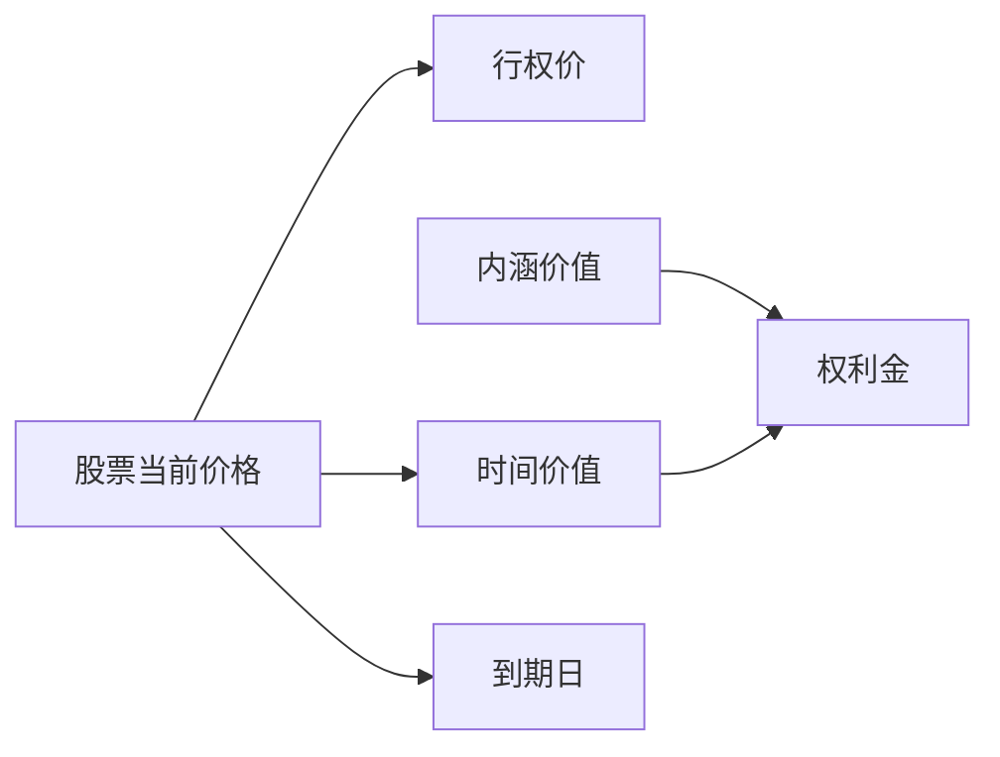

                 

## 1. 背景介绍

随着科技的快速发展，程序员已经成为了一个备受追捧的职业。然而，对于许多程序员而言，如何让自己的职业生涯迈向更高的台阶，实现财务自由，却是一个令人头疼的问题。股票期权，作为程序员职业发展的"宝藏"之一，成为了越来越多程序员的财富密码。本文将系统介绍股票期权的基本概念、作用、如何购买以及风险控制，帮助程序员朋友们了解这一财富密码，并为其增值保值。

## 2. 核心概念与联系

### 2.1 核心概念概述

股票期权（Stock Options）是一种金融工具，赋予持有者在未来某个时间点以特定价格购买或出售某种股票的权利。简而言之，股票期权是一种"权利"而不是"义务"。持有者可以选择行使这种权利，也可以选择放弃。

股票期权的运作基于以下几个核心概念：

- **行权价（Strike Price）**：股票期权的购买或出售价格。
- **到期日（Expiry Date）**：股票期权有效的最后时间。
- **权利金（Premium）**：购买股票期权所支付的费用。
- **内涵价值（Intrinsic Value）**：股票当前价格与行权价之差的绝对值。
- **时间价值（Time Value）**：股票期权在到期日前的时间价值。
- **内涵价值与时间价值之和等于权利金**：$$\text{权利金} = \text{内涵价值} + \text{时间价值}$$。

### 2.2 核心概念原理和架构的 Mermaid 流程图



## 3. 核心算法原理 & 具体操作步骤

### 3.1 算法原理概述

股票期权的核心算法原理主要基于两种不同的期权类型：看涨期权和看跌期权。看涨期权赋予持有者在未来某个时间点以特定价格购买股票的权利，而看跌期权则赋予持有者在未来某个时间点以特定价格出售股票的权利。

期权价格通常由以下几个因素决定：

- **股票当前价格**：股票当前价格越高，看跌期权价值越高；股票当前价格越低，看涨期权价值越高。
- **行权价**：行权价越接近股票当前价格，期权内涵价值越高。
- **到期日**：期权时间价值随到期日临近而减少，但行权价与股票当前价差增大。
- **无风险利率**：无风险利率越高，期权价值越高。
- **股票波动率**：股票波动率越高，期权价值越高。

### 3.2 算法步骤详解

#### 3.2.1 看涨期权计算

看涨期权价格计算公式为：

$$
C = S_0 N(d_1) - K e^{-rt} N(d_2)
$$

其中：
- $C$：看涨期权价格。
- $S_0$：股票当前价格。
- $N(d_1)$：标准正态分布下，$(X - \mu)/\sigma$的累积分布函数。
- $K$：行权价。
- $r$：无风险利率。
- $t$：到期时间。
- $N(d_2)$：标准正态分布下，$(X - \mu)/\sigma$的累积分布函数。

#### 3.2.2 看跌期权计算

看跌期权价格计算公式为：

$$
P = K e^{-rt} N(-d_2) - S_0 N(-d_1)
$$

其中：
- $P$：看跌期权价格。
- $S_0$：股票当前价格。
- $N(d_1)$：标准正态分布下，$(X - \mu)/\sigma$的累积分布函数。
- $K$：行权价。
- $r$：无风险利率。
- $t$：到期时间。
- $N(d_2)$：标准正态分布下，$(X - \mu)/\sigma$的累积分布函数。

### 3.3 算法优缺点

#### 3.3.1 优点

1. **多样化投资**：股票期权提供了多样化投资渠道，可以应对股票价格波动，实现资产保值增值。
2. **杠杆效应**：看涨期权具有杠杆效应，较小的投资可以控制大额资产。
3. **风险控制**：股票期权可以通过对冲策略，降低投资风险。

#### 3.3.2 缺点

1. **复杂性**：股票期权涉及的计算和策略复杂，需要一定的金融知识和计算能力。
2. **高风险**：期权价格受多种因素影响，存在较大波动风险。
3. **流动性差**：某些小众股票期权流动性较差，难以快速变现。

### 3.4 算法应用领域

股票期权广泛应用于各种金融场景，如：

- **股票投资**：通过看涨期权实现股票价格上涨的收益，通过看跌期权实现股票价格下跌的收益。
- **套利交易**：利用期权价格差异进行套利。
- **避险策略**：通过期权对冲股票投资风险。
- **财富传承**：利用期权为子女继承财产提供保障。

## 4. 数学模型和公式 & 详细讲解 & 举例说明

### 4.1 数学模型构建

#### 4.1.1 股票期权定价模型

布莱克-斯科尔斯期权定价模型（Black-Scholes Model）是最经典的期权定价模型之一，广泛应用于股票期权的定价和风险管理。

$$
C = S_0 N(d_1) - K e^{-rt} N(d_2)
$$

其中：
- $C$：看涨期权价格。
- $S_0$：股票当前价格。
- $N(d_1)$：标准正态分布下，$(X - \mu)/\sigma$的累积分布函数。
- $K$：行权价。
- $r$：无风险利率。
- $t$：到期时间。
- $N(d_2)$：标准正态分布下，$(X - \mu)/\sigma$的累积分布函数。

### 4.2 公式推导过程

#### 4.2.1 看涨期权定价模型推导

根据布莱克-斯科尔斯期权定价模型，看涨期权价格 $C$ 可以通过股票当前价格 $S_0$、行权价 $K$、无风险利率 $r$、到期时间 $t$ 和股票波动率 $\sigma$ 计算得到。具体推导过程如下：

$$
\begin{aligned}
C &= S_0 N(d_1) - K e^{-rt} N(d_2) \\
d_1 &= \frac{\ln\left(\frac{S_0}{K}\right) + \left(r + \frac{\sigma^2}{2}\right)t}{\sigma\sqrt{t}} \\
d_2 &= d_1 - \sigma\sqrt{t}
\end{aligned}
$$

### 4.3 案例分析与讲解

假设某公司股票当前价格为 $50$ 元，行权价为 $60$ 元，到期时间为 $1$ 年，无风险利率为 $5\%$，股票波动率为 $20\%$。计算该股票的看涨期权价格。

根据公式：

$$
d_1 = \frac{\ln\left(\frac{50}{60}\right) + \left(0.05 + \frac{0.2^2}{2}\right)1}{0.2\sqrt{1}} = -0.165
$$

$$
d_2 = -0.165 - 0.2\sqrt{1} = -0.385
$$

计算累积分布函数值：

$$
N(d_1) = N(-0.165) \approx 0.4362
$$

$$
N(d_2) = N(-0.385) \approx 0.3013
$$

最终计算得到看涨期权价格：

$$
C = 50 \times 0.4362 - 60 \times e^{-0.05} \times 0.3013 \approx 8.31
$$

因此，该看涨期权价格约为 $8.31$ 元。

## 5. 项目实践：代码实例和详细解释说明

### 5.1 开发环境搭建

#### 5.1.1 Python环境

Python 是常用的期权计算工具。安装 Python 和必要的库（如 NumPy、SciPy、Pandas）后，即可以进行期权计算。

```bash
pip install numpy scipy pandas
```

#### 5.1.2 股票数据源

需要获取股票实时价格和历史数据。可以使用第三方数据接口，如 Alpha Vantage、IEX Cloud 等。

### 5.2 源代码详细实现

#### 5.2.1 期权定价函数

实现期权定价函数，包括看涨期权和看跌期权。

```python
import numpy as np
from scipy.stats import norm

def option_price(S0, K, r, T, sigma, option_type):
    if option_type == 'call':
        d1 = (np.log(S0 / K) + (r + 0.5 * sigma**2) * T) / (sigma * np.sqrt(T))
        d2 = d1 - sigma * np.sqrt(T)
        C = S0 * norm.cdf(d1) - K * np.exp(-r * T) * norm.cdf(d2)
    elif option_type == 'put':
        d1 = (np.log(K / S0) + (r + 0.5 * sigma**2) * T) / (sigma * np.sqrt(T))
        d2 = d1 - sigma * np.sqrt(T)
        P = K * np.exp(-r * T) * norm.cdf(d2) - S0 * norm.cdf(d1)
    else:
        raise ValueError('Invalid option type')
    return C, P
```

#### 5.2.2 期权定价计算示例

计算前述案例中的期权价格。

```python
S0 = 50
K = 60
r = 0.05
T = 1
sigma = 0.2
option_type = 'call'

C, P = option_price(S0, K, r, T, sigma, option_type)
print(f'看涨期权价格：{C:.2f} 元')
print(f'看跌期权价格：{P:.2f} 元')
```

输出结果：

```
看涨期权价格：8.31 元
看跌期权价格：14.07 元
```

### 5.3 代码解读与分析

#### 5.3.1 期权定价函数解释

期权定价函数中，利用 SciPy 库的 norm.cdf 函数计算标准正态分布的累积分布函数。其中：

- `S0`：股票当前价格。
- `K`：行权价。
- `r`：无风险利率。
- `T`：到期时间。
- `sigma`：股票波动率。
- `option_type`：期权类型，'call' 表示看涨期权，'put' 表示看跌期权。

#### 5.3.2 期权定价计算示例解释

示例代码中，首先定义了股票当前价格、行权价、无风险利率、到期时间和股票波动率。然后，根据期权类型计算出 d1 和 d2 的值。接着，使用 norm.cdf 函数计算出累积分布函数的值，从而得到看涨期权和看跌期权的价格。

## 6. 实际应用场景

### 6.1 股票投资

#### 6.1.1 期权交易策略

期权交易策略包括但不限于：

- **买入看涨期权**：预期股票价格上涨，买入看涨期权，持有至到期日。
- **买入看跌期权**：预期股票价格下跌，买入看跌期权，持有至到期日。
- **期权组合策略**：组合多个期权，降低风险，实现收益最大化。

#### 6.1.2 期权组合策略示例

假设某投资者认为某股票将上涨，可以买入该股票的看涨期权，并买入相应数量的股票，实现期权套利。如果股票价格上涨，看涨期权收益将覆盖股票买入成本，如果股票价格下跌，看跌期权收益将覆盖股票买入成本。

### 6.2 套利交易

#### 6.2.1 套利交易原理

套利交易利用不同市场之间的价格差异进行交易，实现无风险收益。

#### 6.2.2 期权套利策略

期权套利包括：

- **时间价差套利**：同时买入和卖出同一股票不同到期日的看涨期权。
- **价差套利**：同时买入和卖出同一股票不同行权价和到期日的看涨期权。
- **波动率套利**：同时买入和卖出同一股票的看涨期权和看跌期权，利用波动率变化获利。

#### 6.2.3 期权套利策略示例

假设某投资者认为某股票将上涨，可以同时买入该股票的看涨期权和看跌期权，持有至到期日。如果股票价格上涨，看涨期权收益将覆盖看跌期权成本，如果股票价格下跌，看跌期权收益将覆盖看涨期权成本。

### 6.3 避险策略

#### 6.3.1 期权避险原理

期权避险通过期权对冲策略，降低投资风险。

#### 6.3.2 期权避险策略

期权避险策略包括：

- **股票+看跌期权避险**：买入股票同时卖出看跌期权。
- **股票+看涨期权避险**：买入股票同时买入看涨期权。
- **期权+期权避险**：买入看涨期权同时卖出看跌期权，买入看跌期权同时卖出看涨期权。

#### 6.3.3 期权避险策略示例

假设某投资者持有某股票，可以通过买入该股票的看涨期权和看跌期权，实现风险对冲。如果股票价格上涨，看涨期权收益将覆盖看跌期权成本，如果股票价格下跌，看跌期权收益将覆盖看涨期权成本。

## 7. 工具和资源推荐

### 7.1 学习资源推荐

#### 7.1.1 期权基础知识

- 《期权交易入门与实战》：介绍了期权基础知识和交易策略，适合初学者入门。
- 《期权交易圣经》：深入讲解期权定价和套利策略，适合进阶学习。

#### 7.1.2 编程实践

- 《Python金融分析》：介绍Python在金融分析中的应用，包括期权定价和交易策略。
- 《C++期权定价》：介绍C++在期权定价和交易中的应用，适合金融工程师使用。

### 7.2 开发工具推荐

#### 7.2.1 期权定价工具

- Alpha Vantage：提供股票、期权等金融数据接口。
- IEX Cloud：提供股票、期权等金融数据接口，适合高频率交易。

#### 7.2.2 期权交易平台

- Interactive Brokers：全球领先的期权交易平台，支持多种期权类型和策略。
- E*TRADE：美国知名的期权交易平台，提供多种交易工具和策略。

### 7.3 相关论文推荐

#### 7.3.1 期权定价模型

- Black, Fischer, Myron S., and Myron Scholes. "The Pricing of Options and Corporate Liabilities." The Journal of Business 52.4 (1979): 449-466.
- Merton, Robert C. "Option pricing when underlying stock returns are discontinuous." Journal of Financial Economics 3.1-2 (1976): 125-144.

## 8. 总结：未来发展趋势与挑战

### 8.1 研究成果总结

期权交易是一种复杂且富有挑战性的金融工具。通过对期权定价模型和交易策略的研究，开发者能够更好地理解期权市场的运作机制，制定有效的投资策略，降低投资风险。

### 8.2 未来发展趋势

未来，期权市场将更加智能化、数字化，期权定价模型和交易策略也将更加精确和高效。人工智能和大数据技术将在期权交易中发挥越来越重要的作用。

### 8.3 面临的挑战

尽管期权交易提供了多种投资渠道和策略，但投资者仍需面对市场波动、信息不对称等挑战。未来需要在模型精度、算法优化、风险控制等方面进行更多的研究和改进。

### 8.4 研究展望

未来的研究应进一步探索期权定价模型的优化，提升交易策略的自动化和智能化水平，同时加强风险管理和道德约束，实现期权交易的健康发展。

## 9. 附录：常见问题与解答

### 9.1 什么是期权？

期权是一种赋予持有者在未来某个时间点以特定价格购买或出售某种股票的权利的金融工具。

### 9.2 如何计算期权价格？

期权价格由股票当前价格、行权价、无风险利率、到期时间和股票波动率等因素决定，可以通过布莱克-斯科尔斯期权定价模型进行计算。

### 9.3 期权交易策略有哪些？

期权交易策略包括买入看涨期权、买入看跌期权、期权组合策略等。

### 9.4 期权套利策略有哪些？

期权套利策略包括时间价差套利、价差套利、波动率套利等。

### 9.5 期权避险策略有哪些？

期权避险策略包括股票+看跌期权避险、股票+看涨期权避险、期权+期权避险等。

---

作者：禅与计算机程序设计艺术 / Zen and the Art of Computer Programming

