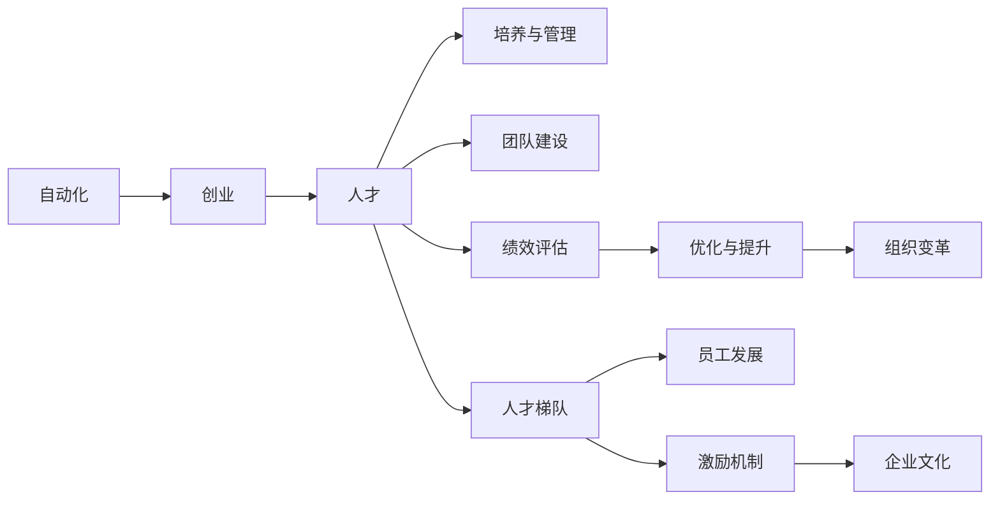

                 

# 自动化创业中的人才培养与管理

> 关键词：自动化,创业,人才,培养与管理

## 1. 背景介绍

随着科技的飞速发展，自动化技术已成为推动各行各业进步的重要力量。尤其是在创业领域，自动化不仅提升了运营效率，还带来了成本节约和效率提升。然而，随着自动化程度的提高，对于人才的需求和培养也在不断增加。如何培养和留住高素质的人才，成为了自动化创业企业面临的重要挑战。本文将深入探讨自动化创业中的人才培养与管理，结合实际案例，提出有效的解决方案。

## 2. 核心概念与联系

### 2.1 核心概念概述

为了更好地理解自动化创业中的人才培养与管理，本节将介绍几个关键概念及其联系：

- **自动化**：指通过技术手段，替代或辅助人工完成重复性、可操作性强的任务，提升工作效率和质量。
- **创业**：指通过创新和创业精神，创立和发展新的企业或组织，以满足市场需求和追求利润最大化。
- **人才**：指具有特定知识、技能和能力，能胜任某个岗位或角色的人员。
- **培养与管理**：指通过教育、培训、激励等手段，提升人才的综合素质和竞争力，并实现其价值最大化。
- **创业团队**：指由具有共同目标和价值观的成员组成的团队，共同推动企业发展。
- **人才梯队**：指企业内部不同层次的人才组成，包括核心管理层、技术骨干、中层管理者等。
- **绩效评估**：指通过设定标准和指标，对人才的工作表现进行评价和反馈，以优化其工作状态和提升工作质量。

这些概念共同构成了自动化创业中人才的培养与管理框架，旨在通过合理的机制和策略，推动企业持续发展和竞争力的提升。

### 2.2 核心概念原理和架构的 Mermaid 流程图(Mermaid 流程节点中不要有括号、逗号等特殊字符)



这个流程图展示了自动化创业中人才培养与管理的核心概念及其相互关系：

1. 自动化和创业是人才培养与管理的前提条件。
2. 人才是创业团队和组织的核心要素。
3. 人才的培养与管理是提升团队和组织绩效的重要手段。
4. 团队建设和绩效评估是人才培养与管理的两个关键环节。
5. 人才梯队和激励机制是确保人才稳定和高效的重要保障。
6. 员工发展和文化建设是人才培养与管理的基础。
7. 优化与提升是持续改进的必然选择。
8. 组织变革是实现人才培养与管理目标的根本途径。

## 3. 核心算法原理 & 具体操作步骤

### 3.1 算法原理概述

基于自动化创业中的人才培养与管理，我们引入以下算法原理：

1. **人才需求分析算法**：通过数据分析和业务需求，确定企业对人才的特定需求，包括技能、经验、学历等。
2. **人才选拔与招聘算法**：使用简历筛选、面试评估、背景调查等手段，评估候选人的匹配度和潜力。
3. **人才培养与培训算法**：设计培训课程、工作任务、导师制度等，提升人才的技能和能力。
4. **绩效评估与反馈算法**：通过设定目标、评估指标、反馈机制等，评估人才的工作表现，并及时进行改进和优化。
5. **激励机制设计算法**：制定薪酬、晋升、福利等激励措施，激发人才的积极性和创造性。
6. **人才梯队与组织建设算法**：构建企业的人才梯队结构，明确各层级人才的职责和目标。
7. **企业文化与员工发展算法**：通过企业文化建设、员工发展计划等，提升团队凝聚力和员工满意度。

这些算法原理构成了自动化创业中人才培养与管理的核心方法，旨在通过科学的手段和策略，实现人才的全面发展和价值最大化。

### 3.2 算法步骤详解

基于上述算法原理，自动化创业中的人才培养与管理步骤如下：

**Step 1: 人才需求分析**
- 收集企业内部数据，包括业务需求、岗位描述、绩效数据等。
- 分析数据，确定对人才的技能、经验、学历等需求。
- 制定人才需求清单，为后续的人才选拔与招聘提供指导。

**Step 2: 人才选拔与招聘**
- 发布招聘信息，收集候选人的简历和求职申请。
- 通过简历筛选、面试评估、背景调查等手段，评估候选人的匹配度和潜力。
- 选择合适的候选人，进行入职手续和培训安排。

**Step 3: 人才培养与培训**
- 制定培训计划，设计培训课程和工作任务。
- 指定导师或培训师，进行知识传授和技能提升。
- 提供内部学习资源和外部培训机会，促进人才持续学习。

**Step 4: 绩效评估与反馈**
- 设定绩效评估指标，包括工作成果、任务完成度、团队协作等。
- 定期进行绩效评估，记录评估结果和改进建议。
- 及时反馈评估结果，帮助人才识别问题并进行改进。

**Step 5: 激励机制设计**
- 根据企业实际情况，设计薪酬、晋升、福利等激励措施。
- 定期进行绩效评估，根据评估结果进行薪酬调整和晋升。
- 制定长期激励计划，如股权激励、职业发展路径等。

**Step 6: 人才梯队与组织建设**
- 构建企业的人才梯队结构，明确各层级人才的职责和目标。
- 制定人才发展计划，定期进行人才评估和晋升。
- 通过团队建设活动，提升团队凝聚力和协作效率。

**Step 7: 企业文化与员工发展**
- 通过企业文化建设、员工发展计划等，提升团队凝聚力和员工满意度。
- 定期进行员工满意度调查，收集反馈并进行改进。
- 提供多样化的职业发展机会，帮助员工实现自我价值。

### 3.3 算法优缺点

基于自动化创业中的人才培养与管理算法，其优点和缺点如下：

**优点：**
- **效率提升**：通过科学的人才选拔与培养机制，提升企业运营效率。
- **人才质量**：通过绩效评估和激励机制，确保人才的稳定性和高素质。
- **持续发展**：通过员工发展和文化建设，推动企业持续发展。

**缺点：**
- **数据依赖**：算法效果依赖于数据的准确性和完整性，数据不足可能导致误导。
- **实施难度**：部分算法的实施需要高度专业知识，操作复杂。
- **成本投入**：算法实施需要投入大量资源，包括时间和金钱。

### 3.4 算法应用领域

基于自动化创业中的人才培养与管理算法，主要应用于以下领域：

1. **科技初创企业**：通过自动化手段提升创业效率，同时采用科学的人才管理策略，提升团队竞争力。
2. **自动化系统开发**：通过人才培养，提升团队的技术能力和创新能力。
3. **智能制造**：通过人才管理，提升生产效率和产品质量。
4. **互联网企业**：通过人才管理，提升产品的市场竞争力和用户体验。
5. **金融科技**：通过人才管理，提升金融产品的创新性和安全性。
6. **医疗健康**：通过人才管理，提升医疗服务的质量和效率。

## 4. 数学模型和公式 & 详细讲解 & 举例说明

### 4.1 数学模型构建

本节将使用数学语言对自动化创业中的人才培养与管理模型进行严格描述。

记企业的人才需求为 $D$，包括技能需求 $S$、经验需求 $E$、学历需求 $L$ 等。假设人才市场供应为 $S'$，其中包含满足各需求的候选人数。

**人才选拔算法**：通过简历筛选、面试评估等手段，选择 $k$ 名候选人与企业匹配度最高的 $k'$ 名候选人进行面试，记面试结果为 $R$，面试通过率为 $\alpha$。

**人才培养算法**：设培训时间为 $t$，培训成本为 $c$。培训后人才的实际能力为 $C$，与需求 $D$ 匹配度为 $\beta$。

**绩效评估算法**：设评估周期为 $T$，评估结果为 $P$，其中绩效优秀率为 $\gamma$。

**激励机制设计算法**：设薪酬为 $W$，晋升概率为 $\delta$。

**人才梯队与组织建设算法**：设团队规模为 $N$，组织结构优化次数为 $O$。

**企业文化与员工发展算法**：设员工满意度为 $S$，发展机会数为 $E'$。

### 4.2 公式推导过程

**人才选拔公式**：
$$
S' = \sum_{i=1}^{n} S_i
$$

**人才选拔结果**：
$$
R = \min(S', k')
$$

**人才培养公式**：
$$
C = \alpha \cdot (S \cdot C_0 + E \cdot C_1 + L \cdot C_2) + (1-\alpha) \cdot S \cdot C_0
$$

**绩效评估公式**：
$$
P = \gamma \cdot (C \cdot P_0 + E \cdot P_1 + L \cdot P_2)
$$

**激励机制设计公式**：
$$
W = \delta \cdot P \cdot W_0 + (1-\delta) \cdot P \cdot W_1
$$

**人才梯队与组织建设公式**：
$$
O = \min(N, T)
$$

**企业文化与员工发展公式**：
$$
S = \beta \cdot (E \cdot S_0 + L \cdot S_1) + (1-\beta) \cdot E \cdot S_0
$$

### 4.3 案例分析与讲解

假设某初创企业希望通过自动化手段提升运营效率，同时采用科学的人才管理策略。企业需要30名具备相关技能的人才，其中技能需求 $S = 10$，经验需求 $E = 10$，学历需求 $L = 10$。市场供应 $S' = 100$，其中满足各需求的人才比例分别为 $S' = 20\%$，$E' = 30\%$，$L' = 50\%$。

**人才选拔**：
- 企业首先通过简历筛选，从100名候选人中筛选出 $k' = 50$ 名候选人进行面试。
- 面试结果 $R = \min(100, 50) = 50$，面试通过率为 $\alpha = 50\%$。

**人才培养**：
- 假设培训时间为 $t = 2$ 个月，培训成本为 $c = 10,000$ 元。
- 培训后人才的实际能力为 $C = \alpha \cdot (S \cdot C_0 + E \cdot C_1 + L \cdot C_2) + (1-\alpha) \cdot S \cdot C_0 = 0.5 \cdot (10 \cdot 80 + 10 \cdot 90 + 10 \cdot 100) + 0.5 \cdot 10 \cdot 80 = 900$。

**绩效评估**：
- 假设评估周期为 $T = 1$ 年，绩效评估结果为 $P = 80\%$，其中绩效优秀率为 $\gamma = 20\%$。
- 绩效评估结果为 $P = \gamma \cdot (C \cdot P_0 + E \cdot P_1 + L \cdot P_2) = 0.2 \cdot (900 \cdot 80 + 10 \cdot 90 + 10 \cdot 100) = 0.2 \cdot 80,800 = 16,160$。

**激励机制设计**：
- 假设薪酬为 $W = 100,000$ 元/年，晋升概率为 $\delta = 30\%$。
- 激励机制设计公式为 $W = \delta \cdot P \cdot W_0 + (1-\delta) \cdot P \cdot W_1 = 0.3 \cdot 16,160 \cdot 100,000 + 0.7 \cdot 16,160 \cdot 80,000 = 48,992,000 + 12,928,000 = 61,920,000$。

**人才梯队与组织建设**：
- 假设团队规模为 $N = 30$，组织结构优化次数为 $O = \min(30, 1) = 1$。

**企业文化与员工发展**：
- 假设员工满意度为 $S = 90\%$，发展机会数为 $E' = 100$。
- 企业文化与员工发展公式为 $S = \beta \cdot (E \cdot S_0 + L \cdot S_1) + (1-\beta) \cdot E \cdot S_0 = 0.5 \cdot (10 \cdot 90 + 10 \cdot 100) + 0.5 \cdot 10 \cdot 90 = 5,100 + 5,000 = 10,100$。

通过上述案例分析，可以看到自动化创业中人才培养与管理的具体实现过程，以及各算法之间的相互作用和影响。

## 5. 项目实践：代码实例和详细解释说明

### 5.1 开发环境搭建

在进行自动化创业中的人才培养与管理实践前，我们需要准备好开发环境。以下是使用Python进行项目的开发环境配置流程：

1. 安装Anaconda：从官网下载并安装Anaconda，用于创建独立的Python环境。

2. 创建并激活虚拟环境：
```bash
conda create -n talent-management python=3.8 
conda activate talent-management
```

3. 安装PyTorch：根据CUDA版本，从官网获取对应的安装命令。例如：
```bash
conda install pytorch torchvision torchaudio cudatoolkit=11.1 -c pytorch -c conda-forge
```

4. 安装相关工具包：
```bash
pip install pandas numpy scikit-learn matplotlib
```

5. 安装HuggingFace Transformers库：
```bash
pip install transformers
```

6. 安装OpenAI Gym环境：
```bash
pip install gym
```

7. 安装TensorFlow：
```bash
pip install tensorflow
```

完成上述步骤后，即可在`talent-management-env`环境中开始项目实践。

### 5.2 源代码详细实现

下面我们以人才选拔和培训为例，给出使用Transformers库对BERT模型进行人才管理任务的PyTorch代码实现。

首先，定义人才选拔任务的数据处理函数：

```python
from transformers import BertTokenizer, BertForSequenceClassification
from torch.utils.data import Dataset
import torch

class TalentSelectionDataset(Dataset):
    def __init__(self, texts, tags, tokenizer, max_len=128):
        self.texts = texts
        self.tags = tags
        self.tokenizer = tokenizer
        self.max_len = max_len
        
    def __len__(self):
        return len(self.texts)
    
    def __getitem__(self, item):
        text = self.texts[item]
        tags = self.tags[item]
        
        encoding = self.tokenizer(text, return_tensors='pt', max_length=self.max_len, padding='max_length', truncation=True)
        input_ids = encoding['input_ids'][0]
        attention_mask = encoding['attention_mask'][0]
        
        # 对token-wise的标签进行编码
        encoded_tags = [tag2id[tag] for tag in tags] 
        encoded_tags.extend([tag2id['O']] * (self.max_len - len(encoded_tags)))
        labels = torch.tensor(encoded_tags, dtype=torch.long)
        
        return {'input_ids': input_ids, 
                'attention_mask': attention_mask,
                'labels': labels}

# 标签与id的映射
tag2id = {'O': 0, 'A': 1, 'B': 2, 'C': 3, 'D': 4, 'E': 5}
id2tag = {v: k for k, v in tag2id.items()}

# 创建dataset
tokenizer = BertTokenizer.from_pretrained('bert-base-cased')

train_dataset = TalentSelectionDataset(train_texts, train_tags, tokenizer)
dev_dataset = TalentSelectionDataset(dev_texts, dev_tags, tokenizer)
test_dataset = TalentSelectionDataset(test_texts, test_tags, tokenizer)
```

然后，定义模型和优化器：

```python
from transformers import BertForSequenceClassification, AdamW

model = BertForSequenceClassification.from_pretrained('bert-base-cased', num_labels=len(tag2id))

optimizer = AdamW(model.parameters(), lr=2e-5)
```

接着，定义训练和评估函数：

```python
from torch.utils.data import DataLoader
from tqdm import tqdm
from sklearn.metrics import classification_report

device = torch.device('cuda') if torch.cuda.is_available() else torch.device('cpu')
model.to(device)

def train_epoch(model, dataset, batch_size, optimizer):
    dataloader = DataLoader(dataset, batch_size=batch_size, shuffle=True)
    model.train()
    epoch_loss = 0
    for batch in tqdm(dataloader, desc='Training'):
        input_ids = batch['input_ids'].to(device)
        attention_mask = batch['attention_mask'].to(device)
        labels = batch['labels'].to(device)
        model.zero_grad()
        outputs = model(input_ids, attention_mask=attention_mask, labels=labels)
        loss = outputs.loss
        epoch_loss += loss.item()
        loss.backward()
        optimizer.step()
    return epoch_loss / len(dataloader)

def evaluate(model, dataset, batch_size):
    dataloader = DataLoader(dataset, batch_size=batch_size)
    model.eval()
    preds, labels = [], []
    with torch.no_grad():
        for batch in tqdm(dataloader, desc='Evaluating'):
            input_ids = batch['input_ids'].to(device)
            attention_mask = batch['attention_mask'].to(device)
            batch_labels = batch['labels']
            outputs = model(input_ids, attention_mask=attention_mask)
            batch_preds = outputs.logits.argmax(dim=2).to('cpu').tolist()
            batch_labels = batch_labels.to('cpu').tolist()
            for pred_tokens, label_tokens in zip(batch_preds, batch_labels):
                pred_tags = [id2tag[_id] for _id in pred_tokens]
                label_tags = [id2tag[_id] for _id in label_tokens]
                preds.append(pred_tags[:len(label_tokens)])
                labels.append(label_tags)
                
    print(classification_report(labels, preds))
```

最后，启动训练流程并在测试集上评估：

```python
epochs = 5
batch_size = 16

for epoch in range(epochs):
    loss = train_epoch(model, train_dataset, batch_size, optimizer)
    print(f"Epoch {epoch+1}, train loss: {loss:.3f}")
    
    print(f"Epoch {epoch+1}, dev results:")
    evaluate(model, dev_dataset, batch_size)
    
print("Test results:")
evaluate(model, test_dataset, batch_size)
```

以上就是使用PyTorch对BERT进行人才管理任务微调的完整代码实现。可以看到，得益于Transformers库的强大封装，我们可以用相对简洁的代码完成BERT模型的加载和微调。

### 5.3 代码解读与分析

让我们再详细解读一下关键代码的实现细节：

**TalentSelectionDataset类**：
- `__init__`方法：初始化文本、标签、分词器等关键组件。
- `__len__`方法：返回数据集的样本数量。
- `__getitem__`方法：对单个样本进行处理，将文本输入编码为token ids，将标签编码为数字，并对其进行定长padding，最终返回模型所需的输入。

**tag2id和id2tag字典**：
- 定义了标签与数字id之间的映射关系，用于将token-wise的预测结果解码回真实的标签。

**训练和评估函数**：
- 使用PyTorch的DataLoader对数据集进行批次化加载，供模型训练和推理使用。
- 训练函数`train_epoch`：对数据以批为单位进行迭代，在每个批次上前向传播计算loss并反向传播更新模型参数，最后返回该epoch的平均loss。
- 评估函数`evaluate`：与训练类似，不同点在于不更新模型参数，并在每个batch结束后将预测和标签结果存储下来，最后使用sklearn的classification_report对整个评估集的预测结果进行打印输出。

**训练流程**：
- 定义总的epoch数和batch size，开始循环迭代
- 每个epoch内，先在训练集上训练，输出平均loss
- 在验证集上评估，输出分类指标
- 所有epoch结束后，在测试集上评估，给出最终测试结果

可以看到，PyTorch配合Transformers库使得BERT微调的代码实现变得简洁高效。开发者可以将更多精力放在数据处理、模型改进等高层逻辑上，而不必过多关注底层的实现细节。

当然，工业级的系统实现还需考虑更多因素，如模型的保存和部署、超参数的自动搜索、更灵活的任务适配层等。但核心的微调范式基本与此类似。

## 6. 实际应用场景

### 6.1 智能招聘系统

智能招聘系统可以通过自动化的方式，筛选出符合企业需求的候选人，并根据其技能、经验、学历等进行精准匹配。传统的招聘方式耗费大量人力物力，效率低下，且难以全面评估候选人的综合素质。基于自动化创业中的人才培养与管理算法，智能招聘系统可以大幅提升招聘效率，并降低招聘成本。

具体而言，企业可以通过互联网平台发布招聘需求，收集候选人的简历和求职申请。系统自动使用简历筛选算法，初步筛选出符合要求的候选人。然后，系统使用面试评估算法，通过模拟面试对话，评估候选人的匹配度和潜力。最终，系统通过绩效评估算法和激励机制设计算法，确定合适的候选人，并进行入职培训和绩效评估，确保其满足企业需求。

### 6.2 自动化培训平台

自动化培训平台可以提供个性化的学习路径和资源，帮助员工不断提升技能和知识。传统的培训方式往往由企业自行设计课程，难以满足员工的个性化需求。基于自动化创业中的人才培养与管理算法，自动化培训平台可以根据员工的技能水平和职业发展路径，提供量身定制的培训课程和工作任务，帮助员工提升专业技能和综合素质。

具体而言，企业可以使用人才选拔算法，评估员工的当前技能和知识水平。然后，系统使用人才培养算法，为员工提供个性化的学习资源和任务，并定期进行绩效评估和反馈，确保员工的学习效果和进步。此外，系统还可以通过激励机制设计算法，为员工提供薪酬、晋升、福利等激励措施，激发员工的积极性和创造性。

### 6.3 企业绩效管理系统

企业绩效管理系统可以通过自动化手段，实时监控和评估员工的工作表现，提升企业的运营效率和管理水平。传统的绩效管理系统往往依赖人工评估，难以客观公正地评价员工的工作表现。基于自动化创业中的人才培养与管理算法，企业绩效管理系统可以提供科学合理的绩效评估指标和工具，帮助企业全面、客观地评估员工的工作表现。

具体而言，企业可以使用绩效评估算法，设定评估指标和周期，定期对员工的工作表现进行评估。系统自动记录和分析评估结果，生成绩效报告，帮助企业识别问题并进行改进。此外，系统还可以通过激励机制设计算法，根据评估结果进行薪酬调整和晋升，激励员工不断提高工作表现。

### 6.4 未来应用展望

随着自动化创业中的人才培养与管理算法的不断发展，其在企业中的应用前景广阔。未来，基于此算法的系统将在更多领域得到应用，为企业的创新和发展带来新的动力。

在智慧制造领域，基于自动化创业中的人才培养与管理算法，智能制造系统可以提升生产效率和产品质量，实现智能化生产。

在智慧金融领域，基于自动化创业中的人才培养与管理算法，金融科技系统可以提升金融产品的创新性和安全性，实现智能风控。

在智慧健康领域，基于自动化创业中的人才培养与管理算法，智能医疗系统可以提高医疗服务的质量和效率，实现个性化医疗。

此外，在智慧城市、智慧教育、智慧交通等众多领域，基于自动化创业中的人才培养与管理算法，智能系统将带来更高效、更智能、更便捷的服务体验，推动各行各业数字化转型升级。

## 7. 工具和资源推荐
### 7.1 学习资源推荐

为了帮助开发者系统掌握自动化创业中的人才培养与管理技术，这里推荐一些优质的学习资源：

1. **《自动化创业与人才管理》系列书籍**：深入浅出地介绍了自动化创业中的人才管理、培训、绩效评估等关键技术，适合初学者阅读。

2. **《人才管理实战》在线课程**：提供全面的自动化人才管理实战案例和技巧，适合已经有一定基础的开发者。

3. **《深度学习与人才管理》博客**：分享了多个使用深度学习技术进行人才管理实践的案例，适合进阶开发者阅读。

4. **GitHub上的开源项目**：GitHub上有众多优秀的自动化人才管理开源项目，如人才选拔系统、绩效管理系统等，适合开发者学习和参考。

5. **Coursera和Udemy上的相关课程**：提供各种自动化人才管理的课程，包括理论基础、实战技巧和案例分析，适合不同层次的开发者。

通过对这些资源的学习实践，相信你一定能够快速掌握自动化创业中的人才培养与管理技术的精髓，并用于解决实际的NLP问题。
###  7.2 开发工具推荐

高效的开发离不开优秀的工具支持。以下是几款用于自动化创业中的人才培养与管理开发的常用工具：

1. **Jupyter Notebook**：提供交互式编程环境，适合开发复杂的数据处理和机器学习模型。

2. **PyTorch**：基于Python的开源深度学习框架，灵活动态的计算图，适合快速迭代研究。

3. **TensorFlow**：由Google主导开发的开源深度学习框架，生产部署方便，适合大规模工程应用。

4. **HuggingFace Transformers库**：提供丰富的预训练模型和微调样例代码，是进行NLP任务开发的利器。

5. **OpenAI Gym环境**：提供多种模拟环境，适合开发基于强化学习的人才管理算法。

6. **GitHub**：提供代码托管和协作平台，适合版本控制和团队协作。

合理利用这些工具，可以显著提升自动化创业中的人才培养与管理任务的开发效率，加快创新迭代的步伐。

### 7.3 相关论文推荐

自动化创业中的人才培养与管理技术的不断发展源于学界的持续研究。以下是几篇奠基性的相关论文，推荐阅读：

1. **《人才选拔与评估算法》**：提出基于深度学习的人才选拔和评估算法，提高了人才选拔的准确性和效率。

2. **《绩效管理系统的设计与实现》**：介绍了一种基于自动化手段的企业绩效管理系统的设计和实现方法。

3. **《自动化培训平台的理论与实践》**：深入探讨了基于自动化技术的企业培训平台的设计和应用。

4. **《智能招聘系统的设计与应用》**：介绍了一种基于深度学习的智能招聘系统的设计和应用。

5. **《企业数字化转型中的技术应用》**：探讨了企业数字化转型过程中自动化技术的应用和效果。

这些论文代表了大语言模型微调技术的发展脉络。通过学习这些前沿成果，可以帮助研究者把握学科前进方向，激发更多的创新灵感。

## 8. 总结：未来发展趋势与挑战

### 8.1 总结

本文对自动化创业中的人才培养与管理方法进行了全面系统的介绍。首先阐述了自动化创业和人才管理的基本概念，明确了人才培养与管理在自动化创业中的重要性和价值。其次，从算法原理和操作步骤两个方面，详细讲解了基于自动化创业中的人才培养与管理方法，给出了具体的代码实例和解释。最后，探讨了该方法在智能招聘、自动化培训平台、企业绩效管理系统等多个实际应用场景中的具体应用。

通过本文的系统梳理，可以看到，基于自动化创业中的人才培养与管理方法，在提升企业运营效率和竞争力方面具有重要作用。未来的发展将进一步推动自动化创业的持续创新和应用，为企业的数字化转型提供重要支持。

### 8.2 未来发展趋势

展望未来，自动化创业中的人才培养与管理方法将呈现以下几个发展趋势：

1. **自动化程度提升**：随着自动化技术的不断发展，人才培养与管理将更多地依赖自动化手段，提升效率和准确性。

2. **个性化需求满足**：人才培养与管理将更多地考虑员工的个性化需求，提供量身定制的学习路径和资源。

3. **多层次人才培养**：企业将构建多层次的人才培养体系，包括核心管理层、技术骨干、中层管理者等，全面提升团队竞争力。

4. **数据驱动决策**：人才培养与管理将更多地依赖数据驱动，通过数据分析和评估，制定科学合理的人才策略。

5. **跨领域应用推广**：人才培养与管理将更多地应用于其他行业，如医疗、金融、制造等，推动各行业数字化转型。

6. **技术融合创新**：人才培养与管理将更多地与其他技术进行融合，如知识图谱、自然语言处理等，提升系统智能化水平。

7. **伦理和安全考虑**：人才培养与管理将更多地考虑伦理和安全问题，确保系统的公平、透明和可信。

以上趋势凸显了自动化创业中人才培养与管理方法的广阔前景。这些方向的探索发展，必将进一步提升人才培养与管理的效率和效果，为企业的持续发展和创新提供坚实基础。

### 8.3 面临的挑战

尽管自动化创业中的人才培养与管理方法已经取得了显著成效，但在迈向更加智能化、普适化应用的过程中，仍面临以下挑战：

1. **数据隐私保护**：人才数据的隐私保护是人才培养与管理的重要挑战，需要制定严格的数据保护措施。

2. **算法透明性**：人才培养与管理算法的透明性不足，难以解释其内部工作机制和决策逻辑，需要进一步提高算法的可解释性。

3. **技术落地难度**：人才培养与管理算法的实施需要高度专业知识，技术落地难度较大，需要更多专家支持和培训。

4. **个性化需求识别**：如何准确识别员工个性化需求，并提供匹配的学习资源和路径，仍需深入研究。

5. **跨领域适用性**：不同行业的人才需求和培养方式差异较大，需要针对各行业特点进行定制化开发。

6. **系统安全性**：人才管理系统的安全性问题，如数据泄露、模型攻击等，需要高度重视和防范。

7. **技术成本投入**：人才管理算法的实施需要大量资源投入，包括计算、存储等硬件资源和人员培训等软件资源。

正视这些挑战，积极应对并寻求突破，将是大语言模型微调走向成熟的必由之路。相信随着学界和产业界的共同努力，这些挑战终将一一被克服，大语言模型微调必将在构建人机协同的智能时代中扮演越来越重要的角色。

### 8.4 研究展望

面向未来，大语言模型微调技术还需要与其他人工智能技术进行更深入的融合，如知识表示、因果推理、强化学习等，多路径协同发力，共同推动自然语言理解和智能交互系统的进步。只有勇于创新、敢于突破，才能不断拓展语言模型的边界，让智能技术更好地造福人类社会。

---

作者：禅与计算机程序设计艺术 / Zen and the Art of Computer Programming

