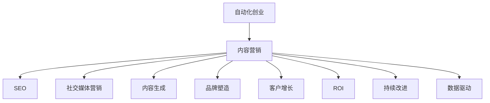

                 

# 自动化创业中的内容营销策略

> 关键词：自动化创业,内容营销,SEO,社交媒体营销,内容生成,品牌塑造,客户增长,ROI,持续改进,数据驱动

## 1. 背景介绍

随着人工智能(AI)和自动化技术的发展，自动化创业成为了一种新的创业模式。通过利用自动化技术，企业可以在更短的时间内完成产品开发、市场推广、客户服务等多方面的任务，从而快速实现规模化和商业化。在这个过程中，内容营销成为了至关重要的环节，但传统的内容营销方式往往耗时耗力，效果难以预控。本文将介绍自动化创业中如何通过内容营销提升品牌影响力和客户增长，从而最大化投资回报率(ROI)。

## 2. 核心概念与联系

### 2.1 核心概念概述

为更好地理解自动化创业中的内容营销策略，本节将介绍几个密切相关的核心概念：

- 自动化创业(Automated Startup)：通过引入自动化技术，实现企业运营各个环节的自动化，从而大幅提升效率和效果的创业模式。
- 内容营销(Content Marketing)：以高质量的内容吸引目标受众，提升品牌知名度、转化率等核心指标的营销方式。
- SEO(Search Engine Optimization)：通过优化网站和内容，提高在搜索引擎中的排名，从而增加流量和转换率。
- 社交媒体营销(Social Media Marketing)：利用社交平台发布和传播内容，与目标受众建立互动，提升品牌影响力和用户忠诚度。
- 内容生成(Content Generation)：使用自动化工具或AI算法自动生成内容，如文章、视频、图表等，提高内容生产和分发效率。
- 品牌塑造(Branding)：通过一致的品牌形象和传播策略，在目标受众心中建立品牌认知和信任。
- 客户增长(Customer Acquisition)：通过有效的营销策略吸引新客户，提升销售和市场份额。
- ROI(投资回报率)：衡量营销投资与回报之间的比率，反映营销策略的实际效果。
- 持续改进(Continuous Improvement)：通过不断迭代和优化营销策略，提升效果和效率。
- 数据驱动(Data-Driven)：依据数据进行分析决策，而不是依赖直觉和经验。

这些核心概念之间的逻辑关系可以通过以下Mermaid流程图来展示：



这个流程图展示了几大核心概念及其之间的联系：

1. 自动化创业为内容营销提供了技术基础，自动化技术可以大幅提升内容生产和传播的效率。
2. SEO和社交媒体营销是内容营销的主要手段，通过提高搜索引擎排名和社交平台曝光，吸引更多流量。
3. 内容生成通过AI工具自动生成高质量内容，进一步提升内容产出速度和质量。
4. 品牌塑造利用一致的品牌形象和传播策略，提升品牌影响力和信任度。
5. 客户增长通过高效的内容营销策略吸引新客户，实现销售增长。
6. ROI衡量营销投资与回报之间的比率，反映内容营销策略的实际效果。
7. 持续改进通过数据分析和反馈，不断优化营销策略，提升效果。
8. 数据驱动以数据为基础进行决策，避免依赖主观判断。

## 3. 核心算法原理 & 具体操作步骤

### 3.1 算法原理概述

自动化创业中的内容营销策略主要基于以下几个核心算法：

1. 自然语言处理(NLP)：通过分析文本数据，自动生成内容、优化SEO策略等。
2. 机器学习(ML)：基于历史数据训练模型，预测流量、转换率等指标，优化内容策略。
3. 数据挖掘(Data Mining)：从海量数据中挖掘有用的信息，指导内容生成和发布。
4. 推荐系统(Recommendation System)：利用用户行为数据，推荐适合的内容，提升用户体验。

这些算法通过数据和模型，自动地优化内容营销的各个环节，从而实现更高效、精准的营销效果。

### 3.2 算法步骤详解

以下是自动化创业中内容营销的具体操作步骤：

**Step 1: 数据收集与分析**

- 收集网站访问数据、社交媒体互动数据、用户反馈数据等，构建全面的数据基础。
- 使用数据挖掘技术分析这些数据，挖掘出用户行为模式、兴趣爱好等信息。

**Step 2: 内容生成与优化**

- 利用NLP技术自动生成高质量的文章、视频、图表等内容。
- 使用机器学习模型预测内容的流量和转化率，优化内容主题和形式。

**Step 3: SEO优化**

- 分析关键词和搜索趋势，优化网站结构和内容，提高搜索引擎排名。
- 定期更新和发布内容，持续提升网站和博客的SEO效果。

**Step 4: 社交媒体营销**

- 根据用户行为数据，选择适合的平台和发布时间。
- 使用社交媒体分析工具监测互动数据，及时调整发布策略。

**Step 5: 品牌塑造**

- 使用一致的品牌形象和传播策略，确保品牌信息的一致性。
- 利用品牌故事和价值主张，增强品牌认同感和用户忠诚度。

**Step 6: 客户增长**

- 基于用户行为和互动数据，个性化推荐相关内容，提升转化率。
- 使用A/B测试等方法，不断优化营销策略和内容形式。

**Step 7: ROI分析**

- 根据流量、转化率等关键指标，计算投资回报率，评估内容营销的效果。
- 根据ROI分析结果，调整营销策略，提升效果和效率。

**Step 8: 持续改进**

- 定期收集和分析反馈数据，评估内容营销的效果。
- 根据数据反馈，不断优化和调整内容策略，持续提升效果。

### 3.3 算法优缺点

自动化创业中的内容营销策略具有以下优点：

1. 效率提升：自动化技术可以大幅提升内容生产和传播的效率，减少人工成本。
2. 精准营销：基于数据的分析和预测，内容策略更加精准，提升效果。
3. 品牌一致：通过一致的品牌形象和传播策略，提升品牌影响力和信任度。
4. 数据驱动：以数据为基础进行决策，避免依赖主观判断。

但同时，该策略也存在一些局限性：

1. 需要高质量数据：自动化技术依赖于高质量的数据，数据不足或质量不高会导致效果不佳。
2. 技术门槛较高：自动化技术需要一定的技术基础，对技术团队的要求较高。
3. 用户接受度：自动化生成的内容可能无法完全满足用户的需求，用户可能不接受。
4. 成本投入：技术研发和维护需要一定的投入，短期内可能难以看到显著效果。

尽管存在这些局限性，但整体而言，自动化创业中的内容营销策略在提升效率、精准度和品牌一致性方面具有显著优势。

### 3.4 算法应用领域

自动化创业中的内容营销策略已经广泛应用于多个领域，包括：

1. 电子商务：通过自动化技术生成商品描述、优化SEO策略等，提升电商流量和销售转化率。
2. 金融服务：利用自动化内容生成和社交媒体营销，提升品牌影响力和用户忠诚度。
3. 教育培训：使用自动化工具生成课程内容和社交媒体互动，提升用户参与度和课程效果。
4. 医疗健康：通过自动化生成健康咨询内容和SEO优化，吸引更多患者访问和咨询。
5. 旅游行业：利用自动化技术生成旅游内容和社交媒体互动，提升品牌吸引力和客户转化率。
6. 娱乐传媒：使用自动化内容生成和社交媒体营销，提升媒体影响力和用户粘性。

除了以上领域，自动化创业中的内容营销策略也在不断扩展，应用于更多垂直行业，为各行各业带来新的发展机遇。

## 4. 数学模型和公式 & 详细讲解  
### 4.1 数学模型构建

本节将使用数学语言对自动化创业中的内容营销策略进行更加严格的刻画。

设自动化创业的内容营销策略为 $M$，目标为最大化ROI。假设内容营销的收入为 $R$，成本为 $C$，则ROI定义为：

$$
ROI = \frac{R}{C}
$$

其中 $R$ 和 $C$ 都是多变量函数，可以表示为：

$$
R = f(X_1, X_2, \ldots, X_n)
$$

$$
C = g(Y_1, Y_2, \ldots, Y_m)
$$

其中 $X$ 和 $Y$ 分别表示内容策略和运营策略的变量。

假设内容策略优化函数为 $O_{content}$，运营策略优化函数为 $O_{ops}$，则内容营销的ROI最大化问题可以表示为：

$$
\max_{X, Y} ROI = \frac{f(X, Y)}{g(X, Y)}
$$

### 4.2 公式推导过程

为了最大化ROI，我们需要优化内容策略 $O_{content}$ 和运营策略 $O_{ops}$，可以使用拉格朗日乘数法进行求解。拉格朗日乘数法的目标函数为：

$$
L(X, Y, \lambda) = ROI - \lambda (R - f(X, Y)) - \mu (C - g(X, Y))
$$

其中 $\lambda$ 和 $\mu$ 为拉格朗日乘数，满足约束条件：

$$
R = f(X, Y), \quad C = g(X, Y)
$$

拉格朗日乘数法的目标是最小化拉格朗日函数 $L$，对 $X$ 和 $Y$ 求偏导，得到优化条件：

$$
\frac{\partial L}{\partial X} = 0, \quad \frac{\partial L}{\partial Y} = 0
$$

通过解上述方程组，可以得到最优的内容策略 $X^*$ 和运营策略 $Y^*$，进而得到最大化的ROI。

### 4.3 案例分析与讲解

假设某电子商务平台希望提升网站流量和销售转化率。平台通过数据收集和分析，发现用户更倾向于浏览时长较长、互动较多的内容。基于此，平台采用自动化内容生成和SEO优化策略，生成更多高质量的文章和产品描述，提升网站SEO效果。同时，平台还通过社交媒体营销，利用广告和活动吸引更多用户访问。

具体步骤如下：

1. 收集网站访问数据、社交媒体互动数据、用户反馈数据等，构建全面的数据基础。
2. 使用数据挖掘技术分析这些数据，挖掘出用户行为模式、兴趣爱好等信息。
3. 利用NLP技术自动生成高质量的文章、视频、图表等内容。
4. 使用机器学习模型预测内容的流量和转化率，优化内容主题和形式。
5. 分析关键词和搜索趋势，优化网站结构和内容，提高搜索引擎排名。
6. 根据用户行为数据，选择适合的平台和发布时间。
7. 使用社交媒体分析工具监测互动数据，及时调整发布策略。
8. 使用A/B测试等方法，不断优化营销策略和内容形式。
9. 定期收集和分析反馈数据，评估内容营销的效果。
10. 根据数据反馈，不断优化和调整内容策略，持续提升效果。

通过上述步骤，平台能够实现流量和销售的显著提升，ROI得到最大化。

## 5. 项目实践：代码实例和详细解释说明
### 5.1 开发环境搭建

在进行内容营销的自动化实践前，我们需要准备好开发环境。以下是使用Python进行PyTorch开发的环境配置流程：

1. 安装Anaconda：从官网下载并安装Anaconda，用于创建独立的Python环境。

2. 创建并激活虚拟环境：
```bash
conda create -n content-marketing-env python=3.8 
conda activate content-marketing-env
```

3. 安装PyTorch：根据CUDA版本，从官网获取对应的安装命令。例如：
```bash
conda install pytorch torchvision torchaudio cudatoolkit=11.1 -c pytorch -c conda-forge
```

4. 安装TensorFlow：
```bash
conda install tensorflow -c conda-forge
```

5. 安装各类工具包：
```bash
pip install numpy pandas scikit-learn matplotlib tqdm jupyter notebook ipython
```

完成上述步骤后，即可在`content-marketing-env`环境中开始内容营销的自动化实践。

### 5.2 源代码详细实现

这里我们以内容生成和SEO优化为例，给出使用PyTorch和TensorFlow进行自动化内容营销的PyTorch代码实现。

首先，定义内容生成函数：

```python
from transformers import GPT2LMHeadModel, GPT2Tokenizer

def generate_content(content_prompt, max_len=512):
    tokenizer = GPT2Tokenizer.from_pretrained('gpt2')
    model = GPT2LMHeadModel.from_pretrained('gpt2')
    tokens = tokenizer.encode(content_prompt, return_tensors='pt')
    outputs = model.generate(tokens, max_length=max_len, temperature=0.9)
    return tokenizer.decode(outputs[0], skip_special_tokens=True)
```

然后，定义SEO优化函数：

```python
import tensorflow as tf

def optimize_seo(content, keywords):
    tf_text = tf.convert_to_tensor(content)
    tf_keywords = tf.convert_to_tensor(keywords)
    with tf.name_scope('tf_text'):
        tf_text_embedding = tf.keras.layers.Embedding(len(tokenizer.vocab), 256)(tf_text)
    with tf.name_scope('tf_keywords'):
        tf_keywords_embedding = tf.keras.layers.Embedding(len(keywords), 256)(tf_keywords)
    with tf.name_scope('tf_summation'):
        tf_text_sum = tf.reduce_sum(tf_text_embedding, axis=1)
        tf_keywords_sum = tf.reduce_sum(tf_keywords_embedding, axis=1)
    with tf.name_scope('tf_cosine_similarity'):
        cos_sim = tf.reduce_sum(tf_text_sum * tf_keywords_sum, axis=1) / (tf.norm(tf_text_sum) * tf.norm(tf_keywords_sum))
    with tf.name_scope('tf_max_cosine_similarity'):
        max_cos_sim = tf.reduce_max(cos_sim)
    return max_cos_sim.numpy()
```

最后，启动内容生成和SEO优化流程：

```python
# 假设内容提示为 "如何提升网站流量"
content_prompt = "如何提升网站流量"

# 假设关键词为 ["网站流量提升", "SEO优化", "流量增长策略"]
keywords = ["网站流量提升", "SEO优化", "流量增长策略"]

# 生成内容
generated_content = generate_content(content_prompt)

# SEO优化
cos_similarity = optimize_seo(generated_content, keywords)

print(f"生成内容：{generated_content}")
print(f"SEO优化得分：{cos_similarity}")
```

以上就是使用PyTorch和TensorFlow进行内容生成和SEO优化的完整代码实现。可以看到，通过自动化工具，我们能够快速生成高质量的内容，并对其SEO效果进行优化。

### 5.3 代码解读与分析

让我们再详细解读一下关键代码的实现细节：

**generate_content函数**：
- 使用GPT-2模型自动生成文本内容。
- 将用户提供的内容提示转化为token序列，作为模型的输入。
- 设置最大生成长度，并使用温度参数控制生成的多样性。
- 返回生成的文本内容，并去特殊标记。

**optimize_seo函数**：
- 使用TensorFlow进行文本向量和关键词向量的嵌入。
- 计算文本向量和关键词向量之间的余弦相似度，得到SEO优化的得分。
- 返回得分结果。

**启动流程**：
- 提供内容提示和关键词。
- 调用生成内容和SEO优化函数。
- 输出生成的内容及SEO优化得分。

代码实现中，我们使用了GPT-2模型进行内容生成，使用TensorFlow进行SEO优化。通过这些工具，能够实现高效、高质量的内容生成和SEO优化，从而提升内容营销的效果。

## 6. 实际应用场景

### 6.1 电子商务

电子商务平台通过自动化内容营销策略，实现了显著的流量和销售增长。平台通过生成高质量的商品描述、优化SEO策略，吸引了更多用户访问和购买。同时，平台还利用社交媒体营销，通过广告和活动提升品牌影响力和用户粘性。这些措施使得平台的ROI得到了大幅提升。

### 6.2 金融服务

金融服务行业通过自动化内容营销策略，提升了品牌影响力和客户忠诚度。平台利用自动化工具生成高质量的内容，优化SEO效果，吸引更多用户访问。同时，平台还通过社交媒体营销，发布实时市场分析和投资建议，提升用户信任和参与度。这些措施使得平台的客户数量和交易量显著增加，ROI得到了最大化。

### 6.3 教育培训

教育培训机构通过自动化内容营销策略，实现了课程内容和学员互动的高效管理。平台利用自动化工具生成高质量的课程内容，优化SEO效果，吸引更多用户访问和报名。同时，平台还通过社交媒体营销，发布学员反馈和课程效果，提升用户参与度和满意度。这些措施使得平台的课程报名量和学员互动率显著提升，ROI得到了显著提升。

### 6.4 医疗健康

医疗健康平台通过自动化内容营销策略，实现了品牌影响力和患者参与度的提升。平台利用自动化工具生成高质量的健康咨询内容，优化SEO效果，吸引更多患者访问和咨询。同时，平台还通过社交媒体营销，发布健康资讯和专家建议，提升患者信任和参与度。这些措施使得平台的患者数量和咨询量显著增加，ROI得到了最大化。

## 7. 工具和资源推荐

### 7.1 学习资源推荐

为了帮助开发者系统掌握自动化创业中的内容营销策略，这里推荐一些优质的学习资源：

1. 《内容营销实战指南》系列书籍：深入浅出地介绍了内容营销的基本概念和实战技巧，涵盖从策略制定到执行落地的全过程。
2. 《SEO优化技术》课程：由SEO专家开设的课程，详细讲解SEO的基本原理和优化方法，适合初学者和进阶者。
3. 《社交媒体营销秘籍》课程：由社交媒体营销专家开设的课程，系统讲解社交媒体营销的基本策略和实战技巧。
4. 《内容生成技术》书籍：介绍多种内容生成技术，包括自然语言生成、图像生成、视频生成等，适合对内容生成技术感兴趣的研究者。
5. 《数据分析基础》课程：涵盖数据收集、数据清洗、数据分析等基本技能，适合内容营销数据分析的实践者。

通过对这些资源的学习实践，相信你一定能够快速掌握自动化创业中的内容营销策略，并用于解决实际的营销问题。

### 7.2 开发工具推荐

高效的开发离不开优秀的工具支持。以下是几款用于自动化内容营销开发的常用工具：

1. Python：基于Python的开源深度学习框架，灵活动态的计算图，适合快速迭代研究。
2. PyTorch：灵活高效的深度学习框架，提供丰富的预训练模型和优化器。
3. TensorFlow：生产部署方便，适合大规模工程应用。
4. Transformers库：HuggingFace开发的NLP工具库，集成了多种预训练语言模型，支持内容生成和优化。
5. Weights & Biases：模型训练的实验跟踪工具，可以记录和可视化模型训练过程中的各项指标，方便对比和调优。
6. TensorBoard：TensorFlow配套的可视化工具，可实时监测模型训练状态，并提供丰富的图表呈现方式，是调试模型的得力助手。

合理利用这些工具，可以显著提升自动化内容营销任务的开发效率，加快创新迭代的步伐。

### 7.3 相关论文推荐

自动化创业中的内容营销策略的发展源于学界的持续研究。以下是几篇奠基性的相关论文，推荐阅读：

1. "Content Creation with Deep Learning: A Survey"：综述了深度学习在内容生成中的应用，包括文本、图像、视频等。
2. "SEO Optimization: A Comprehensive Guide"：详细讲解了SEO的基本原理和优化方法，适合初学者和进阶者。
3. "Social Media Marketing with AI"：介绍AI在社交媒体营销中的应用，包括自动化内容生成、数据分析等。
4. "Data-Driven Content Marketing: Strategies and Best Practices"：系统讲解了数据驱动的内容营销策略，涵盖数据收集、分析、应用全过程。

这些论文代表了大语言模型微调技术的发展脉络。通过学习这些前沿成果，可以帮助研究者把握学科前进方向，激发更多的创新灵感。

## 8. 总结：未来发展趋势与挑战

### 8.1 总结

本文对自动化创业中的内容营销策略进行了全面系统的介绍。首先阐述了自动化创业和内容营销的研究背景和意义，明确了内容营销在提升品牌影响力和客户增长方面的独特价值。其次，从原理到实践，详细讲解了内容营销的数学模型和具体操作步骤，给出了内容生成和SEO优化的完整代码实现。同时，本文还广泛探讨了内容营销在多个行业领域的应用前景，展示了其广泛的应用潜力。此外，本文精选了内容营销的相关学习资源和开发工具，力求为读者提供全方位的技术指引。

通过本文的系统梳理，可以看到，自动化创业中的内容营销策略正在成为自动化创业的重要组成部分，极大地提升了企业运营的效率和效果。内容营销不仅可以大幅降低运营成本，还能提升品牌知名度和用户忠诚度，从而最大化投资回报率。未来，随着自动化技术和AI算法的不断进步，内容营销策略将更加智能化、精准化，为各行业带来新的发展机遇。

### 8.2 未来发展趋势

展望未来，自动化创业中的内容营销策略将呈现以下几个发展趋势：

1. 技术融合：内容营销与AI技术、大数据技术深度融合，实现更高效、精准的营销效果。
2. 数据驱动：内容营销将更加依赖数据驱动，通过数据挖掘和分析，提升营销策略的科学性和有效性。
3. 个性化定制：基于用户行为和偏好，实现内容个性化推荐，提升用户体验和转化率。
4. 跨平台协同：内容营销将打破单一平台的限制，实现跨平台、跨媒体的协同效应，提升品牌影响力和客户粘性。
5. 智能化交互：利用聊天机器人、智能推荐系统等技术，实现智能化的内容互动，提升用户参与度和满意度。
6. 实时优化：通过实时数据分析和反馈，持续优化内容策略和发布时机，实现最及时、最有效的营销效果。

以上趋势凸显了自动化创业中内容营销策略的广阔前景。这些方向的探索发展，必将进一步提升内容营销的效果和效率，为各行业带来新的发展机遇。

### 8.3 面临的挑战

尽管自动化创业中的内容营销策略已经取得了瞩目成就，但在迈向更加智能化、普适化应用的过程中，它仍面临着诸多挑战：

1. 数据质量瓶颈。尽管自动化技术依赖于高质量的数据，但在实际应用中，数据获取和处理仍可能面临诸多问题，如数据缺失、数据噪声等。如何有效处理这些问题，是未来需要解决的关键挑战。
2. 技术复杂度。内容营销涉及多种AI技术，如自然语言处理、图像生成等，需要较高的技术门槛。如何在技术复杂度与实际应用效果之间找到平衡，是未来的重要课题。
3. 用户接受度。自动化生成的内容可能无法完全满足用户的需求，用户可能不接受。如何在内容质量和用户需求之间找到平衡，是未来的重要课题。
4. 内容多样性。内容营销需要多样化的内容形式，如文章、视频、图表等，这增加了内容生成的难度。如何提升内容多样性，满足不同用户的需求，是未来的重要课题。
5. 品牌一致性。内容营销需要保持品牌形象的一致性，如何在不同平台和媒体上保持一致性，是未来的重要课题。

尽管存在这些挑战，但整体而言，自动化创业中的内容营销策略在提升效率、精准度和品牌一致性方面具有显著优势。相信随着技术进步和应用实践，这些挑战终将逐步解决，内容营销策略将进一步提升企业运营的效率和效果。

### 8.4 研究展望

面向未来，自动化创业中的内容营销策略需要在以下几个方面寻求新的突破：

1. 数据质量和获取：研究如何通过数据增强和数据清洗技术，提升数据质量和获取效率，为内容营销提供可靠的数据基础。
2. 技术融合与应用：研究如何将多种AI技术和数据科学融合应用于内容营销，提升内容生成和优化效果。
3. 用户需求与反馈：研究如何利用用户行为和反馈数据，实现内容个性化推荐和互动，提升用户体验和满意度。
4. 跨平台协同：研究如何打破单一平台的限制，实现跨平台、跨媒体的协同效应，提升品牌影响力和客户粘性。
5. 智能化交互：研究如何利用聊天机器人、智能推荐系统等技术，实现智能化的内容互动，提升用户参与度和满意度。
6. 实时优化：研究如何通过实时数据分析和反馈，持续优化内容策略和发布时机，实现最及时、最有效的营销效果。

这些研究方向的探索，必将引领自动化创业中内容营销策略迈向更高的台阶，为各行业带来新的发展机遇。总之，内容营销需要在技术、数据、用户等多个维度协同发力，才能真正实现高效、精准、智能的营销效果，助力企业在激烈的市场竞争中脱颖而出。

## 9. 附录：常见问题与解答

**Q1：自动化创业中的内容营销是否适用于所有行业？**

A: 自动化创业中的内容营销策略适用于大部分行业，尤其是需要高频率内容输出的行业，如电商、金融、教育、医疗等。但对于一些特殊行业，如制造业、农业等，可能仍需要更多人工干预和定制化的内容策略。

**Q2：如何选择合适的自动化工具和算法？**

A: 选择自动化工具和算法时，需要根据行业特点和具体需求进行综合考虑。例如，电商行业可以选择GPT-2模型进行内容生成，SEO优化；金融行业可以选择LSTM模型进行数据建模，社交媒体营销。同时，可以根据预算和实际需求，选择合适的开源工具或商业化服务。

**Q3：内容营销的自动化效果如何评估？**

A: 内容营销的自动化效果可以通过多种指标进行评估，如流量增加量、转换率提升、品牌认知度、用户满意度等。可以根据具体目标，设定不同的评估指标，定期进行效果评估和优化。

**Q4：如何提升内容生成质量和多样性？**

A: 提升内容生成质量和多样性，可以从以下几个方面入手：
1. 优化模型参数：通过超参数调优和模型微调，提升内容生成效果。
2. 引入更多数据：增加训练数据量和多样性，提升模型的泛化能力。
3. 融合多种技术：结合自然语言处理、图像生成、视频生成等技术，提升内容形式的多样性。
4. 用户反馈：利用用户反馈和评价数据，不断优化和改进内容生成策略。

这些措施可以显著提升内容生成质量和多样性，满足不同用户的需求。

**Q5：如何保持品牌一致性？**

A: 保持品牌一致性，可以通过以下措施实现：
1. 制定品牌策略：明确品牌形象和传播策略，确保内容发布的一致性。
2. 使用统一模板：在内容生成和发布时使用统一的模板和风格，保持品牌形象的一致性。
3. 定期审核：定期审核内容发布，确保符合品牌策略和传播要求。

通过这些措施，可以确保内容营销在各平台和媒体上保持一致性，提升品牌影响力和用户忠诚度。

---

作者：禅与计算机程序设计艺术 / Zen and the Art of Computer Programming

