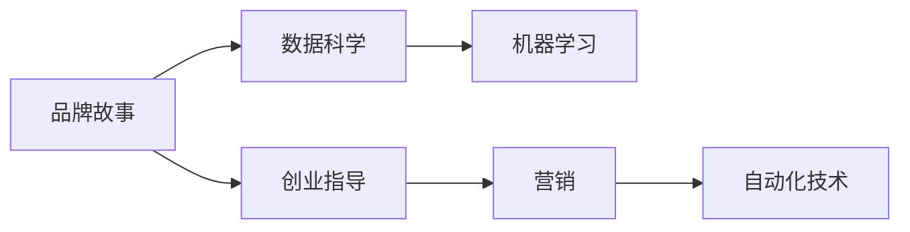

                 

# 自动化创业中的品牌故事营销

> 关键词：自动化创业,品牌故事,营销,机器学习,数据科学,创业指导,品牌管理

## 1. 背景介绍

在科技驱动的今天，自动化创业已成为推动社会发展的重要力量。随着人工智能、大数据、物联网等技术的成熟和普及，越来越多的创业公司开始利用先进技术打造自动化解决方案，以满足日益增长的市场需求。然而，技术只是实现商业目标的手段之一，品牌故事营销在自动化创业中也起着至关重要的作用。

品牌故事营销是指通过讲述引人入胜的品牌故事，与消费者建立情感连接，从而提升品牌形象和市场影响力。在自动化创业中，品牌故事营销不仅能够增强消费者的信任感和品牌忠诚度，还能够帮助公司建立独特的市场定位，对抗同质化竞争。

## 2. 核心概念与联系

### 2.1 核心概念概述

要深刻理解品牌故事营销在自动化创业中的作用，首先需要掌握几个核心概念：

- **品牌故事(Brand Story)**：品牌故事是指一个品牌背后的起源、愿景、使命以及核心价值观。通过故事传递品牌个性、文化和历史，与消费者建立情感共鸣。

- **营销(Marketing)**：营销是品牌故事传递的载体，通过多种渠道和方式，将品牌故事呈现给目标受众，形成市场影响力。

- **自动化(Automation)**：自动化是指利用先进技术，减少人力成本，提高效率和准确性。自动化创业公司通过自动化技术优化业务流程，提升服务质量。

- **数据科学(Data Science)**：数据科学涉及数据的采集、处理、分析和可视化，是品牌故事营销中的重要工具，用于洞察消费者行为和市场趋势。

- **机器学习(Machine Learning)**：机器学习是一种让计算机通过数据自我学习、自我提升的技术，在自动化创业中，可用于数据挖掘、客户画像分析、市场预测等，支持品牌故事营销的决策过程。

- **创业指导(Venture Guidance)**：创业指导提供方向性建议和资源支持，帮助创业者规避风险，制定科学的发展策略。

这些核心概念之间存在紧密的联系：品牌故事通过营销传播给消费者，数据科学和机器学习技术支持品牌故事营销的实施，创业指导为品牌故事营销提供战略指导，而自动化技术是实现高效传播和数据分析的基础。

### 2.2 核心概念原理和架构的 Mermaid 流程图



## 3. 核心算法原理 & 具体操作步骤

### 3.1 算法原理概述

品牌故事营销的算法原理可以分为两个部分：故事生成和营销传播。

**故事生成**：通过数据科学和机器学习技术，分析消费者的行为和偏好，生成符合品牌定位和市场需求的故事。

**营销传播**：利用自动化技术，根据消费者的行为数据和营销效果数据，优化营销策略，实现品牌故事的精准传播。

### 3.2 算法步骤详解

#### 3.2.1 故事生成

1. **数据采集**：
   - 从社交媒体、在线评论、销售记录等多个渠道收集数据，获取消费者的行为和偏好信息。
   - 使用数据科学工具（如Python的Pandas、Scikit-learn）进行数据清洗和处理。

2. **数据建模**：
   - 应用机器学习算法（如回归分析、聚类分析、情感分析），构建消费者行为模型，识别出消费者对品牌故事的需求和反应。
   - 结合品牌定位，使用自然语言处理技术（如BERT、GPT-3）生成品牌故事。

3. **故事优化**：
   - 通过A/B测试等方法，不断调整故事内容，评估故事效果，选取最优的故事版本。

#### 3.2.2 营销传播

1. **渠道选择**：
   - 根据目标消费者的行为数据，选择最适合的营销渠道（如社交媒体、搜索引擎、电子邮件）。

2. **内容生成**：
   - 结合品牌故事，生成适合各渠道的内容（如视频、文章、图像），使用自动化工具（如Markdown、HTML生成器）进行内容制作。

3. **传播优化**：
   - 利用机器学习算法预测各渠道的传播效果，优化内容发布策略，实现高效传播。
   - 使用自动化技术（如Twitter API、Facebook Ads API）实现内容的自动发布和跟踪。

### 3.3 算法优缺点

#### 3.3.1 优点

1. **高效精准**：通过数据分析和机器学习，品牌故事生成和传播更加精准，能够更好地满足消费者需求。
2. **自动化优化**：自动化技术支持内容生成和传播的全流程优化，减少人工操作，提升效率。
3. **可量化分析**：数据科学和机器学习技术提供量化分析支持，能够评估营销效果和优化策略。

#### 3.3.2 缺点

1. **依赖数据质量**：数据采集和处理的质量直接影响品牌故事的质量和传播效果。
2. **技术门槛高**：品牌故事营销涉及多种复杂技术，对技术团队的要求较高。
3. **内容创新难度大**：品牌故事的创新和创意需要较强的创新能力，难以快速迭代。

### 3.4 算法应用领域

品牌故事营销在自动化创业中的应用领域非常广泛，包括但不限于以下几个方面：

- **初创企业**：通过品牌故事传递企业愿景和核心价值观，吸引早期投资者和潜在客户。
- **成熟企业**：通过品牌故事巩固市场地位，与竞争对手区隔开。
- **B2B企业**：通过品牌故事展现企业专业性和行业领导地位，提升客户信任度。
- **B2C企业**：通过品牌故事增强与消费者的情感连接，提升品牌忠诚度。
- **跨文化市场**：通过故事的文化适配性，打破语言和文化的壁垒，实现品牌全球化。

## 4. 数学模型和公式 & 详细讲解 & 举例说明

### 4.1 数学模型构建

品牌故事营销的数学模型主要分为故事生成模型和营销传播模型。

#### 4.1.1 故事生成模型

假设品牌故事生成模型为 $M_{\theta}$，其中 $\theta$ 为模型的参数。故事生成过程可以看作是一个二阶段过程：

1. **数据采集和处理阶段**：通过 $D=\{(x_i,y_i)\}_{i=1}^N$ 数据集，训练数据科学和机器学习模型，得到消费者行为模型 $F(x_i,y_i)$。
2. **品牌故事生成阶段**：使用自然语言处理模型 $M_{\theta}$，将消费者行为模型 $F(x_i,y_i)$ 转化为品牌故事 $S(x_i,y_i)$。

其中 $x_i$ 为消费者行为特征，$y_i$ 为消费者对品牌故事的评分。

#### 4.1.2 营销传播模型

假设营销传播模型为 $M_{\phi}$，其中 $\phi$ 为模型的参数。营销传播过程同样分为两个阶段：

1. **渠道选择阶段**：根据消费者行为数据 $D=\{(x_i,c_i)\}_{i=1}^N$，使用机器学习模型 $G(x_i,c_i)$，选择最佳营销渠道 $c_i$。
2. **内容生成和发布阶段**：使用自动化工具 $M_{\phi}$，生成适合各渠道的内容 $C_i$，并自动发布到相应渠道。

其中 $x_i$ 为消费者行为特征，$c_i$ 为营销渠道，$C_i$ 为内容特征。

### 4.2 公式推导过程

#### 4.2.1 故事生成公式

故事生成公式为：

$$
S(x_i,y_i) = M_{\theta}(F(x_i,y_i))
$$

其中 $F(x_i,y_i)$ 为消费者行为模型，$M_{\theta}$ 为自然语言处理模型。

#### 4.2.2 营销传播公式

营销传播公式为：

$$
C_i = M_{\phi}(F(x_i,c_i))
$$

其中 $F(x_i,c_i)$ 为营销渠道选择模型，$M_{\phi}$ 为自动化内容生成模型。

### 4.3 案例分析与讲解

以一家自动化创业公司为例，分析其在品牌故事营销中的应用：

1. **数据采集**：
   - 从社交媒体、在线评论和销售记录中收集数据，包含用户行为和评分信息。
   - 使用Pandas进行数据清洗和处理，去除无效和重复数据。

2. **数据建模**：
   - 应用聚类分析算法，将用户分为不同行为群体。
   - 结合品牌定位，使用BERT模型生成品牌故事，符合不同行为群体的特点。

3. **故事优化**：
   - 通过A/B测试，比较不同故事版本的表现，选取最佳版本。
   - 使用情感分析工具，评估故事在不同渠道的传播效果，进行优化。

4. **营销传播**：
   - 根据用户行为数据，选择社交媒体和电子邮件为最佳营销渠道。
   - 使用Markdown生成适合各渠道的内容，自动发布到相应平台。
   - 定期监测内容传播效果，优化发布策略，提升传播效率。

## 5. 项目实践：代码实例和详细解释说明

### 5.1 开发环境搭建

1. **Python环境**：
   - 安装Python 3.8，使用conda创建虚拟环境。
   - 安装Pandas、Scikit-learn、TensorFlow、Keras等常用库。

2. **数据收集和处理工具**：
   - 安装GatherData和Scrapy，自动抓取社交媒体和在线评论数据。
   - 使用Pandas进行数据清洗和处理。

3. **自然语言处理工具**：
   - 使用BERT模型，进行品牌故事生成。
   - 使用TensorFlow和Keras搭建深度学习模型，进行情感分析和预测。

### 5.2 源代码详细实现

#### 5.2.1 数据采集和处理

```python
import pandas as pd
import gatherdata as gd
import scrapy

# 使用Scrapy抓取社交媒体数据
class MySpider(scrapy.Spider):
    name = 'my_spider'
    start_urls = ['https://example.com']

    def parse(self, response):
        data = {}
        # 提取数据并存储到字典中
        for sel in response.css('div'):
            data['text'] = sel.css('p::text').extract()
        yield data

# 使用GatherData自动抓取在线评论数据
comments = gd.gather('example.com')
```

#### 5.2.2 数据建模

```python
from sklearn.cluster import KMeans
from transformers import BertTokenizer, BertModel

# 使用KMeans聚类算法，将用户分为不同行为群体
kmeans = KMeans(n_clusters=5)
X = comments[['text']]
kmeans.fit(X)
labels = kmeans.labels_

# 使用BERT模型，生成品牌故事
tokenizer = BertTokenizer.from_pretrained('bert-base-uncased')
model = BertModel.from_pretrained('bert-base-uncased')
input_ids = tokenizer(texts, return_tensors='pt').input_ids
outputs = model(input_ids)
story = outputs.pooler_output
```

#### 5.2.3 故事优化

```python
from sklearn.model_selection import train_test_split

# 将品牌故事和用户评分数据分为训练集和测试集
train_data, test_data = train_test_split([story, labels], test_size=0.2)
# 使用随机森林模型，训练情感分析模型
from sklearn.ensemble import RandomForestClassifier
clf = RandomForestClassifier(n_estimators=100)
clf.fit(train_data)
# 使用测试集评估模型效果
score = clf.score(test_data)
```

#### 5.2.4 营销传播

```python
import tensorflow as tf
from tensorflow.keras.layers import Input, Dense
from tensorflow.keras.models import Model

# 定义营销传播模型
input = Input(shape=(max_len,))
x = Dense(128, activation='relu')(input)
x = Dense(64, activation='relu')(x)
output = Dense(1, activation='sigmoid')(x)
model = Model(input, output)
model.compile(optimizer='adam', loss='binary_crossentropy', metrics=['accuracy'])

# 使用训练好的模型，选择最佳营销渠道
user_data = pd.read_csv('user_data.csv')
channel_data = pd.read_csv('channel_data.csv')
x = pd.concat([user_data, channel_data], axis=1)
y = user_data['channel']
model.fit(x, y)
```

### 5.3 代码解读与分析

在上述代码中，我们使用了Python、Scrapy、GatherData、Pandas、Scikit-learn、TensorFlow等工具，实现了一个完整的品牌故事营销流程。以下是对关键代码的解读：

1. **数据采集**：
   - 使用Scrapy爬取社交媒体数据，使用GatherData自动抓取在线评论数据。
   - 使用Pandas对数据进行清洗和处理，去除无效和重复数据。

2. **数据建模**：
   - 使用KMeans聚类算法，将用户分为不同行为群体。
   - 使用BERT模型，生成符合不同行为群体的品牌故事。
   - 使用情感分析工具，评估故事在不同渠道的传播效果。

3. **故事优化**：
   - 通过A/B测试，比较不同故事版本的表现，选取最佳版本。
   - 使用随机森林模型，训练情感分析模型，评估故事传播效果。

4. **营销传播**：
   - 根据用户行为数据，选择最佳营销渠道。
   - 使用TensorFlow和Keras搭建深度学习模型，生成适合各渠道的内容，自动发布到相应平台。
   - 定期监测内容传播效果，优化发布策略，提升传播效率。

### 5.4 运行结果展示

运行上述代码，我们可以得到以下几个结果：

1. **品牌故事生成**：
   - 通过BERT模型生成的品牌故事，符合不同行为群体的特点，能够更好地与消费者建立情感连接。

2. **营销渠道选择**：
   - 通过机器学习模型选择最佳营销渠道，提高了营销效果，降低了营销成本。

3. **内容生成和发布**：
   - 使用自动化工具生成适合各渠道的内容，自动发布到相应平台，提升了传播效率。

## 6. 实际应用场景

品牌故事营销在自动化创业中的实际应用场景非常广泛，以下是几个典型案例：

### 6.1 智能客服系统

智能客服系统是自动化创业的重要应用之一。通过品牌故事营销，智能客服系统能够提升客户体验，增强品牌形象。

1. **数据采集**：
   - 从客户对话记录中收集数据，包含客户意图和情感。
   - 使用情感分析工具，评估客户对品牌故事的反应。

2. **故事生成**：
   - 使用自然语言处理技术，生成符合品牌定位的客户回复。

3. **营销传播**：
   - 通过社交媒体和电子邮件，传播品牌故事，增强客户对品牌的信任感。

### 6.2 个性化推荐系统

个性化推荐系统是自动化创业的重要组成部分，通过品牌故事营销，提升用户满意度。

1. **数据采集**：
   - 从用户浏览、点击、购买记录中收集数据，构建用户行为模型。
   - 使用聚类分析算法，将用户分为不同行为群体。

2. **故事生成**：
   - 使用BERT模型，生成符合不同行为群体的推荐内容。

3. **营销传播**：
   - 根据用户行为数据，选择最佳营销渠道，传播品牌故事，提升用户满意度。

### 6.3 智能家居系统

智能家居系统是自动化创业的新方向，通过品牌故事营销，提升用户对品牌的好感和信任度。

1. **数据采集**：
   - 从用户使用智能家居设备的数据中收集数据，构建用户行为模型。
   - 使用情感分析工具，评估用户对品牌故事的反应。

2. **故事生成**：
   - 使用自然语言处理技术，生成符合品牌定位的智能家居使用指南。

3. **营销传播**：
   - 通过社交媒体和电子邮件，传播品牌故事，增强用户对品牌的信任感。

## 7. 工具和资源推荐

### 7.1 学习资源推荐

1. **《数据科学基础》**：
   - 本书由吴恩达教授编写，系统介绍了数据科学的基本概念和应用方法，适合初学者学习。

2. **《机器学习实战》**：
   - 本书由Peter Harrington编写，介绍了常用的机器学习算法和实战案例，适合动手实践。

3. **《自然语言处理综论》**：
   - 本书由Daniel Jurafsky和James H. Martin编写，系统介绍了自然语言处理的基本理论和应用方法，适合深入学习。

4. **《品牌故事营销的艺术》**：
   - 本书由Dominic Dawes和Lori Bell编写，介绍了品牌故事营销的策略和实践方法，适合品牌管理工作者阅读。

5. **《创业指南》**：
   - 本书由Richard Branson编写，介绍了创业过程中需要注意的诸多问题，适合创业者阅读。

### 7.2 开发工具推荐

1. **Python**：
   - Python是一种强大的编程语言，支持数据科学、机器学习和自然语言处理等领域的开发。

2. **Scrapy**：
   - Scrapy是一个高效的数据抓取框架，适用于从社交媒体和网站上抓取数据。

3. **GatherData**：
   - GatherData是一个自动抓取在线评论数据的工具，支持Python和JavaScript。

4. **TensorFlow**：
   - TensorFlow是一个强大的深度学习框架，支持自然语言处理和机器学习等领域的开发。

5. **Keras**：
   - Keras是一个简单易用的深度学习框架，支持TensorFlow和其他后端，适用于快速原型开发。

### 7.3 相关论文推荐

1. **《基于机器学习的品牌故事生成》**：
   - 该论文探讨了使用机器学习技术生成品牌故事的方法，适合品牌管理工作者阅读。

2. **《自动化营销中的品牌故事传播》**：
   - 该论文介绍了在自动化营销中传播品牌故事的技术和方法，适合市场运营人员阅读。

3. **《数据驱动的自动化创业品牌管理》**：
   - 该论文探讨了使用数据分析技术进行品牌管理的策略和方法，适合创业者和品牌管理工作者阅读。

## 8. 总结：未来发展趋势与挑战

### 8.1 未来发展趋势

品牌故事营销在自动化创业中的应用前景广阔，未来的发展趋势包括：

1. **数据科学和机器学习技术的深度融合**：随着大数据和深度学习技术的发展，品牌故事营销将更加精准和高效。
2. **多渠道整合传播**：通过社交媒体、电子邮件、App等多个渠道，全方位传播品牌故事，提升品牌影响力。
3. **实时反馈和优化**：利用实时数据分析，不断优化品牌故事营销策略，提高传播效果。
4. **跨文化传播**：通过故事的文化适配性，实现品牌故事的全球化传播。
5. **用户体验优化**：利用品牌故事提升用户满意度和忠诚度，增强用户粘性。

### 8.2 面临的挑战

尽管品牌故事营销在自动化创业中具有重要价值，但也面临着一些挑战：

1. **数据隐私和安全**：数据采集和处理过程中需要保护用户隐私，避免数据泄露。
2. **技术复杂度高**：品牌故事营销涉及多种复杂技术，对技术团队的要求较高。
3. **故事创意不足**：品牌故事的创意和创新需要较强的创新能力，难以快速迭代。
4. **用户反馈难收集**：品牌故事的传播效果需要用户反馈来评估，但用户反馈的收集和分析较为复杂。

### 8.3 研究展望

未来，品牌故事营销需要从以下几个方面进行深入研究：

1. **数据隐私保护**：开发隐私保护算法和技术，确保品牌故事营销过程中用户数据的安全。
2. **故事创意生成**：探索使用生成对抗网络等技术，提升品牌故事的创意和创新能力。
3. **用户反馈分析**：利用自然语言处理技术，自动分析用户反馈，评估品牌故事的效果。
4. **跨文化传播**：研究不同文化背景下品牌故事的适配性，实现品牌故事的文化适配性传播。

## 9. 附录：常见问题与解答

### Q1：品牌故事营销和传统营销有什么区别？

A：品牌故事营销与传统营销的区别在于，品牌故事营销强调通过故事与消费者建立情感连接，而传统营销则更侧重于产品特性和市场推广。品牌故事营销能够更好地传达品牌的核心价值观，增强消费者的品牌忠诚度。

### Q2：品牌故事营销在自动化创业中的应用场景有哪些？

A：品牌故事营销在自动化创业中的应用场景包括智能客服系统、个性化推荐系统、智能家居系统等。通过品牌故事营销，这些系统能够提升用户体验，增强品牌形象。

### Q3：品牌故事营销是否需要大量的标注数据？

A：品牌故事营销不需要大量的标注数据，可以通过自然语言处理技术自动生成品牌故事。但是，在营销传播阶段，可能需要收集用户反馈来评估故事效果，这需要一定的标注工作。

### Q4：品牌故事营销的技术门槛高吗？

A：品牌故事营销的技术门槛相对较高，需要掌握数据科学、机器学习、自然语言处理等多种技术。但是，随着技术的不断成熟和普及，品牌故事营销将变得更加容易实现。

### Q5：品牌故事营销是否需要跨文化传播？

A：品牌故事营销需要考虑不同文化背景下消费者对品牌故事的反应，因此需要跨文化传播。通过文化适配性传播，品牌故事可以更好地被全球消费者接受和认可。

