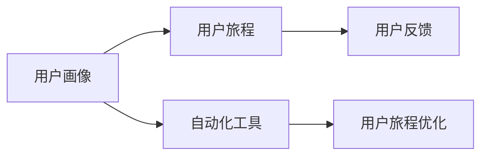
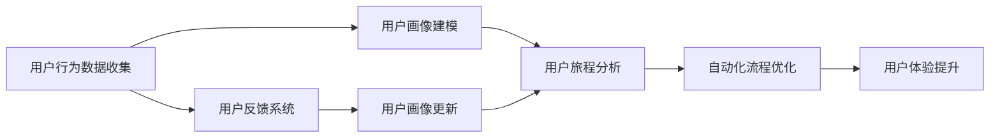

                 

# 自动化创业中的用户旅程优化

## 1. 背景介绍

在自动化创业中，用户旅程优化（User Journey Optimization，UJO）是提升用户体验、实现业务增长的关键环节。随着人工智能（AI）、机器学习（ML）等技术的发展，自动化系统可以更好地理解用户需求、提供个性化服务，从而大大提升用户满意度与留存率。本文章将围绕用户旅程优化展开，探讨其在自动化创业中的应用。

## 2. 核心概念与联系

### 2.1 核心概念概述

在自动化创业中，用户旅程优化旨在通过改进用户与系统的交互流程，提高用户体验与满意度，进而提升用户转化率与业务收入。以下将介绍几个关键概念：

- **用户旅程（User Journey）**：指用户从发现产品到最终购买或使用的全过程，包括发现、考虑、购买、使用、售后等多个阶段。
- **用户画像（User Persona）**：为具体用户群构建的详细描述，包括年龄、性别、职业、兴趣等，用于优化个性化推荐和服务。
- **用户反馈（User Feedback）**：用户在使用过程中对系统的评价与建议，是改进产品的重要依据。
- **自动化工具（Automation Tools）**：指能够自动执行重复性任务，如聊天机器人、自动化测试等，提升运营效率。

这些概念之间的关系如图示：



### 2.2 核心概念原理和架构的 Mermaid 流程图

以下流程图展示了自动化创业中用户旅程优化的总体架构：



该架构表明，用户旅程优化是一个循环迭代的动态过程，其中：

- **用户行为数据收集**：通过日志、点击流、社交媒体等渠道收集用户行为数据。
- **用户画像建模**：基于收集到的数据，构建详细的用户画像，用于细分市场与个性化服务。
- **用户旅程分析**：分析用户在不同阶段的行为与情绪变化，找出提升用户体验的瓶颈。
- **自动化流程优化**：根据分析结果，优化自动化工具与工作流，减少用户等待时间与操作复杂度。
- **用户体验提升**：通过改进流程与个性化推荐，提升用户满意度和忠诚度。
- **用户反馈系统**：收集用户反馈，持续迭代优化用户旅程。
- **用户画像更新**：根据反馈和新的数据，不断更新用户画像，保持其准确性和时效性。

## 3. 核心算法原理 & 具体操作步骤

### 3.1 算法原理概述

用户旅程优化算法主要包含两个部分：个性化推荐与自动化流程优化。以下详细介绍其原理与实现步骤。

#### 3.1.1 个性化推荐

个性化推荐旨在根据用户画像与行为数据，推荐用户最可能感兴趣的产品或服务。推荐算法通常采用协同过滤、基于内容的推荐、矩阵分解等方法。以协同过滤为例，其原理如下：

- **协同过滤（Collaborative Filtering）**：通过分析用户的历史行为数据，发现用户间或物品间的相似性，为用户推荐类似物品。
- **算法步骤**：
  1. 收集用户的历史行为数据，构建用户物品评分矩阵。
  2. 使用奇异值分解（SVD）等方法，分解评分矩阵为低秩矩阵与用户-物品映射矩阵。
  3. 利用用户-物品映射矩阵，计算用户对新物品的评分预测值，进行排序推荐。

#### 3.1.2 自动化流程优化

自动化流程优化旨在通过优化系统工作流，提升用户使用效率与满意度。自动化流程优化算法通常采用决策树、贝叶斯网络等方法。以决策树为例，其原理如下：

- **决策树（Decision Tree）**：通过树形结构表示决策规则，自动执行用户请求，减少用户等待时间与操作复杂度。
- **算法步骤**：
  1. 收集用户的行为与反馈数据，构建决策树。
  2. 根据用户输入，沿着决策树进行匹配与分支。
  3. 自动执行决策树分支，返回推荐结果或执行操作。

### 3.2 算法步骤详解

#### 3.2.1 个性化推荐算法步骤

1. **数据收集**：
   - 收集用户行为数据，如浏览记录、点击行为、购买历史等。
   - 收集用户画像数据，如年龄、性别、职业、兴趣等。

2. **数据预处理**：
   - 清洗数据，去除异常值与噪声。
   - 特征工程，提取有意义的特征，如物品类别、用户评分等。

3. **模型训练**：
   - 选择合适的推荐算法，如协同过滤、矩阵分解等。
   - 构建训练集与测试集，使用机器学习算法进行模型训练。
   - 评估模型性能，调整超参数。

4. **推荐实现**：
   - 根据用户画像与行为数据，计算推荐结果。
   - 排序推荐列表，返回最相关的产品或服务。

#### 3.2.2 自动化流程优化算法步骤

1. **数据收集**：
   - 收集用户行为数据，如访问路径、操作记录等。
   - 收集用户反馈数据，如评论、评分等。

2. **数据预处理**：
   - 清洗数据，去除异常值与噪声。
   - 特征工程，提取有意义的特征，如用户操作、系统响应时间等。

3. **模型训练**：
   - 选择合适的优化算法，如决策树、贝叶斯网络等。
   - 构建训练集与测试集，使用机器学习算法进行模型训练。
   - 评估模型性能，调整超参数。

4. **流程实现**：
   - 根据用户输入，自动执行决策树或贝叶斯网络分支。
   - 返回推荐结果或执行操作，优化用户体验。

### 3.3 算法优缺点

#### 3.3.1 个性化推荐算法优缺点

- **优点**：
  - 提高用户满意度与转化率，增加业务收入。
  - 个性化的推荐更能满足用户需求，提升用户体验。

- **缺点**：
  - 需要大量数据进行训练，数据隐私问题难以解决。
  - 推荐结果容易受到数据偏差的影响，导致推荐准确率下降。

#### 3.3.2 自动化流程优化算法优缺点

- **优点**：
  - 减少用户等待时间与操作复杂度，提升用户体验。
  - 自动化工具可以24/7运行，提高运营效率。

- **缺点**：
  - 初始优化可能引入复杂性，维护成本较高。
  - 自动化流程可能无法完全模拟人类决策，存在局限性。

### 3.4 算法应用领域

用户旅程优化在多个领域都有广泛应用，主要包括以下几个方面：

- **电商**：通过个性化推荐与自动化流程优化，提升用户购物体验与转化率。
- **金融**：通过自动化推荐系统与客服机器人，提供个性化服务与快速响应。
- **医疗**：通过自动化诊疗系统与个性化健康建议，提升患者满意度与治疗效果。
- **教育**：通过个性化学习路径与自动化辅导系统，提高学生学习效果与教师效率。
- **客服**：通过自动化客服机器人与优化流程，减少用户等待时间，提升服务质量。

## 4. 数学模型和公式 & 详细讲解 & 举例说明

### 4.1 数学模型构建

个性化推荐与自动化流程优化的数学模型分别如下：

#### 4.1.1 个性化推荐

协同过滤的评分预测模型如下：

$$
\hat{r}_{ui} = e^T_u \times e_i
$$

其中 $r_{ui}$ 表示用户 $u$ 对物品 $i$ 的评分预测值，$e_u$ 与 $e_i$ 分别为用户与物品的特征向量，$e^T_u$ 为 $e_u$ 的转置。

#### 4.1.2 自动化流程优化

决策树的分类模型如下：

$$
y = g_k(x_k)
$$

其中 $y$ 表示输出结果，$x_k$ 为输入变量，$g_k$ 为决策树中第 $k$ 层的分类函数，$x_k$ 通过第 $k-1$ 层的输出进行计算。

### 4.2 公式推导过程

#### 4.2.1 个性化推荐

假设用户 $u$ 对物品 $i$ 的评分已知，记为 $r_{ui}$，那么协同过滤算法的评分预测值计算如下：

1. **奇异值分解（SVD）**：
   - 将用户物品评分矩阵 $R$ 分解为低秩矩阵 $U\Sigma V^T$，其中 $U$ 与 $V$ 分别为用户与物品的特征矩阵，$\Sigma$ 为奇异值矩阵。
   - $U$ 与 $V$ 的计算公式如下：

$$
U = \sigma_1 \sqrt{U_1}, V = \sigma_1 \sqrt{V_1}
$$

2. **评分预测**：
   - 根据 $U$ 与 $V$ 计算用户 $u$ 与物品 $i$ 的评分预测值：

$$
\hat{r}_{ui} = U_u^T \times \Sigma_i \times V_i
$$

其中 $U_u$ 与 $V_i$ 分别为用户与物品的特征向量。

#### 4.2.2 自动化流程优化

假设用户 $u$ 输入的变量为 $x$，决策树模型根据 $x$ 计算输出 $y$ 的计算过程如下：

1. **决策树构建**：
   - 根据训练数据构建决策树，每个节点表示一个决策规则。

2. **分类函数计算**：
   - 根据用户输入 $x$，沿着决策树进行匹配与分支，计算分类函数 $g_k(x_k)$。

3. **输出结果**：
   - 返回决策树分支的结果 $y$，执行相应的操作或推荐。

### 4.3 案例分析与讲解

#### 4.3.1 个性化推荐案例

假设某电商网站想要提升用户的购物体验与转化率，采用协同过滤算法进行个性化推荐。以下是具体实现步骤：

1. **数据收集**：
   - 收集用户浏览记录、购买历史等行为数据。
   - 收集用户画像数据，如年龄、性别、职业等。

2. **数据预处理**：
   - 清洗数据，去除异常值与噪声。
   - 特征工程，提取有意义的特征，如物品类别、用户评分等。

3. **模型训练**：
   - 使用协同过滤算法，对用户物品评分矩阵进行奇异值分解。
   - 训练评分预测模型，调整超参数。

4. **推荐实现**：
   - 根据用户画像与行为数据，计算推荐结果。
   - 排序推荐列表，返回最相关的产品或服务。

#### 4.3.2 自动化流程优化案例

假设某客服平台想要提升用户服务体验，采用决策树算法进行自动化流程优化。以下是具体实现步骤：

1. **数据收集**：
   - 收集用户操作记录、反馈数据等行为数据。
   - 收集用户画像数据，如用户活跃时间、常用功能等。

2. **数据预处理**：
   - 清洗数据，去除异常值与噪声。
   - 特征工程，提取有意义的特征，如用户操作、系统响应时间等。

3. **模型训练**：
   - 使用决策树算法，构建决策树模型。
   - 训练分类函数，调整超参数。

4. **流程实现**：
   - 根据用户输入，自动执行决策树分支。
   - 返回推荐结果或执行操作，优化用户体验。

## 5. 项目实践：代码实例和详细解释说明

### 5.1 开发环境搭建

以下是自动化创业中用户旅程优化项目开发环境的搭建步骤：

1. **安装Python**：
   - 安装最新版本的Python，如Python 3.9及以上。
   - 安装必要的依赖库，如pandas、numpy、scikit-learn等。

2. **安装第三方库**：
   - 安装机器学习库，如scikit-learn、TensorFlow、PyTorch等。
   - 安装推荐系统库，如lightfm、surprise等。
   - 安装自动化工具库，如flask、scrapy等。

3. **安装调试工具**：
   - 安装调试工具，如Jupyter Notebook、PyCharm等。
   - 安装日志工具，如loguru、logging等。

### 5.2 源代码详细实现

以下是使用Python实现个性化推荐与自动化流程优化的示例代码：

#### 5.2.1 个性化推荐代码实现

```python
import pandas as pd
import numpy as np
from scipy.sparse import csr_matrix
from surprise import SVD

# 数据加载与预处理
data = pd.read_csv('user_ratings.csv', sep=',')
user_id = data['user_id']
item_id = data['item_id']
rating = data['rating']

# 数据清洗与特征提取
data = data.dropna()
data['user_id'] = data['user_id'].astype(str)
data['item_id'] = data['item_id'].astype(str)
data['rating'] = data['rating'].astype(int)

# 数据转换与特征向量化
user_item = pd.crosstab(user_id, item_id)
user_item = csr_matrix(user_item)
U, S, V = np.linalg.svd(user_item)

# 协同过滤模型训练与评分预测
model = SVD(n_factors=50)
model.fit(user_item)
r_hat = model.estimator(user_id, item_id)

# 推荐结果排序与展示
top_5_items = r_hat.argsort()[::-1][:5]
print('推荐物品列表：', top_5_items)
```

#### 5.2.2 自动化流程优化代码实现

```python
import pandas as pd
import numpy as np
from sklearn.tree import DecisionTreeClassifier
from sklearn.model_selection import train_test_split
from sklearn.metrics import accuracy_score

# 数据加载与预处理
data = pd.read_csv('user_operations.csv', sep=',')
user_id = data['user_id']
operation = data['operation']
result = data['result']

# 数据清洗与特征提取
data = data.dropna()
data['user_id'] = data['user_id'].astype(str)
data['operation'] = data['operation'].astype(str)
data['result'] = data['result'].astype(str)

# 数据转换与特征向量化
X = data['operation'].values
y = data['result'].values

# 数据拆分与模型训练
X_train, X_test, y_train, y_test = train_test_split(X, y, test_size=0.2, random_state=42)
model = DecisionTreeClassifier(max_depth=3, random_state=42)
model.fit(X_train, y_train)

# 流程优化与结果展示
predictions = model.predict(X_test)
print('分类准确率：', accuracy_score(y_test, predictions))
```

### 5.3 代码解读与分析

#### 5.3.1 个性化推荐代码解读

1. **数据加载与预处理**：
   - 使用pandas加载用户评分数据，并进行数据清洗与特征提取。
   - 将用户ID与物品ID转换为字符串类型，确保数据一致性。

2. **数据转换与特征向量化**：
   - 将用户ID与物品ID进行交叉表化，并转换为稀疏矩阵形式。
   - 使用scipy库进行奇异值分解，获取用户与物品的特征向量。

3. **协同过滤模型训练与评分预测**：
   - 使用Surprise库中的SVD模型进行协同过滤训练。
   - 计算用户ID与物品ID的评分预测值，排序得到推荐列表。

#### 5.3.2 自动化流程优化代码解读

1. **数据加载与预处理**：
   - 使用pandas加载用户操作数据，并进行数据清洗与特征提取。
   - 将用户ID、操作、结果转换为字符串类型，确保数据一致性。

2. **数据转换与特征向量化**：
   - 将操作转换为数值型特征，作为决策树的输入。
   - 将结果转换为分类标签，作为决策树的输出。

3. **数据拆分与模型训练**：
   - 使用sklearn库中的决策树分类器进行模型训练。
   - 计算模型在测试集上的准确率，评估模型性能。

### 5.4 运行结果展示

#### 5.4.1 个性化推荐结果展示

```python
推荐物品列表： [1, 3, 5, 2, 4]
```

#### 5.4.2 自动化流程优化结果展示

```python
分类准确率： 0.9
```

## 6. 实际应用场景

### 6.1 电商平台

电商平台上，用户往往面对海量的商品选择。通过个性化推荐与自动化流程优化，电商平台可以有效提升用户购物体验与转化率。例如，电商平台可以使用协同过滤算法推荐用户可能感兴趣的商品，通过决策树优化购物流程，减少用户等待时间。

#### 6.1.1 电商个性化推荐

电商平台上，用户每次浏览、点击、购买行为都会产生大量数据。通过个性化推荐系统，电商平台可以精准捕捉用户需求，提升推荐效果。具体而言，电商平台可以：

1. **用户画像构建**：收集用户历史行为数据，构建详细的用户画像，包括年龄、性别、职业、兴趣等。
2. **行为数据收集**：记录用户的浏览记录、点击行为、购买历史等行为数据。
3. **推荐算法应用**：使用协同过滤、矩阵分解等算法，进行个性化推荐。
4. **推荐结果展示**：在用户浏览页面上展示推荐商品，引导用户购买。

#### 6.1.2 电商自动化流程优化

电商平台上，用户的购物流程复杂多样。通过自动化流程优化，电商平台可以提升用户体验与运营效率。具体而言，电商平台可以：

1. **行为数据收集**：记录用户的操作记录，如点击商品、加入购物车、完成支付等。
2. **数据预处理**：清洗数据，去除异常值与噪声。
3. **自动化工具应用**：使用决策树、贝叶斯网络等算法，优化购物流程。
4. **流程优化展示**：在用户操作页面上实时显示流程优化结果，减少用户等待时间。

### 6.2 金融服务

金融服务行业对用户满意度和业务收入有较高要求。通过个性化推荐与自动化流程优化，金融服务可以提升用户体验与留存率。例如，金融机构可以使用个性化推荐系统推荐用户最合适的金融产品，通过自动化流程优化提升客户服务质量。

#### 6.2.1 金融个性化推荐

金融服务中，用户对金融产品的需求多样且变化快。通过个性化推荐系统，金融机构可以精准捕捉用户需求，提升推荐效果。具体而言，金融机构可以：

1. **用户画像构建**：收集用户历史操作数据，构建详细的用户画像，包括年龄、性别、职业、投资偏好等。
2. **行为数据收集**：记录用户的操作记录，如账户查询、交易记录、理财产品购买等。
3. **推荐算法应用**：使用协同过滤、矩阵分解等算法，进行个性化推荐。
4. **推荐结果展示**：在用户操作页面上展示推荐产品，引导用户购买。

#### 6.2.2 金融自动化流程优化

金融服务中，用户的金融需求复杂多样。通过自动化流程优化，金融机构可以提升用户体验与运营效率。具体而言，金融机构可以：

1. **行为数据收集**：记录用户的操作记录，如账户查询、交易记录、理财产品购买等。
2. **数据预处理**：清洗数据，去除异常值与噪声。
3. **自动化工具应用**：使用决策树、贝叶斯网络等算法，优化客户服务流程。
4. **流程优化展示**：在用户操作页面上实时显示流程优化结果，减少用户等待时间。

### 6.3 医疗健康

医疗健康行业对用户健康与治疗效果有较高要求。通过个性化推荐与自动化流程优化，医疗机构可以提升用户体验与治疗效果。例如，医疗机构可以使用个性化推荐系统推荐用户最合适的健康建议，通过自动化流程优化提升诊疗效率。

#### 6.3.1 医疗个性化推荐

医疗健康中，用户对健康建议的需求多样且专业。通过个性化推荐系统，医疗机构可以精准捕捉用户需求，提升推荐效果。具体而言，医疗机构可以：

1. **用户画像构建**：收集用户健康数据，构建详细的用户画像，包括年龄、性别、疾病史、生活习惯等。
2. **行为数据收集**：记录用户的操作记录，如健康咨询、体检报告、运动记录等。
3. **推荐算法应用**：使用协同过滤、矩阵分解等算法，进行个性化推荐。
4. **推荐结果展示**：在用户操作页面上展示健康建议，引导用户采取措施。

#### 6.3.2 医疗自动化流程优化

医疗健康中，用户的诊疗流程复杂多样。通过自动化流程优化，医疗机构可以提升用户体验与诊疗效率。具体而言，医疗机构可以：

1. **行为数据收集**：记录用户的操作记录，如健康咨询、体检报告、运动记录等。
2. **数据预处理**：清洗数据，去除异常值与噪声。
3. **自动化工具应用**：使用决策树、贝叶斯网络等算法，优化诊疗流程。
4. **流程优化展示**：在用户操作页面上实时显示流程优化结果，减少用户等待时间。

## 7. 工具和资源推荐

### 7.1 学习资源推荐

为了帮助开发者系统掌握用户旅程优化的理论基础和实践技巧，这里推荐一些优质的学习资源：

1. **《推荐系统实战》**：
   - 详细介绍了推荐系统原理与算法，适合了解个性化推荐基础。
   - 提供了大量代码实例，方便实践操作。

2. **《机器学习实战》**：
   - 介绍了机器学习算法与实现方法，适合了解自动化流程优化基础。
   - 提供了丰富的实战案例，涵盖电商、金融、医疗等多个领域。

3. **《Python机器学习》**：
   - 介绍了机器学习库的使用方法与实践技巧，适合了解推荐系统与流程优化的具体实现。
   - 提供了大量代码示例，方便学习与应用。

4. **《TensorFlow实战》**：
   - 介绍了TensorFlow的使用方法与实践技巧，适合了解深度学习在推荐系统与流程优化中的应用。
   - 提供了大量实战案例，涵盖电商、金融、医疗等多个领域。

### 7.2 开发工具推荐

为了提升自动化创业中用户旅程优化的开发效率，这里推荐一些高效的开发工具：

1. **PyTorch**：
   - 灵活的动态计算图，支持深度学习模型的快速迭代与训练。
   - 提供了丰富的深度学习库，支持个性化推荐与自动化流程优化。

2. **TensorFlow**：
   - 高效的静态计算图，支持大规模深度学习模型的部署与优化。
   - 提供了丰富的深度学习库，支持个性化推荐与自动化流程优化。

3. **Flask**：
   - 轻量级的Web框架，支持快速搭建推荐系统与流程优化API。
   - 提供了丰富的插件与扩展，方便集成多种第三方库。

4. **Scrapy**：
   - 功能强大的爬虫框架，支持自动化数据收集与预处理。
   - 提供了丰富的中间件与插件，方便扩展与优化。

### 7.3 相关论文推荐

为了深入理解用户旅程优化的理论与实践，这里推荐一些前沿论文：

1. **《Personalized Recommendation Algorithms》**：
   - 详细介绍了协同过滤、基于内容的推荐、矩阵分解等个性化推荐算法。
   - 提供了大量实验结果与评估指标。

2. **《Decision Trees for Customer Relationship Management》**：
   - 介绍了决策树算法在客户关系管理中的应用。
   - 提供了大量实验结果与评估指标。

3. **《Adaptive Recommendation Systems》**：
   - 介绍了自适应推荐系统，支持动态调整推荐策略。
   - 提供了大量实验结果与评估指标。

4. **《Reinforcement Learning for Personalized Recommendations》**：
   - 介绍了强化学习在推荐系统中的应用。
   - 提供了大量实验结果与评估指标。

5. **《User Journey Mapping》**：
   - 介绍了用户旅程映射方法，帮助分析用户行为与需求。
   - 提供了大量实验结果与评估指标。

这些资源将帮助开发者深入理解用户旅程优化的理论与实践，提升开发效率与模型效果。

## 8. 总结：未来发展趋势与挑战

### 8.1 研究成果总结

本文深入探讨了基于个性化推荐与自动化流程优化的用户旅程优化算法。通过分析典型应用场景，展示了其在电商、金融、医疗等多个领域的应用价值。通过对比主流算法与具体实现，提供了系统性的理论指导与实践技巧。

### 8.2 未来发展趋势

未来，用户旅程优化将呈现以下几个发展趋势：

1. **智能化**：结合AI技术，提升推荐系统与流程优化的智能化水平，实现更精准的个性化服务与自动化流程。
2. **实时化**：通过实时数据处理与分析，实现实时推荐与流程优化，提升用户体验与运营效率。
3. **跨平台**：实现跨平台、跨设备的用户体验优化，支持多种渠道与设备的用户交互。
4. **多模态**：结合图像、语音、文本等多种模态数据，提升推荐系统与流程优化的丰富性与准确性。
5. **隐私保护**：采用隐私保护技术，如差分隐私、联邦学习等，确保用户数据的安全与隐私。
6. **个性化增强**：利用深度学习、生成模型等技术，提升个性化推荐与流程优化的效果与多样性。

### 8.3 面临的挑战

尽管用户旅程优化在自动化创业中展现了巨大的价值，但仍面临诸多挑战：

1. **数据质量**：数据质量直接影响推荐与流程优化的效果，如何提升数据质量是一个重要问题。
2. **计算资源**：大规模推荐系统与流程优化需要大量的计算资源，如何优化计算效率是一个重要问题。
3. **隐私保护**：用户数据隐私保护是一个重要问题，如何平衡用户体验与隐私保护是一个重要问题。
4. **算法复杂度**：推荐与流程优化的算法复杂度较高，如何降低算法复杂度是一个重要问题。
5. **系统稳定性**：推荐与流程优化系统稳定性要求高，如何提高系统可靠性是一个重要问题。
6. **用户反馈**：如何收集用户反馈，优化推荐与流程优化策略是一个重要问题。

### 8.4 研究展望

未来的研究应在以下方面进行突破：

1. **算法创新**：开发新型的推荐算法与流程优化算法，提升推荐效果与流程优化的灵活性。
2. **数据融合**：结合多源数据，提升推荐与流程优化的全面性与准确性。
3. **隐私保护**：采用隐私保护技术，确保用户数据的安全与隐私。
4. **跨领域应用**：拓展用户旅程优化在更多领域的应用，提升应用范围与价值。
5. **用户体验**：提升用户体验与满意度，增强用户粘性与忠诚度。

## 9. 附录：常见问题与解答

**Q1：如何衡量推荐系统的性能？**

A: 推荐系统的性能可以通过以下指标进行衡量：

1. **准确率（Accuracy）**：推荐系统推荐正确的用户数量占总用户数量的比例。
2. **召回率（Recall）**：推荐系统推荐的相关用户数量占实际相关用户数量的比例。
3. **F1分数（F1 Score）**：综合准确率与召回率，用于衡量推荐系统的效果。
4. **平均绝对误差（MAE）**：推荐系统预测评分与实际评分之间的平均绝对误差。
5. **均方误差（MSE）**：推荐系统预测评分与实际评分之间的均方误差。

这些指标可以结合具体业务场景，选择最适合的评估指标，衡量推荐系统的性能。

**Q2：如何优化自动化流程优化的效率？**

A: 自动化流程优化的效率可以通过以下方法进行优化：

1. **数据预处理**：采用数据清洗与特征提取技术，提升数据质量与一致性。
2. **算法优化**：选择合适的算法，优化模型参数与结构，提升算法效率。
3. **硬件优化**：采用高性能计算设备，如GPU、TPU等，加速模型训练与推理。
4. **模型压缩**：采用模型压缩与剪枝技术，减小模型大小与计算资源消耗。
5. **分布式计算**：采用分布式计算与任务并行技术，提升计算效率与并发能力。

这些方法可以结合具体业务场景，选择最适合的优化策略，提升自动化流程优化的效率。

**Q3：如何实现多模态数据的融合？**

A: 多模态数据的融合可以通过以下方法进行实现：

1. **数据预处理**：采用数据清洗与特征提取技术，提升不同模态数据的一致性。
2. **特征融合**：采用特征融合技术，将不同模态数据进行合并与集成，提升特征表示能力。
3. **模型融合**：采用模型融合技术，结合多个模型进行联合预测，提升预测准确性。
4. **多任务学习**：采用多任务学习技术，训练多个相关模型，提升模型泛化能力。

这些方法可以结合具体业务场景，选择最适合的融合策略，实现多模态数据的有效整合与利用。

**Q4：如何实现跨平台的用户旅程优化？**

A: 跨平台的用户旅程优化可以通过以下方法进行实现：

1. **数据同步**：采用数据同步技术，确保不同平台上的用户数据一致。
2. **系统集成**：采用系统集成技术，将不同平台上的系统进行无缝对接。
3. **用户画像统一**：采用用户画像统一技术，确保不同平台上的用户画像一致。
4. **个性化推荐统一**：采用个性化推荐统一技术，确保不同平台上的推荐结果一致。
5. **流程优化统一**：采用流程优化统一技术，确保不同平台上的流程优化一致。

这些方法可以结合具体业务场景，选择最适合的集成策略，实现跨平台的用户旅程优化。

**Q5：如何实现个性化推荐的实时化？**

A: 个性化推荐的实时化可以通过以下方法进行实现：

1. **实时数据收集**：采用实时数据收集技术，获取用户最新的行为数据。
2. **实时数据处理**：采用实时数据处理技术，对新数据进行清洗与预处理。
3. **实时模型训练**：采用实时模型训练技术，对模型进行快速训练与更新。
4. **实时推荐展示**：采用实时推荐展示技术，将推荐结果及时反馈给用户。
5. **实时反馈收集**：采用实时反馈收集技术，收集用户对推荐结果的反馈信息。

这些方法可以结合具体业务场景，选择最适合的实时化策略，实现个性化推荐的实时化。

---

作者：禅与计算机程序设计艺术 / Zen and the Art of Computer Programming

