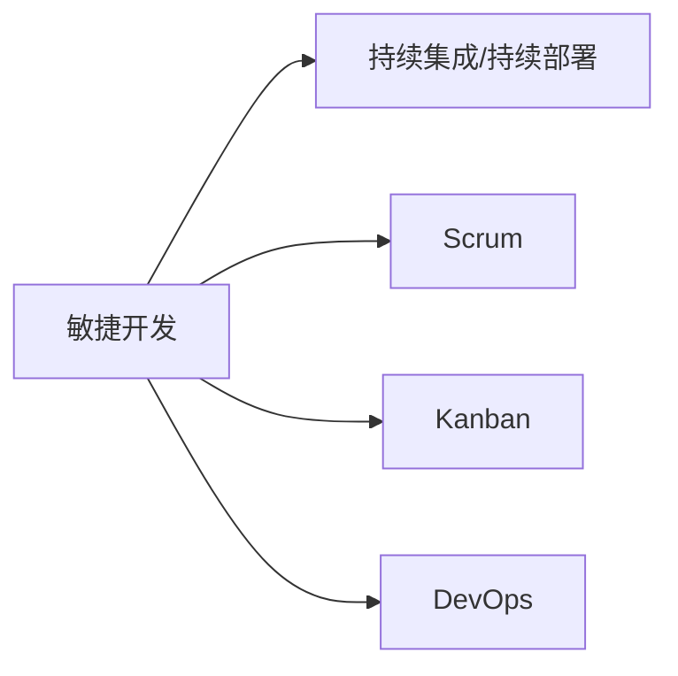

                 

# 自动化创业中的项目管理方法

> 关键词：自动化创业,项目管理,敏捷开发,敏捷方法论,DevOps,持续集成,持续部署,Scrum, Kanban

## 1. 背景介绍

### 1.1 问题由来
在当今的快速变化的技术环境中，自动化创业（也称为软件创业）成为推动科技创新的重要力量。然而，随着创业公司从实验室阶段过渡到产品发布，项目管理变得至关重要。如何高效地管理项目，使其能够快速迭代、快速响应市场变化，是每个自动化创业公司面临的重大挑战。

### 1.2 问题核心关键点
在自动化创业中，项目管理不仅仅是计划和执行，更是一种协调团队、资源和流程的艺术。以下是项目管理的几个核心关键点：

- 快速迭代：创业公司需要快速推出产品，市场竞争激烈，新产品可能被快速迭代取代。
- 团队协作：高效的项目管理需要良好的团队协作，确保所有团队成员了解项目目标、进度和责任。
- 资源分配：合理分配资源（包括时间、资金和人力资源）以最大化项目效益。
- 风险管理：识别和管理项目中的风险，避免潜在的延误和成本超支。
- 持续改进：敏捷项目管理强调持续改进，不断优化项目管理和团队协作流程。

### 1.3 问题研究意义
研究和应用有效的项目管理方法，能够帮助自动化创业公司提升项目效率，加速产品上市，降低风险成本。以下是项目管理方法的研究意义：

1. **加速产品上市**：通过敏捷开发和持续集成/持续部署（CI/CD）等方法，能够快速迭代，快速响应市场变化。
2. **提升团队协作效率**：敏捷方法论和Scrum、Kanban等管理工具，提高了团队协作的效率和沟通效果。
3. **降低项目风险**：通过敏捷的反馈循环和风险管理策略，有效识别和控制项目风险，确保项目按时交付。
4. **持续改进**：通过持续改进的方法，不断优化项目管理流程，提升项目质量。

## 2. 核心概念与联系

### 2.1 核心概念概述

要理解和应用有效的项目管理方法，首先需要明确几个关键概念：

- **敏捷开发**：一种迭代的、以用户为中心的开发方法，强调快速迭代和持续改进，快速响应市场需求。
- **持续集成/持续部署**（CI/CD）：一种软件开发实践，通过自动化构建、测试和部署，提高软件交付速度和质量。
- **Scrum**：一种敏捷方法论，通过短期迭代（Sprint）、每日站会、Sprint回顾等方式，提升团队协作和项目管理效率。
- **Kanban**：一种敏捷管理工具，通过看板管理任务和进度，实时展示工作状态，优化资源分配和流程管理。
- **DevOps**：一种结合开发（Dev）和运维（Ops）的文化和实践，通过自动化和持续反馈，提升软件交付速度和质量。

这些概念之间的联系可以通过以下Mermaid流程图来展示：



这个流程图展示了敏捷开发、持续集成/持续部署、Scrum、Kanban和DevOps之间的逻辑关系：

1. **敏捷开发**是核心，通过迭代开发和快速响应，不断优化产品功能。
2. **持续集成/持续部署**支持敏捷开发，通过自动化构建、测试和部署，提升交付速度和质量。
3. **Scrum**和**Kanban**是敏捷开发的工具，通过不同的管理方式（Sprint、看板），提升团队协作和项目管理效率。
4. **DevOps**结合开发和运维，通过自动化和持续反馈，提升软件交付速度和质量。

## 3. 核心算法原理 & 具体操作步骤
### 3.1 算法原理概述

在自动化创业中，项目管理的目标是通过一系列有效的方法和工具，确保项目按时交付、质量可靠、成本可控。以下是项目管理的基本原理：

1. **迭代开发**：通过迭代式开发，将大项目拆分为多个小的可管理部分，快速迭代，快速响应市场变化。
2. **自动化流程**：通过持续集成/持续部署（CI/CD）自动化流程，减少手工操作，提升交付速度和质量。
3. **敏捷方法论**：采用敏捷方法论（如Scrum、Kanban），提升团队协作和项目管理效率。
4. **风险管理**：通过敏捷的反馈循环和风险管理策略，有效识别和控制项目风险。
5. **持续改进**：通过持续改进的方法，不断优化项目管理流程，提升项目质量。

### 3.2 算法步骤详解

以下是一个基于敏捷开发和DevOps的项目管理步骤详解：

**Step 1: 项目启动**
- 确定项目目标、范围和资源
- 制定项目时间表和里程碑
- 组建项目团队

**Step 2: 需求分析和规划**
- 收集用户需求和市场反馈
- 通过敏捷方法（如Scrum、Kanban）进行需求分析和任务规划
- 制定产品路线图和优先级

**Step 3: 设计**
- 设计软件架构和功能模块
- 编写技术规格文档
- 制定开发标准和规范

**Step 4: 开发**
- 通过敏捷开发方法（如Scrum Sprint）进行迭代开发
- 实施持续集成/持续部署（CI/CD）流程
- 开发测试和代码审查

**Step 5: 测试**
- 自动化测试（单元测试、集成测试）
- 功能测试、性能测试和用户验收测试
- 持续集成和持续部署（CI/CD）

**Step 6: 部署**
- 准备环境配置和基础设施
- 实施持续集成/持续部署（CI/CD）
- 部署到生产环境

**Step 7: 监控和反馈**
- 监控系统性能和用户反馈
- 定期回顾和改进（Sprint回顾、DevOps反馈循环）
- 持续优化流程和改进产品

### 3.3 算法优缺点

敏捷开发和DevOps项目管理方法有以下优点：

1. **快速迭代**：能够快速响应市场需求，快速推出产品。
2. **提升协作效率**：敏捷方法和Scrum、Kanban等工具提升了团队协作和沟通效果。
3. **风险控制**：通过敏捷的反馈循环和风险管理策略，有效识别和控制项目风险。
4. **持续改进**：通过持续改进的方法，不断优化项目管理流程，提升项目质量。

同时，这些方法也存在一些缺点：

1. **管理复杂**：对于复杂项目，敏捷方法和DevOps需要更多的管理层和决策者参与，管理复杂。
2. **资源需求高**：敏捷和DevOps需要更多的培训、工具和资源支持。
3. **学习曲线陡峭**：对团队和管理层的要求高，需要一定的学习曲线。

### 3.4 算法应用领域

敏捷开发和DevOps在各个领域都得到了广泛应用，以下是几个典型的应用场景：

- **软件开发**：广泛应用于软件开发项目，提升开发效率和质量。
- **网络安全**：通过敏捷开发和DevOps方法，快速响应和修复安全漏洞。
- **金融科技**：金融领域需要快速迭代，敏捷和DevOps帮助快速交付新功能，提升服务效率。
- **医疗健康**：医疗领域需要快速响应新需求，敏捷和DevOps帮助快速开发和部署新系统。
- **制造业**：制造业需要快速迭代和持续改进，敏捷和DevOps提升产品设计和生产效率。

## 4. 数学模型和公式 & 详细讲解 & 举例说明

### 4.1 数学模型构建

在项目管理中，可以使用数学模型来量化和优化各种管理参数。以下是一个基于敏捷开发的项目管理数学模型：

设项目总需求量为 $N$，每个迭代周期完成的任务量为 $X$，每个迭代周期的时间为 $T$，项目总时间为 $T_{\text{total}}$，则项目迭代的次数 $K$ 可以通过公式：

$$
K = \frac{N}{X}
$$

计算得出。

### 4.2 公式推导过程

通过上述公式，可以得出项目迭代次数与需求量、任务量、迭代时间的关系。在实际应用中，可以根据具体项目需求调整迭代周期和任务量，以达到最优的迭代次数和项目进度。

### 4.3 案例分析与讲解

以一个简单的软件开发项目为例，假设项目总需求量为 1000，每个迭代周期完成的任务量为 100，每个迭代周期的时间为 1个月，则项目迭代的次数 $K$ 为：

$$
K = \frac{1000}{100} = 10
$$

这意味着项目需要进行 10 个迭代周期才能完成。通过调整任务量和迭代时间，可以优化项目的进度和资源分配。

## 5. 项目实践：代码实例和详细解释说明
### 5.1 开发环境搭建

以下是在PyTorch中进行自动化创业项目管理的开发环境搭建流程：

1. 安装Python和PyTorch：
```bash
pip install python torch torchvision torchaudio cudatoolkit=11.1 -c pytorch -c conda-forge
```

2. 安装Scikit-learn和Matplotlib：
```bash
pip install scikit-learn matplotlib
```

3. 安装Jupyter Notebook和TQDM：
```bash
pip install jupyter notebook tqdm
```

### 5.2 源代码详细实现

以下是一个使用Scrum和Kanban进行项目管理的Python代码实现：

```python
from typing import List, Tuple
from tqdm import tqdm
import time

# 定义Sprint任务
class Sprint:
    def __init__(self, name: str, tasks: List[Tuple[str, float]]):
        self.name = name
        self.tasks = tasks
        self.completed_tasks = 0

    def complete_task(self, task_name: str):
        self.completed_tasks += 1

    def remaining_tasks(self) -> int:
        return len(self.tasks) - self.completed_tasks

    def __repr__(self):
        return f"Sprint {self.name}, remaining tasks: {self.remaining_tasks()}, completed tasks: {self.completed_tasks}"


# 定义敏捷项目
class AgileProject:
    def __init__(self, name: str, sprint_duration: int, total_tasks: int):
        self.name = name
        self.sprints = []
        self.sprint_duration = sprint_duration
        self.total_tasks = total_tasks
        self.remaining_tasks = total_tasks

    def start_sprint(self, sprint_name: str):
        sprint = Sprint(sprint_name, [])
        self.sprints.append(sprint)

    def add_task(self, sprint_name: str, task_name: str, task_time: float):
        for sprint in self.sprints:
            if sprint.name == sprint_name:
                sprint.tasks.append((task_name, task_time))
                self.remaining_tasks -= 1
                break

    def complete_sprint(self, sprint_name: str):
        for sprint in self.sprints:
            if sprint.name == sprint_name:
                sprint_name = sprint.name
                sprint_name = sprint_name
                break

    def remaining_tasks(self) -> int:
        return self.total_tasks - self.remaining_tasks

    def print_project_status(self):
        print(f"Project {self.name}")
        print("Total tasks: ", self.total_tasks)
        print("Remaining tasks: ", self.remaining_tasks)
        for sprint in self.sprints:
            print(sprint)

# 使用Scrum和Kanban进行项目管理
def manage_agile_project(project: AgileProject):
    # 初始化项目
    project = AgileProject(name="Project A", sprint_duration=4, total_tasks=20)

    # 启动第一个迭代
    project.start_sprint("Sprint 1")

    # 添加任务
    project.add_task("Sprint 1", "Task 1", 2)
    project.add_task("Sprint 1", "Task 2", 1.5)
    project.add_task("Sprint 1", "Task 3", 1)

    # 完成迭代
    project.complete_sprint("Sprint 1")

    # 输出项目状态
    project.print_project_status()
```

### 5.3 代码解读与分析

上述代码实现了使用Scrum和Kanban进行项目管理的简化版本。关键点包括：

- `Sprint`类：表示一个迭代周期，包含任务列表和已完成任务数量。
- `AgileProject`类：表示整个敏捷项目，包含迭代周期列表和总任务数量。
- `start_sprint`方法：启动一个新的迭代周期。
- `add_task`方法：将任务添加到指定的迭代周期中。
- `complete_sprint`方法：标记迭代周期已完成。
- `remaining_tasks`方法：计算剩余未完成的任务数量。
- `print_project_status`方法：打印项目状态。

## 6. 实际应用场景
### 6.1 智能制造

自动化创业在智能制造领域有着广泛应用。智能制造需要高效的项目管理，以快速迭代新功能和改进生产线。敏捷开发和DevOps方法能够帮助制造企业快速响应市场需求，提升产品质量和生产效率。

在智能制造项目中，可以使用Scrum和Kanban方法进行任务规划和进度管理，确保项目按时交付。通过持续集成/持续部署（CI/CD）自动化流程，提升软件开发和测试效率，快速推出新功能和产品。

### 6.2 金融科技

金融科技领域需要快速迭代和持续优化。敏捷开发和DevOps方法能够帮助金融科技企业快速推出新功能，提升服务效率和用户体验。

在金融科技项目中，可以使用Scrum和Kanban方法进行任务规划和进度管理，确保项目按时交付。通过持续集成/持续部署（CI/CD）自动化流程，提升软件开发和测试效率，快速推出新功能和产品。

### 6.3 医疗健康

医疗健康领域需要快速响应新需求，敏捷开发和DevOps方法能够帮助医疗健康企业快速开发和部署新系统。

在医疗健康项目中，可以使用Scrum和Kanban方法进行任务规划和进度管理，确保项目按时交付。通过持续集成/持续部署（CI/CD）自动化流程，提升软件开发和测试效率，快速推出新功能和产品。

## 7. 工具和资源推荐
### 7.1 学习资源推荐

以下是几本关于敏捷开发和DevOps的经典书籍，推荐阅读：

1. 《Scrum敏捷项目管理》（Scrum: The Art of Doing Twice the Work in Half the Time）：作者Jeff Sutherland，介绍了Scrum方法论的基本概念和应用。
2. 《Kanban管理方法》（Kanban）：作者David J. Anderson，介绍了Kanban方法论的基本概念和应用。
3. 《持续集成：发布更可靠、更快的软件》（Continuous Integration: Disrupting the Build and Deploy Processes）：作者Paul Lindstrom，介绍了持续集成/持续部署（CI/CD）的基本概念和实践。
4. 《DevOps实践指南》（The DevOps Handbook）：作者George Spafford、Gene Kim、Patrick Debois等，介绍了DevOps文化和实践的基本概念和应用。
5. 《精益创业实战》（The Lean Startup: How Today's Entrepreneurs Use Continuous Innovation to Create Radically Successful Businesses）：作者Eric Ries，介绍了精益创业的基本概念和方法。

通过学习这些经典书籍，能够深入理解敏捷开发和DevOps方法论的基本概念和应用。

### 7.2 开发工具推荐

以下是几款常用的敏捷开发和DevOps工具，推荐使用：

1. Jira：一款强大的项目管理工具，支持Scrum、Kanban等多种敏捷方法。
2. GitHub：一款流行的版本控制系统，支持持续集成/持续部署（CI/CD）和代码审查。
3. Jenkins：一款开源的持续集成工具，支持多种集成、测试和部署功能。
4. Docker：一款流行的容器化平台，支持持续部署和环境隔离。
5. Kubernetes：一款流行的容器编排平台，支持持续部署和资源管理。

这些工具能够帮助团队高效管理项目，提升开发和交付效率。

### 7.3 相关论文推荐

以下是几篇关于敏捷开发和DevOps的经典论文，推荐阅读：

1. "Extreme Programming Explained: Embrace Change"（《Extreme Programming Explained》）：作者Kent Beck，介绍了极端编程（Extreme Programming）的基本概念和方法。
2. "Managing Complex Projects with Scrum"（《Managing Complex Projects with Scrum》）：作者Ken Schwaber、Mike Beedle，介绍了Scrum方法论的基本概念和方法。
3. "Agile Project Management with Scrum"（《Agile Project Management with Scrum》）：作者Kent Beck、Cynthia Powel，介绍了Scrum方法论的基本概念和方法。
4. "Toward a Generalized DevOps Model"（《Toward a Generalized DevOps Model》）：作者Pavel Jakubek、Reeve Ashworth，介绍了DevOps文化和实践的基本概念和方法。
5. "Beyond Scrum and Kanban"（《Beyond Scrum and Kanban》）：作者Patrick Debois，介绍了敏捷开发和DevOps方法论的进一步发展和应用。

这些论文代表了敏捷开发和DevOps方法论的发展脉络，通过学习这些前沿成果，能够深入理解这些方法论的理论基础和实践技巧。

## 8. 总结：未来发展趋势与挑战
### 8.1 总结

本文对基于敏捷开发和DevOps的项目管理方法进行了全面系统的介绍。首先阐述了自动化创业中项目管理的背景和意义，明确了敏捷开发、持续集成/持续部署（CI/CD）、Scrum、Kanban等项目管理方法的核心概念和应用场景。其次，从原理到实践，详细讲解了敏捷开发和DevOps方法论的数学模型、步骤详解、优缺点和应用领域，给出了项目管理任务的完整代码实例。同时，本文还探讨了敏捷开发和DevOps方法论在多个行业领域的应用前景，展示了项目管理方法的巨大潜力。

通过本文的系统梳理，可以看到，敏捷开发和DevOps项目管理方法在自动化创业中具有广泛的应用前景，能够显著提升项目效率，加速产品上市，降低风险成本。未来，伴随敏捷开发和DevOps方法的不断演进，项目管理方法将在各个领域进一步发挥作用，为自动化创业提供更高效的解决方案。

### 8.2 未来发展趋势

展望未来，敏捷开发和DevOps项目管理方法将呈现以下几个发展趋势：

1. **智能化**：结合人工智能和机器学习技术，提升项目管理效率和决策智能化。
2. **自动化**：通过自动化工具和流程，进一步提升项目交付速度和质量。
3. **可视化**：通过更直观的项目管理工具和可视化方法，提升项目管理的透明度和协作效果。
4. **云化**：通过云计算平台，实现资源的灵活分配和动态扩展，提升项目管理效率。
5. **多学科融合**：结合多学科知识，提升项目管理的综合能力和适应性。

这些趋势将进一步推动敏捷开发和DevOps方法论的成熟和应用，为自动化创业提供更高效的项目管理解决方案。

### 8.3 面临的挑战

尽管敏捷开发和DevOps项目管理方法已经取得了显著进展，但在迈向更加智能化、自动化和可视化的过程中，仍面临一些挑战：

1. **管理复杂性**：随着项目的规模和复杂性增加，敏捷和DevOps方法论的应用难度和复杂性也在增加。
2. **技术门槛高**：敏捷和DevOps方法论需要较高的技术门槛，需要团队具备一定的技术背景和管理经验。
3. **文化差异**：不同企业文化的差异可能影响敏捷和DevOps方法论的落地效果。
4. **工具依赖**：敏捷和DevOps方法论需要依赖各种项目管理工具和自动化工具，工具选择和配置复杂。

### 8.4 研究展望

为了应对这些挑战，未来的研究需要在以下几个方面寻求新的突破：

1. **简化敏捷方法论**：进一步简化敏捷方法论的复杂性，使其更易于理解和应用。
2. **提升自动化水平**：开发更高效、更易用的自动化工具和流程，提升项目管理效率。
3. **强化文化建设**：通过文化建设和管理培训，提升团队对敏捷和DevOps方法论的认同感和适应性。
4. **多学科融合**：结合多学科知识，提升项目管理方法的综合能力和适应性。

这些研究方向的探索，必将引领敏捷开发和DevOps方法论的进一步发展，为自动化创业提供更高效的项目管理解决方案。

## 9. 附录：常见问题与解答
----------------------------------------------------------------

**Q1：敏捷开发和DevOps方法论是否适用于所有项目？**

A: 敏捷开发和DevOps方法论适用于大部分项目，特别是对于快速迭代和持续优化的项目。但对于一些高度稳定、复杂性低、规模小的项目，可能过于复杂，反而适得其反。

**Q2：敏捷开发和DevOps方法论是否需要配置大量的工具？**

A: 敏捷开发和DevOps方法论需要一定的工具支持，如Jira、GitHub、Jenkins等，但并不需要配置大量的工具。选择合适的工具和合理配置，能够提升项目管理效率。

**Q3：敏捷开发和DevOps方法论是否适用于团队规模较小、结构较为简单的项目？**

A: 敏捷开发和DevOps方法论对团队规模和结构有一定的要求，但并不绝对。对于小型团队和简单项目，可以通过简化方法论和工具，适应敏捷和DevOps管理方式。

**Q4：敏捷开发和DevOps方法论是否需要持续的培训和知识更新？**

A: 敏捷开发和DevOps方法论需要持续的培训和知识更新，以适应不断变化的项目需求和管理环境。定期进行培训和学习，能够提升团队的管理能力和项目质量。

**Q5：敏捷开发和DevOps方法论是否需要经常进行回顾和改进？**

A: 敏捷开发和DevOps方法论强调持续改进，定期进行回顾和改进，能够不断优化项目管理流程，提升项目质量和团队协作效果。

---

作者：禅与计算机程序设计艺术 / Zen and the Art of Computer Programming

