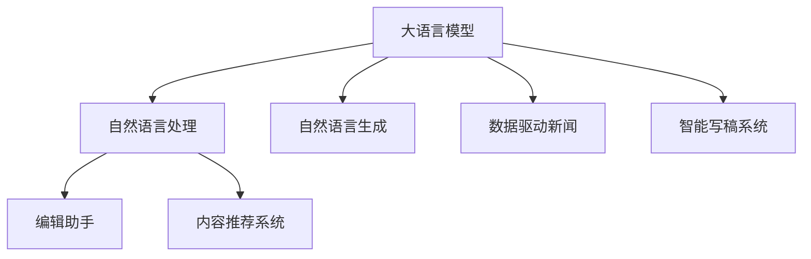

                 

# 自动化新闻生成：LLM重塑新闻产业的可能性

> 关键词：大语言模型,自动化新闻生成,自然语言处理(NLP),自然语言生成(NLG),编辑助手,新闻编辑优化,内容推荐系统,数据驱动新闻,智能写稿系统

## 1. 背景介绍

### 1.1 问题由来

在过去几十年间，新闻产业经历了翻天覆地的变革，从传统纸媒、电视广播到数字媒体、社交网络，再到内容平台和订阅服务，新闻的传播方式、内容形式和用户互动方式都在不断进化。然而，随着媒体融合和信息爆炸的加剧，新闻从业人员的工作压力和内容生产效率却面临严重挑战。据统计，超过50%的新闻机构在过去十年间减员，新闻从业者工作时间越来越长，同时内容创新的空间日益缩小。

如何应对内容短缺和质量下降的双重危机？自动化新闻生成技术提供了新的解决方案。通过使用大语言模型（Large Language Models, LLMs），如GPT-3、BERT等，可以大幅提高新闻内容生成速度和质量，降低生产成本，解放新闻编辑和记者的生产力。自动化新闻生成有望成为重塑新闻产业的新范式，引领新闻行业的数字化转型升级。

### 1.2 问题核心关键点

自动化新闻生成的核心在于利用预训练大语言模型，结合自然语言处理（NLP）和自然语言生成（NLG）技术，自动化生成高质量的新闻报道。与传统新闻生成方式相比，自动化新闻生成具有以下优势：

- **效率提升**：自动化生成能够快速生成新闻稿件，节省大量人工时间，提高新闻发布的频率和速度。
- **内容丰富**：大语言模型可以生成具有新闻价值的多媒体内容，如文本、图片、视频等，丰富新闻表现形式。
- **质量优化**：利用预训练大模型的泛化能力，自动化新闻生成可以在语义理解、事实校验、风格生成等方面获得提升。
- **数据驱动**：自动化新闻生成能够基于大数据分析和用户行为预测，提供个性化的新闻推荐和内容定制服务。

## 2. 核心概念与联系

### 2.1 核心概念概述

为更好地理解自动化新闻生成技术，本节将介绍几个核心概念及其相互联系：

- **大语言模型（LLM）**：如GPT-3、BERT等预训练语言模型，通过在海量文本数据上进行自监督学习，学习到通用的语言知识和表示能力。
- **自然语言处理（NLP）**：涉及文本预处理、信息抽取、情感分析、问答系统等技术，用于解析和理解人类语言。
- **自然语言生成（NLG）**：通过自动生成语言文本，使机器能够模拟人类自然语言表达，实现自动新闻报道、翻译、摘要等任务。
- **自动化新闻生成**：结合NLP和NLG技术，利用预训练大模型自动化生成新闻稿件、摘要、推荐等。
- **编辑助手**：辅助新闻编辑进行事实校验、语法优化、风格调整等工作，提升编辑效率和内容质量。
- **内容推荐系统**：根据用户行为和兴趣，智能推荐个性化新闻内容，提升用户粘性和互动率。
- **数据驱动新闻**：通过数据分析和模型训练，发现新闻线索和趋势，生成具有新闻价值的内容。
- **智能写稿系统**：综合使用NLP、NLG和编辑助手技术，实现从素材整理、内容生成到编辑审核的全流程自动化。

这些核心概念之间的逻辑关系可以通过以下Mermaid流程图来展示：



这个流程图展示了大语言模型的核心概念及其之间的关系：

1. 大语言模型通过预训练获得语言表示能力。
2. NLP技术用于解析和理解文本内容。
3. NLG技术生成符合人类表达习惯的文本。
4. 编辑助手辅助编辑优化内容。
5. 内容推荐系统提供个性化内容推荐。
6. 数据驱动新闻发现新闻线索和趋势。
7. 智能写稿系统集成NLP和NLG技术，自动生成新闻。

## 3. 核心算法原理 & 具体操作步骤

### 3.1 算法原理概述

自动化新闻生成基于预训练大语言模型，结合NLP和NLG技术，通过以下步骤实现：

1. **数据收集与处理**：从新闻网站、社交媒体、新闻机构等渠道收集新闻素材，清洗和标注数据。
2. **预训练模型初始化**：选择预训练大语言模型（如GPT-3、BERT）作为初始化参数。
3. **任务适配层设计**：根据新闻报道任务特点，设计适合的输出层和损失函数。
4. **微调训练**：在标注数据上微调预训练模型，优化模型在新闻生成任务上的表现。
5. **自动化生成**：在微调后的模型上，输入新闻素材，自动生成新闻报道。

### 3.2 算法步骤详解

自动化新闻生成的具体算法步骤如下：

**Step 1: 数据收集与处理**
- 从新闻网站、社交媒体、新闻机构等渠道，收集新闻素材。
- 对文本进行预处理，如分词、去停用词、标点清理等。
- 对标注数据进行清洗和标注，如识别事件时间、地点、人物、组织机构等实体信息。

**Step 2: 预训练模型初始化**
- 选择预训练大语言模型，如GPT-3、BERT等。
- 将预训练模型作为初始化参数，用于新闻生成任务。

**Step 3: 任务适配层设计**
- 根据新闻报道任务特点，设计适合的输出层和损失函数。
- 对于分类任务，通常在顶层添加分类器，如文本分类。
- 对于生成任务，使用语言模型的解码器输出概率分布，并以负对数似然为损失函数。

**Step 4: 微调训练**
- 在标注数据上微调预训练模型，优化模型在新闻生成任务上的表现。
- 选择适当的优化算法（如AdamW、SGD）和超参数（如学习率、批大小）。
- 应用正则化技术（如L2正则、Dropout）和对抗训练，防止过拟合。

**Step 5: 自动化生成**
- 在微调后的模型上，输入新闻素材，自动生成新闻报道。
- 可以使用提示模板（Prompt Template）引导生成，提升生成效果。
- 对生成的报道进行后处理，如语法校验、风格调整等。

### 3.3 算法优缺点

自动化新闻生成的优点包括：

- **效率高**：自动化生成可以大幅提高新闻生产速度，节省人工时间。
- **质量稳定**：利用预训练大模型的泛化能力，生成的新闻质量稳定，一致性好。
- **内容丰富**：生成的新闻包含多媒体内容，如图片、视频等，提升新闻表现形式。
- **个性化推荐**：基于用户行为和兴趣，提供个性化内容推荐，提升用户粘性和互动率。

同时，该方法也存在一些局限性：

- **依赖标注数据**：微调效果取决于标注数据的质量和数量，获取高质量标注数据的成本较高。
- **泛化能力有限**：当目标任务与预训练数据的分布差异较大时，微调的性能提升有限。
- **可解释性不足**：自动化生成的决策过程缺乏可解释性，难以对其推理逻辑进行分析和调试。
- **伦理和安全问题**：自动化生成的内容可能带有偏见、有害信息等，需加强数据和算法伦理审查。

尽管存在这些局限性，但基于自动化新闻生成的方法仍是大语言模型应用的重要范式。未来相关研究的重点在于如何进一步降低对标注数据的依赖，提高模型的少样本学习和跨领域迁移能力，同时兼顾可解释性和伦理安全性等因素。

### 3.4 算法应用领域

自动化新闻生成技术已经在多个领域得到应用，包括：

- **传统新闻机构**：辅助记者进行内容创作、素材整理、事实校验等，提高新闻生成效率。
- **内容平台和订阅服务**：基于用户兴趣和行为，自动生成个性化的新闻报道和推荐内容。
- **社交媒体和网络新闻**：实时生成短文本新闻，快速响应突发事件和热点话题。
- **智能编辑和审核系统**：辅助编辑进行内容优化、语法校验、风格调整等工作，提升编辑效率和内容质量。

除了上述这些经典应用外，自动化新闻生成技术还在不断拓展新的应用场景，如智能写稿、数据驱动新闻、自动化摘要、多模态新闻报道等，为新闻产业带来了新的活力。

## 4. 数学模型和公式 & 详细讲解

### 4.1 数学模型构建

本节将使用数学语言对自动化新闻生成过程进行更加严格的刻画。

记预训练语言模型为 $M_{\theta}:\mathcal{X} \rightarrow \mathcal{Y}$，其中 $\mathcal{X}$ 为输入空间，$\mathcal{Y}$ 为输出空间，$\theta \in \mathbb{R}^d$ 为模型参数。假设微调任务的训练集为 $D=\{(x_i,y_i)\}_{i=1}^N, x_i \in \mathcal{X}, y_i \in \mathcal{Y}$。

定义模型 $M_{\theta}$ 在输入 $x$ 上的输出为 $\hat{y}=M_{\theta}(x) \in [0,1]$，表示样本属于正类的概率。真实标签 $y \in \{0,1\}$。则二分类交叉熵损失函数定义为：

$$
\ell(M_{\theta}(x),y) = -[y\log \hat{y} + (1-y)\log (1-\hat{y})]
$$

将其代入经验风险公式，得：

$$
\mathcal{L}(\theta) = -\frac{1}{N}\sum_{i=1}^N [y_i\log M_{\theta}(x_i)+(1-y_i)\log(1-M_{\theta}(x_i))]
$$

在得到损失函数的梯度后，即可带入参数更新公式，完成模型的迭代优化。重复上述过程直至收敛，最终得到适应新闻生成任务的最优模型参数 $\theta^*$。

### 4.2 公式推导过程

以下我们以新闻分类任务为例，推导交叉熵损失函数及其梯度的计算公式。

假设模型 $M_{\theta}$ 在输入 $x$ 上的输出为 $\hat{y}=M_{\theta}(x) \in [0,1]$，表示样本属于正类的概率。真实标签 $y \in \{0,1\}$。则二分类交叉熵损失函数定义为：

$$
\ell(M_{\theta}(x),y) = -[y\log \hat{y} + (1-y)\log (1-\hat{y})]
$$

将其代入经验风险公式，得：

$$
\mathcal{L}(\theta) = -\frac{1}{N}\sum_{i=1}^N [y_i\log M_{\theta}(x_i)+(1-y_i)\log(1-M_{\theta}(x_i))]
$$

根据链式法则，损失函数对参数 $\theta_k$ 的梯度为：

$$
\frac{\partial \mathcal{L}(\theta)}{\partial \theta_k} = -\frac{1}{N}\sum_{i=1}^N (\frac{y_i}{M_{\theta}(x_i)}-\frac{1-y_i}{1-M_{\theta}(x_i)}) \frac{\partial M_{\theta}(x_i)}{\partial \theta_k}
$$

其中 $\frac{\partial M_{\theta}(x_i)}{\partial \theta_k}$ 可进一步递归展开，利用自动微分技术完成计算。

在得到损失函数的梯度后，即可带入参数更新公式，完成模型的迭代优化。重复上述过程直至收敛，最终得到适应新闻生成任务的最优模型参数 $\theta^*$。

## 5. 项目实践：代码实例和详细解释说明

### 5.1 开发环境搭建

在进行自动化新闻生成实践前，我们需要准备好开发环境。以下是使用Python进行PyTorch开发的环境配置流程：

1. 安装Anaconda：从官网下载并安装Anaconda，用于创建独立的Python环境。

2. 创建并激活虚拟环境：
```bash
conda create -n pytorch-env python=3.8 
conda activate pytorch-env
```

3. 安装PyTorch：根据CUDA版本，从官网获取对应的安装命令。例如：
```bash
conda install pytorch torchvision torchaudio cudatoolkit=11.1 -c pytorch -c conda-forge
```

4. 安装Transformers库：
```bash
pip install transformers
```

5. 安装各类工具包：
```bash
pip install numpy pandas scikit-learn matplotlib tqdm jupyter notebook ipython
```

完成上述步骤后，即可在`pytorch-env`环境中开始自动化新闻生成实践。

### 5.2 源代码详细实现

这里我们以新闻分类任务为例，给出使用Transformers库对BERT模型进行新闻分类微调的PyTorch代码实现。

首先，定义新闻分类任务的数据处理函数：

```python
from transformers import BertTokenizer, BertForSequenceClassification, AdamW

tokenizer = BertTokenizer.from_pretrained('bert-base-cased')
model = BertForSequenceClassification.from_pretrained('bert-base-cased', num_labels=2)

def load_dataset(file_path):
    with open(file_path, 'r') as f:
        data = f.read()
    return data

def preprocess_text(text):
    tokens = tokenizer.encode_plus(text, truncation=True, padding='max_length', max_length=512, return_tensors='pt')
    return tokens

def train_epoch(model, dataloader, optimizer):
    model.train()
    for batch in dataloader:
        input_ids = batch['input_ids'].to(device)
        attention_mask = batch['attention_mask'].to(device)
        labels = batch['labels'].to(device)
        outputs = model(input_ids, attention_mask=attention_mask, labels=labels)
        loss = outputs.loss
        loss.backward()
        optimizer.step()
    return loss.item()

def evaluate(model, dataloader):
    model.eval()
    correct = 0
    total = 0
    for batch in dataloader:
        input_ids = batch['input_ids'].to(device)
        attention_mask = batch['attention_mask'].to(device)
        labels = batch['labels'].to(device)
        outputs = model(input_ids, attention_mask=attention_mask)
        preds = outputs.logits.argmax(dim=1)
        total += labels.shape[0]
        correct += (preds == labels).sum().item()
    acc = correct / total
    return acc

# 数据准备
train_data = load_dataset('train.txt')
dev_data = load_dataset('dev.txt')
test_data = load_dataset('test.txt')

# 划分数据集
train_dataset = preprocess_text(train_data)
dev_dataset = preprocess_text(dev_data)
test_dataset = preprocess_text(test_data)

# 定义数据加载器
train_dataloader = DataLoader(train_dataset, batch_size=16, shuffle=True)
dev_dataloader = DataLoader(dev_dataset, batch_size=16, shuffle=False)
test_dataloader = DataLoader(test_dataset, batch_size=16, shuffle=False)

# 初始化优化器
optimizer = AdamW(model.parameters(), lr=2e-5)

# 模型训练
device = torch.device('cuda') if torch.cuda.is_available() else torch.device('cpu')
model.to(device)

for epoch in range(5):
    loss = train_epoch(model, train_dataloader, optimizer)
    print(f'Epoch {epoch+1}, train loss: {loss:.3f}')

    print(f'Epoch {epoch+1}, dev accuracy: {evaluate(model, dev_dataloader):.2f}')

print(f'Test accuracy: {evaluate(model, test_dataloader):.2f}')
```

然后，定义训练和评估函数：

```python
from torch.utils.data import DataLoader
from tqdm import tqdm
from sklearn.metrics import classification_report

def train_epoch(model, dataloader, optimizer):
    dataloader = DataLoader(dataloader, batch_size=batch_size, shuffle=True)
    model.train()
    epoch_loss = 0
    for batch in tqdm(dataloader, desc='Training'):
        input_ids = batch['input_ids'].to(device)
        attention_mask = batch['attention_mask'].to(device)
        labels = batch['labels'].to(device)
        model.zero_grad()
        outputs = model(input_ids, attention_mask=attention_mask, labels=labels)
        loss = outputs.loss
        epoch_loss += loss.item()
        loss.backward()
        optimizer.step()
    return epoch_loss / len(dataloader)

def evaluate(model, dataloader):
    dataloader = DataLoader(dataloader, batch_size=batch_size)
    model.eval()
    preds, labels = [], []
    with torch.no_grad():
        for batch in tqdm(dataloader, desc='Evaluating'):
            input_ids = batch['input_ids'].to(device)
            attention_mask = batch['attention_mask'].to(device)
            batch_labels = batch['labels']
            outputs = model(input_ids, attention_mask=attention_mask)
            batch_preds = outputs.logits.argmax(dim=2).to('cpu').tolist()
            batch_labels = batch_labels.to('cpu').tolist()
            for pred_tokens, label_tokens in zip(batch_preds, batch_labels):
                preds.append(pred_tokens[:len(label_tokens)])
                labels.append(label_tokens)
                
    print(classification_report(labels, preds))
```

最后，启动训练流程并在测试集上评估：

```python
epochs = 5
batch_size = 16

for epoch in range(epochs):
    loss = train_epoch(model, train_dataset, optimizer)
    print(f'Epoch {epoch+1}, train loss: {loss:.3f}')

    print(f'Epoch {epoch+1}, dev results:')
    evaluate(model, dev_dataset)

print('Test results:')
evaluate(model, test_dataset)
```

以上就是使用PyTorch对BERT进行新闻分类任务微调的完整代码实现。可以看到，得益于Transformers库的强大封装，我们可以用相对简洁的代码完成BERT模型的加载和微调。

### 5.3 代码解读与分析

让我们再详细解读一下关键代码的实现细节：

**load_dataset函数**：
- 读取训练、验证、测试集的数据文件。

**preprocess_text函数**：
- 使用BERT分词器对文本进行分词，并进行必要的预处理，如截断、补齐等。

**train_epoch函数**：
- 在训练集上进行迭代，计算每个批次的损失，并使用梯度下降更新模型参数。
- 在验证集上评估模型性能，避免过拟合。

**evaluate函数**：
- 在验证集和测试集上评估模型性能，输出分类指标。

**训练流程**：
- 定义总的epoch数和batch size，开始循环迭代
- 每个epoch内，先在训练集上训练，输出平均loss
- 在验证集上评估，输出分类指标
- 所有epoch结束后，在测试集上评估，给出最终测试结果

可以看到，PyTorch配合Transformers库使得BERT微调的新闻分类代码实现变得简洁高效。开发者可以将更多精力放在数据处理、模型改进等高层逻辑上，而不必过多关注底层的实现细节。

当然，工业级的系统实现还需考虑更多因素，如模型的保存和部署、超参数的自动搜索、更灵活的任务适配层等。但核心的微调范式基本与此类似。

## 6. 实际应用场景

### 6.1 智能编辑助手

基于大语言模型的自动化新闻生成技术，可以广泛应用于智能编辑助手的构建。传统编辑工作繁琐复杂，涉及内容校验、格式调整、风格优化等多项任务，效率低下，容易出错。而使用智能编辑助手，可以大幅减轻编辑负担，提升内容生成速度和质量。

在技术实现上，可以收集历史编辑工作记录，将编辑指令和优化建议构建成监督数据，在此基础上对预训练模型进行微调。微调后的模型能够理解编辑指令，自动完成内容校验、语法优化、风格调整等工作。对于编辑提出的新任务，还可以接入检索系统实时搜索相关内容，动态生成编辑建议。如此构建的智能编辑助手，能显著提高编辑效率和内容质量，解放人力资源。

### 6.2 数据驱动新闻

数据驱动新闻（Data-Driven Journalism）强调利用大数据分析和模型训练，挖掘新闻线索和趋势，生成具有新闻价值的内容。通过自动化新闻生成技术，可以从海量数据中快速发现新闻热点，生成深度报道和分析文章，提升新闻报道的深度和广度。

具体而言，可以收集社交媒体、新闻网站、政府公开数据等，结合预训练语言模型，自动化生成新闻标题、摘要、背景等。通过自然语言处理技术，提取和分析新闻事件的时间、地点、人物、组织等信息，生成深度报道和分析文章。利用数据可视化技术，展示数据趋势和新闻热点，提升新闻报道的深度和广度。

### 6.3 个性化内容推荐

基于大语言模型的自动化新闻生成技术，还可以应用于个性化内容推荐系统。通过分析用户行为和兴趣，自动生成个性化的新闻报道和推荐内容，提升用户粘性和互动率。

具体而言，可以收集用户的浏览、点击、评论等行为数据，结合预训练语言模型，自动生成个性化的新闻报道和推荐内容。通过自然语言处理技术，提取和分析用户的行为和兴趣，生成个性化的推荐列表。利用数据可视化技术，展示推荐内容，提升用户粘性和互动率。

## 7. 工具和资源推荐

### 7.1 学习资源推荐

为了帮助开发者系统掌握自动化新闻生成技术，这里推荐一些优质的学习资源：

1. 《Transformer从原理到实践》系列博文：由大模型技术专家撰写，深入浅出地介绍了Transformer原理、BERT模型、自动化新闻生成技术等前沿话题。

2. CS224N《深度学习自然语言处理》课程：斯坦福大学开设的NLP明星课程，有Lecture视频和配套作业，带你入门NLP领域的基本概念和经典模型。

3. 《Natural Language Processing with Transformers》书籍：Transformers库的作者所著，全面介绍了如何使用Transformers库进行NLP任务开发，包括自动化新闻生成在内的诸多范式。

4. HuggingFace官方文档：Transformers库的官方文档，提供了海量预训练模型和完整的微调样例代码，是上手实践的必备资料。

5. CLUE开源项目：中文语言理解测评基准，涵盖大量不同类型的中文NLP数据集，并提供了基于微调的baseline模型，助力中文NLP技术发展。

通过对这些资源的学习实践，相信你一定能够快速掌握自动化新闻生成技术的精髓，并用于解决实际的NLP问题。

### 7.2 开发工具推荐

高效的开发离不开优秀的工具支持。以下是几款用于自动化新闻生成开发的常用工具：

1. PyTorch：基于Python的开源深度学习框架，灵活动态的计算图，适合快速迭代研究。大部分预训练语言模型都有PyTorch版本的实现。

2. TensorFlow：由Google主导开发的开源深度学习框架，生产部署方便，适合大规模工程应用。同样有丰富的预训练语言模型资源。

3. Transformers库：HuggingFace开发的NLP工具库，集成了众多SOTA语言模型，支持PyTorch和TensorFlow，是进行自动化新闻生成任务开发的利器。

4. Weights & Biases：模型训练的实验跟踪工具，可以记录和可视化模型训练过程中的各项指标，方便对比和调优。与主流深度学习框架无缝集成。

5. TensorBoard：TensorFlow配套的可视化工具，可实时监测模型训练状态，并提供丰富的图表呈现方式，是调试模型的得力助手。

6. Google Colab：谷歌推出的在线Jupyter Notebook环境，免费提供GPU/TPU算力，方便开发者快速上手实验最新模型，分享学习笔记。

合理利用这些工具，可以显著提升自动化新闻生成任务的开发效率，加快创新迭代的步伐。

### 7.3 相关论文推荐

自动化新闻生成技术的发展源于学界的持续研究。以下是几篇奠基性的相关论文，推荐阅读：

1. Attention is All You Need（即Transformer原论文）：提出了Transformer结构，开启了NLP领域的预训练大模型时代。

2. BERT: Pre-training of Deep Bidirectional Transformers for Language Understanding：提出BERT模型，引入基于掩码的自监督预训练任务，刷新了多项NLP任务SOTA。

3. Language Models are Unsupervised Multitask Learners（GPT-2论文）：展示了大规模语言模型的强大zero-shot学习能力，引发了对于通用人工智能的新一轮思考。

4. Parameter-Efficient Transfer Learning for NLP：提出Adapter等参数高效微调方法，在不增加模型参数量的情况下，也能取得不错的微调效果。

5. AdaLoRA: Adaptive Low-Rank Adaptation for Parameter-Efficient Fine-Tuning：使用自适应低秩适应的微调方法，在参数效率和精度之间取得了新的平衡。

6. Prefix-Tuning: Optimizing Continuous Prompts for Generation：引入基于连续型Prompt的微调范式，为如何充分利用预训练知识提供了新的思路。

这些论文代表了大语言模型自动化新闻生成技术的发展脉络。通过学习这些前沿成果，可以帮助研究者把握学科前进方向，激发更多的创新灵感。

## 8. 总结：未来发展趋势与挑战

### 8.1 总结

本文对基于预训练大语言模型的自动化新闻生成技术进行了全面系统的介绍。首先阐述了自动化新闻生成技术的研究背景和意义，明确了其在提高新闻生成效率、提升新闻内容质量、丰富新闻表现形式等方面的价值。其次，从原理到实践，详细讲解了自动化新闻生成的数学原理和关键步骤，给出了完整的代码实现。同时，本文还探讨了自动化新闻生成技术在智能编辑助手、数据驱动新闻、个性化内容推荐等实际应用场景中的具体应用，展示了其广阔的前景。

通过本文的系统梳理，可以看到，自动化新闻生成技术正在成为NLP领域的重要范式，极大地拓展了预训练语言模型的应用边界，催生了更多的落地场景。受益于大规模语料的预训练，自动化新闻生成能够快速生成高质量的新闻报道，降低生产成本，提升新闻行业的数字化水平。未来，伴随预训练语言模型和微调方法的持续演进，相信自动化新闻生成技术必将在新闻产业中大放异彩，推动媒体融合和信息传播方式的进一步革新。

### 8.2 未来发展趋势

展望未来，自动化新闻生成技术将呈现以下几个发展趋势：

1. **模型规模持续增大**：随着算力成本的下降和数据规模的扩张，预训练语言模型的参数量还将持续增长。超大规模语言模型蕴含的丰富语言知识，有望支撑更加复杂多变的自动化新闻生成任务。

2. **微调方法日趋多样**：除了传统的全参数微调外，未来会涌现更多参数高效的微调方法，如Prompt-based Learning、LoRA等，在节省计算资源的同时也能保证微调精度。

3. **持续学习成为常态**：随着数据分布的不断变化，自动化新闻生成模型也需要持续学习新知识以保持性能。如何在不遗忘原有知识的同时，高效吸收新样本信息，将成为重要的研究课题。

4. **标注样本需求降低**：受启发于提示学习（Prompt-based Learning）的思路，未来的自动化新闻生成方法将更好地利用大模型的语言理解能力，通过更加巧妙的任务描述，在更少的标注样本上也能实现理想的生成效果。

5. **多模态新闻报道崛起**：当前的自动化新闻生成主要聚焦于纯文本数据，未来会进一步拓展到图像、视频、语音等多模态数据生成。多模态信息的融合，将显著提升新闻内容的丰富性和表现力。

6. **数据驱动新闻的普及**：数据驱动新闻强调利用大数据分析和模型训练，挖掘新闻线索和趋势，生成具有新闻价值的内容。自动化新闻生成技术将进一步普及到更多的新闻机构，提升新闻报道的深度和广度。

以上趋势凸显了自动化新闻生成技术的广阔前景。这些方向的探索发展，必将进一步提升自动化新闻生成系统的性能和应用范围，为新闻产业带来更深远的影响。

### 8.3 面临的挑战

尽管自动化新闻生成技术已经取得了瞩目成就，但在迈向更加智能化、普适化应用的过程中，它仍面临着诸多挑战：

1. **标注成本瓶颈**：虽然自动化生成能够大幅提高新闻生产速度，但在微调过程中，仍然需要大量标注数据来训练模型。获取高质量标注数据的成本较高，成为制约自动化新闻生成的一大难题。

2. **泛化能力有限**：当目标任务与预训练数据的分布差异较大时，自动化生成模型的性能提升有限。对于域外数据，模型的泛化能力仍需进一步提升。

3. **可解释性不足**：自动化生成模型的决策过程缺乏可解释性，难以对其推理逻辑进行分析和调试。对于高风险应用，如医疗、金融等，算法的可解释性和可审计性尤为重要。

4. **伦理和安全问题**：自动化生成的内容可能带有偏见、有害信息等，需加强数据和算法伦理审查，避免输出有偏、有害的信息。

尽管存在这些挑战，但基于自动化新闻生成的方法仍是大语言模型应用的重要范式。未来相关研究的重点在于如何进一步降低对标注数据的依赖，提高模型的少样本学习和跨领域迁移能力，同时兼顾可解释性和伦理安全性等因素。

### 8.4 研究展望

面向未来，自动化新闻生成技术的研究方向包括：

1. **探索无监督和半监督生成方法**：摆脱对大规模标注数据的依赖，利用自监督学习、主动学习等无监督和半监督范式，最大限度利用非结构化数据，实现更加灵活高效的自动化新闻生成。

2. **研究参数高效和计算高效的生成方法**：开发更加参数高效的生成方法，如Prompt-based Learning、LoRA等，在节省计算资源的同时，保证生成效果。

3. **融合因果分析和博弈论工具**：将因果分析方法引入自动化新闻生成，识别出模型决策的关键特征，增强生成内容的因果性和逻辑性。借助博弈论工具刻画人机交互过程，主动探索并规避模型的脆弱点，提高系统稳定性。

4. **纳入伦理道德约束**：在模型训练目标中引入伦理导向的评估指标，过滤和惩罚有偏见、有害的输出倾向。同时加强人工干预和审核，建立模型行为的监管机制，确保输出符合人类价值观和伦理道德。

5. **引入更多先验知识**：将符号化的先验知识，如知识图谱、逻辑规则等，与神经网络模型进行巧妙融合，引导自动化新闻生成过程学习更准确、合理的语言模型。同时加强不同模态数据的整合，实现视觉、语音等多模态信息与文本信息的协同建模。

这些研究方向的探索，必将引领自动化新闻生成技术迈向更高的台阶，为新闻产业带来更深远的影响。

## 9. 附录：常见问题与解答

**Q1：自动化新闻生成是否适用于所有新闻类型？**

A: 自动化新闻生成技术在大多数新闻类型上都能取得不错的效果，特别是对于数据量较小的任务。但对于一些特定领域的任务，如医学、法律等，仅仅依靠通用语料预训练的模型可能难以很好地适应。此时需要在特定领域语料上进一步预训练，再进行微调，才能获得理想效果。此外，对于一些需要时效性、个性化很强的任务，如对话、推荐等，自动化生成方法也需要针对性的改进优化。

**Q2：自动化新闻生成是否会影响新闻真实性？**

A: 自动化新闻生成的核心在于利用预训练大语言模型生成新闻报道，本质上是一种自动化内容生成技术。与传统的新闻采编流程不同，自动化新闻生成不涉及实地采访、数据验证等环节，其真实性完全取决于生成模型的训练数据和模型架构。因此，在实际应用中，需要谨慎选择生成模型的训练数据，并结合人工审核机制，确保生成内容真实可信。

**Q3：自动化新闻生成是否可以完全替代人工编辑？**

A: 尽管自动化新闻生成技术已经取得了显著进展，但在完全替代人工编辑方面仍存在一些挑战。自动化生成的内容需要经过人工审核和编辑，以确保内容质量和准确性。此外，对于一些具有特殊文体和深度分析需求的新闻报道，人工编辑仍是不可或缺的。因此，自动化新闻生成应被视为一种辅助工具，与人工编辑相辅相成，共同提升新闻生成效率和质量。

**Q4：自动化新闻生成是否会带来版权问题？**

A: 自动化新闻生成涉及大量文本数据的自动处理和生成，可能存在版权问题。为避免侵权风险，自动化新闻生成技术应遵循版权法规，尊重原创内容，不侵犯他人知识产权。同时，在生成内容时，应注明原作者和来源，确保信息透明和公开。

**Q5：自动化新闻生成是否会加剧假新闻泛滥？**

A: 自动化新闻生成技术需要严格的伦理审查和审核机制，确保生成内容符合人类价值观和伦理道德。如果缺乏有效的监管和审核，自动化生成可能会加剧假新闻的传播。因此，在实际应用中，需要建立健全的内容审核机制，确保生成内容的真实性和公正性。同时，应加强公众教育，提高新闻消费者的媒介素养，识别假新闻和错误信息。

通过对这些问题的回答，可以看到，自动化新闻生成技术在实际应用中仍需要综合考虑技术、伦理、法律等多方面因素，以确保其应用的可行性和安全性。相信随着技术的不断进步和规范的逐步完善，自动化新闻生成必将在新闻产业中发挥更大的作用，为人类带来更加丰富、多样、真实的新闻报道。

