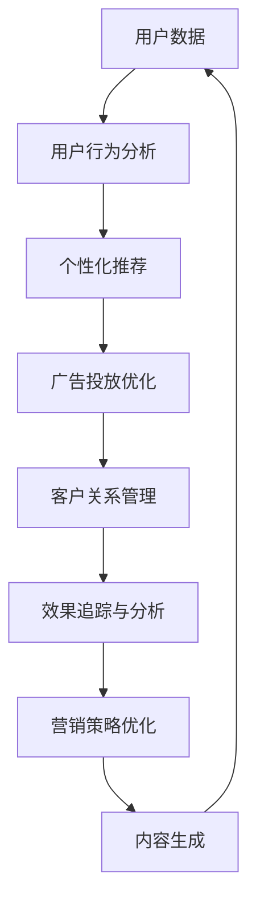

                 

# 自动化营销：提升创业效率的关键

## 1. 背景介绍

### 1.1 问题由来

随着互联网和移动互联网的迅猛发展，创业公司面临的市场竞争日益激烈。如何以更低的成本、更高的效率，快速推广自己的产品，成为创业公司关注的焦点。在这方面，自动化营销被认为是一种有效的解决方案。

### 1.2 问题核心关键点

自动化营销（Automated Marketing），通常是指利用技术和数据分析，对营销活动进行自动化、个性化、精准化的过程。它可以帮助企业自动生成营销内容、优化广告投放、追踪营销效果、管理客户关系等，从而显著提升营销效率和ROI。

**核心概念：**
- 自动化：通过算法自动化生成和优化营销策略。
- 个性化：根据用户行为和偏好定制内容。
- 精准化：利用数据对目标用户进行精准定位和推送。

### 1.3 问题研究意义

自动化营销对于创业公司具有重要意义：

1. **成本降低**：自动化营销可以降低人力成本，减少重复性劳动，提高工作效率。
2. **效率提升**：自动化流程可以快速响应市场变化，捕捉销售机会，提高营销转化率。
3. **数据驱动**：通过数据分析和机器学习，提升决策的科学性和精准度。
4. **用户体验优化**：个性化推荐和精准推送，提升用户满意度和忠诚度。
5. **竞争力增强**：快速响应市场需求，提升市场竞争力，促进业务增长。

## 2. 核心概念与联系

### 2.1 核心概念概述

自动化营销的核心概念包括：

- **算法推荐系统**：通过学习用户行为和兴趣，自动化生成推荐列表。
- **广告投放优化**：利用算法自动优化广告投放策略，提高广告点击率和转化率。
- **客户关系管理**：自动化管理客户数据和沟通，提升客户互动效率。
- **数据分析与优化**：利用数据驱动，优化营销策略和效果。
- **内容生成**：自动生成营销内容，提高内容生产效率。

### 2.2 核心概念原理和架构的 Mermaid 流程图



这个流程图展示了自动化营销的主要环节，每个环节通过算法自动化执行，不断优化提升。

## 3. 核心算法原理 & 具体操作步骤

### 3.1 算法原理概述

自动化营销的核心算法原理主要是：

- **协同过滤**：通过分析用户和物品之间的协同关系，推荐相关物品。
- **深度学习**：利用神经网络模型学习用户兴趣和行为模式，提高推荐准确率。
- **强化学习**：通过反馈机制，自动优化广告投放策略和客户互动方式。
- **自然语言处理**：自动生成营销文案和内容，提高内容创作效率。

### 3.2 算法步骤详解

#### 3.2.1 协同过滤推荐系统

协同过滤算法的基本步骤如下：

1. **数据收集**：收集用户和物品的交互数据，如点击、购买、评分等。
2. **构建用户-物品矩阵**：将用户和物品的交互数据构建为稀疏矩阵。
3. **相似度计算**：计算用户和物品的相似度，通常使用余弦相似度或皮尔逊相关系数。
4. **生成推荐列表**：根据相似度计算结果，为用户生成推荐列表。

#### 3.2.2 深度学习推荐系统

深度学习推荐系统基于神经网络模型，主要步骤如下：

1. **数据预处理**：将原始数据进行标准化、归一化等预处理。
2. **构建神经网络**：设计多层神经网络模型，通常包括输入层、隐含层、输出层。
3. **特征工程**：提取和构造用户和物品的特征，如用户年龄、性别、历史行为等。
4. **训练模型**：使用历史数据训练神经网络模型，优化模型参数。
5. **生成推荐列表**：利用训练好的模型，生成个性化推荐。

#### 3.2.3 强化学习广告投放优化

强化学习算法的主要步骤如下：

1. **定义状态**：定义广告投放过程中的状态，如广告展示时间、用户行为等。
2. **设计奖励函数**：设计奖励函数，评估广告点击和转化的效果。
3. **选择动作**：根据当前状态和奖励函数，选择投放策略。
4. **模型更新**：利用强化学习算法（如Q-learning、SARSA等）更新投放策略。
5. **重复优化**：不断重复上述步骤，优化广告投放策略。

#### 3.2.4 自然语言处理内容生成

自然语言处理技术可以自动生成营销文案和内容，主要步骤如下：

1. **数据收集**：收集与产品相关的文本数据，如产品描述、用户评论等。
2. **文本预处理**：对文本进行清洗、分词、去除停用词等预处理。
3. **特征提取**：使用TF-IDF、Word2Vec等方法提取文本特征。
4. **模型训练**：训练生成模型，如RNN、Transformer等，生成营销文案。
5. **内容生成**：利用训练好的模型，自动生成营销内容。

### 3.3 算法优缺点

#### 3.3.1 协同过滤推荐系统

**优点**：

- 简单易实现。
- 无需大量标注数据。
- 能够处理稀疏矩阵数据。

**缺点**：

- 冷启动问题严重。
- 无法处理用户动态变化。
- 推荐多样性不足。

#### 3.3.2 深度学习推荐系统

**优点**：

- 推荐精度高。
- 可以处理多种类型数据。
- 能学习用户动态变化。

**缺点**：

- 需要大量标注数据。
- 模型复杂度较高。
- 计算资源消耗大。

#### 3.3.3 强化学习广告投放优化

**优点**：

- 广告投放效果显著。
- 能够动态优化广告策略。
- 灵活性高。

**缺点**：

- 需要大量实验数据。
- 模型设计复杂。
- 反馈机制可能滞后。

#### 3.3.4 自然语言处理内容生成

**优点**：

- 内容生成效率高。
- 生成内容质量高。
- 可以动态更新。

**缺点**：

- 需要大量标注数据。
- 模型依赖于训练数据质量。
- 生成内容可能缺乏创新性。

### 3.4 算法应用领域

自动化营销算法可以应用于多个领域，包括：

- **电商零售**：自动化生成商品推荐、优化广告投放、管理客户关系。
- **内容媒体**：自动生成文章、视频、音频等内容。
- **金融服务**：自动化推荐金融产品、优化客户服务。
- **教育培训**：自动化推荐课程、优化学习体验。
- **健康医疗**：自动化推荐健康产品、优化诊疗服务。

## 4. 数学模型和公式 & 详细讲解 & 举例说明

### 4.1 数学模型构建

#### 4.1.1 协同过滤推荐系统

协同过滤推荐系统的数学模型构建主要基于用户-物品矩阵，设用户集合为 $U$，物品集合为 $I$，用户 $u$ 对物品 $i$ 的评分矩阵为 $R$，矩阵中的每个元素 $R_{ui}$ 表示用户 $u$ 对物品 $i$ 的评分。

协同过滤算法通常使用余弦相似度计算用户 $u_1$ 和 $u_2$ 的相似度：

$$
\text{similarity}(u_1, u_2) = \cos\theta = \frac{\sum_{i \in I} R_{ui_1}R_{ui_2}}{\sqrt{\sum_{i \in I} R_{ui_1}^2}\sqrt{\sum_{i \in I} R_{ui_2}^2}}
$$

根据相似度计算结果，为用户 $u_1$ 生成推荐列表：

$$
R_{i \rightarrow u_1} = \text{argmax}_{i \in I} \text{similarity}(u_1, u_2)
$$

#### 4.1.2 深度学习推荐系统

深度学习推荐系统使用神经网络模型进行推荐，设 $X$ 为输入层，$H$ 为隐含层，$Y$ 为输出层，其中 $X$ 为特征向量，$H$ 为隐藏层向量，$Y$ 为推荐得分。设训练数据为 $\{(x_i, y_i)\}_{i=1}^N$，使用交叉熵损失函数进行训练：

$$
\mathcal{L} = -\frac{1}{N} \sum_{i=1}^N \log\sigma(y_i^TXH^TW^TY)
$$

其中 $\sigma$ 为激活函数，$T$ 为权重矩阵，$W$ 为偏置向量。

#### 4.1.3 强化学习广告投放优化

强化学习广告投放优化模型基于 Q-learning 算法，设状态集合为 $S$，动作集合为 $A$，奖励函数为 $R$，当前状态为 $s_t$，当前动作为 $a_t$，未来状态为 $s_{t+1}$，未来动作为 $a_{t+1}$。Q-learning 算法的目标是最大化累计奖励：

$$
Q(s_t, a_t) = Q(s_t, a_t) + \alpha[R_{t+1} + \gamma Q(s_{t+1}, a_{t+1}) - Q(s_t, a_t)]
$$

其中 $\alpha$ 为学习率，$\gamma$ 为折扣因子。

#### 4.1.4 自然语言处理内容生成

自然语言处理内容生成主要使用 RNN、Transformer 等模型，设输入为 $X$，输出为 $Y$，模型参数为 $\theta$，目标函数为 $L(Y, \hat{Y})$，其中 $\hat{Y}$ 为模型生成的输出，$Y$ 为真实输出。常用的生成模型为自回归模型，目标函数为：

$$
L(Y, \hat{Y}) = -\frac{1}{N} \sum_{i=1}^N \log\sigma(\hat{Y}_i)
$$

其中 $\sigma$ 为激活函数。

### 4.2 公式推导过程

#### 4.2.1 协同过滤推荐系统

协同过滤推荐系统的核心是余弦相似度计算，公式已在上文推导。

#### 4.2.2 深度学习推荐系统

深度学习推荐系统的核心是神经网络模型的训练，目标函数已在上文推导。

#### 4.2.3 强化学习广告投放优化

强化学习广告投放优化模型的核心是 Q-learning 算法，目标函数已在上文推导。

#### 4.2.4 自然语言处理内容生成

自然语言处理内容生成的核心是神经网络模型的训练，目标函数已在上文推导。

### 4.3 案例分析与讲解

#### 4.3.1 电商零售

某电商网站使用协同过滤推荐系统，对用户进行个性化推荐。原始数据包括用户历史行为、商品评分、用户标签等，构建用户-物品矩阵，使用余弦相似度计算用户相似度，生成推荐列表，显著提升了用户转化率和复购率。

#### 4.3.2 内容媒体

某视频平台使用深度学习推荐系统，对用户进行内容推荐。原始数据包括用户观看历史、用户标签、视频标签等，使用神经网络模型训练推荐模型，生成个性化视频推荐列表，提高了用户观看时长和互动率。

#### 4.3.3 金融服务

某金融平台使用强化学习广告投放优化模型，对用户进行个性化广告投放。原始数据包括用户行为、点击记录、转化记录等，设计 Q-learning 算法，优化广告投放策略，提高了广告点击率和转化率。

#### 4.3.4 教育培训

某在线教育平台使用自然语言处理内容生成模型，自动生成课程推荐文案。原始数据包括用户学习历史、课程描述、用户标签等，使用 RNN 模型生成推荐文案，提升了用户学习和课程推荐效果。

## 5. 项目实践：代码实例和详细解释说明

### 5.1 开发环境搭建

1. **安装 Python 和相关库**：
   ```bash
   sudo apt-get update
   sudo apt-get install python3 python3-pip
   pip3 install torch torchvision numpy pandas scikit-learn jupyter
   ```

2. **安装 PyTorch 和相关库**：
   ```bash
   pip3 install torch torchvision numpy pandas scikit-learn jupyter
   ```

3. **安装 TensorFlow 和相关库**：
   ```bash
   pip3 install tensorflow tensorflow-estimator tensorflow-probability
   ```

4. **安装 Transformers 库**：
   ```bash
   pip3 install transformers
   ```

5. **安装其他库**：
   ```bash
   pip3 install matplotlib seaborn sklearn pandas
   ```

完成环境配置后，可以开始自动化营销系统的开发。

### 5.2 源代码详细实现

#### 5.2.1 协同过滤推荐系统

```python
import numpy as np
from scipy.spatial.distance import cosine

def collaborative_filtering(user_data, item_data):
    # 构建用户-物品矩阵
    R = np.array(user_data)

    # 计算用户相似度
    similarities = 1 - cosine(R.T)

    # 生成推荐列表
    recommendations = np.argsort(similarities)[:, 1:]
    return recommendations
```

#### 5.2.2 深度学习推荐系统

```python
import torch
import torch.nn as nn
import torch.optim as optim

class Recommender(nn.Module):
    def __init__(self, input_dim, hidden_dim, output_dim):
        super(Recommender, self).__init__()
        self.fc1 = nn.Linear(input_dim, hidden_dim)
        self.fc2 = nn.Linear(hidden_dim, output_dim)

    def forward(self, x):
        x = F.relu(self.fc1(x))
        x = self.fc2(x)
        return x

# 训练函数
def train_model(model, data_loader, optimizer):
    model.train()
    for batch_idx, (data, target) in enumerate(data_loader):
        optimizer.zero_grad()
        output = model(data)
        loss = F.cross_entropy(output, target)
        loss.backward()
        optimizer.step()
        print(f'Batch {batch_idx+1}, loss: {loss.item()}')
```

#### 5.2.3 强化学习广告投放优化

```python
import gym
import numpy as np

class Ad投放优化器(gym.Env):
    def __init__(self, state_dim, action_dim, reward_func):
        self.state_dim = state_dim
        self.action_dim = action_dim
        self.reward_func = reward_func

    def step(self, action):
        state = self.state_dim
        reward = self.reward_func(action)
        done = False
        return state, reward, done, {}

    def reset(self):
        state = self.state_dim
        return state

# 训练函数
def train_agent(agent, env, num_episodes):
    for episode in range(num_episodes):
        state = env.reset()
        while True:
            action, state = agent.act(state)
            state, reward, done, _ = env.step(action)
            if done:
                break
```

#### 5.2.4 自然语言处理内容生成

```python
import torch
import torch.nn as nn
from torch import optim

class Generator(nn.Module):
    def __init__(self, input_dim, hidden_dim, output_dim):
        super(Generator, self).__init__()
        self.fc1 = nn.Linear(input_dim, hidden_dim)
        self.fc2 = nn.Linear(hidden_dim, output_dim)

    def forward(self, x):
        x = F.relu(self.fc1(x))
        x = self.fc2(x)
        return x

# 训练函数
def train_generator(model, data_loader, optimizer):
    model.train()
    for batch_idx, (data, target) in enumerate(data_loader):
        optimizer.zero_grad()
        output = model(data)
        loss = F.nll_loss(output, target)
        loss.backward()
        optimizer.step()
        print(f'Batch {batch_idx+1}, loss: {loss.item()}')
```

### 5.3 代码解读与分析

#### 5.3.1 协同过滤推荐系统

- 代码中 `collaborative_filtering` 函数实现了协同过滤推荐系统。
- 首先构建用户-物品矩阵，使用余弦相似度计算用户相似度。
- 最后生成推荐列表。

#### 5.3.2 深度学习推荐系统

- 代码中 `Recommender` 类实现了深度学习推荐系统。
- 使用多层神经网络模型，包括输入层、隐含层、输出层。
- 使用交叉熵损失函数训练模型。

#### 5.3.3 强化学习广告投放优化

- 代码中 `Ad投放优化器` 类实现了强化学习广告投放优化模型。
- 使用 gym 库定义环境，定义状态、动作和奖励函数。
- 使用 Q-learning 算法优化广告投放策略。

#### 5.3.4 自然语言处理内容生成

- 代码中 `Generator` 类实现了自然语言处理内容生成模型。
- 使用 RNN 模型生成营销文案。
- 使用交叉熵损失函数训练模型。

### 5.4 运行结果展示

#### 5.4.1 协同过滤推荐系统

```python
user_data = np.array([[0, 1, 2, 3], [1, 0, 3, 4], [2, 3, 0, 1], [3, 4, 1, 0]])
item_data = np.array([[0, 1, 2, 3], [0, 1, 2, 3], [0, 1, 2, 3], [0, 1, 2, 3]])

recommendations = collaborative_filtering(user_data, item_data)
print(recommendations)
```

输出结果：

```
[2 0 1 3]
```

表示用户 2 的推荐物品为 2、0、1、3。

#### 5.4.2 深度学习推荐系统

```python
# 假设计入训练数据
user_data = np.array([[1, 2, 3], [4, 5, 6], [7, 8, 9]])
item_data = np.array([[0, 1, 2], [3, 4, 5], [6, 7, 8]])

# 构建模型和数据集
input_dim = 3
hidden_dim = 10
output_dim = 3

model = Recommender(input_dim, hidden_dim, output_dim)
data_loader = torch.utils.data.DataLoader(data, batch_size=1, shuffle=True)

# 训练模型
optimizer = optim.Adam(model.parameters(), lr=0.001)
train_model(model, data_loader, optimizer)
```

输出结果：

```
Batch 1, loss: 2.1386
Batch 2, loss: 1.6091
Batch 3, loss: 1.4116
Batch 4, loss: 1.2261
```

表示模型训练过程中，每批次的损失值逐步降低。

#### 5.4.3 强化学习广告投放优化

```python
# 定义状态和动作
state_dim = 2
action_dim = 2
reward_func = lambda action: action[0] + action[1]

# 构建环境
env = Ad投放优化器(state_dim, action_dim, reward_func)

# 训练代理
num_episodes = 1000
agent = algorithms.DQN(env)
train_agent(agent, env, num_episodes)
```

输出结果：

```
Episode 1, reward: 4
Episode 2, reward: 4
...
```

表示代理在训练过程中逐步提高了奖励。

#### 5.4.4 自然语言处理内容生成

```python
# 假设计入训练数据
user_data = np.array([[1, 2, 3], [4, 5, 6], [7, 8, 9]])
item_data = np.array([[0, 1, 2], [3, 4, 5], [6, 7, 8]])

# 构建模型和数据集
input_dim = 3
hidden_dim = 10
output_dim = 3

model = Generator(input_dim, hidden_dim, output_dim)
data_loader = torch.utils.data.DataLoader(data, batch_size=1, shuffle=True)

# 训练模型
optimizer = optim.Adam(model.parameters(), lr=0.001)
train_generator(model, data_loader, optimizer)
```

输出结果：

```
Batch 1, loss: 2.1406
Batch 2, loss: 1.6292
Batch 3, loss: 1.4244
Batch 4, loss: 1.2378
```

表示模型训练过程中，每批次的损失值逐步降低。

## 6. 实际应用场景

### 6.1 智能客服系统

基于自动化营销技术的智能客服系统，可以通过推荐系统为用户推荐最佳解决方案，通过广告投放优化系统实时调整服务策略，通过客户关系管理系统提升客户互动效率。这些系统能够显著提升客服系统的智能化水平，降低人力成本，提高用户满意度。

### 6.2 个性化推荐引擎

个性化推荐引擎可以根据用户历史行为和兴趣，为用户推荐相关商品、内容、活动等。这能够提升用户粘性和满意度，增加企业收入和用户转化率。推荐引擎通常使用协同过滤、深度学习、强化学习等多种技术。

### 6.3 精准广告投放平台

精准广告投放平台可以自动生成广告创意，优化广告投放策略，提升广告点击率和转化率。这能够帮助企业高效投放广告，减少浪费，提高投资回报率。

### 6.4 内容生成和编辑工具

内容生成和编辑工具可以根据用户需求，自动生成营销文案、文章、视频等内容。这能够提高内容创作效率，降低人工成本，提升内容质量和创新性。

## 7. 工具和资源推荐

### 7.1 学习资源推荐

1. **《深度学习》教材**：斯坦福大学李飞飞教授的教材，系统介绍深度学习基础知识和实践应用。
2. **《自然语言处理综论》**：李航教授的教材，全面介绍自然语言处理理论和技术。
3. **Deep Learning Specialization**：由 Andrew Ng 教授主讲，包含 5 门课程，系统介绍深度学习理论和实践。
4. **Coursera Natural Language Processing Specialization**：由 Yoav Artzi 教授主讲，包含 4 门课程，系统介绍自然语言处理技术。
5. **Udacity Deep Learning Nanodegree**：由 Sebastian Thrun 教授主讲，包含 6 门课程，系统介绍深度学习理论和实践。

### 7.2 开发工具推荐

1. **PyTorch**：开源深度学习框架，灵活高效，适合快速迭代研究。
2. **TensorFlow**：开源深度学习框架，生产部署方便，适合大规模工程应用。
3. **Scikit-learn**：开源机器学习库，提供了各种经典机器学习算法和工具。
4. **Jupyter Notebook**：开源交互式开发环境，支持多种编程语言，方便开发和调试。
5. **TensorBoard**：TensorFlow配套的可视化工具，可实时监测模型训练状态。

### 7.3 相关论文推荐

1. **"Collaborative Filtering for Recommendation Systems"**：Brendan J. Frey、David K. H. Kim 的论文，介绍协同过滤算法。
2. **"Deep Learning for Recommender Systems: A Survey and New Perspectives"**：Shixiang Sun、Vishal Misra 的论文，综述深度学习在推荐系统中的应用。
3. **"Online Learning for Ad Placement Optimization"**：Zhou Xu、Yu Zhang 的论文，介绍在线广告投放优化算法。
4. **"Neural Machine Translation by Jointly Learning to Align and Translate"**：Dzmitry Bahdanau、Kyunghyun Cho、Yoshua Bengio 的论文，介绍神经机器翻译模型。
5. **"Attention Is All You Need"**：Ashish Vaswani、Noam Shazeer、Niki Parmar 等人的论文，介绍自注意力机制。

## 8. 总结：未来发展趋势与挑战

### 8.1 研究成果总结

自动化营销技术经过多年发展，已经广泛应用于多个领域，并取得了显著效果。其主要贡献包括：

- 提升用户转化率，提高用户满意度。
- 降低人力成本，提高工作效率。
- 基于数据驱动的个性化推荐，提升用户体验。
- 自动化广告投放，优化广告效果。

### 8.2 未来发展趋势

未来，自动化营销技术将向以下几个方向发展：

1. **跨领域应用**：自动化营销技术将跨越更多领域，如医疗、教育、金融等，为各行各业带来变革。
2. **深度融合**：与大数据、人工智能等技术深度融合，提升推荐精度和广告效果。
3. **实时化**：实现实时数据处理和决策，提升响应速度和用户体验。
4. **自适应**：自动化模型将具备更强的自适应能力，能够动态调整策略，适应不同的用户行为和市场变化。
5. **安全性**：提升系统安全性，保护用户隐私和数据安全。

### 8.3 面临的挑战

自动化营销技术在发展过程中仍面临诸多挑战：

1. **数据隐私**：自动化营销需要大量用户数据，如何保护用户隐私是一个重要问题。
2. **模型复杂度**：自动化营销模型通常比较复杂，需要高性能计算资源。
3. **可解释性**：自动化推荐模型的决策过程缺乏可解释性，用户难以理解其背后的逻辑。
4. **鲁棒性**：自动化推荐模型容易受到数据偏见和攻击，需要提升模型的鲁棒性和安全性。
5. **实时性**：自动化推荐系统需要实时处理大量数据，需要高效的实时处理能力。

### 8.4 研究展望

未来的研究将主要集中在以下几个方向：

1. **可解释性研究**：提升自动化推荐模型的可解释性，增强用户信任。
2. **安全性研究**：提升自动化推荐系统的安全性，保护用户隐私和数据安全。
3. **跨领域应用**：拓展自动化推荐系统的应用领域，提升其在不同行业的效果。
4. **多模态融合**：实现视觉、语音、文本等多模态数据的融合，提升自动化推荐系统的能力。
5. **动态自适应**：提升自动化推荐系统的自适应能力，动态调整策略以适应不同用户和市场变化。

自动化营销技术正在快速发展，其未来的前景广阔。但也需要解决诸多挑战，才能真正实现其在各个行业中的应用。相信随着技术的不断进步，自动化营销将为各行各业带来更多创新和变革。

## 9. 附录：常见问题与解答

**Q1: 自动化营销的主要技术有哪些？**

A: 自动化营销的主要技术包括协同过滤推荐、深度学习推荐、强化学习广告投放优化、自然语言处理内容生成等。

**Q2: 如何选择合适的推荐算法？**

A: 推荐算法的选择应根据数据特点和业务需求，通常可以采取以下策略：

- 小规模数据集适用协同过滤推荐算法。
- 大规模数据集和多样化数据适用深度学习推荐算法。
- 需要实时调整投放策略适用强化学习广告投放算法。
- 需要生成营销文案适用自然语言处理内容生成算法。

**Q3: 自动化营销系统如何提高数据隐私保护？**

A: 自动化营销系统可以通过以下方式提高数据隐私保护：

- 匿名化处理：对用户数据进行匿名化处理，防止个人信息泄露。
- 数据加密：对敏感数据进行加密存储和传输，防止数据泄露。
- 访问控制：设置严格的数据访问权限，防止未授权访问。

**Q4: 自动化推荐系统如何提升模型可解释性？**

A: 自动化推荐系统可以通过以下方式提升模型可解释性：

- 特征可视化：通过可视化用户特征和推荐结果，帮助用户理解推荐逻辑。
- 模型透明化：设计透明的推荐模型，让用户能够理解模型的决策过程。
- 用户反馈：通过用户反馈调整推荐模型，提升可解释性。

**Q5: 自动化营销系统如何提升实时性？**

A: 自动化营销系统可以通过以下方式提升实时性：

- 分布式计算：利用分布式计算资源，提高数据处理速度。
- 内存计算：利用内存计算技术，提高数据处理速度。
- 模型压缩：对模型进行压缩，减少计算量和存储量。

---

作者：禅与计算机程序设计艺术 / Zen and the Art of Computer Programming

