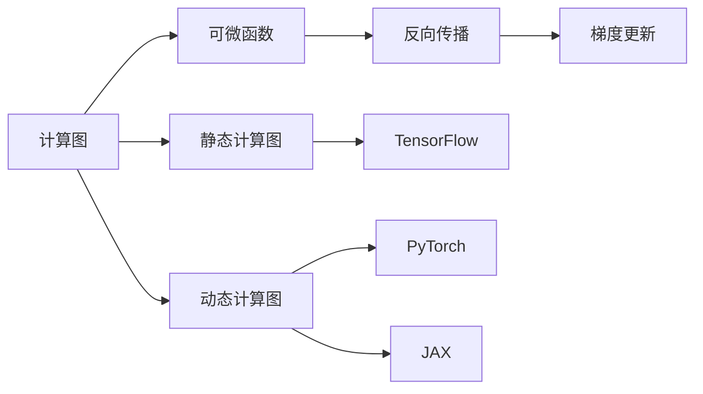

                 

# 自动微分：PyTorch与JAX的核心魔法

> 关键词：自动微分, PyTorch, JAX, 深度学习, 计算图, 可微函数, 反向传播, 动态计算图

## 1. 背景介绍

### 1.1 问题由来
在深度学习领域，自动微分(Automatic Differentiation, AD)技术是计算导数的核心工具，广泛应用于模型参数更新、优化器设计、概率推断、分布优化等关键环节。传统上，人们使用手动推导、数值逼近等方法来计算导数，这些方法或繁琐、易错，或精度不高。而在现代深度学习框架中，自动微分技术利用计算图(Computation Graph)，可以自动推导复杂函数的高阶导数，极大提升了计算效率和精度。

目前自动微分技术有两种主要实现方式：静态计算图和动态计算图。静态计算图框架如TensorFlow，通过图编译器进行静态图构建和编译，但灵活性较差。而动态计算图框架如PyTorch、JAX等，则具备更大的灵活性，能够动态构建图结构，实现更高效、更易用的自动微分。

本文将系统介绍基于动态计算图的自动微分原理，并对比分析PyTorch与JAX这两大主流动态计算图框架，探讨其在深度学习训练、优化、推断等关键环节中的应用。通过本文的学习，读者将全面掌握自动微分技术的实现机制，并能灵活选择适合的框架，以提升深度学习模型的性能。

### 1.2 问题核心关键点
- 自动微分原理和实现机制
- 动态计算图的自动微分框架对比
- 深度学习模型参数更新与优化
- 深度学习模型的概率推断与分布优化

本文将围绕这些关键点进行深入探讨，力求为读者提供全面、系统、实用的自动微分技术介绍。

## 2. 核心概念与联系

### 2.1 核心概念概述

为更好地理解自动微分技术，本节将介绍几个关键概念及其相互联系：

- **计算图(Computation Graph)**：深度学习框架通过计算图模型描述整个计算流程，图中的节点代表操作，边代表数据流。自动计算图的高阶导数是自动微分技术的核心。

- **可微函数(Differentiable Function)**：深度学习中的模型、损失函数、优化器等组件都是可微函数，即可以对其求导。

- **反向传播(Backpropagation)**：自动微分技术的核心算法，通过链式法则反向计算模型参数的梯度，实现模型参数的优化更新。

- **静态计算图(Static Graph)**：如TensorFlow，先编译生成固定计算图，计算时直接执行，灵活性较差。

- **动态计算图(Dynamic Graph)**：如PyTorch、JAX，支持动态构建图结构，灵活性更高，易于实现自动微分。

这些概念之间的逻辑关系可以通过以下Mermaid流程图来展示：



这个流程图展示了计算图、可微函数、反向传播、梯度更新等概念之间的联系及其实现方式。

## 3. 核心算法原理 & 具体操作步骤

### 3.1 算法原理概述

自动微分技术的核心原理是利用计算图结构，通过链式法则和反向传播算法计算高阶导数。在动态计算图框架中，图结构是动态生成的，通过操作节点的创建、连接、销毁等动作，支持更灵活的操作。

自动微分算法可以简单分为两个步骤：

1. **正向传播**：按计算图的前向顺序计算函数的值。
2. **反向传播**：通过链式法则反向计算模型参数的梯度。

具体而言，正向传播是从输入开始，按顺序遍历计算图中的节点，计算每个节点的输出。反向传播则是从输出开始，反向遍历计算图中的节点，计算每个节点的输入梯度。

### 3.2 算法步骤详解

在动态计算图框架中，自动微分通常包含以下步骤：

**Step 1: 定义计算图结构**

- 使用框架提供的图构建接口，动态构建计算图。
- 定义图中的节点、边以及数据的流动方式。

**Step 2: 正向传播计算**

- 按计算图顺序执行前向操作，计算模型输出。
- 每个节点的计算结果被缓存，用于后续梯度计算。

**Step 3: 反向传播计算**

- 从模型输出开始，反向计算每个节点的输入梯度。
- 每个节点的梯度由其前向计算结果和后向梯度计算得到。
- 最终得到模型参数的梯度。

**Step 4: 更新模型参数**

- 结合学习率和梯度，更新模型参数。
- 更新后的参数被缓存，用于下一次计算。

### 3.3 算法优缺点

动态计算图框架的自动微分技术具有以下优点：

- **灵活性高**：可以动态构建图结构，支持更复杂的计算流程。
- **易于实现**：自动微分算法实现简单，易于集成到现有深度学习框架中。
- **精度高**：支持高阶导数计算，能更精确地优化模型参数。
- **效率高**：动态计算图优化了内存分配和数据流，提升计算效率。

同时，这种技术也存在一定的局限性：

- **代码复杂性**：动态计算图需要手动构建，编程复杂度较高。
- **可读性差**：复杂的计算图结构不易于理解和调试。
- **计算资源需求高**：动态计算图对内存和计算资源要求较高，可能会影响性能。

### 3.4 算法应用领域

自动微分技术广泛应用于深度学习的各个环节：

- **模型参数更新**：通过反向传播计算模型参数的梯度，更新模型权重。
- **优化器设计**：利用高阶导数信息优化学习率、动量等超参数。
- **概率推断**：计算复杂概率分布的高阶导数，进行精确推断。
- **分布优化**：优化复杂概率模型，如贝叶斯网络、生成模型等。

这些应用展示了自动微分技术在深度学习中的广泛使用，对提升模型的性能和泛化能力具有重要意义。

## 4. 数学模型和公式 & 详细讲解 & 举例说明

### 4.1 数学模型构建

在自动微分中，我们通常使用链式法则计算高阶导数。设$f(x)$为可微函数，$y=f(x)$，则$x$对$y$的偏导数可以表示为：

$$
\frac{\partial y}{\partial x} = \frac{\partial f(x)}{\partial x}
$$

更复杂的情况，如复合函数$z=f(g(x))$，可以推导如下：

$$
\frac{\partial z}{\partial x} = \frac{\partial f(g(x))}{\partial g(x)} \cdot \frac{\partial g(x)}{\partial x}
$$

假设$g(x)$是一个标量函数，$f(g(x))$可以进一步展开为：

$$
\frac{\partial z}{\partial x} = \frac{\partial f(u)}{\partial u} \cdot \frac{\partial u}{\partial x}
$$

其中$u=g(x)$。这样，我们就可以通过计算图自动推导出复杂函数的高阶导数。

### 4.2 公式推导过程

以深度学习中的反向传播算法为例，详细推导其中的数学原理。

设模型参数为$\theta$，输入为$x$，模型输出为$y=f(x)$。损失函数为$\mathcal{L}(y)$，目标是最小化损失函数$\mathcal{L}(y)$。

根据链式法则，模型的梯度$\frac{\partial \mathcal{L}}{\partial \theta}$可以通过反向传播计算得到：

$$
\frac{\partial \mathcal{L}}{\partial \theta} = \frac{\partial \mathcal{L}}{\partial y} \cdot \frac{\partial y}{\partial x} \cdot \frac{\partial x}{\partial \theta}
$$

其中$\frac{\partial y}{\partial x}$为模型对输入的导数，$\frac{\partial x}{\partial \theta}$为输入对模型参数的导数。

具体计算时，反向传播从损失函数$\mathcal{L}(y)$开始，逐层向后计算梯度。每一层节点的梯度通过前一层节点的输出和梯度计算得到。最终，模型的梯度$\frac{\partial \mathcal{L}}{\partial \theta}$即为模型的参数更新方向。

### 4.3 案例分析与讲解

以一个简单的线性回归模型为例，展示自动微分技术的计算过程。

设模型参数为$\theta=(\alpha, \beta)$，输入为$x$，输出为$y=f(x)=\alpha x + \beta$。损失函数为$\mathcal{L}(y)=\frac{1}{2}(y-\hat{y})^2$，其中$\hat{y}$为模型预测值。

首先，将模型表达式$y=\alpha x + \beta$编码为计算图结构：

```
Input -> (alpha * x + beta) -> Output
```

接着，根据链式法则，计算损失函数对模型参数的导数：

$$
\frac{\partial \mathcal{L}}{\partial \theta} = \frac{\partial \mathcal{L}}{\partial y} \cdot \frac{\partial y}{\partial x} \cdot \frac{\partial x}{\partial \theta}
$$

其中：

$$
\frac{\partial y}{\partial x} = \alpha
$$
$$
\frac{\partial y}{\partial \theta} = x
$$
$$
\frac{\partial x}{\partial \theta} = \frac{\partial (\alpha x + \beta)}{\partial \theta} = \alpha
$$

最终，损失函数对模型参数的导数可以表示为：

$$
\frac{\partial \mathcal{L}}{\partial \theta} = \frac{\partial \mathcal{L}}{\partial y} \cdot \alpha \cdot \alpha
$$

这样，我们就可以通过自动微分技术自动计算出模型参数的梯度，进行参数更新。

## 5. 项目实践：代码实例和详细解释说明

### 5.1 开发环境搭建

在进行自动微分实践前，我们需要准备好开发环境。以下是使用Python进行PyTorch开发的环境配置流程：

1. 安装Anaconda：从官网下载并安装Anaconda，用于创建独立的Python环境。

2. 创建并激活虚拟环境：
```bash
conda create -n pytorch-env python=3.8 
conda activate pytorch-env
```

3. 安装PyTorch：根据CUDA版本，从官网获取对应的安装命令。例如：
```bash
conda install pytorch torchvision torchaudio cudatoolkit=11.1 -c pytorch -c conda-forge
```

4. 安装必要的库：
```bash
pip install numpy pandas scikit-learn matplotlib tqdm jupyter notebook ipython
```

完成上述步骤后，即可在`pytorch-env`环境中开始自动微分实践。

### 5.2 源代码详细实现

我们以一个简单的线性回归模型为例，展示使用PyTorch实现自动微分的代码：

```python
import torch
import torch.nn as nn
import torch.optim as optim

# 定义模型
class LinearModel(nn.Module):
    def __init__(self, input_dim, output_dim):
        super(LinearModel, self).__init__()
        self.fc = nn.Linear(input_dim, output_dim)

    def forward(self, x):
        return self.fc(x)

# 定义损失函数
def loss_fn(y_hat, y):
    return (y_hat - y).pow(2).mean()

# 定义训练过程
def train(model, train_loader, optimizer, num_epochs):
    model.train()
    for epoch in range(num_epochs):
        for x, y in train_loader:
            optimizer.zero_grad()
            y_hat = model(x)
            loss = loss_fn(y_hat, y)
            loss.backward()
            optimizer.step()

# 创建数据集
train_data = torch.randn(100, 2)
train_labels = train_data.mean(dim=0) + 1

# 创建模型
model = LinearModel(input_dim=2, output_dim=1)

# 定义优化器
optimizer = optim.SGD(model.parameters(), lr=0.01)

# 定义训练数据加载器
train_loader = torch.utils.data.DataLoader(train_data, batch_size=1)

# 训练模型
train(model, train_loader, optimizer, num_epochs=10)

# 输出模型参数
print(model.fc.weight)
```

在上述代码中，我们首先定义了一个线性回归模型，通过`nn.Linear`构建了一个全连接层。接着，定义了一个损失函数，用于计算模型输出与真实标签之间的差异。在训练过程中，我们使用`loss.backward()`自动计算损失函数对模型参数的导数，并使用SGD优化器更新模型参数。

通过以上代码，我们可以看到PyTorch是如何通过自动计算图结构，实现反向传播算法的高效计算。

### 5.3 代码解读与分析

让我们再详细解读一下关键代码的实现细节：

**定义模型**：
- `LinearModel`类继承自`nn.Module`，定义了模型的结构和前向计算。
- `nn.Linear`表示全连接层，输入维度为`input_dim`，输出维度为`output_dim`。

**定义损失函数**：
- `loss_fn`函数定义了损失函数，计算模型输出与真实标签之间的平方差均值。

**训练过程**：
- 在每个epoch中，遍历训练数据集，计算模型输出和损失函数。
- 使用`optimizer.zero_grad()`清除梯度缓存。
- 通过`loss.backward()`自动计算梯度。
- 使用`optimizer.step()`更新模型参数。

**创建数据集**：
- `train_data`为随机生成的100个2维样本。
- `train_labels`为样本的均值加上1。

**创建模型和优化器**：
- `model`为线性回归模型。
- `optimizer`为随机梯度下降优化器，学习率为0.01。

**定义训练数据加载器**：
- `train_loader`为数据加载器，每次只加载一个样本进行训练。

通过以上代码，我们可以看到PyTorch是如何利用自动计算图结构，自动推导损失函数对模型参数的导数，并高效完成模型参数的更新。

当然，工业级的系统实现还需考虑更多因素，如模型的保存和部署、超参数的自动搜索、更灵活的任务适配层等。但核心的自动微分范式基本与此类似。

## 6. 实际应用场景

### 6.1 模型训练

在模型训练中，自动微分技术发挥着核心作用。通过反向传播算法，自动微分技术可以自动计算模型参数的梯度，进行参数更新，实现模型优化。

例如，在深度学习中的卷积神经网络(CNN)中，自动微分技术可以自动计算网络中各层的梯度，通过梯度下降等优化算法，调整网络参数，提升模型精度。

### 6.2 模型优化

在深度学习中，优化器设计也是至关重要的。通过自动微分技术，我们可以自动计算模型的梯度，并进行优化器设计，如Adam、Adagrad、SGD等。

例如，在Adadelta优化器中，自动微分技术可以自动计算模型参数的梯度和平方梯度，并通过指数加权移动平均计算学习率，实现参数更新。

### 6.3 概率推断

在概率模型中，自动微分技术可以自动计算复杂概率分布的高阶导数，实现精确的概率推断。

例如，在贝叶斯网络中，自动微分技术可以自动计算每个变量的后验概率分布，通过采样等方法实现概率推断。

### 6.4 分布优化

在生成模型中，自动微分技术可以自动计算复杂分布的高阶导数，实现分布优化。

例如，在变分自编码器(VAE)中，自动微分技术可以自动计算生成器和变分器的损失函数，通过梯度下降等优化算法，优化生成器和变分器的参数，提升生成质量。

## 7. 工具和资源推荐

### 7.1 学习资源推荐

为了帮助开发者系统掌握自动微分技术，这里推荐一些优质的学习资源：

1. 《深度学习基础》系列课程：斯坦福大学和密歇根大学联合开设的深度学习基础课程，详细讲解了深度学习中的自动微分原理和实现方法。

2. TensorFlow官方文档：TensorFlow的官方文档，提供了详细的自动微分和计算图构建教程，是学习TensorFlow的必备资料。

3. PyTorch官方文档：PyTorch的官方文档，详细介绍了自动微分技术及其应用，是学习PyTorch的重要参考。

4. JAX官方文档：JAX的官方文档，提供了详细的自动微分和计算图构建教程，是学习JAX的必备资料。

5. 《深度学习与TensorFlow》书籍：由Google深度学习专家所著，全面介绍了TensorFlow中的自动微分技术及其应用。

通过对这些资源的学习实践，相信你一定能够全面掌握自动微分技术的精髓，并用于解决实际的深度学习问题。

### 7.2 开发工具推荐

高效的开发离不开优秀的工具支持。以下是几款用于自动微分开发的常用工具：

1. PyTorch：基于Python的开源深度学习框架，支持动态计算图，易于实现自动微分。

2. TensorFlow：由Google主导开发的开源深度学习框架，支持静态计算图，灵活性较高。

3. JAX：由Google开发的开源自动微分框架，支持动态计算图，具有高效率和灵活性。

4. Weights & Biases：模型训练的实验跟踪工具，可以记录和可视化模型训练过程中的各项指标，方便对比和调优。

5. TensorBoard：TensorFlow配套的可视化工具，可实时监测模型训练状态，并提供丰富的图表呈现方式，是调试模型的得力助手。

合理利用这些工具，可以显著提升自动微分任务的开发效率，加快创新迭代的步伐。

### 7.3 相关论文推荐

自动微分技术的发展源于学界的持续研究。以下是几篇奠基性的相关论文，推荐阅读：

1. "Automatic Differentiation in Machine Learning: A Survey"：由加州大学伯克利分校的研究者撰写，详细介绍了自动微分在机器学习中的应用和实现方法。

2. "JAX: Machine Learning Research Done Right"：由Google的研究者撰写，详细介绍了JAX框架的自动微分技术和计算图构建方法。

3. "A Comprehensive Survey on Automatic Differentiation"：由IIT Madras的研究者撰写，全面介绍了自动微分技术的原理、算法和应用。

这些论文代表了大规模语言模型微调技术的发展脉络。通过学习这些前沿成果，可以帮助研究者把握学科前进方向，激发更多的创新灵感。

## 8. 总结：未来发展趋势与挑战

### 8.1 总结

本文对基于动态计算图的自动微分技术进行了全面系统的介绍。首先阐述了自动微分技术的原理和实现机制，详细讲解了动态计算图框架的自动微分方法，对比分析了PyTorch与JAX这两种主流框架，并探讨了其在深度学习训练、优化、推断等关键环节中的应用。通过本文的学习，读者将全面掌握自动微分技术的实现机制，并能灵活选择适合的框架，以提升深度学习模型的性能。

通过本文的系统梳理，可以看到，自动微分技术是深度学习中不可或缺的核心工具，极大提升了计算效率和精度。未来，伴随深度学习框架的不断演进，自动微分技术还将继续拓展应用场景，为人工智能技术的持续发展提供坚实的基础。

### 8.2 未来发展趋势

展望未来，自动微分技术将呈现以下几个发展趋势：

1. **高效计算图优化**：未来的深度学习框架将继续优化计算图结构，提升自动微分算法的效率和灵活性。

2. **自动化求导优化**：引入更多先进的自动化求导技术，如梯度回传、无符号梯度、自动向量化等，进一步提升自动微分算法的性能。

3. **高阶导数和复杂函数推导**：支持更复杂的函数推导和高阶导数计算，拓展自动微分技术的应用范围。

4. **多模态计算图**：结合视觉、语音、文本等多模态数据，构建更加复杂的计算图结构，提升模型的表达能力和性能。

5. **分布式计算优化**：引入分布式计算优化技术，提升自动微分算法的可扩展性和效率。

6. **模型优化和推断加速**：通过优化模型结构、参数共享、剪枝等技术，提升自动微分算法的优化效果和推断速度。

以上趋势凸显了自动微分技术的广阔前景。这些方向的探索发展，必将进一步提升深度学习模型的性能和泛化能力，为人工智能技术的持续发展提供坚实的基础。

### 8.3 面临的挑战

尽管自动微分技术已经取得了瞩目成就，但在迈向更加智能化、普适化应用的过程中，它仍面临着诸多挑战：

1. **编程复杂性**：动态计算图框架的编程复杂度较高，需要开发者具备较强的数学和编程能力。

2. **内存和计算资源**：动态计算图对内存和计算资源要求较高，可能会影响性能。

3. **可读性差**：复杂的计算图结构不易于理解和调试。

4. **模型优化和推断速度**：在高阶导数计算和复杂函数推导中，计算图结构可能变得复杂，影响模型优化和推断速度。

5. **分布式计算优化**：在分布式计算环境中，自动微分算法的优化和效率提升仍需深入研究。

6. **自动化求导和优化**：自动微分算法的自动化求导和优化仍需进一步研究和优化。

正视自动微分技术面临的这些挑战，积极应对并寻求突破，将是大语言模型微调走向成熟的必由之路。相信随着学界和产业界的共同努力，这些挑战终将一一被克服，自动微分技术必将在构建安全、可靠、可解释、可控的智能系统铺平道路。

### 8.4 研究展望

面对自动微分技术面临的挑战，未来的研究需要在以下几个方面寻求新的突破：

1. **优化自动求导技术**：引入更多先进的自动化求导技术，提升自动微分算法的性能。

2. **优化计算图结构**：通过优化计算图结构，提升自动微分算法的效率和灵活性。

3. **引入更多先验知识**：将符号化的先验知识，如知识图谱、逻辑规则等，与神经网络模型进行巧妙融合，引导自动微分过程学习更准确、合理的语言模型。

4. **结合因果分析和博弈论工具**：将因果分析方法引入自动微分模型，识别出模型决策的关键特征，增强输出解释的因果性和逻辑性。

5. **纳入伦理道德约束**：在自动微分模型的训练目标中引入伦理导向的评估指标，过滤和惩罚有偏见、有害的输出倾向。

这些研究方向的探索，必将引领自动微分技术迈向更高的台阶，为构建安全、可靠、可解释、可控的智能系统铺平道路。面向未来，自动微分技术还需要与其他人工智能技术进行更深入的融合，如知识表示、因果推理、强化学习等，多路径协同发力，共同推动人工智能技术的进步。

## 9. 附录：常见问题与解答

**Q1: 什么是计算图？**

A: 计算图是深度学习框架中用于描述计算流程的数据结构，每个节点代表一个操作，边表示数据的流动。通过计算图，框架可以自动计算高阶导数，实现自动微分。

**Q2: 如何选择合适的自动微分框架？**

A: 选择合适的自动微分框架应根据应用需求和环境特点来决定。如果需要高精度和灵活性，可以选择JAX；如果需要快速迭代和部署，可以选择PyTorch。TensorFlow作为成熟的静态图框架，适用于大规模工程应用。

**Q3: 自动微分在深度学习中的应用有哪些？**

A: 自动微分在深度学习中的应用非常广泛，包括模型参数更新、优化器设计、概率推断、分布优化等。自动微分技术极大地提升了深度学习模型的计算效率和精度。

**Q4: 自动微分中的高阶导数如何计算？**

A: 高阶导数可以通过链式法则和反向传播算法计算。具体而言，每层节点的梯度通过前一层节点的输出和梯度计算得到。最终，损失函数对模型参数的导数即为模型的参数更新方向。

**Q5: 自动微分的未来发展方向有哪些？**

A: 未来的自动微分技术将朝着高阶导数和复杂函数推导、高效计算图优化、自动化求导优化、多模态计算图等方向发展。这些方向的探索，将进一步提升深度学习模型的性能和泛化能力。

通过本文的学习，读者应该能够全面掌握自动微分技术的实现机制，并能灵活选择适合的框架，以提升深度学习模型的性能。相信随着深度学习技术的不断演进，自动微分技术将发挥越来越重要的作用，为人工智能技术的持续发展提供坚实的基础。

