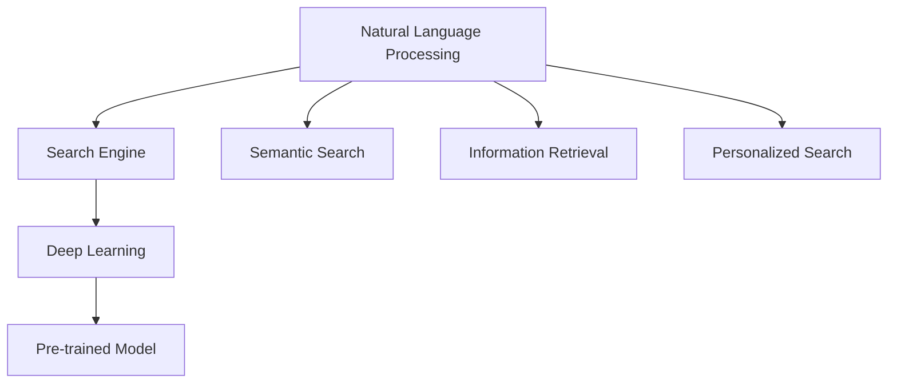

                 

# 自然语言处理在搜索中的突破

## 1. 背景介绍

随着互联网技术的飞速发展，搜索引擎已经成为了人们获取信息的重要手段。传统的基于关键词匹配的搜索方式，尽管能够快速返回大量相关网页，但在搜索结果的多样性、精确性和语义理解上却存在诸多不足。近年来，自然语言处理（NLP）技术在搜索引擎中的应用不断深入，极大地提升了搜索结果的质量和用户体验。本文将深入探讨自然语言处理在搜索中的应用现状、核心技术以及未来的发展方向。

## 2. 核心概念与联系

### 2.1 核心概念概述

为了更好地理解自然语言处理在搜索中的应用，本节将介绍几个关键概念：

- **自然语言处理（NLP）**：是指让计算机理解、分析、处理和生成人类语言的技术，包括文本分析、信息抽取、情感分析、机器翻译等。
- **搜索引擎（Search Engine）**：是指能够通过用户输入的查询关键词，返回相关信息系统的工具。
- **语义搜索（Semantic Search）**：是指通过理解查询词的语义信息，返回最相关的结果，而不仅仅是关键词匹配。
- **信息检索（Information Retrieval, IR）**：是指从大量文档中检索相关信息的过程，是搜索引擎的核心组成部分。
- **个性化搜索（Personalized Search）**：是指根据用户的查询历史、兴趣偏好等个性化信息，返回定制化的搜索结果。
- **深度学习（Deep Learning）**：是指通过多层神经网络学习复杂数据特征的技术，常用于构建更高效的NLP模型。
- **预训练模型（Pre-trained Model）**：是指在大规模无标签数据上进行预训练，学习到丰富的语言知识的模型，如BERT、GPT等。

这些概念之间的联系通过以下Mermaid流程图展示：



## 3. 核心算法原理 & 具体操作步骤

### 3.1 算法原理概述

自然语言处理在搜索中的应用，本质上是通过理解查询词的语义信息，从而提高搜索结果的相关性和多样性。这一过程可以分为以下几个关键步骤：

1. **文本预处理**：将用户查询和文档内容转换为计算机可以处理的格式。
2. **文本表示**：将查询和文档转换为向量形式，便于计算相似度。
3. **语义理解**：通过自然语言处理技术，理解查询词的语义信息。
4. **信息检索**：从文档库中检索最相关的文档。
5. **结果排序**：根据排序算法，返回最终的结果集。

### 3.2 算法步骤详解

#### 3.2.1 文本预处理

文本预处理是自然语言处理的基础，包括分词、去除停用词、词干提取、标点去除等。以中文为例，可以使用分词工具如jieba，将查询和文档内容转换为词汇序列。

```python
import jieba
def tokenize(text):
    return jieba.lcut(text)
```

#### 3.2.2 文本表示

文本表示是将文本转换为向量形式的过程，常用的方法包括词袋模型、TF-IDF、Word2Vec、GloVe等。这里以Word2Vec为例，使用预训练的中文Word2Vec模型进行文本向量化。

```python
from gensim.models import Word2Vec
def embed(text, model_path):
    model = Word2Vec.load(model_path)
    return [model[word] for word in tokenize(text)]
```

#### 3.2.3 语义理解

语义理解是通过自然语言处理技术，理解查询词的语义信息。常用的方法包括命名实体识别、情感分析、句法分析等。这里以命名实体识别为例，使用Stanford NER模型对查询词进行实体识别。

```python
from stanfordnlp.server import CoreNLPClient
def ner(text, model_path):
    with CoreNLPClient(model_path) as client:
        ner_tags = client.get_named_entities(text)
        return [(ent.text, ent.label) for ent in ner_tags]
```

#### 3.2.4 信息检索

信息检索是从文档库中检索最相关的文档的过程。常用的信息检索模型包括BM25、TF-IDF、Latent Semantic Indexing等。这里以BM25为例，使用sklearn库中的TfidfVectorizer进行文档向量化，并使用Scipy库中的matching.cdist计算文档相似度。

```python
from sklearn.feature_extraction.text import TfidfVectorizer
from scipy.spatial.distance import pdist, squareform
def search(query, docs, model_path):
    query_vector = embed(query, model_path)
    docs_vectors = TfidfVectorizer().fit_transform(docs)
    scores = squareform(pdist(query_vector, docs_vectors.todense()))
    return [(score, doc) for doc, score in zip(docs, scores)]
```

#### 3.2.5 结果排序

结果排序是根据排序算法，返回最终的结果集的过程。常用的排序算法包括基于文本相似度的排序、基于用户反馈的排序、基于模型的排序等。这里以基于文本相似度的排序为例，根据文档相似度返回最相关的文档。

```python
def sort_results(results, k):
    return sorted(results, key=lambda x: x[0], reverse=True)[:k]
```

### 3.3 算法优缺点

#### 3.3.1 优点

- **提高搜索结果的相关性**：通过语义理解，能够理解查询词的语义信息，返回最相关的文档。
- **提升搜索结果的多样性**：通过自然语言处理技术，能够处理不同表达方式的查询词，提高搜索结果的多样性。
- **支持个性化搜索**：通过用户历史查询和兴趣偏好，返回定制化的搜索结果。

#### 3.3.2 缺点

- **计算成本高**：自然语言处理技术需要大量的计算资源，尤其是深度学习模型。
- **数据需求大**：需要大量的标注数据来训练和优化模型。
- **模型依赖性强**：模型性能依赖于预训练模型的质量，需要不断更新预训练模型。

## 4. 数学模型和公式 & 详细讲解 & 举例说明

### 4.1 数学模型构建

自然语言处理在搜索中的数学模型可以分为以下几个部分：

- **文本表示模型**：将文本转换为向量形式，常用的模型包括TF-IDF、Word2Vec等。
- **语义理解模型**：理解查询词的语义信息，常用的模型包括命名实体识别、情感分析等。
- **信息检索模型**：从文档库中检索最相关的文档，常用的模型包括BM25、Latent Semantic Indexing等。
- **结果排序模型**：根据排序算法返回最终的结果集，常用的算法包括基于文本相似度的排序、基于用户反馈的排序等。

### 4.2 公式推导过程

#### 4.2.1 文本表示模型

文本表示模型通常使用向量空间模型（Vector Space Model, VSM），将文本转换为向量形式。假设文本库中有$N$个文档，每个文档由$M$个词组成，向量表示为：

$$
\mathbf{v}_d = (v_{d,1}, v_{d,2}, ..., v_{d,M})
$$

其中$v_{d,i}$表示文档$d$中词$i$的权重，通常使用TF-IDF等方法计算。查询向量表示为：

$$
\mathbf{v}_q = (v_{q,1}, v_{q,2}, ..., v_{q,M})
$$

#### 4.2.2 语义理解模型

语义理解模型通常使用命名实体识别（Named Entity Recognition, NER），识别查询词中的命名实体。假设查询词$w$中的命名实体为$e$，表示为：

$$
\mathbf{e} = (e_1, e_2, ..., e_k)
$$

其中$e_i$表示实体$i$的类型，如人名、地名等。

#### 4.2.3 信息检索模型

信息检索模型通常使用BM25模型，计算文档与查询的相似度。假设查询向量为$\mathbf{v}_q$，文档向量为$\mathbf{v}_d$，相似度计算公式为：

$$
\mathrm{sim}(\mathbf{v}_q, \mathbf{v}_d) = \frac{q \cdot d + b \cdot (1 + \log \frac{k}{df})}{\sqrt{(q \cdot q) + \beta \cdot (d \cdot d)}}
$$

其中$q$和$d$分别为查询向量和文档向量的长度，$k$为文档库的大小，$df$为文档中词的出现频率，$\beta$为BM25参数，$b$为BM25的常数项。

#### 4.2.4 结果排序模型

结果排序模型通常使用基于文本相似度的排序算法，如基于TF-IDF的排序。假设查询向量为$\mathbf{v}_q$，文档向量为$\mathbf{v}_d$，排序结果为$R$，排序公式为：

$$
R = \frac{\mathrm{sim}(\mathbf{v}_q, \mathbf{v}_d)}{\mathrm{sim}(\mathbf{v}_q, \mathbf{v}_{d'})}
$$

其中$d'$为排序集中的文档向量，$\mathrm{sim}$为相似度函数。

### 4.3 案例分析与讲解

#### 案例分析

以Google的Bert as a Service为例，其通过预训练语言模型BERT，提高了搜索的相关性和多样性。BERT模型在大规模无标签文本上进行预训练，学习到了丰富的语言知识，包括词义、句法、语境等。在搜索引擎中，使用BERT进行语义理解，能够更好地理解查询词的语义信息，返回最相关的文档。同时，Google还引入了深度学习模型进行个性化搜索，根据用户历史查询和兴趣偏好，返回定制化的搜索结果。

## 5. 项目实践：代码实例和详细解释说明

### 5.1 开发环境搭建

在进行自然语言处理在搜索中的应用实践前，我们需要准备好开发环境。以下是使用Python进行PyTorch开发的环境配置流程：

1. 安装Anaconda：从官网下载并安装Anaconda，用于创建独立的Python环境。

2. 创建并激活虚拟环境：
```bash
conda create -n pytorch-env python=3.8 
conda activate pytorch-env
```

3. 安装PyTorch：根据CUDA版本，从官网获取对应的安装命令。例如：
```bash
conda install pytorch torchvision torchaudio cudatoolkit=11.1 -c pytorch -c conda-forge
```

4. 安装Transformers库：
```bash
pip install transformers
```

5. 安装各类工具包：
```bash
pip install numpy pandas scikit-learn matplotlib tqdm jupyter notebook ipython
```

完成上述步骤后，即可在`pytorch-env`环境中开始自然语言处理在搜索中的应用实践。

### 5.2 源代码详细实现

这里我们以命名实体识别为例，给出使用Transformers库对BERT模型进行微调的PyTorch代码实现。

首先，定义命名实体识别任务的数据处理函数：

```python
from transformers import BertTokenizer
from torch.utils.data import Dataset
import torch

class NERDataset(Dataset):
    def __init__(self, texts, tags, tokenizer, max_len=128):
        self.texts = texts
        self.tags = tags
        self.tokenizer = tokenizer
        self.max_len = max_len
        
    def __len__(self):
        return len(self.texts)
    
    def __getitem__(self, item):
        text = self.texts[item]
        tags = self.tags[item]
        
        encoding = self.tokenizer(text, return_tensors='pt', max_length=self.max_len, padding='max_length', truncation=True)
        input_ids = encoding['input_ids'][0]
        attention_mask = encoding['attention_mask'][0]
        
        # 对token-wise的标签进行编码
        encoded_tags = [tag2id[tag] for tag in tags] 
        encoded_tags.extend([tag2id['O']] * (self.max_len - len(encoded_tags)))
        labels = torch.tensor(encoded_tags, dtype=torch.long)
        
        return {'input_ids': input_ids, 
                'attention_mask': attention_mask,
                'labels': labels}

# 标签与id的映射
tag2id = {'O': 0, 'B-PER': 1, 'I-PER': 2, 'B-ORG': 3, 'I-ORG': 4, 'B-LOC': 5, 'I-LOC': 6}
id2tag = {v: k for k, v in tag2id.items()}

# 创建dataset
tokenizer = BertTokenizer.from_pretrained('bert-base-cased')

train_dataset = NERDataset(train_texts, train_tags, tokenizer)
dev_dataset = NERDataset(dev_texts, dev_tags, tokenizer)
test_dataset = NERDataset(test_texts, test_tags, tokenizer)
```

然后，定义模型和优化器：

```python
from transformers import BertForTokenClassification, AdamW

model = BertForTokenClassification.from_pretrained('bert-base-cased', num_labels=len(tag2id))

optimizer = AdamW(model.parameters(), lr=2e-5)
```

接着，定义训练和评估函数：

```python
from torch.utils.data import DataLoader
from tqdm import tqdm
from sklearn.metrics import classification_report

device = torch.device('cuda') if torch.cuda.is_available() else torch.device('cpu')
model.to(device)

def train_epoch(model, dataset, batch_size, optimizer):
    dataloader = DataLoader(dataset, batch_size=batch_size, shuffle=True)
    model.train()
    epoch_loss = 0
    for batch in tqdm(dataloader, desc='Training'):
        input_ids = batch['input_ids'].to(device)
        attention_mask = batch['attention_mask'].to(device)
        labels = batch['labels'].to(device)
        model.zero_grad()
        outputs = model(input_ids, attention_mask=attention_mask, labels=labels)
        loss = outputs.loss
        epoch_loss += loss.item()
        loss.backward()
        optimizer.step()
    return epoch_loss / len(dataloader)

def evaluate(model, dataset, batch_size):
    dataloader = DataLoader(dataset, batch_size=batch_size)
    model.eval()
    preds, labels = [], []
    with torch.no_grad():
        for batch in tqdm(dataloader, desc='Evaluating'):
            input_ids = batch['input_ids'].to(device)
            attention_mask = batch['attention_mask'].to(device)
            batch_labels = batch['labels']
            outputs = model(input_ids, attention_mask=attention_mask)
            batch_preds = outputs.logits.argmax(dim=2).to('cpu').tolist()
            batch_labels = batch_labels.to('cpu').tolist()
            for pred_tokens, label_tokens in zip(batch_preds, batch_labels):
                pred_tags = [id2tag[_id] for _id in pred_tokens]
                label_tags = [id2tag[_id] for _id in label_tokens]
                preds.append(pred_tags[:len(label_tags)])
                labels.append(label_tags)
                
    print(classification_report(labels, preds))
```

最后，启动训练流程并在测试集上评估：

```python
epochs = 5
batch_size = 16

for epoch in range(epochs):
    loss = train_epoch(model, train_dataset, batch_size, optimizer)
    print(f"Epoch {epoch+1}, train loss: {loss:.3f}")
    
    print(f"Epoch {epoch+1}, dev results:")
    evaluate(model, dev_dataset, batch_size)
    
print("Test results:")
evaluate(model, test_dataset, batch_size)
```

以上就是使用PyTorch对BERT进行命名实体识别任务微调的完整代码实现。可以看到，得益于Transformers库的强大封装，我们可以用相对简洁的代码完成BERT模型的加载和微调。

### 5.3 代码解读与分析

让我们再详细解读一下关键代码的实现细节：

**NERDataset类**：
- `__init__`方法：初始化文本、标签、分词器等关键组件。
- `__len__`方法：返回数据集的样本数量。
- `__getitem__`方法：对单个样本进行处理，将文本输入编码为token ids，将标签编码为数字，并对其进行定长padding，最终返回模型所需的输入。

**tag2id和id2tag字典**：
- 定义了标签与数字id之间的映射关系，用于将token-wise的预测结果解码回真实的标签。

**训练和评估函数**：
- 使用PyTorch的DataLoader对数据集进行批次化加载，供模型训练和推理使用。
- 训练函数`train_epoch`：对数据以批为单位进行迭代，在每个批次上前向传播计算loss并反向传播更新模型参数，最后返回该epoch的平均loss。
- 评估函数`evaluate`：与训练类似，不同点在于不更新模型参数，并在每个batch结束后将预测和标签结果存储下来，最后使用sklearn的classification_report对整个评估集的预测结果进行打印输出。

**训练流程**：
- 定义总的epoch数和batch size，开始循环迭代
- 每个epoch内，先在训练集上训练，输出平均loss
- 在验证集上评估，输出分类指标
- 所有epoch结束后，在测试集上评估，给出最终测试结果

可以看到，PyTorch配合Transformers库使得BERT微调的代码实现变得简洁高效。开发者可以将更多精力放在数据处理、模型改进等高层逻辑上，而不必过多关注底层的实现细节。

当然，工业级的系统实现还需考虑更多因素，如模型的保存和部署、超参数的自动搜索、更灵活的任务适配层等。但核心的微调范式基本与此类似。

## 6. 实际应用场景

### 6.1 智能客服系统

基于自然语言处理在搜索中的应用，智能客服系统可以显著提升服务质量和效率。传统客服系统需要大量人力处理客户咨询，响应时间慢，且服务质量难以保证。而使用自然语言处理技术，可以构建7x24小时不间断的智能客服，快速响应客户咨询，提供自然流畅的对话体验。

在技术实现上，可以收集企业内部的历史客服对话记录，将问题和最佳答复构建成监督数据，在此基础上对预训练模型进行微调。微调后的模型能够自动理解用户意图，匹配最合适的答复模板进行回复。对于客户提出的新问题，还可以接入检索系统实时搜索相关内容，动态组织生成回答。如此构建的智能客服系统，能大幅提升客户咨询体验和问题解决效率。

### 6.2 金融舆情监测

金融机构需要实时监测市场舆论动向，以便及时应对负面信息传播，规避金融风险。传统的人工监测方式成本高、效率低，难以应对网络时代海量信息爆发的挑战。自然语言处理在搜索中的应用，为金融舆情监测提供了新的解决方案。

具体而言，可以收集金融领域相关的新闻、报道、评论等文本数据，并对其进行主题标注和情感标注。在此基础上对预训练语言模型进行微调，使其能够自动判断文本属于何种主题，情感倾向是正面、中性还是负面。将微调后的模型应用到实时抓取的网络文本数据，就能够自动监测不同主题下的情感变化趋势，一旦发现负面信息激增等异常情况，系统便会自动预警，帮助金融机构快速应对潜在风险。

### 6.3 个性化推荐系统

当前的推荐系统往往只依赖用户的历史行为数据进行物品推荐，无法深入理解用户的真实兴趣偏好。自然语言处理在搜索中的应用，可以更好地挖掘用户行为背后的语义信息，从而提供更精准、多样的推荐内容。

在实践中，可以收集用户浏览、点击、评论、分享等行为数据，提取和用户交互的物品标题、描述、标签等文本内容。将文本内容作为模型输入，用户的后续行为（如是否点击、购买等）作为监督信号，在此基础上微调预训练语言模型。微调后的模型能够从文本内容中准确把握用户的兴趣点。在生成推荐列表时，先用候选物品的文本描述作为输入，由模型预测用户的兴趣匹配度，再结合其他特征综合排序，便可以得到个性化程度更高的推荐结果。

### 6.4 未来应用展望

随着自然语言处理在搜索中的应用不断深入，未来将会有更多领域的应用，为各行各业带来变革性影响。

在智慧医疗领域，基于自然语言处理在搜索中的应用，医疗问答、病历分析、药物研发等应用将提升医疗服务的智能化水平，辅助医生诊疗，加速新药开发进程。

在智能教育领域，自然语言处理在搜索中的应用，可以应用于作业批改、学情分析、知识推荐等方面，因材施教，促进教育公平，提高教学质量。

在智慧城市治理中，自然语言处理在搜索中的应用，可以应用于城市事件监测、舆情分析、应急指挥等环节，提高城市管理的自动化和智能化水平，构建更安全、高效的未来城市。

此外，在企业生产、社会治理、文娱传媒等众多领域，自然语言处理在搜索中的应用也将不断涌现，为NLP技术带来新的应用场景和机会。相信随着技术的日益成熟，自然语言处理在搜索中的应用将进一步拓展，推动人工智能技术在各行各业的落地应用。

## 7. 工具和资源推荐

### 7.1 学习资源推荐

为了帮助开发者系统掌握自然语言处理在搜索中的应用理论基础和实践技巧，这里推荐一些优质的学习资源：

1. 《自然语言处理综述》系列博文：由大模型技术专家撰写，深入浅出地介绍了自然语言处理在搜索中的应用现状、核心技术以及未来的发展方向。

2. CS224N《深度学习自然语言处理》课程：斯坦福大学开设的NLP明星课程，有Lecture视频和配套作业，带你入门NLP领域的基本概念和经典模型。

3. 《自然语言处理入门》书籍：自然语言处理领域的经典入门书籍，适合初学者系统学习NLP技术的基本知识和应用方法。

4. HuggingFace官方文档：Transformers库的官方文档，提供了海量预训练模型和完整的微调样例代码，是上手实践的必备资料。

5. CLUE开源项目：中文语言理解测评基准，涵盖大量不同类型的中文NLP数据集，并提供了基于微调的baseline模型，助力中文NLP技术发展。

通过对这些资源的学习实践，相信你一定能够快速掌握自然语言处理在搜索中的应用精髓，并用于解决实际的NLP问题。

### 7.2 开发工具推荐

高效的开发离不开优秀的工具支持。以下是几款用于自然语言处理在搜索中的应用开发的常用工具：

1. PyTorch：基于Python的开源深度学习框架，灵活动态的计算图，适合快速迭代研究。大部分预训练语言模型都有PyTorch版本的实现。

2. TensorFlow：由Google主导开发的开源深度学习框架，生产部署方便，适合大规模工程应用。同样有丰富的预训练语言模型资源。

3. Transformers库：HuggingFace开发的NLP工具库，集成了众多SOTA语言模型，支持PyTorch和TensorFlow，是进行自然语言处理在搜索中的应用开发的利器。

4. Weights & Biases：模型训练的实验跟踪工具，可以记录和可视化模型训练过程中的各项指标，方便对比和调优。与主流深度学习框架无缝集成。

5. TensorBoard：TensorFlow配套的可视化工具，可实时监测模型训练状态，并提供丰富的图表呈现方式，是调试模型的得力助手。

6. Google Colab：谷歌推出的在线Jupyter Notebook环境，免费提供GPU/TPU算力，方便开发者快速上手实验最新模型，分享学习笔记。

合理利用这些工具，可以显著提升自然语言处理在搜索中的应用开发的效率，加快创新迭代的步伐。

### 7.3 相关论文推荐

自然语言处理在搜索中的应用源于学界的持续研究。以下是几篇奠基性的相关论文，推荐阅读：

1. Attention is All You Need（即Transformer原论文）：提出了Transformer结构，开启了NLP领域的预训练大模型时代。

2. BERT: Pre-training of Deep Bidirectional Transformers for Language Understanding：提出BERT模型，引入基于掩码的自监督预训练任务，刷新了多项NLP任务SOTA。

3. Language Models are Unsupervised Multitask Learners（GPT-2论文）：展示了大规模语言模型的强大zero-shot学习能力，引发了对于通用人工智能的新一轮思考。

4. Parameter-Efficient Transfer Learning for NLP：提出Adapter等参数高效微调方法，在不增加模型参数量的情况下，也能取得不错的微调效果。

5. Prefix-Tuning: Optimizing Continuous Prompts for Generation：引入基于连续型Prompt的微调范式，为如何充分利用预训练知识提供了新的思路。

6. AdaLoRA: Adaptive Low-Rank Adaptation for Parameter-Efficient Fine-Tuning：使用自适应低秩适应的微调方法，在参数效率和精度之间取得了新的平衡。

这些论文代表了大语言模型微调技术的发展脉络。通过学习这些前沿成果，可以帮助研究者把握学科前进方向，激发更多的创新灵感。

## 8. 总结：未来发展趋势与挑战

### 8.1 总结

本文对自然语言处理在搜索中的应用进行了全面系统的介绍。首先阐述了自然语言处理在搜索中的应用现状和核心技术，明确了其在提高搜索结果相关性、多样性和个性化方面的独特价值。其次，从原理到实践，详细讲解了自然语言处理在搜索中的数学模型和关键步骤，给出了自然语言处理在搜索中的代码实现。同时，本文还广泛探讨了自然语言处理在搜索中的应用场景和未来发展方向，展示了其在提升搜索体验和应用效率方面的广阔前景。

通过本文的系统梳理，可以看到，自然语言处理在搜索中的应用正在成为搜索引擎技术的重要组成部分，极大地提升了搜索结果的质量和用户体验。未来，随着自然语言处理技术的不断进步，自然语言处理在搜索中的应用将进一步深入，为搜索引擎技术带来新的突破。

### 8.2 未来发展趋势

展望未来，自然语言处理在搜索中的应用将呈现以下几个发展趋势：

1. **更加智能化的语义理解**：未来的自然语言处理模型将具备更加智能化的语义理解能力，能够更好地理解查询词的语义信息，返回更相关的文档。

2. **更加个性化的搜索结果**：通过深度学习模型和用户历史查询数据，自然语言处理在搜索中的应用将能够提供更加个性化的搜索结果，满足用户的多样化需求。

3. **更加高效的信息检索**：未来的信息检索模型将更加高效，能够在更短的时间内返回更准确的搜索结果。

4. **更加广泛的应用场景**：自然语言处理在搜索中的应用将拓展到更多领域，如医疗、金融、教育等，带来更广泛的影响。

5. **更加智能化的应用集成**：未来的自然语言处理系统将更加智能，能够与更多应用场景进行深度融合，提升整体应用的智能化水平。

以上趋势凸显了自然语言处理在搜索中的应用前景，未来随着技术的发展，自然语言处理在搜索中的应用将更加广泛和深入。

### 8.3 面临的挑战

尽管自然语言处理在搜索中的应用已经取得了显著进展，但在迈向更加智能化、普适化应用的过程中，仍面临诸多挑战：

1. **计算成本高**：自然语言处理在搜索中的应用需要大量的计算资源，尤其是在深度学习模型上，难以在大规模部署中实现高效。

2. **数据需求大**：需要大量的标注数据来训练和优化模型，数据获取和标注成本较高。

3. **模型鲁棒性不足**：自然语言处理在搜索中的应用对输入的噪声和噪声数据较为敏感，模型鲁棒性有待提高。

4. **模型依赖性强**：模型性能依赖于预训练模型的质量，需要不断更新预训练模型。

5. **应用场景复杂**：不同领域的搜索需求各异，自然语言处理在搜索中的应用需要针对不同领域进行优化。

正视这些挑战，积极应对并寻求突破，将是大语言模型微调技术走向成熟的必由之路。

### 8.4 研究展望

面向未来，自然语言处理在搜索中的应用需要在以下几个方面寻求新的突破：

1. **探索更高效的计算方法**：研究更加高效的计算方法，降低计算成本，提高模型训练和推理效率。

2. **开发更加智能化的模型**：开发更加智能化的模型，提高模型的鲁棒性和泛化能力。

3. **应用场景的拓展**：拓展自然语言处理在搜索中的应用场景，提升其在不同领域的应用效果。

4. **模型的可解释性**：增强模型的可解释性，使得模型的决策过程更加透明，提高用户信任度。

5. **融合多模态数据**：融合视觉、语音等多模态数据，提升模型的综合理解能力。

6. **伦理和隐私保护**：研究自然语言处理在搜索中的应用中存在的伦理和隐私问题，制定相应的技术规范和标准。

这些研究方向的探索，必将引领自然语言处理在搜索中的应用技术迈向更高的台阶，为构建更加智能、高效、安全的搜索系统铺平道路。

## 9. 附录：常见问题与解答

**Q1：自然语言处理在搜索中的应用是否适用于所有NLP任务？**

A: 自然语言处理在搜索中的应用主要适用于理解查询词的语义信息，返回最相关的文档。对于一些特定领域的任务，如医学、法律等，仅仅依靠通用语料预训练的模型可能难以很好地适应。此时需要在特定领域语料上进一步预训练，再进行微调，才能获得理想效果。

**Q2：自然语言处理在搜索中的计算成本是否太高？**

A: 自然语言处理在搜索中的应用需要大量的计算资源，尤其是在深度学习模型上，难以在大规模部署中实现高效。可以考虑使用参数高效微调方法，如AdaLoRA等，减少计算成本。同时，可以使用分布式计算、模型并行等技术，提高训练和推理效率。

**Q3：自然语言处理在搜索中的数据需求是否太大？**

A: 自然语言处理在搜索中的应用需要大量的标注数据来训练和优化模型，数据获取和标注成本较高。可以考虑使用无监督学习、主动学习等方法，降低对标注数据的依赖。同时，可以使用数据增强技术，扩充训练集，提高模型的泛化能力。

**Q4：自然语言处理在搜索中的模型鲁棒性是否不足？**

A: 自然语言处理在搜索中的应用对输入的噪声和噪声数据较为敏感，模型鲁棒性有待提高。可以考虑使用对抗训练、数据增强等方法，提高模型的鲁棒性。同时，可以使用多模型集成等技术，降低单个模型的不确定性。

**Q5：自然语言处理在搜索中的模型依赖性是否强？**

A: 自然语言处理在搜索中的应用性能依赖于预训练模型的质量，需要不断更新预训练模型。可以考虑使用预训练-微调范式，结合下游任务的特点，进行模型优化。同时，可以使用多任务学习等技术，提升模型的多领域适应能力。

**Q6：自然语言处理在搜索中的应用场景是否复杂？**

A: 不同领域的搜索需求各异，自然语言处理在搜索中的应用需要针对不同领域进行优化。可以考虑使用领域自适应方法，如知识图谱融合、领域特定的预训练模型等，提升模型在不同领域的应用效果。

作者：禅与计算机程序设计艺术 / Zen and the Art of Computer Programming

