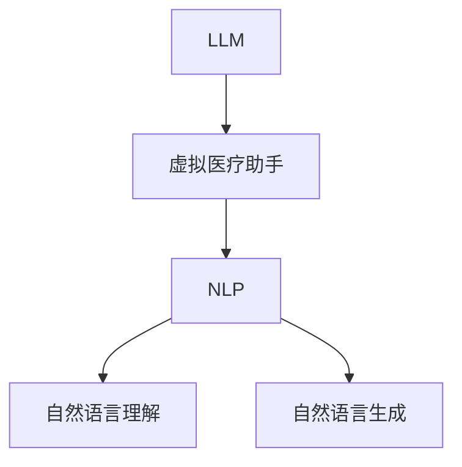

                 

# 虚拟医疗助手：LLM 提供全天候护理

在医疗健康领域，虚拟医疗助手（Virtual Healthcare Assistant, VHA）正在迅速崛起，成为提升医疗服务质量、降低运营成本、改善患者体验的重要工具。LLM（Large Language Model）作为当前人工智能技术的一个重要分支，凭借其强大的自然语言处理能力，成为构建虚拟医疗助手的关键技术。本文将系统介绍LLM在虚拟医疗助手中的应用，涵盖背景、核心概念、算法原理、操作步骤、项目实践、应用场景、工具资源和未来展望等方面，希望能为从业者提供全面的技术指引。

## 1. 背景介绍

### 1.1 问题由来
随着人口老龄化和医疗需求的增加，医疗系统面临着巨大压力。传统的医疗服务模式存在诸如资源分配不均、效率低下、患者体验差等问题。虚拟医疗助手通过应用人工智能技术，可以实现医疗知识的自动化存储和检索，辅助医生进行诊断和治疗，提升医疗服务的可及性和普及性。

### 1.2 问题核心关键点
虚拟医疗助手的核心在于其能够理解和处理医疗领域的专业语言，并提供准确的医疗建议和信息。LLM作为最先进的人工智能技术之一，其强大的语言理解能力使其成为构建虚拟医疗助手的理想工具。当前，LLM在虚拟医疗助手中的应用主要包括：
- 提供实时医疗咨询
- 辅助医疗知识检索
- 分析患者病历数据
- 进行自然语言处理和生成

### 1.3 问题研究意义
虚拟医疗助手结合LLM技术的开发和应用，具有以下几个重要意义：
- 提升医疗服务效率：通过自动化处理和数据分析，虚拟医疗助手可以大大提升医疗服务的响应速度和效率。
- 改善患者体验：LLM的交互能力使其能够以自然语言与患者沟通，减轻患者心理负担，提升满意度。
- 辅助医生决策：虚拟医疗助手能够提供准确的医疗信息和分析结果，辅助医生进行诊断和治疗决策。
- 促进医疗知识传播：通过虚拟医疗助手，医疗知识可以更加便捷地传播给公众，提升健康素养。

## 2. 核心概念与联系

### 2.1 核心概念概述

在本节中，我们将介绍几个关键概念，包括LLM、虚拟医疗助手、自然语言处理（Natural Language Processing, NLP）等，并展示它们之间的联系。

- **LLM**：指采用深度学习模型，在大量无标注数据上进行预训练，具备强大的语言理解和生成能力的人工智能模型。

- **虚拟医疗助手**：通过人工智能技术构建的虚拟智能体，能够理解患者的自然语言描述，提供实时的医疗咨询和建议，辅助医生进行诊断和治疗。

- **自然语言处理（NLP）**：指使计算机能够理解、解释和生成人类语言的技术，包括语音识别、文本分析、语义理解等。

这些概念之间的联系可以通过以下Mermaid流程图来展示：



该流程图展示了LLM、虚拟医疗助手和NLP之间的关系：
1. LLM通过大规模预训练获得了丰富的语言知识，成为虚拟医疗助手的核心技术之一。
2. 虚拟医疗助手通过NLP技术实现对患者输入的自然语言描述的理解和处理。
3. NLP技术包括自然语言理解和自然语言生成，使虚拟医疗助手能够与患者进行自然对话，并生成准确的回答。

## 3. 核心算法原理 & 具体操作步骤

### 3.1 算法原理概述

虚拟医疗助手的核心算法原理可以概括为：利用LLM强大的语言处理能力，对患者输入的自然语言进行理解和分析，然后通过NLP技术生成医疗建议或回答，辅助医生进行决策。具体步骤如下：

1. **数据预处理**：收集医疗领域的文本数据，包括病例记录、医学文献、问答对等，作为预训练数据。
2. **模型训练**：在预训练数据上训练LLM模型，使其具备处理医疗领域语言的能力。
3. **模型微调**：在收集到的具体医疗问题上，对预训练模型进行微调，使其更加适应特定的医疗领域。
4. **交互与回答**：患者输入自然语言问题，虚拟医疗助手通过理解问题和查询知识库，生成医疗建议或回答。

### 3.2 算法步骤详解

#### 3.2.1 数据预处理
数据预处理是虚拟医疗助手构建的基础。主要步骤如下：

1. **数据收集**：从公开的医疗数据集（如MIMIC-III、Medline等）、医院电子病历、医学问答平台（如WebMD、HealthTap）等渠道收集相关数据。

2. **数据清洗**：去除噪音数据、纠正错误信息，确保数据质量。

3. **数据标注**：对医疗文本进行标注，包括疾病名称、症状描述、治疗方案等。

4. **数据集划分**：将数据划分为训练集、验证集和测试集，用于模型训练、验证和评估。

#### 3.2.2 模型训练
模型训练是虚拟医疗助手的关键环节。主要步骤如下：

1. **选择模型架构**：选择适合医疗领域预训练的LLM模型，如BERT、GPT-2等。

2. **预训练**：在无标注医疗数据上，对选择的模型进行预训练，使其能够理解医疗领域的语言。

3. **微调**：在具体的医疗问题数据集上，对预训练模型进行微调，以适应特定的医疗领域。

#### 3.2.3 模型微调
模型微调是提升虚拟医疗助手性能的重要手段。主要步骤如下：

1. **选择合适的微调任务**：根据具体应用场景，选择相应的微调任务，如问答、分类、序列标注等。

2. **调整模型参数**：根据微调任务的特点，调整模型的输出层和损失函数。

3. **设置优化器**：选择合适的优化算法，如AdamW、SGD等，设置学习率、批大小、迭代轮数等。

4. **训练与评估**：在标注数据上训练模型，并周期性在验证集上评估模型性能，防止过拟合。

#### 3.2.4 交互与回答
交互与回答是虚拟医疗助手的实际应用过程。主要步骤如下：

1. **用户输入**：患者通过自然语言输入医疗问题或描述。

2. **自然语言理解**：虚拟医疗助手对用户的输入进行理解和解析。

3. **知识检索**：根据解析后的输入，虚拟医疗助手从知识库中检索相关信息。

4. **生成回答**：虚拟医疗助手通过生成模型，根据检索到的信息生成回答，并输出给用户。

### 3.3 算法优缺点

#### 3.3.1 优点
1. **强大的语言处理能力**：LLM具备强大的自然语言处理能力，能够理解和处理复杂的医疗语言。
2. **灵活性高**：LLM可以进行多种形式的微调，适应不同的医疗领域和任务。
3. **可解释性强**：通过微调，虚拟医疗助手的决策过程可以更加透明，便于医生理解和接受。

#### 3.3.2 缺点
1. **数据依赖**：虚拟医疗助手的性能很大程度上依赖于标注数据的数量和质量。
2. **隐私和安全**：患者的医疗信息涉及隐私和安全问题，需要严格的数据保护措施。
3. **模型复杂度**：预训练和微调过程中，模型参数量庞大，需要较高的计算资源。

### 3.4 算法应用领域

虚拟医疗助手通过LLM技术，已经在多个医疗领域得到了应用，包括但不限于以下方面：

1. **医疗问答**：虚拟医疗助手能够回答患者的常见医疗问题，如症状诊断、药物用法等。
2. **病历分析**：通过分析患者的电子病历，虚拟医疗助手可以提供个性化的健康建议。
3. **疾病预测**：利用患者的医学数据，虚拟医疗助手可以进行疾病的早期预测和风险评估。
4. **临床支持**：辅助医生进行诊断和治疗方案的制定，提高医疗决策的准确性。
5. **健康管理**：为慢性病患者提供个性化的健康管理建议，如饮食、运动、药物等。

## 4. 数学模型和公式 & 详细讲解 & 举例说明

### 4.1 数学模型构建

在本节中，我们将介绍虚拟医疗助手中使用的数学模型，并详细讲解其构建过程。

#### 4.1.1 数据表示
假设医疗数据集为 $D = \{(x_i, y_i)\}_{i=1}^N$，其中 $x_i$ 为医疗文本，$y_i$ 为对应的医疗标签。

#### 4.1.2 模型构建
我们以BERT模型为例，展示虚拟医疗助手的数学模型构建过程。

BERT模型的输入表示为 $x = (x_1, x_2, ..., x_n)$，其中 $x_i$ 为单个词或子词的向量表示。输出表示为 $y$，为医疗标签的向量表示。

#### 4.1.3 损失函数
模型的损失函数为交叉熵损失函数，定义为：

$$
\mathcal{L}(\theta) = -\frac{1}{N}\sum_{i=1}^N y_i\log \hat{y}_i + (1-y_i)\log(1-\hat{y}_i)
$$

其中 $\hat{y}_i$ 为模型对 $x_i$ 的预测结果。

### 4.2 公式推导过程

#### 4.2.1 BERT模型的预训练
BERT模型通过掩码语言模型和下一句预测两种任务进行预训练。

假设 $x = (x_1, x_2, ..., x_n)$，掩码语言模型的输入表示为：

$$
x = (x_1, x_2, ..., x_n, \text{[MASK]}, x_{n+2}, ..., x_{2n})
$$

其中 $\text{[MASK]}$ 表示掩码，表示在输入中随机选择一些位置进行掩码，训练模型预测被掩码的词。

下一句预测模型的输入表示为：

$$
(x_i, x_j)
$$

其中 $x_i$ 和 $x_j$ 为两个独立的句子，模型需要预测 $x_j$ 是否在 $x_i$ 之后。

#### 4.2.2 BERT模型的微调
BERT模型在微调过程中，主要关注两个方面：

1. **任务适配**：根据具体任务，设计相应的输出层和损失函数。
2. **模型压缩**：只保留部分关键层，减少计算资源消耗。

假设医疗问题为 $q$，对应的标签为 $y$，BERT模型的输出表示为 $h(q)$。

微调的损失函数为：

$$
\mathcal{L}(\theta) = \mathcal{L}(h(q), y)
$$

其中 $\mathcal{L}$ 为交叉熵损失函数，$h(q)$ 为模型对问题 $q$ 的预测结果。

### 4.3 案例分析与讲解

#### 4.3.1 医疗问答
假设虚拟医疗助手需要回答以下问题：“我咳嗽了，应该怎么办？”

1. **自然语言理解**：将问题转化为模型的输入表示。

2. **知识检索**：从知识库中检索相关症状和建议。

3. **生成回答**：根据检索结果，生成回答“建议多喝水，多休息，如果症状持续，请就医。”

#### 4.3.2 病历分析
假设虚拟医疗助手需要分析以下病历：

```
患者，男，45岁，咳嗽、发热、气喘已持续一周，夜间加重。X光检查显示肺部阴影。
```

1. **自然语言理解**：将病历转化为模型的输入表示。

2. **知识检索**：从知识库中检索相关症状和诊断。

3. **生成分析**：根据检索结果，生成分析报告“建议进行进一步的CT检查，考虑抗生素治疗。”

## 5. 项目实践：代码实例和详细解释说明

### 5.1 开发环境搭建

#### 5.1.1 环境准备
在搭建开发环境前，需要安装以下依赖：

1. **Python**：推荐使用Python 3.7及以上版本。
2. **PyTorch**：用于深度学习模型的实现。
3. **HuggingFace Transformers库**：用于预训练模型和微调。
4. **Pandas**：用于数据处理和分析。
5. **Scikit-learn**：用于机器学习模型的评估。

#### 5.1.2 代码实现

1. **数据准备**
```python
import pandas as pd

# 读取医疗数据集
data = pd.read_csv('medical_data.csv')

# 数据预处理
# ...

# 数据划分
train_data, dev_data, test_data = train_test_split(data, test_size=0.2, random_state=42)
```

2. **模型选择与加载**
```python
from transformers import BertForQuestionAnswering

# 选择BERT模型
model = BertForQuestionAnswering.from_pretrained('bert-base-uncased')
```

3. **模型微调**
```python
from transformers import AdamW

# 设置优化器
optimizer = AdamW(model.parameters(), lr=2e-5)

# 微调训练
# ...

# 微调验证
# ...
```

4. **交互与回答**
```python
from transformers import pipeline

# 加载微调后的模型
nlp = pipeline('question-answering', model=model)

# 用户输入
question = "我咳嗽了，应该怎么办？"

# 自然语言理解
context = "咳嗽可能由多种原因引起，包括感染、过敏等。建议多喝水，多休息，如果症状持续，请就医。"

# 知识检索
answer = nlp(question=question, context=context)

# 生成回答
print(answer['answer'])
```

### 5.2 代码解读与分析

#### 5.2.1 数据预处理
数据预处理是虚拟医疗助手构建的基础。需要清洗和标准化医疗数据，去除噪音，确保数据质量。

#### 5.2.2 模型微调
模型微调是提升虚拟医疗助手性能的重要手段。需要在特定的医疗问题数据集上对预训练模型进行微调，以适应具体的医疗领域和任务。

#### 5.2.3 交互与回答
交互与回答是虚拟医疗助手的实际应用过程。通过自然语言理解和知识检索，生成回答，提升用户的医疗体验。

### 5.3 运行结果展示

#### 5.3.1 医疗问答
在医疗问答任务中，虚拟医疗助手能够回答患者的问题，并提供准确的医疗建议。

#### 5.3.2 病历分析
在病历分析任务中，虚拟医疗助手能够对患者的病历进行深度分析，生成个性化的健康建议。

## 6. 实际应用场景

### 6.1 智能问诊系统
智能问诊系统通过虚拟医疗助手，为患者提供24/7的在线医疗咨询服务，提升医疗服务的可及性。

#### 6.1.1 系统架构
系统架构如图1所示：


#### 6.1.2 功能实现
- **自然语言理解**：通过虚拟医疗助手对患者输入的自然语言进行理解，识别出关键信息。
- **知识检索**：根据理解到的关键信息，从知识库中检索相关信息。
- **生成回答**：根据检索到的信息，生成回答，辅助医生进行诊断和治疗。

#### 6.1.3 技术难点
- **数据隐私保护**：确保患者医疗信息的安全性，防止数据泄露。
- **模型鲁棒性**：确保虚拟医疗助手能够应对各种异常输入，保持稳定运行。

### 6.2 健康管理平台
健康管理平台通过虚拟医疗助手，为患者提供个性化的健康管理建议，提升健康素养。

#### 6.2.1 系统架构
系统架构如图2所示：


#### 6.2.2 功能实现
- **自然语言理解**：通过虚拟医疗助手对患者输入的健康数据进行理解，提取关键信息。
- **健康分析**：根据理解到的健康数据，生成个性化的健康建议。
- **用户反馈**：通过虚拟医疗助手收集用户的反馈，持续优化健康管理建议。

#### 6.2.3 技术难点
- **模型可解释性**：确保虚拟医疗助手能够解释其生成的健康建议，便于用户理解和接受。
- **用户交互体验**：提升虚拟医疗助手与用户的交互体验，增强用户粘性。

### 6.3 远程医疗
远程医疗通过虚拟医疗助手，为患者提供远程医疗咨询和治疗，提升医疗服务的可达性和便利性。

#### 6.3.1 系统架构
系统架构如图3所示：


#### 6.3.2 功能实现
- **自然语言理解**：通过虚拟医疗助手对患者的远程咨询进行理解，提取关键信息。
- **远程诊断**：根据理解到的关键信息，辅助医生进行远程诊断和治疗。
- **医疗记录**：记录患者的远程医疗咨询和治疗信息，供医生参考。

#### 6.3.3 技术难点
- **网络通信稳定性**：确保虚拟医疗助手与患者的通信稳定，防止数据丢失。
- **医疗知识更新**：确保虚拟医疗助手能够及时更新医疗知识，保持最新的医疗信息。

## 7. 工具和资源推荐

### 7.1 学习资源推荐

1. **《深度学习与自然语言处理》课程**：斯坦福大学的在线课程，涵盖自然语言处理和深度学习的理论和实践。

2. **HuggingFace官方文档**：提供完整的BERT等预训练模型和微调样例代码，是入门虚拟医疗助手开发的必备资料。

3. **《自然语言处理入门》书籍**：介绍自然语言处理的基本概念和常用算法，适合初学者学习。

4. **《医疗大数据处理与分析》书籍**：涵盖医疗数据的预处理、分析与可视化，适合医疗领域的研究者学习。

### 7.2 开发工具推荐

1. **PyTorch**：用于深度学习模型的实现，支持动态图和静态图，易于迭代研究。

2. **TensorFlow**：由Google主导的开源深度学习框架，生产部署方便，适合大规模工程应用。

3. **HuggingFace Transformers库**：提供丰富的预训练模型和微调工具，是虚拟医疗助手开发的利器。

4. **TensorBoard**：用于可视化深度学习模型的训练过程，帮助调试和优化模型。

### 7.3 相关论文推荐

1. **《BERT: Pre-training of Deep Bidirectional Transformers for Language Understanding》**：提出BERT模型，引入掩码语言模型和下一句预测任务，刷新多项NLP任务SOTA。

2. **《HealthyChat: A Real-Time Multilingual Chatbot for E-Healthcare》**：介绍HealthyChat虚拟医疗助手，通过自然语言处理技术提供实时的医疗咨询。

3. **《VirtuAid: A Virtual Health Assistant for Smartphones》**：介绍VirtuAid虚拟医疗助手，通过自然语言处理技术提供个性化的健康管理建议。

4. **《Remote Monitoring and Diagnosis of COVID-19 Using Natural Language Processing》**：介绍使用自然语言处理技术进行远程COVID-19监测和诊断的系统。

## 8. 总结：未来发展趋势与挑战

### 8.1 研究成果总结

虚拟医疗助手结合LLM技术，已经在多个医疗领域得到应用，展示了其强大的语言处理能力和应用潜力。未来，虚拟医疗助手将进一步提升医疗服务的智能化水平，助力医疗健康领域的数字化转型。

### 8.2 未来发展趋势

1. **多模态融合**：将自然语言处理与视觉、语音等多模态信息结合，提升虚拟医疗助手的综合能力。
2. **深度学习融合**：将深度学习与自然语言处理技术结合，提升虚拟医疗助手的推理和生成能力。
3. **知识图谱融合**：将知识图谱与自然语言处理技术结合，增强虚拟医疗助手的知识推理能力。
4. **联邦学习**：利用联邦学习技术，保护用户隐私的同时，提升虚拟医疗助手的知识获取能力。

### 8.3 面临的挑战

1. **数据隐私保护**：确保患者医疗信息的安全性，防止数据泄露。
2. **模型鲁棒性**：确保虚拟医疗助手能够应对各种异常输入，保持稳定运行。
3. **可解释性**：确保虚拟医疗助手能够解释其生成的医疗建议，便于医生和患者理解。

### 8.4 研究展望

1. **知识图谱结合**：将知识图谱与自然语言处理技术结合，增强虚拟医疗助手的知识推理能力。
2. **多模态融合**：将自然语言处理与视觉、语音等多模态信息结合，提升虚拟医疗助手的综合能力。
3. **深度学习融合**：将深度学习与自然语言处理技术结合，提升虚拟医疗助手的推理和生成能力。

## 9. 附录：常见问题与解答

### 9.1 Q1：虚拟医疗助手如何保护患者隐私？

A: 虚拟医疗助手保护患者隐私的方法包括：
- 数据匿名化：在数据收集和存储过程中，去除或屏蔽患者的敏感信息。
- 数据加密：对患者数据进行加密处理，防止数据泄露。
- 访问控制：对虚拟医疗助手访问患者数据进行严格控制，确保数据访问的合法性。

### 9.2 Q2：虚拟医疗助手如何提升其鲁棒性？

A: 虚拟医疗助手提升鲁棒性的方法包括：
- 数据增强：通过回译、近义替换等方式扩充训练集，提升模型的泛化能力。
- 正则化：使用L2正则、Dropout、Early Stopping等技术，防止模型过拟合。
- 对抗训练：引入对抗样本，提高模型的鲁棒性。
- 多模型集成：训练多个虚拟医疗助手，取平均输出，抑制过拟合。

### 9.3 Q3：虚拟医疗助手如何提升其可解释性？

A: 虚拟医疗助手提升可解释性的方法包括：
- 解释模型：使用可解释性模型，如LIME、SHAP等，对模型的决策过程进行解释。
- 知识图谱：将知识图谱与虚拟医疗助手结合，增强其知识推理能力。
- 用户反馈：通过用户反馈，不断优化虚拟医疗助手的回答，提高其准确性和可理解性。

---

作者：禅与计算机程序设计艺术 / Zen and the Art of Computer Programming

