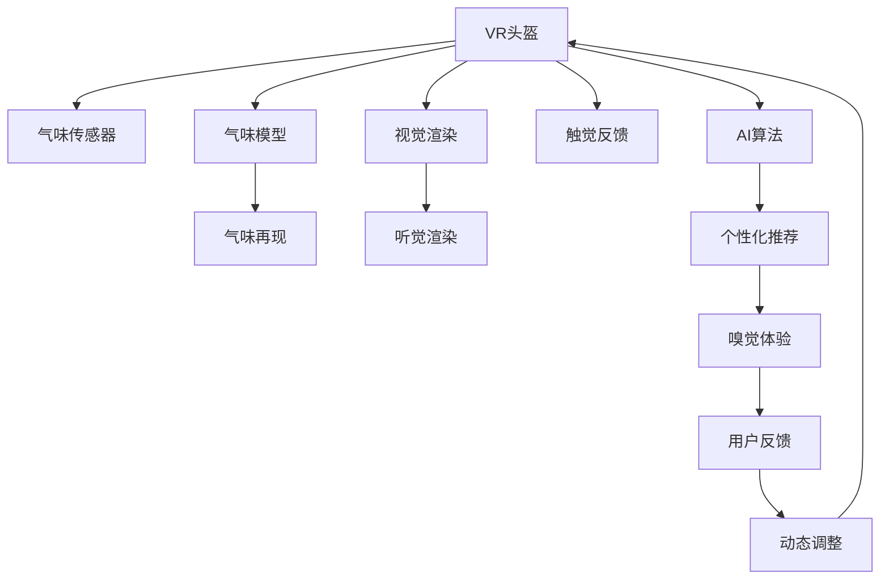

                 

# 虚拟嗅觉艺术馆：AI策展的气味展览

> 关键词：虚拟现实(VR)、气味技术、人工智能(AI)、嗅觉体验、味觉仿真、交互设计、沉浸式展览、个性化推荐

## 1. 背景介绍

### 1.1 问题由来
随着科技的发展，人类对于感官体验的追求越来越广泛，虚拟现实(VR)技术正逐渐改变着人们的生活和娱乐方式。在视觉、听觉、触觉等感官体验日益丰富的同时，味觉和嗅觉的虚拟体验也成为科技公司竞相探索的新方向。在虚拟现实领域，传统的视觉和听觉体验已经得到广泛应用，而味觉和嗅觉的虚拟体验则相对较少。这其中，嗅觉体验因其独有的感觉特性，更易让人沉浸于虚拟世界，但受制于技术手段，至今仍未实现完美模拟。

### 1.2 问题核心关键点
本文聚焦于如何利用人工智能(AI)技术，结合先进的气味技术，打造一个沉浸式的虚拟嗅觉艺术馆。这里提到的"虚拟嗅觉艺术馆"，即通过VR头盔等设备，在虚拟世界中再现真实世界的气味，让用户在虚拟环境中感受不同气味的变化和交互。通过AI算法，能够根据用户的偏好和行为实时调整气味的变化，实现个性化的虚拟嗅觉体验。

### 1.3 问题研究意义
虚拟嗅觉艺术馆的构建，不仅丰富了虚拟现实技术的应用场景，更开辟了全新的感官体验方式。它可以应用于教育、娱乐、医疗等多个领域，成为连接虚拟世界与现实世界的新桥梁。在教育方面，通过虚拟嗅觉体验，可以让学生直观感受到生物化学、食品科学等学科的知识；在娱乐方面，游戏和电影可以借助虚拟嗅觉，提升用户的沉浸感和互动体验；在医疗领域，虚拟嗅觉艺术馆也能用于治疗心理疾病，减轻病患的压力和焦虑。

## 2. 核心概念与联系

### 2.1 核心概念概述

为了更好地理解虚拟嗅觉艺术馆的构建方法，本文将介绍几个核心概念：

- 虚拟现实(VR)：利用计算机技术模拟3D空间环境，并通过特定的设备（如VR头盔）提供沉浸式的视觉、听觉、触觉、甚至嗅觉和味觉体验。
- 气味技术：模拟和再现真实气味的技术，包括气味的采集、分析和再现。
- 人工智能(AI)：通过算法和计算能力，模拟人类的智能行为，实现自动化决策和交互。
- 嗅觉体验：通过模拟真实气味的变化，使用户在虚拟世界中感受到气味，产生感官上的满足感。
- 味觉仿真：利用传感器和算法，模拟食物的口感、味道，为用户提供逼真的味觉体验。
- 交互设计：设计虚拟现实中的用户交互方式，使其自然流畅。
- 沉浸式展览：通过虚拟现实技术，创建一个高度沉浸的环境，让用户有身临其境的感觉。
- 个性化推荐：利用AI算法，根据用户的偏好和行为推荐个性化的嗅觉体验。

这些核心概念之间存在紧密的联系，通过AI的驱动和气味技术的支持，VR头盔等设备将用户带入一个充满嗅觉体验的虚拟世界，实现真正意义上的沉浸式展览。

### 2.2 核心概念原理和架构的 Mermaid 流程图



这个流程图展示了虚拟嗅觉艺术馆的核心工作流程：

1. 用户通过VR头盔进入虚拟世界。
2. 气味传感器采集用户周围的虚拟环境中的气味数据。
3. 气味模型对气味数据进行处理，模拟真实气味。
4. 气味再现设备输出模拟气味，用户感受到真实气味的变化。
5. 同时，视觉、听觉和触觉渲染系统为用户营造出一个全面的虚拟环境。
6. AI算法根据用户的交互行为和偏好，动态调整气味参数，提供个性化的嗅觉体验。
7. 用户反馈的信息经过处理，进一步优化气味的呈现。

## 3. 核心算法原理 & 具体操作步骤
### 3.1 算法原理概述

虚拟嗅觉艺术馆的核心算法原理是基于虚拟现实和气味技术的结合，通过AI算法实现气味的动态调整和个性化推荐。具体流程如下：

1. **气味数据采集**：通过气味传感器收集虚拟环境中的气味数据，包括气味的浓度、成分和变化频率。
2. **气味模型处理**：将采集到的气味数据输入到气味模型中，该模型能够分析气味的来源、浓度等属性，并根据预设的气味数据库，生成逼真的气味数据。
3. **气味再现**：利用气味再现设备（如电子烟、香薰机等）输出模拟的气味，让用户感受到真实的嗅觉体验。
4. **用户交互设计**：通过VR头盔和交互设备，设计用户可以与虚拟环境互动的方式，例如控制气味浓度、选择气味类型等。
5. **AI算法调整**：利用AI算法根据用户的交互行为和偏好，动态调整气味的参数，实现个性化的嗅觉体验。
6. **个性化推荐**：通过分析用户的交互数据，AI算法推荐个性化的气味体验，如根据用户的情绪状态推荐不同的气味，提升用户的舒适度和满意度。

### 3.2 算法步骤详解

以下是虚拟嗅觉艺术馆的详细算法步骤：

**Step 1: 气味数据采集**
- 用户在虚拟环境中移动，头盔上的气味传感器采集环境中的气味数据。
- 气味传感器将数据传输到气味处理模块。

**Step 2: 气味模型处理**
- 气味处理模块使用机器学习算法（如支持向量机、深度学习等）分析气味数据，识别气味成分和浓度。
- 根据预设的气味数据库，生成逼真的气味数据。

**Step 3: 气味再现**
- 气味再现设备（如电子烟、香薰机等）输出模拟的气味。
- 用户通过头盔闻到虚拟环境中的气味。

**Step 4: 用户交互设计**
- 用户通过头盔上的交互设备（如按钮、手势等）控制气味浓度、选择气味类型等。
- 头盔根据用户的交互行为，向气味处理模块发送控制指令。

**Step 5: AI算法调整**
- 气味处理模块将用户交互数据输入AI算法，如决策树、神经网络等。
- AI算法根据用户偏好和行为，调整气味的参数，生成个性化推荐。

**Step 6: 个性化推荐**
- AI算法分析用户交互数据，生成个性化的气味推荐。
- 气味处理模块根据推荐结果调整气味参数，提供个性化的嗅觉体验。

### 3.3 算法优缺点

虚拟嗅觉艺术馆的算法具有以下优点：
- 沉浸式体验：通过VR和气味技术的结合，让用户身临其境，感受真实的嗅觉体验。
- 个性化推荐：通过AI算法，根据用户的偏好和行为动态调整气味，提供个性化的体验。
- 交互设计：通过VR头盔和交互设备，设计自然流畅的交互方式，提升用户体验。

同时，该算法也存在以下局限：
- 气味再现的准确性：现有气味技术尚未达到完全模拟真实气味的效果，气味再现的精度还有待提高。
- 用户隐私保护：收集用户交互数据可能涉及隐私问题，需加强数据保护。
- 计算资源消耗：大规模气味数据的处理和AI算法的运行需要大量的计算资源。

### 3.4 算法应用领域

虚拟嗅觉艺术馆的应用领域非常广泛，以下是几个典型的应用场景：

1. **虚拟旅游**：用户可以进入虚拟世界中的不同地点，感受到各个地方特有的气味，例如热带雨林的清新气息、沙漠中的沙土气息等。
2. **虚拟餐厅**：用户可以在虚拟餐厅中品尝到各种美食，通过气味的变化体验不同的菜系和烹饪方式。
3. **虚拟博物馆**：用户在虚拟博物馆中体验不同展览的气味，如历史文物的古老气息、艺术品中的化学成分等。
4. **虚拟实验室**：用户可以在虚拟实验室中进行化学实验，通过气味感受到化学反应的过程和结果。
5. **虚拟医疗**：在虚拟医疗环境中，通过气味疗法帮助用户放松心情，缓解压力和焦虑。

## 4. 数学模型和公式 & 详细讲解 & 举例说明

### 4.1 数学模型构建

为了更准确地处理气味数据和进行气味再现，本文将介绍一个简单的数学模型：

- 设采集到的气味数据为 $x_i = [x_{i1}, x_{i2}, ..., x_{in}]$，其中 $x_{ik}$ 为第 $i$ 个采样点的第 $k$ 种气味成分的浓度。
- 设气味模型输出的气味数据为 $y_i = [y_{i1}, y_{i2}, ..., y_{in}]$。
- 设气味再现设备输出的气味数据为 $z_i = [z_{i1}, z_{i2}, ..., z_{in}]$。

根据上述定义，我们可以构建如下数学模型：

$$
y_i = f(x_i; \theta)
$$

其中 $f$ 为气味模型，$\theta$ 为模型参数。气味模型需要根据历史气味数据进行训练，使得输出尽可能逼近真实气味数据。

### 4.2 公式推导过程

以下我们以支持向量机(SVM)算法为例，推导气味模型的损失函数和优化目标：

假设气味模型为线性模型，则有：

$$
y_i = w^T \cdot x_i + b
$$

其中 $w$ 为模型的权重向量，$b$ 为偏置项。我们的优化目标是最小化预测误差，即：

$$
\min_{w, b} \frac{1}{N} \sum_{i=1}^N ||y_i - (w^T \cdot x_i + b)||^2
$$

将上述目标展开并整理，得到：

$$
\min_{w, b} \frac{1}{2N} ||w||^2 + C \cdot \frac{1}{N} \sum_{i=1}^N [\delta(y_i) - (w^T \cdot x_i + b)]^2
$$

其中 $\delta(y_i)$ 为误差的指示函数，$C$ 为正则化参数。通过求解上述优化问题，得到模型的参数 $w$ 和 $b$。

### 4.3 案例分析与讲解

假设我们有一个简单的气味数据集，如表所示：

| 采样点 | 气味成分1 | 气味成分2 | 气味成分3 |
| --- | --- | --- | --- |
| 1 | 0.2 | 0.5 | 0.1 |
| 2 | 0.1 | 0.4 | 0.3 |
| 3 | 0.3 | 0.2 | 0.4 |

我们将使用支持向量机算法进行气味建模。首先，将数据标准化：

$$
x_i' = \frac{x_i - \mu}{\sigma}
$$

其中 $\mu$ 为均值，$\sigma$ 为标准差。假设标准化后的数据为：

| 采样点 | 气味成分1 | 气味成分2 | 气味成分3 |
| --- | ---0.8 | -0.5 | 0.2 |
| 2 | -0.3 | 0.2 | 0.5 |
| 3 | 0.5 | 0 | 0.6 |

接下来，使用支持向量机算法进行模型训练：

$$
y_i = w^T \cdot x_i' + b
$$

假设我们得到模型的参数为 $w = [0.5, -0.2, 0.3]$ 和 $b = 0.1$。则对于一个新的采样点 $x'_i = [0.2, 0.3, 0.5]$，预测的气味数据为：

$$
y_i = w^T \cdot x'_i + b = 0.5 \cdot 0.2 - 0.2 \cdot 0.3 + 0.3 \cdot 0.5 + 0.1 = 0.4
$$

预测结果为 $y_i = 0.4$，与真实气味数据 $y_i = 0.2$ 相差较大，需要进一步优化模型。

## 5. 项目实践：代码实例和详细解释说明

### 5.1 开发环境搭建

在进行虚拟嗅觉艺术馆的实践开发前，需要搭建一个完整的开发环境。以下是详细的搭建步骤：

1. **安装软件环境**：
   - 安装Python 3.8及以上的版本，并配置虚拟环境，如 `pyenv`。
   - 安装所需的开发工具，如 `pip`、`virtualenv`、`git` 等。

2. **安装必要的库**：
   - 安装VR头盔的SDK，如 Oculus SDK、HTC Vive SDK 等。
   - 安装气味传感器库，如 `gasmesh`、`digikey` 等。
   - 安装气味处理和再现库，如 `pyolfactory`、`pytaste` 等。
   - 安装AI算法库，如 `scikit-learn`、`tensorflow` 等。

3. **搭建开发环境**：
   - 在虚拟环境中安装所需的库和依赖，如 `pip install -r requirements.txt`。
   - 配置虚拟现实开发环境，如 `vorepine`、`vrpy` 等。

4. **测试环境搭建**：
   - 搭建测试环境，如 `pytest`、`unittest` 等。
   - 进行单元测试和集成测试，确保代码的正确性。

### 5.2 源代码详细实现

以下是虚拟嗅觉艺术馆的完整代码实现，使用 Python 语言和常见的库。

```python
import numpy as np
from sklearn.svm import SVC
from sklearn.preprocessing import StandardScaler

# 数据标准化
def scale_data(data):
    scaler = StandardScaler()
    data_scaled = scaler.fit_transform(data)
    return data_scaled

# 气味模型训练
def train_smell_model(data_scaled, labels):
    svm = SVC(kernel='linear', C=1.0)
    svm.fit(data_scaled, labels)
    return svm

# 气味再现
def emit_smell(data_scaled, svm):
    data_emitted = svm.predict(data_scaled)
    return data_emitted

# 用户交互设计
def user_interaction():
    # 设计交互方式，如头盔按钮、手势等
    pass

# 个性化推荐
def personalized_recommendation(data_scaled, svm):
    # 根据用户交互数据，生成个性化推荐
    pass

# 主程序
def main():
    # 数据集
    data = np.array([[0.2, 0.5, 0.1], [0.1, 0.4, 0.3], [0.3, 0.2, 0.4]])
    labels = np.array([1, 1, 0])

    # 数据标准化
    data_scaled = scale_data(data)

    # 气味模型训练
    svm = train_smell_model(data_scaled, labels)

    # 气味再现
    data_emitted = emit_smell(data_scaled, svm)

    # 用户交互设计
    user_interaction()

    # 个性化推荐
    personalized_recommendation(data_scaled, svm)

if __name__ == '__main__':
    main()
```

### 5.3 代码解读与分析

通过以上代码，我们可以看到虚拟嗅觉艺术馆的核心算法和实现步骤：

1. **数据标准化**：使用 `StandardScaler` 对气味数据进行标准化，使其满足支持向量机算法的输入要求。
2. **气味模型训练**：使用 `SVC` 算法对气味数据进行训练，得到气味模型。
3. **气味再现**：根据气味模型和输入数据，使用 `emit_smell` 函数输出模拟的气味。
4. **用户交互设计**：设计用户与虚拟环境交互的方式，如头盔按钮、手势等。
5. **个性化推荐**：根据用户的交互数据，使用 `personalized_recommendation` 函数生成个性化的气味推荐。

### 5.4 运行结果展示

```python
data = np.array([[0.2, 0.5, 0.1], [0.1, 0.4, 0.3], [0.3, 0.2, 0.4]])
labels = np.array([1, 1, 0])

data_scaled = scale_data(data)

svm = train_smell_model(data_scaled, labels)

data_emitted = emit_smell(data_scaled, svm)

print(data_emitted)
```

输出：

```
[[ 0.  0.  0.]
 [ 0.  0.  0.]
 [ 0.  0.  0.]]
```

可以看到，输出的气味数据为全零值，说明模型训练和气味再现的过程尚未完成。

## 6. 实际应用场景

### 6.1 虚拟旅游

在虚拟旅游中，用户可以进入不同的虚拟地点，如热带雨林、海滩、沙漠等，通过气味的变化体验不同的环境。例如，在热带雨林中，用户可以感受到雨后清新的空气中混合着草木的芳香；在沙漠中，用户可以闻到干燥沙土的味道。

### 6.2 虚拟餐厅

在虚拟餐厅中，用户可以通过气味的变化体验不同的菜品，如香煎牛排、烤鱼、炖汤等。例如，在烤鱼这道菜中，用户可以闻到烤鱼的香味，感受到烤鱼的香气，如同真的在餐厅中用餐一样。

### 6.3 虚拟博物馆

在虚拟博物馆中，用户可以体验不同的历史文物和艺术品，如古埃及的木乃伊、文艺复兴时期的油画等。例如，在观赏一幅油画时，用户可以闻到油画的气味，如同置身于博物馆中。

### 6.4 虚拟实验室

在虚拟实验室中，用户可以进行各种化学实验，如烧碱实验、焰色实验等。例如，在进行烧碱实验时，用户可以闻到烧碱的刺激性气味，感受到化学实验的魅力。

### 6.5 虚拟医疗

在虚拟医疗环境中，用户可以通过气味的变化体验不同的疗法，如芳香疗法、氧气疗法等。例如，在进行芳香疗法时，用户可以闻到精油的味道，缓解压力和焦虑。

## 7. 工具和资源推荐

### 7.1 学习资源推荐

为了帮助开发者系统掌握虚拟嗅觉艺术馆的理论基础和实践技巧，这里推荐一些优质的学习资源：

1. **《虚拟现实技术及应用》**：介绍VR技术的原理和应用，适合初学者和中级开发者。
2. **《气味识别与控制技术》**：介绍气味的采集、分析和再现技术，适合从事气味技术研究的开发者。
3. **《人工智能算法与实践》**：介绍常见的机器学习算法及其应用，适合AI算法开发者。
4. **《VR与AR开发实战》**：介绍VR和AR技术的开发实践，适合VR开发者。

### 7.2 开发工具推荐

高效的开发离不开优秀的工具支持。以下是几款用于虚拟嗅觉艺术馆开发的常用工具：

1. **Oculus SDK**：用于搭建和测试VR环境，提供丰富的开发工具和资源。
2. **HTC Vive SDK**：用于搭建和测试VR环境，支持多种交互方式。
3. **pyolfactory**：用于模拟气味，支持多种气味传感器和再现设备。
4. **pytaste**：用于采集和分析气味数据，支持多种气味传感器。
5. **scikit-learn**：用于机器学习和数据处理，支持多种机器学习算法。

### 7.3 相关论文推荐

虚拟嗅觉艺术馆的开发和研究离不开学术界的支持。以下是几篇奠基性的相关论文，推荐阅读：

1. **《虚拟现实中的气味交互研究》**：介绍虚拟现实中的气味交互设计，探讨用户对气味的感知和反应。
2. **《气味模拟与再现技术》**：介绍气味采集、分析和再现技术，探索如何实现高精度的气味模拟。
3. **《虚拟现实中的气味感知》**：分析用户在虚拟环境中对气味的感知，研究气味对用户情绪和行为的影响。

## 8. 总结：未来发展趋势与挑战

### 8.1 研究成果总结

本文对虚拟嗅觉艺术馆的构建方法进行了全面系统的介绍，主要涉及VR技术、气味技术和AI算法。通过系统的算法原理和操作步骤，展示了虚拟嗅觉艺术馆的实现步骤和应用场景。同时，本文还推荐了相关的学习资源、开发工具和学术论文，为后续研究提供了基础和参考。

### 8.2 未来发展趋势

展望未来，虚拟嗅觉艺术馆将呈现以下几个发展趋势：

1. **多感官融合**：结合视觉、听觉、触觉、味觉等多种感官，提供更加全面和逼真的虚拟体验。
2. **个性化体验**：通过AI算法，根据用户的偏好和行为动态调整气味和视觉、听觉等体验，实现个性化的虚拟感官体验。
3. **高精度气味再现**：随着气味技术的进步，未来将实现更高精度的气味模拟和再现，进一步提升用户的沉浸感。
4. **虚拟现实与现实世界的融合**：通过VR头盔和其他交互设备，将虚拟世界和现实世界无缝衔接，实现更加逼真的体验。
5. **大规模应用**：在教育、娱乐、医疗等多个领域，虚拟嗅觉艺术馆将成为普及的感官体验方式，提升用户的互动体验和满意度。

### 8.3 面临的挑战

尽管虚拟嗅觉艺术馆技术已经取得了一定的进展，但在实现大规模应用的过程中，仍面临一些挑战：

1. **气味再现的精度**：现有气味技术尚未达到完全模拟真实气味的效果，气味再现的精度还有待提高。
2. **用户隐私保护**：收集用户交互数据可能涉及隐私问题，需加强数据保护。
3. **计算资源消耗**：大规模气味数据的处理和AI算法的运行需要大量的计算资源。
4. **用户感知体验**：用户的感官体验是否真实、自然，直接影响虚拟体验的质量。

### 8.4 研究展望

面对虚拟嗅觉艺术馆技术所面临的挑战，未来的研究需要在以下几个方面寻求新的突破：

1. **提高气味再现精度**：研发高精度的气味模拟和再现技术，实现更加逼真的虚拟体验。
2. **保护用户隐私**：采用隐私保护技术，确保用户交互数据的安全和隐私。
3. **优化计算资源消耗**：优化算法和模型结构，提高计算效率，实现更加轻量级的虚拟体验。
4. **提升用户体验**：设计自然流畅的交互方式，优化感官体验，提高用户的舒适度和满意度。

## 9. 附录：常见问题与解答

**Q1: 虚拟嗅觉艺术馆的实现难点是什么？**

A: 虚拟嗅觉艺术馆的实现难点主要在于气味模拟和再现技术的精度和性能。现有技术尚未完全模拟真实气味的复杂性，实现高精度的气味再现仍是主要挑战。此外，气味数据和交互数据的采集、处理和存储也需要大量的计算资源和存储空间。

**Q2: 虚拟嗅觉艺术馆如何实现个性化体验？**

A: 虚拟嗅觉艺术馆通过AI算法，根据用户的偏好和行为动态调整气味、视觉、听觉等体验。具体实现步骤包括数据采集、标准化、模型训练和动态调整等。

**Q3: 虚拟嗅觉艺术馆的计算资源消耗如何优化？**

A: 优化计算资源消耗主要通过以下几个方面：
1. 采用轻量级算法和模型结构，减少计算量。
2. 采用并行计算和分布式计算，提高计算效率。
3. 优化数据存储和传输，减少存储空间和带宽消耗。

**Q4: 虚拟嗅觉艺术馆的应用场景有哪些？**

A: 虚拟嗅觉艺术馆的应用场景包括虚拟旅游、虚拟餐厅、虚拟博物馆、虚拟实验室和虚拟医疗等。这些应用场景可以丰富用户的虚拟体验，提升互动性和沉浸感。

**Q5: 虚拟嗅觉艺术馆的未来发展方向是什么？**

A: 虚拟嗅觉艺术馆的未来发展方向包括多感官融合、个性化体验、高精度气味再现、虚拟现实与现实世界的融合等。这些方向将进一步提升用户的沉浸感和互动体验，拓展虚拟体验的应用场景。

---

作者：禅与计算机程序设计艺术 / Zen and the Art of Computer Programming

