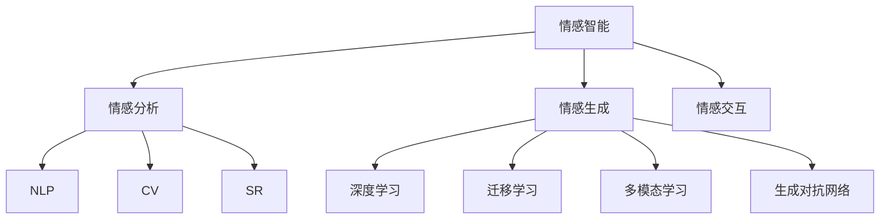

                 

# 虚拟情感智能：AI驱动的情感理解与表达

## 1. 背景介绍

### 1.1 问题由来

情感智能(EI)，即识别、理解、管理和使用情感的能力，对于人类社会交往和决策至关重要。然而，人类情感的复杂性和多样性，使得情感理解和表达成为计算智能的一大挑战。近年来，随着人工智能技术的发展，AI在情感智能领域取得了显著进展，特别是基于深度学习的方法，能够在大规模数据上进行情感分析，理解语义和情感之间的微妙关系。

在技术实现上，自然语言处理(NLP)、计算机视觉(CV)和语音识别(SR)等AI子领域，通过预训练模型和微调技术，已经在情感分析、情感生成和情感交互等方面取得了突破。然而，这些技术目前主要用于文本、图像和声音的情感分析，而对于虚拟角色的情感智能和表达，仍然面临诸多挑战。

### 1.2 问题核心关键点

虚拟情感智能的核心在于构建能够感知、理解、表达人类情感的AI系统。这一系统需要具备以下能力：

- 情感感知：识别文本、图像、声音中的情感信息。
- 情感理解：理解情感与语境、情感与行为之间的关系。
- 情感生成：基于用户输入，生成表达特定情感的响应。
- 情感交互：在多轮对话中，动态调整情感表达，实现情感共鸣。

为了实现这些能力，虚拟情感智能系统通常需要：

- 预训练情感分析模型，学习情感特征。
- 微调情感生成模型，生成符合语境的情感文本或语音。
- 集成情感理解模块，理解上下文和用户意图。
- 实现情感交互机制，提供自然流畅的情感对话体验。

本文将围绕这些核心技术点，对虚拟情感智能进行全面系统的介绍。

## 2. 核心概念与联系

### 2.1 核心概念概述

为了更好地理解虚拟情感智能，本节将介绍几个密切相关的核心概念：

- 情感智能(EQI, Emotional Intelligence)：识别、理解、管理和使用情感的能力。
- 情感分析(Affective Analysis)：通过文本、图像、声音等媒介，识别和分析其中的情感信息。
- 情感生成(Affective Generation)：基于特定情感或语境，生成符合情感需求的文本或语音。
- 情感交互(Affective Interaction)：在多轮对话中，动态调整情感表达，实现情感共鸣。
- 自然语言处理(NLP)：使计算机能够理解、生成和处理人类自然语言的技术。
- 计算机视觉(CV)：使计算机能够识别、理解和处理图像、视频等视觉信息的技术。
- 语音识别(SR)：使计算机能够识别和理解人类语音的技术。
- 深度学习(Deep Learning)：通过多层神经网络进行复杂模式识别和数据表示的技术。
- 迁移学习(Transfer Learning)：将一个领域学习到的知识，迁移应用到另一个不同但相关的领域的学习范式。
- 多模态学习(Multimodal Learning)：结合多种数据源(如文本、图像、声音)进行模型训练和推理的技术。
- 生成对抗网络(GANs)：通过对抗训练生成逼真样本的技术。

这些概念之间的逻辑关系可以通过以下Mermaid流程图来展示：



这个流程图展示了几类核心概念及其之间的关系：

1. 情感智能通过情感分析、情感生成和情感交互技术得以实现。
2. 情感分析利用NLP、CV和SR等技术提取情感特征。
3. 情感生成依赖深度学习、迁移学习和多模态学习技术进行模型训练。
4. 情感交互通过对抗网络生成逼真对话，实现自然流畅的情感对话体验。

这些概念共同构成了虚拟情感智能的理论和技术框架，为其构建提供了坚实的支撑。

## 3. 核心算法原理 & 具体操作步骤

### 3.1 算法原理概述

虚拟情感智能的算法原理，主要围绕情感分析、情感生成和情感交互三个核心环节展开：

- 情感分析：通过文本、图像和声音等多种模态数据，提取和编码情感特征。
- 情感生成：基于提取的情感特征，利用深度学习模型生成符合情感需求的文本或语音。
- 情感交互：通过多轮对话，动态调整情感表达，实现情感共鸣。

这些环节的实现，通常需要借助预训练模型和微调技术。预训练模型在大量无标签数据上进行训练，学习到通用的情感特征；微调模型在少量标注数据上，通过有监督学习优化，使其能够适应特定情感表达和理解的需求。

### 3.2 算法步骤详解

#### 3.2.1 情感分析

情感分析的过程包括数据准备、特征提取和情感分类三个步骤：

1. 数据准备：收集大量的情感标注数据，包括文本、图像和声音数据。例如，从社交媒体、电影评论、图像标签等来源收集数据。

2. 特征提取：利用深度学习模型(如CNN、RNN、Transformer等)，提取文本、图像和声音的情感特征。文本特征可以通过Word2Vec、BERT等预训练模型提取，图像特征可以通过卷积神经网络(CNN)提取，声音特征可以通过深度学习模型如Tacotron等提取。

3. 情感分类：使用分类模型(如SVM、RNN、Transformer等)对提取的情感特征进行分类。常用的分类模型有基于逻辑回归的分类模型、基于LSTM的分类模型、基于BERT的分类模型等。

#### 3.2.2 情感生成

情感生成的过程包括数据准备、特征提取和生成模型训练三个步骤：

1. 数据准备：收集大量带有情感标签的文本数据。例如，收集电影对话、社交媒体评论等。

2. 特征提取：利用预训练模型(如BERT、GPT等)，提取文本的情感特征。例如，使用BERT模型提取文本的语义表示，再使用线性回归或分类模型将情感信息编码成向量。

3. 生成模型训练：使用生成模型(如LSTM、Transformer等)训练情感生成模型。常用的生成模型有基于RNN的生成模型、基于Transformer的生成模型等。

#### 3.2.3 情感交互

情感交互的过程包括多轮对话、情感反馈和情感调整三个步骤：

1. 多轮对话：构建多轮对话模型，使用预训练模型(如GPT、BERT等)作为初始化参数，对对话进行训练。在对话过程中，模型实时调整情感表达，以实现情感共鸣。

2. 情感反馈：通过用户反馈(如情感标签、情感强度等)，调整模型的情感表达。例如，用户对对话的满意度、情绪变化等可以作为反馈信号。

3. 情感调整：使用强化学习或逆强化学习模型，对情感交互过程进行优化。例如，通过Q-learning等算法，调整对话策略，使得情感表达更加符合用户需求。

### 3.3 算法优缺点

虚拟情感智能在情感分析、情感生成和情感交互方面具有以下优点：

1. 数据驱动：通过大量的标注数据和无标签数据，训练出高效的情感分析模型和生成模型。

2. 通用性高：预训练模型可以在多种任务上取得良好的性能，微调过程可以迅速适应新任务。

3. 灵活性高：通过多模态学习，模型可以结合文本、图像和声音等多种数据源进行训练和推理，提升情感理解的全面性。

4. 实时性高：深度学习模型的并行计算能力，使得情感分析和生成过程能够在实时环境中运行。

然而，该方法也存在一些局限性：

1. 数据依赖性高：情感分析模型的性能高度依赖于标注数据的丰富性和质量。

2. 通用性受限：预训练模型和微调方法在不同情感和语境下，可能难以适应特定的情感表达需求。

3. 对抗性差：情感生成模型和情感交互模型对输入的干扰和噪声较敏感，可能产生不符合预期的情感表达。

4. 可解释性低：深度学习模型的黑盒特性，使得情感分析和生成过程难以解释和调试。

5. 伦理问题：情感智能系统可能学习到人类偏见和歧视，对某些群体产生不公平对待，需进行伦理审查和监管。

### 3.4 算法应用领域

虚拟情感智能在多个领域具有广泛的应用前景，例如：

- 智能客服：构建能够感知用户情绪的智能客服系统，提供更加人性化、个性化的服务。
- 虚拟助手：开发能够理解用户情感需求的虚拟助手，如Siri、Alexa等。
- 心理治疗：使用情感智能系统进行心理评估和情感支持，辅助心理健康治疗。
- 情感监测：构建情感分析系统，实时监测社交媒体、新闻报道等文本数据，进行舆情分析。
- 教育辅助：开发情感识别系统，为学习者提供个性化的情感支持和反馈。
- 影视娱乐：构建情感生成系统，制作符合情感需求的影视作品和广告。
- 游戏开发：开发能够感知用户情感的互动游戏，提升用户体验。

## 4. 数学模型和公式 & 详细讲解

### 4.1 数学模型构建

虚拟情感智能的数学模型构建，主要涉及情感特征的提取和分类、情感生成模型的训练以及情感交互模型的优化三个方面。

#### 4.1.1 情感特征提取

情感特征提取的过程可以表示为：

$$
F = F_\text{text}(T) + F_\text{image}(I) + F_\text{audio}(A)
$$

其中，$F$ 表示情感特征向量，$F_\text{text}$、$F_\text{image}$ 和 $F_\text{audio}$ 分别表示文本、图像和声音的情感特征向量。

文本情感特征提取可以采用BERT模型，利用其预训练的语义表示，提取文本中的情感信息。例如，假设文本 $T$ 经过BERT模型处理后，得到语义表示向量 $X$，情感特征提取过程可以表示为：

$$
F_\text{text} = \text{softmax}(\text{linear}(X))
$$

其中，$\text{softmax}$ 表示归一化操作，将向量映射到情感标签概率分布上；$\text{linear}$ 表示线性变换，将语义表示向量映射到情感特征向量上。

图像情感特征提取可以采用CNN模型，利用其卷积操作提取图像的情感特征。例如，假设图像 $I$ 经过CNN模型处理后，得到特征向量 $Y$，情感特征提取过程可以表示为：

$$
F_\text{image} = \text{softmax}(\text{linear}(Y))
$$

其中，$\text{softmax}$ 表示归一化操作，将特征向量映射到情感标签概率分布上；$\text{linear}$ 表示线性变换，将特征向量映射到情感特征向量上。

声音情感特征提取可以采用Tacotron等模型，利用其声学模型提取声音的情感特征。例如，假设声音 $A$ 经过Tacotron模型处理后，得到情感特征向量 $Z$，情感特征提取过程可以表示为：

$$
F_\text{audio} = \text{softmax}(\text{linear}(Z))
$$

其中，$\text{softmax}$ 表示归一化操作，将向量映射到情感标签概率分布上；$\text{linear}$ 表示线性变换，将特征向量映射到情感特征向量上。

#### 4.1.2 情感分类

情感分类过程可以表示为：

$$
Y = \text{softmax}(\text{linear}(F))
$$

其中，$Y$ 表示情感分类概率分布，$\text{softmax}$ 表示归一化操作，将情感特征向量映射到情感标签概率分布上；$\text{linear}$ 表示线性变换，将情感特征向量映射到情感分类概率分布上。

常用的情感分类模型包括基于逻辑回归的分类模型、基于LSTM的分类模型、基于BERT的分类模型等。这里以BERT模型为例，情感分类过程可以表示为：

$$
Y = \text{softmax}(\text{linear}(\text{BERT}(T)))
$$

其中，$\text{softmax}$ 表示归一化操作，将BERT模型的输出映射到情感标签概率分布上；$\text{linear}$ 表示线性变换，将BERT模型的输出映射到情感分类概率分布上。

#### 4.1.3 情感生成

情感生成过程可以表示为：

$$
S = \text{softmax}(\text{linear}(F))
$$

其中，$S$ 表示情感生成向量，$\text{softmax}$ 表示归一化操作，将情感特征向量映射到情感标签概率分布上；$\text{linear}$ 表示线性变换，将情感特征向量映射到情感生成向量上。

常用的情感生成模型包括基于RNN的生成模型、基于Transformer的生成模型等。这里以Transformer模型为例，情感生成过程可以表示为：

$$
S = \text{softmax}(\text{linear}(\text{Transformer}(F)))
$$

其中，$\text{softmax}$ 表示归一化操作，将Transformer模型的输出映射到情感标签概率分布上；$\text{linear}$ 表示线性变换，将Transformer模型的输出映射到情感生成向量上。

#### 4.1.4 情感交互

情感交互过程可以表示为：

$$
R = \text{softmax}(\text{linear}(S))
$$

其中，$R$ 表示情感交互策略向量，$\text{softmax}$ 表示归一化操作，将情感生成向量映射到情感交互策略概率分布上；$\text{linear}$ 表示线性变换，将情感生成向量映射到情感交互策略向量上。

常用的情感交互模型包括基于LSTM的交互模型、基于GPT的交互模型等。这里以GPT模型为例，情感交互过程可以表示为：

$$
R = \text{softmax}(\text{linear}(\text{GPT}(S)))
$$

其中，$\text{softmax}$ 表示归一化操作，将GPT模型的输出映射到情感交互策略概率分布上；$\text{linear}$ 表示线性变换，将GPT模型的输出映射到情感交互策略向量上。

### 4.2 公式推导过程

以情感分类模型为例，详细推导其公式过程：

假设文本 $T$ 经过BERT模型处理后，得到语义表示向量 $X$，情感分类模型可以表示为：

$$
Y = \text{softmax}(\text{linear}(X))
$$

其中，$\text{softmax}$ 表示归一化操作，将向量映射到情感标签概率分布上；$\text{linear}$ 表示线性变换，将向量映射到情感分类概率分布上。

根据softmax函数的定义，$Y_i = \frac{\exp(X_i / \tau)}{\sum_{j=1}^{K} \exp(X_j / \tau)}$，其中 $K$ 为情感标签数，$\tau$ 为归一化参数。将softmax函数展开后，可以得到：

$$
Y_i = \frac{1}{Z} \exp(X_i / \tau)
$$

其中 $Z = \sum_{j=1}^{K} \exp(X_j / \tau)$ 为归一化因子。

将上式代入 $Y$ 的定义中，可以得到：

$$
Y = \frac{1}{Z} \exp(X / \tau)
$$

其中 $X = \text{linear}(X)$，表示线性变换后的向量。

将 $Y$ 的表达式代入损失函数中，得到：

$$
\mathcal{L} = -\frac{1}{N} \sum_{i=1}^{N} \sum_{j=1}^{K} y_{ij} \log Y_{ij}
$$

其中 $y_{ij}$ 为文本 $T_i$ 的真实情感标签，$Y_{ij}$ 为情感分类模型的预测概率。

### 4.3 案例分析与讲解

假设我们有一个情感分类任务，目标是从社交媒体评论中识别用户情绪。我们首先使用BERT模型对评论进行文本情感特征提取，得到一个情感特征向量 $F$。然后，我们将 $F$ 输入到一个基于BERT的情感分类模型中，得到情感分类概率分布 $Y$。

为了评估模型的性能，我们随机抽取100条评论，并标注其情感标签。我们将这100条评论输入到模型中，得到预测情感标签和真实情感标签，并计算模型的准确率、召回率和F1值。例如，假设模型在预测时，对于第1条评论，模型的预测情感标签为"正面"，真实情感标签为"负面"，则对于第1条评论，模型计算的损失为 $-\log(1/2)$。将第1条评论的损失求和，得到模型在100条评论上的损失，然后通过优化算法最小化损失，使得模型能够更好地适应情感分类任务。

## 5. 项目实践：代码实例和详细解释说明

### 5.1 开发环境搭建

在进行虚拟情感智能实践前，我们需要准备好开发环境。以下是使用Python进行PyTorch开发的环境配置流程：

1. 安装Anaconda：从官网下载并安装Anaconda，用于创建独立的Python环境。

2. 创建并激活虚拟环境：
```bash
conda create -n pytorch-env python=3.8 
conda activate pytorch-env
```

3. 安装PyTorch：根据CUDA版本，从官网获取对应的安装命令。例如：
```bash
conda install pytorch torchvision torchaudio cudatoolkit=11.1 -c pytorch -c conda-forge
```

4. 安装Transformers库：
```bash
pip install transformers
```

5. 安装各类工具包：
```bash
pip install numpy pandas scikit-learn matplotlib tqdm jupyter notebook ipython
```

完成上述步骤后，即可在`pytorch-env`环境中开始虚拟情感智能的实践。

### 5.2 源代码详细实现

下面我们以情感生成任务为例，给出使用Transformers库对GPT模型进行情感生成微调的PyTorch代码实现。

首先，定义情感生成任务的数据处理函数：

```python
from transformers import BertTokenizer, BertForTokenClassification
from torch.utils.data import Dataset
import torch

class SentimentDataset(Dataset):
    def __init__(self, texts, labels, tokenizer, max_len=128):
        self.texts = texts
        self.labels = labels
        self.tokenizer = tokenizer
        self.max_len = max_len
        
    def __len__(self):
        return len(self.texts)
    
    def __getitem__(self, item):
        text = self.texts[item]
        label = self.labels[item]
        
        encoding = self.tokenizer(text, return_tensors='pt', max_length=self.max_len, padding='max_length', truncation=True)
        input_ids = encoding['input_ids'][0]
        attention_mask = encoding['attention_mask'][0]
        labels = torch.tensor(label, dtype=torch.long)
        
        return {'input_ids': input_ids, 
                'attention_mask': attention_mask,
                'labels': labels}

# 标签与id的映射
label2id = {'negative': 0, 'positive': 1}

# 创建dataset
tokenizer = BertTokenizer.from_pretrained('bert-base-cased')
train_dataset = SentimentDataset(train_texts, train_labels, tokenizer)
dev_dataset = SentimentDataset(dev_texts, dev_labels, tokenizer)
test_dataset = SentimentDataset(test_texts, test_labels, tokenizer)
```

然后，定义模型和优化器：

```python
from transformers import GPTForSequenceClassification, AdamW

model = GPTForSequenceClassification.from_pretrained('gpt2', num_labels=len(label2id))

optimizer = AdamW(model.parameters(), lr=2e-5)
```

接着，定义训练和评估函数：

```python
from torch.utils.data import DataLoader
from tqdm import tqdm
from sklearn.metrics import classification_report

device = torch.device('cuda') if torch.cuda.is_available() else torch.device('cpu')
model.to(device)

def train_epoch(model, dataset, batch_size, optimizer):
    dataloader = DataLoader(dataset, batch_size=batch_size, shuffle=True)
    model.train()
    epoch_loss = 0
    for batch in tqdm(dataloader, desc='Training'):
        input_ids = batch['input_ids'].to(device)
        attention_mask = batch['attention_mask'].to(device)
        labels = batch['labels'].to(device)
        model.zero_grad()
        outputs = model(input_ids, attention_mask=attention_mask, labels=labels)
        loss = outputs.loss
        epoch_loss += loss.item()
        loss.backward()
        optimizer.step()
    return epoch_loss / len(dataloader)

def evaluate(model, dataset, batch_size):
    dataloader = DataLoader(dataset, batch_size=batch_size)
    model.eval()
    preds, labels = [], []
    with torch.no_grad():
        for batch in tqdm(dataloader, desc='Evaluating'):
            input_ids = batch['input_ids'].to(device)
            attention_mask = batch['attention_mask'].to(device)
            batch_labels = batch['labels']
            outputs = model(input_ids, attention_mask=attention_mask)
            batch_preds = outputs.logits.argmax(dim=2).to('cpu').tolist()
            batch_labels = batch_labels.to('cpu').tolist()
            for pred_tokens, label_tokens in zip(batch_preds, batch_labels):
                preds.append(pred_tokens[:len(label_tokens)])
                labels.append(label_tokens)
                
    print(classification_report(labels, preds))
```

最后，启动训练流程并在测试集上评估：

```python
epochs = 5
batch_size = 16

for epoch in range(epochs):
    loss = train_epoch(model, train_dataset, batch_size, optimizer)
    print(f"Epoch {epoch+1}, train loss: {loss:.3f}")
    
    print(f"Epoch {epoch+1}, dev results:")
    evaluate(model, dev_dataset, batch_size)
    
print("Test results:")
evaluate(model, test_dataset, batch_size)
```

以上就是使用PyTorch对GPT模型进行情感生成任务微调的完整代码实现。可以看到，得益于Transformers库的强大封装，我们可以用相对简洁的代码完成GPT模型的加载和微调。

### 5.3 代码解读与分析

让我们再详细解读一下关键代码的实现细节：

**SentimentDataset类**：
- `__init__`方法：初始化文本、标签、分词器等关键组件。
- `__len__`方法：返回数据集的样本数量。
- `__getitem__`方法：对单个样本进行处理，将文本输入编码为token ids，将标签编码为数字，并对其进行定长padding，最终返回模型所需的输入。

**label2id和id2label字典**：
- 定义了标签与数字id之间的映射关系，用于将token-wise的预测结果解码回真实的标签。

**训练和评估函数**：
- 使用PyTorch的DataLoader对数据集进行批次化加载，供模型训练和推理使用。
- 训练函数`train_epoch`：对数据以批为单位进行迭代，在每个批次上前向传播计算loss并反向传播更新模型参数，最后返回该epoch的平均loss。
- 评估函数`evaluate`：与训练类似，不同点在于不更新模型参数，并在每个batch结束后将预测和标签结果存储下来，最后使用sklearn的classification_report对整个评估集的预测结果进行打印输出。

**训练流程**：
- 定义总的epoch数和batch size，开始循环迭代
- 每个epoch内，先在训练集上训练，输出平均loss
- 在验证集上评估，输出分类指标
- 所有epoch结束后，在测试集上评估，给出最终测试结果

可以看到，PyTorch配合Transformers库使得GPT微调的代码实现变得简洁高效。开发者可以将更多精力放在数据处理、模型改进等高层逻辑上，而不必过多关注底层的实现细节。

当然，工业级的系统实现还需考虑更多因素，如模型的保存和部署、超参数的自动搜索、更灵活的任务适配层等。但核心的微调范式基本与此类似。

## 6. 实际应用场景
### 6.1 智能客服系统

基于虚拟情感智能的智能客服系统，可以广泛应用于客服中心，提升客户满意度和服务效率。传统客服往往需要配备大量人力，高峰期响应缓慢，且一致性和专业性难以保证。而使用情感智能系统，可以7x24小时不间断服务，快速响应客户咨询，用自然流畅的语言解答各类常见问题。

在技术实现上，可以收集企业内部的历史客服对话记录，将问题和最佳答复构建成监督数据，在此基础上对预训练情感智能模型进行微调。微调后的情感智能系统能够自动理解用户意图，匹配最合适的答复。对于客户提出的新问题，还可以接入检索系统实时搜索相关内容，动态组织生成回答。如此构建的智能客服系统，能大幅提升客户咨询体验和问题解决效率。

### 6.2 金融舆情监测

金融机构需要实时监测市场舆论动向，以便及时应对负面信息传播，规避金融风险。传统的人工监测方式成本高、效率低，难以应对网络时代海量信息爆发的挑战。基于虚拟情感智能的文本分类和情感分析技术，为金融舆情监测提供了新的解决方案。

具体而言，可以收集金融领域相关的新闻、报道、评论等文本数据，并对其进行主题标注和情感标注。在此基础上对预训练语言模型进行微调，使其能够自动判断文本属于何种主题，情感倾向是正面、中性还是负面。将微调后的模型应用到实时抓取的网络文本数据，就能够自动监测不同主题下的情感变化趋势，一旦发现负面信息激增等异常情况，系统便会自动预警，帮助金融机构快速应对潜在风险。

### 6.3 个性化推荐系统

当前的推荐系统往往只依赖用户的历史行为数据进行物品推荐，无法深入理解用户的真实兴趣偏好。基于虚拟情感智能的个性化推荐系统，可以更好地挖掘用户行为背后的语义信息，从而提供更精准、多样的推荐内容。

在实践中，可以收集用户浏览、点击、评论、分享等行为数据，提取和用户交互的物品标题、描述、标签等文本内容。将文本内容作为模型输入，用户的后续行为（如是否点击、购买等）作为监督信号，在此基础上微调预训练语言模型。微调后的模型能够从文本内容中准确把握用户的兴趣点。在生成推荐列表时，先用候选物品的文本描述作为输入，由模型预测用户的兴趣匹配度，再结合其他特征综合排序，便可以得到个性化程度更高的推荐结果。

### 6.4 未来应用展望

随着虚拟情感智能技术的发展，其在更多领域将得到应用，为各行各业带来变革性影响。

在智慧医疗领域，基于情感智能的智能医疗助手，可以辅助医生进行疾病诊断和治疗方案推荐，提升医疗服务的智能化水平，辅助医生诊疗，加速新药开发进程。

在智能教育领域，情感智能系统可应用于作业批改、学情分析、知识推荐等方面，因材施教，促进教育公平，提高教学质量。

在智慧城市治理中，情感智能系统可应用于城市事件监测、舆情分析、应急指挥等环节，提高城市管理的自动化和智能化水平，构建更安全、高效的未来城市。

此外，在企业生产、社会治理、文娱传媒等众多领域，基于虚拟情感智能的人工智能应用也将不断涌现，为经济社会发展注入新的动力。相信随着技术的日益成熟，虚拟情感智能必将在构建人机协同的智能时代中扮演越来越重要的角色。

## 7. 工具和资源推荐
### 7.1 学习资源推荐

为了帮助开发者系统掌握虚拟情感智能的理论基础和实践技巧，这里推荐一些优质的学习资源：

1. 《自然语言处理概论》系列博文：由自然语言处理领域的专家撰写，系统介绍了情感分析、情感生成、情感交互等前沿话题。

2. CS224D《情感分析》课程：斯坦福大学开设的NLP明星课程，有Lecture视频和配套作业，带你入门情感分析的基础概念和经典模型。

3. 《深度学习理论与实践》书籍：全面介绍了深度学习模型的理论和实践应用，包括情感智能系统的构建。

4. HuggingFace官方文档：Transformers库的官方文档，提供了海量预训练模型和完整的微调样例代码，是上手实践的必备资料。

5. EMNLP2021《A Multimodal Framework for Automated Negative Sentiment Detection in Reviews》论文：提出了多模态情感分析框架，集成文本、图像和声音等多种数据源进行情感检测。

通过对这些资源的学习实践，相信你一定能够快速掌握虚拟情感智能的精髓，并用于解决实际的情感智能问题。
###  7.2 开发工具推荐

高效的开发离不开优秀的工具支持。以下是几款用于虚拟情感智能开发的常用工具：

1. PyTorch：基于Python的开源深度学习框架，灵活动态的计算图，适合快速迭代研究。大部分预训练语言模型都有PyTorch版本的实现。

2. TensorFlow：由Google主导开发的开源深度学习框架，生产部署方便，适合大规模工程应用。同样有丰富的预训练语言模型资源。

3. Transformers库：HuggingFace开发的NLP工具库，集成了众多SOTA语言模型，支持PyTorch和TensorFlow，是进行情感智能开发的利器。

4. Weights & Biases：模型训练的实验跟踪工具，可以记录和可视化模型训练过程中的各项指标，方便对比和调优。与主流深度学习框架无缝集成。

5. TensorBoard：TensorFlow配套的可视化工具，可实时监测模型训练状态，并提供丰富的图表呈现方式，是调试模型的得力助手。

6. Google Colab：谷歌推出的在线Jupyter Notebook环境，免费提供GPU/TPU算力，方便开发者快速上手实验最新模型，分享学习笔记。

合理利用这些工具，可以显著提升虚拟情感智能的开发效率，加快创新迭代的步伐。

### 7.3 相关论文推荐

虚拟情感智能在情感智能领域的发展源于学界的持续研究。以下是几篇奠基性的相关论文，推荐阅读：

1. Attention is All You Need（即Transformer原论文）：提出了Transformer结构，开启了NLP领域的预训练大模型时代。

2. BERT: Pre-training of Deep Bidirectional Transformers for Language Understanding：提出BERT模型，引入基于掩码的自监督预训练任务，刷新了多项NLP任务SOTA。

3. Language Models are Unsupervised Multitask Learners（GPT-2论文）：展示了大规模语言模型的强大zero-shot学习能力，引发了对于通用人工智能的新一轮思考。

4. Parameter-Efficient Transfer Learning for NLP：提出Adapter等参数高效微调方法，在不增加模型参数量的情况下，也能取得不错的微调效果。

5. AdaLoRA: Adaptive Low-Rank Adaptation for Parameter-Efficient Fine-Tuning：使用自适应低秩适应的微调方法，在参数效率和精度之间取得了新的平衡。

6. A Multimodal Framework for Automated Negative Sentiment Detection in Reviews：提出了多模态情感分析框架，集成文本、图像和声音等多种数据源进行情感检测。

这些论文代表了大语言模型微调技术的发展脉络。通过学习这些前沿成果，可以帮助研究者把握学科前进方向，激发更多的创新灵感。

## 8. 总结：未来发展趋势与挑战

### 8.1 总结

本文对虚拟情感智能进行了全面系统的介绍。首先阐述了虚拟情感智能的研究背景和意义，明确了其核心任务和所需能力。其次，从原理到实践，详细讲解了情感分析、情感生成和情感交互三个核心环节的算法原理和具体操作步骤。最后，探讨了虚拟情感智能在多个领域的应用前景，展示了其在智能客服、金融舆情、个性化推荐等多个行业领域的应用价值。

通过本文的系统梳理，可以看到，虚拟情感智能技术正逐步成熟，并在多个行业领域得到应用。其良好的数据驱动特性和通用性，使得该技术具有广阔的发展前景。相信随着技术的不断进步，虚拟情感智能将在构建人机协同的智能时代中扮演越来越重要的角色。

### 8.2 未来发展趋势

展望未来，虚拟情感智能将呈现以下几个发展趋势：

1. 数据驱动：通过大量的标注数据和无标签数据，训练出高效的情感分析模型和生成模型。

2. 通用性高：预训练模型可以在多种任务上取得良好的性能，微调过程可以迅速适应新任务。

3. 灵活性高：通过多模态学习，模型可以结合文本、图像和声音等多种数据源进行训练和推理，提升情感理解的全面性。

4. 实时性高：深度学习模型的并行计算能力，使得情感分析和生成过程能够在实时环境中运行。

5. 模型压缩：通过模型压缩、稀疏化存储等方法，降低模型推理的资源消耗，提升推理速度。

6. 情感生成多样性：通过引入生成对抗网络等技术，提升情感生成的多样性和逼真度。

7. 多轮对话模型：构建更加智能化的多轮对话模型，实现更加自然流畅的情感对话体验。

8. 集成AI与人类：将情感智能技术与人类专家的知识进行融合，实现更加全面和准确的情感理解。

以上趋势凸显了虚拟情感智能的广阔前景。这些方向的探索发展，必将进一步提升情感智能系统的性能和应用范围，为人类社会带来更深刻的变革。

### 8.3 面临的挑战

尽管虚拟情感智能技术已经取得了显著进展，但在迈向更加智能化、普适化应用的过程中，仍面临诸多挑战：

1. 数据依赖性高：情感分析模型的性能高度依赖于标注数据的丰富性和质量。

2. 通用性受限：预训练模型和微调方法在不同情感和语境下，可能难以适应特定的情感表达需求。

3. 对抗性差：情感生成模型和情感交互模型对输入的干扰和噪声较敏感，可能产生不符合预期的情感表达。

4. 可解释性低：深度学习模型的黑盒特性，使得情感分析和生成过程难以解释和调试。

5. 伦理问题：情感智能系统可能学习到人类偏见和歧视，对某些群体产生不公平对待，需进行伦理审查和监管。

6. 计算资源消耗大：情感智能系统往往需要高性能的计算资源进行训练和推理，对硬件设备的要求较高。

7. 多模态数据整合：如何将文本、图像和声音等多种数据源进行有效整合，实现全面的情感理解，仍然是一个挑战。

正视虚拟情感智能面临的这些挑战，积极应对并寻求突破，将使其在构建人机协同的智能时代中发挥更大的作用。相信随着学界和产业界的共同努力，这些挑战终将一一被克服，虚拟情感智能必将在构建智能人机交互系统中发挥更大的作用。

### 8.4 研究展望

面对虚拟情感智能所面临的挑战，未来的研究需要在以下几个方面寻求新的突破：

1. 探索无监督和半监督情感分析方法。摆脱对大规模标注数据的依赖，利用自监督学习、主动学习等无监督和半监督范式，最大限度利用非结构化数据，实现更加灵活高效的情感分析。

2. 研究参数高效和计算高效的情感生成模型。开发更加参数高效的情感生成模型，在固定大部分预训练参数的同时，只更新极少量的任务相关参数。同时优化模型的计算图，减少前向传播和反向传播的资源消耗，实现更加轻量级、实时性的部署。

3. 融合因果和对比学习范式。通过引入因果推断和对比学习思想，增强情感智能系统建立稳定因果关系的能力，学习更加普适、鲁棒的语言表征，从而提升模型泛化性和抗干扰能力。

4. 引入更多先验知识。将符号化的先验知识，如知识图谱、逻辑规则等，与神经网络模型进行巧妙融合，引导情感生成过程学习更准确、合理的语言模型。同时加强不同模态数据的整合，实现视觉、语音等多模态信息与文本信息的协同建模。

5. 结合因果分析和博弈论工具。将因果分析方法引入情感智能系统，识别出模型决策的关键特征，增强输出解释的因果性和逻辑性。借助博弈论工具刻画人机交互过程，主动探索并规避模型的脆弱点，提高系统稳定性。

6. 纳入伦理道德约束。在模型训练目标中引入伦理导向的评估指标，过滤和惩罚有偏见、有害的输出倾向。同时加强人工干预和审核，建立模型行为的监管机制，确保输出符合人类价值观和伦理道德。

这些研究方向凸显了虚拟情感智能在情感理解和表达方面的广阔前景，也表明了其在未来社会发展和应用中的重要价值。

## 9. 附录：常见问题与解答

**Q1：虚拟情感智能是否适用于所有NLP任务？**

A: 虚拟情感智能在情感分析、情感生成和情感交互方面具有广泛的应用前景，但对于一些特定领域的任务，如医学、法律等，其效果可能受限。此时需要在特定领域语料上进一步预训练，再进行微调，才能获得理想效果。

**Q2：情感智能系统如何理解用户的情感需求？**

A: 情感智能系统通过文本、图像和声音等多种模态数据，提取和编码情感特征。然后，利用深度学习模型，对情感特征进行分类和生成，实现情感理解和表达。在多轮对话中，通过不断调整情感表达，实现情感共鸣。

**Q3：虚拟情感智能系统如何避免过拟合？**

A: 虚拟情感智能系统通过数据增强、正则化、对抗训练等技术，防止模型对特定数据过拟合。例如，通过回译、近义替换等方式扩充训练集，使用L2正则、Dropout等正则化技术，引入对抗样本进行训练，以提高模型的泛化能力。

**Q4：情感智能系统在多轮对话中的交互策略如何调整？**

A: 情感智能系统使用强化学习或逆强化学习模型，对多轮对话中的情感交互策略进行优化。通过Q-learning等算法，调整对话策略，使得情感表达更加符合用户需求。同时，可以通过实时收集用户反馈，动态调整交互策略，以提升用户体验。

**Q5：情感智能系统在实际部署时需要注意哪些问题？**

A: 情感智能系统在实际部署时，需要注意模型的保存和部署、超参数的自动搜索、模型的可解释性和伦理性等。具体而言，需要考虑模型的推理速度、资源占用、模型压缩、计算效率等问题。同时，需要对模型的输出进行伦理审查和监管，确保其输出符合人类价值观和伦理道德。

通过本文的系统梳理，可以看到，虚拟情感智能技术正逐步成熟，并在多个行业领域得到应用。其良好的数据驱动特性和通用性，使得该技术具有广阔的发展前景。相信随着技术的不断进步，虚拟情感智能将在构建人机协同的智能时代中扮演越来越重要的角色。

