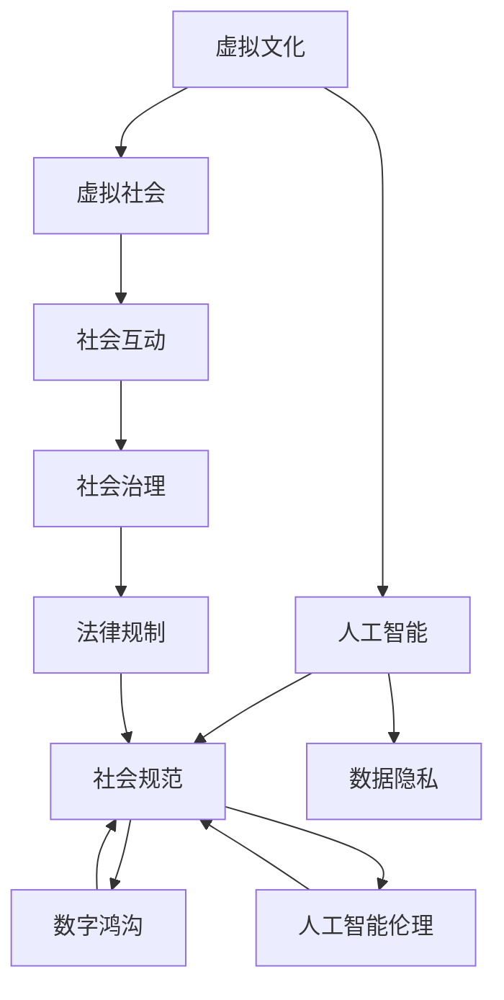

                 

# 虚拟文化：AI塑造的新型社会规范

## 1. 背景介绍

### 1.1 问题由来
随着人工智能技术的飞速发展，尤其是深度学习和大数据技术的应用，虚拟文化（Virtual Culture）逐渐成为新的社会现象。虚拟文化不仅仅是科技公司的商业策略，更是社会变革的重要驱动力量。虚拟文化通过虚拟现实、增强现实、游戏等技术，构建了一个数字化、智能化的虚拟社会空间，重塑了人们的交往方式、价值观和身份认同。

虚拟文化的兴起，一方面为社会带来了前所未有的便利和创新，但另一方面也引发了一系列社会伦理、隐私保护、数字鸿沟等问题。如何在享受虚拟文化带来的红利的同时，规避其潜在的风险，成为亟需解决的问题。

### 1.2 问题核心关键点
虚拟文化涉及的核心问题包括但不限于：

- 虚拟文化的定义与边界：如何界定虚拟文化和现实世界的分界线，确保虚拟社会空间的安全性和独立性？
- 社会规范的制定与遵守：如何在虚拟社会中制定合理的社会规范，保障用户权利与义务的平衡？
- 隐私保护与数据安全：如何保护用户在虚拟社会中的隐私数据，防止数据滥用和泄露？
- 数字鸿沟与公平性：如何确保不同社会群体在虚拟文化中享有平等的参与机会，避免加剧数字鸿沟？
- 人工智能伦理：如何在虚拟文化中合理应用人工智能技术，防止其被用于有害目的？

## 2. 核心概念与联系

### 2.1 核心概念概述

为更好地理解虚拟文化在AI技术驱动下如何塑造新的社会规范，本节将介绍几个密切相关的核心概念：

- 虚拟文化（Virtual Culture）：以虚拟现实、增强现实、游戏等技术为手段构建的数字社会空间，具备交互性、沉浸感和连通性。
- 人工智能（AI）：通过机器学习、深度学习等技术实现自主决策和任务执行的智能系统。
- 社会规范（Social Norms）：在虚拟文化中，指导个体和群体的行为准则，如礼仪、道德、法律等。
- 数据隐私（Data Privacy）：在虚拟文化中，保护个人数据不被滥用和泄露的权益。
- 数字鸿沟（Digital Divide）：不同社会群体在虚拟文化参与中的资源和能力差异。
- 人工智能伦理（AI Ethics）：在AI技术应用中，遵守的伦理准则和道德规范。

这些核心概念之间的逻辑关系可以通过以下Mermaid流程图来展示：



这个流程图展示了几者之间的相互影响：

1. 虚拟文化通过AI技术驱动，构建虚拟社会空间，促成社会互动和治理。
2. AI技术的应用需要遵守社会规范，确保数据隐私和安全，同时遵循伦理准则。
3. 数字鸿沟和人工智能伦理在虚拟文化中的应用，直接影响社会规范的制定和遵守。

## 3. 核心算法原理 & 具体操作步骤
### 3.1 算法原理概述

虚拟文化在AI技术的驱动下，通过虚拟现实、增强现实等技术，构建了一个沉浸式、互动性强的虚拟社会空间。AI技术，尤其是深度学习和大数据技术，使得虚拟社会中的内容创作、用户交互和治理变得高效和智能。

AI技术的核心原理是通过大量数据训练模型，使得模型能够自主学习和决策，从而实现各种复杂的任务。在虚拟文化中，AI技术主要用于：

- 自然语言处理（NLP）：实现用户与虚拟环境的对话交互，理解用户的意图和需求。
- 图像识别和处理：提供虚拟环境中的视觉体验，增强用户的沉浸感。
- 推荐系统：根据用户行为和偏好，个性化推荐内容，提升用户体验。
- 智能决策：在虚拟社会治理中，辅助制定决策，提升治理效率。

### 3.2 算法步骤详解

虚拟文化中AI技术的应用，一般包括以下几个关键步骤：

**Step 1: 数据收集与预处理**
- 收集虚拟环境中的用户行为数据，如点击、浏览、互动等行为记录。
- 对数据进行清洗和标注，去除噪声和不相关数据。
- 使用数据增强技术，扩充训练数据集，提高模型泛化能力。

**Step 2: 模型训练**
- 选择合适的算法和框架，如TensorFlow、PyTorch等。
- 设计合适的模型结构，如CNN、RNN、Transformer等。
- 使用训练集数据对模型进行训练，优化模型参数，提升模型精度和效率。

**Step 3: 模型部署与应用**
- 将训练好的模型部署到虚拟环境中，实现实时推理和响应。
- 使用测试集数据评估模型性能，确保模型稳定性和可靠性。
- 持续监控模型表现，根据用户反馈进行模型迭代和优化。

**Step 4: 治理与规范制定**
- 根据AI技术的应用情况，制定虚拟社会规范，确保用户行为合理。
- 建立数据隐私保护机制，确保用户数据安全。
- 制定伦理准则，规范AI技术的应用，防止其被用于有害目的。
- 制定法律规制，保障虚拟社会中的公平性和正义。

### 3.3 算法优缺点

AI在虚拟文化中的应用具有以下优点：
1. 提升效率：AI技术能够处理海量数据，实现高效的分析和决策，提升虚拟社会的运行效率。
2. 增强体验：AI技术能够提供个性化的内容推荐和智能交互，提升用户体验。
3. 提升治理：AI技术能够辅助虚拟社会的治理，提升决策的准确性和效率。

同时，也存在以下缺点：
1. 数据依赖：AI技术的应用依赖于高质量的数据，数据质量差会影响模型效果。
2. 隐私风险：AI技术需要大量数据训练，可能导致用户隐私泄露。
3. 公平性问题：AI技术的应用可能导致数字鸿沟，加剧社会不平等。
4. 伦理风险：AI技术的应用需要遵循伦理准则，防止其被用于有害目的。

## 4. 数学模型和公式 & 详细讲解 & 举例说明
### 4.1 数学模型构建

在虚拟文化中，AI技术的应用涉及多种数学模型，以下以自然语言处理（NLP）为例，介绍相关的数学模型和公式。

假设虚拟社会中的用户输入了一条文本消息，模型的任务是根据文本内容生成回复。我们可以使用Seq2Seq模型和Transformer模型来实现这一任务。Seq2Seq模型包括编码器和解码器两个部分，编码器将输入文本转换为序列表示，解码器则根据序列表示生成输出文本。

### 4.2 公式推导过程

以Transformer模型为例，其核心公式为：

$$
\text{Attention}(Q, K, V) = \text{Softmax}\left(\frac{QK^T}{\sqrt{d_k}}\right)V
$$

其中 $Q, K, V$ 分别为查询、键和值矩阵，$d_k$ 为键矩阵的维度。注意力机制的计算过程如下：

1. 计算查询矩阵 $Q$ 和键矩阵 $K$ 的点积，得到注意力分数矩阵 $QK^T$。
2. 对注意力分数矩阵进行softmax归一化，得到注意力权重矩阵。
3. 将注意力权重矩阵与值矩阵 $V$ 相乘，得到最终结果。

Transformer模型的目标函数为交叉熵损失函数：

$$
L(\theta) = -\sum_{i=1}^{N}\sum_{j=1}^{T}y_j\log p(y_j|x_i)
$$

其中 $x_i$ 为输入文本，$y_j$ 为输出文本中的第 $j$ 个词的标签，$p(y_j|x_i)$ 为模型在输入 $x_i$ 下预测 $y_j$ 的概率，$\theta$ 为模型参数。

### 4.3 案例分析与讲解

以虚拟社会中的智能客服系统为例，模型可以使用Transformer模型和Attention机制实现。智能客服系统的目标是根据用户输入的文本消息，生成最合适的回复。以下是一个简单的示例：

假设用户输入消息：“我想订一张北京到上海的机票”，模型需要输出回复：“好的，请问您的出发日期和返回日期是什么时候？”

首先，模型将输入文本编码为序列表示，使用Attention机制计算出每个词汇与其他词汇的相关度，并选择最重要的词汇作为注意力权重。然后，将注意力权重与预训练的语言模型参数进行权重调整，生成输出的文本序列。

## 5. 项目实践：代码实例和详细解释说明
### 5.1 开发环境搭建

要进行虚拟文化中的AI项目开发，需要搭建合适的开发环境。以下是Python环境下的示例：

1. 安装Anaconda：从官网下载并安装Anaconda，用于创建独立的Python环境。

2. 创建并激活虚拟环境：
```bash
conda create -n pytorch-env python=3.8 
conda activate pytorch-env
```

3. 安装PyTorch：根据CUDA版本，从官网获取对应的安装命令。例如：
```bash
conda install pytorch torchvision torchaudio cudatoolkit=11.1 -c pytorch -c conda-forge
```

4. 安装其他依赖包：
```bash
pip install numpy pandas scikit-learn
```

完成上述步骤后，即可在`pytorch-env`环境中开始开发。

### 5.2 源代码详细实现

以下是一个简单的虚拟社会智能客服系统的代码实现：

```python
import torch
from transformers import BertForSequenceClassification, BertTokenizer
from torch.utils.data import Dataset, DataLoader

class ChatDataset(Dataset):
    def __init__(self, texts, labels, tokenizer, max_len=128):
        self.texts = texts
        self.labels = labels
        self.tokenizer = tokenizer
        self.max_len = max_len
        
    def __len__(self):
        return len(self.texts)
    
    def __getitem__(self, item):
        text = self.texts[item]
        label = self.labels[item]
        
        encoding = self.tokenizer(text, return_tensors='pt', max_length=self.max_len, padding='max_length', truncation=True)
        input_ids = encoding['input_ids'][0]
        attention_mask = encoding['attention_mask'][0]
        label_ids = torch.tensor(label, dtype=torch.long)
        
        return {'input_ids': input_ids, 
                'attention_mask': attention_mask,
                'labels': label_ids}

# 数据加载和处理
tokenizer = BertTokenizer.from_pretrained('bert-base-cased')
train_dataset = ChatDataset(train_texts, train_labels, tokenizer)
dev_dataset = ChatDataset(dev_texts, dev_labels, tokenizer)
test_dataset = ChatDataset(test_texts, test_labels, tokenizer)

# 模型定义与训练
model = BertForSequenceClassification.from_pretrained('bert-base-cased', num_labels=2)
optimizer = torch.optim.AdamW(model.parameters(), lr=2e-5)

for epoch in range(epochs):
    train_loss = 0
    train_correct = 0
    for batch in DataLoader(train_dataset, batch_size=batch_size, shuffle=True):
        input_ids = batch['input_ids'].to(device)
        attention_mask = batch['attention_mask'].to(device)
        labels = batch['labels'].to(device)
        model.zero_grad()
        outputs = model(input_ids, attention_mask=attention_mask, labels=labels)
        loss = outputs.loss
        train_loss += loss.item()
        train_correct += torch.sum(outputs.logits.argmax(dim=1) == labels).item()
        loss.backward()
        optimizer.step()
    train_acc = train_correct / len(train_dataset)
    print(f"Epoch {epoch+1}, train loss: {train_loss/len(train_dataset):.3f}, train acc: {train_acc:.3f}")

# 测试与评估
test_loss = 0
test_correct = 0
for batch in DataLoader(test_dataset, batch_size=batch_size):
    input_ids = batch['input_ids'].to(device)
    attention_mask = batch['attention_mask'].to(device)
    labels = batch['labels'].to(device)
    with torch.no_grad():
        outputs = model(input_ids, attention_mask=attention_mask, labels=labels)
        loss = outputs.loss
        test_loss += loss.item()
        test_correct += torch.sum(outputs.logits.argmax(dim=1) == labels).item()
test_acc = test_correct / len(test_dataset)
print(f"Test acc: {test_acc:.3f}")
```

该代码实现了使用Bert模型进行虚拟社会智能客服系统的构建。通过上述代码，可以看到，虚拟社会的AI项目开发相对简单，只需要关注数据处理和模型训练。

### 5.3 代码解读与分析

让我们再详细解读一下关键代码的实现细节：

**ChatDataset类**：
- `__init__`方法：初始化文本、标签、分词器等组件。
- `__len__`方法：返回数据集的样本数量。
- `__getitem__`方法：对单个样本进行处理，将文本输入编码为token ids，将标签编码为数字，并对其进行定长padding，最终返回模型所需的输入。

**BertForSequenceClassification模型**：
- 使用Bert作为预训练模型，适用于序列分类任务，如智能客服系统的消息回复。

**训练函数**：
- 使用PyTorch的DataLoader对数据集进行批次化加载，供模型训练和推理使用。
- 在每个epoch内，在训练集上迭代训练，计算损失和准确率，并根据损失进行梯度更新。
- 在每个epoch结束时，在验证集上评估模型性能。

**测试与评估**：
- 在测试集上对模型进行测试，计算损失和准确率，评估模型性能。

通过上述代码，可以看到，虚拟社会的AI项目开发相对简单，只需要关注数据处理和模型训练。

## 6. 实际应用场景
### 6.1 智能客服系统

虚拟社会中的智能客服系统可以应用于各种业务场景，如电商平台、金融服务、公共服务等领域。通过智能客服系统，用户可以实时与虚拟客服进行交互，获取所需的帮助和信息。

在技术实现上，可以收集用户的历史咨询记录，提取用户问句和答复，作为监督数据。在监督数据的支持下，对预训练语言模型进行微调，使其能够理解用户意图，并生成合适的回复。

智能客服系统不仅提高了客户满意度，也大幅度降低了人力成本和响应时间。此外，智能客服系统还能收集用户反馈，不断优化模型性能。

### 6.2 虚拟现实体验

虚拟现实（VR）是虚拟社会的重要组成部分，通过AI技术，可以提供沉浸式、交互性强的虚拟体验。例如，虚拟现实游戏中的AI角色可以自动学习和决策，与玩家进行互动，增强游戏的沉浸感和趣味性。

在虚拟现实体验中，AI技术主要用于：
- 自然语言处理（NLP）：实现玩家与虚拟环境的对话交互，理解玩家的意图和需求。
- 行为预测：根据玩家的历史行为数据，预测其未来的行为，从而提供个性化的游戏体验。
- 智能决策：在虚拟环境中，辅助玩家做出决策，提升游戏体验。

### 6.3 在线教育

虚拟社会中的在线教育平台可以提供个性化的学习体验，通过AI技术，根据学生的学习情况和偏好，推荐适合的课程和学习资料，提升学习效果。

在在线教育中，AI技术主要用于：
- 学习路径推荐：根据学生的学习行为和成绩，推荐适合的课程和学习路径。
- 智能答疑：使用NLP技术，理解学生的问题，并提供相关的答案和解释。
- 学习效果评估：使用NLP技术，分析学生的学习效果，提供个性化的反馈和建议。

## 7. 工具和资源推荐
### 7.1 学习资源推荐

为了帮助开发者系统掌握虚拟文化中的AI技术，以下是一些优质的学习资源：

1. 《深度学习与人工智能》系列博文：由大模型技术专家撰写，深入浅出地介绍了深度学习、人工智能的基本概念和前沿技术。

2. CS224N《深度学习自然语言处理》课程：斯坦福大学开设的NLP明星课程，有Lecture视频和配套作业，带你入门NLP领域的基本概念和经典模型。

3. 《Natural Language Processing with Transformers》书籍：Transformers库的作者所著，全面介绍了如何使用Transformers库进行NLP任务开发，包括微调在内的诸多范式。

4. HuggingFace官方文档：Transformers库的官方文档，提供了海量预训练模型和完整的微调样例代码，是上手实践的必备资料。

5. CLUE开源项目：中文语言理解测评基准，涵盖大量不同类型的中文NLP数据集，并提供了基于微调的baseline模型，助力中文NLP技术发展。

通过对这些资源的学习实践，相信你一定能够快速掌握虚拟文化中的AI技术的精髓，并用于解决实际的NLP问题。
###  7.2 开发工具推荐

高效的开发离不开优秀的工具支持。以下是几款用于虚拟文化中的AI开发常用的工具：

1. PyTorch：基于Python的开源深度学习框架，灵活动态的计算图，适合快速迭代研究。大部分预训练语言模型都有PyTorch版本的实现。

2. TensorFlow：由Google主导开发的开源深度学习框架，生产部署方便，适合大规模工程应用。同样有丰富的预训练语言模型资源。

3. Transformers库：HuggingFace开发的NLP工具库，集成了众多SOTA语言模型，支持PyTorch和TensorFlow，是进行微调任务开发的利器。

4. Weights & Biases：模型训练的实验跟踪工具，可以记录和可视化模型训练过程中的各项指标，方便对比和调优。与主流深度学习框架无缝集成。

5. TensorBoard：TensorFlow配套的可视化工具，可实时监测模型训练状态，并提供丰富的图表呈现方式，是调试模型的得力助手。

6. Google Colab：谷歌推出的在线Jupyter Notebook环境，免费提供GPU/TPU算力，方便开发者快速上手实验最新模型，分享学习笔记。

合理利用这些工具，可以显著提升虚拟文化中的AI项目开发效率，加快创新迭代的步伐。

### 7.3 相关论文推荐

虚拟文化中的AI技术的发展源于学界的持续研究。以下是几篇奠基性的相关论文，推荐阅读：

1. Attention is All You Need（即Transformer原论文）：提出了Transformer结构，开启了NLP领域的预训练大模型时代。

2. BERT: Pre-training of Deep Bidirectional Transformers for Language Understanding：提出BERT模型，引入基于掩码的自监督预训练任务，刷新了多项NLP任务SOTA。

3. Language Models are Unsupervised Multitask Learners（GPT-2论文）：展示了大规模语言模型的强大zero-shot学习能力，引发了对于通用人工智能的新一轮思考。

4. Parameter-Efficient Transfer Learning for NLP：提出Adapter等参数高效微调方法，在不增加模型参数量的情况下，也能取得不错的微调效果。

5. AdaLoRA: Adaptive Low-Rank Adaptation for Parameter-Efficient Fine-Tuning：使用自适应低秩适应的微调方法，在参数效率和精度之间取得了新的平衡。

6. Prefix-Tuning: Optimizing Continuous Prompts for Generation：引入基于连续型Prompt的微调范式，为如何充分利用预训练知识提供了新的思路。

这些论文代表了大语言模型微调技术的发展脉络。通过学习这些前沿成果，可以帮助研究者把握学科前进方向，激发更多的创新灵感。

## 8. 总结：未来发展趋势与挑战
### 8.1 总结

本文对虚拟文化中AI技术的应用进行了全面系统的介绍。首先阐述了虚拟文化在AI技术驱动下如何构建数字社会空间，以及AI技术在虚拟社会中的应用原理。其次，详细讲解了AI技术在虚拟文化中的应用步骤，包括数据收集、模型训练、模型部署等。最后，本文还探讨了虚拟文化中AI技术的应用场景，以及未来的发展趋势和面临的挑战。

通过本文的系统梳理，可以看到，虚拟文化中的AI技术正在成为新的社会规范，极大地推动了社会的发展和变革。AI技术的应用不仅带来了便利和创新，也带来了新的伦理和隐私问题。未来，虚拟文化中的AI技术需要更多研究和实践，以确保其在社会中的应用安全和公正。

### 8.2 未来发展趋势

展望未来，虚拟文化中的AI技术将呈现以下几个发展趋势：

1. 融合多模态数据：虚拟文化中的AI技术将不仅仅局限于文本数据，还将融合图像、视频、语音等多模态数据，实现更全面的智能体验。
2. 强化学习的应用：虚拟文化中的AI技术将更多地应用强化学习，提升智能体在虚拟环境中的决策能力。
3. 更加注重伦理和隐私：虚拟文化中的AI技术将更加注重数据隐私和伦理问题，制定更加严格的数据使用规则和伦理准则。
4. 分布式计算与边缘计算：为了提升AI模型的推理速度和实时性，虚拟文化中的AI技术将更多地应用分布式计算和边缘计算技术。
5. 深度学习模型的解释性：虚拟文化中的AI技术将更加注重模型的解释性和透明性，便于用户理解和使用。

这些趋势凸显了虚拟文化中的AI技术的前景和潜力，预示着未来将会有更多创新和突破。

### 8.3 面临的挑战

尽管虚拟文化中的AI技术已经取得了一定的成就，但在迈向更加智能化、普适化应用的过程中，仍面临诸多挑战：

1. 数据隐私和安全：虚拟文化中的AI技术需要处理大量用户数据，如何保护用户隐私、防止数据泄露是关键问题。
2. 伦理和公平性：虚拟文化中的AI技术需要遵循伦理准则，确保模型不会加剧社会不平等，保护弱势群体的利益。
3. 算力资源限制：大规模模型的推理和训练需要高算力支持，如何降低计算成本、提升推理效率是重要问题。
4. 技术复杂度：虚拟文化中的AI技术需要处理多模态数据、强化学习等复杂问题，需要更高的技术门槛和研究能力。
5. 用户接受度：虚拟文化中的AI技术需要获得用户信任，提升用户接受度和使用意愿。

这些挑战需要各界共同努力，通过技术创新、伦理规范、政策引导等手段，逐步克服。

### 8.4 研究展望

面对虚拟文化中的AI技术所面临的挑战，未来的研究需要在以下几个方面寻求新的突破：

1. 数据隐私保护技术：研究更高效的数据加密、去标识化、差分隐私等技术，保护用户隐私数据。
2. 伦理准则制定：制定虚拟文化中AI技术应用的伦理准则，确保技术的公正性和透明性。
3. 多模态融合技术：研究多模态数据融合技术，提升AI模型在虚拟环境中的感知和推理能力。
4. 强化学习应用：研究强化学习在虚拟环境中的应用，提升智能体在虚拟环境中的决策能力。
5. 可解释性技术：研究AI模型的可解释性技术，提升用户对AI技术的信任和接受度。

这些研究方向将引领虚拟文化中的AI技术不断进步，为构建安全、可靠、可解释的智能社会奠定基础。

## 9. 附录：常见问题与解答

**Q1：虚拟文化中的AI技术是否适用于所有应用场景？**

A: 虚拟文化中的AI技术适用于大部分应用场景，尤其是需要高交互性、沉浸式体验的场景。例如，虚拟现实游戏、在线教育、智能客服等。但对于一些需要物理感知、操作能力的场景，如手术机器人、工业自动化等，AI技术仍需结合硬件设备进行融合应用。

**Q2：AI技术在虚拟文化中的应用是否有伦理风险？**

A: AI技术在虚拟文化中的应用确实存在伦理风险。例如，AI生成的内容可能包含虚假信息、误导性内容，甚至引发社会动荡。此外，AI技术的应用也可能加剧社会不平等，导致虚拟社会中的资源分配不均。因此，制定合理的伦理准则和监管机制是必要的。

**Q3：如何保护虚拟文化中的用户数据隐私？**

A: 保护用户数据隐私是虚拟文化中的AI技术应用的重要问题。以下是一些保护措施：
1. 数据加密：使用加密技术保护用户数据，防止数据泄露。
2. 去标识化：将用户数据进行去标识化处理，保护用户隐私。
3. 差分隐私：在数据处理过程中加入噪声，保护用户隐私，同时保证数据可用性。
4. 数据访问控制：限制数据访问权限，确保只有授权人员才能访问敏感数据。

**Q4：虚拟文化中的AI技术如何实现多模态融合？**

A: 多模态融合是虚拟文化中AI技术的重要研究方向。以下是一些实现方法：
1. 数据融合：将不同模态的数据进行融合，提升模型感知和推理能力。
2. 协同训练：将不同模态的模型联合训练，提升模型在多模态数据上的表现。
3. 特征对齐：将不同模态的特征进行对齐，提高模型的融合效果。

这些方法需要综合运用，才能实现多模态数据的有效融合。

**Q5：虚拟文化中的AI技术如何提升模型解释性？**

A: 提升模型解释性是虚拟文化中AI技术的重要研究方向。以下是一些实现方法：
1. 可视化技术：使用可视化技术展示模型推理过程和决策依据。
2. 可解释性模型：研究可解释性模型，提高模型的透明性和可理解性。
3. 用户交互：通过用户交互，引导模型输出解释性内容，提升用户对AI技术的信任。

这些方法需要结合实际应用场景，综合运用，才能提升模型的解释性。

---

作者：禅与计算机程序设计艺术 / Zen and the Art of Computer Programming

