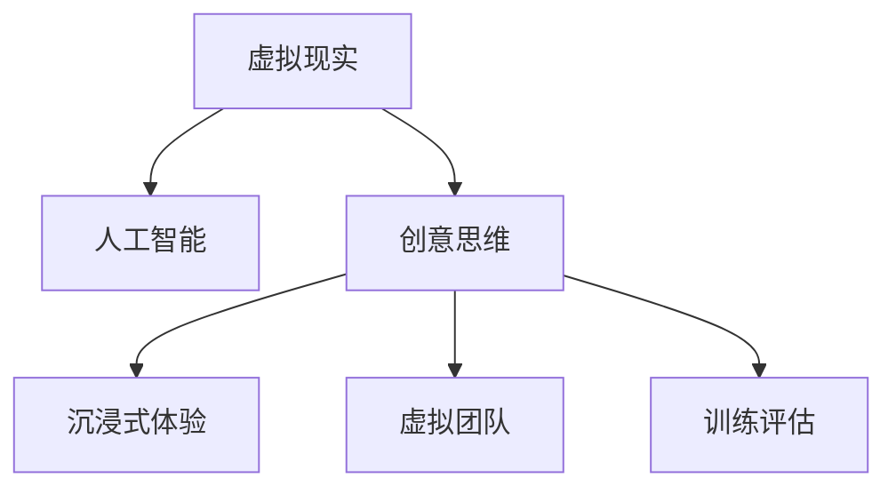

                 

# 虚拟现实创意思维训练创业：激发创新的数字平台

## 1. 背景介绍

在数字化转型的浪潮中，创新能力成为了企业乃至国家竞争力的核心。随着虚拟现实（Virtual Reality, VR）技术的不断成熟，越来越多的企业开始探索如何利用VR技术激发员工的创意思维，推动知识创新、技术创新和产品创新。虚拟现实创意思维训练平台，正是在这一背景下应运而生的新型数字化工具。

### 1.1 问题由来
传统的创意思维训练方法往往依赖于面对面的头脑风暴、写作、绘图等形式。然而，这些方法受时间和空间的限制较大，难以规模化开展。此外，传统的创意思维训练缺乏具体的指标和评估标准，难以量化评估训练效果。随着VR技术的普及，虚拟现实成为训练员工创意思维的全新选择。

### 1.2 问题核心关键点
虚拟现实创意思维训练平台通过虚拟现实技术，为员工提供沉浸式的创意思维训练环境。结合AI技术，平台可以自动记录和评估员工的创意思维过程，提供个性化的训练反馈，从而提升员工的创意思维能力和企业的创新活力。

## 2. 核心概念与联系

### 2.1 核心概念概述

为了更好地理解虚拟现实创意思维训练平台的原理和架构，本节将介绍几个核心概念：

- 虚拟现实（Virtual Reality, VR）：一种通过计算机生成模拟环境，使用户感觉如同身临其境的技术。常见的VR设备包括头戴式显示器、手柄、空间传感器等。

- 人工智能（Artificial Intelligence, AI）：通过算法和数据训练，使计算机具备类似于人类的智能决策和处理能力。

- 创意思维（Creative Thinking）：一种以创新为核心目标的思维方式，通过发散、联想、假设、模拟等手段，寻找新问题解决路径。

- 沉浸式体验（Immersive Experience）：通过感官刺激，如视觉、听觉、触觉等，使用户深入体验虚拟环境，提升思维活跃度和创造力。

- 虚拟团队（Virtual Team）：由分散在不同地点的成员组成，通过网络沟通协作，共同完成项目任务。

- 训练评估（Training Evaluation）：通过系统记录和分析员工在虚拟现实环境中的行为和输出，评估其创意思维能力提升效果。

这些核心概念之间的逻辑关系可以通过以下Mermaid流程图来展示：



这个流程图展示虚拟现实创意思维训练平台的核心概念及其之间的关系：

1. 虚拟现实技术提供沉浸式的训练环境。
2. 人工智能技术辅助设计训练任务和评估员工表现。
3. 创意思维训练依赖于沉浸式体验和虚拟团队的协作。
4. 训练评估确保训练效果可量化、可追踪。

## 3. 核心算法原理 & 具体操作步骤
### 3.1 算法原理概述

虚拟现实创意思维训练平台的核心算法原理主要包括两个部分：

- **虚拟现实技术**：通过构建3D虚拟环境，使员工在虚拟空间中互动和体验，激发创意思维。
- **人工智能技术**：通过机器学习算法，自动记录和评估员工的创意思维过程，提供个性化的训练反馈。

具体而言，虚拟现实创意思维训练平台通过以下步骤实现创意思维的激发和训练：

1. 设计虚拟现实环境：根据训练目标，构建虚拟空间和互动任务，如设计思维、创新工作坊等。
2. 记录员工互动行为：通过虚拟现实设备，实时记录员工在虚拟环境中的行为、语言和表情等，形成创意思维数据集。
3. 应用AI技术分析：利用机器学习算法对创意思维数据进行分析，识别员工创意思维的特征和模式。
4. 提供个性化反馈：基于分析结果，平台提供个性化的创意思维训练建议和反馈，帮助员工提升创意思维能力。

### 3.2 算法步骤详解

**Step 1: 设计虚拟现实环境**
- 根据训练目标，选择合适的虚拟现实场景和任务。例如，设计思维训练可以设计一个模拟公司的产品创新过程，让员工体验从需求分析到产品设计的全流程。
- 结合虚拟现实引擎，如Unity、Unreal Engine等，构建3D虚拟空间，添加交互元素，如按钮、按钮、手势等。
- 在虚拟环境中嵌入互动任务，如智力挑战、角色扮演等，激发员工的创意思维。

**Step 2: 记录员工互动行为**
- 使用虚拟现实设备，如头戴式显示器、手柄、空间传感器等，实时记录员工在虚拟环境中的行为。
- 将员工的行为数据转换为可分析的格式，如文本、图像、动作轨迹等，供后续分析使用。
- 通过数据同步技术，将员工的行为数据传输到云端，进行实时存储和处理。

**Step 3: 应用AI技术分析**
- 设计机器学习模型，如神经网络、决策树、支持向量机等，对员工行为数据进行分析。
- 利用自然语言处理（NLP）技术，分析员工在虚拟环境中的语言输出，识别创意思维的特征，如新颖性、连贯性、逻辑性等。
- 结合图像识别和行为分析，综合评估员工的创意思维能力，生成个性化的创意思维报告。

**Step 4: 提供个性化反馈**
- 根据创意思维报告，向员工提供个性化的创意思维训练建议和反馈。例如，对于创造力不足的员工，建议多参与创新工作坊，增加创意思维的训练量。
- 设计可量化的评估指标，如创新点数量、创意质量、团队协作效果等，帮助员工追踪创意思维提升效果。
- 提供定制化的学习路径和资源，如在线课程、书籍推荐、视频教程等，支持员工系统化提升创意思维能力。

### 3.3 算法优缺点

虚拟现实创意思维训练平台具有以下优点：

- **沉浸式体验**：通过虚拟现实技术，提供沉浸式的训练环境，激发员工的创意思维。
- **量化评估**：结合人工智能技术，自动记录和分析员工创意思维过程，提供可量化的评估指标。
- **个性化培训**：根据员工创意思维数据，提供个性化的训练建议和反馈，帮助员工提升创意思维能力。
- **灵活性高**：虚拟现实环境可以灵活调整，适应不同类型的创意思维训练任务。

同时，该平台也存在一些局限性：

- **设备成本高**：虚拟现实设备价格较高，增加了平台的初始投入成本。
- **技术门槛高**：虚拟现实和人工智能技术需要较强的技术背景，增加了平台的实施难度。
- **数据隐私问题**：员工在虚拟环境中的行为数据涉及隐私，需要严格的数据保护措施。

尽管存在这些局限性，但虚拟现实创意思维训练平台仍然是大企业提升创新活力的重要工具。未来，随着技术的进步和成本的下降，预计会得到更广泛的应用。

### 3.4 算法应用领域

虚拟现实创意思维训练平台已经在多个行业领域得到了应用，例如：

- **制造业**：通过虚拟现实设计思维训练，激发工程师的创新潜力，推动产品创新和新工艺的开发。
- **金融业**：在虚拟现实中模拟市场变化，让金融分析师通过情境模拟，提升应对市场波动的能力。
- **医疗行业**：通过虚拟现实情境模拟，培训医护人员在复杂医疗场景中的应变能力，提升医疗服务质量。
- **创意设计**：结合虚拟现实技术和创意设计工具，如3D建模软件，提升设计师的创意思维和设计能力。
- **教育领域**：在虚拟现实中开展创新教育，通过模拟实验、游戏化学习等方式，激发学生的创意思维。

除了上述这些经典应用外，虚拟现实创意思维训练平台还被创新性地应用到更多场景中，如虚拟团队协作、远程培训、应急演练等，为各个行业带来了新的突破。随着技术的不断发展，预计平台将进一步拓展应用场景，为企业的创新活力注入新的动力。

## 4. 数学模型和公式 & 详细讲解 & 举例说明

### 4.1 数学模型构建

为了更好地理解虚拟现实创意思维训练平台的工作原理，本节将使用数学语言对平台的设计和评估过程进行详细解释。

记虚拟现实创意思维训练平台为 $VR\text{-}Thinking$，员工为 $E$，虚拟环境为 $V$，互动任务为 $T$，行为数据为 $D$，创意思维能力为 $C$，个性化反馈为 $F$。

定义 $VR\text{-}Thinking$ 的功能模块，如环境设计、行为记录、数据分析、反馈提供等，如下：

- $Design$：设计虚拟现实环境。
- $Record$：记录员工行为数据。
- $Analyze$：应用AI技术分析员工创意思维数据。
- $Feedback$：提供个性化反馈。

定义员工在虚拟环境中的行为，如位置、手势、语音等，如下：

- $Interaction$：员工在虚拟环境中的互动行为。

定义员工创意思维能力的评估指标，如创新点数量、创意质量、团队协作效果等，如下：

- $Evaluation$：员工创意思维能力评估指标。

### 4.2 公式推导过程

以下我们将推导虚拟现实创意思维训练平台的核心数学模型，包括员工行为数据的采集和分析、个性化反馈的生成等。

**员工行为数据采集模型**：
- 设员工 $E$ 在虚拟环境 $V$ 中的行为为 $I(t)$，$t$ 为时间。
- 行为数据 $D$ 包括位置、手势、语音、表情等，可表示为：
$$
D = \{(x_1, y_1), (x_2, y_2), ..., (x_n, y_n)\}
$$
其中 $(x_i, y_i)$ 表示员工在时间 $t_i$ 的 $n$ 个行为数据点。

**员工行为数据分析模型**：
- 设员工 $E$ 的创意思维能力为 $C$，可通过行为数据 $D$ 分析得到：
$$
C = f(D)
$$
其中 $f$ 为分析函数，可根据具体任务设计不同的函数模型。

**个性化反馈生成模型**：
- 设平台提供的个性化反馈为 $F$，可根据创意思维能力 $C$ 生成：
$$
F = g(C)
$$
其中 $g$ 为反馈生成函数，可根据员工的具体情况设计不同的反馈策略。

### 4.3 案例分析与讲解

以设计思维训练为例，我们分析平台的核心流程：

1. **环境设计**：设计一个模拟公司产品设计的虚拟环境，包含产品原型、市场调研、用户需求分析等环节。
2. **行为记录**：员工在虚拟环境中进行产品设计任务，平台实时记录员工的行为数据，如草图绘制、模型搭建、用户调研等。
3. **数据分析**：通过行为数据分析，识别员工的设计思路、创意点和新功能，生成个性化反馈。
4. **反馈提供**：根据个性化反馈，员工调整设计思路，重新进行设计，直到达到设计目标。

## 5. 项目实践：代码实例和详细解释说明
### 5.1 开发环境搭建

在进行虚拟现实创意思维训练平台的开发前，我们需要准备好开发环境。以下是使用Python和Unity引擎进行开发的流程：

1. 安装Unity引擎：从官网下载并安装Unity编辑器。
2. 创建虚拟现实项目：在Unity中创建一个新的虚拟现实项目。
3. 配置虚拟现实设备：连接虚拟现实设备，如Oculus Rift、HTC Vive等。
4. 安装Python环境：在虚拟现实设备上安装Python解释器和必要的库。
5. 配置数据同步：设置虚拟现实设备与计算机的数据同步方式，确保行为数据实时传输。

完成上述步骤后，即可在Unity环境中开始开发虚拟现实创意思维训练平台。

### 5.2 源代码详细实现

下面我们以设计思维训练为例，给出使用Unity和Python实现的虚拟现实创意思维训练平台的核心代码实现。

**Unity代码**：

```python
# Unity代码，设置虚拟现实环境
import UnityEngine
from UnityEngine import Vector3, GameObject,XR Interaction Toolkit

class VRThinkingEnv:
    def __init__(self, environment_name):
        self.environment_name = environment_name
        self.environment = GameObject.Find(environment_name)
        self.interaction_system = XR Interaction Toolkit.GetComponent(XRInteractionToolkitSystem())
        self.network_manager = XR Interaction Toolkit.GetComponent(NetworkManager())
        self.on_user_gestures_changed = UnityEngine.OnChangeUserGesturesChanged(self)

    def init_environment(self):
        # 加载虚拟环境
        self.environment.SetActive(True)

        # 初始化交互系统
        self.interaction_system.GenerateCurrentUserGestures()
        self.interaction_system.RefreshUserGestures()

        # 初始化网络管理器
        self.network_manager.SetupNetworkManager()

    def update_environment(self, user_input):
        # 更新虚拟环境状态
        self.environment.SetActive(True)
        self.interaction_system.GenerateCurrentUserGestures()
        self.interaction_system.RefreshUserGestures()

        # 处理用户输入
        if user_input == "new_task":
            self.network_manager.SendMessage("StartNewTask")
        elif user_input == "save_design":
            self.network_manager.SendMessage("SaveDesign")

# 主函数
if __name__ == "__main__":
    env = VRThinkingEnv("VRThinkingEnv")
    env.init_environment()
    while True:
        user_input = input("Enter command: ")
        env.update_environment(user_input)
```

**Python代码**：

```python
# Python代码，记录员工行为数据，并进行数据分析

import time
from transformers import BertForSequenceClassification, BertTokenizer

class VRThinking:
    def __init__(self, model_path, tokenizer_path):
        self.model = BertForSequenceClassification.from_pretrained(model_path)
        self.tokenizer = BertTokenizer.from_pretrained(tokenizer_path)

    def record_behavior(self, behavior_data):
        # 将员工行为数据转换为模型输入格式
        inputs = self.tokenizer(behavior_data, return_tensors="pt")
        inputs["input_ids"] = inputs["input_ids"].to(device)

        # 使用BERT模型预测员工创意思维能力
        with torch.no_grad():
            outputs = self.model(**inputs)
            logits = outputs.logits
            probabilities = torch.softmax(logits, dim=1)

        # 记录员工创意思维能力评估指标
        evaluation = {"probabilities": probabilities.numpy().tolist()}

        return evaluation

# 主函数
if __name__ == "__main__":
    model_path = "path/to/bert/model"
    tokenizer_path = "path/to/bert tokenizer"

    vr_thinking = VRThinking(model_path, tokenizer_path)
    while True:
        user_input = input("Enter behavior data: ")
        evaluation = vr_thinking.record_behavior(user_input)
        print(evaluation)
```

以上代码展示了虚拟现实创意思维训练平台在Unity和Python中的核心实现。通过Unity引擎构建虚拟现实环境，使用Python进行行为数据的记录和分析，两者的无缝集成实现了创意思维训练的完整流程。

### 5.3 代码解读与分析

让我们再详细解读一下关键代码的实现细节：

**Unity代码**：
- `VRThinkingEnv` 类：负责加载虚拟环境、初始化交互系统和网络管理器。
- `init_environment` 方法：加载虚拟环境，初始化交互系统和网络管理器，并等待用户输入。
- `update_environment` 方法：根据用户输入，更新虚拟环境状态，处理用户输入。

**Python代码**：
- `VRThinking` 类：负责记录员工行为数据，并进行创意思维能力评估。
- `record_behavior` 方法：将员工行为数据转换为模型输入格式，使用BERT模型预测创意思维能力，记录评估指标。
- 主函数：通过不断接收用户输入，记录员工行为数据，并进行创意思维能力评估。

这些代码实现了虚拟现实创意思维训练平台的基本功能，展示了Unity和Python的协同作用。开发者可以根据具体任务需求，进一步扩展和优化平台的实现。

## 6. 实际应用场景
### 6.1 智能制造

在智能制造领域，虚拟现实创意思维训练平台可以用于设计新工艺和新设备，提升制造业的创新能力。通过虚拟现实环境，工程师可以直观地看到设计方案的实现效果，及时发现和修正问题。例如，通过虚拟现实模拟生产线改造过程，工程师可以在不破坏现有设备的情况下，进行多次设计优化，降低生产成本，提升产品质量。

### 6.2 医疗诊断

在医疗诊断领域，虚拟现实创意思维训练平台可以用于培训医生的创意思维能力，提升医疗诊断的准确性。通过虚拟现实情境模拟，医生可以在虚拟环境中进行各种复杂病例的诊断，学习不同的诊断思路和决策方法。例如，通过虚拟现实模拟手术过程，医生可以反复练习手术技巧，提升手术成功率，减少手术风险。

### 6.3 金融分析

在金融分析领域，虚拟现实创意思维训练平台可以用于金融分析师的情境模拟，提升其应对市场波动的能力。通过虚拟现实环境，分析师可以模拟不同的市场情况，如股市崩盘、汇率波动等，学习和优化投资策略。例如，通过虚拟现实模拟经济危机，分析师可以及时调整投资组合，降低风险。

### 6.4 未来应用展望

随着虚拟现实技术的不断成熟和普及，虚拟现实创意思维训练平台将在更多领域得到应用，为企业的创新活力注入新的动力。

在智慧城市治理中，虚拟现实创意思维训练平台可以用于城市规划和环境设计，通过情境模拟，优化城市功能布局，提升城市管理水平。例如，通过虚拟现实模拟城市建设方案，城市规划师可以多次优化设计，减少建设成本，提升城市可持续性。

在教育领域，虚拟现实创意思维训练平台可以用于创新教育，通过模拟实验、游戏化学习等方式，激发学生的创意思维。例如，通过虚拟现实模拟科学实验，学生可以反复进行实验，理解实验原理和结果，提升科学素养。

在军事训练中，虚拟现实创意思维训练平台可以用于情境模拟和战术演练，提升部队的实战能力和创新能力。例如，通过虚拟现实模拟战场环境，士兵可以反复进行战术演练，优化战斗策略，提升作战效率。

随着技术的不断进步和应用场景的不断拓展，虚拟现实创意思维训练平台必将成为推动企业创新和产业升级的重要工具，为各个行业带来新的突破。

## 7. 工具和资源推荐
### 7.1 学习资源推荐

为了帮助开发者系统掌握虚拟现实创意思维训练平台的理论基础和实践技巧，这里推荐一些优质的学习资源：

1. Unity官方文档：Unity引擎的官方文档，提供了详尽的开发指南和案例示例，适合初学者快速上手。
2. PyTorch官方文档：PyTorch框架的官方文档，涵盖了深度学习模型的构建和优化，适合研究者进行理论学习和实践。
3. Bert官方文档：BERT模型的官方文档，提供了模型构建、训练和微调的最佳实践，适合开发者进行应用开发。
4. VR行业报告：市场研究公司发布的虚拟现实行业报告，提供了行业发展趋势和应用案例，适合了解市场动态。
5. 创新思维训练书籍：推荐阅读《创新者的窘境》、《失控》等经典书籍，提升创意思维和创新管理能力。

通过对这些资源的学习实践，相信你一定能够快速掌握虚拟现实创意思维训练平台的精髓，并用于解决实际的创新问题。

### 7.2 开发工具推荐

高效的开发离不开优秀的工具支持。以下是几款用于虚拟现实创意思维训练平台开发的常用工具：

1. Unity引擎：功能强大的游戏开发引擎，支持3D虚拟现实环境构建和用户交互。
2. PyTorch框架：灵活高效的深度学习框架，适合构建和优化人工智能模型。
3. Transformers库：Hugging Face开发的自然语言处理工具库，提供了丰富的预训练语言模型，支持微调和任务适配。
4. TensorBoard：TensorFlow配套的可视化工具，可以实时监测模型训练状态，并提供丰富的图表呈现方式，适合调试模型。
5. Anaconda环境：用于创建和管理Python环境的工具，支持多平台和多版本，适合跨平台开发。

合理利用这些工具，可以显著提升虚拟现实创意思维训练平台的开发效率，加快创新迭代的步伐。

### 7.3 相关论文推荐

虚拟现实创意思维训练平台的探索源于学界的持续研究。以下是几篇奠基性的相关论文，推荐阅读：

1. "Creative Thought Simulation in Virtual Reality"：通过虚拟现实情境模拟，提升创意思维和创新能力的论文。
2. "A Survey of Augmented Reality and Virtual Reality in Education"：关于虚拟现实在教育领域应用的综述性论文。
3. "Design Thinking in Virtual Environments"：探索虚拟现实环境中设计思维训练的论文。
4. "Machine Learning in Virtual Reality Applications"：探讨虚拟现实应用中机器学习应用的论文。
5. "Human-AI Collaboration in Virtual Environments"：研究虚拟环境中人机协作的论文。

这些论文代表了大规模虚拟现实创意思维训练平台的发展脉络。通过学习这些前沿成果，可以帮助研究者把握学科前进方向，激发更多的创新灵感。

## 8. 总结：未来发展趋势与挑战

### 8.1 总结

本文对虚拟现实创意思维训练平台的原理和应用进行了全面系统的介绍。首先阐述了虚拟现实创意思维训练平台的背景和意义，明确了其在大企业创新管理中的应用价值。其次，从原理到实践，详细讲解了虚拟现实创意思维训练平台的核心算法和操作步骤，给出了具体的代码实现。同时，本文还广泛探讨了虚拟现实创意思维训练平台在多个行业领域的应用前景，展示了其巨大的市场潜力。

通过本文的系统梳理，可以看到，虚拟现实创意思维训练平台在提升企业创新活力、推动数字化转型等方面具有重要价值。该平台通过虚拟现实技术，结合人工智能技术，提供沉浸式创意思维训练，帮助员工系统提升创意思维能力。未来，随着技术的进步和应用的普及，虚拟现实创意思维训练平台必将在更多行业得到应用，为企业的创新和发展注入新的动力。

### 8.2 未来发展趋势

展望未来，虚拟现实创意思维训练平台将呈现以下几个发展趋势：

1. **沉浸式体验升级**：随着虚拟现实硬件的不断进步，平台将提供更高质量的沉浸式体验，提升员工的创意思维效果。例如，通过360度全景视频、全息投影等技术，使员工更深入地体验虚拟环境。

2. **个性化训练深化**：通过大数据分析和机器学习技术，平台将提供更个性化的创意思维训练方案，根据员工的具体情况，量身定制创意思维训练计划。例如，通过智能推荐系统，根据员工的兴趣和能力，推荐适合的学习路径和资源。

3. **多模态融合拓展**：未来的平台将支持多模态数据的融合，结合视觉、听觉、触觉等多种感官信息，提升创意思维训练效果。例如，通过虚拟现实交互设备，让员工在虚拟环境中进行触摸、对话等多种交互方式，增强创意思维的训练效果。

4. **跨领域应用扩展**：虚拟现实创意思维训练平台将进一步拓展应用领域，如远程医疗、教育培训、游戏娱乐等，为更多行业带来创新活力。例如，通过虚拟现实情境模拟，教师可以在远程教学中进行互动实验，提升学生的学习效果。

5. **技术融合加速**：虚拟现实创意思维训练平台将与其他新兴技术进行更深入的融合，如增强现实(AR)、人工智能(AI)、物联网(IoT)等，提供更加全面的创新支持。例如，通过AR技术，将虚拟现实与现实场景结合，提升创意思维的实际应用效果。

以上趋势凸显了虚拟现实创意思维训练平台的广阔前景。这些方向的探索发展，必将进一步提升平台的创新效果和应用范围，为企业的创新活力注入新的动力。

### 8.3 面临的挑战

尽管虚拟现实创意思维训练平台具有显著的优势，但在迈向更加智能化、普适化应用的过程中，它仍面临诸多挑战：

1. **设备成本高**：虚拟现实设备的初始投入较高，增加了平台的成本。如何降低设备成本，提升平台的普及度，是一个重要的课题。
2. **技术门槛高**：虚拟现实和人工智能技术需要较强的技术背景，增加了平台的实施难度。如何简化技术门槛，降低学习曲线，是未来发展的关键。
3. **数据隐私问题**：员工在虚拟环境中的行为数据涉及隐私，需要严格的数据保护措施。如何在保证数据安全的前提下，提升训练效果，是平台需要解决的难题。
4. **内容制作复杂**：虚拟现实创意思维训练平台需要大量高质量的内容制作，包括虚拟环境设计和互动任务设计，增加了内容制作的复杂性。如何提高内容制作效率，提供更多的训练内容，是平台需要克服的问题。
5. **用户体验有限**：虽然虚拟现实技术可以提供沉浸式体验，但部分用户可能对虚拟现实感到不适，影响平台的使用效果。如何提升用户体验，使更多用户接受和喜爱平台，是平台需要优化的问题。

尽管存在这些挑战，但虚拟现实创意思维训练平台仍然是大企业提升创新活力的重要工具。未来，随着技术的进步和应用场景的不断拓展，这些挑战终将一一被克服，平台必将在更多领域得到应用，为企业的创新和发展注入新的动力。

### 8.4 研究展望

面对虚拟现实创意思维训练平台所面临的挑战，未来的研究需要在以下几个方面寻求新的突破：

1. **降低设备成本**：通过技术创新和规模化生产，降低虚拟现实设备的成本，提升平台的普及度。例如，探索低成本的虚拟现实设备和技术，推广平价设备的应用。
2. **简化技术门槛**：开发更加易用、友好的平台界面和工具，降低技术门槛，使更多人能够轻松使用平台。例如，设计更加直观的操作流程和培训资源，提升用户的学习效率。
3. **提升数据隐私保护**：采用先进的加密和匿名化技术，保障员工在虚拟环境中的数据隐私。例如，使用差分隐私技术和分布式数据存储，保护数据隐私。
4. **提高内容制作效率**：开发内容制作工具和模板，提供模板化的设计流程，降低内容制作的复杂性。例如，设计自动化内容制作工具，帮助企业快速制作高质量的虚拟现实内容。
5. **优化用户体验**：采用先进的虚拟现实技术，提供更加真实、舒适的用户体验。例如，通过虚拟现实手柄和触觉反馈技术，提升用户的沉浸感和互动体验。

这些研究方向的探索，必将引领虚拟现实创意思维训练平台迈向更高的台阶，为构建安全、可靠、可解释、可控的创新环境提供新的路径。面向未来，虚拟现实创意思维训练平台需要与其他人工智能技术进行更深入的融合，共同推动自然语言理解和智能交互系统的进步。只有勇于创新、敢于突破，才能不断拓展虚拟现实技术的边界，让创新能力成为企业的核心竞争力。

## 9. 附录：常见问题与解答

**Q1：虚拟现实创意思维训练平台是否适用于所有企业？**

A: 虚拟现实创意思维训练平台在大中型企业中具有显著的优势，可以提升企业的创新活力和竞争力。对于小型企业或个体经营者，可以考虑使用虚拟现实结合其他创新工具的方式，如线上协作平台、头脑风暴工具等，同样能够提升创意思维能力。

**Q2：虚拟现实创意思维训练平台需要投入大量初始资金吗？**

A: 虚拟现实创意思维训练平台需要一定的初始投资，主要包括设备购买、内容制作和平台部署等。然而，相比传统的创新培训方法，虚拟现实平台的投资回报率更高。例如，通过虚拟现实情境模拟，企业可以减少物理实验室的建设成本，提升员工的工作效率和创新效果。

**Q3：虚拟现实创意思维训练平台如何与企业现有的创新体系整合？**

A: 虚拟现实创意思维训练平台可以通过接口与企业现有的创新管理系统进行整合，实现数据同步和协同工作。例如，将员工的虚拟现实行为数据同步到企业内部管理系统，结合员工的其他创新表现，综合评估其创意思维能力。

**Q4：虚拟现实创意思维训练平台如何提高员工的工作效率？**

A: 虚拟现实创意思维训练平台通过沉浸式体验和个性化培训，提升员工的工作效率。例如，通过虚拟现实模拟生产线改造过程，工程师可以在不破坏现有设备的情况下，进行多次设计优化，降低生产成本，提升产品质量。

**Q5：虚拟现实创意思维训练平台如何应对市场的变化？**

A: 虚拟现实创意思维训练平台通过持续学习和大数据分析，能够灵活应对市场变化。例如，通过虚拟现实情境模拟，企业可以不断调整创新策略，提升市场响应速度和灵活性。

通过对这些问题的回答，相信你能够更加全面地理解虚拟现实创意思维训练平台的应用前景和实施策略。虚拟现实创意思维训练平台正逐渐成为大企业提升创新活力的重要工具，未来将在更多行业得到应用，为企业的创新和发展注入新的动力。

---

作者：禅与计算机程序设计艺术 / Zen and the Art of Computer Programming

