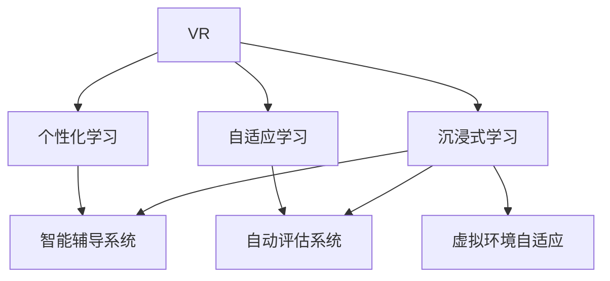

                 

# 虚拟现实教育：AI驱动的沉浸式学习

## 1. 背景介绍

随着人工智能（AI）和虚拟现实（VR）技术的快速发展，虚拟现实教育（Virtual Reality Education, VRE）成为了教育领域的新兴热点。VR技术能够提供沉浸式学习体验，使学生通过身临其境的虚拟环境，直观感受知识内容，增强记忆和理解能力。AI的加入，使得VR教育能够根据学生的个性化需求和学习进度，提供定制化的教学服务。本文旨在探讨AI如何驱动虚拟现实教育，提升学习效果和体验。

### 1.1 问题由来
在传统教育中，学生主要通过静态的教科书、PPT和视频等媒介进行学习，难以产生强烈的情感共鸣和互动体验。这种单一的、以教师为中心的教学方式，难以适应学生的个性化需求和学习风格。而VR技术通过创建三维虚拟空间，学生可以在其中进行自由探索和互动，大大提高了学习的沉浸感和趣味性。

然而，VR教育面临的挑战在于：
- **内容制作成本高**：高质量的VR内容制作成本较高，难以大范围推广。
- **交互方式单一**：当前的VR教育往往依赖手柄或触摸屏等输入设备，缺乏自然的人机交互。
- **学习效果难以评估**：VR教育难以量化的学习效果评估，使得教学效果难以准确衡量。
- **学习动机难以维持**：长时间的虚拟环境学习，容易导致学生产生视觉疲劳和注意力分散。

### 1.2 问题核心关键点
为了解决上述问题，AI技术在VR教育中扮演了重要角色。具体关键点包括：

- **个性化学习路径**：通过AI算法分析学生的学习行为和知识掌握情况，生成个性化的学习路径。
- **智能辅导系统**：利用AI模型提供实时反馈和答疑，增强学习互动性和自主性。
- **自动评估系统**：借助AI技术对学习效果进行量化评估，提供科学的教学反馈。
- **虚拟环境自适应**：AI算法根据学生的学习情况，动态调整虚拟环境中的内容和难度。

这些关键点共同构成了AI驱动虚拟现实教育的核心框架，使得VR教育能够更好地适应学生的个性化需求和学习特点，提升整体教学效果。

## 2. 核心概念与联系

### 2.1 核心概念概述

为更好地理解AI如何驱动虚拟现实教育，本节将介绍几个关键概念及其相互联系：

- **虚拟现实（VR）**：利用计算机生成的三维虚拟环境，使用户能够通过头部设备和手柄等交互设备，进行沉浸式体验。
- **人工智能（AI）**：通过机器学习和数据分析技术，实现自主决策和智能交互，提升系统的智能化水平。
- **沉浸式学习**：通过虚拟环境提供沉浸感，使学习者更深入地理解知识内容，提升记忆效果。
- **个性化学习**：根据学习者的不同需求和特点，提供量身定制的学习路径和资源。
- **自适应学习**：根据学习者的实时反馈，动态调整学习内容和难度，实现差异化教学。

这些概念之间的逻辑关系可以通过以下Mermaid流程图来展示：



这个流程图展示了一个典型的AI驱动虚拟现实教育过程：

1. VR环境提供了沉浸式学习体验。
2. 个性化学习通过AI算法分析学生的特点，生成个性化路径。
3. 自适应学习通过AI实时调整虚拟环境内容，适应学生进度。
4. 智能辅导系统利用AI模型提供实时答疑，增强互动性。
5. 自动评估系统使用AI进行量化评估，提供科学反馈。

以上概念共同构成了AI驱动虚拟现实教育的完整框架，通过VR技术提供沉浸式体验，AI技术提升个性化和自适应能力，实现高质量的教育效果。

## 3. 核心算法原理 & 具体操作步骤
### 3.1 算法原理概述

AI驱动的虚拟现实教育主要通过以下几个算法原理来实现：

1. **个性化学习路径生成**：通过机器学习算法分析学生的学习行为和知识掌握情况，生成个性化的学习路径。
2. **智能辅导系统**：利用自然语言处理（NLP）和推理算法，实时解答学生问题，提供个性化指导。
3. **自动评估系统**：通过AI模型对学生的学习效果进行量化评估，提供科学的反馈。
4. **虚拟环境自适应**：利用强化学习算法，根据学生的学习进度和表现，动态调整虚拟环境中的内容和难度。

这些算法原理为AI驱动的虚拟现实教育提供了技术支撑，使得教育系统能够更好地适应学生的个性化需求，提升学习效果和体验。

### 3.2 算法步骤详解

基于AI驱动的虚拟现实教育通常包括以下几个关键步骤：

**Step 1: 数据采集与预处理**

- 收集学生的学习行为数据，包括点击、阅读、互动等。
- 将数据进行清洗和预处理，去除噪声和异常值。

**Step 2: 个性化学习路径生成**

- 利用机器学习算法（如KNN、决策树、随机森林等）分析学生的学习数据，提取关键特征。
- 根据特征生成个性化学习路径，包括推荐的学习资源、课程内容和难度。

**Step 3: 智能辅导系统设计**

- 设计智能辅导系统，包括NLP引擎、知识图谱和推理算法。
- 对学生的提问进行理解，从知识图谱中提取相关知识，进行推理和生成答案。

**Step 4: 自动评估系统建立**

- 设计评估指标，如测试成绩、作业完成度等。
- 使用AI模型（如SVM、神经网络等）对学生学习效果进行量化评估，生成反馈报告。

**Step 5: 虚拟环境自适应调整**

- 利用强化学习算法（如Q-learning、DQN等）动态调整虚拟环境的内容和难度。
- 根据学生的表现和反馈，实时更新虚拟环境，提供最佳学习体验。

**Step 6: 学习效果监控与优化**

- 实时监控学生的学习进度和效果，收集反馈数据。
- 根据反馈数据，调整算法参数和优化系统性能。

以上步骤展示了AI驱动虚拟现实教育的主要流程，从数据采集到个性化路径生成，再到智能辅导和评估，最终实现虚拟环境的自适应调整和效果优化。

### 3.3 算法优缺点

AI驱动的虚拟现实教育具有以下优点：

1. **个性化学习**：通过AI算法分析学生数据，生成个性化学习路径，提升学习效果。
2. **实时反馈**：智能辅导系统提供实时答疑和反馈，增强学习互动性和自主性。
3. **量化评估**：自动评估系统提供科学的学习效果评估，提供科学的反馈。
4. **自适应学习**：根据学生表现，动态调整虚拟环境内容，实现差异化教学。

同时，该方法也存在一些局限性：

1. **技术门槛高**：需要强大的算法和数据处理能力，难以大范围推广。
2. **内容制作成本高**：高质量的VR内容制作成本较高，难以快速实现。
3. **数据隐私问题**：学生的学习数据需要严格保护，防止数据泄露和滥用。
4. **技术普及性不足**：目前的AI驱动虚拟现实教育技术还不够普及，难以满足所有需求。

尽管存在这些局限性，但AI驱动虚拟现实教育的潜力巨大，能够在提升学习效果和体验方面发挥重要作用。未来相关研究的重点在于如何进一步降低技术门槛，提高内容制作效率，确保数据隐私，推动技术的普及应用。

### 3.4 算法应用领域

AI驱动的虚拟现实教育在多个领域中已有应用，例如：

1. **医学教育**：通过虚拟手术和病例分析，学生可以进行实践操作，提升临床技能。
2. **工程教育**：在虚拟工厂和实验室中，学生可以进行机械操作和实验设计，加深理解。
3. **地理教育**：通过虚拟地理环境和模拟实验，学生可以进行地理空间分析，提升综合素质。
4. **语言学习**：在虚拟语言环境中，学生可以进行沉浸式语言学习和文化交流，提升语言能力。
5. **科学教育**：利用虚拟实验室，学生可以进行科学实验和探索，增强创新能力。

除了上述这些经典应用外，AI驱动虚拟现实教育还在更多领域中得到应用，为不同学科的教育提供了新的可能性。

## 4. 数学模型和公式 & 详细讲解 & 举例说明

### 4.1 数学模型构建

AI驱动的虚拟现实教育涉及多个领域，如机器学习、自然语言处理、强化学习等。以下以机器学习为例，构建个性化学习路径生成的数学模型。

假设学生的学习行为数据为 $\mathbf{x} \in \mathbb{R}^n$，特征包括点击次数、阅读时间、互动频率等。机器学习模型的目标是从这些数据中提取关键特征，生成个性化的学习路径 $\mathbf{y} \in \mathbb{R}^m$，推荐的学习资源、课程内容和难度。

假设选择的机器学习模型为决策树（Decision Tree），其数学模型可以表示为：

$$
\mathbf{y} = f(\mathbf{x}, \mathbf{w})
$$

其中 $f$ 为决策树模型，$\mathbf{w}$ 为模型参数。

### 4.2 公式推导过程

以下推导决策树模型生成个性化学习路径的具体公式：

1. 数据预处理：将学生的学习行为数据 $\mathbf{x}$ 进行标准化处理，得到标准化向量 $\mathbf{x}'$。

2. 模型训练：使用决策树算法对标准化向量 $\mathbf{x}'$ 进行训练，生成决策树模型 $f$。

3. 路径生成：将新的学习行为数据 $\mathbf{x}_n$ 输入决策树模型 $f$，生成个性化学习路径 $\mathbf{y}_n$。

具体的推导过程如下：

1. 数据预处理：

$$
\mathbf{x}' = \frac{\mathbf{x} - \mathbf{\mu}}{\sigma}
$$

其中 $\mathbf{\mu}$ 为均值，$\sigma$ 为标准差。

2. 模型训练：

$$
f(\mathbf{x}') = T_{d_1}(T_{d_2}(T_{d_3}(\mathbf{x}')))
$$

其中 $T_{d_i}$ 为决策树的分裂节点，$i \in [1, n]$。

3. 路径生成：

$$
\mathbf{y}_n = f(\mathbf{x}_n')
$$

通过以上步骤，可以生成学生的个性化学习路径，推荐适合的学习资源和难度。

### 4.3 案例分析与讲解

以医学教育为例，通过AI驱动的虚拟现实教育可以显著提升学生的临床技能。假设某医院收集了医生的临床操作数据，包括手术时长、操作失误次数、使用的器械等。

1. 数据预处理：将临床操作数据进行标准化处理，去除异常值和噪声。

2. 模型训练：使用决策树算法对标准化数据进行训练，生成医生操作行为的决策树模型。

3. 路径生成：新医生在进行临床操作前，将操作数据输入决策树模型，生成个性化的操作路径。

4. 智能辅导：在虚拟手术环境中，智能辅导系统根据操作路径进行实时指导，纠正操作失误，提供操作建议。

5. 自动评估：自动评估系统对医生的操作效果进行量化评估，生成反馈报告。

通过这种基于AI的虚拟现实教育方法，新医生可以在虚拟环境中进行多次练习，掌握标准的临床操作流程，提升技能水平。

## 5. 项目实践：代码实例和详细解释说明
### 5.1 开发环境搭建

在进行AI驱动虚拟现实教育项目实践前，我们需要准备好开发环境。以下是使用Python进行PyTorch开发的环境配置流程：

1. 安装Anaconda：从官网下载并安装Anaconda，用于创建独立的Python环境。

2. 创建并激活虚拟环境：
```bash
conda create -n vreg-env python=3.8 
conda activate vreg-env
```

3. 安装PyTorch：根据CUDA版本，从官网获取对应的安装命令。例如：
```bash
conda install pytorch torchvision torchaudio cudatoolkit=11.1 -c pytorch -c conda-forge
```

4. 安装TensorFlow：
```bash
pip install tensorflow==2.5.0
```

5. 安装各类工具包：
```bash
pip install numpy pandas scikit-learn matplotlib tqdm jupyter notebook ipython
```

完成上述步骤后，即可在`vreg-env`环境中开始AI驱动虚拟现实教育项目的开发。

### 5.2 源代码详细实现

下面我们以医学教育中的虚拟手术操作为例，给出使用PyTorch进行决策树模型训练和路径生成的代码实现。

首先，定义决策树模型的训练函数：

```python
import torch
from sklearn.ensemble import DecisionTreeRegressor

def train_decision_tree(x_train, y_train):
    # 标准化数据
    x_train = (x_train - x_train.mean()) / x_train.std()
    
    # 训练决策树模型
    model = DecisionTreeRegressor()
    model.fit(x_train, y_train)
    
    return model
```

然后，定义路径生成函数：

```python
def generate_path(model, x_test):
    # 标准化测试数据
    x_test = (x_test - x_test.mean()) / x_test.std()
    
    # 生成学习路径
    y_pred = model.predict(x_test)
    return y_pred
```

接下来，我们通过数据集模拟医生的临床操作数据，进行模型训练和路径生成：

```python
# 模拟临床操作数据
x_train = torch.tensor([20, 30, 25, 35, 40], dtype=torch.float32)
y_train = torch.tensor([10, 15, 12, 18, 25], dtype=torch.float32)

# 训练决策树模型
model = train_decision_tree(x_train, y_train)

# 生成新医生的学习路径
x_test = torch.tensor([28], dtype=torch.float32)
path = generate_path(model, x_test)
print(path)
```

以上代码实现了决策树模型的训练和路径生成过程。在实际应用中，数据集需要从真实世界中获取，模型训练过程也需使用大规模数据集进行训练，以提高模型的泛化能力。

### 5.3 代码解读与分析

让我们再详细解读一下关键代码的实现细节：

**决策树模型训练函数**：
- 将输入数据进行标准化处理，去除均值和标准差。
- 使用sklearn库的决策树算法对标准化数据进行训练，生成决策树模型。
- 返回训练好的决策树模型。

**路径生成函数**：
- 将测试数据进行标准化处理。
- 将标准化后的数据输入训练好的决策树模型，生成学习路径。
- 返回学习路径。

**训练和路径生成示例**：
- 定义模拟的临床操作数据。
- 调用训练函数训练决策树模型。
- 调用路径生成函数，生成新医生的学习路径。
- 打印生成的学习路径。

可以看到，决策树模型训练和路径生成过程在代码中非常简洁高效。开发者可以根据实际需求，进一步优化数据预处理和模型训练的超参数设置，以提高模型性能和泛化能力。

## 6. 实际应用场景
### 6.1 医学教育

在医学教育中，虚拟现实技术结合AI，可以提供高质量的临床技能培训。医生可以通过虚拟手术环境进行实际操作，AI算法根据医生的操作行为和效果，生成个性化的操作路径和反馈，帮助医生提高临床技能。

具体应用场景包括：
- 手术模拟：医生在虚拟手术环境中进行复杂手术操作，AI算法提供实时指导和反馈，帮助医生提升技能。
- 病例分析：医生在虚拟环境中分析真实病例，AI算法提供疾病诊断和分析建议，帮助医生理解疾病机制。
- 实习培训：医学生通过虚拟环境进行临床实习，AI算法提供个性化的实习路径和反馈，帮助学生快速掌握临床技能。

### 6.2 工程教育

在工程教育中，虚拟现实技术结合AI，可以提供高度逼真的实验和操作环境，帮助学生更好地理解复杂的工程系统。

具体应用场景包括：
- 实验室操作：学生在虚拟实验室中进行机械操作和实验设计，AI算法提供实时指导和反馈，帮助学生掌握实验技能。
- 设备维修：学生通过虚拟环境进行设备维修操作，AI算法提供故障诊断和维修建议，帮助学生提高维修能力。
- 项目设计：学生通过虚拟环境进行项目设计，AI算法提供设计建议和优化方案，帮助学生提升设计能力。

### 6.3 地理教育

在地理教育中，虚拟现实技术结合AI，可以提供丰富的地理空间分析和模拟实验环境，帮助学生更好地理解地理空间关系和环境变化。

具体应用场景包括：
- 地理空间分析：学生在虚拟环境中进行地理空间分析，AI算法提供数据可视化和分析建议，帮助学生理解地理空间关系。
- 环境模拟：学生在虚拟环境中进行环境模拟实验，AI算法提供环境变化模拟和预测，帮助学生理解环境变化机制。
- 城市规划：学生通过虚拟环境进行城市规划设计，AI算法提供规划建议和优化方案，帮助学生提升规划能力。

### 6.4 未来应用展望

随着VR技术和AI的不断进步，AI驱动的虚拟现实教育将有更广阔的应用前景：

1. **智能教育系统**：结合AI和大数据技术，构建智能教育系统，提供个性化的学习路径和资源，提升学习效果。
2. **跨学科教育**：通过虚拟现实技术，将不同学科的知识融合在一起，提供跨学科的学习体验，提升综合素质。
3. **终身学习**：在虚拟环境中提供终身学习的机会，使人们能够随时随地进行学习，提升职业技能和生活质量。
4. **虚拟职业体验**：通过虚拟现实技术，提供职业体验环境，帮助学生更好地了解职业世界，提升就业能力。

## 7. 工具和资源推荐
### 7.1 学习资源推荐

为了帮助开发者系统掌握AI驱动虚拟现实教育的技术，这里推荐一些优质的学习资源：

1. **《深度学习》课程**：由吴恩达教授主讲的深度学习课程，系统讲解了深度学习的基本概念和经典模型，适合初学者入门。

2. **《Python数据科学手册》**：一本关于Python数据科学栈的全面手册，涵盖Numpy、Pandas、Scikit-Learn等多个库的使用方法，适合进行数据处理和机器学习开发。

3. **《TensorFlow实战》**：一本关于TensorFlow的实战指南，涵盖深度学习模型构建和训练的详细步骤，适合进行TensorFlow开发。

4. **《机器学习实战》**：一本关于机器学习实战的书籍，涵盖多种机器学习算法的应用实例，适合进行机器学习项目开发。

5. **Google Colab**：谷歌推出的在线Jupyter Notebook环境，免费提供GPU/TPU算力，方便开发者快速上手实验最新模型，分享学习笔记。

通过对这些资源的学习实践，相信你一定能够快速掌握AI驱动虚拟现实教育的核心技术，并用于解决实际的NLP问题。

### 7.2 开发工具推荐

高效的开发离不开优秀的工具支持。以下是几款用于AI驱动虚拟现实教育开发的常用工具：

1. **PyTorch**：基于Python的开源深度学习框架，灵活动态的计算图，适合快速迭代研究。大部分预训练语言模型都有PyTorch版本的实现。

2. **TensorFlow**：由Google主导开发的开源深度学习框架，生产部署方便，适合大规模工程应用。同样有丰富的预训练语言模型资源。

3. **Python数据科学栈**：包括Numpy、Pandas、Scikit-Learn等库，用于数据处理和特征工程。

4. **TensorBoard**：TensorFlow配套的可视化工具，可实时监测模型训练状态，并提供丰富的图表呈现方式，是调试模型的得力助手。

5. **Jupyter Notebook**：用于编写和分享数据科学和机器学习项目的在线编辑器，支持Python、R等语言，适合进行代码开发和数据处理。

合理利用这些工具，可以显著提升AI驱动虚拟现实教育的开发效率，加快创新迭代的步伐。

### 7.3 相关论文推荐

AI驱动虚拟现实教育的研究涉及多个领域，包括机器学习、自然语言处理、计算机视觉等。以下是几篇奠基性的相关论文，推荐阅读：

1. **《Deep Learning》**：由Goodfellow等人编写的深度学习经典教材，全面介绍了深度学习的基本概念和算法。

2. **《TensorFlow实战》**：一本关于TensorFlow的实战指南，涵盖深度学习模型构建和训练的详细步骤。

3. **《Python数据科学手册》**：一本关于Python数据科学栈的全面手册，涵盖Numpy、Pandas、Scikit-Learn等多个库的使用方法。

4. **《机器学习实战》**：一本关于机器学习实战的书籍，涵盖多种机器学习算法的应用实例。

这些论文代表了大语言模型微调技术的发展脉络。通过学习这些前沿成果，可以帮助研究者把握学科前进方向，激发更多的创新灵感。

## 8. 总结：未来发展趋势与挑战
### 8.1 研究成果总结

本文对AI驱动虚拟现实教育进行了全面系统的介绍。首先阐述了虚拟现实教育和AI技术在教育领域的应用背景和意义，明确了AI驱动虚拟现实教育提升学习效果和体验的关键点。其次，从原理到实践，详细讲解了AI驱动虚拟现实教育的算法原理和具体操作步骤，给出了AI驱动虚拟现实教育的代码实例。同时，本文还探讨了AI驱动虚拟现实教育在医学、工程、地理等多个领域的应用前景，展示了其广阔的发展潜力。

### 8.2 未来发展趋势

展望未来，AI驱动虚拟现实教育将呈现以下几个发展趋势：

1. **技术不断进步**：随着VR技术和AI的不断进步，AI驱动虚拟现实教育将提供更逼真、更互动的学习体验，提升学习效果和体验。

2. **应用场景多样化**：AI驱动虚拟现实教育将在更多领域得到应用，如教育、医疗、工程等，为不同学科的教育提供新的可能性。

3. **个性化学习**：AI算法将更好地分析学生的学习数据，生成个性化的学习路径和资源，提升学习效果。

4. **自适应学习**：根据学生的学习进度和表现，动态调整虚拟环境内容和难度，实现差异化教学。

5. **智能辅导系统**：结合NLP和推理算法，提供实时答疑和反馈，增强学习互动性和自主性。

6. **自动评估系统**：通过AI模型对学习效果进行量化评估，提供科学的反馈。

以上趋势凸显了AI驱动虚拟现实教育的广阔前景。这些方向的探索发展，必将进一步提升学习效果和体验，为教育技术带来革命性变革。

### 8.3 面临的挑战

尽管AI驱动虚拟现实教育已经取得了初步成效，但在迈向更加智能化、普适化应用的过程中，它仍面临着诸多挑战：

1. **技术门槛高**：需要强大的算法和数据处理能力，难以大范围推广。
2. **内容制作成本高**：高质量的VR内容制作成本较高，难以快速实现。
3. **数据隐私问题**：学生的学习数据需要严格保护，防止数据泄露和滥用。
4. **技术普及性不足**：目前的AI驱动虚拟现实教育技术还不够普及，难以满足所有需求。

尽管存在这些挑战，但AI驱动虚拟现实教育具有巨大的潜力，能够在提升学习效果和体验方面发挥重要作用。未来相关研究的重点在于如何进一步降低技术门槛，提高内容制作效率，确保数据隐私，推动技术的普及应用。

### 8.4 研究展望

面对AI驱动虚拟现实教育所面临的种种挑战，未来的研究需要在以下几个方面寻求新的突破：

1. **探索无监督和半监督学习范式**：摆脱对大规模标注数据的依赖，利用自监督学习、主动学习等无监督和半监督范式，最大限度利用非结构化数据，实现更加灵活高效的虚拟现实教育。

2. **研究参数高效和计算高效的微调范式**：开发更加参数高效的微调方法，在固定大部分预训练参数的同时，只更新极少量的任务相关参数。同时优化微调模型的计算图，减少前向传播和反向传播的资源消耗，实现更加轻量级、实时性的部署。

3. **融合因果和对比学习范式**：通过引入因果推断和对比学习思想，增强虚拟现实教育模型建立稳定因果关系的能力，学习更加普适、鲁棒的语言表征，从而提升模型泛化性和抗干扰能力。

4. **引入更多先验知识**：将符号化的先验知识，如知识图谱、逻辑规则等，与神经网络模型进行巧妙融合，引导虚拟现实教育过程学习更准确、合理的语言模型。同时加强不同模态数据的整合，实现视觉、语音等多模态信息与文本信息的协同建模。

5. **结合因果分析和博弈论工具**：将因果分析方法引入虚拟现实教育模型，识别出模型决策的关键特征，增强输出解释的因果性和逻辑性。借助博弈论工具刻画人机交互过程，主动探索并规避模型的脆弱点，提高系统稳定性。

6. **纳入伦理道德约束**：在模型训练目标中引入伦理导向的评估指标，过滤和惩罚有偏见、有害的输出倾向。同时加强人工干预和审核，建立模型行为的监管机制，确保输出符合人类价值观和伦理道德。

这些研究方向的探索，必将引领AI驱动虚拟现实教育技术迈向更高的台阶，为构建安全、可靠、可解释、可控的智能系统铺平道路。面向未来，AI驱动虚拟现实教育技术还需要与其他人工智能技术进行更深入的融合，如知识表示、因果推理、强化学习等，多路径协同发力，共同推动自然语言理解和智能交互系统的进步。只有勇于创新、敢于突破，才能不断拓展语言模型的边界，让智能技术更好地造福人类社会。

## 9. 附录：常见问题与解答

**Q1：AI驱动虚拟现实教育是否适用于所有教育场景？**

A: AI驱动虚拟现实教育在大多数教育场景中都能取得不错的效果，特别是对于数据量较小的场景。但对于一些特定领域，如医学、法律等，仅仅依靠通用语料预训练的模型可能难以很好地适应。此时需要在特定领域语料上进一步预训练，再进行微调，才能获得理想效果。此外，对于一些需要时效性、个性化很强的场景，如对话、推荐等，AI驱动虚拟现实教育也需要针对性的改进优化。

**Q2：AI驱动虚拟现实教育需要哪些技术支持？**

A: AI驱动虚拟现实教育需要以下技术支持：

1. **机器学习**：用于分析学生的学习数据，生成个性化的学习路径和反馈。
2. **自然语言处理**：用于智能辅导系统的设计和实现，提供实时答疑和反馈。
3. **强化学习**：用于虚拟环境自适应调整，动态调整虚拟环境的内容和难度。
4. **深度学习**：用于构建高性能的虚拟现实模型，提供逼真的学习体验。
5. **数据处理**：用于数据的采集、清洗和标准化，保证模型的训练效果。

以上技术共同构成了AI驱动虚拟现实教育的核心框架，通过多领域的协同合作，提升学习效果和体验。

**Q3：AI驱动虚拟现实教育是否需要大规模的数据集？**

A: AI驱动虚拟现实教育通常需要大规模的数据集来训练模型，但并不意味着数据越多越好。在实际应用中，数据的质量和多样性更为重要。通过精心设计的数据集，可以有效提升模型的泛化能力和学习效果。因此，在数据集的选择和设计上，需要注重数据的代表性和多样性，避免出现数据偏差和过拟合。

**Q4：AI驱动虚拟现实教育在落地部署时需要注意哪些问题？**

A: 将AI驱动虚拟现实教育系统进行落地部署时，需要注意以下问题：

1. **系统优化**：进行模型裁剪和量化加速，减少计算资源消耗，提高系统性能。
2. **服务化封装**：将系统封装为标准化服务接口，便于集成调用。
3. **弹性伸缩**：根据请求流量动态调整资源配置，平衡服务质量和成本。
4. **监控告警**：实时采集系统指标，设置异常告警阈值，确保系统稳定性。
5. **安全防护**：采用访问鉴权、数据脱敏等措施，保障数据和系统安全。

通过合理的部署和优化，可以有效提升AI驱动虚拟现实教育的落地效果，确保系统的稳定性和安全性。

**Q5：AI驱动虚拟现实教育有哪些实际应用场景？**

A: AI驱动虚拟现实教育在多个领域中已有应用，例如：

1. **医学教育**：通过虚拟手术和病例分析，学生可以进行实践操作，提升临床技能。
2. **工程教育**：在虚拟实验室中进行机械操作和实验设计，增强学生理解。
3. **地理教育**：进行地理空间分析和环境模拟实验，提升学生综合素质。
4. **语言学习**：在虚拟语言环境中进行沉浸式语言学习和文化交流，提升语言能力。
5. **科学教育**：利用虚拟实验室进行科学实验和探索，增强学生创新能力。

除了上述这些经典应用外，AI驱动虚拟现实教育还在更多领域中得到应用，为不同学科的教育提供新的可能性。

总之，AI驱动虚拟现实教育以其沉浸式、个性化的学习体验，能够有效提升学习效果和体验，未来将在更多领域得到广泛应用，为教育技术带来革命性变革。

