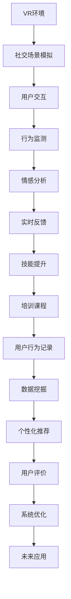

                 

# 虚拟现实社交技能训练创业：数字环境下的人际交往提升

> 关键词：虚拟现实(VR), 社交技能培训, 人机交互, 人工智能(AI), 行为分析, 远程协作

## 1. 背景介绍

### 1.1 问题由来

随着技术的飞速发展，虚拟现实（Virtual Reality, VR）正逐步从游戏、娱乐等领域扩展到教育、医疗、商业等众多行业。然而，VR技术在教育领域的应用面临诸多挑战。特别是在社交技能培训方面，传统的教室教学和面对面交流难以完全复制到虚拟环境中。这不仅限制了VR技术的发展，也影响了其广泛的普及和应用。

在数字化的今天，人际交往技能的重要性愈发凸显。然而，随着远程工作、在线教育等数字环境的应用普及，人们越来越依赖数字工具进行沟通交流，传统的面对面交流技巧正在逐渐衰退。此外，数字环境中的沟通障碍、情绪管理和冲突解决等挑战也层出不穷。因此，亟需开发一款基于VR技术的社交技能培训系统，帮助用户在数字环境下提升人际交往能力。

### 1.2 问题核心关键点

该系统的核心问题可以概括为以下几点：
1. 如何通过虚拟现实技术模拟真实社交场景，提升用户的沟通技巧和社交能力？
2. 如何设计合理的培训课程，引导用户逐步掌握不同的社交技能？
3. 如何在虚拟环境中实时监测用户行为，给予有针对性的反馈和指导？
4. 如何实现虚拟环境与真实环境的无缝对接，实现技能迁移？
5. 如何设计可扩展的培训体系，适应不同用户的需求？

这些问题不仅涉及VR技术的开发和应用，还涵盖了心理学、教育学等多学科的理论基础和实践方法。本文将系统介绍基于VR技术的社交技能培训系统的核心概念、关键技术、实施步骤和未来展望。

## 2. 核心概念与联系

### 2.1 核心概念概述

1. **虚拟现实(VR)技术**：通过计算机生成的模拟环境，使用户感觉自己置身于一个完全沉浸式的三维虚拟环境中。VR技术在教育、医疗、娱乐等领域有广泛应用。

2. **社交技能培训**：通过一系列的训练课程和实战演练，帮助用户提升沟通技巧、情绪管理、冲突解决等社交能力。

3. **人机交互(Human-Computer Interaction, HCI)**：研究如何让计算机更好地理解人类行为，提升用户体验。HCI技术是VR社交技能培训系统中的核心部分。

4. **人工智能(AI)**：包括机器学习、自然语言处理等技术，用于模拟真实社交场景、实时监测用户行为、给予个性化反馈等。

5. **行为分析(Behavior Analysis)**：通过分析用户的行为数据，评估其社交技能的提升效果，并进行有针对性的调整和优化。

6. **远程协作(Online Collaboration)**：利用虚拟现实和人工智能技术，实现用户间的远程协作和交流，提升其社交能力。

### 2.2 核心概念原理和架构的 Mermaid 流程图(Mermaid 流程节点中不要有括号、逗号等特殊字符)



## 3. 核心算法原理 & 具体操作步骤

### 3.1 算法原理概述

基于VR技术的社交技能培训系统，通过模拟真实社交场景，使用户能够在虚拟环境中进行社交实践和反馈，逐步提升其社交技能。系统架构主要包括以下几个关键模块：

1. **场景模拟模块**：根据用户的培训目标，设计相应的虚拟社交场景，如商务会议、团队协作、社交聚会等。
2. **用户交互模块**：使用VR设备模拟真实的互动体验，如手势控制、语音交互等，让用户感觉仿佛置身于真实的社交环境中。
3. **行为监测模块**：实时监测用户的行为数据，包括表情、语调、姿态等，评估其社交能力。
4. **情感分析模块**：利用自然语言处理技术，分析用户的情感状态，提供情感管理的建议。
5. **实时反馈模块**：根据行为监测和情感分析结果，给予用户有针对性的反馈和指导。
6. **技能提升模块**：根据用户的学习进度和反馈，调整培训课程的难度和内容，实现个性化的技能提升。

### 3.2 算法步骤详解

**Step 1: 准备培训场景**
1. 收集并标注多个真实社交场景的视频和音频数据，如商务会议、团队协作、社交聚会等。
2. 根据用户的培训目标，筛选合适的场景数据，设计虚拟环境的布局和交互方式。
3. 利用VR技术，将场景数据转化为虚拟环境，并加入适当的交互元素，如手势控制、语音交互等。

**Step 2: 用户交互与行为监测**
1. 用户进入虚拟环境，根据培训场景进行互动和交流。
2. 实时监测用户的行为数据，包括表情、语调、姿态等，记录其社交行为和决策过程。
3. 利用传感器和摄像头捕捉用户的行为数据，传输到系统进行分析和处理。

**Step 3: 情感分析与实时反馈**
1. 分析用户的语音和表情数据，识别其情感状态，如紧张、兴奋、失落等。
2. 根据情感状态，给予用户有针对性的反馈和建议，帮助其调整情感状态。
3. 根据情感状态和社交行为，评估用户的社交能力，并给予个性化反馈。

**Step 4: 技能提升与课程调整**
1. 根据用户的反馈和行为数据，评估其社交技能的提升效果。
2. 根据评估结果，调整培训课程的难度和内容，提升用户的学习体验。
3. 提供个性化的技能提升建议，如情绪管理、冲突解决等，帮助用户更好地应对复杂的社交环境。

**Step 5: 系统优化与未来应用**
1. 根据用户反馈和行为数据，持续优化系统算法和界面设计，提升用户体验。
2. 结合最新的AI技术和VR硬件，不断提升系统的性能和功能。
3. 探索VR社交技能培训系统在其他领域的应用，如医疗、企业培训等，实现技能的跨领域迁移。

### 3.3 算法优缺点

基于VR技术的社交技能培训系统具有以下优点：
1. 沉浸式体验：通过模拟真实社交场景，提升用户的沉浸感和参与感，帮助其更好地理解和掌握社交技能。
2. 个性化培训：根据用户的反馈和行为数据，提供个性化的培训建议和反馈，提升培训效果。
3. 实时监测与反馈：实时监测用户的行为和情感状态，给予及时反馈和指导，提升培训效果。
4. 跨领域应用：结合VR技术和人工智能技术，广泛应用于教育、医疗、企业培训等不同领域，实现技能迁移。

然而，该系统也存在一些缺点：
1. 设备成本高：VR设备和高性能计算机的成本较高，限制了系统的推广和普及。
2. 学习曲线陡峭：用户需要一定的时间熟悉VR设备和系统界面，增加了培训难度。
3. 技术依赖性高：系统的性能和功能高度依赖于VR技术和AI算法，技术升级和维护成本较高。
4. 虚拟环境与真实环境的差距：虚拟环境难以完全模拟真实社交场景，可能存在差距和局限。

### 3.4 算法应用领域

基于VR技术的社交技能培训系统可以应用于以下几个领域：

1. **教育领域**：利用VR技术，为学生提供丰富的社交技能培训课程，提升其与人交流的能力，增强自信心。
2. **医疗领域**：为患者提供虚拟社交环境，帮助其缓解压力，提升心理健康水平。
3. **企业培训**：为员工提供团队协作和沟通技能的培训，提升其工作表现和团队凝聚力。
4. **社交技能提升**：为个人用户提供社交技能的提升，帮助其在现实生活中更好地与人交流和沟通。
5. **心理健康**：通过虚拟社交环境，缓解用户的心理压力，提升其心理健康水平。
6. **远程协作**：为远程工作者提供虚拟协作环境，提升其团队协作和沟通能力。

## 4. 数学模型和公式 & 详细讲解 & 举例说明

### 4.1 数学模型构建

本节将使用数学语言对基于VR技术的社交技能培训系统进行更加严格的刻画。

假设社交场景模拟模块设计了 $N$ 个虚拟社交场景，每个场景包含 $M$ 个用户。在用户交互模块中，用户 $i$ 在场景 $j$ 中的行为数据为 $x_{ij}$，行为数据包括表情、语调、姿态等。情感分析模块根据用户的行为数据，输出情感状态 $y_{ij}$，情感状态包括紧张、兴奋、失落等。实时反馈模块根据情感状态，输出有针对性的反馈建议 $z_{ij}$。技能提升模块根据用户的反馈和行为数据，输出个性化培训建议 $t_{ij}$。

**模型目标**：最小化用户行为数据与培训建议的误差，即：
$$
\min_{\theta} \sum_{i=1}^N \sum_{j=1}^M \sum_{k=1}^K (x_{ij} - t_{ij})^2
$$
其中 $K$ 为技能提升建议的种类，如情绪管理、冲突解决等。

### 4.2 公式推导过程

以情绪管理为例，情感分析模块的公式推导如下：

假设用户 $i$ 在场景 $j$ 中的行为数据 $x_{ij}$ 为表情和语调。情感状态 $y_{ij}$ 由表情和语调决定，公式如下：
$$
y_{ij} = f(x_{ij}; \theta)
$$
其中 $f$ 为情感分析模型，$\theta$ 为模型参数。情感状态 $y_{ij}$ 为情绪紧张、兴奋、失落等。

实时反馈模块的公式推导如下：

假设情感状态 $y_{ij}$ 对应着反馈建议 $z_{ij}$，公式如下：
$$
z_{ij} = g(y_{ij}; \phi)
$$
其中 $g$ 为反馈模型，$\phi$ 为模型参数。反馈建议 $z_{ij}$ 包括情绪管理、冲突解决等。

**模型优化**：
1. 使用梯度下降算法最小化误差函数，更新情感分析模型的参数 $\theta$ 和反馈模型的参数 $\phi$。
2. 通过不断迭代，逐步优化情感分析模型和反馈模型的性能，提升用户的情感管理能力。
3. 结合用户的情感状态和反馈建议，调整培训课程的难度和内容，提升用户的社交技能。

### 4.3 案例分析与讲解

假设某用户 $i$ 在场景 $j$ 中的行为数据 $x_{ij}$ 包括表情和语调，情感状态 $y_{ij}$ 为情绪紧张。实时反馈模块输出有针对性的反馈建议 $z_{ij}$，如“深呼吸，保持冷静”。技能提升模块根据情感状态和反馈建议，输出个性化培训建议 $t_{ij}$，如“情绪管理课程”。

## 5. 项目实践：代码实例和详细解释说明

### 5.1 开发环境搭建

在进行项目实践前，我们需要准备好开发环境。以下是使用Python进行PyTorch开发的环境配置流程：

1. 安装Anaconda：从官网下载并安装Anaconda，用于创建独立的Python环境。

2. 创建并激活虚拟环境：
```bash
conda create -n virtual-environment python=3.8 
conda activate virtual-environment
```

3. 安装PyTorch：根据CUDA版本，从官网获取对应的安装命令。例如：
```bash
conda install pytorch torchvision torchaudio cudatoolkit=11.1 -c pytorch -c conda-forge
```

4. 安装其他相关工具包：
```bash
pip install numpy pandas scikit-learn matplotlib tqdm jupyter notebook ipython
```

完成上述步骤后，即可在`virtual-environment`环境中开始项目实践。

### 5.2 源代码详细实现

下面以一个简单的社交技能培训系统的实现为例，展示如何使用PyTorch实现基于VR技术的社交技能培训。

首先，定义社交场景模拟模块的训练数据：

```python
from torch.utils.data import Dataset, DataLoader
import numpy as np

class SocialSceneDataset(Dataset):
    def __init__(self, x_data, y_data):
        self.x_data = x_data
        self.y_data = y_data

    def __len__(self):
        return len(self.x_data)

    def __getitem__(self, idx):
        return self.x_data[idx], self.y_data[idx]
```

然后，定义情感分析模块的神经网络：

```python
import torch.nn as nn
import torch.nn.functional as F

class EmotionNet(nn.Module):
    def __init__(self, input_size, hidden_size, output_size):
        super(EmotionNet, self).__init__()
        self.hidden = nn.Linear(input_size, hidden_size)
        self.out = nn.Linear(hidden_size, output_size)

    def forward(self, x):
        x = F.relu(self.hidden(x))
        x = self.out(x)
        return x
```

接着，定义实时反馈模块的神经网络：

```python
class FeedbackNet(nn.Module):
    def __init__(self, input_size, hidden_size, output_size):
        super(FeedbackNet, self).__init__()
        self.hidden = nn.Linear(input_size, hidden_size)
        self.out = nn.Linear(hidden_size, output_size)

    def forward(self, x):
        x = F.relu(self.hidden(x))
        x = self.out(x)
        return x
```

最后，定义技能提升模块的训练函数：

```python
def train_model(model, train_loader, optimizer, num_epochs):
    for epoch in range(num_epochs):
        for batch_idx, (data, target) in enumerate(train_loader):
            optimizer.zero_grad()
            output = model(data)
            loss = F.mse_loss(output, target)
            loss.backward()
            optimizer.step()
            if (batch_idx+1) % 100 == 0:
                print('Train Epoch: {} [{}/{} ({:.0f}%)]\tLoss: {:.6f}'.format(
                    epoch, batch_idx * len(data), len(train_loader.dataset),
                    100. * batch_idx / len(train_loader), loss.data[0]))

    print('Finished Training')
```

### 5.3 代码解读与分析

**SocialSceneDataset类**：
- `__init__`方法：初始化训练数据和标签。
- `__len__`方法：返回数据集的样本数量。
- `__getitem__`方法：对单个样本进行处理，返回样本的特征和标签。

**EmotionNet类**：
- `__init__`方法：定义神经网络的结构和参数。
- `forward`方法：前向传播计算输出。

**FeedbackNet类**：
- `__init__`方法：定义神经网络的结构和参数。
- `forward`方法：前向传播计算输出。

**train_model函数**：
- 使用梯度下降算法训练模型，更新模型参数。
- 每100个批次输出一次训练进度和损失值。
- 最后输出“Finished Training”提示信息。

以上代码实现了基于VR技术的社交技能培训系统的基本功能。需要注意的是，在实际应用中，还需要考虑更复杂的场景模拟、用户行为记录、个性化推荐等多方面功能，才能满足实际需求。

## 6. 实际应用场景

### 6.1 智能课堂

基于VR技术的社交技能培训系统可以在智能课堂中广泛应用。传统的课堂教学主要依赖教师的言传身教，难以覆盖到每个学生的互动细节。而通过VR技术，教师可以模拟真实的社交场景，让学生在虚拟环境中进行互动和交流，提升其社交技能。

在教学过程中，教师可以根据学生的学习进度和反馈，调整课程的难度和内容，实现个性化的技能提升。同时，系统还可以实时监测学生的行为和情感状态，给予及时反馈和指导，帮助其更好地掌握社交技能。

### 6.2 远程工作

随着远程工作的普及，如何提升远程团队成员的沟通和协作能力成为新的挑战。基于VR技术的社交技能培训系统可以为远程工作者提供虚拟协作环境，提升其团队协作和沟通能力。

在虚拟环境中，远程成员可以进行虚拟会议、虚拟展览、虚拟培训等多种形式的互动，提升其社交技能和团队凝聚力。系统还可以记录远程成员的行为和情感状态，给予有针对性的反馈和指导，帮助其更好地应对复杂的团队协作环境。

### 6.3 心理健康支持

基于VR技术的社交技能培训系统也可以应用于心理健康支持。现代社会中，心理压力和情绪管理问题越来越普遍，传统的心理辅导方式难以满足用户的需求。而通过虚拟现实技术，用户可以在安全舒适的环境中进行社交实践和反馈，提升其心理健康水平。

系统可以根据用户的反馈和行为数据，给予个性化的心理健康建议，帮助其缓解压力，提升情绪管理能力。同时，系统还可以记录用户的心理健康数据，进行持续监测和分析，帮助其更好地管理心理健康。

### 6.4 未来应用展望

随着技术的不断发展，基于VR技术的社交技能培训系统将在更多领域得到应用，为数字环境下的社交技能提升提供新的解决方案。未来，系统还可以结合最新的AI技术和VR硬件，不断提升性能和功能，适应更多实际需求。

在医疗领域，系统可以为患者提供虚拟社交环境，帮助其缓解压力，提升心理健康水平。在商业领域，系统可以为员工提供社交技能的提升，提升其工作表现和团队凝聚力。在个人生活中，系统可以帮助用户提升社交技能，帮助其在现实生活中更好地与人交流和沟通。

## 7. 工具和资源推荐

### 7.1 学习资源推荐

为了帮助开发者系统掌握基于VR技术的社交技能培训的理论基础和实践技巧，这里推荐一些优质的学习资源：

1. 《虚拟现实技术与应用》：介绍虚拟现实技术的基本原理和应用场景，适合初学者入门。
2. 《深度学习与自然语言处理》：介绍深度学习技术在自然语言处理中的应用，涵盖情感分析、行为监测等核心技术。
3. 《人工智能与机器学习》：介绍人工智能技术的原理和应用，涵盖机器学习、自然语言处理等多个方面。
4. 《人机交互与用户体验设计》：介绍人机交互技术的基本原理和设计方法，涵盖虚拟现实、增强现实等多个领域。
5. 《虚拟现实编程与开发》：介绍虚拟现实技术的编程与开发方法，涵盖Unity、Unreal Engine等多个工具。

通过学习这些资源，相信你一定能够快速掌握基于VR技术的社交技能培训的核心技术和实现方法，并将其应用于实际项目中。

### 7.2 开发工具推荐

高效的开发离不开优秀的工具支持。以下是几款用于基于VR技术的社交技能培训开发的常用工具：

1. Unity：一款跨平台的实时3D游戏引擎，广泛用于虚拟现实、增强现实等应用开发。
2. Unreal Engine：另一款跨平台的实时3D游戏引擎，适合开发复杂、高度沉浸式的虚拟现实应用。
3. PyTorch：基于Python的开源深度学习框架，灵活动态的计算图，适合快速迭代研究。
4. TensorFlow：由Google主导开发的开源深度学习框架，生产部署方便，适合大规模工程应用。
5. Visual Studio：微软开发的一站式IDE，支持多种编程语言和平台，适合开发复杂的VR项目。
6. Blender：一款免费的3D建模和动画软件，适合开发虚拟场景和交互元素。

合理利用这些工具，可以显著提升基于VR技术的社交技能培训的开发效率，加快创新迭代的步伐。

### 7.3 相关论文推荐

基于VR技术的社交技能培训技术的发展源于学界的持续研究。以下是几篇奠基性的相关论文，推荐阅读：

1. "A Survey on Virtual Reality in Education: Present and Future"（虚拟现实在教育中的应用综述）：介绍了虚拟现实技术在教育领域的应用，包括社交技能培训等。
2. "An Exploration of Virtual Reality for Social Skills Training"（虚拟现实在社交技能培训中的应用探索）：研究了虚拟现实技术在社交技能培训中的应用效果，提出了相应的优化建议。
3. "A Study on Behavioral Learning in Virtual Reality Environments"（虚拟现实环境中的行为学习研究）：研究了虚拟现实环境中用户行为的学习机制，提出了行为分析的方法和工具。
4. "Virtual Reality in Enterprise Training: A Case Study"（虚拟现实在企业培训中的应用案例研究）：介绍了一家企业使用虚拟现实技术进行员工培训的案例，展示了虚拟现实技术的实际应用效果。
5. "A Review of Social Skills Training Technologies"（社交技能培训技术综述）：介绍了多种社交技能培训技术，包括虚拟现实、增强现实、仿真训练等。

这些论文代表了大语言模型微调技术的发展脉络。通过学习这些前沿成果，可以帮助研究者把握学科前进方向，激发更多的创新灵感。

## 8. 总结：未来发展趋势与挑战

### 8.1 总结

本文对基于VR技术的社交技能培训系统进行了全面系统的介绍。首先阐述了该系统的背景、核心问题和应用价值，明确了其重要性和研究意义。其次，从原理到实践，详细讲解了系统的核心概念、关键技术、实施步骤和未来展望。最后，总结了系统在实际应用中可能面临的挑战和未来发展的方向，为相关领域的研究和应用提供了宝贵的参考。

通过本文的系统梳理，可以看到，基于VR技术的社交技能培训系统在教育、医疗、企业培训等领域具有广阔的应用前景，能够帮助用户在数字环境下提升人际交往能力，提升用户的社交技能和心理健康水平。未来，随着技术的不断发展，系统的功能和应用范围将进一步拓展，为人类社会带来更深远的变革。

### 8.2 未来发展趋势

展望未来，基于VR技术的社交技能培训系统将呈现以下几个发展趋势：

1. **技术融合与创新**：未来的系统将进一步融合虚拟现实、人工智能、机器学习等多种技术，提升系统的性能和功能。例如，结合语音识别、手势识别等技术，提升用户的交互体验。
2. **个性化培训**：未来的系统将提供更加个性化、灵活的培训课程和反馈建议，满足不同用户的需求。例如，根据用户的兴趣和技能水平，推荐相应的培训课程。
3. **跨领域应用**：未来的系统将扩展到更多领域，如医疗、教育、企业培训等，实现技能跨领域迁移。例如，结合医疗知识库和虚拟现实技术，提升患者的心理健康水平。
4. **多模态交互**：未来的系统将支持多模态交互，结合视觉、听觉、触觉等多种感官，提升用户的沉浸感和交互体验。例如，结合虚拟现实技术和触觉反馈设备，提供更真实的交互体验。
5. **实时数据反馈**：未来的系统将提供更加实时、精准的数据反馈，帮助用户更好地了解自己的行为和情感状态，进行有针对性的调整和优化。

### 8.3 面临的挑战

尽管基于VR技术的社交技能培训系统已经取得了一定的进展，但在实际应用中仍面临诸多挑战：

1. **设备成本高**：VR设备和高性能计算机的成本较高，限制了系统的普及和应用。如何降低设备成本，提升系统的可访问性，是未来需要解决的问题。
2. **技术门槛高**：虚拟现实技术涉及多方面的技术细节，包括3D建模、虚拟引擎、用户交互等，需要一定的技术积累。如何降低技术门槛，提升用户的接受度，是未来需要解决的问题。
3. **用户体验差**：虚拟现实技术还存在一定的感官不适应、设备舒适性等问题，影响用户体验。如何提升用户体验，增强用户的沉浸感和舒适感，是未来需要解决的问题。
4. **数据隐私和安全**：用户的行为和情感数据涉及隐私和敏感信息，如何保障数据隐私和安全，防止数据泄露和滥用，是未来需要解决的问题。
5. **跨平台兼容性**：现有的VR设备和应用平台存在一定的兼容性问题，如何实现跨平台兼容性，提升系统的可扩展性，是未来需要解决的问题。

### 8.4 研究展望

面对未来基于VR技术的社交技能培训系统面临的挑战，未来的研究需要在以下几个方面寻求新的突破：

1. **跨平台兼容性**：实现虚拟现实设备和应用平台的跨平台兼容性，提升系统的可扩展性和用户体验。
2. **设备成本降低**：研究和开发低成本、高性能的VR设备和计算机，提升系统的可访问性和普及度。
3. **多感官交互**：结合视觉、听觉、触觉等多种感官，提升用户的沉浸感和交互体验。
4. **数据隐私保护**：研究和开发数据隐私保护技术，保障用户数据的隐私和安全。
5. **跨领域应用扩展**：将虚拟现实技术应用到更多领域，如医疗、教育、企业培训等，实现技能跨领域迁移。

这些研究方向的探索，必将引领基于VR技术的社交技能培训技术迈向更高的台阶，为数字环境下的社交技能提升提供更全面、更高效、更安全的解决方案。面向未来，基于VR技术的社交技能培训系统还需要与其他人工智能技术进行更深入的融合，如知识表示、因果推理、强化学习等，多路径协同发力，共同推动社交技能培训技术的发展。

## 9. 附录：常见问题与解答

**Q1：基于VR技术的社交技能培训系统是否适用于所有用户？**

A: 基于VR技术的社交技能培训系统适用于大多数用户，尤其是对社交技能提升有需求的用户。但对于一些特殊用户群体，如老年人、儿童等，可能需要根据其特点进行适当的调整和优化，以适应其使用习惯和技术水平。

**Q2：如何衡量基于VR技术的社交技能培训系统的培训效果？**

A: 基于VR技术的社交技能培训系统的培训效果可以通过多个指标进行衡量，包括：
1. 用户反馈：通过问卷调查、用户访谈等方式，收集用户对系统的满意度、培训效果的反馈。
2. 行为数据：通过行为监测模块，记录用户的行为数据，评估其社交技能的提升效果。
3. 情感分析：通过情感分析模块，评估用户的情感状态，判断其情绪管理能力的提升效果。
4. 学习曲线：通过监测用户的学习进度和反馈，评估培训课程的难度和内容是否合适，是否需要调整。

**Q3：如何设计基于VR技术的社交技能培训课程？**

A: 基于VR技术的社交技能培训课程的设计需要结合具体的培训目标和用户需求，一般包括以下几个步骤：
1. 确定培训目标：明确用户需要提升的社交技能，如沟通技巧、情绪管理、冲突解决等。
2. 选择培训场景：根据培训目标，选择合适的虚拟社交场景，如商务会议、团队协作、社交聚会等。
3. 设计培训任务：根据用户的学习进度和反馈，逐步提升培训任务的难度和复杂度，实现个性化培训。
4. 提供反馈和指导：根据用户的反馈和行为数据，给予有针对性的反馈和指导，帮助其更好地掌握社交技能。

**Q4：基于VR技术的社交技能培训系统如何与其他技术融合？**

A: 基于VR技术的社交技能培训系统可以与其他技术进行深度融合，提升系统的性能和功能。例如：
1. 结合语音识别技术，实现语音控制和反馈，提升用户体验。
2. 结合手势识别技术，实现手势控制和交互，提升用户的沉浸感和舒适感。
3. 结合自然语言处理技术，实现情感分析和反馈，提升用户的情绪管理能力。
4. 结合机器学习技术，实现个性化培训和行为预测，提升系统的智能化水平。

**Q5：基于VR技术的社交技能培训系统有哪些未来应用方向？**

A: 基于VR技术的社交技能培训系统未来可以应用于多个领域，如医疗、教育、企业培训等，具体应用方向包括：
1. 医疗领域：为患者提供虚拟社交环境，帮助其缓解压力，提升心理健康水平。
2. 教育领域：在虚拟环境中进行社交技能培训，提升学生的沟通能力和自信心。
3. 企业培训：为员工提供社交技能的提升，提升其工作表现和团队凝聚力。
4. 社交技能提升：为个人用户提供社交技能的提升，帮助其在现实生活中更好地与人交流和沟通。

这些应用方向展示了基于VR技术的社交技能培训系统的广泛应用前景，未来还有更多的创新和探索空间。

---

作者：禅与计算机程序设计艺术 / Zen and the Art of Computer Programming

