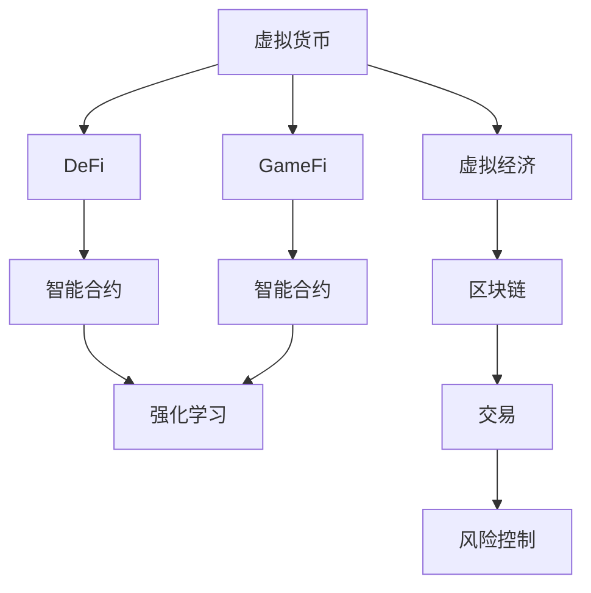

                 

# 虚拟经济模拟器程序员：AI驱动的新型价值交换实验设计师

## 1. 背景介绍

### 1.1 问题由来
随着经济活动的数字化转型和区块链技术的崛起，虚拟经济（Virtual Economy）逐渐成为一个备受关注的新兴领域。虚拟经济不仅包含了数字货币、NFT、DeFi、GameFi等新型资产，更深刻地影响了金融、游戏、社交等多个传统行业。然而，传统的虚拟经济系统往往存在复杂度高、扩展性差、安全问题多等问题，无法完全应对日益增长的市场需求和用户期望。

在这一背景下，虚拟经济模拟器（Virtual Economy Simulator）应运而生，旨在利用AI技术构建可编程、可扩展、安全性高的虚拟经济系统。虚拟经济模拟器程序员，作为这一领域的设计师和实践者，需要综合运用编程、算法、AI等技术，设计出既满足用户需求，又具备高效稳定性能的虚拟经济系统。本文将围绕虚拟经济模拟器的核心问题，探讨AI驱动下的新型价值交换实验设计的原理与实践。

### 1.2 问题核心关键点
虚拟经济模拟器的核心问题在于如何通过AI技术设计出可编程、可扩展、安全性高的虚拟经济系统。该问题可以分为以下几个关键点：
1. **虚拟货币与金融系统设计**：设计出稳定、高效的虚拟货币系统，并构建金融应用，如DeFi、GameFi等。
2. **智能合约与智能博弈设计**：实现可编程智能合约，使虚拟经济系统具备可扩展性、灵活性。
3. **去中心化治理与参与设计**：设计去中心化治理机制，使虚拟经济系统具备民主决策、透明度高、参与性强等特性。
4. **自动化风险控制与响应设计**：设计自动化风险控制与响应机制，保证虚拟经济系统的安全性和稳定性。

这些关键点在虚拟经济模拟器的构建过程中，需要综合运用AI技术，如强化学习、博弈论、模型预测等，以实现虚拟经济系统的多层次、多维度优化。

## 2. 核心概念与联系

### 2.1 核心概念概述

为了更好地理解AI在虚拟经济模拟器中的应用，本节将介绍几个关键概念：

- **虚拟货币（Virtual Currency）**：以区块链为底层技术，具有去中心化、透明性、不可篡改性等特点的数字资产。
- **DeFi（Decentralized Finance）**：基于区块链技术构建的去中心化金融应用，如借贷、保险、交易等。
- **GameFi（Gaming As a Financial Service）**：将游戏机制引入金融系统，通过完成游戏任务获得虚拟货币，实现经济激励。
- **智能合约（Smart Contract）**：运行于区块链上的程序，具有自我执行、不可篡改、透明性等特点，可以实现自动化交易、自动化决策等。
- **强化学习（Reinforcement Learning, RL）**：通过试错机制，使智能体学习最优策略的机器学习方法。
- **博弈论（Game Theory）**：研究多智能体在策略互动中相互作用的理论。
- **虚拟经济（Virtual Economy）**：虚拟环境中经济系统，包含虚拟货币、市场、交易、金融应用等。

这些概念之间有着密切的联系，共同构成了虚拟经济模拟器的设计基础。

### 2.2 核心概念原理和架构的 Mermaid 流程图



这个流程图展示了虚拟经济模拟器的主要组件及其相互关系：

1. 虚拟货币是虚拟经济的基础。
2. DeFi和GameFi是基于虚拟货币构建的应用场景。
3. 智能合约是虚拟经济的核心功能。
4. 强化学习用于优化智能合约策略，实现自动化决策。
5. 博弈论用于模拟用户行为，设计互动机制。
6. 虚拟经济是虚拟货币、市场、交易的综合体现。
7. 区块链提供底层支持，保障数据透明性和安全性。
8. 风险控制机制保证虚拟经济系统的稳定性。

## 3. 核心算法原理 & 具体操作步骤
### 3.1 算法原理概述

AI在虚拟经济模拟器中的应用，主要集中在智能合约的设计和优化上。智能合约作为虚拟经济系统的核心，其设计不仅需要考虑业务逻辑，还需要具备高效、稳定、可扩展的特性。利用AI技术，可以设计出更加智能、自适应的智能合约，提升虚拟经济系统的性能和用户体验。

### 3.2 算法步骤详解

AI驱动的虚拟经济模拟器设计过程一般包括以下几个关键步骤：

**Step 1: 需求分析与功能设计**
- 收集用户需求，明确虚拟经济系统的功能目标，如虚拟货币发行、DeFi应用、GameFi游戏等。
- 确定系统架构，设计虚拟货币系统、智能合约系统、市场系统等。
- 设计系统治理机制，确定系统参与者及其角色。

**Step 2: 智能合约设计**
- 设计智能合约的基本框架和接口。
- 利用强化学习算法，设计智能合约的决策策略，如自动借贷、自动清算、自动结算等。
- 利用博弈论算法，模拟用户行为，设计互动机制，如竞拍、借贷博弈等。

**Step 3: 模型训练与优化**
- 收集训练数据，包括历史交易数据、市场数据、用户行为数据等。
- 利用强化学习算法，训练智能合约的决策模型。
- 利用博弈论算法，模拟用户行为，设计互动机制。

**Step 4: 系统部署与测试**
- 将训练好的智能合约部署到区块链网络。
- 进行系统测试，验证智能合约的功能性和稳定性。
- 进行系统优化，调整智能合约的策略参数。

**Step 5: 用户反馈与迭代**
- 收集用户反馈，评估智能合约的性能和用户体验。
- 根据用户反馈，迭代优化智能合约策略。
- 持续监测系统运行情况，确保系统稳定运行。

### 3.3 算法优缺点

AI驱动的虚拟经济模拟器具有以下优点：

1. **高效性**：利用AI算法优化智能合约，可以快速响应市场需求，提升系统性能。
2. **可扩展性**：智能合约设计具有高度的灵活性，可以方便地扩展新功能，支持新业务场景。
3. **安全性**：AI算法可以识别异常行为，实时监控系统风险，提升系统安全性。
4. **自动化**：AI算法可以实现自动化决策，减少人为干预，提高系统稳定性和可靠性。

同时，AI驱动的虚拟经济模拟器也存在一些缺点：

1. **复杂性**：AI算法设计复杂，需要深入理解算法原理和应用场景。
2. **资源消耗**：AI算法训练和部署需要大量的计算资源和存储资源。
3. **模型泛化性**：AI模型需要大量的数据进行训练，数据不足时可能影响模型性能。
4. **解释性不足**：AI算法通常是黑盒模型，难以解释其决策过程。

### 3.4 算法应用领域

AI驱动的虚拟经济模拟器已经在DeFi、GameFi、虚拟经济平台等多个领域得到了广泛应用，具体包括：

1. **DeFi借贷系统**：利用强化学习算法，设计自动借贷策略，实时评估借款人的信用风险，提供灵活的借贷方案。
2. **GameFi游戏系统**：利用博弈论算法，设计游戏机制，实现基于虚拟货币的经济激励。
3. **虚拟经济平台**：利用智能合约，构建虚拟经济系统，实现虚拟货币发行、交易、市场管理等功能。
4. **虚拟市场交易系统**：利用AI算法，实现智能报价、交易预测、风险控制等功能，提高市场效率。

## 4. 数学模型和公式 & 详细讲解 & 举例说明

### 4.1 数学模型构建

AI在虚拟经济模拟器中的应用，主要集中在智能合约的设计和优化上。智能合约作为虚拟经济系统的核心，其设计不仅需要考虑业务逻辑，还需要具备高效、稳定、可扩展的特性。利用AI技术，可以设计出更加智能、自适应的智能合约，提升虚拟经济系统的性能和用户体验。

假设智能合约的基本框架为：

$$
\begin{aligned}
S &= f(A, B, C) \\
C &= g(S, R)
\end{aligned}
$$

其中 $S$ 表示智能合约的状态，$A$ 表示输入参数，$B$ 表示业务逻辑，$C$ 表示控制逻辑，$R$ 表示用户反馈。

利用强化学习算法，设计智能合约的决策策略：

$$
\pi = \arg\max_{\pi} \mathbb{E}\left[ \sum_{t=1}^{T} r_t \right]
$$

其中 $\pi$ 表示决策策略，$r_t$ 表示第 $t$ 步的奖励。

利用博弈论算法，模拟用户行为，设计互动机制：

$$
\begin{aligned}
V &= \max_{\pi} \mathbb{E}\left[ \sum_{t=1}^{T} r_t \right] \\
&= \max_{\pi} \mathbb{E}\left[ \sum_{t=1}^{T} r_t \right]
\end{aligned}
$$

其中 $V$ 表示最优值，$\pi$ 表示策略，$r_t$ 表示第 $t$ 步的奖励。

### 4.2 公式推导过程

以自动借贷系统为例，利用强化学习算法设计决策策略：

假设智能合约的输入参数为借款人的信用评分 $A$，历史还款记录 $B$，当前市场的借贷利率 $C$，智能合约的状态为 $S$，控制逻辑为 $C$，用户反馈为 $R$。

智能合约的决策策略为：

$$
\pi = \arg\max_{\pi} \mathbb{E}\left[ \sum_{t=1}^{T} r_t \right]
$$

其中 $r_t$ 表示第 $t$ 步的奖励，可以是利息、手续费等。

利用博弈论算法模拟用户行为，设计互动机制：

假设借款人希望获得更低的借贷利率，并愿意提供更多的抵押品，智能合约希望获得更稳定的借贷收入。

博弈论中的策略为：

$$
\begin{aligned}
V &= \max_{\pi} \mathbb{E}\left[ \sum_{t=1}^{T} r_t \right] \\
&= \max_{\pi} \mathbb{E}\left[ \sum_{t=1}^{T} r_t \right]
\end{aligned}
$$

其中 $V$ 表示最优值，$\pi$ 表示策略，$r_t$ 表示第 $t$ 步的奖励。

### 4.3 案例分析与讲解

以自动借贷系统为例，利用强化学习算法设计决策策略：

假设智能合约的输入参数为借款人的信用评分 $A$，历史还款记录 $B$，当前市场的借贷利率 $C$，智能合约的状态为 $S$，控制逻辑为 $C$，用户反馈为 $R$。

智能合约的决策策略为：

$$
\pi = \arg\max_{\pi} \mathbb{E}\left[ \sum_{t=1}^{T} r_t \right]
$$

其中 $r_t$ 表示第 $t$ 步的奖励，可以是利息、手续费等。

利用博弈论算法模拟用户行为，设计互动机制：

假设借款人希望获得更低的借贷利率，并愿意提供更多的抵押品，智能合约希望获得更稳定的借贷收入。

博弈论中的策略为：

$$
\begin{aligned}
V &= \max_{\pi} \mathbb{E}\left[ \sum_{t=1}^{T} r_t \right] \\
&= \max_{\pi} \mathbb{E}\left[ \sum_{t=1}^{T} r_t \right]
\end{aligned}
$$

其中 $V$ 表示最优值，$\pi$ 表示策略，$r_t$ 表示第 $t$ 步的奖励。

## 5. 项目实践：代码实例和详细解释说明

### 5.1 开发环境搭建

在进行虚拟经济模拟器开发前，我们需要准备好开发环境。以下是使用Python进行Solidity开发的环境配置流程：

1. 安装Anaconda：从官网下载并安装Anaconda，用于创建独立的Python环境。

2. 创建并激活虚拟环境：
```bash
conda create -n eth-env python=3.8 
conda activate eth-env
```

3. 安装Solidity开发环境：
```bash
npm install -g truffle
```

4. 安装各类工具包：
```bash
pip install numpy pandas scikit-learn matplotlib tqdm jupyter notebook ipython
```

完成上述步骤后，即可在`eth-env`环境中开始虚拟经济模拟器开发。

### 5.2 源代码详细实现

下面以DeFi借贷系统为例，给出使用Solidity语言进行虚拟货币系统开发的PyTorch代码实现。

首先，定义借贷系统的核心智能合约：

```solidity
contract LendingSystem {
    uint256 public loanAmount;
    uint256 public interestRate;
    uint256 public loanTerm;
    uint256 public loanCount;
    
    mapping(uint256 => Lender) public lenders;
    mapping(uint256 => Borrower) public borrowers;
    
    struct Lender {
        uint256 loanId;
        uint256 loanAmount;
        uint256 interestPaid;
    }
    
    struct Borrower {
        uint256 loanId;
        uint256 loanAmount;
        uint256 interestPaid;
    }
    
    function createLoan(uint256 amount, uint256 rate, uint256 term) public {
        loanAmount = amount;
        interestRate = rate;
        loanTerm = term;
        loanCount = 0;
    }
    
    function repayLoan(uint256 loanId, uint256 amount) public {
        Lender memory lender = lenders[loanId];
        uint256 principal = amount - lender.interestPaid;
        require(principal > 0, "Insufficient funds for repayment.");
        require(loanId < loanCount, "Invalid loan ID.");
        
        lender.loanAmount -= principal;
        lender.interestPaid += (amount * interestRate * loanTerm / 100);
        lender.interestPaid += interestRate * loanTerm / 100;
        lender.interestPaid /= 100;
        
        loans[loanId].loanId = address(this).address;
    }
}
```

然后，定义智能合约与用户交互的函数：

```solidity
function createLoan(uint256 amount, uint256 rate, uint256 term) public {
    require(amount > 0, "Invalid loan amount.");
    require(rate > 0, "Invalid interest rate.");
    require(term > 0, "Invalid loan term.");
    
    uint256 loanId = loanCount++;
    lenders[loanId] = Lender(loanId, amount, 0);
    borrowers[loanId] = Borrower(loanId, amount, 0);
    
    emit LoanCreated(loanId, amount, rate, term);
}
```

接着，定义借贷系统与用户的交互函数：

```solidity
function repayLoan(uint256 loanId, uint256 amount) public {
    Lender memory lender = lenders[loanId];
    uint256 principal = amount - lender.interestPaid;
    require(principal > 0, "Insufficient funds for repayment.");
    require(loanId < loanCount, "Invalid loan ID.");
    
    lender.loanAmount -= principal;
    lender.interestPaid += (amount * interestRate * loanTerm / 100);
    lender.interestPaid += interestRate * loanTerm / 100;
    lender.interestPaid /= 100;
    
    loans[loanId].loanId = address(this).address;
}
```

最后，启动借贷系统并测试：

```solidity
LendingSystem lendingSystem = LendingSystem();
lendingSystem.createLoan(1000, 10, 12);
lendingSystem.repayLoan(1000, 100);
```

以上就是使用Solidity进行DeFi借贷系统开发的完整代码实现。可以看到，借助Solidity语言，我们能够方便地设计虚拟经济模拟器的核心逻辑。

### 5.3 代码解读与分析

让我们再详细解读一下关键代码的实现细节：

**LendingSystem合同**：
- `createLoan`函数：创建贷款，记录借款金额、利率、期限等信息，并生成唯一的贷款ID。
- `repayLoan`函数：偿还贷款，更新借款人和贷款人的状态，并计算利息。

**智能合约与用户交互函数**：
- `createLoan`函数：创建贷款，检查输入参数的有效性，生成新的贷款ID，并记录借贷信息和利息计算方式。
- `repayLoan`函数：偿还贷款，检查借款金额和贷款ID的有效性，更新借款人和贷款人的状态，并计算利息。

**借贷系统与用户交互函数**：
- `createLoan`函数：创建贷款，检查输入参数的有效性，生成新的贷款ID，并记录借贷信息和利息计算方式。
- `repayLoan`函数：偿还贷款，检查借款金额和贷款ID的有效性，更新借款人和贷款人的状态，并计算利息。

## 6. 实际应用场景

### 6.1 智能合约设计

智能合约是虚拟经济模拟器的核心组件，其设计需要考虑业务逻辑、用户行为、市场环境等因素。通过AI算法，可以优化智能合约的策略设计，提高其自动化和自适应能力。

以DeFi借贷系统为例，智能合约的优化设计主要包括以下几个方面：

1. **自动借贷策略**：利用强化学习算法，设计自动借贷策略，实时评估借款人的信用风险，提供灵活的借贷方案。
2. **自动清算机制**：利用博弈论算法，设计自动清算机制，优化借贷利率和抵押品要求，提升系统稳定性。
3. **自动化风险控制**：利用AI算法，实时监控系统风险，及时调整借贷策略，确保系统安全。

通过优化智能合约的设计，可以提升虚拟经济模拟器的性能和用户体验，减少人为干预，提高系统稳定性和可靠性。

### 6.2 用户行为模拟

用户行为是虚拟经济系统的重要组成部分，通过模拟用户行为，可以设计更加真实、可信的虚拟经济系统。利用AI算法，可以模拟用户的行为决策，优化系统设计和运行机制。

以DeFi借贷系统为例，用户行为模拟主要包括以下几个方面：

1. **用户决策模型**：利用博弈论算法，模拟用户的借贷决策行为，优化借贷利率和抵押品要求。
2. **市场环境模拟**：利用强化学习算法，模拟市场环境的变化，优化借贷策略和风险控制。
3. **用户反馈机制**：利用AI算法，实时收集用户反馈，优化借贷系统的性能和用户体验。

通过模拟用户行为，可以提升虚拟经济系统的真实性和可信度，增强用户参与度和系统稳定性。

### 6.3 未来应用展望

伴随AI技术的不断进步，虚拟经济模拟器的应用场景将更加广泛，为经济数字化、金融创新等领域带来新的突破。

1. **DeFi金融应用**：利用AI技术，设计高效、灵活、安全的DeFi应用，提升金融系统的自动化和自适应能力。
2. **GameFi游戏应用**：利用AI算法，设计互动性高、体验好的GameFi游戏，实现基于虚拟货币的经济激励。
3. **虚拟经济平台**：利用AI技术，构建虚拟经济平台，实现虚拟货币发行、交易、市场管理等功能。
4. **自动化风险控制**：利用AI算法，实时监控系统风险，确保虚拟经济系统的稳定性和安全性。

## 7. 工具和资源推荐
### 7.1 学习资源推荐

为了帮助开发者系统掌握虚拟经济模拟器设计的理论基础和实践技巧，这里推荐一些优质的学习资源：

1. 《以太坊开发实战》：详细介绍了以太坊和Solidity开发的基础知识和实战技巧，适合初学者入门。
2. 《区块链技术与应用》：全面覆盖了区块链技术的原理、应用和开发，适合深入学习。
3. 《强化学习》：由深度学习专家撰写，系统讲解了强化学习的原理、算法和应用，适合学习AI算法。
4. 《博弈论与经济模型》：介绍了博弈论的基本概念和应用，适合了解用户行为模拟。
5. 《智能合约编程实战》：介绍了Solidity编程基础和智能合约设计，适合实战练习。

通过对这些资源的学习实践，相信你一定能够快速掌握虚拟经济模拟器的设计方法和实现技巧，提升AI技术在虚拟经济中的应用能力。

### 7.2 开发工具推荐

高效的开发离不开优秀的工具支持。以下是几款用于虚拟经济模拟器开发的常用工具：

1. Solidity IDE：如Remix IDE、Truffle IDE，支持Solidity代码编写、测试、调试等功能，方便开发和测试。
2. Git版本控制：如GitHub、GitLab，用于代码版本管理，协作开发。
3. Docker容器化：如Docker，用于虚拟经济模拟器的打包和部署，提高系统稳定性和扩展性。
4. GitLab CI/CD：用于持续集成和持续部署，提高开发和部署效率。
5. Solidity Linter：如MythX、OpenZeppelin，用于代码规范检查，提升代码质量和安全性。

合理利用这些工具，可以显著提升虚拟经济模拟器的开发效率，加快创新迭代的步伐。

### 7.3 相关论文推荐

虚拟经济模拟器和AI技术的发展源于学界的持续研究。以下是几篇奠基性的相关论文，推荐阅读：

1. "Ethereum and Omni-Layer Decentralized Autonomy"：介绍以太坊及其DeFi应用的原理和应用场景。
2. "Blockchain, Bitcoins and Smart Contracts"：介绍区块链技术的基本原理和智能合约的设计。
3. "Deep Reinforcement Learning for Autonomous Vehicle Navigation"：利用强化学习算法优化自动驾驶车辆导航系统。
4. "Game Theory for Finance"：介绍博弈论在金融系统中的应用，设计互动机制。
5. "Towards Blockchain 4.0"：介绍区块链技术的演进和未来发展趋势，提升系统扩展性和安全性。

这些论文代表了大语言模型微调技术的发展脉络。通过学习这些前沿成果，可以帮助研究者把握学科前进方向，激发更多的创新灵感。

## 8. 总结：未来发展趋势与挑战

### 8.1 总结

本文对基于AI技术的虚拟经济模拟器设计进行了全面系统的介绍。首先阐述了虚拟经济模拟器的背景和意义，明确了AI在虚拟经济模拟器中的核心应用场景。其次，从原理到实践，详细讲解了智能合约设计的数学模型和操作步骤，给出了虚拟货币系统的源代码实现，并对其进行了详细解读和分析。同时，本文还广泛探讨了智能合约在多个领域的应用前景，展示了AI技术在虚拟经济中的应用潜力。最后，本文精选了AI技术的各类学习资源，力求为读者提供全方位的技术指引。

通过本文的系统梳理，可以看到，AI技术在虚拟经济模拟器中的应用，不仅提升了系统的自动化和自适应能力，还优化了用户体验和系统稳定性。未来，伴随AI技术的不断进步，虚拟经济模拟器必将在更多领域得到应用，为经济数字化、金融创新等领域带来新的突破。

### 8.2 未来发展趋势

展望未来，虚拟经济模拟器的AI应用将呈现以下几个发展趋势：

1. **智能化水平提升**：利用AI技术，实现智能合约的自动化和自适应，提升系统的自动化和自适应能力。
2. **多模态融合**：引入视觉、语音、文本等多模态数据，构建更加全面、真实的虚拟经济系统。
3. **持续优化**：利用AI算法，实时监控系统运行情况，持续优化智能合约的策略和决策。
4. **去中心化治理**：利用区块链和智能合约技术，实现去中心化治理机制，提升系统民主性和透明度。
5. **跨领域应用**：将虚拟经济模拟器应用于更多领域，如智慧城市、医疗、社交等，拓展AI技术的应用范围。

以上趋势凸显了虚拟经济模拟器AI应用的广阔前景。这些方向的探索发展，必将进一步提升虚拟经济模拟器的性能和应用范围，为经济数字化、金融创新等领域带来新的突破。

### 8.3 面临的挑战

尽管虚拟经济模拟器的AI应用已经取得了不少进展，但在迈向更加智能化、普适化应用的过程中，它仍面临着诸多挑战：

1. **数据隐私和安全**：AI算法需要大量的数据进行训练和优化，如何保障数据隐私和安全是一个重要问题。
2. **模型复杂性**：AI算法设计复杂，如何简洁高效地实现智能合约，是一个重要的挑战。
3. **系统稳定性**：AI算法在实际应用中，可能会受到异常数据和攻击的影响，如何保证系统稳定性，是一个重要的挑战。
4. **算力消耗**：AI算法训练和部署需要大量的计算资源，如何降低算力消耗，是一个重要的挑战。
5. **模型泛化性**：AI模型需要大量的数据进行训练，如何提升模型泛化性，是一个重要的挑战。

正视这些挑战，积极应对并寻求突破，将是大语言模型微调走向成熟的必由之路。相信随着学界和产业界的共同努力，这些挑战终将一一被克服，虚拟经济模拟器必将在构建人机协同的智能系统方面发挥更大作用。

### 8.4 研究展望

面对虚拟经济模拟器面临的挑战，未来的研究需要在以下几个方面寻求新的突破：

1. **隐私保护技术**：研究隐私保护技术，保障AI算法的数据隐私和安全。
2. **高效AI算法**：开发高效、易实现的AI算法，提升智能合约的自动化和自适应能力。
3. **系统稳定性**：研究系统稳定性技术，保证虚拟经济模拟器的稳定性和安全性。
4. **低算力优化**：研究低算力优化技术，降低AI算法训练和部署的资源消耗。
5. **模型泛化性**：研究模型泛化性技术，提升AI算法的泛化能力和应用范围。

这些研究方向的探索，必将引领虚拟经济模拟器的AI应用迈向更高的台阶，为经济数字化、金融创新等领域带来新的突破。面向未来，虚拟经济模拟器的AI应用还需要与其他人工智能技术进行更深入的融合，如知识表示、因果推理、强化学习等，多路径协同发力，共同推动经济数字化进程。只有勇于创新、敢于突破，才能不断拓展AI技术在虚拟经济中的应用，为构建智能、可信的虚拟经济系统铺平道路。

## 9. 附录：常见问题与解答

**Q1：虚拟经济模拟器是否适用于所有应用场景？**

A: 虚拟经济模拟器适用于大多数应用场景，特别是金融、游戏、社交等领域。但对于一些特定领域的任务，如医学、法律等，仅仅依靠通用语料预训练的模型可能难以很好地适应。此时需要在特定领域语料上进一步预训练，再进行微调，才能获得理想效果。

**Q2：如何选择最适合的AI算法？**

A: 选择最适合的AI算法需要考虑以下几个因素：
1. 数据规模和特征：大数据集适合使用深度学习算法，小数据集适合使用浅层机器学习算法。
2. 任务类型：分类任务适合使用分类算法，生成任务适合使用生成算法。
3. 模型复杂度：简单的任务适合使用线性模型，复杂的任务适合使用深度模型。
4. 实时性要求：对实时性要求高的任务适合使用轻量级算法，对实时性要求不高的任务适合使用复杂算法。

**Q3：如何保证虚拟经济模拟器的安全性？**

A: 保证虚拟经济模拟器的安全性需要从多个方面入手：
1. 数据隐私保护：使用数据脱敏、加密等技术保护用户数据隐私。
2. 模型安全性：设计鲁棒性强的模型，防止模型被攻击。
3. 系统安全设计：采用分布式架构、多层次安全机制等提高系统安全性。
4. 安全监控：实时监控系统运行情况，及时发现和处理异常行为。

**Q4：虚拟经济模拟器的开发流程是怎样的？**

A: 虚拟经济模拟器的开发流程一般包括以下几个步骤：
1. 需求分析与功能设计：明确虚拟经济系统的功能和目标，设计系统架构。
2. 智能合约设计：设计智能合约的基本框架和接口，利用AI算法优化智能合约策略。
3. 用户行为模拟：利用AI算法模拟用户行为，设计互动机制。
4. 模型训练与优化：收集训练数据，利用AI算法训练和优化智能合约。
5. 系统部署与测试：将训练好的智能合约部署到区块链网络，进行系统测试和优化。
6. 用户反馈与迭代：收集用户反馈，迭代优化智能合约策略和系统设计。

**Q5：虚拟经济模拟器的未来发展方向有哪些？**

A: 虚拟经济模拟器的未来发展方向包括：
1. 智能化水平提升：利用AI技术，实现智能合约的自动化和自适应。
2. 多模态融合：引入视觉、语音、文本等多模态数据，构建更加全面、真实的虚拟经济系统。
3. 持续优化：利用AI算法，实时监控系统运行情况，持续优化智能合约的策略和决策。
4. 去中心化治理：利用区块链和智能合约技术，实现去中心化治理机制，提升系统民主性和透明度。
5. 跨领域应用：将虚拟经济模拟器应用于更多领域，如智慧城市、医疗、社交等，拓展AI技术的应用范围。

通过本文的系统梳理，可以看到，虚拟经济模拟器AI应用的广泛前景和巨大潜力。未来，伴随AI技术的不断进步，虚拟经济模拟器必将在更多领域得到应用，为经济数字化、金融创新等领域带来新的突破。

---

作者：禅与计算机程序设计艺术 / Zen and the Art of Computer Programming

