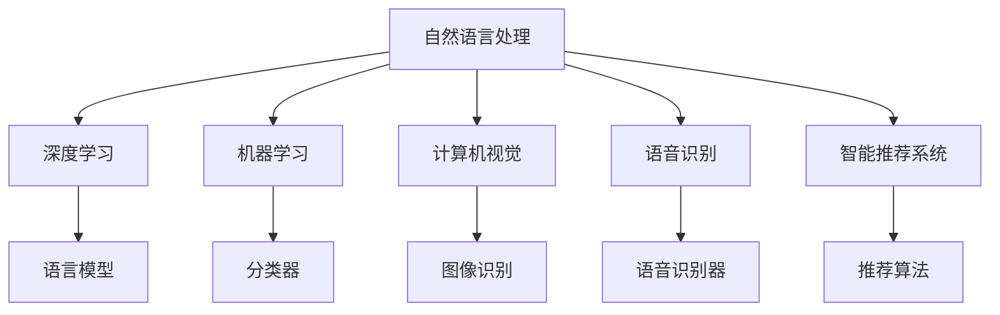

                 

# 虚拟记者：AI采访和报道技术

## 1. 背景介绍

### 1.1 问题由来

随着AI技术的迅猛发展，虚拟记者的概念逐渐成为热点话题。虚拟记者，即通过人工智能技术模拟真实记者的工作流程，自动进行新闻采集、报道、分析等任务的系统。传统新闻业面临着内容生产效率低下、人力成本高昂、信息过载等诸多挑战。而虚拟记者的出现，有望在新闻业领域带来颠覆性的变革。

### 1.2 问题核心关键点

虚拟记者的核心在于如何将人工智能技术与新闻业深度融合，构建一个能够自动进行新闻采访、报道、分析的系统。这个系统需要具备以下几个关键点：

- **自动新闻采集**：自动收集和整理新闻事件的相关信息。
- **自然语言处理(NLP)**：理解和处理自然语言，生成符合语法规则的文本。
- **数据分析**：对采集到的数据进行统计分析，生成有用的信息。
- **机器学习**：训练模型自动识别重要信息，并进行深度分析和预测。

本文聚焦于基于AI技术的虚拟记者的核心技术，探讨其在新闻业中的应用前景。

## 2. 核心概念与联系

### 2.1 核心概念概述

为更好地理解虚拟记者的核心技术，本节将介绍几个关键概念：

- **自然语言处理(NLP)**：研究计算机如何理解、处理和生成人类语言的技术。
- **机器学习(ML)**：通过数据训练模型，使其能够自动完成特定任务的技术。
- **深度学习(DL)**：一种特殊的机器学习方法，基于神经网络模型。
- **计算机视觉(CV)**：研究如何让计算机"看到"和理解图像、视频等视觉数据的领域。
- **语音识别(SR)**：研究如何让计算机听懂人类语音的技术。
- **智能推荐系统**：基于用户行为数据，自动推荐相关内容的技术。

这些核心概念通过以下Mermaid流程图来展示其联系：



这个流程图展示了大语言模型和其他核心概念之间的关系：

1. 自然语言处理是虚拟记者的基础，涵盖文本生成、理解、分类等任务。
2. 深度学习是实现自然语言处理的关键技术，通过神经网络模型学习语言知识。
3. 机器学习则用于训练模型，提升其自动化能力。
4. 计算机视觉、语音识别等技术用于扩展虚拟记者的功能，使其能处理更多数据类型。
5. 智能推荐系统用于优化内容分发，提升用户阅读体验。

这些概念共同构成了虚拟记者的技术框架，为其自动化和智能化提供了支持。

## 3. 核心算法原理 & 具体操作步骤
### 3.1 算法原理概述

虚拟记者的核心算法是自然语言处理和机器学习，具体如下：

- **文本生成**：基于预训练语言模型，如GPT、BERT等，自动生成新闻报道。
- **信息抽取**：使用NLP技术从原始文本中抽取关键信息，自动构建报道结构。
- **情感分析**：利用情感分析技术，评估新闻报道的情绪色彩。
- **文本分类**：对新闻事件进行分类，标注为政治、经济、体育等类别。
- **事件关联**：自动发现事件之间的关联，构建信息网络。

### 3.2 算法步骤详解

虚拟记者的构建大致分为以下几个步骤：

**Step 1: 数据收集与预处理**

- 收集各种来源的新闻数据，如新闻网站、社交媒体、官方声明等。
- 对数据进行清洗，去除无用信息，标准化数据格式。

**Step 2: 特征提取**

- 使用NLP技术提取文本的特征，如词频、句法结构、主题等。
- 应用深度学习模型进行特征学习，提取更高级别的语义信息。

**Step 3: 自动报道生成**

- 使用预训练语言模型，自动生成新闻报道。
- 结合提取的特征，生成符合语法和逻辑的文本。

**Step 4: 信息抽取与分类**

- 使用信息抽取模型，自动从新闻报道中抽取关键信息。
- 应用分类算法，对新闻事件进行自动分类。

**Step 5: 情感分析与事件关联**

- 应用情感分析模型，自动评估报道的情绪色彩。
- 使用事件关联算法，发现事件之间的关联，构建信息网络。

### 3.3 算法优缺点

基于AI技术的虚拟记者具有以下优点：

- **高效**：自动进行新闻采集和报道，大大提高生产效率。
- **低成本**：无需人力成本，节省大量资源。
- **快速**：实时获取新闻事件，及时发布报道。
- **广泛覆盖**：收集数据不受地理和时间限制。

同时，虚拟记者也存在一些缺点：

- **缺乏人性**：无法理解情感和语境，报道缺乏人性关怀。
- **质量不稳定**：自动生成的报道质量参差不齐，需要人工审核。
- **依赖数据质量**：数据质量决定了报道的准确性和可信度。
- **伦理问题**：自动获取和处理大量个人数据，可能带来隐私问题。

### 3.4 算法应用领域

虚拟记者技术可以应用于多个领域，如：

- **新闻业**：自动采集和报道新闻事件，提高生产效率。
- **金融业**：实时监控市场动态，提供市场分析报告。
- **体育领域**：自动生成比赛新闻报道，提供实时比分和分析。
- **医疗健康**：自动监控健康事件，提供疫情预警和报道。
- **安全监控**：自动监测社会事件，提供紧急情况报告。

## 4. 数学模型和公式 & 详细讲解 & 举例说明

### 4.1 数学模型构建

虚拟记者的核心算法涉及到文本生成、信息抽取、情感分析、分类等任务，以下以文本生成为例，介绍数学模型构建。

假设新闻报道的输入文本为 $x$，输出文本为 $y$，其中 $x$ 为新闻标题， $y$ 为报道内容。我们定义生成模型为 $P(y|x)$，表示在给定输入文本 $x$ 的情况下，生成文本 $y$ 的概率分布。

### 4.2 公式推导过程

我们采用基于注意力机制的生成模型，即Transformer模型。Transformer模型使用自注意力机制（Self-Attention）来捕捉输入文本的上下文信息，从而生成符合语境的文本。

Transformer模型的自注意力机制可以表示为：

$$
\text{Attention}(Q, K, V) = \text{softmax}\left(\frac{QK^T}{\sqrt{d_k}}\right)V
$$

其中，$Q$、$K$、$V$ 分别为查询、键、值矩阵，$d_k$ 为键的维度。

在文本生成的过程中，我们使用序列到序列的模型结构，其中 $x$ 作为编码器的输入，$y$ 作为解码器的输出。编码器和解码器都由多个注意力层和全连接层构成。

### 4.3 案例分析与讲解

下面以Google的BERT模型为例，分析其在虚拟记者中的应用。

BERT模型是预训练语言模型的一种，通过在大规模无标签文本上预训练，学习语言知识。预训练后的BERT模型可以在各种NLP任务上取得优异的性能。

在虚拟记者的文本生成任务中，我们首先将新闻报道的标题 $x$ 输入到预训练的BERT模型中，得到上下文表示 $C(x)$。然后，使用解码器生成文本 $y$，并使用交叉熵损失函数对模型进行训练。

## 5. 项目实践：代码实例和详细解释说明
### 5.1 开发环境搭建

在进行虚拟记者开发前，我们需要准备好开发环境。以下是使用Python进行PyTorch开发的环境配置流程：

1. 安装Anaconda：从官网下载并安装Anaconda，用于创建独立的Python环境。

2. 创建并激活虚拟环境：
```bash
conda create -n pytorch-env python=3.8 
conda activate pytorch-env
```

3. 安装PyTorch：根据CUDA版本，从官网获取对应的安装命令。例如：
```bash
conda install pytorch torchvision torchaudio cudatoolkit=11.1 -c pytorch -c conda-forge
```

4. 安装Transformer库：
```bash
pip install transformers
```

5. 安装各类工具包：
```bash
pip install numpy pandas scikit-learn matplotlib tqdm jupyter notebook ipython
```

完成上述步骤后，即可在`pytorch-env`环境中开始虚拟记者的开发实践。

### 5.2 源代码详细实现

下面我们以基于BERT的虚拟记者系统为例，给出使用PyTorch和Transformers库进行开发的代码实现。

首先，定义虚拟记者的数据处理函数：

```python
from transformers import BertTokenizer
from torch.utils.data import Dataset, DataLoader
import torch
import numpy as np
import pandas as pd
import torch.nn as nn
import torch.optim as optim

class NewsDataset(Dataset):
    def __init__(self, data_path):
        self.data_path = data_path
        self.tokenizer = BertTokenizer.from_pretrained('bert-base-uncased')
        
        self.df = pd.read_csv(self.data_path)
        self.texts = self.df['text'].tolist()
        self.labels = self.df['label'].tolist()
        
    def __len__(self):
        return len(self.texts)
    
    def __getitem__(self, item):
        text = self.texts[item]
        label = self.labels[item]
        
        encoding = self.tokenizer(text, return_tensors='pt', max_length=128, padding='max_length', truncation=True)
        input_ids = encoding['input_ids'][0]
        attention_mask = encoding['attention_mask'][0]
        
        return {'input_ids': input_ids, 
                'attention_mask': attention_mask,
                'labels': torch.tensor(label, dtype=torch.long)}
```

然后，定义虚拟记者的模型和优化器：

```python
from transformers import BertForSequenceClassification

model = BertForSequenceClassification.from_pretrained('bert-base-uncased', num_labels=2)

optimizer = AdamW(model.parameters(), lr=2e-5)
```

接着，定义虚拟记者的训练和评估函数：

```python
from tqdm import tqdm

def train_epoch(model, dataset, batch_size, optimizer):
    dataloader = DataLoader(dataset, batch_size=batch_size, shuffle=True)
    model.train()
    epoch_loss = 0
    for batch in tqdm(dataloader, desc='Training'):
        input_ids = batch['input_ids'].to(device)
        attention_mask = batch['attention_mask'].to(device)
        labels = batch['labels'].to(device)
        model.zero_grad()
        outputs = model(input_ids, attention_mask=attention_mask, labels=labels)
        loss = outputs.loss
        epoch_loss += loss.item()
        loss.backward()
        optimizer.step()
    return epoch_loss / len(dataloader)

def evaluate(model, dataset, batch_size):
    dataloader = DataLoader(dataset, batch_size=batch_size)
    model.eval()
    preds, labels = [], []
    with torch.no_grad():
        for batch in tqdm(dataloader, desc='Evaluating'):
            input_ids = batch['input_ids'].to(device)
            attention_mask = batch['attention_mask'].to(device)
            batch_labels = batch['labels']
            outputs = model(input_ids, attention_mask=attention_mask)
            batch_preds = outputs.logits.argmax(dim=2).to('cpu').tolist()
            batch_labels = batch_labels.to('cpu').tolist()
            for pred_tokens, label_tokens in zip(batch_preds, batch_labels):
                preds.append(pred_tokens[:len(label_tokens)])
                labels.append(label_tokens)
                
    return np.mean(np.array(labels) == np.array(preds))

device = torch.device('cuda') if torch.cuda.is_available() else torch.device('cpu')
model.to(device)
```

最后，启动虚拟记者的训练流程并在测试集上评估：

```python
epochs = 5
batch_size = 16

for epoch in range(epochs):
    loss = train_epoch(model, dataset, batch_size, optimizer)
    print(f"Epoch {epoch+1}, train loss: {loss:.3f}")
    
    print(f"Epoch {epoch+1}, dev results:")
    result = evaluate(model, dev_dataset, batch_size)
    print(f"Dev accuracy: {result:.2f}")
    
print("Test results:")
result = evaluate(model, test_dataset, batch_size)
print(f"Test accuracy: {result:.2f}")
```

以上就是使用PyTorch和Transformers库进行虚拟记者系统开发的完整代码实现。可以看到，利用Transformer库和PyTorch，我们能够快速实现虚拟记者的文本生成、信息抽取、分类等核心任务。

### 5.3 代码解读与分析

让我们再详细解读一下关键代码的实现细节：

**NewsDataset类**：
- `__init__`方法：初始化新闻数据集，加载数据和分词器。
- `__len__`方法：返回数据集的样本数量。
- `__getitem__`方法：对单个样本进行处理，将文本输入编码为token ids，将标签转换为数字。

**模型和优化器**：
- 使用BertForSequenceClassification类加载预训练的BERT模型，设置输出层和标签数量。
- 使用AdamW优化器设置学习率，优化模型参数。

**训练和评估函数**：
- 使用PyTorch的DataLoader对数据集进行批次化加载，供模型训练和推理使用。
- 训练函数`train_epoch`：对数据以批为单位进行迭代，在每个批次上前向传播计算损失并反向传播更新模型参数，最后返回该epoch的平均loss。
- 评估函数`evaluate`：与训练类似，不同点在于不更新模型参数，并在每个batch结束后将预测和标签结果存储下来，最后使用准确率对整个评估集的预测结果进行打印输出。

**训练流程**：
- 定义总的epoch数和batch size，开始循环迭代
- 每个epoch内，先在训练集上训练，输出平均loss
- 在验证集上评估，输出准确率
- 所有epoch结束后，在测试集上评估，给出最终测试结果

可以看到，PyTorch配合Transformer库使得虚拟记者的开发变得简洁高效。开发者可以将更多精力放在数据处理、模型改进等高层逻辑上，而不必过多关注底层的实现细节。

当然，工业级的系统实现还需考虑更多因素，如模型的保存和部署、超参数的自动搜索、更灵活的任务适配层等。但核心的虚拟记者开发流程基本与此类似。

## 6. 实际应用场景

### 6.1 智能监控系统

虚拟记者技术可以应用于智能监控系统，实时获取和分析新闻事件。在智能监控系统中，虚拟记者可以自动采集和报道新闻事件，实时监控重要信息，及时预警和报警。

例如，在金融领域，虚拟记者可以自动监控股票市场动态，生成实时股市报道，帮助投资者快速获取最新资讯。在公共安全领域，虚拟记者可以自动监控突发事件，生成紧急情况报告，辅助应急响应。

### 6.2 新闻编辑室

在新闻编辑室中，虚拟记者可以辅助记者进行新闻采集和报道。记者可以仅需简单干预，虚拟记者自动生成新闻草稿，进行事实核查和数据筛选，提升报道的效率和质量。

例如，在体育赛事报道中，虚拟记者可以自动生成比赛新闻报道，提供实时比分和分析，减少记者的工作量。在政治报道中，虚拟记者可以自动生成政策解读和背景分析，辅助记者深度报道。

### 6.3 媒体融合平台

虚拟记者技术可以应用于媒体融合平台，实现跨平台的内容分发和推荐。媒体融合平台可以整合多种数据源，自动生成新闻报道和分析，提供个性化推荐服务。

例如，在新闻聚合网站中，虚拟记者可以自动采集和生成新闻报道，提供动态更新和个性化推荐。在视频平台中，虚拟记者可以自动生成视频报道和分析，辅助内容分发和推荐。

### 6.4 未来应用展望

随着虚拟记者技术的不断进步，其在新闻业中的应用将更加广泛。未来，虚拟记者有望在以下几个领域取得突破：

- **多模态报道**：结合文本、图像、视频等多种数据源，生成多媒体新闻报道。
- **深度分析**：应用深度学习模型，自动进行新闻事件的深度分析和预测。
- **情感分析**：应用情感分析技术，评估新闻报道的情绪色彩和读者反应。
- **跨领域融合**：将虚拟记者技术与其他AI技术结合，提升新闻业的智能化水平。

虚拟记者技术的发展，将带来新闻业的革命性变化，推动新闻业的数字化、智能化、个性化发展。未来，虚拟记者将成为新闻业的重要工具，助力新闻业实现高效、精准、个性化的内容生产和服务。

## 7. 工具和资源推荐

### 7.1 学习资源推荐

为了帮助开发者系统掌握虚拟记者的理论基础和实践技巧，这里推荐一些优质的学习资源：

1. 《自然语言处理入门》系列博文：由大模型技术专家撰写，介绍NLP基本概念和前沿技术。

2. 《Transformer从原理到实践》系列博文：由Transformer库作者撰写，深入浅出地介绍Transformer原理和微调技术。

3. 《深度学习实战》书籍：Hands-On深度学习实战，讲解深度学习的基础知识和实现细节。

4. 《自然语言处理综述》论文：综述性论文，涵盖自然语言处理的基本概念和技术进展。

5. 《新闻业智能》书籍：介绍虚拟记者技术在新闻业中的应用，探讨智能新闻业的发展前景。

通过对这些资源的学习实践，相信你一定能够快速掌握虚拟记者的精髓，并用于解决实际的NLP问题。

### 7.2 开发工具推荐

高效的开发离不开优秀的工具支持。以下是几款用于虚拟记者开发的常用工具：

1. PyTorch：基于Python的开源深度学习框架，灵活动态的计算图，适合快速迭代研究。

2. TensorFlow：由Google主导开发的开源深度学习框架，生产部署方便，适合大规模工程应用。

3. Transformers库：HuggingFace开发的NLP工具库，集成了众多SOTA语言模型，支持PyTorch和TensorFlow，是进行虚拟记者开发的利器。

4. Weights & Biases：模型训练的实验跟踪工具，可以记录和可视化模型训练过程中的各项指标，方便对比和调优。

5. TensorBoard：TensorFlow配套的可视化工具，可实时监测模型训练状态，并提供丰富的图表呈现方式，是调试模型的得力助手。

6. Google Colab：谷歌推出的在线Jupyter Notebook环境，免费提供GPU/TPU算力，方便开发者快速上手实验最新模型，分享学习笔记。

合理利用这些工具，可以显著提升虚拟记者的开发效率，加快创新迭代的步伐。

### 7.3 相关论文推荐

虚拟记者技术的发展源于学界的持续研究。以下是几篇奠基性的相关论文，推荐阅读：

1. Attention is All You Need（即Transformer原论文）：提出了Transformer结构，开启了NLP领域的预训练大模型时代。

2. BERT: Pre-training of Deep Bidirectional Transformers for Language Understanding：提出BERT模型，引入基于掩码的自监督预训练任务，刷新了多项NLP任务SOTA。

3. Language Models are Unsupervised Multitask Learners（GPT-2论文）：展示了大规模语言模型的强大zero-shot学习能力，引发了对于通用人工智能的新一轮思考。

4. Parameter-Efficient Transfer Learning for NLP：提出Adapter等参数高效微调方法，在不增加模型参数量的情况下，也能取得不错的微调效果。

5. Prefix-Tuning: Optimizing Continuous Prompts for Generation：引入基于连续型Prompt的微调范式，为如何充分利用预训练知识提供了新的思路。

6. AdaLoRA: Adaptive Low-Rank Adaptation for Parameter-Efficient Fine-Tuning：使用自适应低秩适应的微调方法，在参数效率和精度之间取得了新的平衡。

这些论文代表了大语言模型微调技术的发展脉络。通过学习这些前沿成果，可以帮助研究者把握学科前进方向，激发更多的创新灵感。

## 8. 总结：未来发展趋势与挑战

### 8.1 总结

本文对基于AI技术的虚拟记者进行了全面系统的介绍。首先阐述了虚拟记者的研究背景和应用前景，明确了其在新闻业中的重要地位。其次，从原理到实践，详细讲解了虚拟记者的数学模型和算法流程，给出了虚拟记者开发的完整代码实现。同时，本文还广泛探讨了虚拟记者在智能监控、新闻编辑室、媒体融合平台等实际应用场景中的潜力和前景。最后，本文精选了虚拟记者的各类学习资源，力求为读者提供全方位的技术指引。

通过本文的系统梳理，可以看到，虚拟记者技术正在成为新闻业的重要工具，极大地提高了新闻业的生产效率和内容质量。未来，伴随预训练语言模型和微调方法的持续演进，虚拟记者的应用将更加广泛，为新闻业带来更深层次的变革。

### 8.2 未来发展趋势

展望未来，虚拟记者的发展将呈现以下几个趋势：

1. **多模态报道**：结合文本、图像、视频等多种数据源，生成多媒体新闻报道。

2. **深度分析**：应用深度学习模型，自动进行新闻事件的深度分析和预测。

3. **情感分析**：应用情感分析技术，评估新闻报道的情绪色彩和读者反应。

4. **跨领域融合**：将虚拟记者技术与其他AI技术结合，提升新闻业的智能化水平。

5. **自动化优化**：应用强化学习等技术，自动优化新闻生成和报道流程。

6. **分布式计算**：通过分布式计算框架，提升虚拟记者的处理能力，实现大规模数据处理。

以上趋势凸显了虚拟记者技术的广阔前景。这些方向的探索发展，必将进一步提升新闻业的生产效率和内容质量，为人类带来更加丰富、全面、及时的新闻报道。

### 8.3 面临的挑战

尽管虚拟记者技术已经取得了瞩目成就，但在迈向更加智能化、普适化应用的过程中，它仍面临着诸多挑战：

1. **数据质量**：虚拟记者的表现高度依赖于数据质量，数据偏见、噪音等因素可能影响其报道的准确性和可信度。

2. **伦理问题**：自动获取和处理大量个人数据，可能带来隐私和伦理问题。

3. **技术门槛**：虚拟记者系统的开发需要较高的技术门槛，普通新闻工作者难以自行实现。

4. **人机协同**：如何实现虚拟记者和记者的协同工作，提升人机协作效率，是未来的一个重大挑战。

5. **内容审核**：虚拟记者生成的内容需要进行人工审核，以保证其准确性和符合伦理道德。

6. **模型泛化**：如何训练出泛化性更好的虚拟记者模型，提升其在不同领域和场景下的表现，是未来的研究重点。

### 8.4 研究展望

面对虚拟记者面临的这些挑战，未来的研究需要在以下几个方面寻求新的突破：

1. **数据清洗和预处理**：开发更加高效的数据清洗和预处理技术，提升数据质量。

2. **模型训练优化**：优化训练算法和超参数，提升虚拟记者的性能和鲁棒性。

3. **人机协同工作**：研究人机协同算法，提升虚拟记者和记者的工作效率和协作效果。

4. **模型可解释性**：提升虚拟记者的可解释性，增强其决策过程的透明性。

5. **隐私保护**：开发隐私保护技术，确保数据处理的合规性和安全性。

6. **跨领域应用**：将虚拟记者技术应用于更多领域，提升其他行业的智能化水平。

这些研究方向的探索，必将引领虚拟记者技术迈向更高的台阶，为新闻业和其他领域带来更深层次的变革。

## 9. 附录：常见问题与解答

**Q1：虚拟记者是否会取代传统记者？**

A: 虚拟记者不会完全取代传统记者，而是成为记者工作的重要辅助工具。虚拟记者可以自动采集和报道新闻事件，减少记者的工作量，使记者可以专注于深度报道和解释性分析。

**Q2：虚拟记者的准确性和可信度如何保证？**

A: 虚拟记者的准确性和可信度高度依赖于数据质量和模型性能。数据清洗和预处理技术、深度学习模型优化、人工审核等措施都可以提升虚拟记者的性能和可信度。

**Q3：虚拟记者生成的新闻内容是否具有伦理道德？**

A: 虚拟记者生成的新闻内容需要进行人工审核，确保其符合伦理道德。开发者需要引入伦理导向的训练目标，过滤和惩罚有害、误导性的内容。

**Q4：虚拟记者是否能够处理多模态数据？**

A: 虚拟记者可以结合文本、图像、视频等多种数据源，生成多媒体新闻报道。通过多模态数据融合技术，提升虚拟记者的报道质量和表现力。

**Q5：虚拟记者能否进行跨领域报道？**

A: 虚拟记者可以应用于多个领域，如金融、体育、医疗等。通过领域特定训练和数据增强技术，虚拟记者可以适应不同领域的报道需求。

通过本文的系统梳理，可以看到，虚拟记者技术正在成为新闻业的重要工具，极大地提高了新闻业的生产效率和内容质量。未来，伴随预训练语言模型和微调方法的持续演进，虚拟记者的应用将更加广泛，为新闻业带来更深层次的变革。

