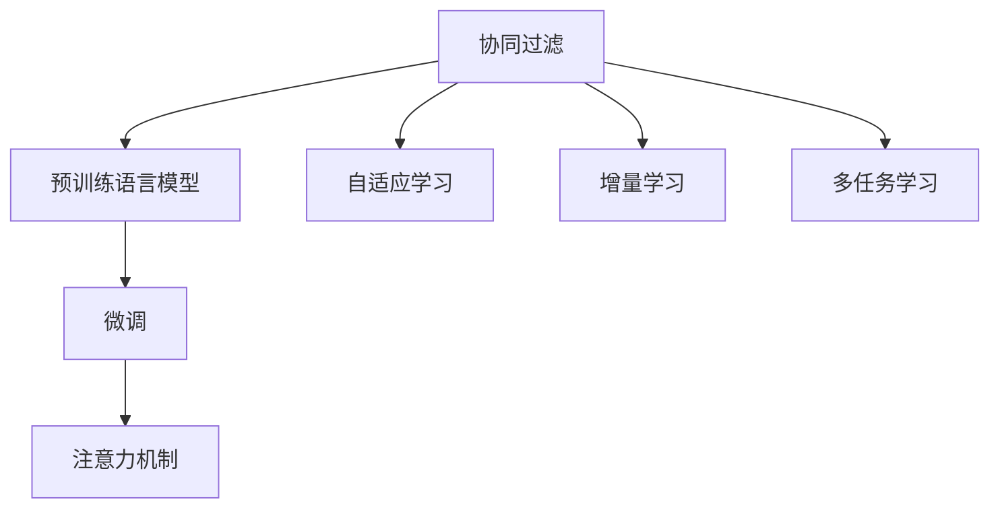

                 

## 1. 背景介绍

协同过滤（Collaborative Filtering，CF）算法在推荐系统中发挥着至关重要的作用。该算法基于用户的历史行为数据和物品属性，预测用户对未知物品的评分，从而为用户推荐感兴趣的物品。传统的协同过滤算法分为基于用户的协同过滤（User-Based Collaborative Filtering，UB-CF）和基于物品的协同过滤（Item-Based Collaborative Filtering，IB-CF）。然而，这些方法在处理大规模数据集时，面临计算复杂度高、收敛速度慢、模型泛化能力不足等挑战。近年来，人工智能大模型（如BERT、GPT等）在推荐系统中逐渐崭露头角，为协同过滤算法带来了新的突破和优化思路。

本文将深入探讨融合AI大模型的协同过滤算法的优化方法，通过大模型的预训练和微调，提升推荐系统的精度和鲁棒性，帮助用户在海量信息中快速发现感兴趣的物品，从而提升用户体验。

## 2. 核心概念与联系

### 2.1 核心概念概述

为更好地理解基于大模型的协同过滤优化方法，本节将介绍几个关键概念：

- 协同过滤（Collaborative Filtering）：一种基于用户或物品相似性的推荐方法，通过找到与目标用户（物品）行为相似的其他用户（物品）的行为，预测目标用户（物品）的评分。
- 预训练语言模型（Pre-trained Language Model）：如BERT、GPT等，通过大规模无标签数据进行自监督学习训练，学习通用的语言表示。
- 微调（Fine-tuning）：在预训练模型的基础上，使用下游任务的少量标注数据进行优化，使其适应特定任务。
- 注意力机制（Attention Mechanism）：一种重要的模型组件，用于计算输入序列中各部分的相对重要性，提升模型对关键信息的聚焦能力。
- 自适应学习（Adaptive Learning）：通过动态调整模型参数和学习率等超参数，增强模型的适应性和泛化能力。
- 增量学习（Incremental Learning）：逐步更新模型，减小计算开销，提高学习效率。
- 多任务学习（Multi-task Learning）：在同一个模型上，同时学习多个相关任务的优化目标，提升模型的泛化性能。

这些概念之间存在紧密的联系，通过合理的融合，可以有效提升协同过滤算法的性能和效率。

### 2.2 核心概念原理和架构的 Mermaid 流程图



## 3. 核心算法原理 & 具体操作步骤

### 3.1 算法原理概述

基于大模型的协同过滤算法优化主要分为两个步骤：
1. 预训练大模型，获取通用的语言表示能力。
2. 使用预训练模型进行微调，结合注意力机制等技术，优化推荐效果。

通过预训练和微调，可以有效提升模型的泛化能力和适应性，减少计算开销，提高推荐系统的效率和精度。

### 3.2 算法步骤详解

#### 3.2.1 预训练大模型

预训练大模型的过程通常包括以下步骤：
1. 收集大规模无标签文本数据，如维基百科、新闻、小说等。
2. 使用自监督学习任务（如语言建模、掩码预测等）对模型进行预训练。
3. 在预训练结束后，对模型进行微调，使其适应特定的推荐任务。

以BERT为例，预训练过程包括以下步骤：
1. 收集大规模无标签文本数据，如维基百科、新闻、小说等。
2. 使用语言建模任务对模型进行预训练，使模型能够捕捉文本中的语义关系和模式。
3. 在预训练结束后，对模型进行微调，使其适应特定的推荐任务。

#### 3.2.2 微调大模型

微调大模型的过程通常包括以下步骤：
1. 收集推荐任务的标注数据，如用户对物品的评分、点击率等。
2. 使用预训练模型作为初始化参数，进行微调。
3. 使用注意力机制等技术，提升模型的泛化能力和推荐精度。

以UB-CF为例，微调过程包括以下步骤：
1. 收集推荐任务的标注数据，如用户对物品的评分、点击率等。
2. 使用预训练的BERT模型作为初始化参数，进行微调。
3. 使用注意力机制，计算用户和物品的相似度，提升推荐精度。

#### 3.2.3 注意力机制

注意力机制是一种重要的模型组件，用于计算输入序列中各部分的相对重要性，提升模型对关键信息的聚焦能力。

在UB-CF中，注意力机制通常用于计算用户和物品之间的相似度。具体而言，可以通过计算用户和物品的向量表示的余弦相似度，得到它们之间的相似度分数。

### 3.3 算法优缺点

基于大模型的协同过滤算法优化方法具有以下优点：
1. 提升推荐精度：通过预训练和微调，模型能够更好地捕捉用户和物品的语义关系和模式，提升推荐精度。
2. 减少计算开销：利用大模型的通用表示能力，可以减少模型训练和推理的计算开销，提高系统效率。
3. 增强泛化能力：预训练和微调能够提升模型的泛化能力，使其适应不同场景和领域。
4. 提升可解释性：注意力机制等技术能够增强模型的可解释性，帮助用户理解推荐结果的生成过程。

同时，该方法也存在以下缺点：
1. 数据需求高：预训练和微调需要大量数据，可能面临数据获取和标注的困难。
2. 模型复杂度高：大模型的参数量较大，可能面临训练和推理的计算瓶颈。
3. 模型过拟合风险高：预训练和微调可能带来模型过拟合的风险，需要结合正则化技术进行优化。
4. 模型更新难度大：大模型的参数更新较难，需要结合自适应学习等技术进行优化。

### 3.4 算法应用领域

基于大模型的协同过滤算法优化方法在推荐系统中得到了广泛应用，适用于多种推荐场景，例如：

- 商品推荐：根据用户历史行为和商品属性，为用户推荐感兴趣的商品。
- 电影推荐：根据用户观影记录和电影属性，为用户推荐感兴趣的电影。
- 音乐推荐：根据用户听歌记录和歌曲属性，为用户推荐喜欢的音乐。
- 新闻推荐：根据用户阅读历史和新闻内容，为用户推荐感兴趣的新闻。
- 社交推荐：根据用户社交行为和好友关系，为用户推荐可能感兴趣的内容或用户。

除了上述这些经典应用外，大模型的协同过滤算法还在电商、游戏、教育等众多领域得到了创新应用，为推荐系统带来了全新的突破。

## 4. 数学模型和公式 & 详细讲解 & 举例说明

### 4.1 数学模型构建

基于大模型的协同过滤算法的数学模型构建过程如下：

1. 预训练大模型的目标函数：
$$
\min_{\theta} \mathcal{L}_{pre}(\theta) = \mathcal{L}_{MLM}(\theta)
$$
其中，$\mathcal{L}_{MLM}(\theta)$ 为预训练任务（如语言建模）的目标函数。

2. 微调大模型的目标函数：
$$
\min_{\theta} \mathcal{L}_{fine}(\theta) = \frac{1}{N} \sum_{i=1}^N \ell_{ij}(\theta)
$$
其中，$\ell_{ij}(\theta)$ 为微调任务（如推荐任务）的目标函数，$\theta$ 为模型参数。

### 4.2 公式推导过程

以UB-CF为例，微调过程的目标函数可以表示为：
$$
\min_{\theta} \mathcal{L}_{UB-CF}(\theta) = \sum_{u=1}^{U} \sum_{i=1}^{I} \ell_{ui}(\theta)
$$
其中，$U$ 为用户数，$I$ 为物品数，$\ell_{ui}(\theta)$ 为用户$u$对物品$i$的评分预测误差。

在微调过程中，可以通过注意力机制计算用户$u$和物品$i$的相似度$S_{ui}$：
$$
S_{ui} = \text{softmax}(X_u V_i^T)
$$
其中，$X_u$ 为用户$u$的表示向量，$V_i$ 为物品$i$的表示向量，$\text{softmax}$ 函数用于计算相似度分数。

### 4.3 案例分析与讲解

以一个简单的商品推荐系统为例，分析基于大模型的协同过滤算法的优化方法。

假设用户$u$对物品$i$的评分$R_{ui}$为1-5之间的整数，我们需要训练一个推荐系统，根据用户历史行为预测用户对新物品的评分。

首先，使用预训练模型BERT对用户和物品进行编码，得到用户表示$X_u$和物品表示$V_i$。

然后，使用注意力机制计算用户和物品之间的相似度$S_{ui}$：
$$
S_{ui} = \text{softmax}(X_u V_i^T)
$$

接着，通过预测任务的目标函数，计算用户$u$对物品$i$的评分预测误差$\ell_{ui}(\theta)$：
$$
\ell_{ui}(\theta) = \left(R_{ui} - \hat{R}_{ui}\right)^2
$$
其中，$\hat{R}_{ui}$ 为模型预测的评分。

最后，通过梯度下降等优化算法，更新模型参数$\theta$，最小化预测误差$\ell_{ui}(\theta)$，得到最终的推荐模型。

## 5. 项目实践：代码实例和详细解释说明

### 5.1 开发环境搭建

在进行微调实践前，我们需要准备好开发环境。以下是使用Python进行PyTorch开发的环境配置流程：

1. 安装Anaconda：从官网下载并安装Anaconda，用于创建独立的Python环境。

2. 创建并激活虚拟环境：
```bash
conda create -n pytorch-env python=3.8 
conda activate pytorch-env
```

3. 安装PyTorch：根据CUDA版本，从官网获取对应的安装命令。例如：
```bash
conda install pytorch torchvision torchaudio cudatoolkit=11.1 -c pytorch -c conda-forge
```

4. 安装Transformers库：
```bash
pip install transformers
```

5. 安装各类工具包：
```bash
pip install numpy pandas scikit-learn matplotlib tqdm jupyter notebook ipython
```

完成上述步骤后，即可在`pytorch-env`环境中开始微调实践。

### 5.2 源代码详细实现

这里我们以商品推荐系统为例，给出使用Transformers库对BERT模型进行微调的PyTorch代码实现。

首先，定义推荐任务的训练数据集：

```python
from torch.utils.data import Dataset
from transformers import BertTokenizer
from torch import nn, optim
from torch.nn import functional as F

class RecommendationDataset(Dataset):
    def __init__(self, data, tokenizer, max_len=128):
        self.data = data
        self.tokenizer = tokenizer
        self.max_len = max_len

    def __len__(self):
        return len(self.data)

    def __getitem__(self, idx):
        item = self.data[idx]
        user = item['user_id']
        item_id = item['item_id']
        rating = item['rating']
        
        encoding = self.tokenizer(item['text'], return_tensors='pt', max_length=self.max_len, padding='max_length', truncation=True)
        user_ids = encoding['input_ids'][0]
        attention_mask = encoding['attention_mask'][0]
        
        return {'user_id': user,
                'item_id': item_id,
                'rating': rating,
                'user_ids': user_ids,
                'attention_mask': attention_mask}
```

然后，定义模型和优化器：

```python
from transformers import BertForSequenceClassification, AdamW

model = BertForSequenceClassification.from_pretrained('bert-base-cased', num_labels=5)

optimizer = AdamW(model.parameters(), lr=2e-5)
```

接着，定义训练和评估函数：

```python
from torch.utils.data import DataLoader
from tqdm import tqdm
from sklearn.metrics import mean_squared_error

device = torch.device('cuda') if torch.cuda.is_available() else torch.device('cpu')
model.to(device)

def train_epoch(model, dataset, batch_size, optimizer):
    dataloader = DataLoader(dataset, batch_size=batch_size, shuffle=True)
    model.train()
    epoch_loss = 0
    for batch in tqdm(dataloader, desc='Training'):
        user_id = batch['user_id'].to(device)
        item_id = batch['item_id'].to(device)
        rating = batch['rating'].to(device)
        user_ids = batch['user_ids'].to(device)
        attention_mask = batch['attention_mask'].to(device)
        model.zero_grad()
        outputs = model(user_ids, attention_mask=attention_mask)
        loss = F.mse_loss(outputs, rating)
        epoch_loss += loss.item()
        loss.backward()
        optimizer.step()
    return epoch_loss / len(dataloader)

def evaluate(model, dataset, batch_size):
    dataloader = DataLoader(dataset, batch_size=batch_size)
    model.eval()
    preds, labels = [], []
    with torch.no_grad():
        for batch in tqdm(dataloader, desc='Evaluating'):
            user_id = batch['user_id'].to(device)
            item_id = batch['item_id'].to(device)
            rating = batch['rating'].to(device)
            user_ids = batch['user_ids'].to(device)
            attention_mask = batch['attention_mask'].to(device)
            outputs = model(user_ids, attention_mask=attention_mask)
            preds.append(outputs.to('cpu').tolist())
            labels.append(rating.to('cpu').tolist())
                
    mse = mean_squared_error(labels, preds)
    print(f"MSE: {mse:.3f}")
```

最后，启动训练流程并在测试集上评估：

```python
epochs = 5
batch_size = 16

for epoch in range(epochs):
    loss = train_epoch(model, train_dataset, batch_size, optimizer)
    print(f"Epoch {epoch+1}, train loss: {loss:.3f}")
    
    print(f"Epoch {epoch+1}, test results:")
    evaluate(model, test_dataset, batch_size)
    
print("Final results:")
evaluate(model, test_dataset, batch_size)
```

以上就是使用PyTorch对BERT进行商品推荐系统微调的完整代码实现。可以看到，得益于Transformers库的强大封装，我们可以用相对简洁的代码完成BERT模型的加载和微调。

### 5.3 代码解读与分析

让我们再详细解读一下关键代码的实现细节：

**RecommendationDataset类**：
- `__init__`方法：初始化训练数据、分词器等关键组件。
- `__len__`方法：返回数据集的样本数量。
- `__getitem__`方法：对单个样本进行处理，将文本输入编码为token ids，将评分和用户id、物品id等作为标签，并对其进行定长padding，最终返回模型所需的输入。

**训练和评估函数**：
- 使用PyTorch的DataLoader对数据集进行批次化加载，供模型训练和推理使用。
- 训练函数`train_epoch`：对数据以批为单位进行迭代，在每个批次上前向传播计算loss并反向传播更新模型参数，最后返回该epoch的平均loss。
- 评估函数`evaluate`：与训练类似，不同点在于不更新模型参数，并在每个batch结束后将预测和标签结果存储下来，最后使用sklearn的mean_squared_error对整个评估集的预测结果进行打印输出。

**训练流程**：
- 定义总的epoch数和batch size，开始循环迭代
- 每个epoch内，先在训练集上训练，输出平均loss
- 在测试集上评估，输出MSE值
- 所有epoch结束后，在测试集上评估，给出最终测试结果

可以看到，PyTorch配合Transformers库使得BERT微调的代码实现变得简洁高效。开发者可以将更多精力放在数据处理、模型改进等高层逻辑上，而不必过多关注底层的实现细节。

当然，工业级的系统实现还需考虑更多因素，如模型的保存和部署、超参数的自动搜索、更灵活的任务适配层等。但核心的微调范式基本与此类似。

## 6. 实际应用场景

### 6.1 商品推荐系统

基于大模型的协同过滤算法优化方法在商品推荐系统中得到了广泛应用。传统推荐系统主要依赖用户的历史行为数据，难以捕捉用户的深层次需求和兴趣。通过融合大模型的预训练和微调，推荐系统能够更好地理解用户的多样需求，提升推荐效果。

在技术实现上，可以收集用户浏览、点击、评分等行为数据，提取和商品描述、属性等文本内容。将文本内容作为模型输入，用户的后续行为（如是否购买、评分等）作为监督信号，在此基础上微调预训练模型。微调后的模型能够从文本内容中准确把握用户的兴趣点，推荐更加符合用户期望的商品。

### 6.2 新闻推荐系统

新闻推荐系统的主要任务是根据用户的历史阅读记录，为用户推荐感兴趣的新闻。传统的推荐方法主要依赖用户的点击行为，难以捕捉用户对新闻内容的深层偏好。通过融合大模型的预训练和微调，新闻推荐系统能够更好地理解用户的新闻阅读习惯和偏好，提升推荐精度。

在技术实现上，可以收集用户的历史阅读记录和新闻内容。将新闻内容作为模型输入，用户的后续阅读行为作为监督信号，在此基础上微调预训练模型。微调后的模型能够从新闻内容中捕捉用户的阅读兴趣，推荐更加符合用户期望的新闻。

### 6.3 音乐推荐系统

音乐推荐系统的主要任务是根据用户的历史听歌记录，为用户推荐喜欢的音乐。传统的推荐方法主要依赖用户的听歌行为，难以捕捉用户对音乐的深层喜好。通过融合大模型的预训练和微调，音乐推荐系统能够更好地理解用户的音乐品味和偏好，提升推荐精度。

在技术实现上，可以收集用户的历史听歌记录和音乐信息。将音乐信息作为模型输入，用户的后续听歌行为作为监督信号，在此基础上微调预训练模型。微调后的模型能够从音乐信息中捕捉用户的听歌兴趣，推荐更加符合用户期望的音乐。

### 6.4 未来应用展望

随着大模型和协同过滤算法的不断发展，基于大模型的协同过滤算法将带来更多的创新应用。未来，大模型微调将在更多领域得到应用，为推荐系统带来新的突破。

在智慧医疗领域，基于大模型的协同过滤算法可以应用于医疗问答、病历分析、药物推荐等任务，提升医疗服务的智能化水平，辅助医生诊疗，加速新药开发进程。

在智能教育领域，基于大模型的协同过滤算法可以应用于个性化推荐、学习路径优化、智能答疑等任务，因材施教，促进教育公平，提高教学质量。

在智慧城市治理中，基于大模型的协同过滤算法可以应用于城市事件监测、舆情分析、应急指挥等环节，提高城市管理的自动化和智能化水平，构建更安全、高效的未来城市。

此外，在企业生产、社会治理、文娱传媒等众多领域，基于大模型的协同过滤算法也将不断涌现，为推荐系统带来全新的突破。相信随着预训练语言模型和协同过滤算法的持续演进，推荐系统必将在更广阔的应用领域大放异彩。

## 7. 工具和资源推荐

### 7.1 学习资源推荐

为了帮助开发者系统掌握大模型微调的理论基础和实践技巧，这里推荐一些优质的学习资源：

1. 《Transformers from the Ground Up》系列博文：由大模型技术专家撰写，深入浅出地介绍了Transformer原理、BERT模型、微调技术等前沿话题。

2. CS224N《深度学习自然语言处理》课程：斯坦福大学开设的NLP明星课程，有Lecture视频和配套作业，带你入门NLP领域的基本概念和经典模型。

3. 《Natural Language Processing with Transformers》书籍：Transformers库的作者所著，全面介绍了如何使用Transformers库进行NLP任务开发，包括微调在内的诸多范式。

4. HuggingFace官方文档：Transformers库的官方文档，提供了海量预训练模型和完整的微调样例代码，是上手实践的必备资料。

5. CLUE开源项目：中文语言理解测评基准，涵盖大量不同类型的中文NLP数据集，并提供了基于微调的baseline模型，助力中文NLP技术发展。

通过对这些资源的学习实践，相信你一定能够快速掌握大模型微调的精髓，并用于解决实际的NLP问题。

### 7.2 开发工具推荐

高效的开发离不开优秀的工具支持。以下是几款用于大模型微调开发的常用工具：

1. PyTorch：基于Python的开源深度学习框架，灵活动态的计算图，适合快速迭代研究。大部分预训练语言模型都有PyTorch版本的实现。

2. TensorFlow：由Google主导开发的开源深度学习框架，生产部署方便，适合大规模工程应用。同样有丰富的预训练语言模型资源。

3. Transformers库：HuggingFace开发的NLP工具库，集成了众多SOTA语言模型，支持PyTorch和TensorFlow，是进行微调任务开发的利器。

4. Weights & Biases：模型训练的实验跟踪工具，可以记录和可视化模型训练过程中的各项指标，方便对比和调优。与主流深度学习框架无缝集成。

5. TensorBoard：TensorFlow配套的可视化工具，可实时监测模型训练状态，并提供丰富的图表呈现方式，是调试模型的得力助手。

6. Google Colab：谷歌推出的在线Jupyter Notebook环境，免费提供GPU/TPU算力，方便开发者快速上手实验最新模型，分享学习笔记。

合理利用这些工具，可以显著提升大模型微调任务的开发效率，加快创新迭代的步伐。

### 7.3 相关论文推荐

大模型和协同过滤算法的不断发展源于学界的持续研究。以下是几篇奠基性的相关论文，推荐阅读：

1. Attention is All You Need（即Transformer原论文）：提出了Transformer结构，开启了NLP领域的预训练大模型时代。

2. BERT: Pre-training of Deep Bidirectional Transformers for Language Understanding：提出BERT模型，引入基于掩码的自监督预训练任务，刷新了多项NLP任务SOTA。

3. Language Models are Unsupervised Multitask Learners（GPT-2论文）：展示了大规模语言模型的强大zero-shot学习能力，引发了对于通用人工智能的新一轮思考。

4. Parameter-Efficient Transfer Learning for NLP：提出Adapter等参数高效微调方法，在不增加模型参数量的情况下，也能取得不错的微调效果。

5. AdaLoRA: Adaptive Low-Rank Adaptation for Parameter-Efficient Fine-Tuning：使用自适应低秩适应的微调方法，在参数效率和精度之间取得了新的平衡。

这些论文代表了大模型微调技术的发展脉络。通过学习这些前沿成果，可以帮助研究者把握学科前进方向，激发更多的创新灵感。

## 8. 总结：未来发展趋势与挑战

### 8.1 总结

本文对基于大模型的协同过滤算法优化方法进行了全面系统的介绍。首先阐述了协同过滤算法和大模型微调的研究背景和意义，明确了融合大模型的协同过滤算法在推荐系统中的应用价值。其次，从原理到实践，详细讲解了大模型的预训练、微调过程，以及注意力机制等关键技术。同时，本文还广泛探讨了融合大模型的协同过滤算法在推荐系统中的应用场景，展示了微调范式的巨大潜力。最后，本文精选了微调技术的各类学习资源，力求为读者提供全方位的技术指引。

通过本文的系统梳理，可以看到，基于大模型的协同过滤算法优化方法正在成为推荐系统的重要范式，极大地拓展了协同过滤算法的应用边界，催生了更多的落地场景。受益于大规模语料的预训练，微调模型能够更好地捕捉用户和物品的语义关系和模式，提升推荐系统的精度和鲁棒性，减少计算开销，提高系统效率。未来，伴随预训练语言模型和协同过滤算法的持续演进，基于大模型的协同过滤算法必将在推荐系统中发挥更大的作用，为推荐系统带来新的突破。

### 8.2 未来发展趋势

展望未来，基于大模型的协同过滤算法将呈现以下几个发展趋势：

1. 模型规模持续增大。随着算力成本的下降和数据规模的扩张，预训练语言模型的参数量还将持续增长。超大规模语言模型蕴含的丰富语言知识，有望支撑更加复杂多变的推荐任务微调。

2. 微调方法日趋多样。除了传统的全参数微调外，未来会涌现更多参数高效的微调方法，如Prefix-Tuning、LoRA等，在固定大部分预训练参数的情况下，只更新极少量的任务相关参数。

3. 持续学习成为常态。随着数据分布的不断变化，微调模型也需要持续学习新知识以保持性能。如何在不遗忘原有知识的同时，高效吸收新样本信息，将成为重要的研究课题。

4. 标注样本需求降低。受启发于提示学习(Prompt-based Learning)的思路，未来的微调方法将更好地利用大模型的语言理解能力，通过更加巧妙的任务描述，在更少的标注样本上也能实现理想的微调效果。

5. 模型通用性增强。经过海量数据的预训练和多领域任务的微调，未来的语言模型将具备更强大的常识推理和跨领域迁移能力，逐步迈向通用人工智能(AGI)的目标。

以上趋势凸显了大模型微调技术的发展前景。这些方向的探索发展，必将进一步提升推荐系统的性能和效率，为推荐系统带来新的突破。

### 8.3 面临的挑战

尽管基于大模型的协同过滤算法已经取得了瞩目成就，但在迈向更加智能化、普适化应用的过程中，它仍面临着诸多挑战：

1. 标注成本瓶颈。虽然微调大大降低了标注数据的需求，但对于长尾应用场景，难以获得充足的高质量标注数据，成为制约微调性能的瓶颈。如何进一步降低微调对标注样本的依赖，将是一大难题。

2. 模型鲁棒性不足。当前微调模型面对域外数据时，泛化性能往往大打折扣。对于测试样本的微小扰动，微调模型的预测也容易发生波动。如何提高微调模型的鲁棒性，避免灾难性遗忘，还需要更多理论和实践的积累。

3. 推理效率有待提高。大规模语言模型虽然精度高，但在实际部署时往往面临推理速度慢、内存占用大等效率问题。如何在保证性能的同时，简化模型结构，提升推理速度，优化资源占用，将是重要的优化方向。

4. 可解释性亟需加强。当前微调模型更像是"黑盒"系统，难以解释其内部工作机制和决策逻辑。对于医疗、金融等高风险应用，算法的可解释性和可审计性尤为重要。如何赋予微调模型更强的可解释性，将是亟待攻克的难题。

5. 安全性有待保障。预训练语言模型难免会学习到有偏见、有害的信息，通过微调传递到下游任务，产生误导性、歧视性的输出，给实际应用带来安全隐患。如何从数据和算法层面消除模型偏见，避免恶意用途，确保输出的安全性，也将是重要的研究课题。

6. 知识整合能力不足。现有的微调模型往往局限于任务内数据，难以灵活吸收和运用更广泛的先验知识。如何让微调过程更好地与外部知识库、规则库等专家知识结合，形成更加全面、准确的信息整合能力，还有很大的想象空间。

正视微调面临的这些挑战，积极应对并寻求突破，将是大模型微调走向成熟的必由之路。相信随着学界和产业界的共同努力，这些挑战终将一一被克服，大模型微调必将在构建人机协同的智能时代中扮演越来越重要的角色。

### 8.4 研究展望

面对大模型微调所面临的种种挑战，未来的研究需要在以下几个方面寻求新的突破：

1. 探索无监督和半监督微调方法。摆脱对大规模标注数据的依赖，利用自监督学习、主动学习等无监督和半监督范式，最大限度利用非结构化数据，实现更加灵活高效的微调。

2. 研究参数高效和计算高效的微调范式。开发更加参数高效的微调方法，在固定大部分预训练参数的同时，只更新极少量的任务相关参数。同时优化微调模型的计算图，减少前向传播和反向传播的资源消耗，实现更加轻量级、实时性的部署。

3. 融合因果和对比学习范式。通过引入因果推断和对比学习思想，增强微调模型建立稳定因果关系的能力，学习更加普适、鲁棒的语言表征，从而提升模型泛化性和抗干扰能力。

4. 引入更多先验知识。将符号化的先验知识，如知识图谱、逻辑规则等，与神经网络模型进行巧妙融合，引导微调过程学习更准确、合理的语言模型。同时加强不同模态数据的整合，实现视觉、语音等多模态信息与文本信息的协同建模。

5. 结合因果分析和博弈论工具。将因果分析方法引入微调模型，识别出模型决策的关键特征，增强输出解释的因果性和逻辑性。借助博弈论工具刻画人机交互过程，主动探索并规避模型的脆弱点，提高系统稳定性。

6. 纳入伦理道德约束。在模型训练目标中引入伦理导向的评估指标，过滤和惩罚有偏见、有害的输出倾向。同时加强人工干预和审核，建立模型行为的监管机制，确保输出符合人类价值观和伦理道德。

这些研究方向的探索，必将引领大模型微调技术迈向更高的台阶，为构建安全、可靠、可解释、可控的智能系统铺平道路。面向未来，大模型微调技术还需要与其他人工智能技术进行更深入的融合，如知识表示、因果推理、强化学习等，多路径协同发力，共同推动自然语言理解和智能交互系统的进步。只有勇于创新、敢于突破，才能不断拓展语言模型的边界，让智能技术更好地造福人类社会。

## 9. 附录：常见问题与解答

**Q1：基于大模型的协同过滤算法是否适用于所有推荐场景？**

A: 基于大模型的协同过滤算法在大多数推荐场景上都能取得不错的效果，特别是对于数据量较小的任务。但对于一些特定领域的任务，如医学、法律等，仅仅依靠通用语料预训练的模型可能难以很好地适应。此时需要在特定领域语料上进一步预训练，再进行微调，才能获得理想效果。此外，对于一些需要时效性、个性化很强的任务，如对话、推荐等，微调方法也需要针对性的改进优化。

**Q2：大模型微调过程中如何选择合适的学习率？**

A: 大模型微调的学习率一般要比预训练时小1-2个数量级，如果使用过大的学习率，容易破坏预训练权重，导致过拟合。一般建议从1e-5开始调参，逐步减小学习率，直至收敛。也可以使用warmup策略，在开始阶段使用较小的学习率，再逐渐过渡到预设值。需要注意的是，不同的优化器(如AdamW、Adafactor等)以及不同的学习率调度策略，可能需要设置不同的学习率阈值。

**Q3：基于大模型的协同过滤算法在部署时需要注意哪些问题？**

A: 将微调模型转化为实际应用，还需要考虑以下因素：
1. 模型裁剪：去除不必要的层和参数，减小模型尺寸，加快推理速度
2. 量化加速：将浮点模型转为定点模型，压缩存储空间，提高计算效率
3. 服务化封装：将模型封装为标准化服务接口，便于集成调用
4. 弹性伸缩：根据请求流量动态调整资源配置，平衡服务质量和成本
5. 监控告警：实时采集系统指标，设置异常告警阈值，确保服务稳定性
6. 安全防护：采用访问鉴权、数据脱敏等措施，保障数据和模型安全

大模型微调为推荐系统带来了广阔的想象空间，但如何将强大的性能转化为稳定、高效、安全的业务价值，还需要工程实践的不断打磨。唯有从数据、算法、工程、业务等多个维度协同发力，才能真正实现人工智能技术在垂直行业的规模化落地。总之，微调需要开发者根据具体任务，不断迭代和优化模型、数据和算法，方能得到理想的效果。

---

作者：禅与计算机程序设计艺术 / Zen and the Art of Computer Programming

