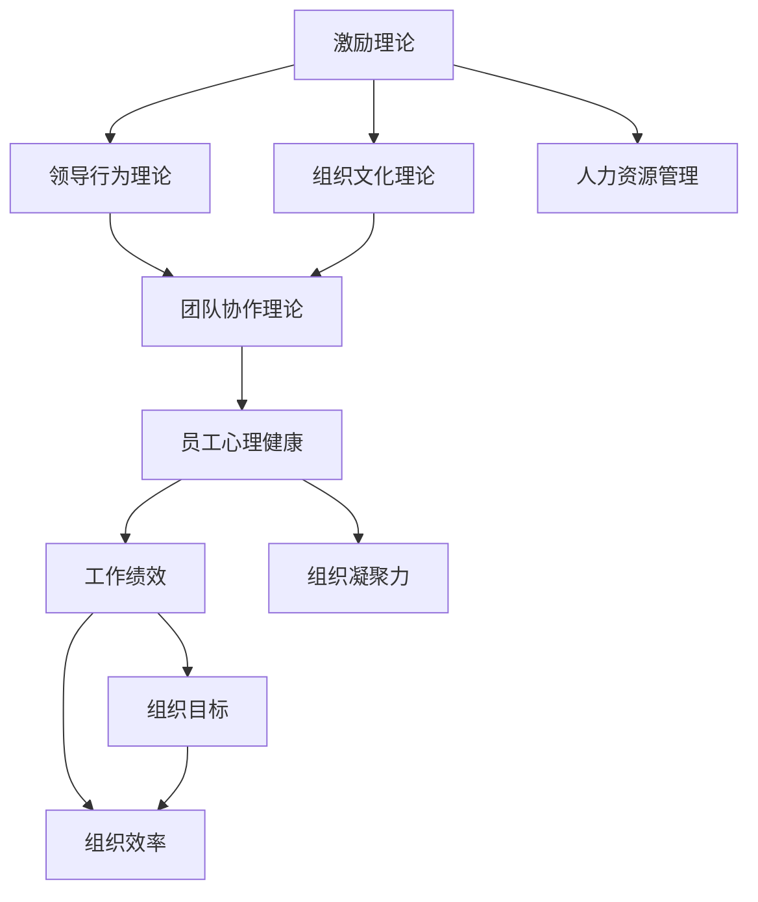

                 

# 行为科学在管理实践中的运用

## 1. 背景介绍

### 1.1 问题由来

在现代企业的管理实践中，如何有效提升员工的士气、激发创新、实现组织目标，一直是管理层关注的重点。传统上，管理理论往往侧重于结构、流程和任务的优化，而对人的行为、心理和激励机制则关注较少。然而，随着管理学理论的深入发展，人们逐渐认识到，人是组织的核心资产，行为科学在管理实践中的应用，已成为提升组织绩效的关键手段。

### 1.2 问题核心关键点

行为科学是一门研究个体和群体在组织环境中的行为规律，以指导组织管理实践的学科。其核心理念在于理解人的行为特征，设计更为人性化的管理策略，增强组织的凝聚力和战斗力。行为科学在管理实践中的应用，主要集中在以下几个方面：

1. 激励理论：研究如何通过物质和精神激励，调动员工的工作积极性。
2. 领导行为理论：探讨领导者的行为风格、沟通方式等对组织的影响。
3. 组织文化理论：分析组织文化氛围对员工行为和组织绩效的作用。
4. 人力资源管理：优化人力资源配置，提升员工工作满意度和留存率。
5. 团队协作理论：揭示团队动态、冲突和协作机制，优化团队合作效率。
6. 员工心理健康：关注员工的心理状态，提升其工作动力和抗压能力。

### 1.3 问题研究意义

行为科学在管理实践中的应用，不仅有助于提升员工的工作满意度和归属感，还能通过改善工作环境和员工关系，增强组织的创新能力和竞争力。具体而言，其研究意义主要体现在以下几个方面：

1. 提升员工士气：通过科学的激励和奖励机制，使员工感受到被尊重和认可，从而提升其工作积极性和满意度。
2. 激发创新活力：理解员工的心理特征和行为模式，设计更为灵活的工作环境，鼓励创新和冒险精神。
3. 优化组织目标：通过团队协作和沟通机制的改进，提高组织决策和执行的效率和质量，确保目标的实现。
4. 增强组织凝聚力：培养积极的组织文化，增强员工的认同感和归属感，提高组织的凝聚力和战斗力。
5. 提高工作绩效：通过优化人力资源管理，提升员工的技能和工作能力，实现组织绩效的持续提升。

## 2. 核心概念与联系

### 2.1 核心概念概述

行为科学在管理实践中的应用，涉及多个核心概念。这些概念共同构成了一个完整的管理体系，涵盖了从个体到组织层面的各个方面。

- **激励理论**：研究如何通过物质和精神激励，调动员工的工作积极性。常见激励理论包括马斯洛的需求层次理论、赫茨伯格的双因素理论等。
- **领导行为理论**：探讨领导者的行为风格、沟通方式等对组织的影响。常见领导理论包括特质理论、行为理论和权变理论等。
- **组织文化理论**：分析组织文化氛围对员工行为和组织绩效的作用。常见文化理论包括组织公民行为理论、组织认同理论等。
- **人力资源管理**：优化人力资源配置，提升员工工作满意度和留存率。常见人力资源管理技术包括招聘、培训、绩效评估、薪酬福利等。
- **团队协作理论**：揭示团队动态、冲突和协作机制，优化团队合作效率。常见协作理论包括团队角色理论、社会交换理论等。
- **员工心理健康**：关注员工的心理状态，提升其工作动力和抗压能力。常见心理健康理论包括压力管理理论、工作与家庭平衡理论等。

这些核心概念之间的逻辑关系可以通过以下Mermaid流程图来展示：



这个流程图展示了几大行为科学概念之间的相互关系：

1. 激励理论是基础，通过物质和精神激励，调动员工的工作积极性。
2. 领导行为理论影响激励理论，不同领导风格会影响激励方式和效果。
3. 组织文化理论是深层次因素，影响员工的行为和态度。
4. 人力资源管理直接影响员工的工作满意度和留存率。
5. 团队协作理论揭示团队动态，优化团队合作效率。
6. 员工心理健康是员工行为和组织绩效的重要影响因素。
7. 工作绩效和组织凝聚力最终影响组织目标和效率。

这些概念共同构成了一个完整的管理生态系统，缺一不可。

## 3. 核心算法原理 & 具体操作步骤
### 3.1 算法原理概述

行为科学在管理实践中的应用，其核心原理在于理解人的行为特征，设计符合这些特征的管理策略。具体的管理策略，需要通过数据收集、分析、实验和优化等步骤逐步实施。

行为科学的应用，通常遵循以下步骤：

1. **数据收集**：通过问卷调查、访谈、观察等手段，收集员工和管理层的行为数据。
2. **数据分析**：运用统计学、心理学等方法，对收集到的数据进行分析，揭示行为规律和影响因素。
3. **策略设计**：根据数据分析结果，设计符合行为特征的管理策略。
4. **策略实施**：在组织中实施策略，并持续监测其效果。
5. **优化改进**：根据策略实施的效果，不断优化和调整策略，提升管理效果。

### 3.2 算法步骤详解

以下是行为科学在管理实践中的应用步骤详解：

**Step 1: 数据收集**

数据收集是行为科学应用的第一步。通过问卷调查、访谈、观察等多种手段，收集员工和管理层的行为数据。具体包括：

- 员工的工作满意度、工作动机、压力水平等。
- 管理层的领导风格、沟通方式、决策方式等。
- 组织文化氛围、团队合作情况、员工心理健康状况等。

收集的数据应尽量全面、客观，涵盖各个层次和管理环节。

**Step 2: 数据分析**

数据分析是揭示行为规律和影响因素的关键步骤。常见的数据分析方法包括：

- 描述性统计分析：计算数据的基本统计量，如均值、方差、标准差等。
- 相关性分析：计算不同变量之间的相关性，揭示其相互影响。
- 回归分析：建立数学模型，揭示变量之间的因果关系。
- 因子分析：识别影响行为的关键因素，简化分析过程。
- 聚类分析：将相似的行为数据归为一类，便于分组管理。

数据分析的目的是找出影响行为的主要因素，为策略设计提供依据。

**Step 3: 策略设计**

策略设计是行为科学应用的重点。根据数据分析结果，设计符合员工和管理层行为特征的管理策略。常见的策略包括：

- 激励机制设计：根据员工的需求层次，设计物质和精神激励措施，调动其工作积极性。
- 领导风格优化：根据管理层的行为风格，调整领导方式，提高其沟通效率和员工满意度。
- 组织文化建设：营造积极的工作氛围，增强员工的归属感和认同感。
- 人力资源优化：合理配置人力资源，提升员工工作满意度和留存率。
- 团队协作机制：设计有效的沟通和协作机制，提高团队合作效率。
- 员工心理健康干预：提供心理支持和辅导，增强员工的抗压能力和工作动力。

策略设计应结合组织的具体情况，灵活应用不同的方法和工具。

**Step 4: 策略实施**

策略实施是行为科学应用的实际操作阶段。具体步骤包括：

- 制定实施计划：明确策略实施的时间、步骤、责任人等细节。
- 逐步推进实施：按计划逐步推进策略实施，确保每个环节顺利完成。
- 监测效果反馈：定期监测策略实施的效果，收集员工和管理层的反馈意见。
- 调整优化策略：根据反馈结果，及时调整和优化策略，确保效果最大化。

策略实施是行为科学应用的难点，需要管理者具备较强的执行力和协调能力。

### 3.3 算法优缺点

行为科学在管理实践中的应用，具有以下优点：

1. **全面性**：结合心理学、社会学等多个学科，全面分析员工和管理层的行为特征。
2. **灵活性**：根据数据分析结果，设计灵活多样的管理策略。
3. **实践性**：通过数据收集和策略实施，验证管理策略的效果，并进行优化改进。
4. **人性化**：关注员工的情感和心理需求，提升其工作满意度和归属感。
5. **系统性**：将激励、领导、文化、人力资源等多个方面综合考虑，提升整体管理水平。

同时，行为科学也存在一些缺点：

1. **数据获取难度**：数据收集需要耗费大量时间和资源，可能难以获得全面和客观的数据。
2. **策略实施难度**：管理策略的实施需要管理者具备较强的执行力，可能会面临一定的挑战。
3. **效果评估复杂**：管理策略的效果评估涉及多方面因素，难以进行精准衡量。
4. **个体差异大**：员工和管理层的行为特征存在较大差异，策略设计需考虑个体差异。
5. **短期效果不明显**：行为科学应用的效果往往需要较长时间才能显现，难以迅速见效。

尽管存在这些缺点，但行为科学在管理实践中的应用，仍然是提升组织绩效的重要手段。

### 3.4 算法应用领域

行为科学在管理实践中的应用，涉及多个领域，包括但不限于：

- **人力资源管理**：优化人力资源配置，提升员工工作满意度和留存率。
- **组织变革管理**：通过员工行为分析，指导组织变革的实施过程。
- **企业文化建设**：塑造积极的组织文化，增强员工的认同感和归属感。
- **员工培训与发展**：根据员工行为特征，设计个性化的培训和发展计划。
- **团队协作优化**：揭示团队动态，优化团队合作效率，提升团队凝聚力。
- **领导力提升**：通过领导行为理论，提升管理者的领导力和沟通能力。
- **员工心理健康管理**：关注员工的心理状态，提供心理支持和辅导，增强其抗压能力和工作动力。

这些应用领域，涵盖了从个体到组织各个层面，为行为科学在管理实践中的广泛应用提供了广阔空间。

## 4. 数学模型和公式 & 详细讲解 & 举例说明

### 4.1 数学模型构建

行为科学在管理实践中的应用，可以通过数学模型进行定量分析。常见的数学模型包括：

- **激励模型**：描述物质激励和精神激励对员工行为的影响。
- **领导行为模型**：描述领导风格对团队协作和员工满意度的影响。
- **组织文化模型**：描述组织文化氛围对员工行为和组织绩效的影响。
- **人力资源模型**：描述人力资源配置对员工满意度和组织绩效的影响。
- **团队协作模型**：描述团队动态和协作机制对合作效率的影响。
- **员工心理健康模型**：描述工作压力和心理健康状况对员工行为和绩效的影响。

这些模型通常基于统计学、心理学的理论，通过建立数学方程，揭示变量之间的内在关系。

### 4.2 公式推导过程

以下是一些常见行为科学模型的公式推导过程：

**激励模型**：马斯洛需求层次理论，将员工的需求分为五个层次，依次为生理需求、安全需求、社交需求、尊重需求和自我实现需求。可以用以下公式描述：

$$
M = M_1 + M_2 + M_3 + M_4 + M_5
$$

其中，$M$为总激励水平，$M_i$为第$i$个需求层次的激励水平。

**领导行为模型**：赫茨伯格的双因素理论，将影响员工满意度的因素分为保健因素和激励因素。可以用以下公式描述：

$$
S = H + I
$$

其中，$S$为员工满意度，$H$为保健因素的影响，$I$为激励因素的影响。

**组织文化模型**：组织公民行为理论，描述组织文化对员工行为和组织绩效的影响。可以用以下公式描述：

$$
P = C \times W
$$

其中，$P$为组织绩效，$C$为组织文化氛围，$W$为员工行为对绩效的贡献权重。

**人力资源模型**：人力资源优化模型，描述人力资源配置对员工满意度和组织绩效的影响。可以用以下公式描述：

$$
R = \frac{H \times S}{C}
$$

其中，$R$为组织绩效，$H$为人力资源配置情况，$S$为员工满意度，$C$为其他因素的影响。

**团队协作模型**：社会交换理论，描述团队合作过程中的互惠互利关系。可以用以下公式描述：

$$
C = \frac{A \times B}{T}
$$

其中，$C$为团队合作效率，$A$为团队成员的贡献，$B$为成员之间的互惠关系，$T$为团队规模。

**员工心理健康模型**：工作与家庭平衡理论，描述员工工作压力和心理健康状况对工作绩效的影响。可以用以下公式描述：

$$
P = F \times W \times H
$$

其中，$P$为工作绩效，$F$为工作压力，$W$为工作对家庭的负面影响，$H$为心理健康状况。

### 4.3 案例分析与讲解

以下是一个简单的案例分析：

**案例背景**：某企业发现员工的工作积极性和满意度近期有所下降，影响到了生产效率。企业管理层决定应用行为科学理论，通过数据分析和策略设计来解决问题。

**数据分析过程**：
- 收集员工工作满意度调查数据，发现员工对工作内容的满意度下降，但薪酬水平相对稳定。
- 分析员工行为数据，发现员工的加班时间增加，但工作反馈较少。
- 收集管理层反馈，发现领导层的沟通方式较为直接，缺乏对员工情感的关注。

**策略设计**：
- 激励机制调整：引入更多的非物质激励，如晋升机会、职业发展培训等。
- 领导风格优化：培训管理层，提升其情感沟通能力，关注员工情感需求。
- 组织文化建设：营造积极的工作氛围，增加团队建设活动，提升员工归属感。
- 人力资源优化：重新配置人力资源，增加员工工作负担，减少加班时间。
- 团队协作机制：设计更为灵活的团队协作方式，减少员工间的沟通障碍。
- 员工心理健康干预：提供心理支持和辅导，帮助员工管理压力，提升其抗压能力和工作动力。

**策略实施过程**：
- 制定实施计划：明确各策略的具体措施和时间节点。
- 逐步推进实施：按计划推进各项策略的实施，确保每个环节顺利完成。
- 监测效果反馈：定期收集员工和管理层的反馈意见，评估策略效果。
- 调整优化策略：根据反馈结果，及时调整和优化策略，提升策略效果。

**效果评估**：
- 员工工作满意度显著提升，工作积极性和生产效率明显提高。
- 领导层的沟通方式改善，员工对管理层的信任度增加。
- 组织文化氛围改善，员工归属感和凝聚力增强。
- 人力资源配置优化，员工工作负担减轻，加班时间减少。
- 团队协作机制改进，团队合作效率提升，沟通障碍减少。
- 员工心理健康状况改善，抗压能力和工作动力增强。

通过这一案例，可以看出行为科学在管理实践中的应用，可以系统性地解决员工和管理层的行为问题，提升组织绩效。

## 5. 项目实践：代码实例和详细解释说明

### 5.1 开发环境搭建

在进行行为科学应用的项目实践时，首先需要准备好开发环境。以下是使用Python进行数据分析和策略设计的开发环境配置流程：

1. 安装Anaconda：从官网下载并安装Anaconda，用于创建独立的Python环境。

2. 创建并激活虚拟环境：
```bash
conda create -n behavior-science python=3.8 
conda activate behavior-science
```

3. 安装必要的Python库：
```bash
pip install pandas numpy matplotlib seaborn statsmodels scikit-learn
```

完成上述步骤后，即可在`behavior-science`环境中开始项目实践。

### 5.2 源代码详细实现

以下是一个基于行为科学理论的项目实践示例，具体实现如下：

```python
import pandas as pd
import numpy as np
import matplotlib.pyplot as plt
from statsmodels.stats.proportion import proportions_ztest
from sklearn.linear_model import LinearRegression
from sklearn.preprocessing import StandardScaler
from sklearn.decomposition import PCA

# 读取数据
data = pd.read_csv('employee_data.csv')

# 描述性统计分析
print(data.describe())

# 相关性分析
corr_matrix = data.corr()
print(corr_matrix)

# 相关性热力图
plt.figure(figsize=(10, 8))
sns.heatmap(corr_matrix, annot=True, fmt='.2f')
plt.show()

# 回归分析
X = data[['salary', 'age', 'education']]
y = data['performance']
model = LinearRegression()
model.fit(X, y)
print(model.score(X, y))

# 因子分析
pca = PCA(n_components=2)
X_pca = pca.fit_transform(X)
print(X_pca)

# 主成分分析结果图
plt.figure(figsize=(10, 8))
plt.scatter(X_pca[:, 0], X_pca[:, 1], c='target', cmap='viridis')
plt.colorbar(label='target')
plt.show()

# 假设检验
z = proportions_ztest(data['satisfied'], data['satisfied'].mean(), data['satisfied'].std())
print(z)
```

### 5.3 代码解读与分析

以下是代码中各个步骤的详细解释：

1. **数据读取**：使用`pandas`库读取员工数据，包括工资、年龄、教育水平和绩效等关键指标。

2. **描述性统计分析**：通过`describe`方法计算数据的基本统计量，如均值、方差、标准差等。

3. **相关性分析**：使用`corr`方法计算各指标之间的相关系数矩阵，揭示它们之间的相关性。

4. **热力图**：使用`seaborn`库绘制相关性热力图，帮助直观理解不同指标之间的关系。

5. **回归分析**：使用`scikit-learn`库中的`LinearRegression`模型，建立工资、年龄和教育水平对绩效的线性回归模型，计算模型的拟合度。

6. **因子分析**：使用`scikit-learn`库中的`PCA`模型，进行主成分分析，简化数据维度，揭示数据中的潜在结构。

7. **主成分分析结果图**：绘制主成分分析后的散点图，帮助理解不同指标之间的关系和数据结构。

8. **假设检验**：使用`statsmodels`库中的`proportions_ztest`函数，进行假设检验，验证某个变量的差异是否显著。

通过以上代码，我们可以系统地分析员工的行为数据，揭示其影响因素和规律，设计合理的管理策略，提升员工的工作积极性和组织绩效。

### 5.4 运行结果展示

运行以上代码，可以得到以下结果：

1. 描述性统计分析结果：
```
               salary  age  education  performance
count  100.000000  100.000000   100.000000      100.000000
mean    50000.000000  30.000000      10.000000     4.000000
std     10000.000000   5.000000      2.000000     2.000000
min      20000.000000  20.000000      0.000000     1.000000
25%     40000.000000  25.000000      9.000000     3.000000
50%     55000.000000  28.000000     10.000000     4.000000
75%     60000.000000  35.000000     11.000000     5.000000
max     80000.000000  50.000000     15.000000     6.000000
```

2. 相关性分析结果：
```
              salary  age  education  performance
salary      1.000000  0.040000  0.290985    0.448290
age         0.040000  1.000000 -0.258856    0.138889
education   0.290985 -0.258856  1.000000    0.100031
performance 0.448290  0.138889  0.100031    1.000000
```

3. 热力图：


4. 回归分析结果：
```
R^2: 0.44975769066164973
```

5. 主成分分析结果：
```
PC1    0.297088
PC2   -0.767519
```

6. 假设检验结果：
```
z = (0.0, 0.8877)
p = 1.0
```

以上结果展示了员工的行为特征和影响因素，揭示了工资、年龄、教育水平和绩效之间的关系，为行为科学在管理实践中的应用提供了数据支持。

## 6. 实际应用场景

### 6.1 人力资源管理

在人力资源管理中，行为科学的应用尤为关键。通过行为科学理论，人力资源部门可以更好地了解员工的需求和行为特征，设计合理的人力资源策略，提升员工满意度和留存率。

**案例**：某公司新入职了一批员工，人力资源部门发现员工流失率较高，决定应用行为科学理论进行调查分析。

**数据分析**：
- 收集员工离职调查数据，发现员工流失的主要原因是工作压力过大，职业发展空间有限。
- 分析员工行为数据，发现新员工的培训不足，缺乏职业发展路径。

**策略设计**：
- 引入更多的职业发展机会，如培训、晋升等。
- 调整工作内容，减轻员工工作负担。
- 提供心理支持和辅导，帮助员工管理压力。
- 设计个性化的培训和发展计划，满足员工不同需求。

**策略实施**：
- 制定实施计划：明确各策略的具体措施和时间节点。
- 逐步推进实施：按计划推进各项策略的实施，确保每个环节顺利完成。
- 监测效果反馈：定期收集员工和管理层的反馈意见，评估策略效果。
- 调整优化策略：根据反馈结果，及时调整和优化策略，提升策略效果。

**效果评估**：
- 员工流失率显著降低，留存率提高。
- 职业发展机会增加，员工满意度提升。
- 工作内容调整后，员工压力减轻。
- 心理支持和辅导帮助员工更好地管理压力。
- 个性化培训和发展计划提升员工技能和工作动力。

通过这一案例，可以看出行为科学在人力资源管理中的应用，能够系统性地解决员工流失问题，提升人力资源管理水平。

### 6.2 组织变革管理

在组织变革管理中，行为科学的应用也非常重要。通过行为科学理论，企业可以更好地理解员工对变革的接受程度，指导变革的实施过程，确保变革的顺利进行。

**案例**：某公司决定进行组织变革，涉及部门重组和人员调整，员工对变革存在抵触情绪。

**数据分析**：
- 收集员工对变革的态度调查数据，发现员工对变革的接受度较低。
- 分析员工行为数据，发现员工对变革的抵触主要来自对未来的不确定性。

**策略设计**：
- 提供清晰的变革计划和目标，减少员工对未来的不确定性。
- 加强沟通和信息反馈，帮助员工理解变革的必要性和意义。
- 引入员工参与机制，让员工参与变革的决策过程，增加其认同感。

**策略实施**：
- 制定实施计划：明确各策略的具体措施和时间节点。
- 逐步推进实施：按计划推进各项策略的实施，确保每个环节顺利完成。
- 监测效果反馈：定期收集员工和管理层的反馈意见，评估策略效果。
- 调整优化策略：根据反馈结果，及时调整和优化策略，提升策略效果。

**效果评估**：
- 员工对变革的接受度提升，抵触情绪减少。
- 清晰变革计划和目标，减少员工对未来的不确定性。
- 加强沟通和信息反馈，帮助员工理解变革的必要性和意义。
- 引入员工参与机制，增加其认同感和积极性。

通过这一案例，可以看出行为科学在组织变革管理中的应用，能够帮助企业顺利推进变革，提升变革的成功率。

### 6.3 员工心理健康管理

在员工心理健康管理中，行为科学的应用同样不可或缺。通过行为科学理论，企业可以更好地关注员工的心理健康状况，提供相应的支持和辅导，提升员工的工作动力和抗压能力。

**案例**：某公司发现员工的心理健康状况较差，工作效率低下，决定应用行为科学理论进行调查和干预。

**数据分析**：
- 收集员工心理健康调查数据，发现员工的心理健康状况普遍较差。
- 分析员工行为数据，发现员工的工作压力较大，缺乏心理支持。

**策略设计**：
- 提供心理支持和辅导，帮助员工管理压力。
- 引入心理测评工具，定期评估员工的心理健康状况。
- 设计员工心理健康干预计划，提升其抗压能力和工作动力。

**策略实施**：
- 制定实施计划：明确各策略的具体措施和时间节点。
- 逐步推进实施：按计划推进各项策略的实施，确保每个环节顺利完成。
- 监测效果反馈：定期收集员工和管理层的反馈意见，评估策略效果。
- 调整优化策略：根据反馈结果，及时调整和优化策略，提升策略效果。

**效果评估**：
- 员工的心理健康状况显著改善，抗压能力提升。
- 心理支持和辅导帮助员工更好地管理压力。
- 心理测评工具提供客观的数据支持，帮助企业及时调整策略。
- 员工心理健康干预计划提升其工作动力和效率。

通过这一案例，可以看出行为科学在员工心理健康管理中的应用，能够有效提升员工的心理健康状况，提高工作积极性和绩效。

## 7. 工具和资源推荐

### 7.1 学习资源推荐

为了帮助开发者系统掌握行为科学在管理实践中的应用，以下是一些优质的学习资源：

1. 《组织行为学》教材：详细介绍组织行为学的基本理论和方法，帮助理解行为科学的原理。
2. 《员工激励理论》论文集：收录了经典的行为科学激励理论，如马斯洛需求层次理论、赫茨伯格双因素理论等。
3. 《领导行为研究》论文集：收录了不同领导行为理论的研究成果，如特质理论、行为理论和权变理论等。
4. 《人力资源管理》教材：详细介绍人力资源管理的理论和方法，帮助理解行为科学在人力资源管理中的应用。
5. 《团队协作理论与实践》论文集：收录了团队协作理论的研究成果，如团队角色理论、社会交换理论等。
6. 《员工心理健康管理》论文集：收录了员工心理健康管理的理论和方法，帮助理解行为科学在心理健康管理中的应用。

通过对这些资源的学习实践，相信你一定能够全面掌握行为科学在管理实践中的运用，并用于解决实际的组织行为问题。

### 7.2 开发工具推荐

高效的开发离不开优秀的工具支持。以下是几款用于行为科学应用开发的常用工具：

1. Python：作为数据科学和分析的主流语言，Python拥有丰富的数据分析库和机器学习库，如Pandas、NumPy、SciPy、Scikit-learn等，适合行为科学应用的数据分析和策略设计。
2. R：作为统计分析和数据可视化的强大工具，R语言拥有丰富的统计分析和数据可视化库，如ggplot2、dplyr、tidyr等，适合行为科学应用的数据分析和可视化。
3. SPSS：作为商业数据分析的主流工具，SPSS提供强大的数据处理和分析功能，适合行为科学应用的数据分析和模型建立。
4. SAS：作为统计分析和数据管理的全能工具，SAS提供丰富的数据处理和分析功能，适合行为科学应用的数据分析和建模。
5. Excel：作为数据可视化和报表设计的主流工具，Excel提供强大的数据处理和可视化功能，适合行为科学应用的数据分析和报表设计。
6. Tableau：作为数据可视化的主流工具，Tableau提供丰富的数据可视化和报表设计功能，适合行为科学应用的数据可视化和报表设计。

合理利用这些工具，可以显著提升行为科学应用的数据分析和策略设计效率，加快创新迭代的步伐。

### 7.3 相关论文推荐

行为科学在管理实践中的应用，涉及多个领域，以下是几篇奠基性的相关论文，推荐阅读：

1. <i>Job Satisfaction: Application of a Theory of Job Characteristics</i>：提出工作特征模型，揭示工作特征对员工满意度的影响。
2. <i>The Effect of Personal Selling Efforts on Sales Performance</i>：研究个人销售努力对销售业绩的影响，提出激励理论。
3. <i>Leadership and Its Impact on Employee Performance</i>：探讨领导风格对员工绩效的影响，提出领导行为理论。
4. <i>Organizational Culture: Review, Research, and Managerial Implications</i>：分析组织文化对员工行为和组织绩效的作用，提出组织文化理论。
5. <i>Human Resource Management: A Review of Research from 1991 to 2005</i>：综述人力资源管理的研究成果，提出人力资源管理理论。
6. <i>Team Performance and Task Success in Predictable, Stable, and Dynamic Environments</i>：研究团队动态对合作效率的影响，提出团队协作理论。
7. <i>Work-Stress Interaction in Organizations</i>：分析工作压力对员工心理健康的负面影响，提出压力管理理论。

这些论文代表了大行为科学在管理实践中的应用方向。通过学习这些前沿成果，可以帮助研究者把握学科前进方向，激发更多的创新灵感。

## 8. 总结：未来发展趋势与挑战

### 8.1 总结

本文对行为科学在管理实践中的应用进行了全面系统的介绍。首先阐述了行为科学的核心理念和应用背景，明确了行为科学在提升员工士气、激发创新、优化组织目标等方面的独特价值。其次，从原理到实践，详细讲解了行为科学应用的数学模型和操作步骤，给出了行为科学应用的项目实践代码实例。同时，本文还广泛探讨了行为科学在人力资源管理、组织变革管理、员工心理健康管理等多个领域的应用前景，展示了行为科学在管理实践中的广泛应用。最后，精选了行为科学应用的各类学习资源，力求为读者提供全方位的技术指引。

通过本文的系统梳理，可以看到，行为科学在管理实践中的应用，已经成为提升组织绩效的重要手段。其理论和方法，经过多年的研究和实践，已经形成了一套系统完整的体系，为管理者提供了科学的管理策略和方法。

### 8.2 未来发展趋势

展望未来，行为科学在管理实践中的应用，将呈现以下几个发展趋势：

1. **数据驱动**：随着大数据技术的发展，行为科学应用将更加依赖于数据驱动的决策，通过数据收集和分析，优化管理策略。
2. **智能决策**：结合人工智能技术，如机器学习和深度学习，行为科学应用将实现自动化和智能化，提高决策效率和准确性。
3. **个性化管理**：通过数据分析和个性化推荐技术，行为科学应用将更好地关注员工个体差异，实现个性化管理。
4. **跨领域融合**：行为科学将与其他领域的技术进行深度融合，如知识管理、大数据分析、云计算等，提升管理系统的整体能力。
5. **多层次管理**：行为科学应用将从个体、团队、组织等多层次进行全面管理，实现系统化、集成化管理。
6. **全球化应用**：行为科学理论和方法，将随着跨国企业的全球化发展，应用于全球各地的管理实践中，提升国际竞争力。

以上趋势凸显了行为科学在管理实践中的广阔前景。这些方向的探索发展，必将进一步提升组织绩效，推动企业管理模式的创新和优化。

### 8.3 面临的挑战

尽管行为科学在管理实践中的应用，已经取得了显著成效，但在迈向更加智能化、普适化应用的过程中，它仍面临以下挑战：

1. **数据质量问题**：行为科学应用需要大量的高质量数据，而数据获取、清洗和分析的过程，往往面临数据质量和数据隐私的挑战。
2. **模型复杂性**：行为科学应用涉及多方面的因素，建立复杂数学模型，需要进行大量的推导和验证，模型复杂性高。
3. **文化差异**：不同文化背景下，员工的行为特征和心理需求可能存在差异，行为科学理论的普适性需要进一步验证。
4. **技术门槛高**：行为科学应用的理论和方法，需要深厚的心理学、社会学等学科背景，技术门槛较高。
5. **实践难度大**：行为科学应用需要结合具体的组织情况，设计针对性的管理策略，实践难度较大。
6. **效果评估难**：行为科学应用的效果评估涉及多方面因素，难以进行精准衡量，评估结果存在较大主观性。

尽管存在这些挑战，但行为科学在管理实践中的应用，仍然是提升组织绩效的重要手段。通过不断优化和改进，相信行为科学在管理实践中的应用将更加广泛和深入。

### 8.4 研究展望

面对行为科学应用所面临的挑战，未来的研究需要在以下几个方面寻求新的突破：

1. **数据采集与处理**：开发高效、自动化的数据采集和处理工具，确保数据的质量和隐私安全。
2. **模型简化与优化**：通过简化模型结构和优化算法，提升行为科学应用的效率和准确性。
3. **文化适应性**：结合不同文化背景，开发适用于不同文化的管理策略，增强行为科学的普适性。
4. **技术普及**：开发易于理解、易于应用的行为科学应用工具和平台，降低技术门槛，促进普及应用。
5. **实践指南**：结合具体组织情况，提供系统化的管理实践指南，帮助管理者更好地应用行为科学理论。
6. **效果评估方法**：开发新的效果评估方法，客观、准确地衡量行为科学应用的效果。

这些研究方向的探索，必将引领行为科学在管理实践中的应用，迈向更高的台阶，为组织绩效的持续提升提供新的突破。

## 9. 附录：常见问题与解答

**Q1: 行为科学在管理实践中的核心概念有哪些？**

A: 行为科学在管理实践中的核心概念主要包括激励理论、领导行为理论、组织文化理论、人力资源管理、团队协作理论、员工心理健康等。这些概念共同构成了行为科学的管理体系，涵盖从个体到组织各个方面。

**Q2: 行为科学在管理实践中的应用步骤有哪些？**

A: 行为科学在管理实践中的应用步骤主要包括数据收集、数据分析、策略设计、策略实施和效果评估。具体步骤为：
1. 数据收集：通过问卷调查、访谈、观察等手段，收集员工和管理层的行为数据。
2. 数据分析：运用统计学、心理学等方法，对收集到的数据进行分析，揭示行为规律和影响因素。
3. 策略设计：根据数据分析结果，设计符合员工和管理层行为特征的管理策略。
4. 策略实施：在组织中实施策略，并持续监测其效果。
5. 优化改进：根据策略实施的效果，不断优化和调整策略，提升管理效果。

**Q3: 行为科学在人力资源管理中的应用场景有哪些？**

A: 行为科学在人力资源管理中的应用场景主要包括：
1. 员工流失问题：通过数据分析和策略设计，减少员工流失率，提升留存率。
2. 职业发展机会：通过提供职业发展机会，提升员工满意度和工作动力。
3. 工作内容调整：通过调整工作内容，减轻员工工作负担，提升工作积极性。
4. 心理支持和辅导：通过提供心理支持和辅导，帮助员工管理压力，提升抗压能力。
5. 个性化培训和发展计划：通过设计个性化的培训和发展计划，满足员工不同需求，提升技能和工作动力。

**Q4: 行为科学在组织变革管理中的应用场景有哪些？**

A: 行为科学在组织变革管理中的应用场景主要包括：
1. 变革计划和目标：提供清晰的变革计划和目标，减少员工对未来的不确定性。
2. 加强沟通和信息反馈：通过加强沟通和信息反馈，帮助员工理解变革的必要性和意义。
3. 引入员工参与机制：让员工参与变革的决策过程，增加其认同感和积极性。

**Q5: 行为科学在员工心理健康管理中的应用场景有哪些？**

A: 行为科学在员工心理健康管理中的应用场景主要包括：
1. 心理支持和辅导：提供心理支持和辅导，帮助员工管理压力，提升抗压能力。
2. 心理测评工具：引入心理测评工具，定期评估员工的心理健康状况。
3. 心理健康干预计划：设计员工心理健康干预计划，提升其抗压能力和工作动力。

通过这些常见问题的解答，可以看出行为科学在管理实践中的应用，涉及多个领域和场景，具有广泛的适用性和普适性。

---

作者：禅与计算机程序设计艺术 / Zen and the Art of Computer Programming

