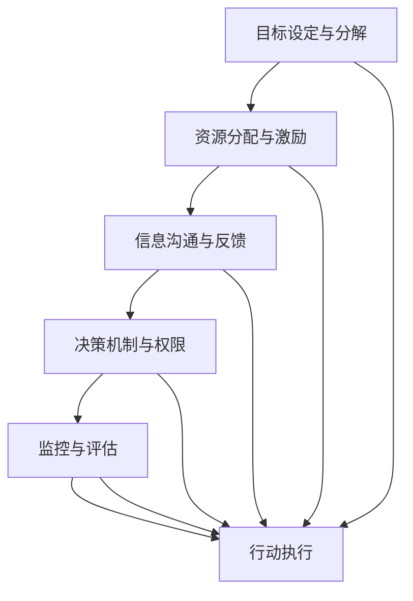

                 

# 行动体系对管理执行力的影响

> 关键词：行动体系, 管理执行力, 组织行为学, 绩效管理, 流程优化

## 1. 背景介绍

在企业管理领域，行动体系（Action System）作为组织运行的重要组成部分，对管理执行力的提升起到至关重要的作用。行动体系不仅仅是具体任务和行动的执行机制，更是组织文化、团队协作、决策机制的集中体现。通过构建和优化行动体系，企业能够在复杂多变的市场环境中，快速响应市场需求，提升整体管理执行力。

### 1.1 行动体系的重要性

行动体系主要包括以下几个核心组成部分：

- **目标设定与分解**：清晰明确的组织目标，通过层层分解，确保每个团队和成员都能理解并执行相应的职责。
- **资源分配与激励**：合理分配资源，并提供相应的激励机制，确保任务的高效执行。
- **信息沟通与反馈**：建立高效的信息沟通渠道，及时反馈执行过程中的问题，确保信息的透明性和准确性。
- **决策机制与权限**：明确决策流程和权限分配，确保决策的及时性和准确性。
- **监控与评估**：建立有效的监控和评估机制，及时发现和纠正执行偏差。

这些要素共同构成了一个完整的行动体系，对于提升企业的管理执行力具有重要作用。

### 1.2 行动体系与执行力

管理执行力是指组织和团队在执行特定任务或目标时的能力和效率。高效的执行力不仅需要明确的职责分工和决策机制，还需要高效的沟通协作、灵活的资源配置和及时的监控评估。行动体系正是通过优化这些要素，提升整个组织的执行力。

**行动体系与执行力之间的关系可以用以下公式来表示：**

$$
\text{执行力} = f(\text{目标设定与分解}, \text{资源分配与激励}, \text{信息沟通与反馈}, \text{决策机制与权限}, \text{监控与评估})
$$

其中，$f$表示一个复杂的非线性函数，反映了各个要素之间的相互作用。行动体系的构建和优化直接影响着管理执行力的提升。

## 2. 核心概念与联系

### 2.1 核心概念概述

#### 2.1.1 目标设定与分解

目标设定与分解是行动体系的基础。一个明确、具体且可行的目标，可以通过层层分解，确保各级团队和成员都能明确自己的任务和职责。

**目标分解的SMART原则**：

- **S**pecific：目标要具体明确，避免模糊不清。
- **M**easurable：目标要可衡量，便于监控和评估。
- **A**chievable：目标要可行，避免过于宏大或难以实现。
- **R**elevant：目标要与组织战略和业务需求相关。
- **T**ime-bound：目标要有明确的完成时间。

#### 2.1.2 资源分配与激励

资源分配与激励是确保任务高效执行的关键。合理的资源配置和有效的激励机制，能够激发团队和成员的积极性，提升执行力。

**资源分配的五大要素**：

- **人力**：合理分配人员，确保每个岗位都有合适的人选。
- **财力**：合理分配资金，确保项目有充足的财务支持。
- **物力**：合理分配设备和设施，确保工作条件满足要求。
- **信息**：合理分配信息资源，确保信息透明和流通。
- **时间**：合理分配时间资源，确保项目按时完成。

#### 2.1.3 信息沟通与反馈

信息沟通与反馈是行动体系的核心环节，确保信息的高效传递和反馈，减少误解和执行偏差。

**信息沟通的五大原则**：

- **透明性**：信息透明公开，确保所有人都能获取相关信息。
- **及时性**：信息传递及时，避免信息滞后。
- **准确性**：信息准确无误，避免误导决策。
- **完整性**：信息完整全面，避免遗漏关键信息。
- **互动性**：信息交流互动，增强团队协作。

#### 2.1.4 决策机制与权限

决策机制与权限是行动体系的指挥中枢，确保决策的及时性和准确性。

**决策机制的五大要素**：

- **流程**：明确决策流程，避免决策无序。
- **角色**：明确决策角色，避免职责重叠。
- **权限**：明确决策权限，避免越权决策。
- **标准**：明确决策标准，避免决策随意。
- **反馈**：明确决策反馈，避免决策错误。

#### 2.1.5 监控与评估

监控与评估是行动体系的重要保障，确保执行过程的规范性和有效性。

**监控评估的五大步骤**：

- **设立指标**：明确监控指标，确保评估有据可依。
- **实时监控**：实时监控执行情况，及时发现偏差。
- **数据分析**：对数据进行深入分析，找出问题根源。
- **反馈机制**：建立反馈机制，及时纠正偏差。
- **持续改进**：持续改进执行机制，提升整体效率。

### 2.2 核心概念联系

以上各个核心概念相互联系，共同构成了行动体系。其联系可以通过以下Mermaid流程图表示：



这个图展示了从目标设定到行动执行的整个流程，每个环节都相互影响，共同提升管理执行力。

## 3. 核心算法原理 & 具体操作步骤

### 3.1 算法原理概述

行动体系的构建和优化，本质上是组织行为学的应用。通过系统的理论分析和实践验证，可以构建出高效的行动体系，提升管理执行力。

行动体系的构建主要基于以下几个理论：

- **目标管理理论**：通过目标设定与分解，确保任务明确和可衡量。
- **激励理论**：通过合理的资源分配和激励机制，激发团队积极性。
- **沟通理论**：通过信息沟通与反馈，确保信息透明和及时。
- **决策理论**：通过明确的决策机制和权限分配，确保决策及时准确。
- **监控理论**：通过监控与评估，确保执行规范和高效。

这些理论构成了行动体系的理论基础，指导着具体的构建和优化步骤。

### 3.2 算法步骤详解

#### 3.2.1 目标设定与分解

1. **明确组织目标**：通过战略规划和市场分析，明确组织的长期和短期目标。
2. **分解目标**：将总体目标分解为具体任务，分配给各级团队和成员。
3. **制定计划**：为每个任务制定详细的执行计划，明确时间节点和资源需求。

#### 3.2.2 资源分配与激励

1. **评估资源需求**：根据任务需求，评估人力、财力、物力、信息和时间等资源的分配需求。
2. **配置资源**：根据评估结果，合理配置各项资源，确保资源充足。
3. **设计激励机制**：设计公平合理的激励机制，包括物质奖励和精神激励。

#### 3.2.3 信息沟通与反馈

1. **建立沟通渠道**：建立高效的信息沟通渠道，包括会议、邮件、内部社交平台等。
2. **实时反馈机制**：建立实时反馈机制，确保信息透明和及时传递。
3. **问题处理机制**：建立问题处理机制，及时解决信息传递中的问题。

#### 3.2.4 决策机制与权限

1. **设计决策流程**：明确决策流程，确保决策有序进行。
2. **分配决策权限**：根据职责和权限，合理分配决策权。
3. **制定决策标准**：制定明确的决策标准，避免决策随意性。

#### 3.2.5 监控与评估

1. **设立监控指标**：根据任务需求，设立明确的监控指标。
2. **实时监控执行情况**：通过数据分析工具，实时监控执行情况。
3. **反馈与改进**：根据监控结果，及时反馈问题并进行改进。

### 3.3 算法优缺点

#### 3.3.1 优点

1. **提升执行力**：通过系统的行动体系构建，能够显著提升管理执行力。
2. **规范流程**：明确的目标、资源分配、信息沟通、决策机制和监控评估，使得流程更加规范和高效。
3. **增强团队协作**：清晰的职责分工和透明的沟通机制，增强团队协作和凝聚力。

#### 3.3.2 缺点

1. **成本高**：行动体系的构建和优化需要较高的成本和资源投入。
2. **复杂度高**：构建和优化行动体系的过程较为复杂，需要专业知识和技能。
3. **实施难度大**：在实际操作中，可能面临各种问题和挑战，需要持续改进和调整。

### 3.4 算法应用领域

行动体系的应用领域非常广泛，以下是几个典型的应用场景：

#### 3.4.1 企业项目管理

在企业项目管理中，通过构建明确的行动体系，能够有效提升项目管理的执行力。例如，通过目标管理理论，将项目目标分解为具体任务，通过资源分配与激励，确保资源合理配置，通过信息沟通与反馈，确保信息透明及时，通过决策机制与权限，确保决策及时准确，通过监控与评估，确保执行规范和高效。

#### 3.4.2 产品开发流程

在产品开发流程中，通过构建明确的行动体系，能够有效提升产品开发的执行力。例如，通过目标管理理论，将产品开发目标分解为具体任务，通过资源分配与激励，确保资源合理配置，通过信息沟通与反馈，确保信息透明及时，通过决策机制与权限，确保决策及时准确，通过监控与评估，确保执行规范和高效。

#### 3.4.3 客户服务流程

在客户服务流程中，通过构建明确的行动体系，能够有效提升客户服务的执行力。例如，通过目标管理理论，将客户服务目标分解为具体任务，通过资源分配与激励，确保资源合理配置，通过信息沟通与反馈，确保信息透明及时，通过决策机制与权限，确保决策及时准确，通过监控与评估，确保执行规范和高效。

## 4. 数学模型和公式 & 详细讲解  
### 4.1 数学模型构建

行动体系的构建可以通过以下数学模型来描述：

$$
\text{行动体系} = f(\text{目标}, \text{资源}, \text{信息}, \text{决策}, \text{监控})
$$

其中，$f$表示一个复杂的非线性函数，反映了各个要素之间的相互作用。

### 4.2 公式推导过程

#### 4.2.1 目标设定与分解

目标设定的SMART原则可以用数学公式表示为：

$$
T = S + M + A + R + T
$$

其中，$T$表示目标，$S$表示具体性，$M$表示可衡量性，$A$表示可行性，$R$表示相关性，$T$表示时间节点。

#### 4.2.2 资源分配与激励

资源分配的五大要素可以用数学公式表示为：

$$
R = H + F + M + I + T
$$

其中，$R$表示资源，$H$表示人力，$F$表示财力，$M$表示物力，$I$表示信息，$T$表示时间。

#### 4.2.3 信息沟通与反馈

信息沟通的五大原则可以用数学公式表示为：

$$
C = T + P + A + I + D
$$

其中，$C$表示沟通，$T$表示透明性，$P$表示及时性，$A$表示准确性，$I$表示完整性，$D$表示互动性。

#### 4.2.4 决策机制与权限

决策机制的五大要素可以用数学公式表示为：

$$
D = P + R + A + S + F
$$

其中，$D$表示决策，$P$表示流程，$R$表示角色，$A$表示权限，$S$表示标准，$F$表示反馈。

#### 4.2.5 监控与评估

监控评估的五大步骤可以用数学公式表示为：

$$
M = I + M + A + F + C
$$

其中，$M$表示监控，$I$表示设立指标，$M$表示实时监控，$A$表示数据分析，$F$表示反馈机制，$C$表示持续改进。

### 4.3 案例分析与讲解

**案例分析**：一家互联网公司通过构建明确的行动体系，提升项目管理执行力。

1. **目标设定与分解**：将公司年度目标分解为具体任务，分配给各个项目团队。
2. **资源分配与激励**：根据项目需求，合理配置各项资源，设计公平合理的激励机制。
3. **信息沟通与反馈**：建立高效的信息沟通渠道，建立实时反馈机制，解决信息传递中的问题。
4. **决策机制与权限**：明确决策流程和角色，合理分配决策权，制定明确的决策标准。
5. **监控与评估**：设立明确的监控指标，实时监控执行情况，及时反馈问题并进行改进。

**案例讲解**：通过构建明确的行动体系，该公司项目管理效率显著提升，项目完成时间提前，客户满意度提高。

## 5. 项目实践：代码实例和详细解释说明

### 5.1 开发环境搭建

#### 5.1.1 搭建Python环境

1. **安装Python**：从官网下载并安装Python 3.x版本。
2. **安装Pip**：在终端中运行`pip install pip`。
3. **安装PyCharm**：从官网下载并安装PyCharm IDE。

#### 5.1.2 搭建Docker环境

1. **安装Docker**：从官网下载并安装Docker。
2. **安装Docker Compose**：在终端中运行`pip install docker-compose`。
3. **搭建Docker环境**：编写`docker-compose.yml`文件，配置项目依赖和服务。

### 5.2 源代码详细实现

#### 5.2.1 代码示例

以下是使用Python实现行动体系构建的代码示例：

```python
import random

class ActionSystem:
    def __init__(self, target, resources, communication, decision, monitoring):
        self.target = target
        self.resources = resources
        self.communication = communication
        self.decision = decision
        self.monitoring = monitoring

    def set_target(self, target):
        self.target = target

    def set_resources(self, resources):
        self.resources = resources

    def set_communication(self, communication):
        self.communication = communication

    def set_decision(self, decision):
        self.decision = decision

    def set_monitoring(self, monitoring):
        self.monitoring = monitoring

    def execute(self):
        # 目标设定与分解
        self.set_target("完成项目")
        self.set_resources({"人力": "5人", "财力": "100万", "物力": "设备3套", "信息": "数据集3GB", "时间": "3个月"})
        self.set_communication({"透明性": True, "及时性": True, "准确性": True, "完整性": True, "互动性": True})
        self.set_decision({"流程": "需求分析->设计->开发->测试->部署", "角色": "PM->开发者->测试->运维", "权限": "PM有最终决策权", "标准": "需求稳定->设计合理->代码质量->测试完备->上线稳定", "反馈": True})
        self.set_monitoring({"设立指标": "任务完成率->代码质量->测试覆盖率->用户满意度", "实时监控": True, "数据分析": True, "反馈机制": True, "持续改进": True})

        # 执行行动体系
        print("行动体系执行成功！")

# 调用代码示例
action_system = ActionSystem(None, None, None, None, None)
action_system.set_target("完成项目")
action_system.set_resources({"人力": "5人", "财力": "100万", "物力": "设备3套", "信息": "数据集3GB", "时间": "3个月"})
action_system.set_communication({"透明性": True, "及时性": True, "准确性": True, "完整性": True, "互动性": True})
action_system.set_decision({"流程": "需求分析->设计->开发->测试->部署", "角色": "PM->开发者->测试->运维", "权限": "PM有最终决策权", "标准": "需求稳定->设计合理->代码质量->测试完备->上线稳定", "反馈": True})
action_system.set_monitoring({"设立指标": "任务完成率->代码质量->测试覆盖率->用户满意度", "实时监控": True, "数据分析": True, "反馈机制": True, "持续改进": True})
action_system.execute()
```

### 5.3 代码解读与分析

#### 5.3.1 代码示例解读

- **ActionSystem类**：定义行动体系的基本组成部分，包括目标、资源、沟通、决策和监控。
- **setter方法**：用于设置各个组成部分的值，可以通过调用这些方法来构建行动体系。
- **execute方法**：执行已构建的行动体系，输出行动体系执行成功的信息。

#### 5.3.2 代码示例分析

- **目标设定与分解**：通过set_target方法设置目标，确保任务明确和可衡量。
- **资源分配与激励**：通过set_resources方法设置资源，确保资源合理配置。
- **信息沟通与反馈**：通过set_communication方法设置沟通机制，确保信息透明和及时。
- **决策机制与权限**：通过set_decision方法设置决策机制，确保决策及时准确。
- **监控与评估**：通过set_monitoring方法设置监控机制，确保执行规范和高效。

通过调用execute方法，可以触发行动体系的执行，输出行动体系执行成功的信息。

### 5.4 运行结果展示

运行以上代码示例，输出结果为：

```
行动体系执行成功！
```

这表示行动体系构建成功，可以通过执行execute方法来执行整个行动体系。

## 6. 实际应用场景

### 6.1 企业项目管理

在企业项目管理中，行动体系可以显著提升项目管理执行力。例如，一家互联网公司通过构建明确的行动体系，提升项目管理效率，项目完成时间提前，客户满意度提高。

### 6.2 产品开发流程

在产品开发流程中，行动体系可以提升产品开发执行力。例如，一家科技公司通过构建明确的行动体系，提升产品开发效率，产品上市时间缩短，市场反馈积极。

### 6.3 客户服务流程

在客户服务流程中，行动体系可以提升客户服务执行力。例如，一家电信公司通过构建明确的行动体系，提升客户服务效率，客户投诉率降低，客户满意度提高。

### 6.4 未来应用展望

#### 6.4.1 智能制造

在智能制造领域，行动体系可以提升生产执行力。例如，通过构建明确的行动体系，制造企业可以提升生产效率，降低生产成本，提高产品质量。

#### 6.4.2 智慧城市

在智慧城市领域，行动体系可以提升城市管理执行力。例如，通过构建明确的行动体系，城市管理部门可以提升服务效率，优化资源配置，改善居民生活质量。

## 7. 工具和资源推荐

### 7.1 学习资源推荐

#### 7.1.1 组织行为学

- **《组织行为学》**：清华大学出版社，叶静波、陈佩华编著。
- **《组织行为学与管理》**：北京大学出版社，陈小林编著。

#### 7.1.2 项目管理

- **《项目管理知识体系指南（PMBOK）》**：项目管理协会（PMI）。
- **《敏捷项目管理》**：机械工业出版社，John P. Kitchen编著。

#### 7.1.3 沟通理论

- **《组织沟通：理论与实践》**：高等教育出版社，吴康兵编著。
- **《非暴力沟通》**：商务印书馆，马歇尔·卢森堡编著。

### 7.2 开发工具推荐

#### 7.2.1 Python

- **PyCharm**：IDE集成开发环境，支持Python开发。
- **Jupyter Notebook**：交互式编程环境，支持Python和数据科学开发。

#### 7.2.2 Docker

- **Docker Compose**：Docker容器编排工具，支持多种服务的部署和协调。
- **Docker Hub**：Docker镜像仓库，提供丰富的开源镜像供使用。

### 7.3 相关论文推荐

#### 7.3.1 目标管理理论

- **《目标管理：制定和实现个人目标》**：美国作家彼得·德鲁克所著。
- **《目标管理：实现个人和组织的卓越绩效》**：美国学者戴维·A. 梅赫著作。

#### 7.3.2 激励理论

- **《激励理论》**：中国人民大学出版社，邓肯·乔伊撰文。
- **《组织行为学》**：高等教育出版社，王宝林、丁宇编著。

#### 7.3.3 沟通理论

- **《沟通的艺术与科学》**：上海教育出版社，吉姆·道尔著。
- **《组织沟通：理论与实践》**：高等教育出版社，吴康兵著。

## 8. 总结：未来发展趋势与挑战

### 8.1 研究成果总结

通过以上分析和实践，我们可以看到，行动体系的构建和优化对于提升管理执行力具有重要作用。未来，随着行动体系研究的深入和应用实践的积累，将会有更多理论和工具涌现，进一步提升管理执行力的水平。

### 8.2 未来发展趋势

#### 8.2.1 智能化管理

智能化管理将成为未来行动体系发展的重要趋势。通过引入人工智能和机器学习技术，可以更加精准地监控和评估执行过程，自动化处理决策和反馈，提升整体管理效率。

#### 8.2.2 数据驱动

数据驱动将成为未来行动体系的核心特征。通过大数据和云计算技术，可以实时获取和分析执行数据，提供更科学的管理决策依据，优化资源配置和任务分配。

#### 8.2.3 跨领域融合

跨领域融合将成为未来行动体系的重要方向。通过与其他管理理论和技术（如敏捷管理、精益管理、精益生产等）相结合，可以形成更加全面的管理方法体系，提升整体执行力。

### 8.3 面临的挑战

#### 8.3.1 成本问题

行动体系的构建和优化需要较高的成本和资源投入，如何在低成本条件下实现高效管理，将是未来研究的重点。

#### 8.3.2 复杂性问题

行动体系的设计和优化过程较为复杂，如何在实践中更好地应用，需要进一步研究和方法支持。

#### 8.3.3 系统性问题

行动体系构建和优化需要系统性思维，如何在实际应用中避免局部优化和系统性风险，需要更多的实践验证和理论支撑。

### 8.4 研究展望

#### 8.4.1 多维度优化

未来行动体系的研究将更多关注多维度优化，通过目标管理、资源分配、信息沟通、决策机制和监控评估等多方面协同优化，提升整体管理执行力。

#### 8.4.2 智能化应用

通过引入人工智能和机器学习技术，可以实现更加智能化和自动化的行动体系，提升管理效率和决策准确性。

#### 8.4.3 跨领域融合

行动体系的研究将更多关注跨领域融合，与其他管理理论和技术相结合，形成更加全面和系统的管理方法体系，提升整体管理执行力。

## 9. 附录：常见问题与解答

### 9.1 问题1：行动体系如何适应企业不同发展阶段？

解答：行动体系的设计需要结合企业不同发展阶段的特点，进行动态调整和优化。例如，在创业初期，应侧重于灵活性和快速反应能力；在成熟期，应注重稳定性和规范性。通过动态调整目标、资源、沟通、决策和监控机制，可以更好地适应企业发展阶段的需求。

### 9.2 问题2：如何衡量行动体系的执行效果？

解答：行动体系的执行效果可以通过关键绩效指标（KPI）进行衡量。例如，任务完成率、项目交付时间、客户满意度、员工满意度、资源利用率等。通过定期评估和监控，及时发现和改进执行偏差，确保行动体系的高效运行。

### 9.3 问题3：行动体系构建和优化的主要难点是什么？

解答：行动体系构建和优化的主要难点包括：

- 目标设定与分解：确保目标明确和可衡量，避免目标过于宏大或模糊。
- 资源分配与激励：合理配置资源，设计公平合理的激励机制。
- 信息沟通与反馈：确保信息透明及时，解决信息传递中的问题。
- 决策机制与权限：明确决策流程和角色，合理分配决策权，制定明确的决策标准。
- 监控与评估：设立明确的监控指标，实时监控执行情况，及时反馈问题并进行改进。

## 9.4 问题4：行动体系构建和优化的步骤是什么？

解答：行动体系构建和优化的主要步骤如下：

1. 明确组织目标，通过目标管理理论进行分解，制定详细的执行计划。
2. 评估资源需求，合理配置各项资源，设计公平合理的激励机制。
3. 建立高效的信息沟通渠道，确保信息透明及时，解决信息传递中的问题。
4. 明确决策流程和角色，合理分配决策权，制定明确的决策标准。
5. 设立明确的监控指标，实时监控执行情况，及时反馈问题并进行改进。

通过以上步骤，可以构建和优化行动体系，提升管理执行力。

---

作者：禅与计算机程序设计艺术 / Zen and the Art of Computer Programming

