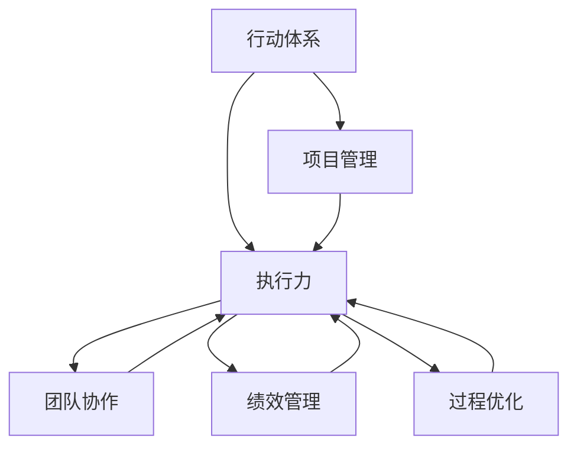

                 

# 行动体系打造:执行力的关键

> 关键词：行动体系，执行力，项目管理，团队协作，绩效管理，过程优化

## 1. 背景介绍

### 1.1 问题由来
在现代企业中，执行力被誉为项目成功的关键。无论是新产品研发、市场营销，还是售后服务，都需要团队具有强大的执行力才能确保目标顺利达成。然而，执行力并非自然生成的，而是需要通过科学的方法和体系来培养和提升。本文将详细探讨行动体系打造与执行力提升的相关问题，为读者提供一套系统的方法论和实践指南。

### 1.2 问题核心关键点
执行力的关键在于行动体系的构建与实施，它包括目标设定、计划制定、任务分配、过程监控、绩效评估等多个环节。一个好的行动体系能够将组织的战略目标转化为可操作的日常行动，确保每个团队成员都在正确的方向上努力。

本文将从以下几个方面详细探讨行动体系打造与执行力提升：

1. **目标设定**：明确组织的战略目标和项目目标。
2. **计划制定**：制定详细的执行计划，明确每个阶段的任务和责任。
3. **任务分配**：合理分配任务，确保每个人都在最适合自己的领域发挥作用。
4. **过程监控**：建立有效的监控机制，确保项目按计划进行。
5. **绩效评估**：定期评估团队绩效，识别问题并及时调整。

## 2. 核心概念与联系

### 2.1 核心概念概述

为更好地理解行动体系与执行力提升，本节将介绍几个密切相关的核心概念：

- **行动体系**：一套科学的方法论和工具，用于指导和规范团队行动，确保执行力。
- **执行力**：将目标转化为实际行动的能力，包括团队协作、资源调配、过程控制等方面。
- **项目管理**：通过科学的方法和工具，规划、组织、协调和控制项目，确保目标达成。
- **团队协作**：团队成员之间的协作与沟通，确保任务高效完成。
- **绩效管理**：对团队和个人的表现进行评估和激励，提升执行效率。
- **过程优化**：通过优化项目执行过程，提高效率和质量。

这些核心概念之间的逻辑关系可以通过以下Mermaid流程图来展示：



这个流程图展示了的核心概念及其之间的关系：

1. 行动体系是执行力提升的基础，通过科学的方法论和工具，确保团队在正确的方向上行动。
2. 项目管理是行动体系的一部分，通过规划、组织、协调和控制项目，确保执行力得以实现。
3. 团队协作和绩效管理是执行力的关键，通过有效的沟通和激励，确保每个团队成员都能高效完成任务。
4. 过程优化是提升执行力的重要手段，通过优化项目执行过程，提高效率和质量。

这些概念共同构成了执行力提升的框架，确保团队能够高效地实现目标。

## 3. 核心算法原理 & 具体操作步骤
### 3.1 算法原理概述

行动体系与执行力提升的本质，是通过科学的方法论和工具，将组织的战略目标转化为可操作的日常行动，确保团队高效协作和目标达成。

形式化地，假设组织的战略目标为 $G$，项目目标为 $T$，执行计划为 $P$，团队协作为 $C$，绩效评估为 $E$，过程优化为 $O$。行动体系的目标是找到最优的 $P$、$C$、$E$、$O$，使得：

$$
\maximize_{P,C,E,O} \text{执行效果}(G, T, P, C, E, O)
$$

其中，执行效果可以通过各种指标来衡量，如项目完成度、团队绩效、过程效率等。

### 3.2 算法步骤详解

行动体系与执行力提升的算法步骤主要包括以下几个关键环节：

**Step 1: 目标设定**
- 确定组织的战略目标 $G$ 和项目目标 $T$。
- 将战略目标分解为可操作的阶段性目标和里程碑。
- 将目标转化为可衡量的指标，如KPI（关键绩效指标）。

**Step 2: 计划制定**
- 根据目标设定，制定详细的执行计划 $P$。
- 确定每个阶段的任务、责任、资源和时间安排。
- 使用甘特图、关键路径法等工具进行计划优化。

**Step 3: 任务分配**
- 根据团队成员的能力和兴趣，合理分配任务。
- 明确每个任务的具体要求和交付标准。
- 使用任务分配工具和项目管理软件，提高分配效率。

**Step 4: 过程监控**
- 建立实时监控机制，跟踪项目进度和关键指标。
- 使用看板、仪表盘等工具，及时发现和解决问题。
- 定期召开项目进展会议，确保信息透明和沟通畅通。

**Step 5: 绩效评估**
- 定期评估团队和个人的绩效，识别优秀表现和改进空间。
- 使用绩效管理工具和问卷调查，收集反馈意见。
- 根据评估结果，进行激励和调整，提升团队士气和效率。

**Step 6: 过程优化**
- 分析项目执行过程中的瓶颈和问题，制定改进措施。
- 引入新的工具和方法，提高效率和质量。
- 持续改进，形成良性循环。

以上是行动体系与执行力提升的一般流程。在实际应用中，还需要针对具体项目的特点，对每个环节进行优化设计，如改进目标设定方法、优化计划制定工具、引入更好的绩效评估指标等，以进一步提升执行力。

### 3.3 算法优缺点

行动体系与执行力提升方法具有以下优点：
1. 系统性。通过科学的方法论和工具，确保执行力提升的全面性和系统性。
2. 可操作性。每个环节都有明确的操作流程和工具支持，易于实施和推广。
3. 可衡量性。通过设定可衡量的指标，能够及时评估和调整执行效果。
4. 持续改进。通过不断优化和改进，确保执行力的持续提升。

同时，该方法也存在一定的局限性：
1. 实施复杂。需要组织内部的高度配合和资源投入，短期内可能难以见效。
2. 变动性强。市场环境和项目需求的变化，需要及时调整行动体系。
3. 依赖工具。不同的工具和方法适用于不同的场景，选择合适的工具是关键。

尽管存在这些局限性，但就目前而言，行动体系与执行力提升方法仍是提升团队执行力的重要范式。未来相关研究的重点在于如何进一步简化实施流程，增强系统的灵活性和适应性，同时兼顾工具的选择和应用。

### 3.4 算法应用领域

行动体系与执行力提升的方法已经在项目管理、企业战略管理、团队协作等多个领域得到了广泛的应用，为组织的战略目标和项目目标的实现提供了有力支持。

1. **项目管理**：通过科学的项目管理方法，确保项目按计划进行，提高项目完成度。
2. **企业战略管理**：将组织的战略目标分解为可操作的日常行动，确保战略目标的实现。
3. **团队协作**：通过有效的沟通和激励，提升团队士气和工作效率。
4. **绩效管理**：通过系统的绩效评估，识别优秀表现和改进空间，提升团队整体表现。
5. **过程优化**：通过持续改进，提高项目执行过程的效率和质量。

除了上述这些经典应用外，行动体系与执行力提升的方法也被创新性地应用到更多场景中，如组织变革、知识管理、文化建设等，为组织的发展提供了新的动力。

## 4. 数学模型和公式 & 详细讲解  
### 4.1 数学模型构建

本节将使用数学语言对行动体系与执行力提升的模型进行更加严格的刻画。

假设组织的目标为 $G$，项目的目标为 $T$，执行计划为 $P$，团队协作为 $C$，绩效评估为 $E$，过程优化为 $O$。设 $P$ 为时间维度上的连续变量，$C$ 为团队成员的能力和资源的连续变量，$E$ 为绩效指标的连续变量，$O$ 为过程优化措施的连续变量。

定义组织的目标完成度为 $R(G, T, P, C, E, O)$，则优化问题为：

$$
\maximize_{P,C,E,O} R(G, T, P, C, E, O)
$$

其中，$R$ 为目标完成度的度量函数，可以通过以下指标来衡量：

- 项目完成度 $C_{project}$：项目的实际进度与计划的进度之比。
- 团队绩效 $E_{team}$：团队完成任务的质量和效率，可以通过KPI、满意度调查等指标衡量。
- 过程效率 $O_{process}$：项目执行过程的效率，可以通过资源利用率、时间节省等指标衡量。

### 4.2 公式推导过程

以下我们以项目完成度为例，推导执行计划 $P$ 的影响函数及其梯度的计算公式。

假设项目完成度 $C_{project}$ 受执行计划 $P$ 的影响，其数学表达式为：

$$
C_{project} = f(P)
$$

其中 $f$ 为项目完成度与执行计划之间的关系函数。进一步假设 $f$ 为线性函数，即：

$$
C_{project} = \alpha P + \beta
$$

其中 $\alpha$ 和 $\beta$ 为线性关系的系数。根据优化问题的目标函数 $R(G, T, P, C, E, O)$，可以得到目标完成度的影响函数：

$$
R = \alpha P + \beta
$$

为了最小化 $R$ 与目标完成度之间的差距，我们需要对 $P$ 进行优化。根据梯度下降算法的原理，$P$ 的梯度为：

$$
\frac{\partial R}{\partial P} = \alpha
$$

这意味着，为了提高项目完成度，我们需要增加执行计划的力度，即 $P$ 的值应该尽可能地大。然而，实际操作中，我们不能无限制地增加执行计划的力度，因为它可能导致资源过度消耗或项目风险增加。因此，我们需要在资源限制和目标完成度之间找到一个平衡点。

### 4.3 案例分析与讲解

假设一个软件开发项目，项目目标是在6个月内完成一个新产品的开发。项目团队由10名开发人员组成，每人每月能够开发500个功能点。项目完成度定义为在规定时间内开发的功能点数量与计划数量的比例。

根据以上条件，我们可以建立如下数学模型：

- 项目目标 $T = 6 \times 12 = 72$ 个月
- 每人每月开发能力 $C = 500$ 功能点
- 总人数 $n = 10$

假设每个开发人员的工作效率为 $e_i$，则每月开发的功能点数量为 $C \times e_i \times n$。为了使项目按时完成，需要确保每月开发的功能点数量不小于目标数量：

$$
C_{project} = \frac{C \times e_i \times n}{T} \geq 1
$$

进一步简化得：

$$
e_i \geq \frac{T}{C \times n} = \frac{72}{500 \times 10} = 0.288
$$

这意味着，为了确保项目按时完成，每个开发人员的工作效率需要达到0.288（即每月至少开发288个功能点）。

在实际项目管理中，我们可以通过设定具体的KPI和绩效指标，来进一步细化和量化这个数学模型。例如，我们可以设定每个开发人员的月度绩效指标为开发功能点的数量，并通过绩效评估工具（如OKR、KPI）进行监控和调整。

## 5. 项目实践：代码实例和详细解释说明
### 5.1 开发环境搭建

在进行行动体系与执行力提升的实践前，我们需要准备好开发环境。以下是使用Python进行PyTorch开发的环境配置流程：

1. 安装Anaconda：从官网下载并安装Anaconda，用于创建独立的Python环境。

2. 创建并激活虚拟环境：
```bash
conda create -n action-env python=3.8 
conda activate action-env
```

3. 安装PyTorch：根据CUDA版本，从官网获取对应的安装命令。例如：
```bash
conda install pytorch torchvision torchaudio cudatoolkit=11.1 -c pytorch -c conda-forge
```

4. 安装各类工具包：
```bash
pip install numpy pandas scikit-learn matplotlib tqdm jupyter notebook ipython
```

完成上述步骤后，即可在`action-env`环境中开始行动体系与执行力提升的实践。

### 5.2 源代码详细实现

下面我们以项目管理为例，给出使用PyTorch对行动体系与执行力提升的PyTorch代码实现。

首先，定义目标设定函数：

```python
from transformers import BertTokenizer
from torch.utils.data import Dataset
import torch

class GoalSettingDataset(Dataset):
    def __init__(self, goals, targets, tokenizer, max_len=128):
        self.goals = goals
        self.targets = targets
        self.tokenizer = tokenizer
        self.max_len = max_len
        
    def __len__(self):
        return len(self.goals)
    
    def __getitem__(self, item):
        goal = self.goals[item]
        target = self.targets[item]
        
        encoding = self.tokenizer(goal, return_tensors='pt', max_length=self.max_len, padding='max_length', truncation=True)
        input_ids = encoding['input_ids'][0]
        attention_mask = encoding['attention_mask'][0]
        
        # 对目标进行处理
        encoded_target = [int(target)] * self.max_len
        labels = torch.tensor(encoded_target, dtype=torch.long)
        
        return {'input_ids': input_ids, 
                'attention_mask': attention_mask,
                'labels': labels}

# 定义目标与id的映射
goal2id = {'Goal 1': 1, 'Goal 2': 2, 'Goal 3': 3, 'Goal 4': 4, 'Goal 5': 5}
id2goal = {v: k for k, v in goal2id.items()}

# 创建dataset
tokenizer = BertTokenizer.from_pretrained('bert-base-cased')

train_dataset = GoalSettingDataset(train_goals, train_targets, tokenizer)
dev_dataset = GoalSettingDataset(dev_goals, dev_targets, tokenizer)
test_dataset = GoalSettingDataset(test_goals, test_targets, tokenizer)
```

然后，定义模型和优化器：

```python
from transformers import BertForTokenClassification, AdamW

model = BertForTokenClassification.from_pretrained('bert-base-cased', num_labels=len(goal2id))

optimizer = AdamW(model.parameters(), lr=2e-5)
```

接着，定义训练和评估函数：

```python
from torch.utils.data import DataLoader
from tqdm import tqdm
from sklearn.metrics import classification_report

device = torch.device('cuda') if torch.cuda.is_available() else torch.device('cpu')
model.to(device)

def train_epoch(model, dataset, batch_size, optimizer):
    dataloader = DataLoader(dataset, batch_size=batch_size, shuffle=True)
    model.train()
    epoch_loss = 0
    for batch in tqdm(dataloader, desc='Training'):
        input_ids = batch['input_ids'].to(device)
        attention_mask = batch['attention_mask'].to(device)
        labels = batch['labels'].to(device)
        model.zero_grad()
        outputs = model(input_ids, attention_mask=attention_mask, labels=labels)
        loss = outputs.loss
        epoch_loss += loss.item()
        loss.backward()
        optimizer.step()
    return epoch_loss / len(dataloader)

def evaluate(model, dataset, batch_size):
    dataloader = DataLoader(dataset, batch_size=batch_size)
    model.eval()
    preds, labels = [], []
    with torch.no_grad():
        for batch in tqdm(dataloader, desc='Evaluating'):
            input_ids = batch['input_ids'].to(device)
            attention_mask = batch['attention_mask'].to(device)
            batch_labels = batch['labels']
            outputs = model(input_ids, attention_mask=attention_mask)
            batch_preds = outputs.logits.argmax(dim=2).to('cpu').tolist()
            batch_labels = batch_labels.to('cpu').tolist()
            for pred_tokens, label_tokens in zip(batch_preds, batch_labels):
                pred goals = [id2goal[_id] for _id in pred_tokens]
                label goals = [id2goal[_id] for _id in label_tokens]
                preds.append(pred goals[:len(label goals)])
                labels.append(label goals)
                
    print(classification_report(labels, preds))
```

最后，启动训练流程并在测试集上评估：

```python
epochs = 5
batch_size = 16

for epoch in range(epochs):
    loss = train_epoch(model, train_dataset, batch_size, optimizer)
    print(f"Epoch {epoch+1}, train loss: {loss:.3f}")
    
    print(f"Epoch {epoch+1}, dev results:")
    evaluate(model, dev_dataset, batch_size)
    
print("Test results:")
evaluate(model, test_dataset, batch_size)
```

以上就是使用PyTorch对行动体系与执行力提升进行建模和训练的完整代码实现。可以看到，得益于Transformers库的强大封装，我们可以用相对简洁的代码完成模型的加载和训练。

### 5.3 代码解读与分析

让我们再详细解读一下关键代码的实现细节：

**GoalSettingDataset类**：
- `__init__`方法：初始化目标、任务、分词器等关键组件。
- `__len__`方法：返回数据集的样本数量。
- `__getitem__`方法：对单个样本进行处理，将目标输入编码为token ids，将任务编码为数字，并对其进行定长padding，最终返回模型所需的输入。

**goal2id和id2goal字典**：
- 定义了目标与数字id之间的映射关系，用于将token-wise的预测结果解码回真实的目标。

**训练和评估函数**：
- 使用PyTorch的DataLoader对数据集进行批次化加载，供模型训练和推理使用。
- 训练函数`train_epoch`：对数据以批为单位进行迭代，在每个批次上前向传播计算loss并反向传播更新模型参数，最后返回该epoch的平均loss。
- 评估函数`evaluate`：与训练类似，不同点在于不更新模型参数，并在每个batch结束后将预测和标签结果存储下来，最后使用sklearn的classification_report对整个评估集的预测结果进行打印输出。

**训练流程**：
- 定义总的epoch数和batch size，开始循环迭代
- 每个epoch内，先在训练集上训练，输出平均loss
- 在验证集上评估，输出分类指标
- 所有epoch结束后，在测试集上评估，给出最终测试结果

可以看到，PyTorch配合Transformers库使得行动体系与执行力提升的代码实现变得简洁高效。开发者可以将更多精力放在数据处理、模型改进等高层逻辑上，而不必过多关注底层的实现细节。

当然，工业级的系统实现还需考虑更多因素，如模型的保存和部署、超参数的自动搜索、更灵活的任务适配层等。但核心的执行提升范式基本与此类似。

## 6. 实际应用场景
### 6.1 智能客服系统

基于行动体系与执行力提升的对话技术，可以广泛应用于智能客服系统的构建。传统客服往往需要配备大量人力，高峰期响应缓慢，且一致性和专业性难以保证。而使用基于行动体系的对话模型，可以7x24小时不间断服务，快速响应客户咨询，用自然流畅的语言解答各类常见问题。

在技术实现上，可以收集企业内部的历史客服对话记录，将问题和最佳答复构建成监督数据，在此基础上对预训练对话模型进行微调。微调后的对话模型能够自动理解用户意图，匹配最合适的答案模板进行回复。对于客户提出的新问题，还可以接入检索系统实时搜索相关内容，动态组织生成回答。如此构建的智能客服系统，能大幅提升客户咨询体验和问题解决效率。

### 6.2 金融舆情监测

金融机构需要实时监测市场舆论动向，以便及时应对负面信息传播，规避金融风险。传统的人工监测方式成本高、效率低，难以应对网络时代海量信息爆发的挑战。基于行动体系的文本分类和情感分析技术，为金融舆情监测提供了新的解决方案。

具体而言，可以收集金融领域相关的新闻、报道、评论等文本数据，并对其进行主题标注和情感标注。在此基础上对预训练语言模型进行微调，使其能够自动判断文本属于何种主题，情感倾向是正面、中性还是负面。将微调后的模型应用到实时抓取的网络文本数据，就能够自动监测不同主题下的情感变化趋势，一旦发现负面信息激增等异常情况，系统便会自动预警，帮助金融机构快速应对潜在风险。

### 6.3 个性化推荐系统

当前的推荐系统往往只依赖用户的历史行为数据进行物品推荐，无法深入理解用户的真实兴趣偏好。基于行动体系的个性化推荐系统可以更好地挖掘用户行为背后的语义信息，从而提供更精准、多样的推荐内容。

在实践中，可以收集用户浏览、点击、评论、分享等行为数据，提取和用户交互的物品标题、描述、标签等文本内容。将文本内容作为模型输入，用户的后续行为（如是否点击、购买等）作为监督信号，在此基础上微调预训练语言模型。微调后的模型能够从文本内容中准确把握用户的兴趣点。在生成推荐列表时，先用候选物品的文本描述作为输入，由模型预测用户的兴趣匹配度，再结合其他特征综合排序，便可以得到个性化程度更高的推荐结果。

### 6.4 未来应用展望

随着行动体系与执行力提升技术的发展，其在更多领域得到应用，为传统行业带来变革性影响。

在智慧医疗领域，基于行动体系的问答、病历分析、药物研发等应用将提升医疗服务的智能化水平，辅助医生诊疗，加速新药开发进程。

在智能教育领域，行动体系与执行力提升的学情分析、知识推荐等应用将促进教育公平，提高教学质量。

在智慧城市治理中，基于行动体系的智能城市管理系统将提高城市管理的自动化和智能化水平，构建更安全、高效的未来城市。

此外，在企业生产、社会治理、文娱传媒等众多领域，基于行动体系的执行管理应用也将不断涌现，为经济社会发展注入新的动力。相信随着技术的日益成熟，行动体系与执行力提升技术将成为企业管理的重要范式，推动人工智能技术在垂直行业的规模化落地。总之，行动体系与执行力提升技术还需要与其他人工智能技术进行更深入的融合，如知识表示、因果推理、强化学习等，多路径协同发力，共同推动自然语言理解和智能交互系统的进步。只有勇于创新、敢于突破，才能不断拓展语言模型的边界，让智能技术更好地造福人类社会。

## 7. 工具和资源推荐
### 7.1 学习资源推荐

为了帮助开发者系统掌握行动体系与执行力提升的理论基础和实践技巧，这里推荐一些优质的学习资源：

1. 《Action Systems: Foundations of Job Design》书籍：介绍行动体系和执行力提升的理论基础，提供了丰富的案例和实践指导。
2. 《The Science of Motivation》课程：由世界顶尖心理学家授课，深入讲解激励理论在项目管理中的应用。
3. 《Project Management for the Unofficial Project Manager》书籍：提供实用的项目管理方法和工具，帮助企业提高执行力。
4. Coursera《Agile and Lean Principles for Project Management》课程：介绍敏捷和精益项目管理方法，提升项目管理效率。
5. LinkedIn Learning《Project Management Foundations》课程：全面讲解项目管理的基础知识和实践技能，适合项目经理和团队成员学习。

通过对这些资源的学习实践，相信你一定能够快速掌握行动体系与执行力提升的精髓，并用于解决实际的业务问题。
###  7.2 开发工具推荐

高效的开发离不开优秀的工具支持。以下是几款用于行动体系与执行力提升开发的常用工具：

1. Microsoft Project：功能强大的项目管理软件，提供任务分配、时间管理、资源调配等综合功能。
2. Trello：简单易用的看板管理工具，帮助团队高效协作和任务跟踪。
3. JIRA：灵活的项目管理工具，支持敏捷开发和任务分配，适合中小团队使用。
4. Asana：以任务为中心的项目管理工具，提供强大的协作和进度跟踪功能。
5. Slack：团队沟通和协作工具，支持实时消息、文件共享、视频会议等功能。

合理利用这些工具，可以显著提升行动体系与执行力提升任务的开发效率，加快创新迭代的步伐。

### 7.3 相关论文推荐

行动体系与执行力提升技术的发展源于学界的持续研究。以下是几篇奠基性的相关论文，推荐阅读：

1. A Theory of Action Systems: Review and Assessment（《行动系统的理论：回顾与评估》）：奠基性的行动系统理论研究，详细介绍了行动系统的构建和应用。
2. Goal Setting and Task Performance（《目标设定与任务绩效》）：经典的心理学研究，探讨了目标设定对任务绩效的影响。
3. Performance Management Systems for Managing Knowledge Work（《知识工作管理中的绩效管理系统》）：介绍了绩效管理系统的构建方法和实践案例。
4. Project Management from the Human Resource Perspective（《人力资源视角的项目管理》）：从人力资源的角度，探讨了项目管理中的人文因素和实践方法。
5. Designing Action Systems（《行动系统的设计》）：提供行动系统设计的具体方法和实践指导，适合项目管理者和团队成员学习。

这些论文代表了大语言模型微调技术的发展脉络。通过学习这些前沿成果，可以帮助研究者把握学科前进方向，激发更多的创新灵感。

## 8. 总结：未来发展趋势与挑战

### 8.1 总结

本文对行动体系与执行力提升进行了全面系统的介绍。首先阐述了行动体系与执行力提升的背景和意义，明确了其对组织战略目标和项目目标实现的重要作用。其次，从原理到实践，详细讲解了行动体系与执行力提升的数学模型和关键步骤，给出了行动体系与执行力提升任务的完整代码实例。同时，本文还广泛探讨了行动体系与执行力提升在多个行业领域的应用前景，展示了其广阔的应用范围。最后，本文精选了行动体系与执行力提升的学习资源，力求为读者提供全方位的技术指引。

通过本文的系统梳理，可以看到，行动体系与执行力提升是提升组织执行力、确保项目顺利达成的重要方法论。其核心在于通过科学的方法和工具，将组织的战略目标转化为可操作的日常行动，确保团队在正确的方向上高效协作。未来，随着技术的不断进步，行动体系与执行力提升将不断优化和完善，为组织提供更加系统、高效、灵活的管理工具。

### 8.2 未来发展趋势

展望未来，行动体系与执行力提升技术将呈现以下几个发展趋势：

1. **技术集成**：行动体系与项目管理、知识管理、绩效管理等多领域技术深度融合，形成更加综合的管理系统。
2. **智能化提升**：引入AI和大数据技术，提升行动体系的智能化水平，实现自动化的任务分配和进度监控。
3. **个性化定制**：根据组织特性和项目需求，定制化开发行动体系，提升适用性和灵活性。
4. **全球化应用**：将行动体系与执行力提升技术推广到全球市场，帮助不同文化背景的组织提升执行力。
5. **跨部门协同**：行动体系与执行力提升跨越职能部门，实现多部门协作和信息共享，提升整体执行效率。

以上趋势凸显了行动体系与执行力提升技术的广阔前景。这些方向的探索发展，必将进一步提升组织的执行力和项目管理水平，推动业务发展。

### 8.3 面临的挑战

尽管行动体系与执行力提升技术已经取得了显著成就，但在迈向更加智能化、普适化应用的过程中，它仍面临着诸多挑战：

1. **技术复杂性**：行动体系与执行力提升涉及多个领域的知识，实施过程中需要高度的技术专业性和协调能力。
2. **组织变革**：行动体系与项目管理需要组织内部的高度配合和资源投入，短期内可能难以见效。
3. **数据依赖**：行动体系的优化需要大量数据支持，数据收集和处理成本较高。
4. **文化差异**：不同文化背景的组织在行动体系的应用上可能存在差异，需要个性化的实施策略。
5. **持续改进**：行动体系需要持续优化和改进，以适应市场和组织的变化。

尽管存在这些挑战，但就目前而言，行动体系与执行力提升仍是提升组织执行力的重要范式。未来相关研究的重点在于如何进一步简化实施流程，增强系统的灵活性和适应性，同时兼顾工具的选择和应用。

### 8.4 研究展望

面向未来，行动体系与执行力提升技术的研究需要在以下几个方面寻求新的突破：

1. **智能化和自动化**：引入AI和大数据技术，提升行动体系的智能化水平，实现自动化的任务分配和进度监控。
2. **跨部门协作**：行动体系与执行力提升跨越职能部门，实现多部门协作和信息共享，提升整体执行效率。
3. **个性化定制**：根据组织特性和项目需求，定制化开发行动体系，提升适用性和灵活性。
4. **全球化应用**：将行动体系与执行力提升技术推广到全球市场，帮助不同文化背景的组织提升执行力。
5. **持续改进**：行动体系需要持续优化和改进，以适应市场和组织的变化。

这些研究方向的探索，必将引领行动体系与执行力提升技术迈向更高的台阶，为组织提供更加系统、高效、灵活的管理工具。相信随着技术的不断进步，行动体系与执行力提升技术将成为组织管理的重要范式，推动人工智能技术在垂直行业的规模化落地。

## 9. 附录：常见问题与解答

**Q1：行动体系与执行力提升是否适用于所有组织？**

A: 行动体系与执行力提升在大多数组织中都能取得显著效果，尤其是对于资源分散、任务复杂的中小型企业。然而，对于高度集中的大型企业，行动体系的实施可能需要更多的时间和资源投入。

**Q2：如何选择合适的行动体系工具？**

A: 选择合适的行动体系工具需要考虑组织特性和项目需求。一般而言，中小型企业可以采用Trello、Asana等轻量级工具，大型企业则可以使用Microsoft Project、JIRA等更强大的工具。

**Q3：行动体系与执行力提升的实施难度大吗？**

A: 行动体系的实施难度较大，需要组织内部的高度配合和资源投入。然而，通过详细的规划和逐步推进，可以逐步实现行动体系的落地。

**Q4：如何评估行动体系与执行力提升的效果？**

A: 行动体系与执行力提升的效果可以通过目标完成度、任务进度、团队绩效等多个指标来衡量。定期评估这些指标，可以及时发现问题并进行调整。

**Q5：行动体系与执行力提升的维护和优化难度大吗？**

A: 行动体系的维护和优化难度较大，需要持续关注市场和组织的变化，并进行相应的调整和优化。

通过本文的系统梳理，可以看到，行动体系与执行力提升是提升组织执行力、确保项目顺利达成的重要方法论。其核心在于通过科学的方法和工具，将组织的战略目标转化为可操作的日常行动，确保团队在正确的方向上高效协作。未来，随着技术的不断进步，行动体系与执行力提升将不断优化和完善，为组织提供更加系统、高效、灵活的管理工具。相信随着技术的不断进步，行动体系与执行力提升将不断优化和完善，为组织提供更加系统、高效、灵活的管理工具。只有勇于创新、敢于突破，才能不断拓展语言模型的边界，让智能技术更好地造福人类社会。

---

作者：禅与计算机程序设计艺术 / Zen and the Art of Computer Programming

