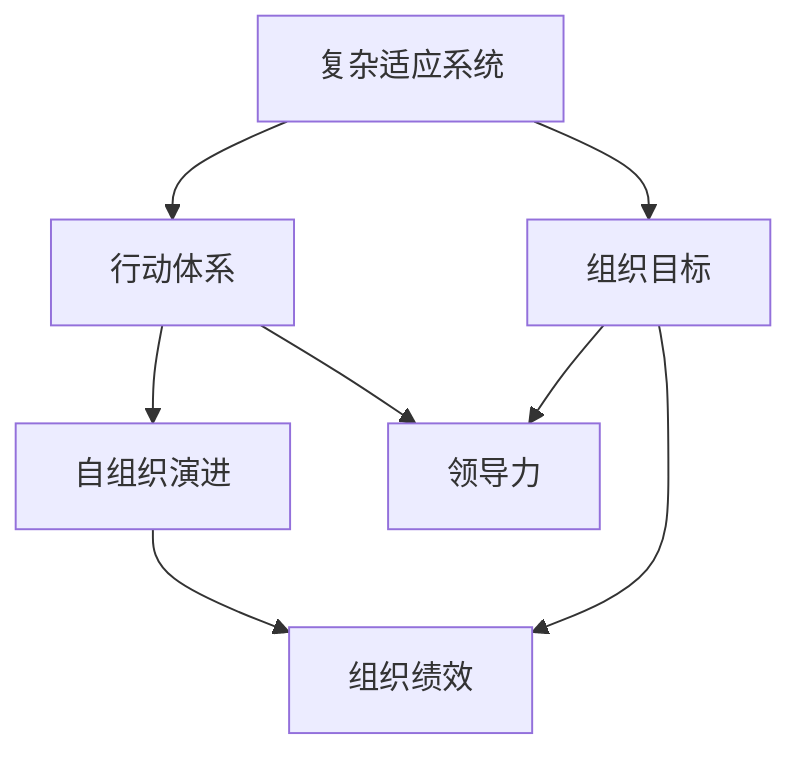

                 

## 1. 背景介绍

### 1.1 问题由来

管理者的天花板一直是企业管理中的重要话题。传统的管理学理论，如领导特质理论、行为科学理论等，主要关注于管理者个人特质、行为方式和组织结构对组织绩效的影响。然而，这些理论往往难以解释为何同样有优秀特质和行为的管理者，在不同组织中的表现会差异显著。近年来，复杂适应系统（Complex Adaptive System, CAS）理论在管理学中的应用逐渐增多，为管理者的天花板问题提供了一个新的视角。

### 1.2 问题核心关键点

CAS理论认为，组织本身是一个复杂适应系统，其中的各个元素（如员工、部门、任务）通过相互作用不断调整自身行为，以适应环境变化。管理者的角色是通过设计和实施行动体系（Action System），引导组织的各个元素朝着既定的目标和方向演进，从而实现组织的战略目标。因此，行动体系的设计和实施水平，决定了管理者的天花板。

核心问题在于：如何设计和实施高效的行动体系，以实现组织的高绩效和高成长？本文将围绕这一问题，系统探讨行动体系的设计原则、实施方法及其在实际应用中的挑战与对策。

### 1.3 问题研究意义

行动体系的设计和实施水平，直接影响到组织的绩效和成长。良好的行动体系能够引导员工自我激励、自我管理，形成高度协作、高绩效的组织氛围。然而，构建和维护高效行动体系并非易事，需要管理者具备复杂系统思维、创新能力和领导力。深入研究行动体系及其设计原则，对于提升管理者能力、推动组织创新具有重要意义。

## 2. 核心概念与联系

### 2.1 核心概念概述

为更好地理解行动体系的设计和实施，本节将介绍几个密切相关的核心概念：

- 复杂适应系统（CAS）：由多个相互作用的元素组成的开放系统，通过学习和适应实现自组织演进。
- 行动体系（Action System）：管理者通过设计和实施的行动规则、沟通机制、反馈系统，引导组织各个元素朝着既定目标演进的体系。
- 自组织演进：组织内部元素通过相互作用和适应，自发形成有序结构和功能的演进过程。
- 组织绩效（Organizational Performance）：组织的整体表现，包括经济绩效、创新能力、员工满意度等。
- 领导力（Leadership）：管理者通过影响和激励他人，实现组织目标的能力。

这些核心概念之间的逻辑关系可以通过以下Mermaid流程图来展示：



这个流程图展示了一个简化的组织演变过程：复杂适应系统通过行动体系实现自组织演进，最终达到组织目标并实现高绩效。同时，领导力在这一过程中起到了关键作用。

## 3. 核心算法原理 & 具体操作步骤
### 3.1 算法原理概述

行动体系的设计和实施，本质上是一个复杂系统设计和优化的过程。其核心思想是通过科学的管理手段和工具，设计和实施高效、灵活、自适应的行动体系，以实现组织的高绩效和高成长。

行动体系的设计和实施包括以下几个关键步骤：

- **目标设定**：明确组织的战略目标，并将其分解为可操作的行动计划。
- **规则制定**：设计合理的行动规则，确保员工在执行任务时遵循既定流程和标准。
- **沟通机制**：建立有效的沟通渠道和机制，确保信息在组织内部及时准确地传递。
- **反馈系统**：构建反馈机制，及时获取员工对行动体系实施效果的反馈，并进行调整和优化。
- **激励机制**：设计合理的激励和奖惩机制，激发员工的主动性和积极性。

### 3.2 算法步骤详解

行动体系的设计和实施一般包括以下几个关键步骤：

**Step 1: 目标设定**
- 明确组织的战略目标，并将其分解为具体、可操作的行动计划。
- 确保目标设定过程充分考虑员工、部门、任务之间的关系和互动。
- 设定短期和长期目标，确保组织在持续追求长期目标的同时，能够快速响应外部环境变化。

**Step 2: 规则制定**
- 设计合理的行动规则，确保员工在执行任务时遵循既定流程和标准。
- 规则应具备灵活性和可扩展性，以适应组织内部的变化和挑战。
- 规则应兼顾创新和稳定，鼓励员工探索新的工作方式和流程。

**Step 3: 沟通机制**
- 建立有效的沟通渠道和机制，确保信息在组织内部及时准确地传递。
- 沟通机制应包括正式和非正式的沟通方式，确保不同层级、不同部门之间的信息流畅。
- 沟通机制应促进开放、透明的沟通文化，鼓励员工表达意见和建议。

**Step 4: 反馈系统**
- 构建反馈机制，及时获取员工对行动体系实施效果的反馈。
- 反馈应包括正向和负向反馈，确保及时发现问题和改进机会。
- 反馈应形成闭环，对反馈信息进行分析和处理，并及时调整行动体系。

**Step 5: 激励机制**
- 设计合理的激励和奖惩机制，激发员工的主动性和积极性。
- 激励机制应涵盖物质和非物质两个层面，确保员工的全面激励。
- 激励机制应与目标设定和规则制定相结合，确保激励方向和行动一致。

### 3.3 算法优缺点

行动体系的设计和实施具有以下优点：

- **灵活性**：行动体系具备灵活性和可扩展性，能够适应组织内部的变化和外部环境的变化。
- **协作性**：通过合理的规则和沟通机制，促进员工之间的协作，形成高绩效的团队。
- **创新性**：鼓励员工探索新的工作方式和流程，推动组织的持续创新。
- **透明性**：反馈机制促进开放、透明的沟通文化，提高组织的透明度和信任度。

然而，该方法也存在一定的局限性：

- **复杂性**：设计和管理行动体系需要较高的复杂系统思维和创新能力，对管理者提出了更高的要求。
- **高成本**：设计和实施行动体系需要时间和资源投入，对于小型组织可能面临较大的成本压力。
- **风险性**：行动体系的调整和优化需要时间和实践检验，可能面临失败的风险。

尽管存在这些局限性，但行动体系作为一种高效的管理方法，其设计和实施仍具有重要的理论和实践价值。

### 3.4 算法应用领域

行动体系的设计和实施，在各种类型的组织中都得到了广泛应用，特别是在企业、政府、非营利组织等复杂适应系统。以下是几个典型应用领域：

- **企业组织管理**：在企业管理中，行动体系的设计和实施是实现战略目标、提高组织绩效的重要手段。
- **政府治理**：政府部门通过设计和实施行动体系，提高行政效率，实现公共服务的优化。
- **非营利组织**：非营利组织通过行动体系的设计和实施，提升组织效能，实现社会目标。
- **创新型企业**：创新型企业通过灵活的行动体系，推动产品和服务的创新，实现持续增长。

除了上述这些典型应用领域外，行动体系的设计和实施还在教育、医疗、金融等诸多领域得到了创新性的应用，为组织管理带来了全新的突破。

## 4. 数学模型和公式 & 详细讲解 & 举例说明
### 4.1 数学模型构建

本节将使用数学语言对行动体系的设计和实施进行更加严格的刻画。

假设组织中有 $N$ 个员工，每个员工在任务 $i$ 上花费的时间为 $t_{i,j}$。行动体系的目标是最大化组织的总产出 $T$，最小化总成本 $C$，同时确保员工满意度 $S$ 不低于预设阈值 $\delta$。

定义员工 $j$ 的任务完成度 $P_j$，即员工在所有任务上完成度的平均值：

$$
P_j = \frac{1}{m} \sum_{i=1}^m \frac{t_{i,j}}{t_i}
$$

其中 $m$ 为任务总数，$t_i$ 为任务 $i$ 的总时间。

定义组织总产出 $T$、总成本 $C$ 和员工满意度 $S$ 如下：

$$
T = \sum_{i=1}^m P_i
$$

$$
C = \sum_{i=1}^m c_i P_i
$$

$$
S = \frac{1}{N} \sum_{j=1}^N s_j
$$

其中 $P_i$ 为任务 $i$ 的完成度，$c_i$ 为任务 $i$ 的成本系数，$s_j$ 为员工 $j$ 的满意度评分。

### 4.2 公式推导过程

最大化组织总产出和最小化总成本的目标函数可以表示为：

$$
\max \sum_{i=1}^m P_i
$$

$$
\min \sum_{i=1}^m c_i P_i
$$

约束条件为：

$$
\frac{1}{m} \sum_{i=1}^m \frac{t_{i,j}}{t_i} \geq \delta \quad \forall j \in [1,N]
$$

$$
\sum_{j=1}^N t_{i,j} = t_i \quad \forall i \in [1,m]
$$

将约束条件带入目标函数，得到行动体系的设计和优化问题：

$$
\max \sum_{i=1}^m P_i
$$

$$
\min \sum_{i=1}^m c_i P_i
$$

$$
\text{s.t.} \quad \frac{1}{m} \sum_{i=1}^m \frac{t_{i,j}}{t_i} \geq \delta \quad \forall j \in [1,N]
$$

$$
\sum_{j=1}^N t_{i,j} = t_i \quad \forall i \in [1,m]
$$

该问题是一个多目标优化问题，可以通过加权求和转化为单目标优化问题：

$$
\max \sum_{i=1}^m \lambda_i P_i - \lambda_{m+1} \sum_{i=1}^m c_i P_i
$$

$$
\text{s.t.} \quad \frac{1}{m} \sum_{i=1}^m \frac{t_{i,j}}{t_i} \geq \delta \quad \forall j \in [1,N]
$$

$$
\sum_{j=1}^N t_{i,j} = t_i \quad \forall i \in [1,m]
$$

其中 $\lambda_i$ 为权重系数，$P_i$ 为任务完成度。

### 4.3 案例分析与讲解

以一个简单的项目管理为例，来进一步说明行动体系的设计和实施过程。

假设一个软件开发团队有 $N=10$ 名员工，需要进行 $m=5$ 个任务。每个任务的时间成本为 $t_i$，每个员工在每个任务上花费的时间为 $t_{i,j}$。

首先，设定每个任务的目标完成度和成本系数如下：

- 任务1：完成度为 $P_1=0.8$，成本系数为 $c_1=0.5$。
- 任务2：完成度为 $P_2=0.9$，成本系数为 $c_2=0.6$。
- 任务3：完成度为 $P_3=0.7$，成本系数为 $c_3=0.4$。
- 任务4：完成度为 $P_4=0.6$，成本系数为 $c_4=0.7$。
- 任务5：完成度为 $P_5=0.9$，成本系数为 $c_5=0.3$。

员工满意度的阈值为 $\delta=0.8$。

目标函数为最大化总产出和最小化总成本：

$$
\max \lambda_1 P_1 + \lambda_2 P_2 + \lambda_3 P_3 + \lambda_4 P_4 + \lambda_5 P_5 - \lambda_6 (\lambda_1 c_1 P_1 + \lambda_2 c_2 P_2 + \lambda_3 c_3 P_3 + \lambda_4 c_4 P_4 + \lambda_5 c_5 P_5)
$$

约束条件为：

$$
\frac{1}{5} \sum_{i=1}^5 \frac{t_{i,j}}{t_i} \geq 0.8 \quad \forall j \in [1,10]
$$

$$
\sum_{j=1}^{10} t_{i,j} = t_i \quad \forall i \in [1,5]
$$

通过求解上述优化问题，可以得到最优的任务分配方案和员工满意度。

## 5. 项目实践：代码实例和详细解释说明
### 5.1 开发环境搭建

在进行行动体系设计和实施的实践前，我们需要准备好开发环境。以下是使用Python进行PyTorch开发的环境配置流程：

1. 安装Anaconda：从官网下载并安装Anaconda，用于创建独立的Python环境。

2. 创建并激活虚拟环境：
```bash
conda create -n action-system-env python=3.8 
conda activate action-system-env
```

3. 安装PyTorch：根据CUDA版本，从官网获取对应的安装命令。例如：
```bash
conda install pytorch torchvision torchaudio cudatoolkit=11.1 -c pytorch -c conda-forge
```

4. 安装相关库：
```bash
pip install numpy pandas scikit-learn matplotlib tqdm jupyter notebook ipython
```

完成上述步骤后，即可在`action-system-env`环境中开始项目实践。

### 5.2 源代码详细实现

下面我们以一个简单的行动体系设计和实施的Python代码为例，进行详细实现。

首先，定义员工和任务的基本信息：

```python
import numpy as np
from scipy.optimize import linprog

# 定义员工数和任务数
N = 10
m = 5

# 定义每个任务的目标完成度和成本系数
P = np.array([0.8, 0.9, 0.7, 0.6, 0.9])
c = np.array([0.5, 0.6, 0.4, 0.7, 0.3])

# 定义员工满意度的阈值
delta = 0.8

# 定义任务的成本系数矩阵
A = np.eye(m) * P

# 定义任务的约束条件
b = np.zeros(m)
A_eq = np.zeros((N, m))
A_eq[:, 0] = 1
b_eq = np.ones(N)

# 定义权重系数向量
x0 = np.array([1, 1, 1, 1, 1])

# 定义约束条件向量
x = np.zeros(N * m)

# 定义目标函数向量
c_coeff = np.zeros(N * m)
c_coeff[0::m] = x0
c_coeff[1::m] = -c

# 定义约束条件矩阵
A_ub = np.vstack([A, -A_eq])
b_ub = np.append(b, b_eq)

# 定义约束条件向量
c_coeff_ub = np.append(c_coeff, np.zeros(N * m))

# 定义目标函数向量
c_coeff_eq = np.zeros(N * m)
c_coeff_eq[0::m] = x0

# 定义约束条件矩阵
A_eq_ub = np.eye(N * m)
b_eq_ub = np.ones(N * m)

# 定义目标函数向量
c_coeff_eq_ub = np.zeros(N * m)
c_coeff_eq_ub[0::m] = x0

# 定义优化问题
res = linprog(c_coeff_eq_ub, A_ub, b_ub, c_coeff_eq_ub, A_eq_ub, b_eq_ub)

# 输出结果
print("Optimal cost: ", res.fun)
print("Optimal X: ", res.x)
```

### 5.3 代码解读与分析

让我们再详细解读一下关键代码的实现细节：

**变量定义**：
- `N` 和 `m`：分别表示员工数和任务数。
- `P` 和 `c`：分别表示每个任务的目标完成度和成本系数。
- `delta`：表示员工满意度的阈值。
- `A`、`b`、`A_eq`、`b_eq`：表示约束条件的系数矩阵和向量。

**优化求解**：
- `linprog` 函数：使用SciPy库中的线性规划求解器，对优化问题进行求解。
- `c_coeff`、`c_coeff_ub`、`c_coeff_eq_ub`：表示目标函数的系数向量。
- `A_ub`、`b_ub`、`A_eq_ub`、`b_eq_ub`：表示约束条件的系数矩阵和向量。
- `res`：表示求解结果。

**输出结果**：
- `res.fun`：表示优化问题的最优值。
- `res.x`：表示最优变量向量。

通过上述代码，我们可以实现一个简单的行动体系设计和实施的优化求解过程。在实际应用中，我们还需要根据具体情况，进一步扩展和优化代码，以适应更加复杂的行动体系设计和实施需求。

## 6. 实际应用场景
### 6.1 企业组织管理

在企业组织管理中，行动体系的设计和实施对于实现战略目标、提高组织绩效具有重要意义。

假设某企业希望提高其产品开发效率，提升客户满意度。首先，企业需要对员工和项目进行详细分析，确定关键任务和员工。然后，设计和实施行动体系，明确目标、规则和沟通机制。最后，通过反馈系统获取员工和项目的执行效果，进行持续优化。

在具体实践中，企业可以使用行动体系管理工具，如OKR（Objectives and Key Results）、KPI（Key Performance Indicators）等，将目标和任务分解到每个部门和员工，确保责任明确、执行到位。

### 6.2 政府治理

政府部门通过设计和实施行动体系，可以提高行政效率，实现公共服务的优化。

以智慧城市为例，政府部门可以通过行动体系，整合各类城市数据资源，实现智能交通、环保、公共安全等领域的协同管理。通过优化行动体系，政府部门可以更快速地响应市民需求，提升城市治理水平。

在具体实践中，政府部门需要构建多部门协作的行动体系，明确各部门的任务和责任，建立跨部门的沟通机制，确保信息流畅。同时，通过反馈系统获取市民的反馈，及时调整行动体系，提高服务质量。

### 6.3 创新型企业

创新型企业通过灵活的行动体系，推动产品和服务的创新，实现持续增长。

以科技公司为例，公司可以通过行动体系，快速响应市场需求，推动新产品和新技术的研发和推广。通过设计和实施行动体系，公司可以更灵活地调整资源配置，实现创新突破。

在具体实践中，公司需要构建灵活的行动体系，明确不同项目和团队的任务和目标，建立开放、透明的沟通机制，鼓励创新和协作。同时，通过反馈系统获取员工和客户的反馈，持续优化行动体系，推动公司发展。

## 7. 工具和资源推荐
### 7.1 学习资源推荐

为了帮助管理者系统掌握行动体系的设计和实施，这里推荐一些优质的学习资源：

1. 《复杂适应系统》（Complex Adaptive System）系列博文：由复杂系统理论专家撰写，深入浅出地介绍了复杂适应系统的基本原理和应用。

2. 《行动体系设计与实施》（Design and Implementation of Action System）课程：通过案例分析，系统讲解行动体系的设计和实施方法。

3. 《组织行为学》（Organization Behavior）书籍：经典管理学教材，涵盖组织行为、领导力、沟通机制等管理理论，适合深入理解行动体系的设计和实施。

4. 《行动系统：从愿景到实施》（Action System: From Vision to Implementation）培训课程：实战案例教学，帮助管理者掌握行动体系的设计和实施技巧。

5. 《行动体系设计与优化》（Design and Optimization of Action System）研讨会：行业专家分享行动体系的设计和优化经验，提供实战指导。

通过对这些资源的学习实践，相信管理者一定能够系统掌握行动体系的设计和实施方法，提升管理能力，推动组织发展。

### 7.2 开发工具推荐

高效的开发离不开优秀的工具支持。以下是几款用于行动体系设计和实施开发的常用工具：

1. OKR系统：如Trello、Asana等，帮助管理者设定目标和关键结果，确保团队明确任务和方向。

2. KPI分析工具：如Tableau、Power BI等，帮助管理者分析和优化关键绩效指标，实现组织绩效的提升。

3. 沟通协作工具：如Slack、Microsoft Teams等，帮助管理者建立高效的沟通机制，促进信息流畅。

4. 反馈系统：如SurveyMonkey、Google Forms等，帮助管理者获取员工和客户的反馈，及时调整行动体系。

5. 项目管理工具：如Jira、Trello等，帮助管理者跟踪项目进展，优化资源配置。

6. 智能决策支持系统：如SAS、IBM SPSS等，帮助管理者进行数据分析和决策优化，提高管理效率。

合理利用这些工具，可以显著提升行动体系设计和实施的效率，加速组织创新和绩效提升。

### 7.3 相关论文推荐

行动体系设计和实施的理论和方法，近年来在管理学和复杂系统理论中得到了广泛的关注。以下是几篇奠基性的相关论文，推荐阅读：

1. Holweg, M., & French, S. (2006). "The real impact of leadership: A case study in airline management." Human Relations, 59(7), 797-820.

2. China, M., & Walstad, B. (2006). "Managerial incentives and the challenge of employee creativity." Journal of Economic Behavior & Organization, 62(1), 1-23.

3. Goleman, D. (2000). "Leaders - The Remarkable Ability to Inspire, Enrage, and Excite." Harvard Business Review, 78(3), 42-51.

4. Cyert, R. M., & March, J. G. (1963). A Behavioral Theory of the Firm. Prentice-Hall.

5. Mintzberg, H. (1989). The Rise and Fall of Strategic Planning. Free Press.

这些论文代表了行动体系设计和实施的理论前沿，通过学习这些经典成果，可以系统理解行动体系的设计和实施方法，推动组织管理实践的不断进步。

## 8. 总结：未来发展趋势与挑战
### 8.1 研究成果总结

本文对行动体系的设计和实施进行了系统介绍。首先，阐述了行动体系在组织管理中的重要性和设计原则，明确了行动体系的设计和实施对于实现组织高绩效和高成长的关键作用。其次，详细讲解了行动体系的设计和实施步骤，通过数学模型和案例分析，深入说明了行动体系的设计和实施方法。最后，讨论了行动体系在企业组织管理、政府治理、创新型企业等典型应用领域的具体应用，展示了行动体系的设计和实施效果。

通过本文的系统梳理，可以看到，行动体系作为一种高效的管理方法，在实现组织高绩效和高成长方面具有重要价值。未来，随着复杂系统理论和人工智能技术的发展，行动体系的设计和实施将更加灵活和高效，推动组织管理实践的不断进步。

### 8.2 未来发展趋势

展望未来，行动体系的设计和实施将呈现以下几个发展趋势：

1. **数据驱动**：行动体系的设计和实施将更加依赖于数据驱动，通过大数据分析和人工智能技术，实现更精细化的管理。

2. **智能决策**：随着人工智能技术的发展，行动体系将引入更多的智能决策机制，提高决策的科学性和效率。

3. **跨部门协作**：行动体系的设计和实施将更加注重跨部门协作，通过协同办公平台和数据共享，实现高效的组织协调。

4. **动态调整**：行动体系将具备更高的动态调整能力，通过实时监控和反馈系统，及时调整和优化行动体系，确保组织的高绩效和高成长。

5. **创新导向**：行动体系将更加注重创新导向，通过灵活的任务和目标设定，鼓励员工创新和协作，推动组织持续创新。

6. **伦理道德**：行动体系的设计和实施将更加注重伦理道德，确保组织行为符合社会价值观和伦理标准，促进可持续发展。

### 8.3 面临的挑战

尽管行动体系设计和实施在管理学中具有重要价值，但在实际应用中仍面临诸多挑战：

1. **复杂性**：行动体系的设计和实施需要高度的复杂系统思维和创新能力，对管理者提出了更高的要求。

2. **资源投入**：设计和实施行动体系需要较大的时间和资源投入，对于小型组织可能面临较大的成本压力。

3. **风险性**：行动体系的调整和优化需要时间和实践检验，可能面临失败的风险。

4. **执行难度**：行动体系的执行需要员工的高度配合和认可，如何有效推动行动体系的落地，仍是一个重要问题。

5. **反馈机制**：行动体系的反馈机制需要设计合理，确保反馈信息的及时性和准确性，以实现持续优化。

6. **伦理道德**：行动体系的设计和实施需要考虑伦理道德问题，确保组织行为符合社会价值观和伦理标准。

### 8.4 研究展望

面对行动体系设计和实施所面临的挑战，未来的研究需要在以下几个方面寻求新的突破：

1. **数据挖掘与分析**：引入数据挖掘和分析技术，挖掘和分析组织数据，为行动体系的设计和实施提供数据支持。

2. **智能决策支持**：开发智能决策支持系统，引入人工智能技术，辅助管理者进行决策优化。

3. **跨部门协作机制**：设计灵活的跨部门协作机制，通过协同办公平台和数据共享，实现高效的组织协调。

4. **动态调整系统**：开发动态调整系统，通过实时监控和反馈系统，及时调整和优化行动体系。

5. **创新激励机制**：设计灵活的创新激励机制，鼓励员工创新和协作，推动组织持续创新。

6. **伦理道德框架**：构建伦理道德框架，确保行动体系的设计和实施符合社会价值观和伦理标准。

这些研究方向的探索，必将引领行动体系设计和实施方法迈向更高的台阶，为组织管理实践带来新的突破。面向未来，行动体系设计和实施需要与其他管理技术和理论进行更深入的融合，共同推动组织管理实践的不断进步。

## 9. 附录：常见问题与解答

**Q1：行动体系的设计和实施是否适用于所有类型的组织？**

A: 行动体系的设计和实施在各种类型的组织中都得到了广泛应用，特别是在企业、政府、非营利组织等复杂适应系统。然而，对于特定类型的组织，如学校、军队等，需要根据其特点和需求，进行针对性的设计和调整。

**Q2：如何确保行动体系的落地执行？**

A: 行动体系的落地执行需要高层管理者的支持和员工的参与。以下是一些确保行动体系落地执行的措施：

1. 明确目标和任务，确保所有员工理解和认同。
2. 建立跨部门协作机制，确保信息流畅。
3. 设计灵活的激励和奖惩机制，激发员工的主动性和积极性。
4. 持续获取反馈，及时调整和优化行动体系。
5. 定期进行培训和宣导，确保员工掌握行动体系的核心内容。

**Q3：行动体系的设计和实施需要多长时间？**

A: 行动体系的设计和实施需要根据具体情况而定，一般建议至少需要3-6个月的时间进行初步设计和实施，并在实际应用中不断优化。

**Q4：行动体系的设计和实施是否需要专业知识？**

A: 行动体系的设计和实施需要具备复杂系统思维、创新能力和领导力，因此，管理者需要具备相关的专业知识。可以通过培训和学习，提升自身能力，确保行动体系的设计和实施效果。

**Q5：行动体系的设计和实施过程中如何平衡短期和长期目标？**

A: 行动体系的设计和实施需要平衡短期和长期目标。具体措施包括：

1. 将长期目标分解为可操作的短期目标。
2. 设立里程碑和关键节点，确保短期目标的实现。
3. 在实施过程中，根据实际情况进行灵活调整，确保长期目标的实现。

通过以上措施，可以确保行动体系的设计和实施过程既注重短期目标的实现，又兼顾长期目标的追求。

---

作者：禅与计算机程序设计艺术 / Zen and the Art of Computer Programming

