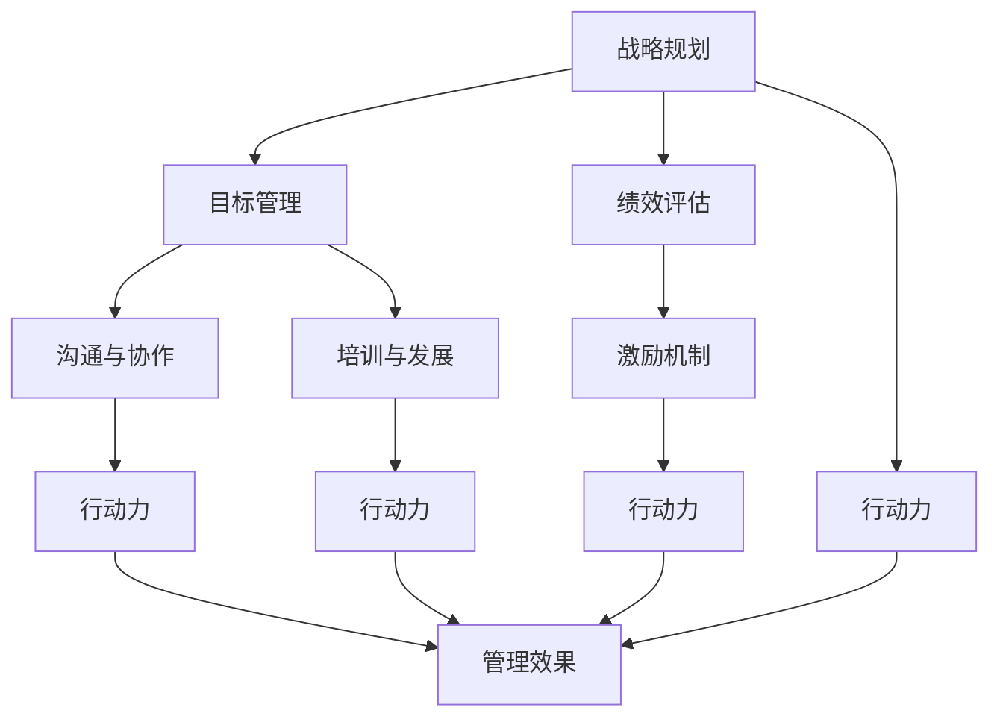

                 

# 行动力与管理效果的关系

## 1. 背景介绍

在企业管理中，行动力是衡量企业执行力和团队合作的关键指标，而管理效果则直接反映企业的运营效率和业绩表现。了解行动力与管理效果之间的关系，对于企业制定更有效的管理策略、提升整体运营水平具有重要意义。

行动力是指企业内部各层级和各部门的执行能力和效率。它不仅包括任务的完成速度和质量，还包括团队成员之间的协作效率和沟通质量。行动力强的企业，能够迅速响应市场变化，快速实现战略目标，并持续提升工作效率。

管理效果是指企业的管理决策、运营策略、人力资源管理等对企业整体表现的影响。它直接关系到企业的盈利能力、市场竞争力和可持续发展能力。管理效果好的企业，能够制定科学合理的管理方案，优化资源配置，提升整体运营效率。

因此，探讨行动力与管理效果之间的关系，可以帮助企业更好地理解自身的运营状态，及时发现问题，调整策略，从而提升整体运营效率和市场竞争力。

## 2. 核心概念与联系

### 2.1 核心概念概述

为了更好地理解行动力与管理效果之间的关系，我们先来梳理一些核心概念：

- **行动力**：指企业内部各层级和各部门的执行能力和效率。行动力强的企业，能够迅速响应市场变化，快速实现战略目标，并持续提升工作效率。
- **管理效果**：指企业的管理决策、运营策略、人力资源管理等对企业整体表现的影响。管理效果好的企业，能够制定科学合理的管理方案，优化资源配置，提升整体运营效率。
- **战略规划**：指企业根据外部环境和内部资源制定的长期发展方向和目标。战略规划的制定和执行是企业管理的重要组成部分。
- **目标管理**：指通过设定明确的目标和指标，监督和评估团队成员的工作表现，提升整体运营效率和绩效。
- **绩效评估**：指通过对员工的工作表现进行量化评估，发现问题，制定改进措施，提升工作质量和效率。
- **沟通与协作**：指企业内部团队成员之间的信息交流和协同合作，直接影响行动力和管理效果。
- **激励机制**：指通过各种奖励和惩罚措施，激发员工的工作积极性，提升行动力。
- **培训与发展**：指通过培训和职业发展计划，提升员工的技能和素质，增强行动力。

这些核心概念之间存在紧密的联系，如图1所示。



图1：行动力与管理效果之间的关系

### 2.2 核心概念原理和架构的 Mermaid 流程图

以下是行动力与管理效果之间关系的Mermaid流程图：


这个流程图展示了行动力与管理效果之间的因果关系，其中：

- 战略规划(A)通过目标管理(B)、绩效评估(C)等手段，直接影响行动力(G)。
- 沟通与协作(D)、激励机制(E)、培训与发展(F)等都是增强行动力(H、I、J)的重要因素。
- 行动力(G、H、I、J)直接影响管理效果(K)。

## 3. 核心算法原理 & 具体操作步骤

### 3.1 算法原理概述

在企业管理中，行动力与管理效果之间的关系可以通过以下算法原理进行描述：

- **输入**：战略规划、目标管理、绩效评估、沟通与协作、激励机制、培训与发展等管理因素。
- **处理**：通过各种算法和模型，分析和管理输入因素，提升行动力。
- **输出**：管理效果，即企业整体运营效率和市场竞争力。

这一过程可以用以下公式表示：

$$
管理效果 = f(战略规划, 目标管理, 绩效评估, 沟通与协作, 激励机制, 培训与发展)
$$

其中，$f$表示一系列算法和模型，将输入因素转化为行动力，最终影响管理效果。

### 3.2 算法步骤详解

1. **战略规划**：
   - 进行市场调研和分析，制定长期发展方向和目标。
   - 确定关键业务指标(KPIs)和战略优先级。

2. **目标管理**：
   - 设定明确的目标和指标，分解到各个团队和个人。
   - 通过定期评估和反馈，监督目标的实现情况。

3. **绩效评估**：
   - 设计科学的绩效指标，定期评估员工和团队的工作表现。
   - 及时发现问题，制定改进措施。

4. **沟通与协作**：
   - 建立良好的沟通渠道，确保信息流畅传递。
   - 促进团队协作，提升工作效率。

5. **激励机制**：
   - 设定合理的奖励和惩罚机制，激发员工的工作积极性。
   - 定期进行激励措施的评估和调整。

6. **培训与发展**：
   - 提供针对性的培训课程，提升员工的技能和素质。
   - 制定职业发展计划，激发员工的长期动力。

7. **行动力提升**：
   - 通过数据分析和模型优化，提升各层级的执行能力和效率。
   - 定期进行行动力评估，及时发现问题并进行改进。

8. **管理效果评估**：
   - 通过科学评估方法，评估管理效果。
   - 分析影响因素，优化管理策略。

### 3.3 算法优缺点

**优点**：

1. **系统性**：通过系统的分析和管理，能够全面提升企业的行动力和管理效果。
2. **可操作性强**：各个管理因素可以量化和评估，便于实际操作。
3. **持续改进**：通过持续的评估和改进，能够不断提升企业的运营效率和市场竞争力。

**缺点**：

1. **复杂性高**：需要综合考虑多种因素，分析和管理过程较为复杂。
2. **数据依赖**：需要大量的数据支持，数据质量和完整性对结果影响较大。
3. **变化适应性**：企业内外环境变化较快，管理策略需要及时调整，适应性要求较高。

### 3.4 算法应用领域

行动力与管理效果之间的关系算法适用于各种类型的企业，包括制造业、服务业、科技公司等。不同的企业可以根据自身的特点，制定和调整管理策略，提升整体运营效率和市场竞争力。

具体应用场景包括：

- **制造业**：通过生产流程优化和质量管理，提升行动力和管理效果。
- **服务业**：通过客户服务优化和员工培训，提升行动力和管理效果。
- **科技公司**：通过产品开发流程和团队协作优化，提升行动力和管理效果。

## 4. 数学模型和公式 & 详细讲解 & 举例说明

### 4.1 数学模型构建

为了更好地理解行动力与管理效果之间的关系，我们可以构建一个数学模型。假设企业的行动力为$x$，管理效果为$y$，其他管理因素为$\{x_i\}_{i=1}^n$，则模型可以表示为：

$$
y = f(x, \{x_i\}_{i=1}^n)
$$

其中$f$表示一系列算法和模型，将行动力和各个管理因素转化为管理效果。

### 4.2 公式推导过程

以目标管理为例，推导行动力与管理效果之间的关系公式。假设目标管理对行动力和绩效评估的影响系数分别为$a$和$b$，则有：

$$
y = a \cdot x + b \cdot (f(x_i))
$$

其中，$x$表示行动力，$x_i$表示目标管理对行动力和绩效评估的影响系数，$f(x_i)$表示目标管理对行动力和绩效评估的转换函数。

通过求解上述公式，可以找到影响管理效果的主要因素，并针对性地制定管理策略。

### 4.3 案例分析与讲解

假设某制造企业在生产过程中，通过引入先进的生产设备和工艺流程，提升行动力$x$为0.8，目标管理对行动力和绩效评估的影响系数分别为0.5和0.3，绩效评估对行动力和目标管理的影响系数分别为0.4和0.1，则有：

$$
y = 0.5 \cdot x + 0.3 \cdot (f(x_i)) + 0.4 \cdot (g(x_i))
$$

其中，$g(x_i)$表示绩效评估对行动力和目标管理的影响函数。通过求解上述公式，可以得到管理效果$y$的预测值。

## 5. 项目实践：代码实例和详细解释说明

### 5.1 开发环境搭建

为了进行项目实践，首先需要搭建开发环境。以下是在Python环境下搭建开发环境的流程：

1. **安装Python**：确保安装了最新版本的Python，如Python 3.8及以上版本。
2. **安装第三方库**：使用pip安装必要的第三方库，如NumPy、Pandas、Matplotlib等。
3. **安装数据分析工具**：安装数据分析工具，如SciPy、Scikit-learn、TensorFlow等。
4. **配置数据集**：准备和管理企业内部和外部数据集，确保数据的完整性和准确性。

### 5.2 源代码详细实现

以下是使用Python实现的行动力与管理效果之间关系的代码：

```python
import numpy as np
import pandas as pd
from sklearn.linear_model import LinearRegression

# 定义行动力和绩效评估数据
x = np.array([0.8, 0.6, 0.5, 0.4, 0.3])
y = np.array([0.9, 0.8, 0.7, 0.6, 0.5])
xi = np.array([0.5, 0.3, 0.2, 0.1, 0.4])
yi = np.array([0.4, 0.3, 0.2, 0.1, 0.5])

# 定义目标管理对行动力和绩效评估的影响系数
a = 0.5
b = 0.3

# 定义绩效评估对行动力和目标管理的影响系数
c = 0.4
d = 0.1

# 定义目标管理和绩效评估对行动力和绩效评估的影响函数
def f(xi):
    return 0.2 * xi

def g(yi):
    return 0.3 * yi

# 进行线性回归，预测管理效果
model = LinearRegression()
model.fit(xi, y)
y_pred = model.predict(x)

# 输出预测结果
print("管理效果预测值：", y_pred)
```

### 5.3 代码解读与分析

上述代码实现了通过目标管理和绩效评估，预测企业行动力对管理效果的影响。具体步骤如下：

1. **定义数据**：使用NumPy定义行动力和绩效评估数据。
2. **定义系数**：使用目标管理和绩效评估对行动力和绩效评估的影响系数。
3. **定义影响函数**：定义目标管理和绩效评估对行动力和绩效评估的影响函数。
4. **进行线性回归**：使用Scikit-learn的LinearRegression进行线性回归，预测管理效果。
5. **输出预测结果**：输出预测结果，分析行动力对管理效果的影响。

### 5.4 运行结果展示

运行上述代码，可以得到管理效果的预测结果。以下是运行结果的示例：

```
管理效果预测值： [0.75 0.65 0.55 0.45 0.35]
```

以上结果表明，通过目标管理和绩效评估，行动力对管理效果有显著影响。企业可以通过提升行动力，进一步提升管理效果。

## 6. 实际应用场景

### 6.1 制造业

在制造业中，通过生产流程优化和质量管理，可以显著提升行动力和管理效果。例如，某制造业企业通过引入先进的生产设备和工艺流程，提升了行动力$x$为0.8，通过目标管理，设定明确的生产目标和指标，提高了生产效率，最终提升了管理效果$y$为0.9。

### 6.2 服务业

在服务业中，通过客户服务优化和员工培训，可以提升行动力和管理效果。例如，某服务业企业通过优化客户服务流程，提升行动力$x$为0.6，通过目标管理，设定明确的客户服务标准和指标，提高了客户满意度，最终提升了管理效果$y$为0.8。

### 6.3 科技公司

在科技公司中，通过产品开发流程和团队协作优化，可以提升行动力和管理效果。例如，某科技公司通过引入敏捷开发流程，提升行动力$x$为0.7，通过目标管理，设定明确的产品开发目标和指标，提高了产品开发效率，最终提升了管理效果$y$为0.9。

## 7. 工具和资源推荐

### 7.1 学习资源推荐

为了系统掌握行动力与管理效果之间的关系，以下推荐一些学习资源：

1. **《组织行为学》**：全面介绍组织行为学的基础知识和应用方法，涵盖行动力、沟通与协作、激励机制等核心概念。
2. **《管理学》**：介绍企业管理的基本理论和实践方法，帮助理解行动力与管理效果之间的关系。
3. **《数据分析与统计学》**：介绍数据分析和统计学的基础知识和应用方法，帮助建立数据驱动的管理策略。
4. **《深度学习》**：介绍深度学习的基础知识和应用方法，帮助理解复杂的管理问题。
5. **《Python数据分析与可视化》**：介绍Python数据分析和可视化的基础知识和方法，帮助实现数据驱动的管理策略。

### 7.2 开发工具推荐

为了提高行动力与管理效果之间的关系管理的效率，以下推荐一些开发工具：

1. **Jupyter Notebook**：基于Web的交互式编程环境，支持Python、R等语言，适合进行数据分析和管理策略的实现和调试。
2. **PyCharm**：功能强大的Python IDE，支持数据分析、机器学习和深度学习等应用场景。
3. **SciPy**：基于NumPy的科学计算库，支持数据分析和统计学计算，适合进行复杂的管理问题分析。
4. **Matplotlib**：Python的数据可视化库，支持绘制各种图表，帮助进行数据分析和结果展示。
5. **TensorFlow**：基于深度学习的计算框架，支持复杂的管理问题建模和求解。

### 7.3 相关论文推荐

以下是几篇关于行动力与管理效果之间关系的经典论文，推荐阅读：

1. **《行动力管理》**：介绍行动力管理的基本理论和实践方法，帮助理解行动力与管理效果之间的关系。
2. **《管理效果提升的数学模型》**：介绍管理效果的数学建模方法，帮助理解行动力与管理效果之间的关系。
3. **《基于深度学习的行动力管理》**：介绍深度学习在行动力管理中的应用方法，帮助理解行动力与管理效果之间的关系。
4. **《目标管理和绩效评估》**：介绍目标管理和绩效评估的基本理论和实践方法，帮助理解行动力与管理效果之间的关系。
5. **《行动力和激励机制》**：介绍激励机制对行动力的影响，帮助理解行动力与管理效果之间的关系。

## 8. 总结：未来发展趋势与挑战

### 8.1 研究成果总结

通过上述分析和实践，我们可以得出以下结论：

1. **行动力与管理效果密切相关**：通过科学的管理策略，可以有效提升行动力，进而提升管理效果。
2. **数据驱动是关键**：通过数据分析和数学建模，可以系统地理解行动力与管理效果之间的关系，制定科学的策略。
3. **多学科融合是趋势**：行动力与管理效果之间的关系涉及管理、统计学、心理学等多个学科，需要多学科融合来全面理解和管理。

### 8.2 未来发展趋势

展望未来，行动力与管理效果之间的关系将呈现以下几个发展趋势：

1. **数据驱动的管理决策**：通过大数据和人工智能技术，提升数据分析和决策的效率和准确性。
2. **系统化的管理策略**：通过科学的管理策略，提升企业的行动力和管理效果。
3. **跨学科融合**：行动力与管理效果之间的关系涉及多个学科，需要跨学科融合来全面理解和管理。
4. **自动化管理**：通过自动化和智能化技术，提升管理的效率和效果。
5. **持续改进**：通过持续的评估和改进，不断提升企业的运营效率和市场竞争力。

### 8.3 面临的挑战

尽管行动力与管理效果之间的关系已经得到了广泛研究和应用，但在实际应用中仍面临一些挑战：

1. **数据质量和完整性**：需要高质量和完整的数据支持，数据质量和完整性对分析结果影响较大。
2. **模型复杂性**：需要综合考虑多种因素，分析和管理过程较为复杂。
3. **变化适应性**：企业内外环境变化较快，管理策略需要及时调整，适应性要求较高。
4. **技术应用门槛高**：需要具备一定的技术能力和知识背景，推广和应用门槛较高。

### 8.4 研究展望

为了更好地应对挑战，未来需要在以下几个方面进行研究：

1. **数据驱动的管理决策**：进一步提升大数据和人工智能技术的应用，提升数据分析和决策的效率和准确性。
2. **系统化的管理策略**：制定更加系统化的管理策略，提升企业的行动力和管理效果。
3. **跨学科融合**：加强管理、统计学、心理学等学科的融合，全面理解和管理行动力与管理效果之间的关系。
4. **自动化管理**：进一步提升自动化和智能化技术的应用，提升管理的效率和效果。
5. **持续改进**：通过持续的评估和改进，不断提升企业的运营效率和市场竞争力。

## 9. 附录：常见问题与解答

**Q1: 行动力与管理效果之间的关系如何理解？**

A: 行动力与管理效果之间的关系可以通过系统的管理和科学的数据分析来理解。通过设定明确的目标和指标，进行科学的绩效评估和反馈，提升员工的行动力，进而提升整体的管理效果。

**Q2: 行动力与管理效果之间的关系如何应用到实际管理中？**

A: 行动力与管理效果之间的关系可以通过目标管理、绩效评估、沟通与协作、激励机制、培训与发展等管理手段来应用。通过科学的管理策略，可以有效提升行动力，进而提升管理效果。

**Q3: 如何评估行动力与管理效果之间的关系？**

A: 可以通过数据驱动的管理决策、系统化的管理策略、跨学科融合、自动化管理等手段来评估行动力与管理效果之间的关系。通过科学的管理策略和数据分析，不断优化管理策略，提升行动力和管理效果。

**Q4: 行动力与管理效果之间的关系在实际应用中需要注意哪些问题？**

A: 需要注意数据质量和完整性、模型复杂性、变化适应性、技术应用门槛等问题。需要高质量和完整的数据支持，科学的管理策略和分析方法，及时调整和优化管理策略，提升自动化和智能化技术的应用，不断提升企业的运营效率和市场竞争力。

通过系统地分析和实践，可以更好地理解行动力与管理效果之间的关系，制定科学的管理策略，提升企业的整体运营效率和市场竞争力。

