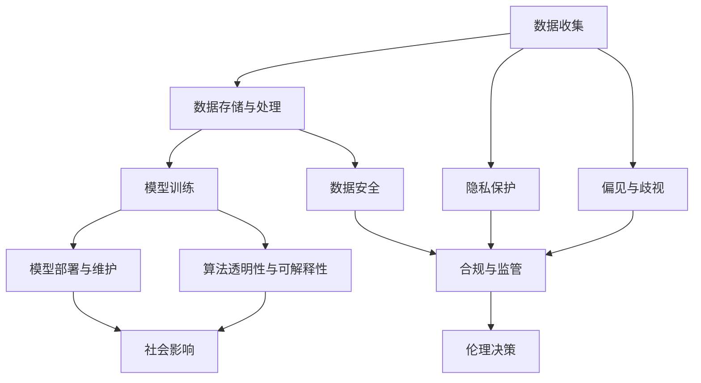

                 

## 1. 背景介绍

人工智能（AI）正逐渐渗透到生活的各个角落，从智能手机到无人驾驶汽车，从智能家居到医疗健康，AI 技术的应用范围日益广泛。然而，伴随其普及，AI 引发的伦理问题也逐渐显现。从隐私保护、数据安全，到偏见与歧视、决策透明性，再到自动化对就业市场的影响，这些问题不仅关系到技术本身，更牵涉到社会伦理和道德规范。

本文将深入探讨 AI 伦理问题，阐述其重要性及可能的解决方案，并提出负责任地发展人类计算的策略。通过这些探讨，我们旨在为 AI 技术的健康发展提供指导，确保其在服务人类、提升生活质量的同时，也尊重和维护人类的价值观和道德规范。

## 2. 核心概念与联系

### 2.1 核心概念概述

为更好地理解负责任的 AI 开发，我们需首先明确几个关键概念及其相互关系：

- **人工智能（AI）**：指模拟人类智能过程的技术，包括机器学习、深度学习等子领域。
- **伦理问题（Ethical Issues）**：涉及技术应用对社会、个人的影响，包括隐私、安全、偏见、责任分配等问题。
- **负责任的开发（Responsible Development）**：在技术开发过程中，采取措施预防和解决伦理问题，确保技术应用符合伦理规范和社会价值观。
- **人类计算（Human-Centric Computing）**：以人的需求和福祉为中心，强调技术的社会价值和伦理责任。

### 2.2 核心概念联系

人工智能的开发和应用涉及到多个层面的决策，包括技术选择、数据使用、算法设计、结果应用等。伦理问题往往在这些层面以不同的形式表现出来。例如，数据收集与处理过程中可能侵犯隐私，算法决策中可能存在偏见和歧视，结果应用中可能带来社会不公。因此，负责任的开发不仅是技术问题，更是伦理和社会问题的综合考量。

下图展示了人工智能开发过程中，各环节与伦理问题之间的联系：



从数据收集开始，到模型部署结束，每一个环节都可能涉及到伦理问题。因此，只有在开发过程中不断进行伦理考量，才能确保 AI 技术的安全、公正和负责任地应用。

## 3. 核心算法原理 & 具体操作步骤

### 3.1 算法原理概述

负责任的 AI 开发涉及到多个领域的算法与技术，包括数据预处理、模型训练、结果评估等。其核心在于通过算法和技术的合理设计，预防和解决潜在的伦理问题。

1. **数据预处理**：包括数据清洗、去重、归一化等，确保数据质量和多样性，避免偏见和歧视。
2. **模型训练**：通过选择合适的损失函数、正则化技术、优化算法等，训练公平、透明、可解释的模型。
3. **结果评估**：评估模型的公正性、透明性、可解释性等，确保模型的应用符合伦理标准。

### 3.2 算法步骤详解

负责任的 AI 开发步骤如下：

1. **数据伦理审查**：在数据收集与处理阶段，进行隐私保护、数据安全、偏见与歧视等方面的伦理审查。
2. **模型设计与选择**：根据任务需求，选择合适模型架构，并设计公平、透明的训练与优化算法。
3. **算法开发与测试**：开发模型，并在多种场景下进行测试，确保模型在不同数据集上的公正性和透明性。
4. **结果评估与监控**：对模型结果进行公正性、透明性、可解释性等评估，并在实际应用中持续监控，及时发现并解决潜在问题。

### 3.3 算法优缺点

负责任的 AI 开发的优点在于：

- **提高技术公信力**：通过伦理考量，确保技术应用的公正性和透明性，提升公众对 AI 技术的信任。
- **预防伦理风险**：通过伦理审查和监控，预防 AI 技术应用中的隐私侵犯、数据安全、偏见与歧视等问题。
- **推动可持续发展**：确保 AI 技术应用符合社会价值观和道德规范，促进社会和经济的可持续发展。

其缺点包括：

- **开发成本增加**：负责开发涉及更多的伦理考量，可能导致开发成本增加。
- **技术复杂性**：需要更多的技术手段和专业知识，以确保伦理审查和监控的有效性。
- **适应性不足**：由于各领域伦理问题的特殊性，通用的伦理解决方案可能不适用于所有场景。

### 3.4 算法应用领域

负责任的 AI 开发在多个领域具有重要应用，包括：

- **医疗健康**：确保 AI 医疗诊断工具的公正性、透明性和可解释性，避免医疗数据滥用。
- **金融服务**：防止 AI 金融算法中的偏见与歧视，保护用户隐私和数据安全。
- **教育**：确保 AI 教育技术公平、透明，避免算法偏见对学生学习的影响。
- **司法系统**：确保 AI 司法决策系统的公正性、透明性，避免算法偏见和歧视。
- **智能城市**：确保 AI 城市管理系统的公平性、透明性，避免数据滥用和隐私侵犯。

## 4. 数学模型和公式 & 详细讲解 & 举例说明

### 4.1 数学模型构建

在负责任的 AI 开发中，数学模型用于解决数据处理、模型训练、结果评估等多个环节的问题。以下是一个通用的数学模型框架：

1. **数据处理模型**：用于数据预处理，包括数据清洗、归一化等。
2. **模型训练模型**：用于模型训练，包括损失函数、正则化技术、优化算法等。
3. **结果评估模型**：用于结果公正性、透明性和可解释性的评估，包括公平性指标、透明性指标、可解释性指标等。

### 4.2 公式推导过程

以数据处理为例，假设我们有一组数据集 $D = \{(x_i, y_i)\}_{i=1}^N$，其中 $x_i$ 是输入，$y_i$ 是标签。在进行数据预处理时，我们可能需要进行去重、归一化等操作。假设去重后的数据集为 $D' = \{(x'_i, y'_i)\}_{i=1}^{N'}$，其中 $N' < N$。

去重操作可以通过构建哈希表 $H$ 实现：

```python
from collections import defaultdict

H = defaultdict(list)
for x, y in D:
    H[x].append(y)

D_prime = [(x, y) for x, y_list in H.items() if len(y_list) == 1]
```

归一化操作可以使用标准化公式实现：

$$
x'_i = \frac{x_i - \mu}{\sigma}
$$

其中 $\mu$ 和 $\sigma$ 分别为数据的均值和标准差。

### 4.3 案例分析与讲解

以医疗健康领域为例，AI 诊断工具的开发需注意以下伦理问题：

1. **数据隐私保护**：确保患者数据在收集和处理过程中不被滥用，应采取严格的隐私保护措施。
2. **算法透明性与可解释性**：诊断工具的决策过程应透明，医生和患者应能理解其背后的逻辑和依据。
3. **偏见与歧视**：避免算法在性别、种族、年龄等方面存在偏见，确保诊断结果的公正性。

## 5. 项目实践：代码实例和详细解释说明

### 5.1 开发环境搭建

为进行负责任的 AI 开发，我们需要搭建一个开发环境。以下是一个基本的 Python 开发环境配置步骤：

1. 安装 Python：从官网下载并安装 Python 3.x，如 Python 3.7、3.8 或 3.9。
2. 安装必要的 Python 包：如 Numpy、Pandas、Scikit-Learn 等。
3. 配置开发环境：如 Jupyter Notebook、Git、IDE 等。

### 5.2 源代码详细实现

以下是一个简单的 Python 代码示例，展示如何进行数据预处理和模型训练：

```python
import numpy as np
from sklearn.preprocessing import StandardScaler

# 模拟数据集
X = np.random.randn(100, 10)
y = np.random.randint(0, 2, 100)

# 数据预处理：去重、归一化
H = {}
for i in range(len(X)):
    key = tuple(X[i])
    if key in H:
        H[key].append(y[i])
    else:
        H[key] = [y[i]]

X_prime = []
y_prime = []
for key, value in H.items():
    X_prime.append(key)
    y_prime.append(value[0])

# 归一化
scaler = StandardScaler()
X_prime = scaler.fit_transform(X_prime)

# 模型训练：线性回归
from sklearn.linear_model import LinearRegression
model = LinearRegression()
model.fit(X_prime, y_prime)
```

### 5.3 代码解读与分析

在上述代码中，我们首先通过哈希表去重，然后对数据进行标准化处理。最后，使用线性回归模型进行训练。

- 去重操作：通过哈希表，快速判断并去除重复数据。
- 归一化操作：使用标准化公式，将数据缩放到均值为 0，标准差为 1 的标准正态分布。
- 模型训练：使用线性回归模型，训练数据并得到模型参数。

## 6. 实际应用场景

### 6.1 医疗健康

在医疗健康领域，AI 诊断工具需确保数据隐私保护、算法透明性与可解释性、偏见与歧视等多方面伦理问题。通过负责任的开发，可以提高医疗诊断的准确性和公正性，改善医疗服务质量。

### 6.2 金融服务

金融领域中的 AI 算法需避免偏见与歧视，保护用户隐私和数据安全。通过负责任的开发，可以提升金融服务的公平性和透明度，防止算法滥用。

### 6.3 教育

在教育领域，AI 教育工具需确保公平性、透明性，避免算法偏见对学生学习的影响。通过负责任的开发，可以提供个性化、公平的学习体验，促进教育公平。

### 6.4 司法系统

司法系统中的 AI 决策需确保公正性、透明性，避免算法偏见和歧视。通过负责任的开发，可以提高司法判决的公正性和可解释性，增强公众信任。

### 6.5 智能城市

智能城市中的 AI 系统需确保数据隐私保护、算法透明性与可解释性，避免数据滥用和隐私侵犯。通过负责任的开发，可以提高城市管理的效率和公正性，提升居民生活质量。

## 7. 工具和资源推荐

### 7.1 学习资源推荐

1. **《人工智能伦理》（Artificial Intelligence: A Guide for Thinking Humans）**：
   - 作者：Stuart Russell, Peter Norvig
   - 简介：全面介绍 AI 伦理问题，并提出解决方案，适合 AI 开发人员和研究人员阅读。

2. **《数据隐私保护》（Privacy Preserving Technologies）**：
   - 作者：Klaus Vogl, Josef Horn
   - 简介：详细介绍数据隐私保护技术，包括数据匿名化、数据加密等，适合数据科学家和隐私保护专家阅读。

3. **《AI 伦理与法律》（Ethics and Legal Issues in AI）**：
   - 作者：Jonathan Radford
   - 简介：结合伦理和法律视角，分析 AI 技术的社会影响，适合法律专业人士和 AI 研究人员阅读。

4. **《机器学习伦理与公平性》（Ethics and Fairness in Machine Learning）**：
   - 作者：Dániel Baumard
   - 简介：讨论机器学习中的伦理和公平性问题，适合 AI 开发者和机器学习研究人员阅读。

5. **Coursera 和 edX 在线课程**：
   - 推荐课程：《人工智能伦理》、《数据隐私与保护》、《AI 伦理与法律》等
   - 简介：提供大量免费和付费的在线课程，涵盖 AI 伦理和隐私保护等主题。

### 7.2 开发工具推荐

1. **Python**：
   - 简介：广泛使用的编程语言，支持大量的 AI 库和框架，如 Numpy、Pandas、Scikit-Learn 等。

2. **Jupyter Notebook**：
   - 简介：交互式编程环境，支持代码编写、数据可视化、报告生成等功能。

3. **Git**：
   - 简介：版本控制系统，支持代码协作、版本管理等功能。

4. **IDE**：
   - 推荐：PyCharm、VS Code、Sublime Text 等
   - 简介：支持代码编辑、调试、测试等功能，提升开发效率。

### 7.3 相关论文推荐

1. **《公平性、透明性与可解释性：一种新的 AI 评价指标》（Fairness, Transparency, and Explainability: A New AI Evaluation Metric）**：
   - 作者：Han Xiao, Faina Vaskin
   - 简介：提出新的 AI 评价指标，用于评估 AI 模型的公平性、透明性和可解释性。

2. **《负责任的 AI 开发：伦理审查与监控》（Responsible AI Development: Ethics Review and Monitoring）**：
   - 作者：Marianne Velard, Christopher Segal
   - 简介：探讨负责开发的方法，包括伦理审查和监控机制。

3. **《AI 偏见与歧视分析》（Bias and Fairness in AI）**：
   - 作者：Alyssa Smith, Crystal Dieterich
   - 简介：分析 AI 中的偏见与歧视问题，并提出解决方案。

4. **《数据隐私保护技术综述》（A Survey of Privacy-Preserving Technologies）**：
   - 作者：Kashif Rasul, Adnan Arif
   - 简介：综述数据隐私保护技术，包括数据匿名化、差分隐私等。

## 8. 总结：未来发展趋势与挑战

### 8.1 研究成果总结

负责任的 AI 开发已成为 AI 技术发展的重要组成部分，涉及数据伦理、算法透明性、偏见与歧视等多个方面。通过负责任的开发，可以确保 AI 技术的应用符合伦理规范和社会价值观，提升技术的公信力和社会价值。

### 8.2 未来发展趋势

未来，负责任的 AI 开发将呈现以下发展趋势：

1. **多学科融合**：跨学科合作，结合伦理学、社会学、法律学等多个领域的知识，解决 AI 技术的伦理问题。
2. **实时监控与评估**：引入实时监控和评估机制，及时发现和解决 AI 系统中的伦理问题。
3. **公众参与**：鼓励公众参与 AI 开发与评估，提升公众对 AI 技术的信任和接受度。
4. **可解释性增强**：提升 AI 系统的可解释性，确保决策过程的透明性和公正性。
5. **多样性与包容性**：推动 AI 技术的公平性和包容性，确保不同群体都能公平受益。

### 8.3 面临的挑战

负责任的 AI 开发仍然面临诸多挑战：

1. **伦理标准不一致**：不同国家和地区的伦理标准可能存在差异，如何统一标准，成为一大难题。
2. **数据隐私保护难度大**：隐私保护技术不断发展，但数据滥用和隐私侵犯的风险依然存在。
3. **偏见与歧视问题复杂**：算法偏见和歧视问题复杂多样，难以通过简单的技术手段解决。
4. **公众信任度低**：公众对 AI 技术的信任度不高，需要通过负责任的开发和透明化管理来提升信任。
5. **法律监管不足**：现有的法律法规尚不完善，难以有效监管 AI 技术的应用。

### 8.4 研究展望

未来的负责任的 AI 开发需要在以下方面进行深入研究：

1. **伦理规范制定**：制定统一且符合国际标准的伦理规范，指导 AI 技术的健康发展。
2. **技术创新**：开发新的技术手段，解决 AI 系统中的伦理问题，提升系统的公正性和透明性。
3. **公众教育**：通过公众教育和科普活动，提升公众对 AI 技术的理解和信任。
4. **法律框架建设**：完善法律法规，提供明确的法律依据，规范 AI 技术的应用。
5. **国际合作**：加强国际合作，分享 AI 技术的伦理实践和经验，推动全球 AI 技术的健康发展。

## 9. 附录：常见问题与解答

**Q1：如何确保 AI 系统的公正性？**

A: 确保 AI 系统的公正性需要采取多方面措施：

1. **数据公平性**：确保训练数据的多样性和代表性，避免数据偏见。
2. **算法透明性**：使用透明、可解释的算法，确保决策过程的透明性。
3. **定期审查**：定期对 AI 系统进行伦理审查，发现和解决潜在问题。
4. **多样性与包容性**：设计多样化的算法和模型，确保不同群体都能公平受益。

**Q2：AI 开发过程中如何进行伦理审查？**

A: 伦理审查是确保 AI 系统符合伦理规范的重要环节。以下是一个简单的伦理审查流程：

1. **数据隐私审查**：评估数据收集、存储和处理过程中的隐私保护措施。
2. **算法公平性审查**：评估算法在性别、种族、年龄等方面的公平性。
3. **透明性与可解释性审查**：评估算法的透明性和可解释性，确保决策过程的透明性。
4. **社会影响评估**：评估 AI 系统的社会影响，确保其符合伦理规范和社会价值观。

**Q3：AI 开发中如何预防偏见与歧视？**

A: 预防 AI 系统中的偏见与歧视需要采取以下措施：

1. **数据多样性**：确保训练数据的多样性和代表性，避免数据偏见。
2. **算法设计**：设计公平、透明的算法，避免算法偏见和歧视。
3. **模型监控**：持续监控 AI 系统的输出，发现和解决偏见与歧视问题。
4. **多模态融合**：引入多模态数据，提升 AI 系统的公正性。

**Q4：AI 开发中如何提升系统的透明性与可解释性？**

A: 提升 AI 系统的透明性与可解释性需要采取以下措施：

1. **可解释性模型**：使用可解释性强的模型，如决策树、线性回归等。
2. **特征解释**：解释模型中的关键特征，帮助理解决策过程。
3. **可视化工具**：使用可视化工具，展示模型的决策过程和输出结果。
4. **用户交互**：通过用户交互，提升系统的透明性和可解释性。

**Q5：AI 开发中如何确保数据隐私保护？**

A: 确保 AI 开发中的数据隐私保护需要采取以下措施：

1. **数据匿名化**：对数据进行匿名化处理，防止数据泄露。
2. **差分隐私**：使用差分隐私技术，保护数据隐私。
3. **访问控制**：设置严格的访问控制机制，防止数据滥用。
4. **加密技术**：使用加密技术，保护数据在传输和存储过程中的隐私。

---

作者：禅与计算机程序设计艺术 / Zen and the Art of Computer Programming

