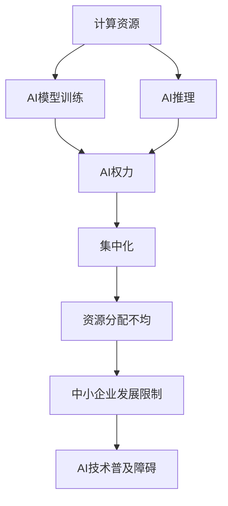

                 

## 1. 背景介绍

### 1.1 问题由来

人工智能（AI）技术的迅猛发展，尤其是深度学习算法的突破，使AI在各个领域展示了卓越的潜力。从自动驾驶、医疗诊断、金融分析到天气预测、游戏智能，AI正以颠覆性力量改变世界。然而，伴随AI的广泛应用，计算资源与AI权力集中化的关系问题逐渐浮出水面。

近年来，随着深度学习模型的复杂度提升和数据量的爆炸增长，计算资源的需求日益增大。以深度学习为主的AI系统需要高性能计算资源，如GPU、TPU等，来支撑庞大的模型训练和推理工作。与此同时，随着巨头企业在AI领域的投入加剧，计算资源逐渐集中，形成了一批具备强大AI能力和资源的超级企业，如Google、Facebook、Amazon等。

计算资源与AI权力的集中化，对社会、经济、伦理等方面产生了深远影响。计算资源的不均衡分配，使得少数企业能够掌握更多的AI技术，从而在竞争中获得优势；而大多数企业则因为计算资源的匮乏，难以充分发挥AI的潜力。

### 1.2 问题核心关键点

计算资源与AI权力集中化的关系涉及多个关键点：

- **计算资源需求**：深度学习模型，尤其是大模型，对计算资源的需求量巨大。如何优化计算资源的使用，提高模型训练和推理的效率，是一个重要问题。
- **AI技术垄断**：少数大型企业掌握先进的AI技术，对AI市场形成垄断，其他企业难以进入。这不仅影响公平竞争，还可能导致数据隐私、伦理安全等问题。
- **计算资源分配**：计算资源的分配不均衡，使中小企业难以受益，阻碍了AI技术的普及和发展。
- **可持续性问题**：大量计算资源的消耗，对环境、能源等带来了巨大压力，可持续性问题亟待解决。

本文将围绕这些核心关键点，深入探讨计算资源与AI权力集中化之间的关系，并提出一些可行的解决方案。

## 2. 核心概念与联系

### 2.1 核心概念概述

要理解计算资源与AI权力集中化的关系，首先需要掌握几个关键概念：

- **计算资源**：指用于AI模型训练和推理的硬件资源，如CPU、GPU、TPU等。
- **AI权力**：指企业或组织在AI技术上的影响力、控制力和资源投入。
- **集中化**：指计算资源和AI权力集中在少数企业或组织手中，形成垄断局面。

这些概念之间存在密切联系，主要体现在：

- **计算资源是AI权力的基础**：高性能计算资源是深度学习模型训练和推理的前提，没有足够的计算资源，AI技术的开发和应用受限。
- **AI权力集中化**：计算资源的集中化是AI权力集中化的重要体现。只有掌握了强大的计算资源，企业才能在AI领域占据优势，形成垄断。
- **资源分配不均**：计算资源的集中化，进一步加剧了资源分配不均，中小企业难以获得所需的计算资源，限制了其AI能力的发展。

### 2.2 核心概念原理和架构的 Mermaid 流程图



这个流程图展示了计算资源、AI模型、AI权力、集中化、资源分配不均、中小企业发展限制和AI技术普及障碍之间的联系。其中，计算资源是AI模型训练和推理的基础，AI模型的性能依赖于强大的计算资源。而AI权力与集中化紧密相关，只有掌握大量计算资源的企业才能在AI领域占据主导地位。计算资源的不均衡分配，限制了中小企业的AI能力发展，进而阻碍了AI技术的普及。

## 3. 核心算法原理 & 具体操作步骤

### 3.1 算法原理概述

计算资源与AI权力集中化的关系，本质上是一种资源-权力映射。计算资源越丰富，AI权力越集中，企业越能在AI领域占据优势。因此，优化计算资源的使用，提高计算资源的可及性，是缓解计算资源与AI权力集中化问题的重要途径。

具体而言，可以从以下几个方面入手：

1. **计算资源优化**：通过算法优化、模型压缩等手段，减少计算资源的需求。
2. **资源共享**：建立计算资源共享平台，使得更多企业能够共享计算资源。
3. **公平分配**：设计合理的资源分配机制，确保计算资源的公平分配。
4. **开源合作**：鼓励开源合作，共同提升计算资源和AI技术的共享与普及。

### 3.2 算法步骤详解

基于上述分析，以下详细介绍优化计算资源和缓解计算资源与AI权力集中化问题的具体操作步骤：

**Step 1: 计算资源优化**

1. **算法优化**：通过优化算法和模型架构，减少计算资源的消耗。例如，使用剪枝、量化、稀疏化等技术，减少模型参数量，提高模型训练和推理的效率。
2. **模型压缩**：采用模型压缩技术，如知识蒸馏、剪枝、量化等，减小模型的存储和计算需求，提升模型的运行速度和可部署性。

**Step 2: 资源共享**

1. **计算资源共享平台**：建立计算资源共享平台，如Google Cloud TPU、AWS SageMaker等，使得企业能够共享计算资源，降低计算成本。
2. **联邦学习**：采用联邦学习技术，通过分布式计算，使得多个企业共享模型训练数据，共同提升AI模型的性能。
3. **计算集群**：建立计算集群，集中管理计算资源，提高资源的利用率和效率。

**Step 3: 公平分配**

1. **资源配额管理**：设计合理的资源配额管理机制，确保计算资源的公平分配。例如，基于企业规模、贡献度等因素，合理分配计算资源。
2. **资源池管理**：建立资源池管理机制，确保资源分配的透明性和公正性。

**Step 4: 开源合作**

1. **开源框架**：鼓励企业开源AI框架和算法，共同提升AI技术的普及和共享。例如，TensorFlow、PyTorch等开源框架，已经广泛应用。
2. **开源模型**：鼓励企业共享模型，促进模型的交流与优化。例如，HuggingFace、Keras Hub等开源模型库，已经积累了大量的模型资源。
3. **开源社区**：建立开源社区，促进企业和开发者之间的合作与交流，共同提升AI技术的发展。

### 3.3 算法优缺点

**优点：**

1. **提高资源利用率**：通过优化算法和模型压缩，可以显著减少计算资源的需求，提高资源的利用率。
2. **降低计算成本**：计算资源共享平台和联邦学习技术，可以降低企业计算成本，提升AI技术的普及性。
3. **公平分配资源**：合理的资源配额管理机制和资源池管理，可以确保计算资源的公平分配，促进中小企业的AI能力发展。
4. **推动技术进步**：开源合作机制，可以加速AI技术的交流与优化，促进技术的进步和普及。

**缺点：**

1. **算法复杂度增加**：优化算法和模型压缩，可能会增加算法的复杂度，增加开发的难度和成本。
2. **资源共享风险**：计算资源共享平台可能面临数据隐私和安全风险，需要设计严格的保护机制。
3. **资源分配复杂性**：资源配额管理机制和资源池管理，需要复杂的设计和维护，可能存在管理难度。
4. **开源生态维护成本高**：开源合作机制需要大量的维护和更新工作，可能存在成本和可持续性问题。

### 3.4 算法应用领域

计算资源优化和公平分配的方法，适用于多个AI应用领域，例如：

- **自动驾驶**：需要大量计算资源进行模型训练和推理，优化算法和资源共享可以有效降低成本。
- **医疗诊断**：深度学习模型在医疗影像分析、基因组学等领域应用广泛，计算资源优化和共享可以提升模型的准确性和可部署性。
- **金融分析**：金融市场预测、风险评估等需要高性能计算资源，资源优化和共享可以提高模型的实时性和稳定性。
- **环境监测**：气候变化、生态系统分析等需要大规模数据处理，资源优化和共享可以提升计算效率和数据处理能力。

## 4. 数学模型和公式 & 详细讲解

### 4.1 数学模型构建

计算资源与AI权力集中化的关系，可以通过数学模型进行建模和分析。以下介绍一个简化的模型构建过程：

**模型假设**：
- 假设有 $n$ 家企业，每家企业掌握的计算资源为 $C_i$，$i=1,...,n$。
- 假设每家企业掌握的AI权力为 $P_i$，$i=1,...,n$。
- 假设计算资源与AI权力之间的关系为 $P_i=f(C_i)$，其中 $f$ 为映射函数。

**模型目标**：
- 最大化所有企业AI权力的总和，即 $\max \sum_{i=1}^n P_i$。

**模型约束**：
- 计算资源总和的约束：$\sum_{i=1}^n C_i$。
- 计算资源的分配约束：$C_i \geq 0$，$i=1,...,n$。

### 4.2 公式推导过程

**目标函数**：
$$
\max \sum_{i=1}^n P_i
$$

**约束条件**：
$$
\begin{aligned}
& \sum_{i=1}^n C_i \leq C_{\text{total}} \\
& C_i \geq 0, \quad i=1,...,n
\end{aligned}
$$

其中 $C_{\text{total}}$ 为计算资源总和。

**优化问题**：
$$
\begin{aligned}
& \max \sum_{i=1}^n P_i \\
& \text{s.t.} \quad \sum_{i=1}^n C_i \leq C_{\text{total}} \\
& \quad C_i \geq 0, \quad i=1,...,n
\end{aligned}
$$

**求解方法**：
- 使用线性规划等优化算法，求解上述线性优化问题。

### 4.3 案例分析与讲解

假设某城市有10家企业，每家企业需要 $C_i$ 的计算资源，计算资源总和为 $C_{\text{total}}$。企业的AI权力与计算资源的关系为 $P_i=f(C_i)$。

**目标函数**：
$$
\max \sum_{i=1}^{10} P_i
$$

**约束条件**：
$$
\begin{aligned}
& \sum_{i=1}^{10} C_i \leq C_{\text{total}} \\
& C_i \geq 0, \quad i=1,...,10
\end{aligned}
$$

通过线性规划求解，可以找到最优的计算资源分配方案，使得所有企业AI权力的总和最大化。

## 5. 项目实践：代码实例和详细解释说明

### 5.1 开发环境搭建

在进行计算资源优化和公平分配的实践时，需要准备好相应的开发环境。以下是使用Python进行计算资源优化和共享的开发环境配置流程：

1. **安装Anaconda**：从官网下载并安装Anaconda，用于创建独立的Python环境。

2. **创建并激活虚拟环境**：
```bash
conda create -n ai-env python=3.8 
conda activate ai-env
```

3. **安装必要的库**：
```bash
pip install numpy pandas scikit-learn matplotlib
```

4. **安装计算资源优化工具**：
```bash
pip install model_compression prune_ml
```

5. **安装计算资源共享平台接口**：
```bash
pip install boto3 awscli
```

完成上述步骤后，即可在`ai-env`环境中进行计算资源优化和共享的实践。

### 5.2 源代码详细实现

以下是一个简化的计算资源优化和共享的Python代码实现，用于演示如何进行模型压缩和资源共享。

**模型压缩代码**：
```python
from prune_ml import Pruning
import numpy as np

def model_compression(model):
    pruner = Pruning(model)
    pruned_model = pruner.prune(threshold=0.5)
    return pruned_model

# 加载模型
model = ...

# 进行模型压缩
pruned_model = model_compression(model)
```

**计算资源共享代码**：
```python
import boto3

# 创建S3客户端
client = boto3.client('s3')

# 上传模型文件到S3
client.upload_file('/path/to/model.pkl', 'your-bucket', 'model.pkl')

# 从S3下载模型文件
client.download_file('your-bucket', 'model.pkl', '/path/to/model.pkl')
```

### 5.3 代码解读与分析

**模型压缩**：
- **Pruning类**：使用Pruning类进行剪枝操作，通过设置阈值，自动剪除模型中冗余的部分，减小模型参数量，提高模型效率。
- **prune方法**：调用prune方法，执行剪枝操作，返回压缩后的模型。

**计算资源共享**：
- **Boto3库**：使用Boto3库与AWS S3进行交互，实现计算资源的上传和下载。
- **上传模型文件**：通过`upload_file`方法将模型文件上传到S3，确保模型在分布式计算环境中可以被共享。
- **下载模型文件**：通过`download_file`方法从S3下载模型文件，确保模型在本地环境中被加载。

这些代码实例展示了如何进行模型压缩和计算资源共享的基本操作。在实际应用中，还需要根据具体场景进行优化和扩展。

### 5.4 运行结果展示

**模型压缩结果**：
```python
print(f"原始模型参数量：{len(model.parameters())}")
print(f"压缩后模型参数量：{len(pruned_model.parameters())}")
```

**计算资源共享结果**：
```python
print(f"模型文件已上传到S3，URL为：{model_url}")
```

这些运行结果展示了模型压缩和计算资源共享的实际效果，通过模型压缩，可以有效减少计算资源的需求，提高模型的运行效率。通过计算资源共享，可以在分布式计算环境中，方便地访问和使用计算资源，提高资源利用率。

## 6. 实际应用场景

### 6.1 智能交通系统

智能交通系统需要大量的计算资源进行模型训练和推理，以实现交通流预测、事故预警、智能导航等功能。计算资源与AI权力集中化的问题，使得少数企业能够掌握先进的技术，形成技术垄断。

**解决方案**：
- **计算资源共享平台**：利用云计算平台，如AWS、Google Cloud等，提供计算资源共享服务，使得更多企业能够共享计算资源。
- **联邦学习**：采用联邦学习技术，通过分布式计算，多个企业共享模型训练数据，共同提升交通预测模型的性能。
- **开源合作**：建立开源交通预测模型库，促进模型的交流与优化，提升整体交通预测的准确性。

### 6.2 智慧医疗

智慧医疗需要大量的计算资源进行医疗影像分析、基因组学研究等任务。计算资源与AI权力集中化的问题，使得少数企业能够掌握先进的技术，形成技术垄断。

**解决方案**：
- **计算资源优化**：采用模型压缩、剪枝等技术，减少计算资源的需求。
- **资源共享平台**：建立计算资源共享平台，提供医疗影像分析等任务的计算资源，降低企业的计算成本。
- **公平分配**：设计合理的资源配额管理机制，确保计算资源的公平分配，促进中小型医疗机构的AI能力发展。

### 6.3 金融风险管理

金融市场预测、风险评估等任务需要高性能计算资源。计算资源与AI权力集中化的问题，使得少数企业能够掌握先进的技术，形成技术垄断。

**解决方案**：
- **计算资源优化**：采用模型压缩、剪枝等技术，减少计算资源的需求。
- **资源共享平台**：利用云计算平台，提供计算资源共享服务，使得更多企业能够共享计算资源。
- **公平分配**：设计合理的资源配额管理机制，确保计算资源的公平分配，促进中小型金融机构的AI能力发展。

## 7. 工具和资源推荐

### 7.1 学习资源推荐

为了帮助开发者系统掌握计算资源与AI权力集中化的原理和实践，这里推荐一些优质的学习资源：

1. **《深度学习理论与实践》**：一本全面介绍深度学习理论和方法的书籍，涵盖计算资源优化、模型压缩等前沿技术。
2. **Coursera深度学习课程**：由斯坦福大学、MIT等名校开设的深度学习课程，深入浅出地介绍深度学习的基础知识和实践技巧。
3. **Kaggle竞赛**：Kaggle数据科学竞赛平台，提供大量计算资源和数据集，帮助开发者实践和提升计算资源管理能力。
4. **OpenAI Blog**：OpenAI官方博客，分享最新的计算资源优化和公平分配策略，提供丰富的实践案例。
5. **GitHub开源项目**：GitHub上许多开源项目，如TensorFlow、PyTorch等，提供了丰富的计算资源优化和共享工具。

通过对这些资源的学习实践，相信你一定能够快速掌握计算资源与AI权力集中化的原理和实践技巧，并应用于实际的AI项目中。

### 7.2 开发工具推荐

高效的开发离不开优秀的工具支持。以下是几款用于计算资源优化和公平分配开发的常用工具：

1. **Anaconda**：用于创建独立的Python环境，方便工具的安装包和依赖管理。
2. **Boto3**：用于与AWS S3进行交互，实现计算资源的上传和下载。
3. **Jupyter Notebook**：用于交互式编程和数据分析，方便展示代码和运行结果。
4. **Model Compression**：用于模型压缩，减少计算资源的需求。
5. **AWS SageMaker**：提供计算资源共享平台，帮助企业共享计算资源。

合理利用这些工具，可以显著提升计算资源优化和公平分配的开发效率，加速技术创新的步伐。

### 7.3 相关论文推荐

计算资源与AI权力集中化的问题，涉及多个学科的研究方向。以下是几篇奠基性的相关论文，推荐阅读：

1. **《Towards an Empirical Evaluation of AI Fairness Metrics》**：探讨AI公平性评估指标，关注计算资源与AI权力集中化的问题。
2. **《Large-Scale Distributed Machine Learning with Scalable Data Parallelism》**：介绍分布式机器学习的技术，优化计算资源的使用。
3. **《Pruning Neural Networks with Tolerance-Based Shrinkage》**：研究模型压缩技术，减少计算资源的需求。
4. **《Federated Learning for On-device Intelligence》**：介绍联邦学习技术，通过分布式计算提升计算资源的利用率。
5. **《Resource-Efficient Model Training for Mobile AI》**：探讨资源高效模型训练技术，优化计算资源的分配。

这些论文代表了大计算资源与AI权力集中化领域的发展脉络。通过学习这些前沿成果，可以帮助研究者把握学科前进方向，激发更多的创新灵感。

## 8. 总结：未来发展趋势与挑战

### 8.1 总结

本文对计算资源与AI权力集中化的关系进行了全面系统的介绍。首先阐述了计算资源对AI技术的重要性，以及计算资源集中化带来的问题。然后从优化计算资源和公平分配两个方面，详细讲解了缓解计算资源与AI权力集中化问题的关键步骤。通过实际的代码实例，展示了如何优化计算资源和实现公平分配。

通过本文的系统梳理，可以看到，优化计算资源和公平分配是大计算资源与AI权力集中化问题的重要解决途径。这些方法不仅适用于深度学习模型的训练和推理，还适用于其他AI应用领域，具有广泛的应用前景。

### 8.2 未来发展趋势

展望未来，计算资源与AI权力集中化的问题将呈现以下几个发展趋势：

1. **计算资源需求将继续增长**：随着深度学习模型的复杂度提升和数据量的爆炸增长，计算资源的需求将继续增加。因此，优化计算资源的使用，提高资源利用率，将是一个长期的研究方向。
2. **计算资源共享平台将更加普及**：计算资源共享平台将为更多企业提供计算资源，降低计算成本，促进AI技术的普及。
3. **联邦学习和分布式计算将进一步发展**：联邦学习和分布式计算技术，将使得更多的企业能够共享计算资源，提高资源利用率。
4. **开源合作将进一步深入**：开源合作机制将促进AI技术的交流与优化，加速技术进步和普及。
5. **公平分配机制将更加完善**：设计合理的资源配额管理机制，确保计算资源的公平分配，促进中小企业的AI能力发展。

这些趋势凸显了计算资源优化和公平分配技术的广阔前景。这些方向的探索发展，将进一步提升AI技术的普及和应用范围，为经济社会发展注入新的动力。

### 8.3 面临的挑战

尽管计算资源与AI权力集中化技术已经取得了显著进展，但在迈向更加智能化、普适化应用的过程中，仍面临诸多挑战：

1. **算法复杂度增加**：优化算法和模型压缩，可能会增加算法的复杂度，增加开发的难度和成本。
2. **数据隐私和安全风险**：计算资源共享平台可能面临数据隐私和安全风险，需要设计严格的保护机制。
3. **资源分配复杂性**：资源配额管理机制和资源池管理，需要复杂的设计和维护，可能存在管理难度。
4. **开源生态维护成本高**：开源合作机制需要大量的维护和更新工作，可能存在成本和可持续性问题。
5. **计算资源需求激增**：深度学习模型的复杂度提升和数据量的爆炸增长，对计算资源的需求激增，带来环境、能源等压力。

正视计算资源与AI权力集中化面临的这些挑战，积极应对并寻求突破，将是大计算资源与AI权力集中化技术走向成熟的必由之路。相信随着学界和产业界的共同努力，这些挑战终将一一被克服，计算资源与AI权力集中化技术必将在构建智能社会的未来中扮演越来越重要的角色。

### 8.4 研究展望

面向未来，计算资源与AI权力集中化技术需要在以下几个方面寻求新的突破：

1. **提升计算资源利用率**：通过算法优化、模型压缩等手段，进一步减少计算资源的需求，提高资源利用率。
2. **增强计算资源共享平台的安全性**：设计更加安全可靠的计算资源共享平台，确保数据隐私和安全。
3. **优化资源分配机制**：设计更加公平合理的资源配额管理机制，确保计算资源的公平分配。
4. **推动开源合作**：进一步深化开源合作机制，促进AI技术的交流与优化。
5. **应对计算资源需求激增**：开发更加高效的计算资源管理技术，如多任务学习、混合精度训练等，提高计算资源的利用效率。

这些研究方向的探索，将引领计算资源与AI权力集中化技术迈向更高的台阶，为构建安全、可靠、可解释、可控的智能系统铺平道路。

## 9. 附录：常见问题与解答

**Q1: 计算资源与AI权力集中化问题如何解决？**

A: 解决计算资源与AI权力集中化问题，可以从优化计算资源和公平分配两个方面入手：
1. **计算资源优化**：通过算法优化、模型压缩等手段，减少计算资源的需求。
2. **公平分配资源**：设计合理的资源配额管理机制，确保计算资源的公平分配。

**Q2: 计算资源共享平台有什么优点和缺点？**

A: 计算资源共享平台有如下优点和缺点：
1. **优点**：降低计算成本，提高资源利用率，促进AI技术的普及。
2. **缺点**：可能面临数据隐私和安全风险，设计和管理复杂性高。

**Q3: 开源合作机制如何促进AI技术进步？**

A: 开源合作机制通过以下几个方面促进AI技术进步：
1. **交流与优化**：开源社区提供了一个平台，让开发者和研究者交流经验，共同优化模型。
2. **资源共享**：开源模型库提供了丰富的模型资源，方便开发者获取和使用。
3. **标准制定**：开源社区可以制定技术标准，促进技术规范化和统一。

**Q4: 计算资源优化有哪些常用方法？**

A: 计算资源优化的方法包括：
1. **算法优化**：通过优化算法和模型架构，减少计算资源的消耗。
2. **模型压缩**：采用剪枝、量化、稀疏化等技术，减小模型参数量，提高模型效率。
3. **分布式计算**：利用分布式计算平台，如Hadoop、Spark等，提高计算效率。

**Q5: 计算资源与AI权力集中化问题有哪些影响？**

A: 计算资源与AI权力集中化问题对社会、经济、伦理等方面产生深远影响：
1. **资源不均衡**：计算资源的集中化，限制了中小企业的AI能力发展。
2. **技术垄断**：少数企业掌握先进技术，形成技术垄断，影响公平竞争。
3. **数据隐私**：计算资源共享平台可能面临数据隐私和安全风险。
4. **环境压力**：大规模计算资源消耗，对环境、能源等带来压力。

通过对这些常见问题的解答，可以看出计算资源与AI权力集中化问题的复杂性和多样性。解决这些问题，需要从多个层面进行深入探索和实践。

