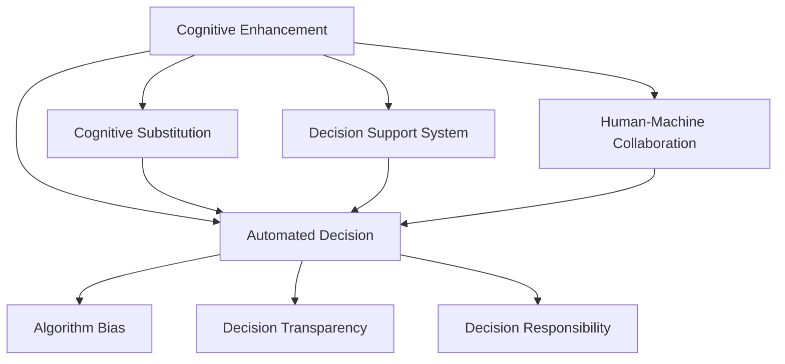

                 

# 认知增强vs认知替代：AI辅助决策的边界

> 关键词：认知增强, AI辅助决策, 人工智能伦理, 决策支持系统, 人机协同, 自动化决策, 算法偏见

## 1. 背景介绍

### 1.1 问题由来
近年来，人工智能(AI)技术在各个领域取得了显著的进展，尤其是在决策支持系统中。决策支持系统(DSS)通过结合人类专家知识和AI算法的力量，帮助决策者处理复杂问题。然而，随着AI技术的不断成熟，关于AI在决策中应扮演何种角色的讨论也越来越热烈。

一方面，许多专家认为AI应当充当决策辅助的角色，增强人类决策者的能力，通过提供高质量的数据分析和预测，帮助决策者做出更加科学、合理的决策。这种观点主张“认知增强”，强调AI应作为人类决策的“放大器”，而不是“替代者”。

另一方面，有人认为AI可以完全替代人类决策者，特别是那些基于数据驱动的任务，如股票交易、医疗诊断等。这种观点主张“认知替代”，认为AI能够处理大量数据，并通过算法自动做出最佳决策。

这种关于AI在决策中作用的辩论引发了对AI伦理、算法偏见、决策透明度的深入讨论。本文将探讨AI在决策支持系统中的应用边界，分析认知增强与认知替代的不同路径，并对未来的发展趋势和面临的挑战进行探讨。

### 1.2 问题核心关键点
AI在决策支持系统中应扮演何种角色，是认知增强还是认知替代，直接关系到决策的公正性、可靠性和透明度。认知增强强调AI辅助决策，保留人的决策权，而认知替代则试图让AI完全接管决策过程。本文将从以下几个方面探讨这一问题的核心关键点：

- AI决策的可靠性和透明度
- 决策过程中的算法偏见和伦理问题
- AI在决策中的作用边界
- 未来AI辅助决策的发展趋势
- 当前面临的技术和伦理挑战

## 2. 核心概念与联系

### 2.1 核心概念概述

为更好地理解AI辅助决策的应用边界，本节将介绍几个密切相关的核心概念：

- 认知增强：通过AI提供高质量的数据分析和预测，增强人类决策者的决策能力。
- 认知替代：AI完全接管决策过程，直接输出决策结果，代替人类决策。
- 决策支持系统(DSS)：结合AI算法和人类专家的知识，提供决策辅助的工具和系统。
- 人机协同：通过优化人机交互方式，实现AI与人类决策者的有效合作。
- 自动化决策：通过算法自动完成决策过程，减少或消除人为因素的干扰。
- 算法偏见：AI算法在训练和应用过程中可能引入的偏见，导致决策结果的不公。
- 决策透明度：AI决策过程的可解释性和可追溯性，确保决策的公正和可信。
- 决策责任：确定AI在决策过程中的责任归属，确保决策结果的合法性和合理性。

这些核心概念之间的逻辑关系可以通过以下Mermaid流程图来展示：



这个流程图展示了几组核心概念之间的联系：

1. 认知增强和认知替代：认知增强强调AI作为辅助决策工具，而认知替代则试图让AI完全接管决策过程。
2. 决策支持系统和人机协同：决策支持系统是认知增强的主要载体，人机协同则是实现这种系统的关键。
3. 自动化决策和算法偏见：自动化决策依赖于AI算法，算法偏见是自动化决策中常见的问题。
4. 决策透明度和决策责任：决策透明度是AI决策可信度的基础，决策责任则涉及决策过程的合法性和合理性。

## 3. 核心算法原理 & 具体操作步骤
### 3.1 算法原理概述

认知增强与认知替代的根本差异在于AI在决策过程中所扮演的角色。认知增强强调AI提供辅助决策，而认知替代则是AI完全取代人类决策。本文将从算法原理和操作步骤两个方面探讨认知增强和认知替代的核心算法。

### 3.2 算法步骤详解

#### 认知增强算法步骤
1. 数据收集与预处理：收集与决策相关的数据，包括历史数据、实时数据等，并进行清洗和处理。
2. 特征工程：提取和构建决策相关的特征，如市场趋势、用户行为、系统性能等。
3. 模型训练：使用机器学习算法（如回归、分类、聚类等）对数据进行训练，构建决策模型。
4. 模型评估与优化：评估模型的预测效果，进行参数调优和模型选择。
5. 模型部署与应用：将训练好的模型部署到决策支持系统中，提供决策辅助。

#### 认知替代算法步骤
1. 数据收集与预处理：与认知增强类似，但数据量更大、更全面。
2. 特征工程：提取和构建高维特征，如时间序列、情感分析等。
3. 模型训练：使用深度学习算法（如神经网络、强化学习等）对数据进行训练，构建决策模型。
4. 模型评估与优化：使用测试数据集评估模型的预测效果，进行超参数调优和模型选择。
5. 模型部署与应用：将训练好的模型部署到自动化决策系统中，直接输出决策结果。

### 3.3 算法优缺点

#### 认知增强的优缺点
**优点**：
1. 保留人类决策的最终权责，确保决策的可解释性和公正性。
2. 通过AI提供辅助分析，提高决策的科学性和效率。
3. 人机协同决策可以更好地融合人类的直觉和AI的逻辑。

**缺点**：
1. 对AI算法的依赖可能引入算法偏见，影响决策的公正性。
2. 需要大量人工干预，决策过程可能不够自动化。
3. 决策支持系统的开发和维护成本较高。

#### 认知替代的优缺点
**优点**：
1. 完全自动化决策，减少人为因素的干扰。
2. 能够处理大规模、高维数据，提高决策效率。
3. 决策过程透明，易于追溯和审计。

**缺点**：
1. 决策结果可能缺乏人类的直觉和经验，影响决策的合理性。
2. 决策过程可能缺乏可解释性，难以理解AI的决策依据。
3. 可能引入算法偏见，导致决策的不公和误差。

### 3.4 算法应用领域

认知增强与认知替代的算法原理在多个领域都有广泛应用。以下是几个典型的应用场景：

#### 金融领域
在金融领域，认知增强可以通过AI提供市场分析和风险评估，辅助决策者做出投资决策。认知替代则可以通过AI算法自动完成股票交易等高频交易任务。

#### 医疗领域
在医疗领域，认知增强可以帮助医生分析患者数据，提供诊断建议和治疗方案。认知替代则可以通过AI算法自动完成一些简单的诊断和治疗决策，如影像识别和药物推荐。

#### 零售领域
在零售领域，认知增强可以通过AI提供销售预测和库存管理，优化库存决策。认知替代则可以通过AI算法自动完成定价和促销策略，提升销售效果。

## 4. 数学模型和公式 & 详细讲解 & 举例说明
### 4.1 数学模型构建

本节将使用数学语言对认知增强与认知替代的算法原理进行更加严格的刻画。

假设有一个决策问题，可以用向量$x \in \mathbb{R}^n$表示决策变量，用向量$y \in \mathbb{R}^m$表示决策目标，其中$m$表示决策结果的维度。假设有一个训练集$D=\{(x_i,y_i)\}_{i=1}^N$，其中$x_i$表示第$i$个样本的决策变量，$y_i$表示相应的决策目标。

定义决策模型$f(x;\theta)$，其中$\theta$为模型参数。决策的目标是找到一个最优的$\theta$，使得$f(x;\theta)$能够最小化与真实决策目标$y$的误差。

### 4.2 公式推导过程

#### 认知增强的公式推导
假设我们使用回归模型$f(x;\theta)=\theta^T\phi(x)$来表示决策模型，其中$\phi(x)$为特征映射函数，$\theta$为回归系数。

回归模型的最小化问题可以表示为：
$$
\min_{\theta} \frac{1}{N} \sum_{i=1}^N (y_i - \theta^T\phi(x_i))^2
$$

引入均方误差损失函数$L(\theta)=\frac{1}{N}\sum_{i=1}^N (y_i - \theta^T\phi(x_i))^2$，通过梯度下降等优化算法求解最小化问题。

#### 认知替代的公式推导
假设我们使用深度神经网络模型$f(x;\theta)=h(\theta^TW(\phi(x);b))$来表示决策模型，其中$h$为激活函数，$W$为权重矩阵，$b$为偏置向量。

神经网络的损失函数通常采用交叉熵损失函数$L(\theta)=\frac{1}{N}\sum_{i=1}^N (y_i - h(\theta^TW(\phi(x_i);b)))^2$，通过反向传播算法求解最小化问题。

### 4.3 案例分析与讲解

#### 案例1：金融市场预测
假设我们需要预测股票市场价格的变化。首先，收集历史交易数据和相关经济指标，进行预处理和特征工程，得到输入变量$x$。然后，构建一个神经网络模型$f(x;\theta)$，使用历史数据$D$进行训练。训练后的模型可以作为决策支持系统的一部分，提供市场趋势预测和风险评估。

#### 案例2：医疗影像诊断
在医疗影像诊断中，我们收集大量患者影像数据和诊断结果，构建特征映射函数$\phi$，使用深度学习模型$f(x;\theta)$进行训练。训练后的模型可以自动诊断新的患者影像，辅助医生进行诊断决策。

## 5. 项目实践：代码实例和详细解释说明
### 5.1 开发环境搭建

在进行认知增强与认知替代的代码实践前，我们需要准备好开发环境。以下是使用Python进行TensorFlow开发的环境配置流程：

1. 安装Anaconda：从官网下载并安装Anaconda，用于创建独立的Python环境。

2. 创建并激活虚拟环境：
```bash
conda create -n tf-env python=3.8 
conda activate tf-env
```

3. 安装TensorFlow：根据CUDA版本，从官网获取对应的安装命令。例如：
```bash
conda install tensorflow -c conda-forge
```

4. 安装TensorBoard：
```bash
pip install tensorboard
```

5. 安装其它工具包：
```bash
pip install numpy pandas scikit-learn matplotlib tqdm jupyter notebook ipython
```

完成上述步骤后，即可在`tf-env`环境中开始认知增强与认知替代的代码实践。

### 5.2 源代码详细实现

这里我们以股票市场预测为例，给出使用TensorFlow进行认知增强的PyTorch代码实现。

首先，定义数据预处理函数：

```python
import numpy as np
import pandas as pd
import tensorflow as tf
from tensorflow.keras.layers import Dense, LSTM
from tensorflow.keras.models import Sequential
from sklearn.model_selection import train_test_split

def prepare_data(dataset, lookback):
    X, Y = [], []
    for i in range(len(dataset)-lookback-1):
        a = dataset[i:(i+lookback), 0]
        b = dataset[i + lookback, 0]
        X.append(a)
        Y.append(b)
    return np.array(X), np.array(Y)
```

然后，定义认知增强模型：

```python
def build_model(lookback):
    model = Sequential()
    model.add(LSTM(50, input_shape=(lookback, 1)))
    model.add(Dense(1))
    model.compile(loss='mse', optimizer='adam')
    return model
```

接着，定义模型训练函数：

```python
def train_model(model, X_train, Y_train, X_test, Y_test):
    model.fit(X_train, Y_train, epochs=50, batch_size=10, verbose=1)
    score = model.evaluate(X_test, Y_test, verbose=0)
    print(f'Test loss: {score:.4f}')
```

最后，启动训练流程并在测试集上评估：

```python
lookback = 10
dataset = pd.read_csv('stock_prices.csv', header=None).values
X_train, X_test, Y_train, Y_test = train_test_split(dataset[:, :lookback], dataset[:, lookback], test_size=0.2)

model = build_model(lookback)
train_model(model, X_train, Y_train, X_test, Y_test)
```

以上就是使用TensorFlow进行股票市场预测的完整代码实现。可以看到，通过简单的LSTM网络，可以有效地实现认知增强的决策支持系统。

### 5.3 代码解读与分析

让我们再详细解读一下关键代码的实现细节：

**prepare_data函数**：
- 定义了数据预处理函数，将原始数据分割为输入变量X和输出变量Y。
- 使用滑动窗口的方式，从原始数据中提取出看板数据（即前10个交易日的数据）作为输入，第11个交易日的数据作为输出。

**build_model函数**：
- 定义了一个简单的LSTM模型，包含一个LSTM层和一个全连接层。
- 使用均方误差损失函数和Adam优化器进行训练。

**train_model函数**：
- 在训练集上训练模型，并使用测试集评估模型性能。
- 通过调用`evaluate`函数计算测试集上的均方误差损失。

**训练流程**：
- 定义看板长度lookback为10，读取股票价格数据。
- 使用`train_test_split`函数将数据集划分为训练集和测试集。
- 创建LSTM模型并调用`build_model`函数进行初始化。
- 调用`train_model`函数进行训练，并在测试集上评估模型性能。

可以看到，TensorFlow提供了一个简单易用的框架，使得认知增强的模型实现变得非常高效。开发者可以根据具体任务，进一步优化模型结构和参数设置，以提升预测精度和计算效率。

## 6. 实际应用场景
### 6.1 智能投顾
智能投顾系统利用认知增强技术，提供个性化的投资建议。通过分析用户的历史交易数据和市场趋势，智能投顾系统可以帮助用户制定投资策略，并进行风险评估。

### 6.2 医疗影像分析
在医疗影像分析中，认知增强可以通过AI提供影像识别和诊断建议，辅助医生进行诊断决策。深度学习模型可以自动分析影像数据，提供潜在的病变区域和诊断结果。

### 6.3 风险评估
风险评估系统通过认知增强技术，分析历史数据和市场趋势，提供风险评估报告。系统可以根据历史交易数据和市场波动，预测未来的风险变化，辅助决策者制定风险管理策略。

## 7. 工具和资源推荐
### 7.1 学习资源推荐

为了帮助开发者系统掌握认知增强与认知替代的理论基础和实践技巧，这里推荐一些优质的学习资源：

1. 《深度学习》课程：由斯坦福大学开设，涵盖深度学习的基础知识和经典模型，适合初学者入门。

2. TensorFlow官方文档：TensorFlow的官方文档，提供了丰富的API文档和示例代码，是学习TensorFlow的重要资料。

3. 《机器学习实战》书籍：介绍了机器学习的基本概念和经典算法，结合实际案例，帮助读者快速上手。

4. Kaggle竞赛平台：Kaggle提供了大量的数据集和竞赛，通过参与竞赛，可以积累实战经验，提升算法设计能力。

5. Coursera深度学习专项课程：由Google、Coursera联合开设，涵盖深度学习的各个方面，适合进阶学习。

通过对这些资源的学习实践，相信你一定能够快速掌握认知增强与认知替代的精髓，并用于解决实际的AI决策问题。
###  7.2 开发工具推荐

高效的开发离不开优秀的工具支持。以下是几款用于认知增强与认知替代开发的常用工具：

1. TensorFlow：由Google主导开发的深度学习框架，生产部署方便，适合大规模工程应用。

2. PyTorch：基于Python的开源深度学习框架，灵活动态的计算图，适合快速迭代研究。

3. Keras：一个高层次的深度学习API，提供了丰富的预训练模型和可视化工具，适合快速原型开发。

4. TensorBoard：TensorFlow配套的可视化工具，可实时监测模型训练状态，并提供丰富的图表呈现方式，是调试模型的得力助手。

5. Weights & Biases：模型训练的实验跟踪工具，可以记录和可视化模型训练过程中的各项指标，方便对比和调优。

6. Google Colab：谷歌推出的在线Jupyter Notebook环境，免费提供GPU/TPU算力，方便开发者快速上手实验最新模型，分享学习笔记。

合理利用这些工具，可以显著提升认知增强与认知替代的开发效率，加快创新迭代的步伐。

### 7.3 相关论文推荐

认知增强与认知替代的研究源于学界的持续研究。以下是几篇奠基性的相关论文，推荐阅读：

1. 《Deep Learning》书籍：Ian Goodfellow、Yoshua Bengio和Aaron Courville共同编写，全面介绍了深度学习的基本概念和算法。

2. 《Cognitive Computational Architecture of Affective Systems》论文：提出了认知计算框架，用于设计具有情感识别和响应能力的智能系统。

3. 《Human-AI Collaboration for Complex Decision Making》论文：研究了人机协同在复杂决策中的应用，提出了一些有效的协作策略。

4. 《Human-AI Collaboration: Future Implications》论文：探讨了人机协作的未来发展方向，提出了一些潜在的研究方向和应用场景。

这些论文代表了大语言模型微调技术的发展脉络。通过学习这些前沿成果，可以帮助研究者把握学科前进方向，激发更多的创新灵感。

## 8. 总结：未来发展趋势与挑战
### 8.1 总结

本文对认知增强与认知替代的AI辅助决策方法进行了全面系统的介绍。首先阐述了认知增强与认知替代的研究背景和意义，明确了AI在决策支持系统中的作用边界。其次，从原理到实践，详细讲解了认知增强与认知替代的数学模型和核心算法，给出了认知增强任务开发的完整代码实例。同时，本文还广泛探讨了认知增强与认知替代在金融、医疗、风险评估等多个行业领域的应用前景，展示了认知增强范式的巨大潜力。最后，本文精选了认知增强与认知替代技术的各类学习资源，力求为读者提供全方位的技术指引。

通过本文的系统梳理，可以看到，认知增强与认知替代技术在AI决策支持系统中具有重要的应用价值。认知增强强调AI作为辅助决策工具，保留人类的决策权，而认知替代则试图让AI完全接管决策过程。未来的AI辅助决策技术将在保持决策公正性和透明性的前提下，逐步拓展其在实际应用中的边界，为人机协同的智能决策系统提供有力的支持。

### 8.2 未来发展趋势

展望未来，认知增强与认知替代技术将呈现以下几个发展趋势：

1. 认知增强的普及：随着AI算法的不断成熟，认知增强技术将在更多领域得到应用，提升决策的科学性和效率。
2. 认知替代的优化：认知替代技术将不断优化，引入更多的先验知识，提升决策的可靠性和公正性。
3. 人机协同的提升：人机协同技术将进一步发展，通过优化交互界面和协作算法，实现更加高效的人机合作。
4. 自动化决策的普及：自动化决策将逐步普及，提升决策过程的效率和一致性。
5. 决策透明度的提升：通过引入可解释性技术和透明算法，提升决策过程的可追溯性和公正性。
6. 决策责任的明确：在决策过程中，明确AI的责任归属，确保决策的合法性和合理性。

以上趋势凸显了认知增强与认知替代技术的广阔前景。这些方向的探索发展，必将进一步提升AI决策支持系统的性能和应用范围，为人类认知智能的进化带来深远影响。

### 8.3 面临的挑战

尽管认知增强与认知替代技术已经取得了瞩目成就，但在迈向更加智能化、普适化应用的过程中，它仍面临着诸多挑战：

1. 算法偏见和伦理问题：AI算法在训练和应用过程中可能引入偏见，导致决策结果的不公。如何消除算法偏见，提升决策的公正性，将是重要的研究课题。
2. 决策透明度的提升：认知替代技术往往缺乏可解释性，难以理解AI的决策依据。如何提高决策透明度，增强决策的可信度，也需要进一步研究。
3. 决策责任的明确：在自动化决策中，如何明确AI的责任归属，确保决策的合法性和合理性，需要明确的法律和道德框架。
4. 多模态数据的整合：AI决策系统需要整合多种数据源，如文本、图像、音频等，提升决策的多样性和全面性。
5. 数据隐私和安全：AI决策系统需要保护用户隐私，确保数据安全，防止数据泄露和滥用。
6. 算力和资源优化：大规模AI决策系统需要高算力支持，如何优化资源配置，提升系统效率，也需要深入研究。

正视认知增强与认知替代面临的这些挑战，积极应对并寻求突破，将使AI决策支持系统更加可靠和可信。相信随着学界和产业界的共同努力，这些挑战终将一一被克服，认知增强与认知替代技术必将在构建安全、可靠、可解释、可控的智能系统中扮演越来越重要的角色。

### 8.4 研究展望

面对认知增强与认知替代所面临的种种挑战，未来的研究需要在以下几个方面寻求新的突破：

1. 引入更多的先验知识：将符号化的先验知识，如知识图谱、逻辑规则等，与神经网络模型进行巧妙融合，引导AI决策过程学习更准确、合理的知识。
2. 融合因果分析和博弈论工具：通过引入因果分析和博弈论思想，增强AI决策的稳定性和合理性，学习更加普适、鲁棒的语言表征。
3. 结合因果分析和博弈论工具：通过引入因果分析和博弈论思想，增强AI决策的稳定性和合理性，学习更加普适、鲁棒的语言表征。
4. 纳入伦理道德约束：在模型训练目标中引入伦理导向的评估指标，过滤和惩罚有偏见、有害的输出倾向，确保决策的公正和安全。
5. 优化决策过程的透明度：通过可解释性和可追溯性的提升，使AI决策过程更加透明和可信，满足不同应用场景的需求。
6. 明确决策过程中的责任归属：通过法律和道德框架的制定，明确AI在决策过程中的责任归属，确保决策的合法性和合理性。

这些研究方向的探索，必将引领认知增强与认知替代技术迈向更高的台阶，为构建安全、可靠、可解释、可控的智能系统铺平道路。面向未来，认知增强与认知替代技术还需要与其他人工智能技术进行更深入的融合，如知识表示、因果推理、强化学习等，多路径协同发力，共同推动人工智能技术的发展。只有勇于创新、敢于突破，才能不断拓展认知增强与认知替代的边界，让智能技术更好地造福人类社会。

## 9. 附录：常见问题与解答
----------------------------------------------------------------
**Q1：认知增强与认知替代的决策效果有何差异？**

A: 认知增强强调AI作为辅助决策工具，保留人类的决策权，决策效果依赖于AI提供的辅助分析。认知替代则是让AI完全接管决策过程，决策效果完全依赖于AI的算法模型。

**Q2：认知增强与认知替代的优缺点有哪些？**

A: 认知增强的优点在于保留了人类的决策权，决策效果可解释性强。缺点在于对AI算法的依赖可能引入算法偏见，决策过程不够自动化。认知替代的优点在于决策过程自动化，决策效率高。缺点在于决策过程缺乏可解释性，可能引入算法偏见。

**Q3：认知增强与认知替代在实际应用中应注意哪些问题？**

A: 在认知增强中，应注意选择合适的AI算法和数据预处理方法，避免算法偏见。在认知替代中，应注意决策过程的透明性和公正性，确保决策的合法性和合理性。

**Q4：未来认知增强与认知替代技术的发展方向是什么？**

A: 未来认知增强与认知替代技术将进一步普及，提升决策的科学性和效率。认知替代技术将不断优化，引入更多的先验知识，提升决策的可靠性和公正性。人机协同技术将进一步发展，提升决策过程的透明性和公正性。

**Q5：认知增强与认知替代在实际应用中面临哪些挑战？**

A: 认知增强与认知替代技术面临算法偏见、决策透明性、决策责任归属、多模态数据整合、数据隐私安全、算力资源优化等挑战。

**Q6：如何优化认知增强与认知替代的决策过程？**

A: 可以通过引入更多的先验知识，融合因果分析和博弈论工具，明确决策过程中的责任归属，优化决策过程的透明度，来提升认知增强与认知替代的决策效果。

本文通过系统梳理认知增强与认知替代的AI辅助决策方法，探讨了其应用边界和未来发展方向，提出了一些具体的实践建议和研究方向，希望能对AI决策支持系统的开发和应用提供一些有益的参考。

