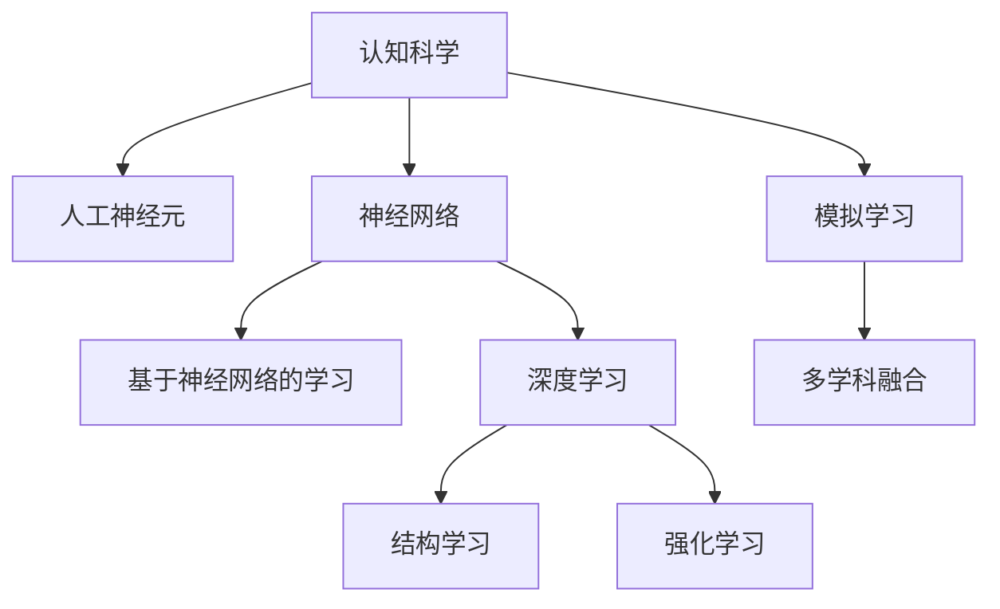

                 

# 认知科学与人工智能：模拟人类学习的尝试

> 关键词：认知科学,人工智能,模拟学习,神经网络,强化学习,深度学习,人工神经元

## 1. 背景介绍

### 1.1 问题由来
近年来，人工智能(AI)技术的迅猛发展引起了广泛的关注和讨论。人类对AI的恐惧与期待交织在一起，希望AI能够解决诸多实际问题，同时也担忧AI可能带来的风险和挑战。认知科学与AI的结合，为理解和学习AI提供了新的视角。

认知科学致力于研究人类和动物思维的机制和规律。它将心理学、神经科学、哲学、语言学等多学科的知识整合，建立了从基础认知过程到高级认知能力的系统模型。AI的快速进步，尤其是深度学习、神经网络的崛起，为模拟和理解人类认知过程提供了新的工具和手段。

认知科学和AI的结合，为模拟人类学习机制、提升AI智能化水平提供了新的研究范式。本文将聚焦于这一前沿领域，探讨模拟人类学习的尝试，分析其核心概念、原理与实践，并展望未来发展趋势。

### 1.2 问题核心关键点
模拟人类学习的过程，旨在构建一个能够模拟人类学习机制、提升AI智能化水平的系统。这一过程需要：
1. 理解人类学习的基本原理和机制。
2. 将这一原理映射到AI系统，实现相应的功能。
3. 在实际应用中验证和优化模拟学习的有效性。

模拟学习的方法包括：
- 基于神经网络的学习。
- 基于强化学习的学习。
- 基于深度学习的学习。
- 基于认知科学的模拟学习。

## 2. 核心概念与联系

### 2.1 核心概念概述

为更好地理解模拟人类学习的尝试，本节将介绍几个密切相关的核心概念：

- 认知科学(Cognitive Science)：研究人类认知过程及其规律的学科，涵盖感知、记忆、思维、语言等多方面内容。
- 人工神经元(Artificial Neuron)：模拟生物神经元的计算单元，通过激活函数、权重、偏置等参数实现输入-输出的映射。
- 神经网络(Neural Network)：由多个人工神经元构成的层次结构，用于处理复杂任务和数据。
- 强化学习(Reinforcement Learning)：一种基于奖励和惩罚的学习方法，通过试错逐步优化决策过程。
- 深度学习(Deep Learning)：一种基于多层神经网络的机器学习方法，能够自动从数据中提取抽象特征。
- 神经网络结构学习(Structural Learning)：在神经网络中添加和删除连接，学习最优的网络结构。

这些核心概念之间的逻辑关系可以通过以下Mermaid流程图来展示：



这个流程图展示了大模型与认知科学的关联，以及从人工神经元到深度学习的演进过程：

1. 认知科学为人工神经元的设计提供了理论基础。
2. 人工神经元是构建神经网络的基础，用于处理复杂数据。
3. 深度学习通过多层神经网络进行特征提取和抽象，提升模型性能。
4. 强化学习通过试错逐步优化模型决策。
5. 结构学习优化神经网络结构，提升模型泛化能力。
6. 模拟学习结合多学科知识，构建智能系统。

## 3. 核心算法原理 & 具体操作步骤
### 3.1 算法原理概述

模拟人类学习的过程，需要构建一个能够模拟人类认知机制的AI系统。其核心思想是：
- 设计类似于人类大脑的神经网络结构。
- 通过神经元之间的连接和激活实现输入-输出映射。
- 利用深度学习自动提取数据中的特征，增强模型表达能力。
- 通过强化学习进行行为优化，逐步提升决策能力。

形式化地，假设我们希望构建一个能够模拟人类学习的AI系统 $S$，其核心组件包括：
- 输入层 $I$：接受外部输入数据。
- 隐藏层 $H$：通过神经元之间的连接和激活，提取特征。
- 输出层 $O$：生成模型输出。

系统 $S$ 通过神经元之间的权重 $w$ 和偏置 $b$ 实现输入-输出映射，即：

$$
f(x) = \sigma(w^T x + b)
$$

其中 $f$ 为激活函数，$w$ 为权重，$x$ 为输入数据。隐藏层 $H$ 通过多个神经元构建，实现复杂特征的提取：

$$
h_i = \sigma(w_i^T x + b_i)
$$

其中 $h_i$ 为第 $i$ 个神经元的激活值。输出层 $O$ 通过多个神经元组成，生成最终的模型输出：

$$
y = \sigma(W_O^T h + b_O)
$$

其中 $y$ 为模型输出，$W_O$ 为输出层权重矩阵，$h$ 为隐藏层输出向量。

### 3.2 算法步骤详解

模拟人类学习的过程，通常包括以下几个关键步骤：

**Step 1: 设计神经网络结构**
- 根据任务需求，设计多层神经网络结构。通常包括输入层、隐藏层和输出层。
- 确定每层神经元数量和激活函数。
- 确定神经元之间的连接方式和权重初始化策略。

**Step 2: 数据准备与预处理**
- 收集并预处理训练数据，转化为系统可以处理的格式。
- 将数据划分为训练集、验证集和测试集。
- 对数据进行归一化、标准化等处理，提升模型性能。

**Step 3: 模型训练与优化**
- 使用随机梯度下降等优化算法，最小化损失函数，更新模型参数。
- 在训练集上逐步调整权重和偏置，优化模型输出。
- 在验证集上评估模型性能，避免过拟合。

**Step 4: 模型评估与部署**
- 在测试集上评估模型性能，分析模型的泛化能力。
- 将模型部署到实际应用中，进行实时推理。
- 持续监控模型性能，进行迭代优化。

### 3.3 算法优缺点

模拟人类学习的方法具有以下优点：
1. 理论基础牢固。认知科学为设计神经网络提供了坚实的理论基础。
2. 模型表达能力强。多层神经网络可以自动提取数据中的复杂特征。
3. 适应性强。深度学习可以处理多种类型的输入数据。
4. 可解释性强。神经网络结构清晰，易于理解和调试。

同时，该方法也存在一些缺点：
1. 计算复杂度高。神经网络需要大量计算资源进行训练。
2. 数据需求大。深度学习需要大量标注数据进行训练。
3. 易过拟合。深度学习容易在训练集上过度拟合，泛化性能不足。
4. 模型复杂度高。神经网络结构复杂，难以理解。

尽管如此，深度学习和神经网络仍然是模拟人类学习的主要工具，广泛应用于图像识别、语音识别、自然语言处理等领域。

### 3.4 算法应用领域

模拟人类学习的方法在多个领域得到了广泛应用，例如：

- 计算机视觉：利用神经网络处理图像，实现目标检测、图像分类等任务。
- 自然语言处理：通过神经网络处理文本，实现机器翻译、情感分析、文本生成等任务。
- 语音识别：通过神经网络处理语音信号，实现语音识别和语音合成。
- 机器人控制：利用神经网络处理传感器数据，实现机器人自主导航和行为决策。
- 推荐系统：通过神经网络处理用户行为数据，实现个性化推荐。

除了上述这些经典应用外，模拟人类学习的方法也在更多场景中得到创新性地应用，如医疗影像分析、金融风险预测、工业故障诊断等，为人工智能技术带来了新的突破。

## 4. 数学模型和公式 & 详细讲解 & 举例说明
### 4.1 数学模型构建

假设我们有一个二分类问题，即输入数据 $x$ 需要通过神经网络 $S$ 判断是否属于类别 $y \in \{0,1\}$。模型的数学模型可以表示为：

$$
y = \sigma(W_O^T h + b_O)
$$

其中 $h_i = \sigma(w_i^T x + b_i)$，$w_i$ 和 $b_i$ 为隐藏层第 $i$ 个神经元的权重和偏置。

模型的损失函数可以采用交叉熵损失：

$$
\mathcal{L}(y, \hat{y}) = -\frac{1}{N}\sum_{i=1}^N (y_i\log \hat{y_i} + (1-y_i)\log(1-\hat{y_i}))
$$

其中 $y$ 为真实标签，$\hat{y}$ 为模型预测输出。

### 4.2 公式推导过程

以二分类问题为例，推导交叉熵损失函数的梯度：

1. 定义模型输出 $\hat{y}$ 和真实标签 $y$ 的交叉熵损失：

$$
\mathcal{L}(y, \hat{y}) = -\frac{1}{N}\sum_{i=1}^N (y_i\log \hat{y_i} + (1-y_i)\log(1-\hat{y_i}))
$$

2. 将 $y_i$ 看作常数，对模型参数求导：

$$
\frac{\partial \mathcal{L}(y, \hat{y})}{\partial w_i} = \frac{1}{N}\sum_{i=1}^N ((y_i-\hat{y_i})x_i)
$$

3. 将 $\hat{y_i}$ 展开，利用链式法则进一步求导：

$$
\frac{\partial \hat{y_i}}{\partial w_i} = \sigma'(w_i^T x_i + b_i) x_i
$$

4. 将 $x_i$ 和 $\sigma'(w_i^T x_i + b_i)$ 代入上式，得：

$$
\frac{\partial \mathcal{L}(y, \hat{y})}{\partial w_i} = \frac{1}{N}\sum_{i=1}^N ((y_i-\hat{y_i})\sigma'(w_i^T x_i + b_i) x_i)
$$

5. 将权重和偏置 $w_i$ 和 $b_i$ 整合，得：

$$
\frac{\partial \mathcal{L}(y, \hat{y})}{\partial w_i} = \frac{1}{N}\sum_{i=1}^N ((y_i-\hat{y_i})\frac{\partial f}{\partial w_i} x_i)
$$

通过上述推导，可以看到，模型的梯度计算可以通过反向传播算法高效完成，为模型训练提供了基础。

### 4.3 案例分析与讲解

假设我们有一个手写数字识别问题，利用神经网络进行分类。具体步骤如下：

1. 设计神经网络结构。输入层为28x28像素的手写数字图片，隐藏层包括64个神经元，输出层包括10个神经元（对应0-9数字）。
2. 准备训练数据。使用MNIST手写数字数据集，将其转化为神经网络可以处理的格式。
3. 模型训练。使用随机梯度下降算法，最小化交叉熵损失，逐步优化模型参数。
4. 模型评估。在测试集上评估模型性能，计算准确率、精确率、召回率等指标。

通过上述步骤，即可实现手写数字识别的模拟学习任务。值得注意的是，神经网络的设计和训练是一个迭代优化的过程，需要不断调整模型结构、学习率等参数，才能获得理想的性能。

## 5. 项目实践：代码实例和详细解释说明
### 5.1 开发环境搭建

在进行模拟学习实践前，我们需要准备好开发环境。以下是使用Python进行TensorFlow开发的的环境配置流程：

1. 安装Anaconda：从官网下载并安装Anaconda，用于创建独立的Python环境。

2. 创建并激活虚拟环境：
```bash
conda create -n tf-env python=3.7 
conda activate tf-env
```

3. 安装TensorFlow：根据CUDA版本，从官网获取对应的安装命令。例如：
```bash
conda install tensorflow==2.7
```

4. 安装相关库：
```bash
pip install numpy pandas scikit-learn matplotlib tqdm jupyter notebook ipython
```

完成上述步骤后，即可在`tf-env`环境中开始模拟学习实践。

### 5.2 源代码详细实现

下面我们以手写数字识别任务为例，给出使用TensorFlow进行神经网络训练的代码实现。

首先，定义神经网络结构和训练函数：

```python
import tensorflow as tf
from tensorflow.keras import layers

def create_model(input_shape, output_shape):
    model = tf.keras.Sequential([
        layers.Dense(64, activation='relu', input_shape=input_shape),
        layers.Dense(10, activation='softmax', output_shape=output_shape)
    ])
    return model

def train_model(model, train_data, train_labels, epochs=5, batch_size=32):
    model.compile(optimizer='adam', loss='categorical_crossentropy', metrics=['accuracy'])
    history = model.fit(train_data, train_labels, epochs=epochs, batch_size=batch_size, validation_split=0.2)
    return history

# 加载MNIST数据集
(x_train, y_train), (x_test, y_test) = tf.keras.datasets.mnist.load_data()

# 数据预处理
x_train = x_train.reshape(-1, 28*28)
x_test = x_test.reshape(-1, 28*28)
x_train = x_train / 255.0
x_test = x_test / 255.0
y_train = tf.keras.utils.to_categorical(y_train)
y_test = tf.keras.utils.to_categorical(y_test)

# 创建神经网络模型
model = create_model(input_shape=(28*28,), output_shape=10)

# 训练模型
history = train_model(model, x_train, y_train, epochs=5, batch_size=32)
```

然后，绘制训练过程中的损失和准确率曲线，评估模型性能：

```python
import matplotlib.pyplot as plt

# 绘制训练曲线
plt.plot(history.history['loss'], label='Train Loss')
plt.plot(history.history['val_loss'], label='Validation Loss')
plt.plot(history.history['accuracy'], label='Train Accuracy')
plt.plot(history.history['val_accuracy'], label='Validation Accuracy')
plt.legend()
plt.show()

# 评估模型性能
test_loss, test_acc = model.evaluate(x_test, y_test)
print('Test Loss:', test_loss)
print('Test Accuracy:', test_acc)
```

以上就是使用TensorFlow进行手写数字识别任务神经网络训练的完整代码实现。可以看到，TensorFlow提供了高效的Keras API，使得神经网络的设计和训练变得简单便捷。

### 5.3 代码解读与分析

让我们再详细解读一下关键代码的实现细节：

**create_model函数**：
- 定义神经网络模型结构，包括输入层、隐藏层和输出层。
- 隐藏层包括64个神经元，激活函数为ReLU。
- 输出层包括10个神经元，激活函数为Softmax。

**train_model函数**：
- 编译模型，选择Adam优化器和交叉熵损失函数。
- 在训练集上使用随机梯度下降算法，最小化损失函数。
- 在验证集上评估模型性能，绘制训练曲线。

**手写数字识别**：
- 加载MNIST数据集，预处理数据。
- 创建神经网络模型，并调用train_model函数进行训练。
- 评估模型性能，打印测试集上的损失和准确率。

可以看到，TensorFlow和Keras提供了简单易用的接口，使得神经网络的设计和训练变得轻巧高效。

当然，工业级的系统实现还需考虑更多因素，如模型的保存和部署、超参数的自动搜索、更灵活的任务适配层等。但核心的模拟学习范式基本与此类似。

## 6. 实际应用场景
### 6.1 计算机视觉

神经网络在计算机视觉领域得到了广泛应用，如目标检测、图像分类、人脸识别等。通过神经网络处理视觉数据，可以自动提取图像中的特征，实现高精度的图像识别和分析。

在目标检测任务中，神经网络可以学习到物体的位置和类别信息，通过在图像中滑动窗口，实时检测出物体位置。在图像分类任务中，神经网络可以从图像中提取特征，自动进行分类。

### 6.2 自然语言处理

神经网络在自然语言处理领域也有重要应用，如机器翻译、情感分析、文本生成等。通过神经网络处理文本数据，可以实现自动的语言理解和生成。

在机器翻译任务中，神经网络可以自动将一种语言翻译成另一种语言。在情感分析任务中，神经网络可以从文本中自动提取情感信息。在文本生成任务中，神经网络可以自动生成符合语法和语义规则的文本。

### 6.3 机器人控制

神经网络可以用于机器人控制，实现机器人的自主导航和行为决策。通过神经网络处理传感器数据，可以实时感知环境变化，做出适应性决策。

在机器人自主导航任务中，神经网络可以学习到环境中的障碍物信息和路径规划。在机器人行为决策任务中，神经网络可以根据感知数据，自动调整机器人的行为。

### 6.4 推荐系统

神经网络可以用于推荐系统，实现个性化推荐。通过神经网络处理用户行为数据，可以自动发现用户的兴趣偏好，实现精准推荐。

在推荐系统中，神经网络可以学习到用户的兴趣和行为特征，自动推荐符合用户喜好的商品和服务。通过不断优化模型，可以实现高效的个性化推荐。

## 7. 工具和资源推荐
### 7.1 学习资源推荐

为了帮助开发者系统掌握模拟学习的理论基础和实践技巧，这里推荐一些优质的学习资源：

1. 《深度学习》（Ian Goodfellow等著）：全面介绍了深度学习的基础理论和方法。
2. 《神经网络与深度学习》（Michael Nielsen著）：深入浅出地介绍了神经网络和深度学习的原理和应用。
3. 《神经网络与机器学习》（Geoffrey Hinton等著）：系统介绍了神经网络的基本原理和应用。
4. 《深度学习入门》（斋藤康毅著）：以实际项目为案例，介绍了深度学习的实践方法和技巧。
5. 《深度学习实战》（Hugh Bredenbenner等著）：提供大量动手实践代码，帮助读者深入理解深度学习的应用。

通过对这些资源的学习实践，相信你一定能够快速掌握模拟学习的精髓，并用于解决实际的AI问题。

### 7.2 开发工具推荐

高效的开发离不开优秀的工具支持。以下是几款用于模拟学习开发的常用工具：

1. TensorFlow：由Google主导开发的开源深度学习框架，生产部署方便，适合大规模工程应用。
2. PyTorch：基于Python的开源深度学习框架，灵活动态的计算图，适合快速迭代研究。
3. Keras：高层API，简单易用，适合快速原型设计和实验验证。
4. JAX：高性能数学库，支持自动微分、JIT编译等高级特性，适合高效计算和优化。
5. OpenCV：计算机视觉库，提供丰富的图像处理和特征提取函数，适合图像识别和分析任务。

合理利用这些工具，可以显著提升模拟学习的开发效率，加快创新迭代的步伐。

### 7.3 相关论文推荐

模拟学习技术的发展源于学界的持续研究。以下是几篇奠基性的相关论文，推荐阅读：

1. LeCun等人的《Gradient-Based Learning Applied to Document Recognition》：提出了卷积神经网络，用于图像识别任务。
2. Hinton等人的《A Neural Probabilistic Language Model》：提出了RNN和LSTM，用于文本生成和语言模型任务。
3. Goodfellow等人的《Generative Adversarial Nets》：提出了生成对抗网络，用于生成数据和图像。
4. Kingma等人的《Adam: A Method for Stochastic Optimization》：提出Adam优化算法，用于加速神经网络的训练。
5. Yann LeCun的《Neural Networks and Deep Learning》：全面介绍了神经网络的基本原理和应用。

这些论文代表了大模型模拟学习的进展脉络。通过学习这些前沿成果，可以帮助研究者把握学科前进方向，激发更多的创新灵感。

## 8. 总结：未来发展趋势与挑战

### 8.1 总结

本文对模拟人类学习的尝试进行了全面系统的介绍。首先阐述了模拟学习的基本原理和应用场景，明确了模拟学习在提升AI智能化水平中的重要价值。其次，从原理到实践，详细讲解了神经网络的设计和训练方法，给出了模拟学习的完整代码实例。同时，本文还广泛探讨了模拟学习在计算机视觉、自然语言处理、机器人控制等多个领域的应用前景，展示了模拟学习范式的广阔应用潜力。此外，本文精选了模拟学习的各类学习资源，力求为读者提供全方位的技术指引。

通过本文的系统梳理，可以看到，模拟学习技术正在成为AI领域的重要范式，极大地拓展了神经网络的应用边界，催生了更多的落地场景。得益于神经网络的强大表达能力和深度学习的自动特征提取能力，模拟学习在实际应用中取得了显著的效果。未来，伴随神经网络架构和训练方法的持续演进，模拟学习必将进一步提升AI系统的智能化水平，推动人工智能技术向更广阔的领域发展。

### 8.2 未来发展趋势

展望未来，模拟学习技术将呈现以下几个发展趋势：

1. 模型规模持续增大。随着算力成本的下降和数据规模的扩张，神经网络的结构将更加复杂，参数量也将持续增长。超大规模神经网络蕴含的丰富知识，有望支撑更加复杂多变的学习任务。

2. 学习范式多样。除了传统的监督学习和无监督学习外，未来将涌现更多多样化的学习范式，如强化学习、自监督学习、元学习等，提升模型的泛化能力和适应性。

3. 多模态学习兴起。当前的神经网络主要聚焦于单一模态数据，未来将进一步拓展到图像、语音、文本等多模态数据的联合学习。多模态信息的融合，将显著提升模型的理解和表达能力。

4. 知识迁移加速。未来的神经网络将具备更强的跨领域迁移能力，能够更灵活地迁移学习到其他领域的知识，加速知识的积累和创新。

5. 自适应学习普及。未来的神经网络将具备更强的自适应学习能力，能够在不同的场景下自动调整学习策略，提升模型的灵活性和实用性。

以上趋势凸显了模拟学习技术的广阔前景。这些方向的探索发展，必将进一步提升AI系统的智能化水平，为智能技术带来新的突破。

### 8.3 面临的挑战

尽管模拟学习技术已经取得了瞩目成就，但在迈向更加智能化、普适化应用的过程中，它仍面临着诸多挑战：

1. 计算资源瓶颈。当前大规模神经网络的训练需要大量的计算资源，GPU/TPU等高性能设备是必不可少的。未来随着模型的复杂度进一步提升，计算资源的瓶颈将更加显著。

2. 数据需求巨大。深度学习需要大量的标注数据进行训练，获取高质量标注数据的成本较高。如何降低数据需求，利用无监督和半监督学习范式，是未来亟需解决的问题。

3. 过拟合问题严重。神经网络容易在训练集上过度拟合，泛化性能不足。如何在保持模型表达能力的同时，避免过拟合，提升模型的泛化能力，是未来需要攻克的难题。

4. 模型复杂度高。神经网络结构复杂，难以理解和调试。如何设计更加清晰、可解释的神经网络架构，是未来需要研究的重点方向。

5. 模型鲁棒性不足。当前神经网络对输入的微小扰动和噪声敏感，泛化性能不佳。如何提高神经网络的鲁棒性，确保其在复杂环境下依然稳定可靠，是未来需要解决的重要问题。

6. 知识整合能力不足。当前的神经网络往往局限于单一领域，难以灵活吸收和运用更广泛的先验知识。如何让神经网络更好地与外部知识库、规则库等专家知识结合，是未来需要深入研究的方向。

正视模拟学习面临的这些挑战，积极应对并寻求突破，将是大模型模拟学习的必由之路。相信随着学界和产业界的共同努力，这些挑战终将一一被克服，模拟学习技术必将在构建人机协同的智能系统中扮演越来越重要的角色。

### 8.4 研究展望

面向未来，模拟学习技术需要在以下几个方面寻求新的突破：

1. 探索更多高效的优化算法。开发新的优化算法，如自适应优化、分布式优化等，加速神经网络的训练过程。

2. 研究更灵活的网络结构。设计更加灵活的网络结构，如模块化网络、自适应网络等，提升模型的适应性和可解释性。

3. 引入更多先验知识。将符号化的先验知识，如知识图谱、逻辑规则等，与神经网络模型进行巧妙融合，引导神经网络学习更准确、合理的知识。

4. 结合因果分析和博弈论工具。将因果分析方法引入神经网络，识别出模型决策的关键特征，增强输出解释的因果性和逻辑性。借助博弈论工具刻画人机交互过程，主动探索并规避模型的脆弱点，提高系统稳定性。

5. 纳入伦理道德约束。在神经网络训练目标中引入伦理导向的评估指标，过滤和惩罚有偏见、有害的输出倾向。同时加强人工干预和审核，建立模型行为的监管机制，确保输出符合人类价值观和伦理道德。

这些研究方向的探索，必将引领模拟学习技术迈向更高的台阶，为构建安全、可靠、可解释、可控的智能系统铺平道路。面向未来，模拟学习技术还需要与其他人工智能技术进行更深入的融合，如知识表示、因果推理、强化学习等，多路径协同发力，共同推动智能技术的进步。只有勇于创新、敢于突破，才能不断拓展模拟学习的边界，让智能技术更好地造福人类社会。

## 9. 附录：常见问题与解答

**Q1：模拟学习与传统机器学习的区别是什么？**

A: 模拟学习是一种模拟人类学习机制的学习方法，通过神经网络处理数据，实现高精度的模式识别和预测。相比传统机器学习，模拟学习具有以下区别：
1. 数据依赖性更强。模拟学习需要大量的标注数据进行训练，而传统机器学习可以在有监督和无监督两种场景下进行学习。
2. 模型复杂度更高。模拟学习使用的神经网络结构复杂，参数量庞大，而传统机器学习模型较为简单。
3. 可解释性更强。模拟学习的神经网络结构清晰，每个神经元的作用直观可解释，而传统机器学习模型较为抽象。
4. 适应性更强。模拟学习可以处理多种类型的输入数据，而传统机器学习通常局限于单一类型的数据。

**Q2：如何选择合适的神经网络结构？**

A: 选择合适的神经网络结构需要考虑以下几个因素：
1. 任务类型：不同的任务类型适合不同的神经网络结构。如图像识别适合卷积神经网络，自然语言处理适合循环神经网络和注意力机制网络。
2. 数据规模：数据规模较大时，可以选择更深、更宽的网络结构，以提高表达能力。数据规模较小时，可以选择更浅、更窄的网络结构，以降低过拟合风险。
3. 计算资源：计算资源较小时，可以选择参数量较小的网络结构。计算资源充足时，可以选择更大规模的网络结构。
4. 模型复杂度：复杂度较高的任务适合更深、更复杂的网络结构。复杂度较低的任务适合简单的网络结构。

**Q3：神经网络的训练过程需要注意哪些细节？**

A: 神经网络的训练过程需要注意以下细节：
1. 初始化权重：选择合适的权重初始化策略，如随机初始化、Xavier初始化、He初始化等，避免权重梯度消失或爆炸。
2. 学习率调整：选择合适的学习率，避免过拟合或欠拟合。通常采用学习率衰减或自适应学习率等策略。
3. 数据增强：通过数据增强技术，如旋转、裁剪、翻转等，扩充训练集，提升模型泛化能力。
4. 正则化：使用L2正则、Dropout等正则化技术，防止模型过拟合。
5. 模型剪枝：通过剪枝技术，去除不重要的神经元或参数，减少模型大小和计算量。
6. 模型融合：将多个模型的预测结果进行融合，提升模型性能。

**Q4：如何在模型训练中避免过拟合？**

A: 避免过拟合是模型训练中的重要问题，主要方法包括：
1. 数据增强：通过数据增强技术，扩充训练集，提升模型泛化能力。
2. 正则化：使用L2正则、Dropout等正则化技术，防止模型过拟合。
3. 早停策略：在验证集上监控模型性能，当性能不再提升时，停止训练。
4. 模型剪枝：通过剪枝技术，去除不重要的神经元或参数，减少模型大小和计算量。
5. 数据集划分：合理划分训练集、验证集和测试集，避免模型在验证集上过拟合。
6. 对抗训练：引入对抗样本，提高模型鲁棒性，防止过拟合。

这些方法往往需要根据具体任务和数据特点进行灵活组合。只有在数据、模型、训练、推理等各环节进行全面优化，才能最大限度地发挥神经网络的优势。

**Q5：如何评估神经网络的性能？**

A: 评估神经网络的性能需要从以下几个方面进行：
1. 准确率：计算模型在测试集上的分类准确率，评估模型的分类性能。
2. 精确率：计算模型在不同类别上的精确率，评估模型在不同类别上的预测性能。
3. 召回率：计算模型在不同类别上的召回率，评估模型在不同类别上的覆盖性能。
4. F1值：综合准确率和召回率，评估模型的综合性能。
5. ROC曲线：绘制不同阈值下的ROC曲线，评估模型在不同阈值下的性能。
6. 混淆矩阵：计算模型的混淆矩阵，评估模型的分类性能。

以上方法可以帮助评估模型的分类、回归、聚类等多种任务性能。在实际应用中，需要根据具体任务和数据特点选择合适的方法。

---

作者：禅与计算机程序设计艺术 / Zen and the Art of Computer Programming

