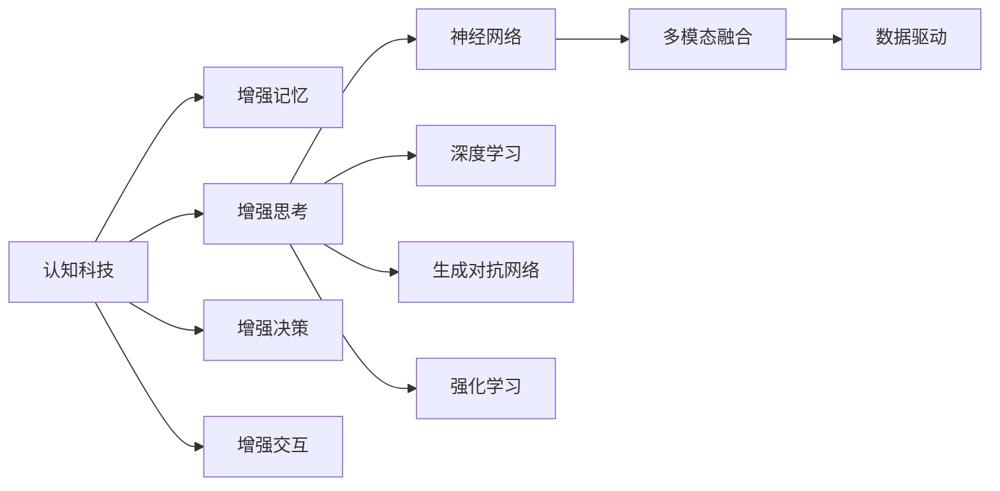

                 

## 1. 背景介绍

### 1.1 问题由来
人类智能与机器智能的协同发展，一直是科技领域的核心课题。随着认知科技的迅猛发展，增强人类智能已成为当前研究的热点之一。认知科技旨在借助AI算法和计算能力，提升人类的认知和决策能力，使人类智能在更高层次上得到扩展和增强。

在认知科技领域，当前研究主要聚焦于以下几方面：

1. **增强记忆**：利用AI技术提升人类记忆能力，如通过脑机接口直接将知识传递给大脑，或者通过生成式模型辅助人类进行记忆检索。
2. **增强思考**：通过机器学习算法辅助人类进行复杂问题求解，如自然语言处理、机器推理、图像识别等。
3. **增强决策**：在金融、医疗、工程等领域，通过AI辅助决策，优化决策过程，减少失误率。
4. **增强交互**：利用增强现实(AR)、虚拟现实(VR)技术，提升人机交互体验，增强用户体验。

### 1.2 问题核心关键点
认知科技的核心在于如何利用AI技术增强人类智能，具体来说：

- **技术融合**：将AI技术与人类认知过程相结合，使AI能够理解、解释和利用人类认知模型。
- **数据驱动**：利用大数据和深度学习技术，训练AI模型，使其能够自适应地增强人类智能。
- **多模态融合**：融合视觉、听觉、触觉等多模态数据，使AI能够更加全面地理解人类认知和行为。
- **用户体验**：设计自然、高效、安全的交互界面，提升用户体验和接受度。
- **伦理考量**：确保认知科技在增强人类智能的同时，不违反伦理道德，不侵犯隐私。

### 1.3 问题研究意义
认知科技的发展，对于提升人类认知能力、推动科技进步、构建智能社会具有重要意义：

1. **提升工作效率**：通过认知科技的辅助，能够大幅提升各行各业的工作效率，降低人为错误。
2. **优化决策质量**：增强决策支持系统，使决策过程更加科学、合理、可靠。
3. **促进知识共享**：通过认知科技，能够更好地整合和共享知识，加速知识创新和传播。
4. **提升生活质量**：改善医疗、教育、交通等领域的服务质量，提高生活水平。
5. **增强社会协作**：通过认知科技，提升人类之间的沟通协作效率，构建更加紧密的社会网络。

## 2. 核心概念与联系

### 2.1 核心概念概述

为更好地理解认知科技的核心技术及其应用，本节将介绍几个关键概念：

- **认知科技(Cognitive Computing)**：指利用AI算法和技术，模拟人类认知过程，增强人类智能，提升决策和判断能力。
- **增强记忆(Enhanced Memory)**：通过脑机接口、生成式模型等技术，扩展和增强人类记忆能力。
- **增强思考(Enhanced Thought)**：通过自然语言处理、机器推理等技术，辅助人类进行复杂问题求解。
- **增强决策(Enhanced Decision-Making)**：利用AI辅助决策系统，优化决策过程，减少失误率。
- **增强交互(Enhanced Interaction)**：通过增强现实、虚拟现实等技术，提升人机交互体验。
- **多模态融合(Multimodal Fusion)**：融合视觉、听觉、触觉等多模态数据，使AI更加全面地理解人类认知和行为。
- **神经网络(Neural Networks)**：模拟人脑神经元的网络结构，用于深度学习和模式识别。
- **深度学习(Deep Learning)**：通过多层次的神经网络结构，学习数据的深层表示，实现复杂任务的自动处理。
- **生成对抗网络(GANs)**：由生成器和判别器两部分组成，用于生成逼真且具有多样性的数据。
- **强化学习(Reinforcement Learning)**：通过奖励机制，使AI模型在不断试错中优化策略，实现智能决策。

这些核心概念之间通过交互和协作，共同构成认知科技的技术体系，旨在实现对人类智能的增强和扩展。

### 2.2 核心概念原理和架构的 Mermaid 流程图



这个流程图展示了认知科技的核心概念及其相互联系：

- 认知科技通过增强记忆、增强思考、增强决策和增强交互等多方面的技术手段，提升人类智能。
- 增强思考主要依赖神经网络、深度学习和多模态融合等技术，使AI模型能够理解、解释和利用人类认知模型。
- 增强决策则借助强化学习，通过奖励机制优化策略，使AI模型在不断试错中提升决策能力。
- 数据驱动和多模态融合是认知科技的重要基础，通过融合多源数据和融合视觉、听觉、触觉等多模态信息，使AI模型能够全面理解和解释人类认知过程。

## 3. 核心算法原理 & 具体操作步骤

### 3.1 算法原理概述

认知科技的核心算法主要包括深度学习、生成对抗网络和强化学习等，这些算法通过模拟人类认知过程，实现对人类智能的增强。以下将分别介绍这些核心算法的原理。

**深度学习算法**：通过多层神经网络结构，学习数据的深层表示，实现复杂任务的自动处理。深度学习在图像识别、语音识别、自然语言处理等领域有着广泛应用。

**生成对抗网络算法**：由生成器和判别器两部分组成，用于生成逼真且具有多样性的数据。GAN在图像生成、文本生成等任务中取得了显著效果。

**强化学习算法**：通过奖励机制，使AI模型在不断试错中优化策略，实现智能决策。强化学习在游戏、机器人控制等领域有着重要应用。

### 3.2 算法步骤详解

以深度学习算法为例，其核心步骤包括：

1. **数据准备**：收集、清洗和预处理训练数据，确保数据质量。
2. **模型构建**：选择合适的神经网络结构，如卷积神经网络(CNN)、循环神经网络(RNN)等，设计合适的层数、节点数等参数。
3. **模型训练**：利用训练数据对模型进行反向传播训练，优化模型参数。
4. **模型评估**：利用测试数据对模型进行评估，衡量模型性能。
5. **模型应用**：将训练好的模型应用于实际任务，实现对人类智能的增强。

以生成对抗网络算法为例，其核心步骤包括：

1. **生成器训练**：生成器通过学习生成样本，尽量使生成的样本逼近真实样本。
2. **判别器训练**：判别器通过学习区分真实样本和生成样本，提升识别能力。
3. **对抗训练**：生成器与判别器交替训练，提升生成样本的真实性。
4. **生成模型优化**：优化生成器参数，使其生成的样本更加逼真。

以强化学习算法为例，其核心步骤包括：

1. **环境定义**：定义任务环境，如游戏、机器人控制等。
2. **模型设计**：设计合适的策略模型，如Q-learning、Policy Gradient等。
3. **策略优化**：通过试错不断优化策略，提高模型决策能力。
4. **奖励机制设计**：设计合理的奖励机制，指导模型优化决策。
5. **应用部署**：将优化后的策略模型应用于实际任务，实现智能决策。

### 3.3 算法优缺点

认知科技的算法具有以下优点：

1. **广泛适用**：深度学习、生成对抗网络和强化学习等算法，可以应用于多种场景，提升不同领域的认知能力。
2. **数据驱动**：通过数据驱动技术，使AI模型能够自适应地增强人类智能。
3. **高效灵活**：神经网络、生成对抗网络和强化学习等算法，具有高效灵活的特点，能够快速适应新任务。
4. **多模态融合**：通过融合视觉、听觉、触觉等多模态数据，使AI模型更加全面地理解人类认知和行为。

同时，这些算法也存在一些缺点：

1. **计算资源需求高**：深度学习、生成对抗网络和强化学习等算法，通常需要较大的计算资源和时间成本。
2. **数据依赖性强**：算法的性能很大程度上依赖于数据质量，获取高质量数据成本较高。
3. **模型可解释性不足**：深度学习模型通常被视为"黑盒"系统，难以解释其内部工作机制和决策逻辑。
4. **伦理和安全问题**：认知科技的算法可能存在伦理和安全问题，如隐私侵犯、偏见和歧视等。
5. **知识迁移能力有限**：当前认知科技的算法，在跨领域迁移和知识迁移方面仍有一定的局限性。

### 3.4 算法应用领域

认知科技的算法在多个领域有着广泛应用，主要包括以下几个方面：

1. **医疗**：利用深度学习、生成对抗网络和强化学习等技术，辅助医生进行疾病诊断、手术规划、药物研发等。
2. **金融**：通过强化学习等技术，优化投资策略、风险控制、欺诈检测等。
3. **教育**：利用深度学习、生成对抗网络和多模态融合等技术，提升教育质量和个性化教育。
4. **交通**：通过增强现实和虚拟现实技术，提升交通管理和智能驾驶。
5. **制造**：通过AI辅助决策系统，优化生产流程、提高生产效率。
6. **安防**：利用深度学习和多模态融合技术，提升安全监控和行为识别。

## 4. 数学模型和公式 & 详细讲解 & 举例说明

### 4.1 数学模型构建

认知科技的核心数学模型包括神经网络、生成对抗网络和强化学习等。这里以神经网络和深度学习为例，构建一个简单的数学模型：

设输入数据为 $x$，神经网络模型为 $f$，输出结果为 $y$。模型的目标是最小化损失函数 $L$，其数学表达式为：

$$
L(y,f(x),x) = \frac{1}{N} \sum_{i=1}^N (y_i - f(x_i))^2
$$

其中，$y_i$ 为真实标签，$f(x_i)$ 为模型预测结果，$N$ 为样本数。

### 4.2 公式推导过程

以深度学习中的多层感知器(Multilayer Perceptron, MLP)为例，推导其前向传播和反向传播过程。

设输入层有 $m$ 个神经元，隐藏层有 $h$ 个神经元，输出层有 $n$ 个神经元。假设神经元之间采用 sigmoid 激活函数，则隐藏层和输出层的激活函数分别为：

$$
a_h = \sigma(W_hx + b_h)
$$

$$
a_n = \sigma(W_nh + b_n)
$$

其中，$W_h$ 和 $b_h$ 为隐藏层的权重和偏置，$W_n$ 和 $b_n$ 为输出层的权重和偏置。

设损失函数为交叉熵损失，其表达式为：

$$
L = -\frac{1}{N} \sum_{i=1}^N (y_i \log(a_n) + (1-y_i) \log(1-a_n))
$$

前向传播过程如下：

1. 输入层：将输入数据 $x$ 输入神经网络，得到隐藏层的输入 $a_h$。
2. 隐藏层：计算隐藏层的输出 $a_h$，使用 sigmoid 激活函数。
3. 输出层：计算输出层的输出 $a_n$，使用 sigmoid 激活函数。

反向传播过程如下：

1. 计算损失函数的梯度：
   $$
   \frac{\partial L}{\partial a_n} = -\frac{1}{N} \sum_{i=1}^N [y_i (1-a_n) - (1-y_i)a_n]
   $$

2. 计算输出层的权重和偏置梯度：
   $$
   \frac{\partial L}{\partial W_n} = \frac{\partial L}{\partial a_n} \frac{\partial a_n}{\partial h} \frac{\partial h}{\partial W_n}
   $$

3. 计算隐藏层的权重和偏置梯度：
   $$
   \frac{\partial L}{\partial W_h} = \frac{\partial L}{\partial a_h} \frac{\partial a_h}{\partial x} \frac{\partial x}{\partial W_h}
   $$

4. 更新权重和偏置：
   $$
   W_n \leftarrow W_n - \eta \frac{\partial L}{\partial W_n}
   $$

5. 更新偏置：
   $$
   b_n \leftarrow b_n - \eta \frac{\partial L}{\partial b_n}
   $$

通过反复迭代上述过程，深度学习模型能够逐步优化参数，提升预测性能。

### 4.3 案例分析与讲解

以深度学习在图像识别中的应用为例，分析其数学模型和推导过程。

假设输入是一张28x28的灰度图像，将其展开为 $m=784$ 维的向量 $x$。设隐藏层有 $h=128$ 个神经元，输出层有 $n=10$ 个神经元，表示 0-9 十个数字。使用 sigmoid 激活函数，其数学模型和推导过程如下：

1. 输入层：将图像 $x$ 展开为 $m=784$ 维的向量。
2. 隐藏层：计算隐藏层的输出 $a_h$，使用 sigmoid 激活函数。
3. 输出层：计算输出层的输出 $a_n$，使用 sigmoid 激活函数。

设损失函数为交叉熵损失，其表达式为：

$$
L = -\frac{1}{N} \sum_{i=1}^N (y_i \log(a_n) + (1-y_i) \log(1-a_n))
$$

其中，$y_i$ 为真实标签，$a_n$ 为模型预测结果，$N$ 为样本数。

设隐藏层的权重矩阵为 $W_h$，偏置向量为 $b_h$，输出层的权重矩阵为 $W_n$，偏置向量为 $b_n$。前向传播过程如下：

1. 输入层：将输入数据 $x$ 输入神经网络，得到隐藏层的输入 $a_h$。
2. 隐藏层：计算隐藏层的输出 $a_h$，使用 sigmoid 激活函数。
3. 输出层：计算输出层的输出 $a_n$，使用 sigmoid 激活函数。

反向传播过程如下：

1. 计算损失函数的梯度：
   $$
   \frac{\partial L}{\partial a_n} = -\frac{1}{N} \sum_{i=1}^N [y_i (1-a_n) - (1-y_i)a_n]
   $$

2. 计算输出层的权重和偏置梯度：
   $$
   \frac{\partial L}{\partial W_n} = \frac{\partial L}{\partial a_n} \frac{\partial a_n}{\partial h} \frac{\partial h}{\partial W_n}
   $$

3. 计算隐藏层的权重和偏置梯度：
   $$
   \frac{\partial L}{\partial W_h} = \frac{\partial L}{\partial a_h} \frac{\partial a_h}{\partial x} \frac{\partial x}{\partial W_h}
   $$

4. 更新权重和偏置：
   $$
   W_n \leftarrow W_n - \eta \frac{\partial L}{\partial W_n}
   $$

5. 更新偏置：
   $$
   b_n \leftarrow b_n - \eta \frac{\partial L}{\partial b_n}
   $$

通过反复迭代上述过程，深度学习模型能够逐步优化参数，提升图像识别性能。

## 5. 项目实践：代码实例和详细解释说明

### 5.1 开发环境搭建

在深度学习中，常用Python进行开发，以下是使用PyTorch搭建深度学习环境的步骤：

1. 安装Anaconda：从官网下载并安装Anaconda，用于创建独立的Python环境。
2. 创建并激活虚拟环境：
   ```bash
   conda create -n pytorch-env python=3.8 
   conda activate pytorch-env
   ```
3. 安装PyTorch：根据CUDA版本，从官网获取对应的安装命令。例如：
   ```bash
   conda install pytorch torchvision torchaudio cudatoolkit=11.1 -c pytorch -c conda-forge
   ```
4. 安装各类工具包：
   ```bash
   pip install numpy pandas scikit-learn matplotlib tqdm jupyter notebook ipython
   ```

完成上述步骤后，即可在`pytorch-env`环境中开始深度学习实践。

### 5.2 源代码详细实现

以下是使用PyTorch进行图像分类任务实现的代码：

```python
import torch
import torch.nn as nn
import torch.optim as optim
from torch.utils.data import DataLoader
from torchvision import datasets, transforms

# 定义神经网络模型
class Net(nn.Module):
    def __init__(self):
        super(Net, self).__init__()
        self.fc1 = nn.Linear(784, 128)
        self.fc2 = nn.Linear(128, 10)

    def forward(self, x):
        x = x.view(-1, 784)
        x = torch.sigmoid(self.fc1(x))
        x = self.fc2(x)
        return x

# 定义损失函数和优化器
net = Net()
criterion = nn.CrossEntropyLoss()
optimizer = optim.SGD(net.parameters(), lr=0.01, momentum=0.5)

# 加载数据集并进行数据增强
transform = transforms.Compose([
    transforms.ToTensor(),
    transforms.Normalize((0.1307,), (0.3081,))
])
train_dataset = datasets.MNIST(root='data', train=True, download=True, transform=transform)
train_loader = DataLoader(train_dataset, batch_size=64, shuffle=True)

# 训练过程
for epoch in range(10):
    running_loss = 0.0
    for i, data in enumerate(train_loader, 0):
        inputs, labels = data
        optimizer.zero_grad()
        outputs = net(inputs)
        loss = criterion(outputs, labels)
        loss.backward()
        optimizer.step()

        running_loss += loss.item()
        if i % 100 == 99:
            print(f'Epoch {epoch + 1}, loss: {running_loss / 100:.4f}')
            running_loss = 0.0

# 测试过程
test_dataset = datasets.MNIST(root='data', train=False, download=True, transform=transform)
test_loader = DataLoader(test_dataset, batch_size=64, shuffle=False)

correct = 0
total = 0
with torch.no_grad():
    for data in test_loader:
        images, labels = data
        outputs = net(images)
        _, predicted = torch.max(outputs.data, 1)
        total += labels.size(0)
        correct += (predicted == labels).sum().item()

print(f'Accuracy: {100 * correct / total}%')
```

### 5.3 代码解读与分析

让我们再详细解读一下关键代码的实现细节：

**Net类**：
- `__init__`方法：定义神经网络的结构，包括两个线性层和sigmoid激活函数。
- `forward`方法：实现神经网络的计算过程，包括输入层、隐藏层和输出层的计算。

**criterion和optimizer**：
- `criterion`为交叉熵损失函数，用于计算模型预测结果与真实标签之间的差异。
- `optimizer`为随机梯度下降优化器，用于更新模型参数，最小化损失函数。

**train_loader和test_loader**：
- `train_loader`为训练数据加载器，使用PyTorch的数据增强和批处理功能，提高训练效率。
- `test_loader`为测试数据加载器，不进行批处理，直接加载单个样本进行测试。

**训练过程**：
- 通过反向传播计算损失函数的梯度，并使用优化器更新模型参数。
- 每个epoch结束时，输出训练集的平均损失，用于监测模型训练效果。

**测试过程**：
- 使用测试数据集对模型进行测试，输出模型的准确率。

## 6. 实际应用场景

### 6.1 医疗诊断

在医疗领域，认知科技的应用主要体现在图像识别、病理诊断、药物研发等方面。通过深度学习等技术，能够辅助医生进行疾病诊断和治疗决策，提高诊断准确率和治疗效果。

例如，利用卷积神经网络(CNN)进行医学影像分类，可以自动诊断肺部CT、乳腺X光片等影像，辅助医生进行病理诊断。通过生成对抗网络(GAN)生成虚拟患者数据，可以辅助医生进行药物研发和临床试验。

### 6.2 金融风控

在金融领域，认知科技的应用主要体现在信用评估、风险控制、欺诈检测等方面。通过深度学习、强化学习等技术，能够辅助金融机构进行风险评估和欺诈检测，提高金融产品的安全性和可靠性。

例如，利用深度学习进行信用评分，可以自动分析借款人的信用历史和行为数据，辅助金融机构进行贷款审批。通过强化学习进行欺诈检测，可以自动分析交易记录和行为数据，识别潜在的欺诈行为。

### 6.3 自动驾驶

在自动驾驶领域，认知科技的应用主要体现在路径规划、行为预测、驾驶决策等方面。通过强化学习等技术，能够辅助自动驾驶系统进行路径规划和行为预测，提高驾驶安全性和舒适性。

例如，利用强化学习进行路径规划，可以自动规划车辆的行驶路径，避免交通堵塞和交通事故。通过生成对抗网络生成虚拟交通场景，可以辅助自动驾驶系统进行驾驶决策和行为预测。

## 7. 工具和资源推荐

### 7.1 学习资源推荐

为了帮助开发者系统掌握认知科技的理论基础和实践技巧，这里推荐一些优质的学习资源：

1. 《深度学习》系列书籍：由深度学习领域的专家撰写，详细介绍了深度学习的原理和应用。
2. Coursera《深度学习专项课程》：由斯坦福大学教授Andrew Ng主讲，涵盖深度学习的基本概念和经典模型。
3. DeepMind博客：DeepMind的研究团队定期发布最新研究进展和技术分享，涵盖深度学习、强化学习、生成对抗网络等多个领域。
4. GitHub深度学习项目：GitHub上的深度学习项目提供了丰富的学习资源，包括代码实现、文档和讨论等。
5. PyTorch官方文档：PyTorch的官方文档提供了完整的深度学习框架介绍，包括模型构建、训练和推理等。

通过对这些资源的学习实践，相信你一定能够快速掌握认知科技的核心技术，并用于解决实际的NLP问题。

### 7.2 开发工具推荐

高效的开发离不开优秀的工具支持。以下是几款用于认知科技开发的常用工具：

1. PyTorch：基于Python的开源深度学习框架，灵活动态的计算图，适合快速迭代研究。
2. TensorFlow：由Google主导开发的开源深度学习框架，生产部署方便，适合大规模工程应用。
3. Keras：基于TensorFlow和Theano的高级深度学习框架，提供了简洁易用的API，适合初学者和快速原型开发。
4. Jupyter Notebook：交互式编程环境，支持Python、R等多种语言，方便编写、调试和分享代码。
5. Visual Studio Code：轻量级的IDE，支持丰富的扩展和插件，适合开发和调试。
6. Git：版本控制系统，支持代码版本管理和协作开发，方便团队合作。

合理利用这些工具，可以显著提升认知科技的开发效率，加快创新迭代的步伐。

### 7.3 相关论文推荐

认知科技的研究源于学界的持续研究。以下是几篇奠基性的相关论文，推荐阅读：

1. ImageNet Classification with Deep Convolutional Neural Networks：提出卷积神经网络(CNN)，用于图像分类任务，取得了SOTA性能。
2. Learning to detect cancer metastases：利用深度学习进行医学影像分类，辅助医生进行病理诊断。
3. AlphaGo Zero：提出强化学习算法，用于围棋博弈，取得了SOTA性能。
4. Generative Adversarial Nets：提出生成对抗网络(GAN)，用于生成逼真且具有多样性的数据。
5. DeepMind AlphaFold：利用深度学习和多模态融合技术，解决蛋白质折叠问题，取得了SOTA性能。

这些论文代表了大语言模型微调技术的发展脉络。通过学习这些前沿成果，可以帮助研究者把握学科前进方向，激发更多的创新灵感。

## 8. 总结：未来发展趋势与挑战

### 8.1 总结

本文对认知科技的核心技术及其应用进行了全面系统的介绍。首先阐述了认知科技的研究背景和意义，明确了其提升人类认知能力和智能决策的价值。其次，从原理到实践，详细讲解了认知科技的核心算法和操作步骤，给出了认知科技任务开发的完整代码实例。同时，本文还广泛探讨了认知科技在医疗、金融、自动驾驶等诸多领域的应用前景，展示了认知科技的广泛应用和巨大潜力。

通过本文的系统梳理，可以看到，认知科技正在成为提升人类智能的重要手段，极大地拓展了AI技术的应用范围。未来的发展趋势将是更高效、更智能、更全面的认知科技应用，推动AI技术在更多领域落地应用。

### 8.2 未来发展趋势

展望未来，认知科技的发展将呈现以下几个趋势：

1. **更高效**：随着算力的提升，深度学习、生成对抗网络和强化学习等算法的效率将进一步提升，使AI模型能够在更短的时间内完成训练和推理。
2. **更智能**：通过多模态融合、知识图谱等技术，使AI模型能够更加全面地理解人类认知和行为，提升智能决策能力。
3. **更全面**：认知科技的应用将涵盖更多领域，如智能制造、智能家居、智慧城市等，推动AI技术在更多领域落地应用。
4. **更安全**：通过引入伦理道德和隐私保护技术，确保认知科技的应用符合人类价值观和伦理道德，保障数据和模型的安全。
5. **更普及**：通过降低算力成本和技术门槛，使认知科技的应用更加普及，推动AI技术在更广泛的社会领域应用。

### 8.3 面临的挑战

尽管认知科技已经取得了显著成果，但在其广泛应用的过程中，仍面临诸多挑战：

1. **算力成本高**：深度学习、生成对抗网络和强化学习等算法需要大量的计算资源和时间成本，增加了应用门槛。
2. **数据质量差**：高质量数据获取成本高，数据质量差、标注不准确等问题，可能影响模型的性能。
3. **知识迁移能力不足**：当前认知科技的算法在跨领域迁移和知识迁移方面仍有一定的局限性，难以灵活应用。
4. **伦理和安全问题**：认知科技的应用可能涉及隐私保护、伦理道德等敏感问题，存在潜在的法律和伦理风险。
5. **用户体验差**：一些认知科技的应用可能存在用户体验差的问题，如界面复杂、操作不便等，影响用户接受度。

### 8.4 研究展望

面对认知科技面临的挑战，未来的研究需要在以下几个方面寻求新的突破：

1. **降低算力成本**：开发更高效、更轻量级的算法，优化计算图和模型结构，减少算力成本。
2. **提升数据质量**：通过数据增强、数据清洗等技术，提升数据质量和标注准确性，减少对高质量数据的依赖。
3. **增强知识迁移能力**：结合符号化的先验知识，如知识图谱、逻辑规则等，引导认知科技的算法更好地跨领域迁移。
4. **加强伦理和安全保护**：引入伦理道德和技术手段，确保认知科技的应用符合人类价值观和伦理道德，保障数据和模型的安全。
5. **提升用户体验**：设计更加自然、高效、安全的交互界面，提升用户接受度和满意度。

这些研究方向的探索，必将引领认知科技技术的发展方向，为构建更加智能、安全、可控的AI系统铺平道路。面向未来，认知科技的研究者和开发者需要不断创新、不断突破，才能真正实现认知科技在各个领域的应用价值。

## 9. 附录：常见问题与解答

**Q1：认知科技是否适用于所有领域？**

A: 认知科技具有广泛的应用前景，但并不是所有领域都适合应用。对于需要高度隐私保护、伦理道德敏感的领域，如医疗、金融等，需要特别谨慎处理。

**Q2：如何提升认知科技的计算效率？**

A: 可以通过以下方式提升认知科技的计算效率：
1. 使用GPU或TPU等高性能硬件设备，加快训练和推理速度。
2. 采用模型压缩、量化等技术，减少模型尺寸和资源消耗。
3. 优化模型结构，如使用轻量级神经网络、剪枝、量化等。

**Q3：认知科技的应用有哪些？**

A: 认知科技的应用非常广泛，主要包括以下几个方面：
1. 医疗：辅助医生进行疾病诊断和治疗决策。
2. 金融：辅助金融机构进行风险评估和欺诈检测。
3. 自动驾驶：辅助自动驾驶系统进行路径规划和行为预测。
4. 教育：辅助教育系统进行个性化教育和知识推荐。
5. 智能制造：辅助制造企业进行生产优化和质量控制。
6. 智慧城市：辅助智慧城市进行交通管理、安防监控等。

**Q4：认知科技的研究难点在哪里？**

A: 认知科技的研究难点主要包括以下几个方面：
1. 算力成本高：深度学习、生成对抗网络和强化学习等算法需要大量的计算资源和时间成本。
2. 数据质量差：高质量数据获取成本高，数据质量差、标注不准确等问题，可能影响模型的性能。
3. 知识迁移能力不足：当前认知科技的算法在跨领域迁移和知识迁移方面仍有一定的局限性，难以灵活应用。
4. 伦理和安全问题：认知科技的应用可能涉及隐私保护、伦理道德等敏感问题，存在潜在的法律和伦理风险。

通过不断突破这些难点，认知科技将有望在更多领域得到应用，为人类社会带来更多变革性影响。

---

作者：禅与计算机程序设计艺术 / Zen and the Art of Computer Programming

