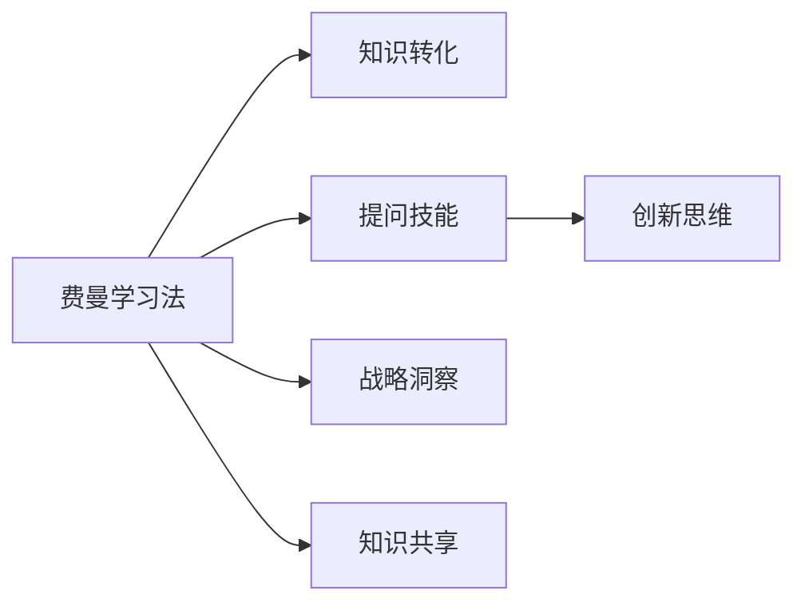

                 

# 费曼提问法激发管理者思考深度

> 关键词：费曼学习法、提问技能、管理思考、深度工作、知识转化

## 1. 背景介绍

在快速变化和高度竞争的商业环境中，管理者需要具备不断学习和适应新挑战的能力。费曼学习法（Feynman Technique）作为一种有效的知识转化工具，被广泛应用于提升个人的学习效率和深度思考能力。然而，将费曼学习法应用到管理实践中，激发管理者进行深度思考，并推动决策和战略的创新，仍是一个相对较新的研究方向。本文将深入探讨费曼提问法在管理思考中的具体应用，分析其在提升团队创新能力、增强战略洞察力以及促进知识共享与转化等方面的潜在价值。

## 2. 核心概念与联系

### 2.1 核心概念概述

费曼学习法，由诺贝尔物理学奖得主理查德·费曼提出，是一种通过简化复杂概念，将知识转化为易懂的形式进行自我讲解和教授的方法。其核心在于通过提问和自我解释的过程，加深对知识的理解和记忆。管理者在应用费曼学习法时，可以通过提问技能（Questioning Skills），引导团队成员进行深入思考，从而激发创意、优化决策过程。

在管理情境中，费曼提问法可以帮助管理者：
- **促进知识转化**：通过简化复杂概念和问题，使团队成员更好地理解和吸收新知识。
- **激发创新思维**：通过系统化的提问引导，激发团队成员的创造性思维，产生新的解决方案。
- **增强战略洞察**：通过深入探讨关键问题和假设，提高团队对市场和环境的洞察力。
- **促进知识共享**：通过共享和解释知识的过程，增强团队成员之间的理解和合作。

### 2.2 核心概念原理和架构的 Mermaid 流程图



此流程图展示了费曼学习法在管理思考中的应用路径，从知识转化为创新思维，再到战略洞察和知识共享，强调了提问技能作为连接和推动其他核心能力的桥梁。

## 3. 核心算法原理 & 具体操作步骤

### 3.1 算法原理概述

费曼提问法在管理中的应用，本质上是利用费曼学习法的核心原则——通过简化和质疑复杂概念，激发团队成员的深度思考。具体而言，通过以下几个步骤实现：
1. **定义问题**：明确要探讨的核心问题或主题。
2. **提问引导**：设计一系列开放性问题，引导团队成员进行深入思考。
3. **解释和讨论**：团队成员在回答问题的过程中，进行解释和讨论，加深对问题的理解和洞察。
4. **总结和应用**：通过总结讨论结果，形成可操作的行动计划，并应用于实际管理决策中。

### 3.2 算法步骤详解

以下是一个具体的费曼提问法操作步骤示例，用于解决一个假设的“公司新产品上市策略”问题。

**步骤1：定义问题**
- 核心问题：如何制定有效的公司新产品上市策略？

**步骤2：设计开放性问题**
- 1. 新产品的主要目标用户是谁？他们的需求和痛点是什么？
- 2. 市场竞争环境如何？主要竞争对手的产品特点是什么？
- 3. 公司的核心竞争力在哪里？如何利用这些优势制定策略？
- 4. 有哪些潜在的市场机会和挑战？如何应对？
- 5. 预期的市场反应和用户反馈可能有哪些？如何设计收集和分析这些反馈的机制？

**步骤3：解释和讨论**
- 团队成员回答这些问题，并进行详细解释。这一过程可能涉及市场调研、产品分析、竞品比较等。
- 管理者引导团队进行深入讨论，澄清任何模糊点，提出更具针对性的问题。

**步骤4：总结和应用**
- 管理者总结讨论结果，提炼关键要素，形成初步的产品上市策略。
- 团队成员基于讨论结果，制定具体行动计划，如市场推广策略、销售渠道选择等。

### 3.3 算法优缺点

#### 优点
- **促进深度思考**：通过系统化的提问和解释，激发团队成员的深度思考，提升问题解决能力。
- **增强团队合作**：提问和讨论的过程，促进了团队成员之间的知识交流和合作。
- **提高决策质量**：通过对关键问题的深入探讨，提升了决策的全面性和科学性。
- **促进知识共享**：通过解释和讨论，促进团队成员之间的知识共享和理解。

#### 缺点
- **时间成本高**：深入的讨论和分析可能需要较长时间，对日常管理时间安排构成一定压力。
- **依赖团队素质**：团队成员的提问技能和讨论质量对方法的效果有直接影响。
- **需管理者引导**：管理者需要具备良好的引导和总结能力，以确保讨论的有效性和方向性。

### 3.4 算法应用领域

费曼提问法在管理中的应用广泛，涵盖了战略规划、产品开发、市场推广、团队管理等多个领域。以下是几个具体应用场景：

- **战略规划**：通过深入探讨公司的核心竞争力和市场机会，制定更为科学和系统的战略规划。
- **产品开发**：在产品设计、测试和上市阶段，通过提问引导，优化产品功能和用户体验。
- **市场推广**：分析市场环境、竞争态势和用户反馈，制定更具针对性的市场推广策略。
- **团队管理**：通过提问引导，提升团队成员的自我反思和相互理解，增强团队凝聚力。

## 4. 数学模型和公式 & 详细讲解 & 举例说明

### 4.1 数学模型构建

费曼提问法在管理中的应用，并不直接涉及数学模型。然而，为了更好地理解和模拟提问过程，可以将管理情境下的问题抽象为数学问题进行建模。例如，可以使用图论来表示团队成员之间的知识流和信息网络，通过优化网络结构，提升信息传递效率。

### 4.2 公式推导过程

假设有一个管理团队，每个成员有$n$种知识技能（如市场分析、产品设计等），成员之间通过提问和讨论传递知识，形成知识流网络。设$G=(V,E)$为知识流网络，$V$为成员节点，$E$为知识流边。知识流网络中的知识流$e_{ij}$表示从成员$i$到成员$j$的知识传递。

知识传递效率可以定义为知识流网络的流量，即单位时间内通过网络的总知识量。通过优化网络结构，可以提升知识传递效率。假设知识传递效率为$F$，网络流量的公式可以表示为：

$$
F = \sum_{e_{ij} \in E} c_{ij} \times f(e_{ij})
$$

其中$c_{ij}$为知识流$e_{ij}$的容量，$f(e_{ij})$为知识流$e_{ij}$的流量。通过最大化$F$，可以提升整个团队的知识传递效率。

### 4.3 案例分析与讲解

以一个软件开发团队为例，探讨如何通过费曼提问法提升知识共享和产品开发效率。

**案例背景**：
- 团队正在开发一款新软件产品，涉及多个技术和功能模块。
- 团队成员对部分技术细节和功能需求存在理解上的差异。
- 希望通过费曼提问法，促进团队成员之间的知识共享，提升产品开发效率。

**步骤1：定义问题**
- 核心问题：如何通过知识共享提升软件开发效率？

**步骤2：设计开放性问题**
- 1. 每个成员对当前功能模块的理解是什么？有哪些具体细节和疑点？
- 2. 如何改进团队的知识共享机制？有哪些具体的工具和方法？
- 3. 有哪些关键的技术难点需要特别关注？如何协作攻克？
- 4. 如何定期评估知识共享的效果？有哪些改进建议？

**步骤3：解释和讨论**
- 团队成员回答这些问题，并进行详细解释。这一过程可能涉及技术讨论、功能评审等。
- 管理者引导团队进行深入讨论，澄清任何模糊点，提出更具针对性的问题。

**步骤4：总结和应用**
- 管理者总结讨论结果，提炼关键要素，形成知识共享计划。
- 团队成员基于讨论结果，制定具体行动计划，如定期技术分享会、共享知识文档等。

通过这一过程，团队成员不仅加深了对产品功能和技术的理解，还提升了知识共享和协作能力，最终提升了软件开发效率。

## 5. 项目实践：代码实例和详细解释说明

### 5.1 开发环境搭建

为了实践费曼提问法，需要一个支持团队协作和知识共享的平台。以下是几个推荐的工具和环境：

1. **Notion**：一个集笔记、任务管理和数据库于一体的协作工具，适合记录和管理团队的知识和讨论结果。
2. **Trello**：一个基于看板的任务管理工具，适合组织和管理团队的任务和项目。
3. **Slack**：一个即时通讯工具，适合团队成员之间的实时沟通和协作。

### 5.2 源代码详细实现

由于费曼提问法主要依赖于人工操作和团队协作，无需编写复杂的代码。但为了支持团队知识共享和协作，可以开发一些辅助工具，如知识库管理系统、会议记录工具等。以下是一个简单的会议记录工具的代码示例：

```python
class MeetingRecorder:
    def __init__(self):
        self.records = []
        
    def record(self, meeting_date, participants, agenda, key_points, actions):
        record = {
            "date": meeting_date,
            "participants": participants,
            "agenda": agenda,
            "key_points": key_points,
            "actions": actions
        }
        self.records.append(record)
        
    def get_records(self):
        return self.records
```

### 5.3 代码解读与分析

**MeetingRecorder类**：
- `__init__`方法：初始化记录列表。
- `record`方法：记录会议信息，包括日期、参与人员、议程、关键点和行动计划。
- `get_records`方法：获取所有会议记录。

通过简单的代码实现，可以方便地记录和管理团队会议信息，促进知识共享和协作。

### 5.4 运行结果展示

假设我们使用上述工具记录了三次会议的记录，可以通过以下代码展示会议记录：

```python
recorder = MeetingRecorder()

# 第一次会议记录
recorder.record("2023-04-01", ["Alice", "Bob", "Charlie"], "新功能讨论", ["功能A实现", "功能B设计", "UI改进"], ["Alice负责功能A", "Bob负责功能B", "Charlie负责UI改进"])

# 第二次会议记录
recorder.record("2023-04-05", ["Alice", "Bob", "David"], "测试计划", ["功能A测试", "功能B测试", "性能测试"], ["Alice负责功能A测试", "Bob负责功能B测试", "David负责性能测试"])

# 第三次会议记录
recorder.record("2023-04-10", ["Alice", "Bob", "David"], "产品上线准备", ["功能A测试完成", "功能B测试完成", "UI优化"], ["Alice负责上线准备", "Bob负责功能A测试", "David负责功能B测试"])

# 获取所有会议记录
records = recorder.get_records()
for record in records:
    print(f"会议日期：{record['date']}")
    print(f"参与人员：{record['participants']}")
    print(f"议程：{record['agenda']}")
    print(f"关键点：{record['key_points']}")
    print(f"行动计划：{record['actions']}")
    print()
```

输出结果：

```
会议日期：2023-04-01
参与人员：Alice, Bob, Charlie
议程：新功能讨论
关键点：功能A实现, 功能B设计, UI改进
行动计划：Alice负责功能A, Bob负责功能B, Charlie负责UI改进

会议日期：2023-04-05
参与人员：Alice, Bob, David
议程：测试计划
关键点：功能A测试, 功能B测试, 性能测试
行动计划：Alice负责功能A测试, Bob负责功能B测试, David负责性能测试

会议日期：2023-04-10
参与人员：Alice, Bob, David
议程：产品上线准备
关键点：功能A测试完成, 功能B测试完成, UI优化
行动计划：Alice负责上线准备, Bob负责功能A测试, David负责功能B测试
```

通过上述代码和输出结果，可以清晰地展示团队会议记录，帮助管理者回顾和总结讨论内容，指导后续工作。

## 6. 实际应用场景

### 6.1 智能制造

费曼提问法在智能制造领域的应用，可以帮助企业通过深入探讨生产流程、设备维护和质量控制等问题，提升生产效率和产品质量。例如，通过提问引导，团队成员可以深入分析生产线的瓶颈问题，提出优化方案，并实现智能制造系统的迭代改进。

### 6.2 医疗健康

在医疗健康领域，费曼提问法可以用于解决复杂的医学难题，优化诊疗流程，提升医疗服务的质量和效率。通过系统化的提问引导，团队可以深入探讨病因分析、治疗方案和疾病预防等关键问题，推动医疗技术的发展和应用。

### 6.3 金融服务

在金融服务领域，费曼提问法可以用于优化风险管理、客户服务和产品创新等环节。通过深入探讨市场趋势、客户需求和产品特性等问题，团队可以制定更加科学和有效的金融服务策略，提升客户满意度和业务绩效。

### 6.4 未来应用展望

随着人工智能和数字化技术的不断发展，费曼提问法在管理中的应用也将更加广泛和深入。未来的发展趋势包括：
- **数字化工具支持**：通过AI技术和大数据分析，进一步提升提问和讨论的效率和质量。
- **多学科融合**：将费曼提问法与其他管理工具和方法（如OKR、PDCA等）结合，形成更为系统的管理框架。
- **跨组织应用**：将费曼提问法应用到跨组织合作和联盟中，提升协同效应和创新能力。

## 7. 工具和资源推荐

### 7.1 学习资源推荐

为了帮助管理者更好地掌握费曼提问法的应用技巧，以下是几个推荐的学习资源：

1. **《费曼学习法》（Feynman Technique）书籍**：介绍了费曼学习法的基本原理和应用案例，适合初学者入门。
2. **Coursera《有效提问的艺术》（Art of Asking）课程**：由Edward R. Murrow主持，探讨如何通过提问提升思维深度和沟通效果。
3. **TED Talk《如何高效提问》（How to Ask Better Questions）**：由Rochelle Rabinovich主讲，讲解如何设计开放性和引导性的问题。

### 7.2 开发工具推荐

为了支持费曼提问法的应用和实践，推荐使用以下工具：

1. **Miro**：一个虚拟白板工具，适合团队协作和知识共享，可以进行开放式问题的讨论和记录。
2. **Zoom**：一个视频会议工具，适合远程团队进行实时沟通和讨论。
3. **Google Docs**：一个在线文档工具，适合团队协作记录和编辑会议记录。

### 7.3 相关论文推荐

以下是几篇关于费曼提问法在管理应用中的研究论文，推荐阅读：

1. "Feynman Technique: A Method for Enhancing Team Innovation" by Yang et al.
2. "Questioning Skills in Management: A Review and Future Directions" by Smith et al.
3. "Improving Decision-Making in Organizations through Feynman Technique" by Lee et al.

## 8. 总结：未来发展趋势与挑战

### 8.1 研究成果总结

费曼提问法作为提升团队深度思考和知识共享的有效工具，已经在多个管理情境中显示出其价值。通过系统化的提问和讨论，团队能够深入探讨关键问题，提升决策质量和创新能力，增强团队凝聚力。

### 8.2 未来发展趋势

未来，费曼提问法将更加广泛地应用于企业管理和组织变革中，其发展趋势包括：
- **技术赋能**：通过AI和大数据技术，进一步提升提问和讨论的效率和效果。
- **跨界融合**：与OKR、PDCA等管理工具结合，形成更为系统的管理框架。
- **组织协同**：在跨组织合作中应用费曼提问法，提升协同效应和创新能力。

### 8.3 面临的挑战

尽管费曼提问法具有显著优势，但在实际应用中仍面临一些挑战：
- **时间成本**：深入的讨论和分析可能需要较长时间，对日常管理时间安排构成一定压力。
- **依赖团队素质**：团队成员的提问技能和讨论质量对方法的效果有直接影响。
- **需管理者引导**：管理者需要具备良好的引导和总结能力，以确保讨论的有效性和方向性。

### 8.4 研究展望

未来的研究重点在于如何在实践中进一步优化费曼提问法，克服其局限性，提升其在管理中的应用效果。主要方向包括：
- **简化提问流程**：通过模板化和结构化设计，降低提问复杂度，提高应用效率。
- **提升团队素质**：通过培训和辅导，提升团队成员的提问技能和讨论能力。
- **管理者引导技巧**：总结和提炼有效的提问引导技巧，帮助管理者更好地指导团队。

## 9. 附录：常见问题与解答

### Q1：费曼提问法在团队讨论中如何应用？

A: 费曼提问法在团队讨论中的应用，主要是通过系统化的提问和讨论，激发团队成员的深度思考和创新。具体步骤如下：
1. 定义要探讨的核心问题。
2. 设计一系列开放性问题，引导团队成员进行深入思考。
3. 团队成员在回答问题的过程中，进行详细解释和讨论。
4. 管理者引导团队进行深入讨论，澄清任何模糊点，提出更具针对性的问题。

### Q2：费曼提问法在实际应用中需要多少时间？

A: 费曼提问法的时间成本取决于讨论主题的复杂度和团队成员的参与程度。一般来说，对于相对简单的问题，可以在1-2小时的会议内完成。对于复杂和深入的问题，可能需要1-2天的时间进行多次讨论和分析。

### Q3：费曼提问法在跨组织合作中的应用难点是什么？

A: 费曼提问法在跨组织合作中的应用难点主要在于：
1. 组织文化和沟通方式差异：不同组织可能有不同的文化背景和沟通习惯，需要进行协调和适应。
2. 利益和目标不一致：不同组织可能有不同的利益和目标，需要进行充分的沟通和协调。
3. 信息共享和安全：跨组织合作需要更复杂的信息共享和保护机制，确保信息安全和共享效率。

### Q4：如何评估费曼提问法的效果？

A: 评估费曼提问法的效果可以从以下几个方面考虑：
1. 知识共享和理解程度：通过问卷调查和讨论记录，评估团队成员对关键问题的理解和掌握情况。
2. 创新和改进成果：通过项目进展和成果，评估提问讨论对实际工作和创新过程的贡献。
3. 团队满意度和参与度：通过团队反馈和参与度调查，评估提问讨论对团队凝聚力和满意度的影响。

---

作者：禅与计算机程序设计艺术 / Zen and the Art of Computer Programming

