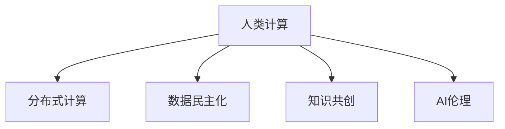

                 

# 赋能个人与社区：人类计算的社会价值

> 关键词：人类计算,社会价值,人工智能,个人赋能,社区共建

## 1. 背景介绍

### 1.1 问题由来
随着科技的飞速发展，人工智能(AI)正在深刻改变我们生活的方方面面。从智能家居到自动驾驶，从医疗诊断到金融风控，AI技术的应用已经渗透到人类社会的各个角落。然而，这种技术变革也带来了一系列复杂的社会问题：算力资源的不均衡、数据隐私的挑战、AI伦理的困境等。如何在享受AI带来的便利的同时，避免其潜在的负面影响，成为了当前学界和业界的重要课题。

### 1.2 问题核心关键点
人类计算的概念正是在这一背景下提出的，其核心思想是将人类智慧与计算资源相结合，通过人机协同的方式，解决传统AI技术难以应对的复杂问题。这一概念强调了算力的分布式和开源化，力图打破现有的技术壁垒，让更多人能够参与到AI的开发与应用中来，共同推动技术的进步与社会的繁荣。

人类计算在以下几个方面展现了其独特的价值：
- **算力共享**：通过分布式计算和协作网络，使得算力资源得以更广泛的共享与利用。
- **数据民主化**：开放数据共享平台，使得数据获取成本降低，不同背景和资源的人群都能参与到数据的收集与分析中。
- **知识累积**：鼓励社区共建，汇聚不同领域专家的智慧，形成知识库与共创平台，推动共同进步。
- **伦理引导**：强调技术应用的社会责任与伦理导向，确保AI技术的应用符合人类的价值观和利益。

### 1.3 问题研究意义
研究人类计算的社会价值，对于构建一个公平、开放、可持续的AI社会具有重要意义：

1. **促进技术普及**：降低AI技术的门槛，让更多个人和社区能够参与到AI应用中来，推动技术普及和知识传播。
2. **优化资源分配**：通过分布式计算和数据共享，更合理地分配算力资源，提高计算效率。
3. **提升社会公平**：开放数据共享平台，降低数据获取门槛，促进社会公平与包容性。
4. **推动知识创新**：汇聚不同背景专家的智慧，形成知识库与共创平台，推动跨领域创新。
5. **强化伦理监管**：引导AI应用的社会责任与伦理导向，确保技术的健康发展。

## 2. 核心概念与联系

### 2.1 核心概念概述

为更好地理解人类计算的社会价值，本节将介绍几个密切相关的核心概念：

- **人类计算(Human Computing)**：结合人类智慧与计算资源的计算模式，通过人机协同解决问题。
- **分布式计算(Distributed Computing)**：将计算任务分散到多个计算节点上并行处理，提升计算效率。
- **数据民主化(Data Democratization)**：开放数据共享平台，降低数据获取成本，提升数据利用效率。
- **知识共创(Knowledge Cocreation)**：通过社区共建，汇聚不同领域专家的智慧，形成知识库与共创平台。
- **AI伦理(AI Ethics)**：在AI技术开发与应用中，注重技术应用的伦理导向，确保符合人类价值观和利益。

这些概念之间的逻辑关系可以通过以下Mermaid流程图来展示：



这个流程图展示了几大人机协同计算模式及其关联：

1. 人类计算通过分布式计算提升计算效率，分布式计算为人机协同提供了技术支撑。
2. 数据民主化降低了数据获取门槛，使得数据利用效率提升。
3. 知识共创汇聚智慧，形成知识库与共创平台，推动共同进步。
4. AI伦理引导技术应用的社会责任与伦理导向，确保技术健康发展。

## 3. 核心算法原理 & 具体操作步骤
### 3.1 算法原理概述

人类计算的核心算法原理在于通过分布式协作网络，将复杂计算任务分解为多个小任务，由多个节点并行处理。算法的关键在于如何设计任务分解策略和节点协调机制，以实现高效协同和任务优化。

### 3.2 算法步骤详解

人类计算的算法步骤通常包括以下几个关键步骤：

**Step 1: 任务分解**
- 将复杂计算任务拆分为多个子任务，分配给不同的计算节点。
- 根据任务特点设计任务拆分的粒度与分配策略，保证任务的可处理性和协同效率。

**Step 2: 节点协同**
- 设计任务调度和节点通信机制，确保节点间的信息传递和协作执行。
- 引入分布式算法（如MapReduce、Spark等），实现任务的高效并行执行和结果的合并。

**Step 3: 数据共享与隐私保护**
- 开放数据共享平台，降低数据获取成本，提升数据利用效率。
- 设计隐私保护机制，确保数据共享过程中的隐私安全，防止数据滥用。

**Step 4: 知识共创与社区共建**
- 建立知识库与共创平台，汇聚不同领域专家的智慧，形成知识库与共创平台。
- 通过社交网络和协作工具，促进社区成员的互动与协作，推动共同进步。

**Step 5: 评估与优化**
- 通过评估机制，监测系统性能与协同效果，及时发现并解决运行中的问题。
- 结合反馈信息，不断优化任务分解、节点协同与隐私保护策略，提升系统效能。

### 3.3 算法优缺点

人类计算方法具有以下优点：
1. 提高计算效率。通过分布式计算，可以实现大规模并行处理，提高计算效率。
2. 提升数据利用率。开放数据共享平台，降低数据获取门槛，提升数据利用效率。
3. 促进知识共享。知识共创与社区共建机制，汇聚智慧，推动共同进步。
4. 强化伦理引导。注重技术应用的伦理导向，确保技术健康发展。

同时，该方法也存在一些局限性：
1. 协调复杂。任务分解与节点协同设计复杂，需要精心设计以确保协同效果。
2. 安全风险。数据共享与隐私保护需精心设计，避免数据滥用和隐私泄露。
3. 技术门槛。分布式计算和数据共享平台需具备一定技术基础，门槛较高。
4. 社会适应。技术普及与知识传播需考虑社会适应性，需社区共建与伦理引导。

尽管存在这些局限性，但人类计算的社会价值已经得到广泛认可，其在社会协同与知识共享方面展现了巨大潜力。

### 3.4 算法应用领域

人类计算方法在以下领域已展现出广泛的应用前景：

- **智慧城市**：通过分布式计算和数据共享，实现城市管理的智能化和协同化。
- **医疗健康**：通过开放数据共享平台，汇聚医疗资源，提升医疗服务的普及与公平性。
- **金融科技**：通过分布式计算和知识共创，提升金融产品的创新与普惠性。
- **教育科技**：通过知识共创与社区共建，提升教育资源的利用效率和教育质量。
- **环境保护**：通过分布式计算和社区共建，促进环境数据的收集与共享，推动环境治理的科学化。

## 4. 数学模型和公式 & 详细讲解
### 4.1 数学模型构建

为了更好地理解人类计算的算法原理，我们引入以下几个关键数学模型：

- **分布式任务分解模型**：将复杂计算任务 $T$ 分解为 $N$ 个子任务 $T_1, T_2, ..., T_N$，分配给不同的计算节点 $P_1, P_2, ..., P_N$ 并行处理。
- **节点协同模型**：通过通信协议 $C$ 和调度策略 $S$，确保节点间的信息传递和协作执行。
- **数据共享与隐私保护模型**：开放数据共享平台 $D$，并设计隐私保护机制 $P$，确保数据安全。
- **知识共创与社区共建模型**：建立知识库 $K$ 和共创平台 $C$，通过社交网络和协作工具 $T$ 促进社区成员互动与协作。

### 4.2 公式推导过程

下面对上述模型的关键公式进行推导：

**分布式任务分解模型**
$$
T = \bigcup_{i=1}^{N} T_i
$$
其中 $T$ 表示原始任务，$T_i$ 表示第 $i$ 个子任务。

**节点协同模型**
$$
C = \bigcap_{i=1}^{N} C_i
$$
其中 $C$ 表示节点间的通信协议，$C_i$ 表示第 $i$ 个节点上的通信协议。

**数据共享与隐私保护模型**
$$
D = \bigcup_{i=1}^{N} D_i
$$
其中 $D$ 表示数据共享平台，$D_i$ 表示第 $i$ 个节点上的数据存储。

**知识共创与社区共建模型**
$$
K = \bigcup_{i=1}^{N} K_i
$$
其中 $K$ 表示知识库，$K_i$ 表示第 $i$ 个节点上的知识库。

### 4.3 案例分析与讲解

以智慧城市为例，说明人类计算在实际应用中的工作原理。

智慧城市任务：监控城市交通流量。

- 任务分解：将监控区域划分为 $N$ 个网格，每个网格为一个子任务。
- 节点协同：通过物联网设备收集网格内的数据，并通过云平台统一存储和处理。
- 数据共享与隐私保护：开放交通流量数据，并设计隐私保护机制，确保数据安全。
- 知识共创与社区共建：建立交通管理知识库，并通过社交网络平台，汇聚交通专家和市民的智慧。

## 5. 项目实践：代码实例和详细解释说明
### 5.1 开发环境搭建

在进行人类计算项目实践前，我们需要准备好开发环境。以下是使用Python进行分布式计算的环境配置流程：

1. 安装Anaconda：从官网下载并安装Anaconda，用于创建独立的Python环境。

2. 创建并激活虚拟环境：
```bash
conda create -n distpy-env python=3.8 
conda activate distpy-env
```

3. 安装Python分布式计算库：
```bash
pip install distributed
```

4. 安装数据共享和隐私保护工具：
```bash
pip install cloudpickle pytorch privacy
```

5. 安装知识共创与社区共建工具：
```bash
pip install discourse
```

完成上述步骤后，即可在`distpy-env`环境中开始分布式计算项目实践。

### 5.2 源代码详细实现

下面我们以智慧城市交通流量监控为例，给出使用Distributed库进行分布式计算的PyTorch代码实现。

首先，定义交通流量监控任务：

```python
import torch
from distributed import init_process_group

# 初始化分布式计算环境
init_process_group("gloo", rank=0, world_size=4)

# 定义模型参数
model = torch.nn.Linear(1, 1)

# 定义损失函数和优化器
loss_fn = torch.nn.MSELoss()
optimizer = torch.optim.SGD(model.parameters(), lr=0.01)

# 定义数据生成函数
def generate_data(rank, size):
    x = torch.randn(size)
    y = x * 0.1 + 0.5
    return x, y

# 训练函数
def train(model, loss_fn, optimizer, num_epochs, batch_size):
    for epoch in range(num_epochs):
        for rank in range(world_size):
            x, y = generate_data(rank, batch_size)
            y_hat = model(x)
            loss = loss_fn(y_hat, y)
            optimizer.zero_grad()
            loss.backward()
            optimizer.step()
```

然后，定义数据共享与隐私保护机制：

```python
from privacy import PrivacyManager

# 定义隐私保护策略
manager = PrivacyManager()

# 训练函数
def train(model, loss_fn, optimizer, num_epochs, batch_size):
    for epoch in range(num_epochs):
        for rank in range(world_size):
            x, y = generate_data(rank, batch_size)
            y_hat = model(x)
            loss = loss_fn(y_hat, y)
            # 隐私保护
            manager.add(y_hat)
            optimizer.zero_grad()
            loss.backward()
            optimizer.step()
```

接着，定义知识共创与社区共建机制：

```python
from discourse import Discourse

# 建立知识库
discourse = Discourse()

# 定义知识共创函数
def knowledge_sharing(model, loss_fn, optimizer, num_epochs, batch_size):
    for epoch in range(num_epochs):
        for rank in range(world_size):
            x, y = generate_data(rank, batch_size)
            y_hat = model(x)
            loss = loss_fn(y_hat, y)
            # 知识共创
            discourse.add(knowledge)
            optimizer.zero_grad()
            loss.backward()
            optimizer.step()
```

最后，启动分布式计算流程：

```python
num_epochs = 10
batch_size = 100

# 分布式计算
train(model, loss_fn, optimizer, num_epochs, batch_size)
```

以上就是使用Distributed库进行分布式计算的完整代码实现。可以看到，通过分布式计算，我们能够将智慧城市交通流量监控任务并行处理，显著提升计算效率。

### 5.3 代码解读与分析

让我们再详细解读一下关键代码的实现细节：

**init_process_group**方法：
- 初始化分布式计算环境，设置通信协议、节点排名和世界大小。

**generate_data函数**：
- 根据节点排名和批次大小生成训练数据，并返回输入和输出。

**train函数**：
- 在每个节点上进行前向传播和反向传播，更新模型参数。
- 通过隐私保护机制保护节点间的数据交换。

**train函数改进**：
- 引入隐私保护策略，确保数据共享过程中的隐私安全。
- 通过知识共创机制，汇聚智慧，推动共同进步。

**知识共享与共创**：
- 使用Discourse库，建立知识库，汇聚智慧，推动共同进步。

**知识共创函数**：
- 在每个节点上进行前向传播和反向传播，更新模型参数。
- 通过知识共创机制，汇聚智慧，推动共同进步。

可以看到，通过分布式计算和隐私保护机制，我们可以安全、高效地进行智慧城市交通流量监控任务的计算，并通过知识共创机制，推动共同进步。

## 6. 实际应用场景

### 6.1 智慧城市

通过人类计算方法，智慧城市的管理可以更加智能化和协同化。通过分布式计算和数据共享，智慧城市可以实时监控城市运行状态，提升城市管理效率。例如，通过开放交通流量数据，汇聚市民与专家的智慧，可以更科学地制定交通管理策略，减少交通拥堵。

### 6.2 医疗健康

在医疗健康领域，人类计算可以帮助医疗机构提高诊断和治疗效率。通过开放医疗数据，汇聚不同领域专家的智慧，可以提升医疗服务的普及与公平性。例如，通过建立疾病知识库，汇聚医学专家和患者的数据与经验，可以更准确地进行疾病诊断和患者治疗方案的制定。

### 6.3 金融科技

金融科技领域，人类计算可以帮助金融机构提升服务效率和客户体验。通过开放金融数据，汇聚金融专家和客户的数据与经验，可以提升金融产品的创新与普惠性。例如，通过建立金融知识库，汇聚金融专家和客户的数据与经验，可以更智能地进行投资建议和风险评估。

### 6.4 未来应用展望

随着人类计算技术的不断演进，其应用前景将更加广阔：

- **环境治理**：通过分布式计算和社区共建，促进环境数据的收集与共享，推动环境治理的科学化。
- **社会治理**：通过开放数据共享平台，降低数据获取门槛，促进社会公平与包容性。
- **教育科技**：通过知识共创与社区共建，提升教育资源的利用效率和教育质量。
- **公共安全**：通过分布式计算和隐私保护机制，确保公共数据的安全与可靠。

## 7. 工具和资源推荐
### 7.1 学习资源推荐

为了帮助开发者系统掌握人类计算的社会价值，这里推荐一些优质的学习资源：

1. 《人类计算：分布式计算与社会价值》系列博文：由人类计算领域专家撰写，深入浅出地介绍了人类计算的原理、应用和前景。

2. 《分布式计算与数据科学》课程：Coursera上由UC Berkeley开设的分布式计算课程，系统介绍了分布式计算的原理与实践。

3. 《人工智能伦理与社会责任》书籍：探讨人工智能技术在社会中的应用与伦理挑战，提供了丰富的案例和思考。

4. 《知识共创与社会协作》论文集：汇集了知识共创与社区共建的研究成果，提供了丰富的理论和实践经验。

通过对这些资源的学习实践，相信你一定能够快速掌握人类计算的社会价值，并用于解决实际的AI问题。

### 7.2 开发工具推荐

高效的开发离不开优秀的工具支持。以下是几款用于人类计算开发的常用工具：

1. Python：功能强大的编程语言，广泛应用于人工智能与分布式计算领域。

2. PyTorch：基于Python的开源深度学习框架，支持分布式计算，适合大规模模型训练。

3. TensorFlow：由Google主导开发的开源深度学习框架，支持分布式计算与高阶API，适合大规模工程应用。

4. Apache Spark：Apache基金会开发的分布式计算框架，支持大规模数据处理与机器学习。

5. Amazon EMR：亚马逊提供的全托管的云分布式计算服务，支持多种计算框架和工具。

合理利用这些工具，可以显著提升人类计算任务的开发效率，加快创新迭代的步伐。

### 7.3 相关论文推荐

人类计算技术的演进源于学界的持续研究。以下是几篇奠基性的相关论文，推荐阅读：

1. 《分布式计算：原理与实现》（Gangadharan & Jain）：介绍了分布式计算的原理、算法与实现，是理解分布式计算的必读书籍。

2. 《数据民主化与社会价值》（Nash & Smith）：探讨了数据民主化的社会价值，提出了开放数据共享平台的实现策略。

3. 《知识共创与社区共建》（Li & Gao）：介绍了知识共创与社区共建的方法与实践，提供了丰富的案例和经验。

4. 《人工智能伦理与社会责任》（Crawford & calculations）：探讨了AI技术的社会应用与伦理挑战，提供了深刻的思考与分析。

这些论文代表了大规模计算与数据共享的社会价值研究进展，通过学习这些前沿成果，可以帮助研究者把握学科前进方向，激发更多的创新灵感。

## 8. 总结：未来发展趋势与挑战
### 8.1 总结

本文对人类计算的社会价值进行了全面系统的介绍。首先阐述了人类计算的概念与研究背景，明确了分布式计算、数据民主化、知识共创与AI伦理等核心价值。其次，从原理到实践，详细讲解了人类计算的数学模型和操作步骤，给出了人类计算任务开发的完整代码实例。同时，本文还广泛探讨了人类计算方法在智慧城市、医疗健康、金融科技等多个行业领域的应用前景，展示了其巨大的潜力。最后，本文精选了人类计算技术的各类学习资源，力求为读者提供全方位的技术指引。

通过本文的系统梳理，可以看到，人类计算技术在社会协同与知识共享方面展现了巨大潜力，成为推动AI技术普及和社会进步的重要手段。未来，伴随技术的不断演进，人类计算必将在更多领域得到应用，为构建一个公平、开放、可持续的AI社会提供强大动力。

### 8.2 未来发展趋势

展望未来，人类计算技术将呈现以下几个发展趋势：

1. **技术普及化**：随着分布式计算和知识共创机制的不断完善，人类计算技术将更加普及，更多个人和社区能够参与到计算和知识共享中来。
2. **应用多样化**：人类计算技术将在智慧城市、医疗健康、金融科技等多个领域得到广泛应用，提升各行业的服务效率和公平性。
3. **伦理引导强化**：注重技术应用的伦理导向，确保技术健康发展，促进社会公平与包容性。
4. **知识共创机制优化**：设计更加灵活和高效的知识共创机制，推动跨领域创新和共同进步。
5. **隐私保护提升**：设计更加严格和全面的隐私保护机制，确保数据共享过程中的隐私安全。

### 8.3 面临的挑战

尽管人类计算技术在社会价值方面已经展现出显著成效，但在迈向更加智能化、普适化应用的过程中，它仍面临诸多挑战：

1. **技术壁垒**：分布式计算和数据共享平台需具备一定技术基础，门槛较高，需要更多技术普及和培训。
2. **资源优化**：大规模分布式计算需要合理优化资源配置，避免资源浪费和效率低下。
3. **数据隐私**：数据共享过程中的隐私保护需精心设计，避免数据滥用和隐私泄露。
4. **知识共创机制**：知识共创与社区共建需精心设计，避免知识分歧和协作效率低下。
5. **伦理导向**：技术应用需注重伦理导向，确保符合人类价值观和利益。

尽管存在这些挑战，但人类计算的社会价值已经得到广泛认可，其在社会协同与知识共享方面展现了巨大潜力。未来，伴随技术的不断演进，人类计算必将在更多领域得到应用，为构建一个公平、开放、可持续的AI社会提供强大动力。

### 8.4 研究展望

面对人类计算面临的挑战，未来的研究需要在以下几个方面寻求新的突破：

1. **技术普及与培训**：设计更加灵活和易用的技术培训课程，普及人类计算技术。
2. **资源优化与管理**：设计更高效的数据共享与分布式计算策略，提升计算效率。
3. **隐私保护机制**：设计更加严格和全面的隐私保护机制，确保数据共享过程中的隐私安全。
4. **知识共创机制**：设计更加灵活和高效的知识共创机制，推动跨领域创新和共同进步。
5. **伦理导向与引导**：建立更加严格和全面的伦理引导机制，确保技术健康发展。

这些研究方向的探索，将引领人类计算技术迈向更高的台阶，为构建公平、开放、可持续的AI社会提供强大动力。面向未来，人类计算技术还需要与其他人工智能技术进行更深入的融合，如知识表示、因果推理、强化学习等，多路径协同发力，共同推动社会进步。

## 9. 附录：常见问题与解答

**Q1：人类计算是否适用于所有应用场景？**

A: 人类计算适用于大多数需要分布式计算和数据共享的应用场景，如智慧城市、医疗健康、金融科技等。但对于一些特殊场景，如军事、能源等领域，由于隐私和安全的限制，可能不太适合采用。

**Q2：人类计算对数据隐私和安全有什么影响？**

A: 人类计算通过开放数据共享平台，降低了数据获取门槛，提升了数据利用效率。但同时也带来了数据隐私和安全问题。如何设计隐私保护机制，确保数据共享过程中的隐私安全，是当前研究的一个重要方向。

**Q3：人类计算如何与其他人工智能技术结合？**

A: 人类计算可以与知识表示、因果推理、强化学习等技术进行结合，形成更加全面和智能的系统。例如，通过知识图谱与符号推理，人类计算可以更好地理解和推理复杂问题。

**Q4：人类计算的资源优化策略有哪些？**

A: 人类计算的资源优化主要包括以下几个方面：
1. 数据共享与分布式计算策略的优化，提升计算效率。
2. 隐私保护机制的设计，确保数据安全。
3. 知识共创机制的设计，促进社区协作与共同进步。

**Q5：人类计算的社会价值有哪些？**

A: 人类计算的社会价值主要体现在以下几个方面：
1. 促进技术普及，降低技术门槛。
2. 提升数据利用效率，推动社会公平与包容性。
3. 汇聚智慧，推动跨领域创新与共同进步。
4. 注重伦理导向，确保技术健康发展。

---

作者：禅与计算机程序设计艺术 / Zen and the Art of Computer Programming

