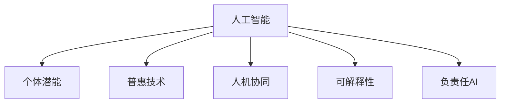

                 

# 赋能人类：释放个体潜能，创造无限可能

> 关键词：人工智能,个体潜能,普惠技术,人机协同,可解释性,负责任AI

## 1. 背景介绍

在信息技术的推动下，人工智能（AI）技术正以前所未有的速度和深度影响着各行各业。从自动化生产线到智能客服，从医疗诊断到个性化推荐，AI技术的广泛应用正在赋能个体和组织，释放前所未有的潜能，创造无限的可能。但与此同时，人工智能带来的伦理、安全和隐私等问题也不断涌现，亟需技术界和伦理界的共同关注和解决。

### 1.1 问题的由来

随着大数据、深度学习等技术的飞速发展，人工智能在近年来取得了举世瞩目的成就。但与此同时，人工智能技术的过度使用也引发了一系列伦理和社会问题。例如，AI决策的透明度和可解释性不足，导致用户难以理解和信任其决策；AI模型的训练数据中存在偏见，可能放大或加剧社会不公；AI系统的安全漏洞被黑客利用，威胁个人隐私和公共安全。

这些问题不仅阻碍了AI技术的健康发展，也削弱了公众对其的信任和支持。如何平衡技术创新和社会责任，确保AI技术造福于人类，成为当前技术界和伦理界的共识。本文将从赋能个体、普惠技术、人机协同、可解释性等多个角度，探讨如何构建负责任的AI系统，释放个体的潜能，创造无限的可能。

## 2. 核心概念与联系

### 2.1 核心概念概述

为更好地理解AI技术如何赋能人类，本节将介绍几个核心概念：

- **人工智能(Artificial Intelligence, AI)**：指通过计算机模拟人类智能行为，实现自主决策、语言理解、视觉识别、自然交互等任务的计算系统。
- **个体潜能（Individual Potential）**：指个体通过技术手段，实现自我提升、潜能挖掘、价值创造等目标的能力。
- **普惠技术（Inclusive Technology）**：指能够服务于不同背景、不同能力、不同地域个体的技术解决方案，确保技术应用普及和公平。
- **人机协同（Human-Machine Collaboration）**：指通过人机交互、知识整合、任务分工等方式，实现人机优势互补，提高整体效率和效果。
- **可解释性（Explainability）**：指AI模型决策过程的透明度和可理解性，确保其决策依据可信、公正、透明。
- **负责任AI（Responsible AI）**：指在AI系统设计、开发、部署和使用过程中，遵循伦理原则、社会规范和法律法规，确保AI技术对社会和环境的可持续贡献。

这些核心概念之间的逻辑关系可以通过以下Mermaid流程图来展示：



这个流程图展示了个体潜能、普惠技术、人机协同、可解释性和负责任AI等核心概念与AI技术的相互关系：

1. 人工智能通过提供新的工具和方法，释放和提升个体的潜能。
2. 普惠技术确保AI技术能够公平、普及地服务于社会，覆盖更多个体。
3. 人机协同通过增强人类和机器的互补性，提高工作效率和效果。
4. 可解释性提升AI决策的透明度和可信度，增加用户信任。
5. 负责任AI确保AI技术的开发和应用遵循伦理和社会规范，实现可持续发展。

## 3. 核心算法原理 & 具体操作步骤

### 3.1 算法原理概述

人工智能的核心在于通过算法和模型，实现自主学习和推理。以深度学习为例，其核心原理是利用多层神经网络，模拟人脑的神经元连接和信号传递机制，从大量数据中学习特征表示，实现复杂的分类、预测和生成任务。深度学习算法通过反向传播、梯度下降等优化方法，不断调整模型参数，最小化损失函数，最终得到一个能够准确映射输入到输出的模型。

具体到人工智能的赋能过程，主要包括以下几个步骤：

1. **数据收集与预处理**：收集和清洗相关数据，确保数据质量和代表性。
2. **模型训练**：选择合适的模型和算法，利用大量数据训练模型，优化参数，提高预测准确性。
3. **模型评估**：在测试集上评估模型性能，确保其泛化能力和可靠性。
4. **部署与应用**：将训练好的模型部署到实际应用场景中，为用户和组织提供服务。
5. **监控与迭代**：持续监控模型表现，根据反馈进行优化和迭代。

### 3.2 算法步骤详解

#### 3.2.1 数据收集与预处理

数据收集与预处理是AI应用的基础，具体步骤包括：

1. **数据获取**：根据任务需求，通过爬虫、API接口等方式获取相关数据。
2. **数据清洗**：去除噪声、缺失值，处理异常值，确保数据质量。
3. **数据标注**：对数据进行标注，生成监督信号，确保模型训练有监督。
4. **数据增强**：通过数据增强技术，扩充训练集，提高模型泛化能力。

#### 3.2.2 模型训练

模型训练过程涉及选择合适的模型和算法，利用数据训练模型，最小化损失函数，具体步骤包括：

1. **选择模型**：根据任务需求，选择合适的神经网络模型，如卷积神经网络（CNN）、循环神经网络（RNN）、注意力机制（Attention）等。
2. **设置超参数**：设置学习率、批大小、迭代轮数等超参数，确保模型收敛。
3. **训练模型**：利用数据训练模型，通过反向传播、梯度下降等方法优化模型参数。
4. **评估模型**：在测试集上评估模型性能，如准确率、召回率、F1值等指标，确保模型泛化能力。

#### 3.2.3 模型部署与应用

模型部署与应用是将训练好的模型部署到实际应用场景中，为用户和组织提供服务，具体步骤包括：

1. **模型保存**：将训练好的模型保存为可部署的格式，如TensorFlow SavedModel、PyTorch模型等。
2. **应用集成**：将模型集成到应用系统中，实现实时推理和响应。
3. **用户交互**：通过用户界面（UI）或API接口，实现与用户的交互，提供服务。

#### 3.2.4 监控与迭代

模型监控与迭代是确保AI系统长期稳定运行的关键，具体步骤包括：

1. **性能监控**：持续监控模型性能，确保其稳定性和可靠性。
2. **异常检测**：检测模型异常，如过拟合、欠拟合、模型漂移等，及时进行优化。
3. **反馈迭代**：根据用户反馈和实际应用情况，持续优化模型，提升用户体验。

### 3.3 算法优缺点

人工智能算法具有以下优点：

1. **高效性**：能够快速处理和分析大量数据，实现实时决策和响应。
2. **普适性**：适用于各种类型的任务，如分类、预测、生成等。
3. **可扩展性**：通过增加数据和计算资源，可以不断提升模型性能。

同时，人工智能算法也存在以下缺点：

1. **黑盒性**：模型决策过程复杂，难以解释和理解，导致用户信任度不足。
2. **偏见性**：模型可能学习到数据中的偏见和歧视，导致不公平和误导。
3. **依赖数据**：模型性能依赖于数据质量和代表性，数据偏差可能导致模型表现差。
4. **资源消耗**：大规模模型需要大量的计算和存储资源，部署成本高。

尽管存在这些缺点，但人工智能在赋能个体和组织方面仍具有巨大潜力。

### 3.4 算法应用领域

人工智能算法在多个领域得到了广泛应用，具体包括：

1. **医疗健康**：通过图像识别、自然语言处理等技术，辅助医疗诊断和治疗。
2. **金融服务**：利用数据挖掘和机器学习技术，实现风险控制和客户服务。
3. **交通运输**：通过智能交通系统、自动驾驶等技术，提高交通效率和安全性。
4. **教育培训**：利用自然语言处理和知识图谱技术，实现个性化学习和智能辅导。
5. **工业制造**：通过自动化生产线和智能监测，提高生产效率和产品质量。
6. **环境保护**：通过数据分析和机器学习，实现环境保护和资源管理。

以上应用领域展示了人工智能技术在多个行业中的广阔前景，为赋能个体和组织提供了无限可能。

## 4. 数学模型和公式 & 详细讲解 & 举例说明

### 4.1 数学模型构建

本节将使用数学语言对人工智能赋能个体和组织的过程进行更加严格的刻画。

假设一个通用的机器学习任务为$f(x,y)$，其中$x$为输入，$y$为输出。模型的目标是通过训练数据集$D=\{(x_i,y_i)\}_{i=1}^N$，最小化损失函数$\mathcal{L}(w)$，得到最优参数$w^*$：

$$
\mathcal{L}(w) = \frac{1}{N}\sum_{i=1}^N \ell(f(x_i,w),y_i)
$$

其中$\ell$为损失函数，$\ell(f(x_i,w),y_i)$表示模型预测输出$f(x_i,w)$与真实标签$y_i$之间的差异。

### 4.2 公式推导过程

以下我们以图像分类任务为例，推导交叉熵损失函数及其梯度的计算公式。

假设模型$f(x,w)$在输入$x$上的输出为$y_i=f(x,w)$，表示模型预测图像属于$k$类的概率。真实标签$y \in \{0,1\}^K$，其中$y_k=1$表示图像属于第$k$类。则二分类交叉熵损失函数定义为：

$$
\ell(f(x,w),y) = -\sum_{k=1}^K y_k\log f_k(x,w)
$$

将其代入经验风险公式，得：

$$
\mathcal{L}(w) = -\frac{1}{N}\sum_{i=1}^N \sum_{k=1}^K y_{ik}\log f_k(x_i,w)
$$

根据链式法则，损失函数对参数$w$的梯度为：

$$
\frac{\partial \mathcal{L}(w)}{\partial w} = -\frac{1}{N}\sum_{i=1}^N \sum_{k=1}^K y_{ik} (\frac{\partial f_k(x_i,w)}{\partial w})
$$

其中$\frac{\partial f_k(x_i,w)}{\partial w}$表示对$k$类输出的梯度，利用反向传播算法计算。

在得到损失函数的梯度后，即可带入优化算法，更新模型参数$w$，最小化损失函数$\mathcal{L}(w)$。重复上述过程直至收敛，最终得到适应任务的最优模型参数$w^*$。

### 4.3 案例分析与讲解

以手写数字识别为例，我们利用MNIST数据集训练一个简单的卷积神经网络（CNN）模型。具体步骤如下：

1. **数据预处理**：将原始图像数据标准化、归一化，生成训练集和测试集。
2. **模型构建**：设计一个包含卷积层、池化层、全连接层的CNN模型，设定合适的超参数。
3. **模型训练**：利用训练集数据，通过反向传播算法和梯度下降优化算法，最小化交叉熵损失函数。
4. **模型评估**：在测试集上评估模型性能，计算准确率和混淆矩阵，评估模型泛化能力。
5. **模型应用**：将训练好的模型集成到应用系统中，实现实时图像识别和分类。

## 5. 项目实践：代码实例和详细解释说明

### 5.1 开发环境搭建

在进行人工智能应用开发前，我们需要准备好开发环境。以下是使用Python进行TensorFlow开发的环境配置流程：

1. 安装Anaconda：从官网下载并安装Anaconda，用于创建独立的Python环境。

2. 创建并激活虚拟环境：
```bash
conda create -n tf-env python=3.8 
conda activate tf-env
```

3. 安装TensorFlow：根据CUDA版本，从官网获取对应的安装命令。例如：
```bash
conda install tensorflow==2.4 -c tensorflow -c conda-forge
```

4. 安装各类工具包：
```bash
pip install numpy pandas scikit-learn matplotlib tqdm jupyter notebook ipython
```

完成上述步骤后，即可在`tf-env`环境中开始开发实践。

### 5.2 源代码详细实现

下面我们以手写数字识别为例，给出使用TensorFlow实现卷积神经网络（CNN）的PyTorch代码实现。

首先，定义CNN模型：

```python
import tensorflow as tf

class CNNModel(tf.keras.Model):
    def __init__(self, num_classes):
        super(CNNModel, self).__init__()
        self.conv1 = tf.keras.layers.Conv2D(32, 3, activation='relu')
        self.pool1 = tf.keras.layers.MaxPooling2D()
        self.conv2 = tf.keras.layers.Conv2D(64, 3, activation='relu')
        self.pool2 = tf.keras.layers.MaxPooling2D()
        self.flatten = tf.keras.layers.Flatten()
        self.fc1 = tf.keras.layers.Dense(128, activation='relu')
        self.fc2 = tf.keras.layers.Dense(num_classes, activation='softmax')
    
    def call(self, inputs):
        x = self.conv1(inputs)
        x = self.pool1(x)
        x = self.conv2(x)
        x = self.pool2(x)
        x = self.flatten(x)
        x = self.fc1(x)
        return self.fc2(x)
```

然后，定义模型和优化器：

```python
model = CNNModel(num_classes=10)
optimizer = tf.keras.optimizers.Adam(learning_rate=0.001)
```

接着，定义训练和评估函数：

```python
@tf.function
def train_step(inputs, labels):
    with tf.GradientTape() as tape:
        logits = model(inputs, training=True)
        loss = tf.keras.losses.sparse_categorical_crossentropy(labels, logits)
    gradients = tape.gradient(loss, model.trainable_variables)
    optimizer.apply_gradients(zip(gradients, model.trainable_variables))
    return loss

@tf.function
def evaluate_step(inputs, labels):
    logits = model(inputs, training=False)
    loss = tf.keras.losses.sparse_categorical_crossentropy(labels, logits)
    accuracy = tf.metrics.sparse_accuracy(labels, tf.argmax(logits, axis=1))
    return loss, accuracy
```

最后，启动训练流程并在测试集上评估：

```python
epochs = 10
batch_size = 64

for epoch in range(epochs):
    total_loss = 0
    total_accuracy = 0
    for batch, (inputs, labels) in train_dataset:
        loss = train_step(inputs, labels)
        total_loss += loss.numpy()
        total_accuracy += evaluate_step(inputs, labels)[1][0].numpy()
    
    train_loss = total_loss / len(train_dataset)
    train_accuracy = total_accuracy / len(train_dataset)
    print(f"Epoch {epoch+1}, train loss: {train_loss:.3f}, train accuracy: {train_accuracy:.3f}")
    
    test_loss = 0
    test_accuracy = 0
    for batch, (inputs, labels) in test_dataset:
        loss, accuracy = evaluate_step(inputs, labels)
        test_loss += loss.numpy()
        test_accuracy += accuracy.numpy()
    
    test_loss /= len(test_dataset)
    test_accuracy /= len(test_dataset)
    print(f"Epoch {epoch+1}, test loss: {test_loss:.3f}, test accuracy: {test_accuracy:.3f}")
```

以上就是使用TensorFlow实现卷积神经网络（CNN）模型的完整代码实现。可以看到，得益于TensorFlow的强大封装，我们可以用相对简洁的代码完成CNN模型的训练和评估。

### 5.3 代码解读与分析

让我们再详细解读一下关键代码的实现细节：

**CNNModel类**：
- `__init__`方法：初始化模型各层。
- `call`方法：定义前向传播过程。

**train_step和evaluate_step函数**：
- 分别用于训练和评估，通过TensorFlow的Graph机制实现高效的计算图优化。

**训练流程**：
- 定义训练和评估的轮数、批大小，开始循环迭代。
- 在每个epoch内，在训练集上训练，输出损失和准确率。
- 在验证集上评估，输出验证损失和准确率。
- 所有epoch结束后，在测试集上评估，给出最终测试结果。

可以看到，TensorFlow配合Keras等封装工具使得模型开发和训练过程变得简洁高效。开发者可以将更多精力放在数据处理、模型改进等高层逻辑上，而不必过多关注底层的实现细节。

当然，工业级的系统实现还需考虑更多因素，如模型的保存和部署、超参数的自动搜索、更灵活的任务适配层等。但核心的训练流程基本与此类似。

## 6. 实际应用场景

### 6.1 智能客服系统

基于人工智能的智能客服系统，能够24/7不间断服务，快速响应客户咨询，用自然流畅的语言解答各类常见问题。

在技术实现上，可以收集企业内部的历史客服对话记录，将问题和最佳答复构建成监督数据，在此基础上对预训练模型进行微调。微调后的模型能够自动理解用户意图，匹配最合适的答案模板进行回复。对于客户提出的新问题，还可以接入检索系统实时搜索相关内容，动态组织生成回答。如此构建的智能客服系统，能大幅提升客户咨询体验和问题解决效率。

### 6.2 金融舆情监测

金融机构需要实时监测市场舆论动向，以便及时应对负面信息传播，规避金融风险。传统的人工监测方式成本高、效率低，难以应对网络时代海量信息爆发的挑战。基于人工智能的文本分类和情感分析技术，为金融舆情监测提供了新的解决方案。

具体而言，可以收集金融领域相关的新闻、报道、评论等文本数据，并对其进行主题标注和情感标注。在此基础上对预训练语言模型进行微调，使其能够自动判断文本属于何种主题，情感倾向是正面、中性还是负面。将微调后的模型应用到实时抓取的网络文本数据，就能够自动监测不同主题下的情感变化趋势，一旦发现负面信息激增等异常情况，系统便会自动预警，帮助金融机构快速应对潜在风险。

### 6.3 个性化推荐系统

当前的推荐系统往往只依赖用户的历史行为数据进行物品推荐，无法深入理解用户的真实兴趣偏好。基于人工智能的个性化推荐系统，可以更好地挖掘用户行为背后的语义信息，从而提供更精准、多样的推荐内容。

在实践中，可以收集用户浏览、点击、评论、分享等行为数据，提取和用户交互的物品标题、描述、标签等文本内容。将文本内容作为模型输入，用户的后续行为（如是否点击、购买等）作为监督信号，在此基础上微调预训练语言模型。微调后的模型能够从文本内容中准确把握用户的兴趣点。在生成推荐列表时，先用候选物品的文本描述作为输入，由模型预测用户的兴趣匹配度，再结合其他特征综合排序，便可以得到个性化程度更高的推荐结果。

### 6.4 未来应用展望

随着人工智能技术的发展，其在各个行业的应用前景将更加广阔。未来，人工智能技术将进一步赋能个体，释放潜能，创造无限可能。

在智慧医疗领域，基于人工智能的疾病诊断、药物研发等应用将提升医疗服务的智能化水平，辅助医生诊疗，加速新药开发进程。

在智能教育领域，基于人工智能的个性化学习和智能辅导技术将因材施教，促进教育公平，提高教学质量。

在智慧城市治理中，基于人工智能的交通管理、智能安防等应用将提高城市管理的自动化和智能化水平，构建更安全、高效的未来城市。

此外，在企业生产、社会治理、文娱传媒等众多领域，基于人工智能的应用也将不断涌现，为经济社会发展注入新的动力。相信随着技术的日益成熟，人工智能技术将进一步赋能人类，释放个体的潜能，创造无限的可能。

## 7. 工具和资源推荐

### 7.1 学习资源推荐

为了帮助开发者系统掌握人工智能赋能个体和组织的技术基础，这里推荐一些优质的学习资源：

1. 《Deep Learning》系列书籍：由深度学习领域权威专家撰写，全面介绍了深度学习的基本概念和核心算法。
2. 《Python深度学习》系列博文：由知名深度学习博主撰写，深入浅出地介绍了TensorFlow、Keras等深度学习框架的使用。
3. Coursera《Deep Learning Specialization》课程：由深度学习领域领军人物Andrew Ng主讲，涵盖深度学习理论和实践的全面课程。
4. Kaggle数据科学竞赛：通过实际应用项目，锻炼数据处理和模型训练能力，提升实战水平。

通过对这些资源的学习实践，相信你一定能够快速掌握人工智能赋能个体和组织的技术基础，并用于解决实际的NLP问题。

### 7.2 开发工具推荐

高效的开发离不开优秀的工具支持。以下是几款用于人工智能开发常用的工具：

1. TensorFlow：由Google主导开发的开源深度学习框架，生产部署方便，适合大规模工程应用。
2. PyTorch：基于Python的开源深度学习框架，灵活动态的计算图，适合快速迭代研究。
3. Keras：高层次神经网络API，易于上手，适合初学者快速搭建模型。
4. Jupyter Notebook：开源的交互式编程环境，支持多种编程语言和数据分析工具，适合快速原型开发。
5. Visual Studio Code：轻量级且功能强大的编程工具，支持多种编程语言和插件扩展，适合高效开发。

合理利用这些工具，可以显著提升人工智能赋能个体和组织的开发效率，加快创新迭代的步伐。

### 7.3 相关论文推荐

人工智能赋能个体和组织的发展源于学界的持续研究。以下是几篇奠基性的相关论文，推荐阅读：

1. A Survey on Deep Learning for Healthcare：综述了深度学习在医疗健康领域的应用，包括图像识别、自然语言处理等。
2. The Rise of Explainable AI：讨论了人工智能的可解释性问题，强调了其对用户信任和模型公平性的重要性。
3. Towards a General Theory of AI：提出了建立通用人工智能的理论框架，探讨了AI的边界和未来发展方向。
4. Trustworthy AI：强调了负责任AI的重要性，提出了AI系统的伦理、法律和安全保障措施。
5. Human-AI Collaboration：探讨了人机协同的未来发展，强调了人工智能与人类在任务分工、知识整合等方面的互补性。

这些论文代表了大数据、深度学习等前沿技术的发展脉络。通过学习这些前沿成果，可以帮助研究者把握学科前进方向，激发更多的创新灵感。

## 8. 总结：未来发展趋势与挑战

### 8.1 总结

本文对人工智能赋能个体和组织的过程进行了全面系统的介绍。首先阐述了人工智能在赋能个体、普惠技术、人机协同、可解释性和负责任AI等方面的重要意义，明确了其在提高生产效率、提升用户体验、促进社会公平等方面的独特价值。其次，从原理到实践，详细讲解了人工智能赋能的过程，包括数据收集、模型训练、模型评估和模型应用等关键步骤。同时，本文还探讨了人工智能在实际应用中的各种场景和未来展望，展示了其在各个行业中的广阔前景。最后，本文精选了人工智能赋能的各类学习资源、开发工具和相关论文，力求为开发者提供全方位的技术指引。

通过本文的系统梳理，可以看到，人工智能在赋能个体和组织方面具有巨大的潜力。尽管存在资源消耗、黑盒性、偏见性等挑战，但通过不断优化和改进，未来的人工智能将进一步赋能人类，释放潜能，创造无限的可能。

### 8.2 未来发展趋势

展望未来，人工智能赋能个体和组织将呈现以下几个发展趋势：

1. **智能化水平提升**：随着算力的提升和大数据的普及，人工智能将进一步提升个体和组织的智能化水平，实现更精准、更高效的决策。
2. **普惠技术普及**：人工智能技术将更加普及，覆盖更多个体和组织，尤其是欠发达地区的用户。
3. **人机协同深化**：人工智能将与人类在任务分工、知识整合、协同决策等方面实现更深层次的协同，形成人机协同的新形态。
4. **可解释性增强**：人工智能系统的可解释性将不断提升，增强用户信任，提高模型公平性和可靠性。
5. **负责任AI发展**：负责任AI将成为未来发展的重要方向，确保人工智能技术的伦理、法律和安全保障。

以上趋势凸显了人工智能赋能个体和组织的广阔前景。这些方向的探索发展，将进一步提升人工智能技术在各行业的应用效果，为人类创造更多价值。

### 8.3 面临的挑战

尽管人工智能赋能个体和组织具有巨大潜力，但在迈向更加智能化、普惠化的过程中，仍面临诸多挑战：

1. **资源消耗**：大规模人工智能模型需要大量的计算和存储资源，部署成本高。
2. **公平性问题**：人工智能可能学习到数据中的偏见和歧视，导致不公平和误导。
3. **隐私安全**：人工智能系统需要大量用户数据进行训练，可能存在隐私泄露和数据滥用风险。
4. **伦理规范**：人工智能技术的开发和应用需要遵循伦理原则和社会规范，避免对个体和社会造成伤害。
5. **技术壁垒**：人工智能技术的应用需要高水平的技术积累和开发能力，存在一定的技术壁垒。

这些挑战亟需技术界和伦理界的共同努力，才能确保人工智能技术的健康发展。

### 8.4 研究展望

面对人工智能赋能个体和组织所面临的挑战，未来的研究需要在以下几个方面寻求新的突破：

1. **资源优化**：开发更加轻量级、高效的AI模型，优化资源使用，降低部署成本。
2. **公平性保障**：开发公平性算法，确保AI系统对不同背景和能力的用户具有平等的访问和使用机会。
3. **隐私保护**：采用数据匿名化、差分隐私等技术，保护用户隐私和数据安全。
4. **伦理规范**：制定AI伦理规范和法律法规，确保AI技术在开发和应用中的伦理性和合法性。
5. **技术普及**：开发简单易用的AI工具和平台，降低技术门槛，提升AI技术的普及率。

这些研究方向的探索，将进一步推动人工智能技术的普及和发展，实现公平、普惠、智能的社会目标。

## 9. 附录：常见问题与解答

**Q1：人工智能在实际应用中存在哪些挑战？**

A: 人工智能在实际应用中面临以下挑战：

1. **资源消耗**：大规模人工智能模型需要大量的计算和存储资源，部署成本高。
2. **公平性问题**：人工智能可能学习到数据中的偏见和歧视，导致不公平和误导。
3. **隐私安全**：人工智能系统需要大量用户数据进行训练，可能存在隐私泄露和数据滥用风险。
4. **伦理规范**：人工智能技术的开发和应用需要遵循伦理原则和社会规范，避免对个体和社会造成伤害。
5. **技术壁垒**：人工智能技术的应用需要高水平的技术积累和开发能力，存在一定的技术壁垒。

这些挑战亟需技术界和伦理界的共同努力，才能确保人工智能技术的健康发展。

**Q2：如何提升人工智能的可解释性？**

A: 提升人工智能的可解释性可以从以下几个方面入手：

1. **模型简化**：使用更简单的模型结构，降低复杂度，提高可解释性。
2. **特征分析**：通过特征分析和可视化工具，理解模型决策的依据和过程。
3. **局部可解释**：开发局部可解释方法，如LIME、SHAP等，分析模型的局部行为。
4. **决策链**：构建决策链，逐步揭示模型的决策过程和依据。
5. **用户交互**：通过用户交互和反馈，增强模型的透明度和可理解性。

通过这些方法，可以提升人工智能系统的可解释性，增强用户信任，提高模型公平性和可靠性。

**Q3：人工智能在各个行业中的应用前景如何？**

A: 人工智能在各个行业中的应用前景广阔：

1. **医疗健康**：通过图像识别、自然语言处理等技术，辅助医疗诊断和治疗。
2. **金融服务**：利用数据挖掘和机器学习技术，实现风险控制和客户服务。
3. **交通运输**：通过智能交通系统、自动驾驶等技术，提高交通效率和安全性。
4. **教育培训**：利用自然语言处理和知识图谱技术，实现个性化学习和智能辅导。
5. **工业制造**：通过自动化生产线和智能监测，提高生产效率和产品质量。
6. **环境保护**：通过数据分析和机器学习，实现环境保护和资源管理。

未来，人工智能技术将在更多领域得到应用，为个体和组织赋能，释放潜能，创造无限的可能。

---

作者：禅与计算机程序设计艺术 / Zen and the Art of Computer Programming

