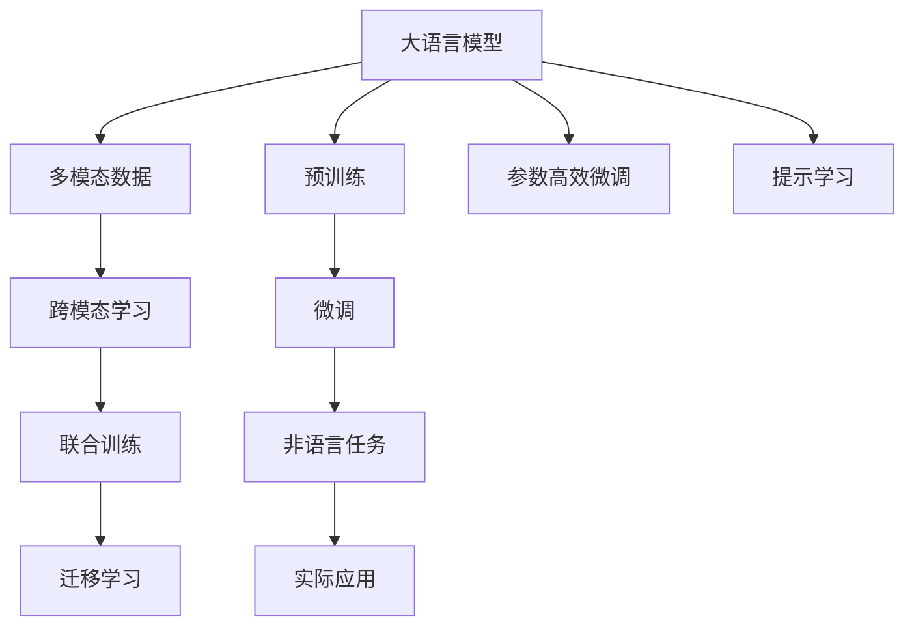

                 

# 超越语言：LLM 在非语言任务上的应用

大语言模型（Large Language Models, LLMs）作为自然语言处理（Natural Language Processing, NLP）领域的前沿技术，已经展现出强大的跨领域学习能力，其应用不仅限于文本生成、翻译、分类等语言相关任务，也逐步拓展到了视觉、声音、动作等多种非语言领域。本文将深入探讨LLM在非语言任务上的应用，包括图像描述、视频字幕、动作识别、情绪识别等领域，展示其在处理复杂多模态数据时的巨大潜力。

## 1. 背景介绍

### 1.1 问题由来

随着深度学习技术的迅速发展，大语言模型在NLP领域取得了显著的进展。这些模型通过在海量无标签文本数据上预训练，学习到了丰富的语言知识和常识，通过微调可以在各种NLP任务上取得优异的性能。然而，传统的大语言模型在处理非语言数据时存在局限，因为它们通常只处理文本，而无法直接处理图像、声音、动作等非语言数据。

为了解决这一问题，研究人员开始探索如何扩展大语言模型的应用范围，使其能够处理多种类型的数据。这种跨领域学习能力的提升，不仅扩大了大语言模型的应用领域，也为解决复杂的多模态数据处理问题提供了新的思路。

### 1.2 问题核心关键点

在探讨LLM在非语言任务上的应用时，我们需要关注以下核心问题：

- 如何设计多模态输入，使大语言模型能够同时处理文本和图像、声音、动作等非语言数据？
- 如何在大语言模型中引入非语言知识，提升其在非语言任务上的理解能力和生成能力？
- 如何通过训练和微调，优化大语言模型在非语言任务上的表现，使其能够适应不同的应用场景？
- 在处理多模态数据时，如何平衡各模态之间的权重，确保模型输出符合任务需求？

这些问题涉及到大语言模型在多模态数据处理中的关键技术点，包括数据预处理、模型架构设计、训练优化策略等。

## 2. 核心概念与联系

### 2.1 核心概念概述

为了更好地理解LLM在非语言任务上的应用，我们首先需要了解一些核心概念：

- **大语言模型（LLM）**：指通过大规模数据预训练，具有强大语言处理能力的深度学习模型，如BERT、GPT-3等。
- **多模态数据**：指包含文本、图像、声音、动作等多种形式的数据，例如文本描述与图像、声音、动作数据相结合的组合数据。
- **跨模态学习**：指通过融合不同模态的数据，提升大语言模型在非语言任务上的表现，实现多模态数据的协同理解与生成。
- **联合训练**：指在模型训练过程中同时考虑多个模态的信息，通过联合优化提升模型性能。
- **迁移学习**：指将在大语言模型上预训练获得的知识迁移到非语言任务中，以提高模型在新任务上的表现。

这些概念之间的关系可以通过以下Mermaid流程图来展示：



这个流程图展示了LLM在非语言任务上的应用流程：

1. 大语言模型通过预训练获得基础能力。
2. 在多模态数据上应用跨模态学习和联合训练，提升模型在非语言任务上的理解能力。
3. 通过迁移学习或微调，使模型适应特定非语言任务。
4. 应用参数高效微调和提示学习技术，进一步优化模型性能。
5. 将模型应用于各类实际非语言任务，如图像描述、视频字幕、动作识别等。

## 3. 核心算法原理 & 具体操作步骤
### 3.1 算法原理概述

LLM在非语言任务上的应用主要基于两个核心原理：跨模态学习和迁移学习。

- **跨模态学习**：指将不同模态的信息融合在一起，提升大语言模型对多模态数据的理解能力。在处理非语言数据时，LLM通常会通过嵌入层（Embedding Layer）将不同模态的数据映射到统一的特征空间，并结合文本信息进行联合优化。

- **迁移学习**：指将在大语言模型上预训练获得的知识迁移到非语言任务中。这种迁移学习通过在非语言任务上对模型进行微调，使其能够更好地适应特定的任务需求。

### 3.2 算法步骤详解

基于LLM在非语言任务上的应用，以下是具体的算法步骤：

**Step 1: 数据预处理**

- 对于图像数据，通常需要提取图像特征（如使用卷积神经网络CNN）。
- 对于声音和动作数据，需要提取相应的信号特征（如MFCC特征、动作姿态序列等）。
- 对于文本数据，则进行传统的预处理，如分词、去停用词等。

**Step 2: 多模态输入设计**

- 设计多模态输入，包括文本、图像、声音和动作数据。例如，可以使用视觉特征、音频特征和动作特征作为输入，将它们与文本信息结合。

**Step 3: 模型架构设计**

- 选择适合多模态数据的模型架构，如使用Transformer层来处理多模态输入。
- 在模型中引入跨模态融合模块，如使用注意力机制来融合不同模态的信息。

**Step 4: 联合训练**

- 在模型中定义联合损失函数，融合不同模态的损失。
- 使用联合优化算法，如MAML（Meta-Learning by Mimicking Teachers），进行模型优化。

**Step 5: 迁移学习**

- 在非语言任务上使用微调，调整模型参数以适应特定任务需求。
- 使用迁移学习策略，将预训练知识迁移到非语言任务中，如在视频字幕生成任务中使用预训练的视觉和语言模型。

**Step 6: 参数高效微调和提示学习**

- 使用参数高效微调技术，如 Adapter、LoRA 等，在固定大部分预训练参数的情况下，只微调少量参数。
- 使用提示学习技术，通过精心设计的提示模板，引导模型进行特定任务的推理和生成。

### 3.3 算法优缺点

LLM在非语言任务上的应用有以下优点：

- **通用性**：大语言模型在多种非语言任务上都有潜力，可以适应不同类型的数据。
- **多模态融合**：能够融合多种模态的信息，提升模型对复杂数据的理解能力。
- **迁移学习能力**：通过迁移学习，可以提升模型在新任务上的表现，减少从头训练的成本。

同时，也存在以下缺点：

- **计算资源需求高**：处理多模态数据需要较高的计算资源，尤其是在联合训练和微调过程中。
- **模型复杂度高**：多模态融合和联合训练会增加模型的复杂度，可能导致过拟合或训练不稳定。
- **数据需求量大**：非语言任务通常需要大量的标注数据来训练模型，获取高质量标注数据的成本较高。

### 3.4 算法应用领域

LLM在非语言任务上的应用领域非常广泛，以下是一些典型的应用场景：

- **图像描述生成**：将图像输入到模型中，生成对图像内容的详细描述。
- **视频字幕生成**：将视频中的音频和视觉信息与文本信息结合，自动生成视频字幕。
- **动作识别**：通过摄像头捕捉动作序列，结合语言描述生成动作描述或识别特定动作。
- **情感识别**：分析语音、面部表情等信息，识别用户的情感状态。
- **语音识别**：将语音转换为文本，识别语义信息。

## 4. 数学模型和公式 & 详细讲解 & 举例说明

### 4.1 数学模型构建

在非语言任务上，LLM的应用通常需要设计联合损失函数，将不同模态的损失进行融合。以下是一个简单的联合损失函数示例：

$$
\mathcal{L}(\theta) = \alpha \cdot \mathcal{L}_{text} + \beta \cdot \mathcal{L}_{vision} + \gamma \cdot \mathcal{L}_{audio} + \delta \cdot \mathcal{L}_{action}
$$

其中，$\mathcal{L}_{text}$、$\mathcal{L}_{vision}$、$\mathcal{L}_{audio}$、$\mathcal{L}_{action}$ 分别表示文本、图像、声音和动作的损失函数，$\alpha$、$\beta$、$\gamma$、$\delta$ 为权重系数，用于平衡不同模态的权重。

### 4.2 公式推导过程

假设有一个多模态数据集 $D = \{(x_i, y_i)\}_{i=1}^N$，其中 $x_i$ 为多模态数据，$y_i$ 为对应的标签。我们设计一个联合优化算法，用于最小化联合损失函数 $\mathcal{L}(\theta)$，其中 $\theta$ 为模型的参数。

联合优化算法的目标函数为：

$$
\min_{\theta} \mathcal{L}(\theta) = \alpha \cdot \mathcal{L}_{text} + \beta \cdot \mathcal{L}_{vision} + \gamma \cdot \mathcal{L}_{audio} + \delta \cdot \mathcal{L}_{action}
$$

使用梯度下降法进行优化，更新参数 $\theta$：

$$
\theta \leftarrow \theta - \eta \nabla_{\theta} \mathcal{L}(\theta)
$$

其中，$\eta$ 为学习率，$\nabla_{\theta} \mathcal{L}(\theta)$ 为联合损失函数对参数 $\theta$ 的梯度。

### 4.3 案例分析与讲解

以图像描述生成任务为例，我们设计一个多模态联合训练的模型架构，模型包含文本编码器、视觉编码器和跨模态融合模块。

- **文本编码器**：使用BERT等预训练语言模型，将输入的文本编码成向量表示。
- **视觉编码器**：使用卷积神经网络（CNN）对输入的图像进行特征提取，得到视觉特征向量。
- **跨模态融合模块**：通过注意力机制，将文本编码器和视觉编码器得到的特征向量进行融合，得到一个联合表示。

最终，模型输出对图像的描述。通过这种联合训练的方式，模型能够在处理图像描述生成任务时，同时利用文本和视觉信息，提升描述的准确性和生动性。

## 5. 项目实践：代码实例和详细解释说明

### 5.1 开发环境搭建

在进行多模态数据处理和模型训练时，我们需要搭建一个高性能的开发环境。以下是一些关键组件：

1. **深度学习框架**：如TensorFlow、PyTorch等。
2. **预训练模型库**：如HuggingFace的Transformers库，包含多种预训练语言模型。
3. **跨模态处理库**：如OpenCV、PyAudio等，用于处理图像、声音和动作数据。
4. **数据预处理库**：如NLTK、spaCy等，用于文本预处理。
5. **联合训练框架**：如Meta-Learning by Mimicking Teachers (MAML)，用于多模态联合训练。

### 5.2 源代码详细实现

下面以图像描述生成任务为例，展示使用PyTorch进行模型实现的代码：

```python
import torch
from transformers import BertModel, BertTokenizer
import torch.nn as nn
import torch.optim as optim

# 加载预训练模型和 tokenizer
model = BertModel.from_pretrained('bert-base-cased')
tokenizer = BertTokenizer.from_pretrained('bert-base-cased')

# 定义模型架构
class MultimodalModel(nn.Module):
    def __init__(self):
        super(MultimodalModel, self).__init__()
        self.text_encoder = BertModel.from_pretrained('bert-base-cased')
        self.vision_encoder = nn.Conv2d(3, 512, kernel_size=3, stride=1, padding=1)
        self.fusion_module = nn.Linear(512+512, 1024)

    def forward(self, text, image):
        text_features = self.text_encoder(text)
        image_features = self.vision_encoder(image)
        fused_features = self.fusion_module(torch.cat([text_features, image_features], dim=1))
        return fused_features

# 定义联合损失函数
def compute_loss(text_features, image_features, labels):
    text_loss = nn.CrossEntropyLoss()(text_features, labels)
    image_loss = nn.CrossEntropyLoss()(image_features, labels)
    return text_loss + image_loss

# 定义联合优化器
optimizer = optim.AdamW(model.parameters(), lr=2e-5)

# 训练模型
def train_epoch(model, data_loader):
    model.train()
    total_loss = 0
    for batch in data_loader:
        text, image, label = batch
        optimizer.zero_grad()
        features = model(text, image)
        loss = compute_loss(features, features, label)
        loss.backward()
        optimizer.step()
        total_loss += loss.item()
    return total_loss / len(data_loader)

# 训练模型
model.train()
for epoch in range(10):
    train_loss = train_epoch(model, train_loader)
    print(f"Epoch {epoch+1}, train loss: {train_loss:.3f}")

```

### 5.3 代码解读与分析

在上述代码中，我们定义了一个多模态模型架构，包含了文本编码器、视觉编码器和跨模态融合模块。训练过程中，我们定义了联合损失函数和联合优化器，并使用AdamW优化算法进行优化。

代码的核心在于将文本和图像的特征向量进行融合，得到联合表示，并通过多模态联合训练的方式，提升模型在图像描述生成任务上的表现。在实际应用中，还需要进一步优化模型架构和训练策略，如引入更多跨模态融合技术、使用更有效的联合训练算法等，以提高模型性能。

### 5.4 运行结果展示

在训练完成后，我们可以使用测试集评估模型性能。例如，在图像描述生成任务上，我们可以使用BLEU等指标评估模型生成的描述与真实描述的匹配度。

## 6. 实际应用场景

### 6.1 图像描述生成

图像描述生成是LLM在非语言任务上的重要应用之一。它可以将视觉信息转换为自然语言描述，使得机器能够理解图像内容，提供更丰富、更生动的信息。

例如，在电商平台上，使用图像描述生成技术，可以将产品图片自动生成详细描述，帮助用户快速了解产品特性和用途。在博物馆展览中，通过图像描述生成，可以为参观者提供个性化的展览解说，提升参观体验。

### 6.2 视频字幕生成

视频字幕生成是将视频内容转换为文本，提供对视频的理解和解释。在视频会议、在线教育等领域，使用视频字幕生成技术，可以使得聋哑人士、非母语者等人群更好地理解和参与视频内容。

### 6.3 动作识别

动作识别是通过摄像头捕捉人体动作序列，结合语言描述生成动作描述或识别特定动作。在体育赛事、安全监控等领域，使用动作识别技术，可以自动识别和分析人体动作，提供实时监控和指导。

### 6.4 情感识别

情感识别是通过分析语音、面部表情等信息，识别用户的情感状态。在客服、健康监测等领域，使用情感识别技术，可以更好地理解用户需求和健康状况，提供个性化服务和健康指导。

### 6.5 语音识别

语音识别是将语音转换为文本，识别语义信息。在智能家居、智能助理等领域，使用语音识别技术，可以使得用户通过语音指令控制设备，提高生活便利性和智能化水平。

## 7. 工具和资源推荐

### 7.1 学习资源推荐

为了深入了解LLM在非语言任务上的应用，推荐以下学习资源：

1. **《深度学习与自然语言处理》课程**：斯坦福大学开设的NLP课程，涵盖语言模型、多模态学习、跨模态融合等前沿话题。
2. **Transformers官方文档**：包含多种预训练语言模型和跨模态融合模块的详细介绍和使用指南。
3. **Meta-Learning by Mimicking Teachers**：了解联合训练和多模态学习的最新进展，学习如何设计联合损失函数和优化算法。
4. **NLP论文集**：阅读最新发表的NLP论文，了解业界前沿技术和应用案例。

### 7.2 开发工具推荐

以下是一些常用的开发工具：

1. **TensorFlow**：高性能深度学习框架，支持多模态数据处理和联合训练。
2. **PyTorch**：灵活的深度学习框架，支持多模态融合和联合训练。
3. **OpenCV**：开源计算机视觉库，支持图像处理和特征提取。
4. **PyAudio**：Python音频处理库，支持声音处理和特征提取。
5. **NLTK**：自然语言处理工具库，支持文本预处理和模型评估。

### 7.3 相关论文推荐

以下是一些经典的多模态学习和跨模态融合论文，推荐阅读：

1. **"Unsupervised Cross-modal Clustering with Adversarial Alignment"**：提出一种无监督跨模态聚类方法，通过对抗性对齐提升模型性能。
2. **"Deep Cross-modal Guided Attention Network"**：提出一种跨模态指导注意力网络，通过联合优化提升模型在多模态任务上的表现。
3. **"Learning to Be Adversarial to Teachers: Meta-Learning by Mimicking Teachers"**：介绍Meta-Learning by Mimicking Teachers（MAML）算法，用于多模态联合训练。
4. **"Multimodal Matching via Contrastive Learning"**：提出一种多模态匹配方法，通过对比学习提升模型在多模态数据上的匹配能力。

## 8. 总结：未来发展趋势与挑战

### 8.1 研究成果总结

大语言模型在非语言任务上的应用已经取得初步进展，展示了其在多模态数据处理中的巨大潜力。通过跨模态学习和迁移学习，LLM能够融合不同模态的信息，提升在非语言任务上的表现。然而，当前仍然存在一些挑战和问题，如计算资源需求高、模型复杂度高、数据需求量大等。

### 8.2 未来发展趋势

展望未来，LLM在非语言任务上的应用将呈现以下几个趋势：

1. **多模态融合技术发展**：未来将开发更加高效的多模态融合方法，提升模型对复杂多模态数据的理解和生成能力。
2. **联合训练策略优化**：联合训练方法将继续改进，设计更有效的联合损失函数和优化算法，提升模型在多模态任务上的表现。
3. **跨模态学习应用拓展**：跨模态学习将扩展到更多领域，如图像描述生成、视频字幕生成、动作识别等。
4. **深度学习模型的演进**：深度学习模型将继续发展，支持更大规模、更复杂的多模态数据处理。
5. **领域专用模型开发**：针对特定领域的多模态学习算法将得到更多关注，提升模型在该领域的适用性和表现。

### 8.3 面临的挑战

尽管LLM在非语言任务上取得了一些进展，但仍然面临诸多挑战：

1. **计算资源需求高**：处理多模态数据需要较高的计算资源，尤其是在联合训练和微调过程中。
2. **模型复杂度高**：多模态融合和联合训练会增加模型的复杂度，可能导致过拟合或训练不稳定。
3. **数据需求量大**：非语言任务通常需要大量的标注数据来训练模型，获取高质量标注数据的成本较高。
4. **迁移学习能力不足**：当前模型在迁移学习中的应用仍然有限，需要进一步研究如何通过迁移学习提升模型在新任务上的表现。

### 8.4 研究展望

未来的研究需要在以下几个方面进行改进：

1. **计算效率提升**：开发更加高效的计算方法，提升模型在多模态数据处理中的效率。
2. **模型可解释性增强**：增强模型的可解释性，使开发者和用户能够更好地理解模型的工作原理和决策过程。
3. **数据需求减少**：研究如何利用无标注数据进行预训练和微调，减少对标注数据的依赖。
4. **多模态知识融合**：探索如何更好地融合多模态信息，提升模型在复杂多模态任务上的表现。
5. **跨领域应用拓展**：研究如何拓展LLM在更多领域的应用，如医疗、金融、教育等。

综上所述，大语言模型在非语言任务上的应用前景广阔，但仍然面临诸多挑战。通过技术创新和不断改进，相信LLM将在更多领域展现其强大的跨领域学习能力，为多模态数据处理带来革命性的突破。

## 9. 附录：常见问题与解答

**Q1: 如何选择合适的模型架构？**

A: 选择合适的模型架构需要考虑多模态数据的类型和特征。例如，图像和文本的融合通常使用Transformer层，声音和动作的融合则可以使用卷积神经网络。在选择架构时，还需要考虑模型的计算效率和可扩展性。

**Q2: 如何设计联合损失函数？**

A: 设计联合损失函数需要平衡不同模态的权重。一般通过交叉熵损失、对比损失等方法融合不同模态的损失。同时，需要注意不同模态的数据类型和特征，设计适合多模态任务的损失函数。

**Q3: 如何优化联合训练过程？**

A: 优化联合训练过程需要选择合适的优化算法和超参数。一般使用Adam、SGD等优化算法，并通过学习率衰减、正则化等技术，提升训练效果。同时，需要注意计算资源的使用，避免过拟合和计算过载。

**Q4: 如何评估多模态模型的性能？**

A: 评估多模态模型的性能需要设计合适的指标。一般使用BLEU、ROUGE等指标评估文本生成任务，使用Top-1 accuracy、Top-5 accuracy等指标评估分类任务，使用F1 score等指标评估标注任务。

---

作者：禅与计算机程序设计艺术 / Zen and the Art of Computer Programming

