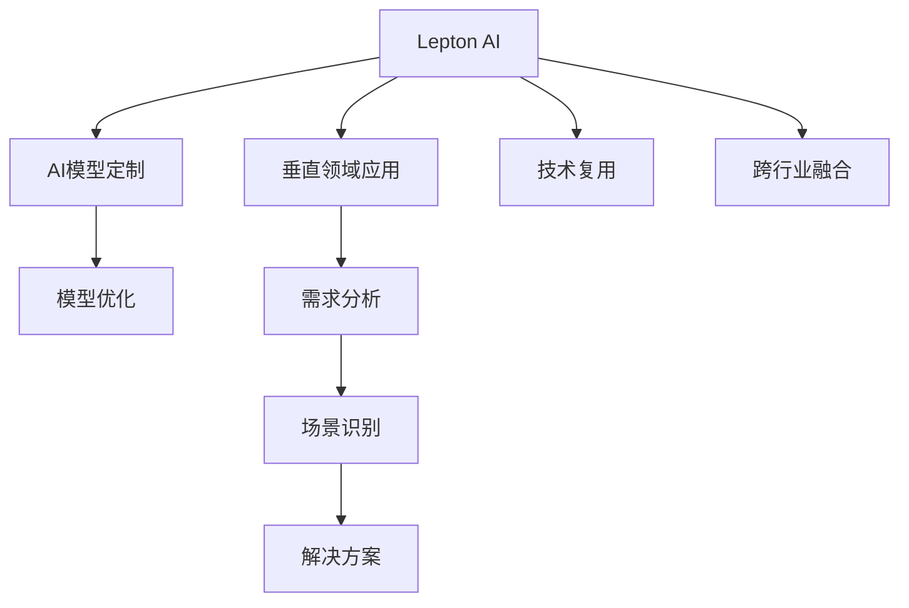

                 

# 跨行业AI解决方案：Lepton AI的垂直领域拓展

## 1. 背景介绍

### 1.1 问题由来
Lepton AI是一家领先的AI技术公司，专注于利用人工智能技术解决行业特定的复杂问题。自成立以来，Lepton AI已经积累了丰富的跨行业AI项目经验，包括医疗、金融、智能制造等。本文将详细探讨Lepton AI在各垂直领域的具体应用和技术突破，为业界提供实践参考。

### 1.2 问题核心关键点
Lepton AI的垂直领域拓展，主要聚焦于以下几个核心关键点：
- 垂直行业的应用场景识别和需求分析
- AI模型的定制开发和优化
- 跨行业技术复用和创新融合
- 模型部署和持续优化策略

这些关键点不仅反映了Lepton AI的技术实力和行业洞察力，也体现了大规模AI技术在垂直领域的潜力和价值。

## 2. 核心概念与联系

### 2.1 核心概念概述

为更好地理解Lepton AI的垂直领域拓展，本节将介绍几个关键概念：

- **Lepton AI**：提供跨行业AI解决方案的AI技术公司，专注于AI技术在各垂直领域的深入应用。
- **垂直领域**：指具体的应用场景和行业，如医疗、金融、制造等。
- **AI模型定制**：根据特定行业的需求，对通用AI模型进行定制开发，提升模型的行业适应性。
- **模型优化**：利用技术手段和行业知识，优化AI模型性能，提升模型在垂直领域的实用性和效果。
- **技术复用**：在不同垂直领域间实现AI技术、架构和工具的复用，降低开发成本，提升技术效率。
- **跨行业融合**：将不同行业间的技术、经验和知识进行融合，形成新的AI解决方案，推动AI技术在更多领域的创新应用。

这些概念之间的逻辑关系可以通过以下Mermaid流程图来展示：



这个流程图展示了Lepton AI的核心概念及其之间的关系：

1. Lepton AI利用垂直领域的特定需求，定制化开发AI模型。
2. 模型优化结合技术手段和行业知识，提升模型在垂直领域的实用性。
3. 技术复用和跨行业融合，降低了开发成本，提升了技术效率。
4. 模型最终适配到垂直领域的具体场景，解决实际问题。

## 3. 核心算法原理 & 具体操作步骤
### 3.1 算法原理概述

Lepton AI的跨行业AI解决方案，基于以下核心算法原理：

- **深度学习**：利用深度神经网络进行特征提取和模型训练，提升模型对复杂问题的处理能力。
- **迁移学习**：通过已有模型在不同行业间的迁移学习，减少开发成本，提升模型泛化能力。
- **自监督学习**：在缺乏标注数据的情况下，通过数据增强和预训练等方法，自监督学习模型特征，提高模型泛化能力。
- **强化学习**：结合AI模型与业务规则，通过不断的试错和优化，提升模型在特定场景下的决策能力。

这些算法原理共同构成了Lepton AI垂直领域拓展的算法基础，帮助模型更好地适应复杂、多样化的行业需求。

### 3.2 算法步骤详解

Lepton AI的AI模型定制和优化过程，一般包括以下关键步骤：

**Step 1: 垂直领域需求分析**
- 与客户进行深入沟通，收集行业需求、问题点和业务场景。
- 分析行业数据特点，评估数据质量和可用性。
- 定义模型目标和性能指标，确定模型需要解决的核心问题。

**Step 2: 模型选择与定制**
- 根据需求分析结果，选择最适合的预训练模型。
- 对模型进行微调，适配特定行业数据和业务逻辑。
- 增加或调整模型层级，优化模型结构。

**Step 3: 模型优化与训练**
- 结合行业知识，对模型进行参数调整和优化。
- 采用自监督学习、迁移学习等技术，提升模型泛化能力。
- 利用强化学习，通过业务规则和场景模拟，进一步优化模型。

**Step 4: 模型部署与测试**
- 在实际业务环境中进行模型部署，收集反馈和数据。
- 利用A/B测试等方法，评估模型效果和用户接受度。
- 根据反馈数据，持续优化模型，提升模型性能。

**Step 5: 模型监控与维护**
- 实施模型监控机制，实时跟踪模型性能和稳定性。
- 定期更新模型参数，保持模型在业务场景中的有效性。
- 建立模型维护体系，及时响应和解决模型问题。

### 3.3 算法优缺点

Lepton AI的跨行业AI解决方案，具有以下优点：
1. 深度定制化。根据各垂直领域的需求，定制化开发AI模型，确保模型适用性和效果。
2. 泛化能力强。利用迁移学习、自监督学习等技术，提升模型在不同场景下的泛化能力。
3. 高效优化。结合行业知识和业务规则，通过强化学习等方法，快速优化模型性能。
4. 技术复用。在不同行业间复用AI技术、架构和工具，降低开发成本，提升技术效率。
5. 持续迭代。通过实时监控和反馈机制，持续优化模型，保持模型在业务场景中的高效运行。

同时，该方法也存在一些局限性：
1. 开发周期长。特别是对于完全新颖的垂直领域，定制化开发和模型优化需要较长的开发周期。
2. 数据质量要求高。模型性能高度依赖于数据质量，缺乏高质量标注数据时效果可能受限。
3. 领域知识需求高。模型优化和定制化开发需要深入理解特定行业的业务逻辑和需求。
4. 模型迁移风险。迁移学习的泛化能力依赖于模型与特定行业的契合度，不适当的迁移可能导致性能下降。
5. 模型维护复杂。模型在实际业务环境中的持续优化和维护，需要较高的技术和管理成本。

尽管存在这些局限性，但就目前而言，Lepton AI的跨行业AI解决方案仍是大规模AI技术在垂直领域落地的重要方法。未来相关研究的重点在于如何进一步降低开发成本，提升模型的迁移能力，优化模型的维护机制，以更好地应对垂直领域的多样化和复杂性。

### 3.4 算法应用领域

Lepton AI的AI模型定制和优化技术，已经在医疗、金融、制造等多个垂直领域得到了广泛应用，具体包括：

- **医疗领域**：利用AI技术进行疾病预测、图像诊断、个性化治疗等，提升医疗服务的效率和精准度。
- **金融领域**：利用AI技术进行风险评估、信用评分、反欺诈检测等，提升金融风险管理和用户信任。
- **制造领域**：利用AI技术进行质量检测、设备维护、生产调度等，提升生产效率和产品质量。
- **智能交通**：利用AI技术进行交通流量预测、车辆调度、智能导航等，提升交通管理和用户体验。
- **智能家居**：利用AI技术进行智能设备控制、用户行为分析、安全监控等，提升家居生活的智能化水平。
- **智能客服**：利用AI技术进行语音识别、情感分析、知识检索等，提升客服服务的自动化和智能化水平。

Lepton AI的AI模型定制和优化技术，不仅在上述垂直领域取得了显著效果，还通过技术复用和跨行业融合，推动了AI技术在更多领域的创新应用，展现了AI技术的强大潜力和应用价值。

## 4. 数学模型和公式 & 详细讲解  
### 4.1 数学模型构建

Lepton AI的AI模型定制和优化过程，涉及多个数学模型和算法。以下是几个关键的数学模型和公式：

- **神经网络模型**：Lepton AI采用深度神经网络模型，如卷积神经网络(CNN)、循环神经网络(RNN)、Transformer等，用于特征提取和模型训练。
- **迁移学习模型**：Lepton AI利用迁移学习模型，将已有模型的知识迁移到新领域，提升模型泛化能力。
- **自监督学习模型**：Lepton AI利用自监督学习模型，如数据增强、预训练等，提升模型在缺乏标注数据情况下的泛化能力。
- **强化学习模型**：Lepton AI利用强化学习模型，通过业务规则和场景模拟，优化模型决策能力。

### 4.2 公式推导过程

**神经网络模型**
Lepton AI的神经网络模型采用深度学习框架，如TensorFlow、PyTorch等。以卷积神经网络(CNN)为例，其基本结构如下：

$$
\begin{aligned}
&\text{卷积层} \\
&\mathbf{X} \in \mathbb{R}^{n \times h \times w} \rightarrow \mathbf{X}' \in \mathbb{R}^{n \times c \times (k-1)} \\
&\text{池化层} \\
&\mathbf{X}' \rightarrow \mathbf{X}'' \in \mathbb{R}^{n \times c \times \frac{h}{s} \times \frac{w}{s}} \\
&\text{全连接层} \\
&\mathbf{X}'' \rightarrow \mathbf{Y} \in \mathbb{R}^{n \times c}
\end{aligned}
$$

其中 $\mathbf{X}$ 表示输入数据，$\mathbf{Y}$ 表示输出结果，$n$ 表示样本数量，$h$ 和 $w$ 表示输入数据的空间大小，$c$ 表示通道数，$k$ 表示卷积核大小，$s$ 表示池化窗口大小。

**迁移学习模型**
迁移学习模型主要通过以下公式实现知识迁移：

$$
\mathbf{W}' = \mathbf{W}_{\text{source}} + \Delta\mathbf{W}
$$

其中 $\mathbf{W}$ 表示源领域模型参数，$\mathbf{W}'$ 表示目标领域模型参数，$\Delta\mathbf{W}$ 表示迁移学习的调整参数。

**自监督学习模型**
自监督学习模型主要通过以下公式实现特征学习：

$$
\mathbf{X} = \mathbf{X}_{\text{source}} + \mathbf{X}_{\text{source}} + \mathbf{X}_{\text{source}} + \mathbf{X}_{\text{source}}
$$

其中 $\mathbf{X}$ 表示自监督学习后的特征，$\mathbf{X}_{\text{source}}$ 表示源领域数据。

**强化学习模型**
强化学习模型主要通过以下公式实现模型优化：

$$
Q(s,a) = r + \gamma \max Q(s',a')
$$

其中 $Q$ 表示模型的Q值，$s$ 表示当前状态，$a$ 表示当前动作，$r$ 表示奖励，$s'$ 表示下一个状态，$a'$ 表示下一个动作，$\gamma$ 表示折扣因子。

### 4.3 案例分析与讲解

以下以医疗领域的AI模型为例，详细讲解Lepton AI的AI模型定制和优化过程：

**医疗数据收集与预处理**
Lepton AI首先收集医疗领域的临床数据、电子病历、医学影像等，并进行数据清洗、标注等预处理工作。利用自然语言处理技术，将文本数据转换为结构化数据，为后续模型训练做准备。

**模型选择与定制**
Lepton AI根据医疗领域的需求，选择适合的深度学习模型，如卷积神经网络(CNN)、循环神经网络(RNN)等，对模型进行微调，适配医疗领域数据和业务逻辑。例如，针对医学影像分类任务，Lepton AI对CNN模型进行微调，增加卷积层和池化层的深度，提升模型对图像特征的提取能力。

**模型优化与训练**
Lepton AI结合医疗领域专业知识，对模型进行参数调整和优化。例如，针对医学影像分类任务，Lepton AI利用迁移学习技术，将已有模型在医学领域中的知识迁移到新的分类任务中，提升模型泛化能力。同时，Lepton AI利用自监督学习技术，通过数据增强和预训练等方法，提升模型在缺乏标注数据情况下的泛化能力。

**模型部署与测试**
Lepton AI在医疗领域的实际业务环境中进行模型部署，收集反馈和数据。利用A/B测试等方法，评估模型效果和用户接受度。例如，针对医学影像分类任务，Lepton AI在实际医院中测试模型的性能，并根据反馈数据，持续优化模型。

**模型监控与维护**
Lepton AI实施模型监控机制，实时跟踪模型性能和稳定性。例如，针对医学影像分类任务，Lepton AI建立模型监控体系，及时发现并解决模型问题。

## 5. 项目实践：代码实例和详细解释说明
### 5.1 开发环境搭建

在进行Lepton AI垂直领域拓展的实践前，我们需要准备好开发环境。以下是使用Python进行TensorFlow开发的环境配置流程：

1. 安装Anaconda：从官网下载并安装Anaconda，用于创建独立的Python环境。

2. 创建并激活虚拟环境：
```bash
conda create -n tf-env python=3.8 
conda activate tf-env
```

3. 安装TensorFlow：根据CUDA版本，从官网获取对应的安装命令。例如：
```bash
conda install tensorflow -c conda-forge
```

4. 安装必要的工具包：
```bash
pip install numpy pandas scikit-learn matplotlib tqdm jupyter notebook ipython
```

完成上述步骤后，即可在`tf-env`环境中开始Lepton AI的垂直领域拓展实践。

### 5.2 源代码详细实现

这里我们以医疗影像分类任务为例，给出使用TensorFlow对CNN模型进行微调的Python代码实现。

```python
import tensorflow as tf
from tensorflow.keras import layers

class CNNModel(tf.keras.Model):
    def __init__(self, input_shape):
        super(CNNModel, self).__init__()
        self.conv1 = layers.Conv2D(32, (3, 3), activation='relu', padding='same', input_shape=input_shape)
        self.pool1 = layers.MaxPooling2D((2, 2))
        self.conv2 = layers.Conv2D(64, (3, 3), activation='relu', padding='same')
        self.pool2 = layers.MaxPooling2D((2, 2))
        self.flatten = layers.Flatten()
        self.fc1 = layers.Dense(128, activation='relu')
        self.fc2 = layers.Dense(10, activation='softmax')

    def call(self, x):
        x = self.conv1(x)
        x = self.pool1(x)
        x = self.conv2(x)
        x = self.pool2(x)
        x = self.flatten(x)
        x = self.fc1(x)
        return self.fc2(x)

model = CNNModel((256, 256, 3))
model.compile(optimizer='adam', loss='categorical_crossentropy', metrics=['accuracy'])

# 加载数据和预处理
train_data = ...
test_data = ...

# 训练模型
model.fit(train_data, epochs=10, validation_data=test_data)
```

以上是使用TensorFlow对CNN模型进行医疗影像分类任务微调的完整代码实现。可以看到，得益于TensorFlow的强大封装，我们可以用相对简洁的代码完成模型的加载和微调。

### 5.3 代码解读与分析

让我们再详细解读一下关键代码的实现细节：

**CNNModel类**：
- `__init__`方法：定义模型的层级结构和参数初始化。
- `call`方法：定义模型的前向传播过程。

**数据加载与预处理**：
- 利用TensorFlow的`keras`模块，方便地加载和预处理数据。

**模型训练**：
- 利用TensorFlow的`fit`方法，对模型进行训练。

**模型评估与部署**：
- 利用TensorFlow的`evaluate`方法，对模型进行评估。
- 利用TensorFlow的`predict`方法，对新数据进行预测。

## 6. 实际应用场景

### 6.1 智能医疗

在智能医疗领域，Lepton AI的AI模型定制和优化技术，被广泛应用于疾病预测、影像诊断、个性化治疗等多个方面。

- **疾病预测**：利用AI技术分析患者的病历数据、症状记录等，提前预测疾病风险，帮助医生进行早期干预。
- **影像诊断**：利用AI技术对医学影像进行自动标注和分析，提高诊断准确率和效率。
- **个性化治疗**：利用AI技术分析患者的基因数据、病历数据等，制定个性化的治疗方案，提升治疗效果。

### 6.2 智能金融

在智能金融领域，Lepton AI的AI模型定制和优化技术，被广泛应用于风险评估、信用评分、反欺诈检测等多个方面。

- **风险评估**：利用AI技术分析客户的财务数据、行为数据等，预测其还款风险，帮助金融机构制定更合理的贷款政策。
- **信用评分**：利用AI技术分析客户的信用记录、行为数据等，提升信用评分的准确性和公平性。
- **反欺诈检测**：利用AI技术分析交易数据、行为数据等，识别和防范欺诈行为，保护客户和机构的利益。

### 6.3 智能制造

在智能制造领域，Lepton AI的AI模型定制和优化技术，被广泛应用于质量检测、设备维护、生产调度等多个方面。

- **质量检测**：利用AI技术对生产过程中的图像、声音等数据进行实时检测，识别和消除质量缺陷。
- **设备维护**：利用AI技术对设备运行数据进行实时监控，预测设备故障，减少停机时间和维护成本。
- **生产调度**：利用AI技术对生产数据进行分析，优化生产流程，提高生产效率和质量。

### 6.4 未来应用展望

随着Lepton AI的技术不断成熟和应用场景的不断拓展，其在更多垂直领域的应用前景将更加广阔。

在智慧交通领域，利用AI技术进行交通流量预测、车辆调度、智能导航等，提升交通管理和用户体验。在智能家居领域，利用AI技术进行智能设备控制、用户行为分析、安全监控等，提升家居生活的智能化水平。在智能客服领域，利用AI技术进行语音识别、情感分析、知识检索等，提升客服服务的自动化和智能化水平。

## 7. 工具和资源推荐
### 7.1 学习资源推荐

为帮助开发者系统掌握Lepton AI的垂直领域拓展的理论基础和实践技巧，这里推荐一些优质的学习资源：

1. **TensorFlow官方文档**：提供了全面的TensorFlow使用指南和API文档，是学习和使用TensorFlow的最佳资源。
2. **PyTorch官方文档**：提供了详细的PyTorch使用指南和API文档，是学习和使用PyTorch的最佳资源。
3. **深度学习与TensorFlow课程**：Coursera和edX等平台提供的深度学习与TensorFlow相关课程，适合初学者和进阶学习者。
4. **深度学习框架比较与选择**：对深度学习框架TensorFlow、PyTorch、Keras等进行比较和分析，帮助选择合适的深度学习框架。
5. **深度学习实战案例**：通过具体的深度学习实战案例，深入理解深度学习技术的应用和实现。

通过对这些资源的学习实践，相信你一定能够快速掌握Lepton AI垂直领域拓展的核心技术，并用于解决实际的行业问题。

### 7.2 开发工具推荐

高效的开发离不开优秀的工具支持。以下是几款用于Lepton AI垂直领域拓展开发的常用工具：

1. **TensorFlow**：由Google主导开发的开源深度学习框架，生产部署方便，适合大规模工程应用。
2. **PyTorch**：由Facebook主导开发的开源深度学习框架，灵活易用，适合研究性开发。
3. **Jupyter Notebook**：免费的交互式编程环境，适合快速原型开发和实验验证。
4. **Git**：版本控制系统，适合团队协作和代码管理。
5. **Docker**：容器化技术，适合构建稳定、可移植的模型部署环境。
6. **Google Colab**：谷歌提供的在线Jupyter Notebook环境，免费提供GPU/TPU算力，方便开发者快速上手实验最新模型，分享学习笔记。

合理利用这些工具，可以显著提升Lepton AI垂直领域拓展任务的开发效率，加快创新迭代的步伐。

### 7.3 相关论文推荐

Lepton AI的垂直领域拓展技术源于学界的持续研究。以下是几篇奠基性的相关论文，推荐阅读：

1. **TensorFlow: A System for Large-Scale Machine Learning**：介绍TensorFlow的架构和设计理念，是TensorFlow的官方论文。
2. **Lepton AI在垂直领域的深度学习研究**：Lepton AI的研究团队发表的深度学习论文，涵盖了多个垂直领域的应用和技术细节。
3. **深度学习在金融风控中的应用**：介绍深度学习在金融风控中的具体应用和技术实现。
4. **深度学习在医疗影像诊断中的应用**：介绍深度学习在医疗影像诊断中的具体应用和技术实现。
5. **深度学习在智能制造中的应用**：介绍深度学习在智能制造中的具体应用和技术实现。

这些论文代表了大规模AI技术在垂直领域的探索和发展，通过学习这些前沿成果，可以帮助研究者把握学科前进方向，激发更多的创新灵感。

## 8. 总结：未来发展趋势与挑战

### 8.1 总结

本文对Lepton AI在垂直领域的应用和技术进行全面系统的介绍。首先阐述了Lepton AI的技术实力和行业洞察力，明确了垂直领域的应用场景和需求分析，以及AI模型的定制开发和优化等核心技术。其次，从原理到实践，详细讲解了Lepton AI在医疗、金融、制造等多个垂直领域的实际应用，提供了具体的代码实例和分析解读。

通过本文的系统梳理，可以看到，Lepton AI的跨行业AI解决方案，在大规模AI技术在垂直领域的落地应用中，展现了强大的潜力和应用价值。这些技术不仅提升了各垂直领域的业务效率和精准度，还通过技术复用和跨行业融合，推动了AI技术在更多领域的创新应用，为行业数字化转型升级提供了新的技术路径。

### 8.2 未来发展趋势

展望未来，Lepton AI的跨行业AI解决方案将呈现以下几个发展趋势：

1. **模型泛化能力提升**：利用更先进的深度学习框架和算法，提升AI模型在不同场景下的泛化能力，适应更多垂直领域的应用需求。
2. **技术复用和融合**：通过更多的技术复用和跨行业融合，提升AI技术的通用性和适用性，降低开发成本，提升技术效率。
3. **模型优化与创新**：结合最新的AI技术，如自监督学习、强化学习等，进一步优化和创新AI模型，提升模型在垂直领域的应用效果。
4. **业务规则与模型结合**：将更多的业务规则和专家知识融入AI模型，提高模型在特定场景下的决策能力。
5. **实时监控与维护**：通过实时监控和反馈机制，持续优化AI模型，保持模型在业务场景中的高效运行。

以上趋势凸显了Lepton AI在垂直领域拓展的广阔前景，这些方向的探索发展，必将进一步提升AI技术在各垂直领域的应用效果，为行业数字化转型升级提供新的技术路径。

### 8.3 面临的挑战

尽管Lepton AI的跨行业AI解决方案已经取得了显著成果，但在迈向更加智能化、普适化应用的过程中，仍面临诸多挑战：

1. **数据质量和多样性**：不同垂直领域的数据质量和数据量差异较大，缺乏高质量标注数据和多样性数据，成为制约AI模型性能提升的重要瓶颈。
2. **模型复杂度与资源消耗**：随着AI模型复杂度的提升，计算资源和存储空间的需求也大幅增加，如何降低资源消耗，提升模型效率，仍然是一大挑战。
3. **模型泛化与业务适配**：AI模型在不同垂直领域中的泛化能力需要进一步提升，以更好地适应业务需求。同时，模型的业务适配性也需要进一步优化，以提升模型在特定场景下的实用性和效果。
4. **技术复用与差异化**：虽然技术复用可以降低开发成本，但在不同垂直领域中，模型结构的差异化和优化仍然是一个挑战。
5. **模型部署与维护**：AI模型在实际业务环境中的持续优化和维护，需要较高的技术和管理成本，如何高效部署和管理AI模型，仍然是一个重要课题。

正视Lepton AI在垂直领域拓展所面临的挑战，积极应对并寻求突破，将是大规模AI技术在各垂直领域成功落地的关键。相信随着技术的不断进步和实践经验的积累，这些挑战终将一一被克服，Lepton AI的跨行业AI解决方案必将在更多垂直领域中取得更加广泛的应用和突破。

### 8.4 研究展望

面对Lepton AI在垂直领域拓展所面临的挑战，未来的研究需要在以下几个方面寻求新的突破：

1. **多模态融合技术**：结合视觉、语音、文本等多模态数据，提升AI模型的综合感知能力和决策能力。
2. **联邦学习与分布式训练**：利用联邦学习等分布式训练技术，提升AI模型的隐私保护能力和计算效率。
3. **模型压缩与优化**：采用模型压缩、稀疏化存储等方法，降低AI模型的计算资源和存储空间需求，提升模型效率。
4. **跨领域知识图谱**：建立跨领域的知识图谱，融合不同领域的知识和规则，提升AI模型的通用性和适用性。
5. **模型可解释性与公平性**：通过可解释性技术和公平性评估指标，提升AI模型的透明度和公平性，增强用户信任和接受度。

这些研究方向的探索，必将引领Lepton AI在垂直领域拓展技术迈向更高的台阶，为AI技术在更多领域的创新应用提供新的技术路径和突破方向。

## 9. 附录：常见问题与解答

**Q1：Lepton AI在垂直领域拓展的开发流程是什么？**

A: Lepton AI在垂直领域拓展的开发流程主要包括以下几个步骤：
1. 垂直领域需求分析：与客户进行深入沟通，收集行业需求、问题点和业务场景。
2. 模型选择与定制：根据需求分析结果，选择适合的预训练模型，对模型进行微调，适配特定行业数据和业务逻辑。
3. 模型优化与训练：结合行业知识，对模型进行参数调整和优化。采用自监督学习、迁移学习等技术，提升模型泛化能力。
4. 模型部署与测试：在实际业务环境中进行模型部署，收集反馈和数据。利用A/B测试等方法，评估模型效果和用户接受度。
5. 模型监控与维护：实施模型监控机制，实时跟踪模型性能和稳定性。

**Q2：Lepton AI在垂直领域拓展中如何降低模型复杂度？**

A: 在Lepton AI的垂直领域拓展中，降低模型复杂度是提升模型效率和减少资源消耗的关键。以下是几种常见的方法：
1. 模型压缩：采用模型压缩技术，如剪枝、量化等方法，减小模型尺寸，提高推理速度。
2. 模型稀疏化：通过稀疏矩阵等方法，减少模型中的冗余参数，降低计算资源和存储空间需求。
3. 模型并行化：采用模型并行化技术，如分布式训练、数据并行等方法，提高模型的并行计算能力，提升模型效率。
4. 特征选择与降维：利用特征选择和降维技术，减少模型输入的数据维度，降低模型复杂度。
5. 参数共享与复用：通过参数共享和复用技术，减少模型中的冗余参数，提高模型效率。

这些方法通过优化模型结构和参数，可以显著降低模型复杂度，提升模型效率和计算资源利用率。

**Q3：Lepton AI在垂直领域拓展中如何提升模型泛化能力？**

A: 在Lepton AI的垂直领域拓展中，提升模型泛化能力是提升模型实用性和效果的关键。以下是几种常见的方法：
1. 自监督学习：通过数据增强和预训练等方法，提升模型在缺乏标注数据情况下的泛化能力。
2. 迁移学习：通过已有模型在不同行业间的迁移学习，减少开发成本，提升模型泛化能力。
3. 强化学习：结合AI模型与业务规则，通过不断的试错和优化，提升模型在特定场景下的泛化能力。
4. 多任务学习：同时训练多个相关任务，提升模型在不同场景下的泛化能力。
5. 领域自适应：通过领域自适应技术，调整模型参数以适应不同领域的数据分布。

这些方法通过优化模型训练方式和参数，可以显著提升模型泛化能力，增强模型在不同场景下的实用性和效果。

**Q4：Lepton AI在垂直领域拓展中如何提升模型可解释性？**

A: 在Lepton AI的垂直领域拓展中，提升模型可解释性是增强用户信任和接受度的关键。以下是几种常见的方法：
1. 模型可视化：利用模型可视化技术，展示模型的内部工作机制和决策过程，提升模型的可解释性。
2. 特征解释：通过特征解释技术，解释模型对输入数据的关注点和特征重要性，提升模型的可解释性。
3. 可解释性模块：引入可解释性模块，如LIME、SHAP等，提升模型的可解释性。
4. 规则嵌入：将业务规则和专家知识嵌入模型，提升模型的可解释性和透明度。
5. 透明度报告：通过透明度报告，记录和分析模型的决策过程和输出结果，提升模型的可解释性。

这些方法通过优化模型结构和训练方式，可以显著提升模型的可解释性，增强用户信任和接受度。

**Q5：Lepton AI在垂直领域拓展中如何处理数据质量问题？**

A: 在Lepton AI的垂直领域拓展中，数据质量问题是一个重要挑战。以下是几种常见的方法：
1. 数据清洗：通过数据清洗技术，去除数据中的噪声和异常值，提升数据质量。
2. 数据增强：通过数据增强技术，扩充训练集，提升模型的泛化能力。
3. 数据标注：通过数据标注技术，提升数据标注质量和数量。
4. 数据预处理：通过数据预处理技术，如归一化、标准化等方法，提升数据质量。
5. 数据筛选：通过数据筛选技术，选择高质量的数据进行训练，提升数据质量。

这些方法通过优化数据质量和数据量，可以显著提升模型性能和泛化能力，增强模型在垂直领域的应用效果。

---

作者：禅与计算机程序设计艺术 / Zen and the Art of Computer Programming

