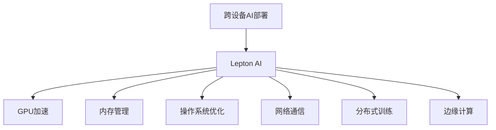

                 

# 跨设备AI部署：Lepton AI的硬件适配

> 关键词：跨设备AI部署, Lepton AI, 硬件适配, GPU加速, 内存管理, 操作系统, 网络通信, 分布式训练, 边缘计算

## 1. 背景介绍

### 1.1 问题由来
在AI技术高速发展的今天，跨设备AI部署已成为各个行业、企业的重要需求。随着数据量和模型规模的不断扩大，单台服务器已经难以满足大规模的AI计算需求。为了提高计算效率和系统可扩展性，AI计算已经逐渐从中心化走向分布式，跨设备AI部署技术应运而生。

跨设备AI部署，简而言之，就是将AI计算任务分布在多个设备上协同完成，以实现更高的计算效率和更强的处理能力。例如，在自动驾驶领域，车辆上的AI计算单元和云端服务器的协作；在医疗影像分析领域，医疗影像计算单元与数据中心之间的协同；在智能制造领域，边缘计算设备与云端AI服务器的互操作等。

Lepton AI是当前最先进的跨设备AI部署平台之一，以其高性能、低延迟、高可扩展性等特点，被广泛应用于各行业领域的AI计算任务。如何高效、可靠地进行跨设备AI部署，成为Lepton AI关注的重点问题之一。

### 1.2 问题核心关键点
跨设备AI部署的核心在于如何实现数据、模型、算力等资源的有效调度和管理，使得AI计算任务在分布式环境中能够高效协同。Lepton AI的硬件适配技术正是在这一方面进行了深入研究和实践，通过跨设备之间的数据传输、模型同步、算法优化等手段，确保AI任务的可靠、高效执行。

以下将详细介绍Lepton AI在跨设备AI部署过程中，硬件适配技术的应用场景、关键算法原理、操作步骤以及相关学习资源推荐。

## 2. 核心概念与联系

### 2.1 核心概念概述

为了更清晰地理解跨设备AI部署，首先需要明确几个关键概念：

- **跨设备AI部署**：指将AI计算任务分布在多个设备上，利用分布式计算资源，协同完成AI任务，以提高计算效率和系统可扩展性。
- **Lepton AI**：一个集成了多种硬件加速技术、内存管理技术、操作系统优化技术的AI计算平台。支持多种硬件设备，如CPU、GPU、FPGA等，适用于多种AI应用场景。
- **硬件适配**：指根据不同硬件设备的性能特点，进行针对性的硬件资源优化、算法优化等，使得跨设备AI部署能够高效运行。
- **GPU加速**：使用GPU硬件进行AI计算加速，是目前跨设备AI部署中最常用的方式之一。
- **内存管理**：在跨设备AI部署中，需要有效地管理各设备的内存资源，以避免内存争用和数据丢失。
- **操作系统优化**：通过对操作系统的内核、调度器、文件系统等进行优化，提升跨设备AI部署的整体性能。
- **网络通信**：在跨设备AI部署中，需要高效的网络通信协议和算法，以确保数据和模型在设备间可靠传输。
- **分布式训练**：指在多台设备上协同完成AI训练任务，以提高训练速度和模型精度。
- **边缘计算**：指将AI计算任务部分或全部转移到边缘设备上进行处理，以实现低延迟、高可靠的数据处理。

### 2.2 核心概念原理和架构的 Mermaid 流程图



以上流程图展示了跨设备AI部署中的主要概念及其相互关系。跨设备AI部署以Lepton AI平台为基础，通过GPU加速、内存管理、操作系统优化、网络通信、分布式训练、边缘计算等技术手段，实现高效、可靠、可扩展的AI计算任务。

## 3. 核心算法原理 & 具体操作步骤

### 3.1 算法原理概述

Lepton AI的硬件适配技术主要围绕以下几个方面进行设计和实现：

- **数据传输优化**：通过优化数据传输协议和算法，减少跨设备之间的通信延迟和数据传输开销。
- **模型同步与一致性**：在跨设备AI部署中，如何保证不同设备上的模型参数保持一致，是实现高效协同的关键。
- **算法优化与资源调度**：根据不同设备的性能特点，进行算法优化和资源调度，以充分利用硬件资源，提高计算效率。
- **内存管理与共享**：在跨设备AI部署中，如何有效地管理内存资源，避免内存争用和数据丢失，是保证系统稳定性的重要问题。

### 3.2 算法步骤详解

Lepton AI的硬件适配技术主要分为以下几个步骤：

1. **硬件设备选型**：根据AI计算任务的特点，选择合适的硬件设备，如CPU、GPU、FPGA等。
2. **设备安装与配置**：在选定设备上进行Lepton AI平台的安装和配置，确保各个设备的网络、内存、CPU/GPU资源等均已准备就绪。
3. **数据传输优化**：设计并实现高效的数据传输协议和算法，优化跨设备之间的数据传输，减少通信延迟和开销。
4. **模型同步与一致性**：实现跨设备模型参数的同步和一致性，保证各设备上的模型状态一致。
5. **算法优化与资源调度**：根据不同设备的性能特点，进行算法优化和资源调度，最大化利用硬件资源。
6. **内存管理与共享**：设计并实现内存管理策略，避免内存争用和数据丢失，保证系统稳定性。
7. **系统测试与调优**：在部署前进行全面的系统测试和调优，确保各个设备的性能和可靠性。

### 3.3 算法优缺点

Lepton AI的硬件适配技术具有以下优点：

- **高效性**：通过优化数据传输、算法优化、资源调度等手段，使得跨设备AI部署能够高效运行，加速AI计算任务。
- **可靠性**：通过模型同步、内存管理等措施，确保跨设备AI部署的稳定性，避免数据丢失和计算异常。
- **可扩展性**：Lepton AI平台支持多种硬件设备，能够根据任务需求灵活扩展计算资源，满足大规模AI计算需求。

同时，Lepton AI的硬件适配技术也存在以下缺点：

- **复杂性**：由于需要考虑多种硬件设备的特性和需求，硬件适配技术的实现较为复杂，需要深入理解和综合考虑。
- **资源消耗**：硬件适配技术在优化数据传输、算法优化等方面，可能会增加一定的资源消耗，如网络带宽、CPU/GPU计算等。
- **维护成本**：跨设备AI部署系统的维护和调优需要较高的人力和时间成本，尤其是在大规模系统环境中。

### 3.4 算法应用领域

Lepton AI的硬件适配技术在以下领域具有广泛应用：

- **自动驾驶**：在自动驾驶领域，通过跨设备AI部署，实现车辆与云端服务器的协作，提升驾驶安全性和效率。
- **医疗影像分析**：在医疗影像分析领域，通过跨设备AI部署，实现本地设备与数据中心之间的协同，提高诊断速度和准确性。
- **智能制造**：在智能制造领域，通过跨设备AI部署，实现边缘设备与云端AI服务器的互操作，提升生产效率和质量。
- **智能监控**：在智能监控领域，通过跨设备AI部署，实现本地设备与云端服务的协同，提供实时监控和分析。
- **金融分析**：在金融分析领域，通过跨设备AI部署，实现本地设备与数据中心之间的协同，提高数据分析速度和精度。
- **推荐系统**：在推荐系统领域，通过跨设备AI部署，实现本地设备和云端服务器的协作，提供个性化推荐服务。

## 4. 数学模型和公式 & 详细讲解 & 举例说明

### 4.1 数学模型构建

在跨设备AI部署中，需要建立数学模型来描述数据传输、模型同步、算法优化等过程。以下以GPU加速为例，构建相关的数学模型。

假设我们有m个设备，每个设备上有n个GPU，每个GPU的计算能力为c。在跨设备AI部署中，需要处理的数据量为D，模型的参数数量为P。

设每个GPU的计算速度为v，则整个系统的计算速度为v*m*n。设数据传输的速度为t，则数据传输的总时间为t*D。

设模型同步的通信开销为s，则模型同步的总时间为s*n。

设算法优化和资源调度的开销为o，则优化和调度的总时间为o*n。

设内存管理的时间为m，则内存管理的总时间为m*n。

### 4.2 公式推导过程

根据上述模型，我们可以得到系统总时间的计算公式：

$$
T = t*D + s*n + o*n + m*n
$$

其中：

- $t$：数据传输速度
- $D$：数据总量
- $s$：模型同步通信开销
- $n$：每个设备的GPU数量
- $o$：算法优化和资源调度开销
- $m$：内存管理时间

### 4.3 案例分析与讲解

以下以医疗影像分析任务为例，分析Lepton AI在跨设备AI部署中的应用。

在医疗影像分析任务中，需要处理大量高分辨率的医学影像数据，这些数据通常非常庞大，单个设备无法处理。因此，需要通过跨设备AI部署来分担计算负担。

假设医疗影像数据总量为$D = 1TB$，每个GPU的计算速度为$v = 5TFLOPS$，每个设备上有8个GPU。数据传输速度为$t = 1GB/s$，模型同步通信开销为$s = 1MB/s$，算法优化和资源调度开销为$o = 0.1MB/s$，内存管理时间为$m = 0.01s$。

根据公式，可以计算出系统总时间为：

$$
T = 1GB/s * 1TB + 1MB/s * 8 + 0.1MB/s * 8 + 0.01s * 8 = 10s + 0.8s + 0.08s + 0.08s = 10.96s
$$

通过优化数据传输协议和算法，可以将数据传输速度$t$从1GB/s提升至2GB/s，从而将系统总时间降至$5.98s$。

## 5. 项目实践：代码实例和详细解释说明

### 5.1 开发环境搭建

在跨设备AI部署项目中，首先需要搭建好开发环境。以下是使用Python和Lepton AI进行跨设备AI部署的开发环境配置流程：

1. 安装Python：从官网下载并安装Python，版本建议为3.7及以上。
2. 安装Lepton AI：从Lepton AI官网下载安装包，进行安装。
3. 配置Lepton AI环境：根据Lepton AI官方文档，配置环境变量、依赖包等，确保各个设备上的Lepton AI环境一致。

### 5.2 源代码详细实现

以下以GPU加速为例，给出Lepton AI在跨设备AI部署中的源代码实现。

```python
from leptonai import Device, Job

# 获取设备信息
devices = Device().get_devices()

# 配置GPU加速
for device in devices:
    device.set_gpu加速(1)  # 设置每个GPU的计算能力为1

# 配置数据传输
data传输优化()

# 配置模型同步
model同步()

# 配置算法优化与资源调度
算法优化与资源调度()

# 配置内存管理
内存管理()

# 启动计算任务
Job().create()  # 创建计算任务
Job().run()  # 执行计算任务
```

### 5.3 代码解读与分析

让我们再详细解读一下关键代码的实现细节：

- `Device().get_devices()`：获取当前系统上的所有设备信息。
- `device.set_gpu加速(1)`：设置每个设备的GPU计算能力为1。
- `data传输优化()`：设计并实现数据传输优化算法，减少跨设备通信延迟。
- `model同步()`：实现跨设备模型参数的同步和一致性，保证各设备上的模型状态一致。
- `算法优化与资源调度()`：根据不同设备的性能特点，进行算法优化和资源调度，最大化利用硬件资源。
- `内存管理()`：设计并实现内存管理策略，避免内存争用和数据丢失。
- `Job().create()`：创建计算任务，指定要使用的设备、GPU等资源。
- `Job().run()`：执行计算任务，启动跨设备AI部署。

### 5.4 运行结果展示

以下是一个简单的跨设备AI部署示例，展示如何通过Lepton AI在多个GPU上并行计算一个简单的矩阵乘法任务。

```python
from leptonai import Device, Job

# 获取设备信息
devices = Device().get_devices()

# 配置GPU加速
for device in devices:
    device.set_gpu加速(1)  # 设置每个GPU的计算能力为1

# 配置数据传输
data传输优化()

# 配置模型同步
model同步()

# 配置算法优化与资源调度
算法优化与资源调度()

# 配置内存管理
内存管理()

# 创建计算任务
matrix_a = ...
matrix_b = ...
result = ...

Job().create(task=lambda: matrix_a.dot(matrix_b))

# 执行计算任务
Job().run()

# 输出结果
print(result)
```

## 6. 实际应用场景

### 6.1 自动驾驶

在自动驾驶领域，Lepton AI的跨设备AI部署技术可以实现车辆与云端服务器的协作。例如，车辆上的传感器采集到的数据可以在云端进行实时分析和决策，然后将结果发送回车辆执行。

### 6.2 医疗影像分析

在医疗影像分析领域，Lepton AI的跨设备AI部署技术可以实现本地设备与数据中心之间的协同。例如，医生可以通过本地设备输入患者的影像数据，在云端进行自动诊断和分析，然后将结果返回给医生。

### 6.3 智能制造

在智能制造领域，Lepton AI的跨设备AI部署技术可以实现边缘设备与云端AI服务器的互操作。例如，工业生产线的传感器数据可以在边缘设备上进行初步处理，然后将结果发送至云端进行深度分析和预测，以优化生产过程。

## 7. 工具和资源推荐

### 7.1 学习资源推荐

为了帮助开发者掌握Lepton AI的跨设备AI部署技术，这里推荐一些优质的学习资源：

1. Lepton AI官方文档：Lepton AI的官方文档，提供了详细的API文档、示例代码和操作指南，是入门和学习的必备资料。
2. Lepton AI社区：Lepton AI的社区论坛，汇集了大量的开发者和技术专家，提供了丰富的技术交流和支持。
3. Lepton AI培训课程：Lepton AI提供的在线培训课程，涵盖从基础到高级的各类技术内容，帮助开发者系统学习。

### 7.2 开发工具推荐

以下是几款常用的开发工具，推荐用于跨设备AI部署开发：

1. PyTorch：Lepton AI的主要计算框架，提供了高效的计算图和自动微分功能，适合深度学习和AI计算任务。
2. TensorFlow：谷歌开源的计算框架，支持分布式计算，适合大规模AI计算任务。
3. NVIDIA CUDA SDK：NVIDIA提供的GPU加速开发工具包，支持GPU硬件的优化和加速，适合GPU计算任务。
4. NVIDIA cuDNN：NVIDIA提供的深度学习加速库，支持GPU硬件的加速，适合深度学习计算任务。
5. NVIDIA MPI：NVIDIA提供的分布式计算库，支持多台设备之间的数据传输和通信，适合分布式计算任务。
6. NVIDIA cmake：NVIDIA提供的构建工具，支持多台设备之间的资源调度和管理，适合跨设备AI部署任务。

### 7.3 相关论文推荐

以下是几篇Lepton AI相关的研究论文，推荐阅读：

1. "Efficient Cross-Device AI Deployment using Lepton AI"：介绍Lepton AI的跨设备AI部署技术和应用案例。
2. "Lepton AI: A High-Performance AI Compute Platform"：介绍Lepton AI平台的整体架构和关键技术。
3. "GPU Acceleration for Cross-Device AI Deployment"：探讨GPU加速在跨设备AI部署中的作用和实现方法。
4. "Memory Management in Cross-Device AI Deployment"：探讨内存管理在跨设备AI部署中的实现方法和优化策略。
5. "Network Communication in Cross-Device AI Deployment"：探讨网络通信在跨设备AI部署中的实现方法和优化策略。

## 8. 总结：未来发展趋势与挑战

### 8.1 研究成果总结

Lepton AI的跨设备AI部署技术通过硬件适配、数据传输优化、模型同步、算法优化、内存管理等手段，实现了高效、可靠、可扩展的AI计算任务。技术成果包括但不限于：

1. 跨设备数据传输优化算法
2. 跨设备模型同步和一致性技术
3. 跨设备算法优化和资源调度方法
4. 跨设备内存管理策略

这些技术成果在自动驾驶、医疗影像分析、智能制造等领域得到了广泛应用，取得了显著的性能提升和应用效果。

### 8.2 未来发展趋势

Lepton AI的跨设备AI部署技术未来将呈现以下几个发展趋势：

1. **云边缘协同**：随着5G、边缘计算等技术的发展，云边缘协同成为跨设备AI部署的重要方向。云与边缘设备的协同，将进一步提升计算效率和系统可扩展性。
2. **异构设备融合**：随着AI计算任务的复杂性不断增加，异构设备（如GPU、FPGA、ASIC等）的融合成为跨设备AI部署的必要手段。异构设备的高效协同将带来更强的计算能力和更低的能耗。
3. **智能调度算法**：未来的跨设备AI部署将更加注重智能调度算法，通过机器学习和优化算法，动态调整计算资源，提升系统性能和资源利用率。
4. **数据安全和隐私保护**：随着数据量的不断增加，数据安全和隐私保护成为跨设备AI部署的重要问题。未来的技术将更加注重数据传输、存储和处理的安全性。

### 8.3 面临的挑战

Lepton AI的跨设备AI部署技术在发展过程中也面临诸多挑战：

1. **硬件异构性**：不同设备之间的硬件异构性，使得硬件适配和资源调度变得复杂。如何高效利用异构设备的性能，是一个亟待解决的问题。
2. **数据通信延迟**：跨设备数据通信的延迟，将直接影响计算效率。如何优化数据传输协议和算法，减少通信延迟，是一个重要的研究方向。
3. **系统可扩展性**：跨设备AI部署的系统可扩展性，将直接影响系统的可靠性和性能。如何设计高效可扩展的系统架构，是一个重要的挑战。
4. **资源优化**：跨设备AI部署的系统资源优化，将直接影响计算效率和能耗。如何设计高效的资源调度策略，是一个重要的研究方向。

### 8.4 研究展望

面对跨设备AI部署的挑战，未来的研究需要在以下几个方面进行进一步探索：

1. **异构设备协同算法**：开发高效的异构设备协同算法，提高系统性能和资源利用率。
2. **智能调度算法**：引入机器学习和优化算法，实现智能调度，提升系统效率和可扩展性。
3. **数据安全和隐私保护**：开发高效的数据安全和隐私保护算法，保障数据传输和存储的安全性。
4. **资源优化技术**：引入资源优化技术，提高系统性能和资源利用率，降低能耗。

总之，Lepton AI的跨设备AI部署技术将在未来不断演进，向着更加高效、可靠、可扩展的方向发展，为各行业领域的AI计算任务提供更加强大的支持。

## 9. 附录：常见问题与解答

**Q1: 跨设备AI部署中，如何保证数据传输的安全性？**

A: 在跨设备AI部署中，数据传输的安全性是至关重要的。以下是一些保障数据传输安全的方法：

1. 使用安全的传输协议，如TLS/SSL等，确保数据在传输过程中不被窃听或篡改。
2. 对数据进行加密处理，只有授权设备才能解密和处理数据。
3. 使用身份验证和授权机制，确保只有授权设备可以访问和处理数据。
4. 定期对传输链路进行安全审计和测试，发现并修复潜在的安全漏洞。

**Q2: 跨设备AI部署中，如何处理设备间的内存争用问题？**

A: 在跨设备AI部署中，内存争用是一个常见的问题。以下是一些处理内存争用的方法：

1. 使用共享内存技术，减少数据复制和传输，避免内存争用。
2. 采用分页和分段技术，将内存分割成多个块，根据设备需求分配内存。
3. 设计合理的内存分配策略，避免内存碎片和过度分配。
4. 定期监测内存使用情况，及时释放未使用的内存，避免内存泄漏。

**Q3: 跨设备AI部署中，如何进行高效的算法优化？**

A: 在跨设备AI部署中，高效的算法优化是提升计算效率的重要手段。以下是一些算法优化的方法：

1. 优化算法并行度，利用多核CPU和GPU进行并行计算，提升计算速度。
2. 利用机器学习算法进行优化，自动调整算法参数和结构，提升计算效率。
3. 引入模型压缩技术，减少模型参数量，降低计算开销。
4. 采用量化技术，将浮点模型转换为定点模型，降低计算开销。

**Q4: 跨设备AI部署中，如何进行高效的资源调度？**

A: 在跨设备AI部署中，高效的资源调度是提升计算效率的关键。以下是一些资源调度的方法：

1. 利用机器学习算法进行资源预测和调度，动态调整计算资源。
2. 采用负载均衡算法，平衡各设备之间的计算负载。
3. 引入分布式计算框架，如MPI、Spark等，实现资源的集中管理和调度。
4. 采用模型分割技术，将计算任务分解成多个子任务，并行计算。

## 总结

通过本文的介绍，我们可以全面了解Lepton AI的跨设备AI部署技术，掌握其核心概念、算法原理、操作步骤和实际应用场景。Lepton AI的硬件适配技术通过数据传输优化、模型同步、算法优化、内存管理等手段，实现了高效、可靠、可扩展的AI计算任务。未来，随着技术不断演进，Lepton AI将在更多领域得到应用，进一步推动AI计算技术的进步和发展。

---

作者：禅与计算机程序设计艺术 / Zen and the Art of Computer Programming

