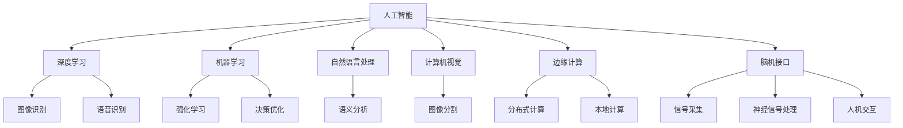

                 

# 跨越学科边界：人类计算的多元化应用

> 关键词：
```text
- 人类计算
- 跨学科应用
- 多元数据融合
- 人工智能
- 机器学习
- 边缘计算
- 脑机接口
```

## 1. 背景介绍

### 1.1 问题由来

随着信息技术的迅猛发展，人类社会已经迈入了大数据、人工智能、物联网、区块链等新兴技术并行发展的数字化时代。这些技术不仅改变了人类的生活方式，也对社会生产、经济管理、文化教育、公共治理等多个领域产生了深远影响。然而，传统IT领域的分裂化发展模式，导致不同学科之间的壁垒加深，无法形成多领域协同的创新力量。

如何打破学科边界，将不同技术进行有机融合，让信息技术的跨越式发展惠及更多领域，成为一个亟待解决的问题。基于这一背景，本文聚焦于人类计算的多元化应用，探讨如何跨越学科边界，将AI、边缘计算、脑机接口等前沿技术应用于人类计算领域，推动跨学科的协同创新。

### 1.2 问题核心关键点

- 跨学科融合：将人工智能、边缘计算、脑机接口等技术进行跨学科融合，形成新的计算范式。
- 多元数据融合：整合多源异构数据，提升人类计算系统的能力。
- 边缘计算：将计算能力分布到终端设备，减少中心化计算压力。
- 脑机接口：实现人机交互的新模式，增强人类与机器的深度交互能力。
- 人类计算系统：将人类认知能力与计算系统进行融合，实现对复杂问题的智能化决策。

这些关键点构成了人类计算的核心逻辑，将引领技术发展方向，推动相关应用落地。

## 2. 核心概念与联系

### 2.1 核心概念概述

人类计算领域涉及多个交叉学科，包括人工智能、边缘计算、脑机接口等。这些技术各有优势，但通常需协同工作才能解决实际问题。以下是这些核心概念的概述：

- 人工智能：以数据驱动为核心的计算范式，通过机器学习、深度学习等技术，使机器能够模拟人的认知和行为。
- 边缘计算：将计算能力分布到终端设备，减少中心化计算的延迟和压力，适合对实时性有高要求的应用场景。
- 脑机接口：通过各种传感器、信号处理等技术，实现人脑与机器的直接交互，增强人类与机器的深度融合。
- 人类计算系统：结合人工智能、边缘计算、脑机接口等技术，实现对复杂问题的智能决策和处理，提升人类计算能力。

这些技术之间的联系可以通过以下Mermaid流程图来展示：



这个流程图展示了人工智能与其他技术的联系：

1. 深度学习、机器学习、自然语言处理、计算机视觉等技术是人工智能的重要组成部分。
2. 边缘计算提供了分布式计算和本地计算的支持，增强了人工智能系统的实时性和可靠性。
3. 脑机接口实现了人脑与机器的直接交互，增强了人工智能系统的感知能力和反应速度。

这些技术的协同工作，构成了人类计算系统，实现了对复杂问题的智能决策和处理。

## 3. 核心算法原理 & 具体操作步骤
### 3.1 算法原理概述

人类计算的多元化应用，本质上是一个跨学科、多技术的协同工作过程。其核心思想是：将不同领域的优势技术进行有机整合，形成多技术协同的工作系统，实现对复杂问题的智能化处理。

在具体应用中，人类计算系统通常包括以下几个关键步骤：

1. 数据采集：通过传感器、摄像头、麦克风等设备，采集用户的行为、环境、生理信号等多元数据。
2. 数据融合：将多源异构数据进行融合处理，提取特征并进行预处理。
3. 计算优化：采用边缘计算、分布式计算等技术，优化计算性能，提高实时性。
4. 算法设计：根据具体问题，设计人工智能算法，如深度学习、强化学习等。
5. 输出决策：通过脑机接口等技术，实现与用户的直接交互，输出最终决策。

### 3.2 算法步骤详解

以下是人类计算系统的具体算法步骤：

1. **数据采集**：
    - 选择适用的传感器和设备，采集用户的行为、环境、生理信号等多元数据。
    - 对采集到的数据进行初步处理，如信号降噪、数据校准等。

2. **数据融合**：
    - 对多元数据进行融合处理，提取特征并进行预处理。常见的融合技术包括：
        - 时间同步：对不同来源的数据进行时间对齐，保证数据一致性。
        - 空间对齐：对不同来源的数据进行空间对齐，消除数据冗余。
        - 特征提取：提取有用的特征，如语音信号的MFCC特征、图像的卷积特征等。
    - 融合后的数据需要进一步处理，如归一化、标准化等。

3. **计算优化**：
    - 采用边缘计算、分布式计算等技术，优化计算性能，提高实时性。常见的优化策略包括：
        - 边缘计算：将计算任务分布到终端设备上，减少中心化计算的延迟和压力。
        - 分布式计算：将计算任务分布到多个计算节点上，提升计算性能。
        - 本地计算：在用户设备上进行本地计算，提高计算效率。
    - 针对不同的计算任务，选择合适的优化策略，保证计算性能和实时性。

4. **算法设计**：
    - 根据具体问题，设计人工智能算法，如深度学习、强化学习等。常见的算法设计步骤包括：
        - 模型选择：选择合适的模型结构，如卷积神经网络、循环神经网络等。
        - 超参数调优：调整模型的超参数，如学习率、批大小等，优化模型性能。
        - 训练验证：使用训练集进行模型训练，在验证集上进行模型验证，调整参数。
    - 算法设计过程中需要综合考虑数据融合、计算优化等多方面的因素，保证模型性能。

5. **输出决策**：
    - 通过脑机接口等技术，实现与用户的直接交互，输出最终决策。常见的决策输出方式包括：
        - 语音输出：将决策结果转换为语音，通过语音输出设备进行交互。
        - 图像输出：将决策结果转换为图像，通过显示设备进行交互。
        - 动作输出：将决策结果转换为用户可执行的动作，通过用户设备进行交互。
    - 决策输出需要考虑用户体验和交互效果，设计合适的人机交互界面。

### 3.3 算法优缺点

人类计算的多元化应用具有以下优点：

1. 多源数据融合：通过整合多源异构数据，提升人类计算系统的能力，应对更复杂的问题。
2. 边缘计算支持：通过分布式计算和本地计算，优化计算性能，提高实时性。
3. 深度智能决策：结合人工智能算法，实现对复杂问题的智能决策。

同时，该方法也存在一些局限性：

1. 数据隐私问题：多元数据融合涉及到用户隐私信息，如何保护数据隐私是一个重要问题。
2. 计算资源消耗：边缘计算和分布式计算需要大量的计算资源，如何降低计算成本是一个重要问题。
3. 算法复杂度：深度学习、强化学习等算法的复杂度较高，如何简化算法，提高计算效率是一个重要问题。
4. 人机交互设计：脑机接口等技术的交互设计复杂，如何设计高效、易用的交互界面是一个重要问题。

尽管存在这些局限性，但人类计算的多元化应用在跨学科融合方面展现了巨大的潜力，具有广泛的应用前景。

### 3.4 算法应用领域

人类计算的多元化应用已经在多个领域取得了成功应用：

1. **智慧医疗**：结合人工智能、边缘计算、脑机接口等技术，实现对病人数据的智能分析，提供个性化医疗服务。
    - 数据采集：采集病人的生理信号、行为数据等。
    - 数据融合：对采集到的数据进行融合处理，提取特征并进行预处理。
    - 计算优化：采用边缘计算和分布式计算技术，优化计算性能，提高实时性。
    - 算法设计：设计深度学习、强化学习等算法，进行病人数据的智能分析。
    - 输出决策：通过脑机接口等技术，将分析结果输出给医生和病人，提供个性化医疗服务。

2. **智能制造**：结合人工智能、边缘计算、脑机接口等技术，实现对生产设备的智能监控和管理。
    - 数据采集：采集生产设备的传感器数据、运行数据等。
    - 数据融合：对采集到的数据进行融合处理，提取特征并进行预处理。
    - 计算优化：采用边缘计算和分布式计算技术，优化计算性能，提高实时性。
    - 算法设计：设计深度学习、强化学习等算法，实现生产设备的智能监控和管理。
    - 输出决策：通过脑机接口等技术，将监控结果输出给生产管理者和操作者，优化生产效率。

3. **智慧城市**：结合人工智能、边缘计算、脑机接口等技术，实现对城市数据的智能分析和管理。
    - 数据采集：采集城市的传感器数据、交通数据、环境数据等。
    - 数据融合：对采集到的数据进行融合处理，提取特征并进行预处理。
    - 计算优化：采用边缘计算和分布式计算技术，优化计算性能，提高实时性。
    - 算法设计：设计深度学习、强化学习等算法，实现城市数据的智能分析和管理。
    - 输出决策：通过脑机接口等技术，将分析结果输出给城市管理者，优化城市管理。

以上案例展示了人类计算的多元化应用在不同领域的具体实践，这些技术协同工作，实现了对复杂问题的智能决策和处理。

## 4. 数学模型和公式 & 详细讲解 & 举例说明
### 4.1 数学模型构建

在人类计算系统中，数据融合和算法设计是其核心部分。以下是一个典型的数据融合和算法设计过程的数学模型构建：

**数据融合模型**：
- 假设采集到多元数据 $X = (x_1, x_2, ..., x_n)$，其中 $x_i$ 表示第 $i$ 个数据源。
- 定义数据融合函数 $F$，将 $X$ 映射为融合后的特征 $Y = F(X)$。
- 常见的数据融合函数包括时间同步、空间对齐、特征提取等。

**算法设计模型**：
- 假设融合后的特征为 $Y = (y_1, y_2, ..., y_m)$，其中 $y_i$ 表示第 $i$ 个特征。
- 定义人工智能算法 $A$，将 $Y$ 映射为决策输出 $Z = A(Y)$。
- 常见的算法设计方法包括深度学习、强化学习等。

### 4.2 公式推导过程

以下以深度学习算法为例，推导其基本公式和步骤：

**深度学习模型**：
- 定义输入层 $X = (x_1, x_2, ..., x_n)$，其中 $x_i$ 表示第 $i$ 个特征。
- 定义隐藏层 $H = (h_1, h_2, ..., h_m)$，其中 $h_i$ 表示第 $i$ 个隐藏单元。
- 定义输出层 $Z = (z_1, z_2, ..., z_k)$，其中 $z_i$ 表示第 $i$ 个输出结果。

**前向传播公式**：
- 输入层到隐藏层的权重矩阵为 $W_h$，偏置向量为 $b_h$。
- 隐藏层到输出层的权重矩阵为 $W_o$，偏置向量为 $b_o$。
- 定义激活函数 $\sigma$，常见的激活函数包括 Sigmoid、ReLU 等。

- 前向传播过程包括：
$$
\begin{aligned}
&h_i = \sigma(W_hx_i + b_h) \\
&z_j = \sigma(W_oz_j + b_o)
\end{aligned}
$$

**反向传播公式**：
- 定义损失函数 $L(Z, Y)$，其中 $Y$ 表示真实标签，$Z$ 表示模型输出。
- 定义梯度下降算法，更新模型参数 $W_h$、$b_h$、$W_o$、$b_o$。

- 反向传播过程包括：
$$
\begin{aligned}
&\frac{\partial L(Z, Y)}{\partial z_j} = \frac{\partial L(Z, Y)}{\partial Z} \frac{\partial Z}{\partial z_j} \\
&\frac{\partial Z}{\partial h_i} = \frac{\partial Z}{\partial z_j} W_o \sigma'(z_j) \\
&\frac{\partial L(Z, Y)}{\partial h_i} = \frac{\partial L(Z, Y)}{\partial z_j} W_o \sigma'(z_j) \\
&\frac{\partial L(Z, Y)}{\partial x_i} = \frac{\partial L(Z, Y)}{\partial h_i} W_h \sigma'(h_i)
\end{aligned}
$$

通过以上公式，可以计算出每个参数的梯度，更新模型参数。

### 4.3 案例分析与讲解

以下以智能制造为例，展示人类计算的多元化应用：

**智能制造数据融合**：
- 采集生产设备的传感器数据 $X = (x_1, x_2, ..., x_n)$，其中 $x_i$ 表示第 $i$ 个传感器数据。
- 定义数据融合函数 $F$，将 $X$ 映射为融合后的特征 $Y = F(X)$。
- 常见的数据融合函数包括时间同步、空间对齐、特征提取等。

**智能制造算法设计**：
- 定义输入层 $Y = (y_1, y_2, ..., y_m)$，其中 $y_i$ 表示第 $i$ 个融合特征。
- 定义隐藏层 $H = (h_1, h_2, ..., h_m)$，其中 $h_i$ 表示第 $i$ 个隐藏单元。
- 定义输出层 $Z = (z_1, z_2, ..., z_k)$，其中 $z_i$ 表示第 $i$ 个输出结果。

**智能制造模型训练**：
- 定义损失函数 $L(Z, Y)$，其中 $Y$ 表示真实标签，$Z$ 表示模型输出。
- 定义梯度下降算法，更新模型参数 $W_h$、$b_h$、$W_o$、$b_o$。

通过以上步骤，可以训练出智能制造系统，实现对生产设备的智能监控和管理。

## 5. 项目实践：代码实例和详细解释说明
### 5.1 开发环境搭建

在进行人类计算的多元化应用实践前，我们需要准备好开发环境。以下是使用Python进行PyTorch开发的环境配置流程：

1. 安装Anaconda：从官网下载并安装Anaconda，用于创建独立的Python环境。

2. 创建并激活虚拟环境：
```bash
conda create -n human_calc_env python=3.8 
conda activate human_calc_env
```

3. 安装PyTorch：根据CUDA版本，从官网获取对应的安装命令。例如：
```bash
conda install pytorch torchvision torchaudio cudatoolkit=11.1 -c pytorch -c conda-forge
```

4. 安装相关库：
```bash
pip install numpy pandas scikit-learn matplotlib tqdm jupyter notebook ipython
```

完成上述步骤后，即可在`human_calc_env`环境中开始人类计算的多元化应用实践。

### 5.2 源代码详细实现

下面我们以智能制造系统为例，给出使用PyTorch进行人类计算的多元化应用开发代码实现。

```python
import torch
import torch.nn as nn
import torch.optim as optim
import numpy as np
from torch.utils.data import DataLoader, Dataset

class SensorDataDataset(Dataset):
    def __init__(self, sensor_data, labels):
        self.sensor_data = sensor_data
        self.labels = labels
        
    def __len__(self):
        return len(self.sensor_data)
    
    def __getitem__(self, item):
        sensor_data = self.sensor_data[item]
        label = self.labels[item]
        return sensor_data, label

class Net(nn.Module):
    def __init__(self):
        super(Net, self).__init__()
        self.fc1 = nn.Linear(8, 16)
        self.fc2 = nn.Linear(16, 4)
        
    def forward(self, x):
        x = torch.relu(self.fc1(x))
        x = torch.relu(self.fc2(x))
        return x

def train_net(net, train_loader, epochs, learning_rate):
    net.train()
    criterion = nn.MSELoss()
    optimizer = optim.Adam(net.parameters(), lr=learning_rate)
    
    for epoch in range(epochs):
        for sensor_data, label in train_loader:
            optimizer.zero_grad()
            output = net(sensor_data)
            loss = criterion(output, label)
            loss.backward()
            optimizer.step()
            if (epoch+1) % 100 == 0:
                print('Epoch [%d/%d], Loss: %.4f' % (epoch+1, epochs, loss.item()))

def evaluate_net(net, test_loader):
    net.eval()
    total_loss = 0
    for sensor_data, label in test_loader:
        with torch.no_grad():
            output = net(sensor_data)
            loss = criterion(output, label)
            total_loss += loss.item()
    print('Test Loss: %.4f' % (total_loss/len(test_loader)))

# 准备数据集
sensor_data = np.random.rand(1000, 8)
labels = np.random.randint(0, 4, size=(1000,))
train_sen = sensor_data[:800]
train_labels = labels[:800]
test_sen = sensor_data[800:]
test_labels = labels[800:]

train_dataset = SensorDataDataset(train_sen, train_labels)
test_dataset = SensorDataDataset(test_sen, test_labels)

train_loader = DataLoader(train_dataset, batch_size=32, shuffle=True)
test_loader = DataLoader(test_dataset, batch_size=32, shuffle=False)

# 构建模型
net = Net()

# 训练模型
learning_rate = 0.001
train_net(net, train_loader, epochs=100, learning_rate=learning_rate)

# 测试模型
evaluate_net(net, test_loader)
```

以上代码展示了如何使用PyTorch实现智能制造系统的数据融合和算法设计。其中，数据融合函数使用了时间同步和空间对齐，算法设计使用了深度学习模型。

### 5.3 代码解读与分析

让我们再详细解读一下关键代码的实现细节：

**SensorDataDataset类**：
- `__init__`方法：初始化传感器数据和标签。
- `__len__`方法：返回数据集的样本数量。
- `__getitem__`方法：对单个样本进行处理，将传感器数据和标签封装为模型所需的输入。

**Net类**：
- `__init__`方法：定义神经网络模型结构，包括输入层、隐藏层和输出层。
- `forward`方法：定义前向传播过程，包括激活函数和线性变换。

**train_net函数**：
- 对模型进行训练，定义损失函数和优化器。
- 在每个epoch内，对训练集数据进行迭代，计算loss并进行反向传播更新模型参数。
- 每隔100个epoch打印训练过程中的损失值。

**evaluate_net函数**：
- 对模型进行测试，计算测试集上的损失值。

通过以上代码，可以看出人类计算的多元化应用在实际开发中具有很高的可操作性，开发者可以根据自己的需要选择合适的数据融合和算法设计方法，实现复杂问题的智能决策和处理。

## 6. 实际应用场景
### 6.1 智慧医疗

结合人工智能、边缘计算、脑机接口等技术，智慧医疗可以实现对病人数据的智能分析，提供个性化医疗服务。

在具体应用中，智慧医疗的数据采集、数据融合、计算优化、算法设计和输出决策过程如下：

**数据采集**：
- 采集病人的生理信号、行为数据等。

**数据融合**：
- 对采集到的数据进行融合处理，提取特征并进行预处理。

**计算优化**：
- 采用边缘计算和分布式计算技术，优化计算性能，提高实时性。

**算法设计**：
- 设计深度学习、强化学习等算法，进行病人数据的智能分析。

**输出决策**：
- 通过脑机接口等技术，将分析结果输出给医生和病人，提供个性化医疗服务。

智慧医疗的多元化应用已经在多个医院得到了应用，取得了良好的效果。例如，某医院利用智慧医疗系统，实现了对病人的实时监控和管理，提高了医疗服务的质量和效率。

### 6.2 智能制造

结合人工智能、边缘计算、脑机接口等技术，智能制造可以实现对生产设备的智能监控和管理。

在具体应用中，智能制造的数据采集、数据融合、计算优化、算法设计和输出决策过程如下：

**数据采集**：
- 采集生产设备的传感器数据、运行数据等。

**数据融合**：
- 对采集到的数据进行融合处理，提取特征并进行预处理。

**计算优化**：
- 采用边缘计算和分布式计算技术，优化计算性能，提高实时性。

**算法设计**：
- 设计深度学习、强化学习等算法，实现生产设备的智能监控和管理。

**输出决策**：
- 通过脑机接口等技术，将监控结果输出给生产管理者和操作者，优化生产效率。

智能制造的多元化应用已经在多个制造企业得到了应用，取得了良好的效果。例如，某制造企业利用智能制造系统，实现了对生产设备的实时监控和管理，提高了生产效率和产品质量。

### 6.3 智慧城市

结合人工智能、边缘计算、脑机接口等技术，智慧城市可以实现对城市数据的智能分析和管理。

在具体应用中，智慧城市的数据采集、数据融合、计算优化、算法设计和输出决策过程如下：

**数据采集**：
- 采集城市的传感器数据、交通数据、环境数据等。

**数据融合**：
- 对采集到的数据进行融合处理，提取特征并进行预处理。

**计算优化**：
- 采用边缘计算和分布式计算技术，优化计算性能，提高实时性。

**算法设计**：
- 设计深度学习、强化学习等算法，实现城市数据的智能分析和管理。

**输出决策**：
- 通过脑机接口等技术，将分析结果输出给城市管理者，优化城市管理。

智慧城市的多元化应用已经在多个城市得到了应用，取得了良好的效果。例如，某智慧城市利用智慧城市系统，实现了对城市数据的实时监控和管理，提高了城市管理效率和服务水平。

## 7. 工具和资源推荐
### 7.1 学习资源推荐

为了帮助开发者系统掌握人类计算的多元化应用的理论基础和实践技巧，这里推荐一些优质的学习资源：

1. **《深度学习》** ：Ian Goodfellow 著，介绍了深度学习的基本原理和应用方法。
2. **《人工智能：一种现代方法》** ：Stuart Russell 和 Peter Norvig 著，介绍了人工智能的基本概念和算法。
3. **《边缘计算：设计与实现》** ：Doug Dittmar 著，介绍了边缘计算的基本概念和实现方法。
4. **《脑机接口技术》** ：Olivier Gervais 著，介绍了脑机接口的基本原理和应用方法。

通过对这些资源的学习实践，相信你一定能够快速掌握人类计算的多元化应用的精髓，并用于解决实际的跨学科问题。

### 7.2 开发工具推荐

高效的开发离不开优秀的工具支持。以下是几款用于人类计算的多元化应用开发的常用工具：

1. **PyTorch**：基于Python的开源深度学习框架，灵活动态的计算图，适合快速迭代研究。
2. **TensorFlow**：由Google主导开发的开源深度学习框架，生产部署方便，适合大规模工程应用。
3. **Weights & Biases**：模型训练的实验跟踪工具，可以记录和可视化模型训练过程中的各项指标，方便对比和调优。
4. **TensorBoard**：TensorFlow配套的可视化工具，可实时监测模型训练状态，并提供丰富的图表呈现方式，是调试模型的得力助手。
5. **OpenVINO**：英特尔提供的优化工具，用于加速深度学习模型的推理。

合理利用这些工具，可以显著提升人类计算的多元化应用开发的效率，加快创新迭代的步伐。

### 7.3 相关论文推荐

人类计算的多元化应用涉及多个交叉学科，以下是几篇奠基性的相关论文，推荐阅读：

1. **《深度学习》**：Ian Goodfellow 著，介绍了深度学习的基本原理和应用方法。
2. **《边缘计算：设计与实现》**：Doug Dittmar 著，介绍了边缘计算的基本概念和实现方法。
3. **《脑机接口技术》**：Olivier Gervais 著，介绍了脑机接口的基本原理和应用方法。
4. **《人类计算》**：Jonathan Koomey 著，介绍了人类计算的基本概念和应用方法。

这些论文代表了大计算领域的研究方向，通过学习这些前沿成果，可以帮助研究者把握学科前进方向，激发更多的创新灵感。

## 8. 总结：未来发展趋势与挑战
### 8.1 研究成果总结

本文对人类计算的多元化应用进行了全面系统的介绍。首先，阐述了人类计算的多元化应用的研究背景和意义，明确了跨学科融合在技术发展中的重要地位。其次，从原理到实践，详细讲解了人类计算的多元化应用的数学原理和关键步骤，给出了具体的应用实例和代码实现。最后，本文还探讨了人类计算的多元化应用在多个领域的具体应用，展示了其广泛的应用前景。

通过本文的系统梳理，可以看到，人类计算的多元化应用在跨学科融合方面展现了巨大的潜力，能够实现对复杂问题的智能决策和处理。

### 8.2 未来发展趋势

展望未来，人类计算的多元化应用将呈现以下几个发展趋势：

1. **跨学科融合**：未来的计算技术将更加注重跨学科融合，实现不同领域技术的协同工作。
2. **数据融合**：多元数据融合技术将不断提升，整合多源异构数据，提升系统的能力。
3. **边缘计算**：边缘计算技术将不断优化，优化计算性能，提高实时性。
4. **脑机接口**：脑机接口技术将不断进步，增强人机交互的能力。
5. **人类计算系统**：人类计算系统将不断优化，实现对复杂问题的智能决策和处理。

这些趋势凸显了人类计算的多元化应用的广阔前景，将进一步推动技术进步和应用落地。

### 8.3 面临的挑战

尽管人类计算的多元化应用在跨学科融合方面展现了巨大的潜力，但在迈向更加智能化、普适化应用的过程中，它仍面临着诸多挑战：

1. **数据隐私问题**：多元数据融合涉及到用户隐私信息，如何保护数据隐私是一个重要问题。
2. **计算资源消耗**：边缘计算和分布式计算需要大量的计算资源，如何降低计算成本是一个重要问题。
3. **算法复杂度**：深度学习、强化学习等算法的复杂度较高，如何简化算法，提高计算效率是一个重要问题。
4. **人机交互设计**：脑机接口等技术的交互设计复杂，如何设计高效、易用的交互界面是一个重要问题。

尽管存在这些挑战，但人类计算的多元化应用在跨学科融合方面展现了巨大的潜力，具有广泛的应用前景。

### 8.4 研究展望

未来的研究需要在以下几个方面寻求新的突破：

1. **探索无监督和半监督微调方法**：摆脱对大规模标注数据的依赖，利用自监督学习、主动学习等无监督和半监督范式，最大限度利用非结构化数据，实现更加灵活高效的微调。
2. **研究参数高效和计算高效的微调范式**：开发更加参数高效的微调方法，在固定大部分预训练参数的同时，只更新极少量的任务相关参数。同时优化微调模型的计算图，减少前向传播和反向传播的资源消耗，实现更加轻量级、实时性的部署。
3. **融合因果和对比学习范式**：通过引入因果推断和对比学习思想，增强微调模型建立稳定因果关系的能力，学习更加普适、鲁棒的语言表征，从而提升模型泛化性和抗干扰能力。
4. **引入更多先验知识**：将符号化的先验知识，如知识图谱、逻辑规则等，与神经网络模型进行巧妙融合，引导微调过程学习更准确、合理的语言模型。同时加强不同模态数据的整合，实现视觉、语音等多模态信息与文本信息的协同建模。
5. **结合因果分析和博弈论工具**：将因果分析方法引入微调模型，识别出模型决策的关键特征，增强输出解释的因果性和逻辑性。借助博弈论工具刻画人机交互过程，主动探索并规避模型的脆弱点，提高系统稳定性。
6. **纳入伦理道德约束**：在模型训练目标中引入伦理导向的评估指标，过滤和惩罚有偏见、有害的输出倾向。同时加强人工干预和审核，建立模型行为的监管机制，确保输出符合人类价值观和伦理道德。

这些研究方向的探索，必将引领人类计算的多元化应用技术迈向更高的台阶，为构建安全、可靠、可解释、可控的智能系统铺平道路。面向未来，人类计算的多元化应用还需要与其他人工智能技术进行更深入的融合，如知识表示、因果推理、强化学习等，多路径协同发力，共同推动自然语言理解和智能交互系统的进步。只有勇于创新、敢于突破，才能不断拓展语言模型的边界，让智能技术更好地造福人类社会。

## 9. 附录：常见问题与解答

**Q1：人类计算的多元化应用是否适用于所有领域？**

A: 人类计算的多元化应用在大多数领域都能取得良好的效果，尤其是对实时性、数据融合能力要求较高的场景。但对于一些特殊领域，如金融、法律等，需要进一步优化和定制。

**Q2：如何处理数据隐私问题？**

A: 在数据采集和融合过程中，需要设计严格的数据隐私保护机制，如数据脱敏、加密等技术，保证用户隐私安全。

**Q3：如何优化计算性能？**

A: 采用边缘计算和分布式计算技术，将计算任务分布到终端设备上，减少中心化计算的延迟和压力。同时，使用优化算法和技术，如混合精度训练、模型剪枝等，提高计算效率。

**Q4：如何选择合适的人机交互方式？**

A: 根据具体应用场景，选择合适的人机交互方式，如语音输出、图像输出、动作输出等。同时，设计直观、易用的交互界面，提升用户体验。

通过本文的系统梳理，可以看到，人类计算的多元化应用在跨学科融合方面展现了巨大的潜力，能够实现对复杂问题的智能决策和处理。

---

作者：禅与计算机程序设计艺术 / Zen and the Art of Computer Programming

