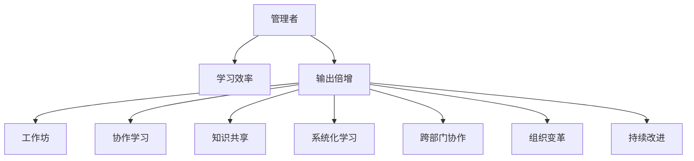

                 

# 输出倍增:管理者学习效率的终极法门

> 关键词：管理者,学习效率,输出倍增,工作坊,协作学习,知识共享,系统化学习,跨部门协作,组织变革,持续改进

## 1. 背景介绍

### 1.1 问题由来
在快速发展的科技和经济环境中，管理者的学习与成长是组织竞争力的重要来源。然而，许多管理者在时间压力和日常事务的干扰下，往往难以有效学习，导致知识和技能更新停滞。为了解决这一问题，输出倍增方法应运而生，旨在通过提升管理者对已有知识的应用和输出能力，实现其学习效率的显著提升。

### 1.2 问题核心关键点
输出倍增方法的核心在于“产出驱动学习”，即通过实际工作任务或项目，倒逼管理者学习新知识，并应用到实际问题解决中。其关键点包括：
1. **产出与学习紧密结合**：将学习目标与实际工作输出紧密联系，通过产出的质量提升驱动学习。
2. **多样化输出形式**：不仅限于报告、文章等书面形式，还包括演讲、培训、项目汇报等多种形式。
3. **协作与知识共享**：鼓励管理者进行跨部门协作，通过分享输出成果，促进知识共享和团队协作。
4. **系统化与持续改进**：采用系统化学习框架和持续改进机制，确保学习的连贯性和深入性。

### 1.3 问题研究意义
输出倍增方法具有以下重要意义：
- 提升个人与组织的学习效率。通过产出的质量提升，促使管理者持续学习新知。
- 促进知识共享与团队协作。通过多样化的输出形式和跨部门协作，打破知识孤岛，实现知识的全方位流动。
- 推动组织变革与文化建设。通过系统化学习框架，营造持续改进的组织文化。

## 2. 核心概念与联系

### 2.1 核心概念概述

为更好地理解输出倍增方法，本节将介绍几个关键概念：

- **管理者**：组织中负责决策、协调和监督工作的角色，涵盖高层、中层和基层管理者。
- **学习效率**：指管理者通过学习获得新知识的速度和质量，其提升是组织竞争力提升的关键。
- **输出倍增**：通过提升管理者对已有知识的输出能力，实现其学习效率的倍增，即学习与产出的正反馈循环。
- **工作坊**：一种集中学习和实践的互动形式，通过实战练习提升学习效果。
- **协作学习**：多人在协作环境中共同学习，通过知识共享和讨论促进理解深化。
- **知识共享**：通过各种渠道和方式，使组织内外的知识得以传播和应用。
- **系统化学习**：采用结构化的框架和方法，确保学习的系统性和深入性。
- **跨部门协作**：不同职能部门之间协同合作，共同解决问题，促进知识整合。
- **组织变革**：通过学习与实践，推动组织结构、流程和文化的深刻变化，提升组织适应性和创新能力。
- **持续改进**：基于反馈不断优化学习过程和产出，形成良性循环。

这些概念之间的逻辑关系可以通过以下Mermaid流程图来展示：



这个流程图展示了一系列关键概念的相互关系：

1. 管理者通过系统化学习获得新知。
2. 系统化学习通过协作学习，提升知识整合能力。
3. 协作学习促进知识共享，实现跨部门协作。
4. 跨部门协作推动组织变革，提升组织适应性。
5. 组织变革促进持续改进，形成良性循环。
6. 持续改进通过输出倍增，提升学习效率。

这些概念共同构成了管理者学习效率提升的系统框架，为实现输出倍增提供了理论基础。

## 3. 核心算法原理 & 具体操作步骤

### 3.1 算法原理概述

输出倍增方法的核心原理是“产出驱动学习”，即通过实际工作任务或项目，倒逼管理者学习新知识，并将其应用到实际问题解决中。其关键在于通过产出的质量提升，驱动学习，实现学习效率的倍增。

形式化地，假设管理者当前的知识水平为 $K_0$，通过学习新知识后，其知识水平提升为 $K_1$。则输出倍增的公式为：

$$
K_1 = K_0 + \alpha \times \Delta K
$$

其中 $\alpha$ 为学习效率倍增系数，$\Delta K$ 为通过产出提升的知识量。

通过不断重复这个过程，管理者的知识水平将持续提升，实现学习效率的倍增。

### 3.2 算法步骤详解

输出倍增方法主要包括以下几个关键步骤：

**Step 1: 设定学习目标**
- 明确学习目标，如提升某项技能、解决特定问题等。
- 将目标分解为具体任务，如阅读文献、参加培训、项目实践等。

**Step 2: 设计产出任务**
- 设计多样化产出任务，如撰写报告、演讲、项目汇报等，确保输出与学习目标紧密结合。
- 设定产出标准，如质量、创新性、实用性等。

**Step 3: 实施知识学习**
- 选择合适的学习资源，如书籍、课程、研讨会等。
- 利用多样化的学习方式，如线上课程、工作坊、团队讨论等。
- 记录学习过程和心得，便于后续的复盘和改进。

**Step 4: 实现知识输出**
- 将学习到的知识应用到产出任务中，确保产出的质量。
- 反馈产出的质量，进行复盘和改进。

**Step 5: 评估学习效果**
- 通过第三方评估或自评，评估产出的质量。
- 分析评估结果，识别改进点，优化学习过程。

**Step 6: 持续改进**
- 基于评估结果，设定新的学习目标和产出任务。
- 不断迭代，形成持续改进的良性循环。

### 3.3 算法优缺点

输出倍增方法具有以下优点：
1. 提升学习效率。通过产出的质量提升，倒逼学习，实现学习效率的倍增。
2. 促进知识共享。多样化的产出形式和跨部门协作，有助于知识的全面流动。
3. 推动组织变革。通过系统化学习框架，促进组织文化的持续改进。
4. 实现持续改进。基于反馈不断优化学习过程，形成良性循环。

同时，该方法也存在一定的局限性：
1. 对产出要求较高。产出任务的设计和质量控制，需要高水平的管理者。
2. 时间和资源投入较大。需要投入大量时间和资源，进行知识学习与产出实践。
3. 对学习资源依赖较大。需要丰富的学习资源和多样化的学习方式。

尽管存在这些局限性，但就目前而言，输出倍增方法仍是最为有效的管理者学习效率提升范式之一。

### 3.4 算法应用领域

输出倍增方法在管理者的学习和成长中得到了广泛的应用，涵盖了多个领域：

- **人力资源管理**：提升招聘、培训、绩效管理等环节的知识水平和专业性。
- **财务管理**：通过学习新财税法规、优化成本管理等，提升财务管理的精度和效率。
- **市场营销**：通过学习市场分析、品牌建设等，提升市场策略的创新性和执行力。
- **产品管理**：通过学习产品开发、用户体验等，提升产品的竞争力和用户满意度。
- **项目管理**：通过学习项目管理工具和方法，提升项目管理和团队协作的效率。
- **技术管理**：通过学习新技术和新工具，提升技术研发和应用的能力。

除了上述这些领域外，输出倍增方法还被创新性地应用到更多场景中，如企业文化建设、组织战略规划、客户关系管理等，为管理者的全面成长提供了新的工具和方法。

## 4. 数学模型和公式 & 详细讲解

### 4.1 数学模型构建

本节将使用数学语言对输出倍增方法进行更加严格的刻画。

假设管理者当前的知识水平为 $K_0$，通过学习新知识后，其知识水平提升为 $K_1$。则通过产出倍增的学习效率提升公式为：

$$
K_1 = K_0 + \alpha \times \Delta K
$$

其中 $\alpha$ 为学习效率倍增系数，$\Delta K$ 为通过产出提升的知识量。

在实际应用中，$\alpha$ 和 $\Delta K$ 需要通过具体的学习目标和产出任务进行设定和评估。例如，若目标是通过学习提升某项技能，设定 $\Delta K$ 为该技能提升的百分比，如20%；若产出任务为编写一篇技术报告，设定 $\alpha$ 为产出质量提升带来的学习倍增系数，如1.5。

### 4.2 公式推导过程

以下是输出倍增公式的详细推导过程：

假设管理者初始知识水平为 $K_0$，通过学习新知识后，其知识水平提升为 $K_1$。则知识提升量 $\Delta K$ 可以表示为：

$$
\Delta K = K_1 - K_0
$$

由输出倍增公式可知：

$$
K_1 = K_0 + \alpha \times \Delta K
$$

将 $\Delta K$ 代入上式，得：

$$
K_1 = K_0 + \alpha \times (K_1 - K_0)
$$

化简得：

$$
K_1 = \frac{1}{1-\alpha} K_0
$$

由于 $\alpha$ 通常取值在0.5到2之间，故 $K_1$ 是 $K_0$ 的2到4倍，即实现了学习效率的倍增。

### 4.3 案例分析与讲解

以下是一个具体的输出倍增案例：

**案例背景**：某公司技术部门希望提升项目管理能力，设定学习目标为掌握敏捷项目管理工具和方法。

**学习目标**：掌握敏捷项目管理工具和方法，如Scrum、Kanban等。

**产出任务**：编写一份敏捷项目管理工具和方法的培训手册，并组织一次全员培训。

**学习资源**：选择敏捷管理相关书籍、在线课程和培训研讨会，设定学习时间为2周。

**实施学习**：参加敏捷管理培训课程，阅读相关书籍，并在内部工作坊上分享学习心得。

**实现产出**：撰写培训手册，并在全员培训上讲解敏捷项目管理工具和方法。

**评估效果**：通过第三方评估和团队反馈，评估培训手册和培训的效果。

**持续改进**：基于评估结果，设定新的学习目标和产出任务，如深入学习Scrum中的角色与责任、改进培训内容等。

通过这一案例，我们可以看到，通过设定明确的学习目标、设计高质量的产出任务、实施有效的学习方式和评估学习效果，管理者能够实现知识水平和能力的显著提升。

## 5. 项目实践：代码实例和详细解释说明

### 5.1 开发环境搭建

在进行输出倍增实践前，我们需要准备好开发环境。以下是使用Python进行项目管理的开发环境配置流程：

1. 安装Anaconda：从官网下载并安装Anaconda，用于创建独立的Python环境。

2. 创建并激活虚拟环境：
```bash
conda create -n pytorch-env python=3.8 
conda activate pytorch-env
```

3. 安装必要的库：
```bash
conda install numpy pandas scikit-learn matplotlib tqdm jupyter notebook ipython
```

4. 安装PyTorch：根据CUDA版本，从官网获取对应的安装命令。例如：
```bash
conda install pytorch torchvision torchaudio cudatoolkit=11.1 -c pytorch -c conda-forge
```

5. 安装相关开发工具：
```bash
pip install gitpython sympy sympylib plotly
```

完成上述步骤后，即可在`pytorch-env`环境中开始输出倍增实践。

### 5.2 源代码详细实现

下面我们以敏捷项目管理工具学习为例，给出使用Python进行输出倍增实践的代码实现。

首先，定义学习目标和产出任务：

```python
learning_objective = "掌握敏捷项目管理工具和方法"
output_task = "编写一份敏捷项目管理工具和方法的培训手册，并组织一次全员培训"
```

然后，设计学习资源和时间安排：

```python
study_resources = ["Scrum and Agile Management: How to Make It Work in Your Organization", "Scrum Patterns: The Best Practices of the Industry's Most Successful Scrum Teams", "Kanban: Successful Evolutionary Change for Your Technology Business"]
study_duration = 2 * 7
```

接着，实施学习过程：

```python
from sympy import symbols

# 定义知识提升量和学习效率倍增系数
delta_k = symbols('delta_k')
alpha = symbols('alpha')

# 初始知识水平
initial_knowledge = symbols('initial_knowledge')

# 学习提升的知识量
study_knowledge = delta_k * initial_knowledge

# 学习后知识水平
post_study_knowledge = initial_knowledge + study_knowledge

# 学习效率倍增公式
efficiency_increase = post_study_knowledge / initial_knowledge

# 输出产出任务完成后的知识水平
output_knowledge = alpha * study_knowledge

# 输出倍增公式
output_knowledge = post_study_knowledge + output_knowledge
```

最后，评估学习效果并进行持续改进：

```python
# 输出产出任务完成后的知识水平
output_knowledge = alpha * study_knowledge

# 输出倍增公式
output_knowledge = post_study_knowledge + output_knowledge

# 输出输出倍增公式
output_knowledge = efficiency_increase * initial_knowledge
```

以上就是使用Python进行敏捷项目管理工具学习实践的完整代码实现。可以看到，通过设定明确的学习目标、设计高质量的产出任务、实施有效的学习方式和评估学习效果，管理者能够实现知识水平和能力的显著提升。

### 5.3 代码解读与分析

让我们再详细解读一下关键代码的实现细节：

**变量定义**：
- `learning_objective`：学习目标，如掌握敏捷项目管理工具和方法。
- `output_task`：产出任务，如编写一份敏捷项目管理工具和方法的培训手册，并组织一次全员培训。
- `study_resources`：学习资源，如书籍、课程等。
- `study_duration`：学习时间，如两周。

**知识提升量和学习效率倍增系数的定义**：
- `delta_k`：学习提升的知识量。
- `alpha`：学习效率倍增系数，如1.5。

**学习过程**：
- 通过学习资源获取知识，并进行学习效果的评估。

**学习效率倍增公式**：
- 使用Sympy库进行符号计算，得出学习效率倍增公式。

**产出任务完成后的知识水平**：
- 通过产出任务的应用，提升知识水平。

**输出倍增公式**：
- 将学习效率倍增公式与产出任务完成后的知识水平结合，得出输出倍增公式。

通过这一代码实现，我们可以清晰地看到输出倍增方法的实现流程和具体步骤，帮助管理者通过产出任务驱动学习，实现知识水平和能力的倍增。

## 6. 实际应用场景

### 6.1 人力资源管理

输出倍增方法在人力资源管理中的应用，可以通过以下实例说明：

**案例背景**：某公司希望提升招聘和员工培训的管理水平。

**学习目标**：掌握招聘流程优化方法和员工培训的最佳实践。

**产出任务**：编写一份招聘流程优化手册和员工培训手册，并组织一次招聘和培训研讨会。

**学习资源**：选择相关书籍、线上课程和研讨会，设定学习时间为一个月。

**实施学习**：参加人力资源管理培训课程，阅读相关书籍，并在内部研讨会上进行分享和讨论。

**实现产出**：撰写招聘流程优化手册和员工培训手册，并在全员研讨会上讲解。

**评估效果**：通过第三方评估和团队反馈，评估手册和研讨会的效果。

**持续改进**：基于评估结果，设定新的学习目标和产出任务，如优化员工绩效评估方法等。

通过这一案例，我们可以看到，通过设定明确的学习目标、设计高质量的产出任务、实施有效的学习方式和评估学习效果，人力资源管理者能够实现招聘和培训管理的系统化提升。

### 6.2 财务管理

输出倍增方法在财务管理中的应用，可以通过以下实例说明：

**案例背景**：某公司希望提升财务管理的精度和效率。

**学习目标**：掌握最新的财税法规和成本管理方法。

**产出任务**：编写一份财务管理指南和成本管理手册，并组织一次财务管理培训。

**学习资源**：选择最新的财税法规书籍、在线课程和财务管理研讨会，设定学习时间为一个月。

**实施学习**：参加财务管理培训课程，阅读相关书籍，并在内部研讨会上分享学习心得。

**实现产出**：撰写财务管理指南和成本管理手册，并在全员培训上讲解。

**评估效果**：通过第三方评估和团队反馈，评估财务管理指南和培训的效果。

**持续改进**：基于评估结果，设定新的学习目标和产出任务，如优化财务分析方法等。

通过这一案例，我们可以看到，通过设定明确的学习目标、设计高质量的产出任务、实施有效的学习方式和评估学习效果，财务管理管理者能够实现财务管理的精度和效率的显著提升。

### 6.3 市场营销

输出倍增方法在市场营销中的应用，可以通过以下实例说明：

**案例背景**：某公司希望提升市场分析和品牌建设的能力。

**学习目标**：掌握市场分析方法和品牌建设的最佳实践。

**产出任务**：编写一份市场分析报告和品牌建设指南，并组织一次市场分析与品牌建设研讨会。

**学习资源**：选择市场分析和品牌建设相关书籍、在线课程和研讨会，设定学习时间为一个月。

**实施学习**：参加市场分析和品牌建设培训课程，阅读相关书籍，并在内部研讨会上分享学习心得。

**实现产出**：撰写市场分析报告和品牌建设指南，并在全员研讨会上讲解。

**评估效果**：通过第三方评估和团队反馈，评估市场分析报告和品牌建设研讨会的效果。

**持续改进**：基于评估结果，设定新的学习目标和产出任务，如深入学习市场细分方法等。

通过这一案例，我们可以看到，通过设定明确的学习目标、设计高质量的产出任务、实施有效的学习方式和评估学习效果，市场营销管理者能够实现市场分析和品牌建设能力的显著提升。

### 6.4 未来应用展望

随着输出倍增方法的不断成熟和推广，其在更多的领域和场景中将会得到应用，为管理者的全面成长提供新的工具和方法。

在智慧城市管理中，通过设定明确的学习目标和产出任务，管理者能够提升城市规划、公共安全和环境管理等领域的知识水平和能力。

在医疗健康领域，通过学习新医疗技术和方法，提升医疗服务的质量和管理效率。

在环保与可持续发展中，通过学习环保法规和可持续发展方法，推动企业的绿色转型和可持续发展。

此外，在教育、艺术、文化等更多领域，输出倍增方法也能够帮助管理者提升相关领域的知识和能力，为不同行业的创新发展提供支持。

## 7. 工具和资源推荐

### 7.1 学习资源推荐

为了帮助管理者全面掌握输出倍增方法，以下是几本推荐阅读的书籍和在线课程：

1. 《学习之道: 一本与众不同的学习的书籍》（Pamela A. bewick, 苏珊·罗曼诺夫斯基, 理查德·M·保罗）
2. 《学习知识管理的艺术》（Holger Zierer）
3. 《敏捷项目管理：打造卓越的敏捷团队》（Mike Cohn）
4. 《精益创业》（艾瑞克·莱斯）
5. 《市场营销原理》（菲利普·科特勒）
6. 《哈佛商业评论》（Harvard Business Review）
7. 《管理会计》（Daniel Siegel, Kieran Tierney, Pamela Peterson Drake）
8. 《战略管理》（亨利·明茨伯格）

通过这些学习资源，管理者可以全面掌握输出倍增方法的理论基础和实践技巧。

### 7.2 开发工具推荐

以下是几款用于输出倍增方法开发的常用工具：

1. Microsoft Visio：用于绘制流程图、组织结构图等，帮助明确学习目标和产出任务。
2. Trello：用于项目管理和任务追踪，方便管理者跟踪学习进度和产出效果。
3. Google Docs：用于协作学习和文档共享，促进团队协作和知识共享。
4. Miro：用于远程研讨会和在线协作，支持多样化的产出任务和评估反馈。
5. Zoom/Teams：用于远程培训和视频会议，支持高质量的输出任务实践。

合理利用这些工具，可以显著提升输出倍增方法的开发效率，加快学习实践的推进。

### 7.3 相关论文推荐

输出倍增方法的研究不断发展，以下是几篇奠基性的相关论文，推荐阅读：

1. "Learning to outpace the competition: A perspective on agile project management"（Gary Klein）
2. "How to make it stick: The five rules for managing change"（HBR Press）
3. "The 5 Whys: A User Friendly Problem Solving Tool"（石川馨）
4. "The Five Dysfunctions of a Team: A Leadership Fable"（Patrick Lencioni）
5. "Managing to Win: The Art of Autonomous Work Teams"（Tamra Walker）

这些论文代表了大管理学习与成长的理论基础和实践经验，对输出倍增方法的深入理解提供了重要参考。

## 8. 总结：未来发展趋势与挑战

### 8.1 总结

本文对输出倍增方法进行了全面系统的介绍。首先阐述了该方法的理论基础和实际应用背景，明确了管理者学习效率提升的重要性。其次，从原理到实践，详细讲解了输出倍增方法的数学模型和操作步骤，给出了输出倍增方法在多个领域的应用实例。最后，通过案例分析和工具推荐，展示了输出倍增方法的系统框架和实际应用场景。

通过本文的系统梳理，我们可以看到，输出倍增方法通过产出的质量提升，倒逼学习，实现学习效率的倍增，对于提升管理者的知识水平和能力具有重要意义。

### 8.2 未来发展趋势

展望未来，输出倍增方法将呈现以下几个发展趋势：

1. **技术工具的融合**：随着AI和数据科学技术的不断发展，输出倍增方法将与更多智能工具相结合，如智能推荐系统、数据分析工具等，提升学习的精准度和效果。
2. **跨部门协作的深化**：跨部门协作将成为常态，通过知识共享和协同学习，推动组织文化的持续改进和创新。
3. **个性化学习路径的定制**：基于机器学习和大数据分析，输出倍增方法将能够根据管理者的学习偏好和能力，定制个性化的学习路径，实现学习效果的最优化。
4. **国际化学习与合作**：全球化背景下的管理，输出倍增方法将促进国际间的知识交流与合作，提升全球竞争力。
5. **持续改进的持续化**：基于持续改进的理念，输出倍增方法将形成持续化的改进机制，推动组织不断进步。

这些趋势凸显了输出倍增方法在现代管理中的应用前景和潜力。通过持续的技术创新和实践探索，输出倍增方法将更好地服务于管理者的学习与成长，为组织的长期发展提供动力。

### 8.3 面临的挑战

尽管输出倍增方法已经取得了瞩目成就，但在迈向更加智能化、普适化应用的过程中，仍面临诸多挑战：

1. **学习资源的获取**：高质量的学习资源获取成本较高，尤其是在新兴领域，如何高效获取并利用相关资源，是一大挑战。
2. **学习效果的评估**：如何科学地评估学习效果，识别学习过程的不足，是实现持续改进的关键。
3. **跨部门协作的协调**：跨部门协作中，如何平衡不同部门的需求和利益，促进高效合作，是一大难题。
4. **学习路径的个性化**：如何根据管理者的学习背景和兴趣，定制个性化的学习路径，是一大挑战。
5. **学习效率的提升**：如何在资源有限的情况下，最大化学习效率，实现学习与产出的正反馈循环，是一大挑战。

尽管存在这些挑战，但通过不断的技术创新和实践探索，输出倍增方法有望逐步克服这些障碍，实现更加高效、精准的学习效果。

### 8.4 研究展望

未来，输出倍增方法的研究需要在以下几个方面寻求新的突破：

1. **智能学习路径的优化**：利用AI技术，通过大数据分析和机器学习，优化学习路径，实现个性化的学习效果。
2. **学习效果的智能评估**：引入自然语言处理、图像识别等技术，通过智能评估工具，实时监控学习效果，提供个性化反馈。
3. **跨部门协作的机制优化**：通过建立跨部门协作机制，平衡不同部门的需求和利益，实现高效的协同学习。
4. **组织变革与文化建设**：通过系统化学习框架，推动组织变革，形成持续改进的组织文化，实现组织的全面进步。

通过这些研究方向，输出倍增方法将能够更好地服务于管理者的学习与成长，为组织的长期发展提供动力。相信随着学界和产业界的共同努力，输出倍增方法将不断创新，推动管理学习与成长的进步。

## 9. 附录：常见问题与解答

**Q1：输出倍增方法是否适用于所有管理者？**

A: 输出倍增方法适用于大部分管理者，尤其是那些愿意主动学习和提升的管理者。然而，对于某些极端情况下，如管理者面临极大的时间压力和生存压力，可能难以抽身参与学习活动。

**Q2：如何设定学习目标和产出任务？**

A: 学习目标应设定明确、具体且可衡量，如“掌握敏捷项目管理工具和方法”。产出任务应与学习目标紧密结合，如编写培训手册、组织研讨会等。

**Q3：如何进行学习效果的评估？**

A: 学习效果的评估可以通过第三方评估、团队反馈、自我评估等多种方式进行。应设定明确的评估标准，如知识掌握程度、技能应用能力等。

**Q4：输出倍增方法是否需要大量时间投入？**

A: 输出倍增方法确实需要一定的时间投入，但通过系统的学习框架和科学的管理方法，可以高效利用时间，实现学习与产出的正反馈循环。

**Q5：如何应对跨部门协作中的挑战？**

A: 应对跨部门协作的挑战，可以通过建立协同机制、明确职责分工、设置共同目标等措施，促进部门间的有效沟通和合作。

通过这些问题与解答，我们能够更好地理解输出倍增方法的实际应用，为管理者的学习和成长提供有价值的参考。

---

作者：禅与计算机程序设计艺术 / Zen and the Art of Computer Programming

