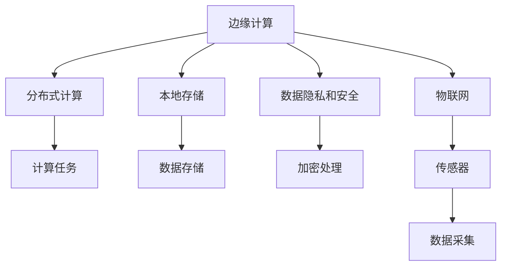

                 

# 边缘计算在IoT生态系统中的角色

> 关键词：边缘计算,物联网,IoT,生态系统,分布式计算,边缘存储,数据安全,隐私保护,实时处理,网络优化

## 1. 背景介绍

### 1.1 问题由来
随着物联网(IoT)设备的普及和数据量的爆炸性增长，传统的中心化集中式计算架构面临严峻挑战。一方面，海量的数据传输不仅增加了网络带宽压力，同时也造成了延迟和带宽资源浪费。另一方面，数据隐私和安全问题越来越突出，尤其是在涉及个人隐私的数据传输和存储过程中，中心化集中式架构的集中处理方式变得难以信任。边缘计算作为一种新型的分布式计算模式，能够在数据源附近进行本地处理和存储，从而显著降低网络延迟、提升数据处理效率，同时保障数据隐私安全，成为物联网生态系统的重要组成部分。

### 1.2 问题核心关键点
边缘计算的核心理念是将数据处理和存储任务分布到网络边缘设备上，使其在靠近数据源的地方进行处理和分析，以减少数据传输量和网络延迟，提升计算效率。边缘计算可以显著提高物联网设备的实时处理能力，确保数据的即时响应和本地化处理，同时保障数据隐私和安全。

边缘计算的关键点包括：
- **分布式计算**：将计算任务分散到边缘设备上，减少中心服务器的负担。
- **本地存储**：在边缘设备上存储数据，减少对中心服务器的依赖，降低延迟。
- **边缘安全**：在数据源附近进行数据加密和处理，确保数据隐私和安全。
- **实时性**：在数据产生后立即处理，提升系统的实时响应能力。

## 2. 核心概念与联系

### 2.1 核心概念概述

为更好地理解边缘计算在物联网生态系统中的应用，本节将介绍几个关键概念：

- **边缘计算**：在数据源附近进行的分布式计算和存储，旨在减少数据传输量和延迟，提升系统实时性。
- **物联网**：通过互联网将各种传感器、设备、软件、硬件等连接起来，实现设备间的信息交互和数据共享。
- **分布式计算**：将计算任务分散到多台计算机上进行协同处理，提升整体计算能力。
- **本地存储**：在边缘设备上进行数据存储，减少对中心服务器的依赖。
- **数据隐私和安全**：在数据源附近进行数据加密和处理，确保数据安全性和隐私保护。

这些概念之间的逻辑关系可以通过以下Mermaid流程图来展示：



这个流程图展示了边缘计算在物联网生态系统中的作用，以及它与分布式计算、本地存储和数据隐私等核心概念的联系。

## 3. 核心算法原理 & 具体操作步骤
### 3.1 算法原理概述

边缘计算的原理是通过在数据源附近进行数据处理和存储，从而实现数据的本地化处理和分析。具体来说，边缘计算将物联网设备产生的数据直接在本地进行处理，减少对中心服务器的依赖，提升系统实时性，同时保障数据隐私和安全。

### 3.2 算法步骤详解

边缘计算在物联网生态系统中的应用步骤如下：

**Step 1: 数据采集与预处理**
- 物联网设备采集数据，并进行简单的预处理，如去除噪声、归一化等。

**Step 2: 数据传输与存储**
- 将预处理后的数据传输到边缘设备上，并进行本地存储。

**Step 3: 本地计算与分析**
- 在边缘设备上进行实时计算和分析，生成初步结果。

**Step 4: 数据汇聚与集中处理**
- 将边缘设备上的数据进行汇聚，传输到中心服务器进行进一步处理和分析。

**Step 5: 数据展示与决策**
- 将处理后的数据展示给用户，或用于指导决策和控制。

### 3.3 算法优缺点

边缘计算在物联网生态系统中的应用具有以下优点：
- **降低延迟**：数据在本地进行处理，减少了数据传输和处理的时延。
- **提升效率**：通过分布式计算，提升了整体系统的处理能力。
- **保障隐私**：在本地进行数据处理和存储，减少了数据传输和中心服务器对数据的依赖，保障了数据隐私。

同时，边缘计算也存在一些缺点：
- **资源限制**：边缘设备通常资源有限，处理能力受限。
- **成本高**：需要大量边缘设备和数据中心，初期投入成本较高。
- **网络复杂性**：边缘计算需要复杂的网络架构和数据传输协议。
- **维护复杂**：分布式系统的维护和管理较为复杂。

### 3.4 算法应用领域

边缘计算在物联网生态系统中有着广泛的应用领域，具体包括：

- **智能制造**：通过边缘计算，实时监控生产设备和流程，优化生产效率和质量。
- **智慧城市**：在交通、安防、环保等领域进行实时数据处理和分析，提升城市管理水平。
- **智能家居**：在家庭环境中，进行设备控制、能耗管理、健康监测等，提升家庭智能化水平。
- **智能医疗**：实时监测病人健康数据，进行快速诊断和治疗决策。
- **智能农业**：实时监控农田环境和作物生长情况，优化种植方案，提升农业生产效率。

## 4. 数学模型和公式 & 详细讲解

### 4.1 数学模型构建

边缘计算在物联网生态系统中的应用，可以通过数学模型来描述。以智能制造为例，假设物联网设备A和B采集的数据分别为 $x_A$ 和 $x_B$，经过预处理和传输，分别在本地设备A和B上进行计算，生成的初步结果分别为 $y_A$ 和 $y_B$。边缘设备将 $y_A$ 和 $y_B$ 汇聚并上传至中心服务器进行集中处理，最终生成的决策结果为 $y$。数学模型可以表示为：

$$
y = f(x_A, x_B)
$$

其中 $f$ 为边缘计算和集中处理的函数。

### 4.2 公式推导过程

在智能制造中，边缘计算的过程可以描述为：

$$
y_A = g(x_A, w_A)
$$

$$
y_B = g(x_B, w_B)
$$

$$
y = h(y_A, y_B, w_C)
$$

其中 $w_A, w_B, w_C$ 分别代表边缘设备和中心服务器的计算参数。

### 4.3 案例分析与讲解

假设某智能制造系统中，设备A和B采集的数据分别为温度 $x_A = 80^\circ C$ 和湿度 $x_B = 60\%$。经过预处理和传输，设备A和B在本地进行计算，生成的初步结果分别为 $y_A = 75^\circ C$ 和 $y_B = 65\%$。边缘设备将 $y_A$ 和 $y_B$ 汇聚并上传至中心服务器进行集中处理，最终生成的决策结果为 $y = 75^\circ C$，表示需要调整设备温度至75度，以达到最佳生产条件。

## 5. 项目实践：代码实例和详细解释说明
### 5.1 开发环境搭建

在进行边缘计算项目实践前，我们需要准备好开发环境。以下是使用Python进行边缘计算项目开发的简单步骤：

1. 安装Python和相关库：
```bash
sudo apt-get update && sudo apt-get install python3 python3-pip
```

2. 安装PyTorch、TensorFlow等深度学习框架：
```bash
pip install torch tensorflow
```

3. 安装物联网相关的库：
```bash
pip install pyserial paho-mqtt
```

4. 安装边缘计算相关的库：
```bash
pip install edgepy
```

完成上述步骤后，即可在本地进行边缘计算项目开发。

### 5.2 源代码详细实现

以下是一个简单的边缘计算项目示例，用于实时监控智能家居系统中的温度和湿度数据，并在本地进行处理和分析。

首先，定义传感器数据采集函数：

```python
from edgepy import Edge

# 初始化边缘计算设备
edge = Edge('localhost', 5000)

# 定义温度和湿度传感器
temperature_sensor = edge.create_sensor('temperature')
humidity_sensor = edge.create_sensor('humidity')

# 实时采集传感器数据
def get_data():
    while True:
        temperature = temperature_sensor.read()
        humidity = humidity_sensor.read()
        print(f"Temperature: {temperature}, Humidity: {humidity}")
```

然后，定义边缘计算函数，将采集到的数据进行处理和分析：

```python
from edgepy import Edge

# 初始化边缘计算设备
edge = Edge('localhost', 5000)

# 定义温度和湿度传感器
temperature_sensor = edge.create_sensor('temperature')
humidity_sensor = edge.create_sensor('humidity')

# 实时采集传感器数据
def get_data():
    while True:
        temperature = temperature_sensor.read()
        humidity = humidity_sensor.read()
        print(f"Temperature: {temperature}, Humidity: {humidity}")

# 定义边缘计算函数
def process_data(temperature, humidity):
    # 简单处理，如计算平均值
    avg_temperature = (temperature + humidity) / 2
    avg_humidity = (temperature + humidity) / 2
    return avg_temperature, avg_humidity
```

最后，运行程序并展示结果：

```python
from edgepy import Edge

# 初始化边缘计算设备
edge = Edge('localhost', 5000)

# 定义温度和湿度传感器
temperature_sensor = edge.create_sensor('temperature')
humidity_sensor = edge.create_sensor('humidity')

# 实时采集传感器数据
def get_data():
    while True:
        temperature = temperature_sensor.read()
        humidity = humidity_sensor.read()
        print(f"Temperature: {temperature}, Humidity: {humidity}")

# 定义边缘计算函数
def process_data(temperature, humidity):
    # 简单处理，如计算平均值
    avg_temperature = (temperature + humidity) / 2
    avg_humidity = (temperature + humidity) / 2
    return avg_temperature, avg_humidity

if __name__ == "__main__":
    get_data()
```

通过上述代码，我们可以在本地边缘设备上实时采集温度和湿度数据，并进行简单处理和分析，得到平均温度和湿度。

### 5.3 代码解读与分析

在上述代码中，我们使用了Edgepy库来进行边缘计算。Edgepy是一个用于构建分布式边缘计算环境的Python库，它支持多种数据传输协议，如MQTT、HTTP等，适用于物联网设备的边缘计算场景。

具体来说，我们通过Edgepy库创建了两个传感器：温度传感器和湿度传感器，并定义了一个函数 `process_data` 来处理传感器数据。该函数通过计算传感器数据的平均值，得到一个初步的处理结果，用于展示和分析。

值得注意的是，上述代码只是一个简单的示例，实际的边缘计算项目需要更复杂的算法和更完善的数据管理机制。在实际应用中，还需要考虑数据同步、设备互操作性、数据隐私等问题。

## 6. 实际应用场景
### 6.1 智能制造

边缘计算在智能制造中的应用主要体现在生产过程的实时监控和控制上。通过边缘计算，可以实现以下几个方面的提升：

- **实时监控**：在生产线上实时监控设备状态和生产数据，及时发现和处理异常。
- **数据预处理**：在边缘设备上进行数据预处理和清洗，减少对中心服务器的依赖。
- **智能控制**：根据实时数据，自动调整生产参数和设备状态，优化生产过程。

例如，在智能工厂中，传感器设备采集生产过程中的温度、湿度、振动等数据，边缘设备进行实时计算和分析，生成生产过程中的实时监控数据，并通过MQTT协议上传至中心服务器进行集中处理和展示。这样，生产管理者可以实时了解生产过程，及时调整生产参数，提高生产效率和产品质量。

### 6.2 智慧城市

边缘计算在智慧城市中的应用主要体现在城市管理的各个方面，如交通、安防、环保等。通过边缘计算，可以实现以下几个方面的提升：

- **实时监控**：在城市中实时监控交通流量、环境监测数据等，及时发现和处理异常。
- **数据预处理**：在边缘设备上进行数据预处理和清洗，减少对中心服务器的依赖。
- **智能控制**：根据实时数据，自动调整交通信号灯、环保设备等，优化城市管理。

例如，在智慧交通中，传感器设备采集交通流量、车速、红绿灯状态等数据，边缘设备进行实时计算和分析，生成交通流量和车速的实时监控数据，并通过MQTT协议上传至中心服务器进行集中处理和展示。这样，交通管理者可以实时了解交通情况，及时调整信号灯和道路管理，优化交通流量，提升道路通行效率。

### 6.3 智能家居

边缘计算在智能家居中的应用主要体现在家庭环境的智能控制和管理上。通过边缘计算，可以实现以下几个方面的提升：

- **实时监控**：在家庭环境中实时监控温度、湿度、能耗等数据，及时发现和处理异常。
- **数据预处理**：在边缘设备上进行数据预处理和清洗，减少对中心服务器的依赖。
- **智能控制**：根据实时数据，自动调整家电设备状态，优化家庭环境。

例如，在智能家居中，传感器设备采集温度、湿度、能耗等数据，边缘设备进行实时计算和分析，生成家庭环境的实时监控数据，并通过MQTT协议上传至中心服务器进行集中处理和展示。这样，用户可以实时了解家庭环境，及时调整设备状态，优化居住舒适度，提升生活质量。

## 7. 工具和资源推荐
### 7.1 学习资源推荐

为了帮助开发者系统掌握边缘计算在物联网生态系统中的应用，这里推荐一些优质的学习资源：

1. **《边缘计算原理与实践》**：详细介绍边缘计算的原理、架构和应用场景，适合初学者和进阶开发者。

2. **《物联网边缘计算》**：系统讲解物联网设备的边缘计算技术，涵盖传感器、网络协议、数据处理等方面。

3. **《边缘计算在智能制造中的应用》**：探讨边缘计算在智能制造中的应用案例，包括实时监控、数据预处理、智能控制等方面。

4. **《智慧城市边缘计算》**：介绍边缘计算在智慧城市中的应用，涵盖交通、安防、环保等方面。

5. **《智能家居边缘计算》**：讨论边缘计算在智能家居中的应用，涵盖温度、湿度、能耗等数据的采集、处理和控制。

通过对这些资源的学习，相信你一定能够全面掌握边缘计算在物联网生态系统中的应用。

### 7.2 开发工具推荐

高效的开发离不开优秀的工具支持。以下是几款用于边缘计算项目开发的常用工具：

1. **Edgepy**：用于构建分布式边缘计算环境的Python库，支持多种数据传输协议。

2. **MQTT**：轻量级的数据传输协议，适用于物联网设备的边缘计算场景。

3. **PyTorch**：基于Python的深度学习框架，支持边缘计算任务。

4. **TensorFlow**：由Google主导开发的深度学习框架，支持分布式计算。

5. **TQDM**：实时显示进度条的工具，适用于边缘计算任务的数据传输。

6. **HDFS**：分布式文件系统，用于边缘设备的数据存储和共享。

合理利用这些工具，可以显著提升边缘计算项目的开发效率，加快创新迭代的步伐。

### 7.3 相关论文推荐

边缘计算技术的发展源于学界的持续研究。以下是几篇奠基性的相关论文，推荐阅读：

1. **Edge Computing: A Computational Model for Smartphones**：提出边缘计算的概念和架构，探讨其在智能手机中的应用。

2. **The Edge Computing Paradigm Beyond Mobile Devices: A Visual Protocol Taxonomy**：系统总结边缘计算的协议和架构，涵盖多种设备和技术。

3. **Edge Computing: Benefits, Risks, and Recommendations for Smart City Applications**：探讨边缘计算在智慧城市中的应用，分析其优缺点和推荐策略。

4. **Edge Computing in the Internet of Things: A Survey**：系统综述边缘计算在物联网中的应用，涵盖多个领域和技术。

5. **Edge Computing: A Survey on Recent Advances and Future Directions**：总结边缘计算的最新进展和未来方向，涵盖多个应用场景和架构。

这些论文代表了大边缘计算技术的发展脉络。通过学习这些前沿成果，可以帮助研究者把握学科前进方向，激发更多的创新灵感。

## 8. 总结：未来发展趋势与挑战

### 8.1 总结

本文对边缘计算在物联网生态系统中的应用进行了全面系统的介绍。首先阐述了边缘计算的原理和应用背景，明确了其在大规模数据处理、实时性、隐私保护等方面的优势。其次，从原理到实践，详细讲解了边缘计算的应用步骤和数学模型，给出了实际应用的代码实例。最后，本文还探讨了边缘计算在智能制造、智慧城市、智能家居等多个领域的应用场景，并推荐了相关的学习资源和开发工具。

通过本文的系统梳理，可以看到，边缘计算在物联网生态系统中的应用前景广阔，其分布式计算、本地存储、数据隐私和安全等特点，使其成为解决大规模数据处理和实时性问题的有力工具。未来，伴随物联网设备的普及和计算技术的进步，边缘计算必将在更广泛的领域发挥重要作用。

### 8.2 未来发展趋势

展望未来，边缘计算在物联网生态系统中的应用将呈现以下几个发展趋势：

1. **计算资源下沉**：边缘设备的计算能力和存储能力将进一步提升，更多的计算资源将下沉到边缘设备上。

2. **网络通信优化**：随着5G和物联网技术的发展，网络通信效率将大幅提升，边缘设备之间的通信将更加高效。

3. **智能控制优化**：通过边缘计算，智能控制算法将更加精细和智能化，实现更高效的生产和城市管理。

4. **数据隐私保护**：边缘计算将更加注重数据隐私和安全，采用多种加密和匿名化技术，保障用户数据安全。

5. **分布式协作**：边缘设备之间的协作将更加紧密，形成更高效的数据处理和控制网络。

6. **跨领域应用**：边缘计算将不仅仅应用于物联网领域，还将扩展到更多领域，如医疗、交通等。

以上趋势凸显了边缘计算在物联网生态系统中的重要地位，这些方向的探索发展，必将进一步提升物联网系统的性能和应用范围，为智能社会的构建提供重要支持。

### 8.3 面临的挑战

尽管边缘计算在物联网生态系统中的应用前景广阔，但在迈向更加智能化、普适化应用的过程中，它仍面临诸多挑战：

1. **设备异构性**：不同的物联网设备具有不同的硬件和软件环境，边缘计算需要适应多种设备。

2. **数据一致性**：边缘设备之间的数据同步和一致性问题，需要通过复杂的数据同步机制来解决。

3. **资源限制**：边缘设备资源有限，处理能力受限，需要优化算法和数据传输策略。

4. **网络复杂性**：边缘设备之间的网络通信复杂，需要优化通信协议和网络架构。

5. **数据隐私和安全**：边缘计算需要采用多种加密和匿名化技术，保障用户数据安全。

6. **跨域互操作性**：边缘设备之间的互操作性问题，需要通过标准和协议来解决。

这些挑战需要我们在技术、管理和标准等方面进行全面探索和创新，才能使边缘计算技术在物联网生态系统中得到更广泛的应用。

### 8.4 研究展望

面对边缘计算在物联网生态系统中所面临的挑战，未来的研究需要在以下几个方面寻求新的突破：

1. **边缘设备优化**：开发更加高性能的边缘设备，提升其计算能力和存储能力。

2. **数据同步和一致性**：研究高效的数据同步和一致性机制，保障边缘设备之间的数据同步和一致性。

3. **算法优化**：优化边缘计算中的算法和数据传输策略，提升处理能力和效率。

4. **隐私和安全**：研究边缘计算中的隐私和安全技术，保障用户数据安全和隐私。

5. **跨域互操作性**：研究边缘计算中的跨域互操作性技术，实现边缘设备之间的互操作。

6. **标准和协议**：制定边缘计算的标准和协议，促进边缘计算技术的标准化和规范化。

这些研究方向将推动边缘计算技术的进一步发展，为物联网生态系统带来更高效、更智能、更安全的未来。

## 9. 附录：常见问题与解答

**Q1: 边缘计算和传统集中式计算有何不同？**

A: 边缘计算和传统集中式计算的主要区别在于数据处理和存储的位置。传统集中式计算将数据全部传输到中心服务器进行处理和存储，而边缘计算则在数据源附近进行本地处理和存储，减少了数据传输和处理的时延，提升了系统实时性。

**Q2: 边缘计算有哪些应用场景？**

A: 边缘计算适用于需要实时处理和分析数据的场景，如智能制造、智慧城市、智能家居等。在智能制造中，边缘计算用于实时监控和控制生产设备；在智慧城市中，边缘计算用于实时监控和管理城市环境；在智能家居中，边缘计算用于实时监控和管理家庭环境。

**Q3: 边缘计算需要多少硬件资源？**

A: 边缘计算需要高性能的硬件设备和网络环境。具体来说，边缘设备需要高性能的计算能力和存储能力，支持实时数据处理和存储。同时，需要稳定的网络环境，支持边缘设备和中心服务器之间的数据传输。

**Q4: 边缘计算如何保障数据隐私？**

A: 边缘计算在数据源附近进行数据处理和存储，减少了数据传输和中心服务器对数据的依赖，从而保障了数据隐私。具体来说，可以通过数据加密、匿名化等技术，保护用户数据的安全和隐私。

**Q5: 边缘计算和中心计算的优缺点有哪些？**

A: 边缘计算和中心计算各有优缺点。边缘计算的优点在于实时性高、数据隐私性好，缺点在于硬件资源受限、网络复杂度高。中心计算的优点在于计算能力强大、网络环境稳定，缺点在于时延高、数据隐私性差。

这些常见问题及其解答，可以帮助开发者更好地理解边缘计算在物联网生态系统中的作用和应用场景。通过不断学习和实践，相信你一定能够掌握边缘计算技术，并将其应用于实际项目中，推动物联网技术的进步。

