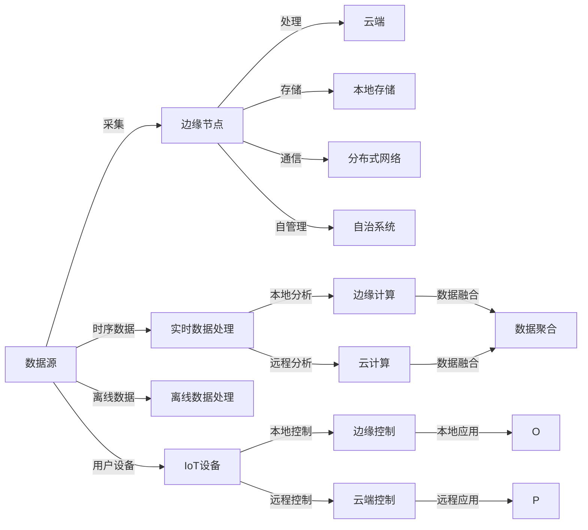

                 

# 边缘计算：分布式计算的新范式

> 关键词：边缘计算,分布式计算,云-边协同,物联网(IoT),实时数据处理,自动化

## 1. 背景介绍

### 1.1 问题由来
近年来，随着数字化进程的加快，数据量和计算需求不断攀升，传统中心化的集中式计算模式面临诸多挑战。随着5G网络的普及和物联网设备的广泛部署，数据产生和处理变得越来越分散和实时化。在这样的背景下，一种新的计算范式——边缘计算（Edge Computing）应运而生。

边缘计算的本质是将计算任务从集中式的数据中心分散到靠近数据源的边缘节点上执行，以降低延迟、提高数据处理效率、保护数据隐私等。它被视为分布式计算领域的一个重要分支，与传统的云计算模式（Cloud Computing）相互补充，共同构建更加智能和高效的信息生态系统。

### 1.2 问题核心关键点
边缘计算的核心在于通过分布式节点分散处理数据和计算任务，实现数据就近分析和应用，从而提升系统的响应速度、降低延迟和带宽消耗，保护数据隐私和安全性。具体关键点如下：

1. **数据就近处理**：将数据存储和处理任务下沉到靠近数据源的边缘节点，避免长距离数据传输和中心化集中处理，降低网络延迟和带宽需求。
2. **分布式协同**：边缘节点通过协同计算、联合推理等机制，实现资源共享和负载均衡，提高系统的整体处理能力和响应速度。
3. **数据隐私保护**：通过在边缘节点进行本地化数据处理，减少敏感数据在传输过程中的暴露风险，保护用户隐私。
4. **实时性提升**：由于数据处理和分析任务在本地完成，边缘计算能够显著提升系统的实时响应能力。
5. **自主决策**：边缘计算节点具备一定程度的自主决策能力，能够根据本地环境和应用需求，做出快速响应。

### 1.3 问题研究意义
边缘计算的研究和应用对提升信息系统的整体效能具有重要意义：

1. **提升网络效率**：边缘计算通过减少数据传输和集中处理，降低了网络拥堵，提升了信息传输的效率和质量。
2. **增强系统鲁棒性**：通过本地化数据处理和实时性增强，边缘计算提高了系统的稳定性和可靠性，减少了中心化系统的单点故障风险。
3. **推动行业创新**：边缘计算为传统行业提供了新型的数字化转型路径，如智能制造、智慧城市、智能交通等领域。
4. **促进跨界融合**：边缘计算的分布式协同特性，为云计算、物联网、人工智能等领域带来了新的融合机会。
5. **优化能源使用**：由于边缘节点靠近用户，可以更好地利用本地能源，提升系统能效，减少能源消耗和碳排放。

## 2. 核心概念与联系

### 2.1 核心概念概述

边缘计算作为分布式计算的新范式，涉及多个关键概念和技术架构，其核心概念包括：

- **边缘节点**：部署在数据源附近，具备存储和计算能力的分布式节点，用于执行本地化的数据处理和应用。
- **云-边协同**：边缘计算与云计算的结合使用，实现数据和计算任务的混合处理，优势互补。
- **分布式网络**：由边缘节点和云计算中心组成的分布式网络，支持数据的跨区域传输和协同处理。
- **物联网(IoT)**：通过边缘计算，实现物联网设备的本地化处理和实时响应，提升物联网系统的效率和安全性。
- **实时数据处理**：边缘计算的重要应用之一，通过就近处理实时数据，满足时序性应用的需求。
- **自动化和自管理**：边缘节点具备一定的自主决策和自管理能力，能够根据应用需求和环境变化进行优化调整。

这些核心概念通过协作，形成边缘计算的完整架构，支持大规模的分布式计算和数据处理。

### 2.2 核心概念原理和架构的 Mermaid 流程图



此图展示了数据从源头采集到边缘节点、云端处理的全流程，以及边缘计算与云计算、物联网设备的协同工作机制。

## 3. 核心算法原理 & 具体操作步骤
### 3.1 算法原理概述

边缘计算的算法原理主要围绕如何有效地利用分布式节点进行数据处理和应用执行，涉及数据分布、任务调度、网络优化等多个方面。其核心算法包括：

- **数据分布算法**：用于将数据分配到不同的边缘节点，根据数据大小、处理能力、网络带宽等因素进行最优分配。
- **任务调度算法**：用于在多个边缘节点上分配计算任务，根据节点负载、任务优先级等因素进行合理调度。
- **网络优化算法**：用于优化边缘节点和云计算中心之间的通信网络，减少延迟和带宽消耗。
- **分布式协同算法**：用于提升多个边缘节点之间的协作效率，实现联合推理、协同计算等功能。

### 3.2 算法步骤详解

#### 数据分布算法

数据分布算法是边缘计算的核心算法之一，其目的是将数据合理地分配到各个边缘节点，以最大化数据处理的效率和网络利用率。数据分布算法主要包括以下步骤：

1. **数据评估**：对数据源进行评估，包括数据量、类型、实时性、隐私需求等。
2. **节点评估**：对边缘节点进行评估，包括处理能力、带宽、存储资源、地理位置等。
3. **数据分配**：根据数据和节点的评估结果，使用优化算法（如K-means、遗传算法等）进行数据分配，确保数据处理的均衡性和效率。
4. **动态调整**：随着环境和需求的变化，实时调整数据分配策略，优化数据分布。

#### 任务调度算法

任务调度算法用于在多个边缘节点上分配计算任务，确保任务能够在合理的时间内完成。任务调度算法主要包括以下步骤：

1. **任务分析**：对计算任务进行分析，包括任务类型、复杂度、资源需求、时序要求等。
2. **节点选择**：根据任务需求和节点能力，选择合适的边缘节点执行任务。
3. **任务调度**：使用调度算法（如MapReduce、Spark等）进行任务调度，确保任务能够在预定时间内完成。
4. **负载均衡**：实时监测节点负载，动态调整任务分配，保持系统的高效运行。

#### 网络优化算法

网络优化算法用于优化边缘节点和云计算中心之间的通信网络，减少延迟和带宽消耗。网络优化算法主要包括以下步骤：

1. **网络拓扑分析**：对网络拓扑进行分析，包括节点位置、通信路径、带宽需求等。
2. **路由优化**：使用路由优化算法（如BGP、OFA等）优化数据传输路径，减少延迟和带宽消耗。
3. **网络优化**：使用网络优化技术（如SDN、NAT等）提升网络效率，支持大规模数据传输。
4. **负载均衡**：实时监测网络负载，动态调整路由策略，保持网络的稳定性和高效性。

#### 分布式协同算法

分布式协同算法用于提升多个边缘节点之间的协作效率，实现联合推理、协同计算等功能。分布式协同算法主要包括以下步骤：

1. **节点协作**：建立节点之间的通信协议和数据共享机制，实现节点间的信息交换和协作。
2. **联合推理**：通过联合推理算法（如联邦学习、分布式训练等）提升节点协同计算的准确性和效率。
3. **协同优化**：使用协同优化算法（如遗传算法、粒子群算法等）提升系统整体的优化效果。
4. **自管理**：通过自管理机制，提升边缘节点的自主决策和自优化能力，确保系统的高效运行。

### 3.3 算法优缺点

#### 优点

- **高效性**：边缘计算通过就近处理数据，显著降低延迟和带宽消耗，提高数据处理效率。
- **实时性**：由于数据处理在本地完成，边缘计算能够满足实时性要求，支持时序性应用。
- **安全性**：通过本地化数据处理，减少敏感数据在传输过程中的暴露风险，保护用户隐私。
- **灵活性**：边缘计算能够根据实际需求，灵活调整数据分布和任务调度策略，支持多样化的应用场景。

#### 缺点

- **资源限制**：边缘节点资源有限，可能无法处理大规模数据和复杂计算任务。
- **管理复杂**：边缘节点的分布和管理需要一定的技术和人力资源投入。
- **标准不统一**：边缘计算目前缺乏统一的标准和规范，不同厂商和平台的兼容性可能存在问题。

### 3.4 算法应用领域

边缘计算的应用领域非常广泛，涉及多个行业和领域，具体包括：

1. **智能制造**：通过边缘计算实现设备监测、故障诊断、质量控制等功能的本地化处理，提升生产效率和产品质量。
2. **智慧城市**：通过边缘计算实现交通管理、环境监测、公共安全等功能的本地化处理，提升城市管理效率和智能化水平。
3. **智能交通**：通过边缘计算实现车辆管理、路况监测、信息发布等功能的本地化处理，提升交通运行效率和安全水平。
4. **智能电网**：通过边缘计算实现电力监测、智能控制、能源管理等功能的本地化处理，提升电网运行效率和能效水平。
5. **医疗健康**：通过边缘计算实现健康监测、诊断分析、数据存储等功能的本地化处理，提升医疗服务质量和患者体验。
6. **金融服务**：通过边缘计算实现交易处理、风险管理、客户服务等功能，提升金融服务的实时性和安全性。

## 4. 数学模型和公式 & 详细讲解 & 举例说明

### 4.1 数学模型构建

边缘计算的数学模型主要涉及数据分布、任务调度、网络优化等多个方面，以下以数据分布算法为例进行详细讲解。

假设数据源 $A$ 有 $n$ 个数据块 $D_1, D_2, ..., D_n$，共有 $m$ 个边缘节点 $N_1, N_2, ..., N_m$。数据分配的目标是最小化数据处理延迟和带宽消耗，使得所有数据块在所有节点上的处理时间之和最小化。

设节点 $N_i$ 的处理能力为 $C_i$，带宽为 $B_i$，数据块 $D_j$ 的大小为 $S_j$，节点 $N_i$ 处理数据块 $D_j$ 的时间为 $T_{i,j}$。数据分布的目标函数为：

$$
\min \sum_{i=1}^{m} \sum_{j=1}^{n} T_{i,j}
$$

约束条件为：

$$
\sum_{j=1}^{n} S_j \leq C_i, \quad \forall i=1,2,...,m
$$

$$
\sum_{j=1}^{n} \frac{S_j}{B_i} \leq T, \quad \forall i=1,2,...,m
$$

其中 $T$ 为允许的最大处理时间。

### 4.2 公式推导过程

数据分配问题可以通过线性规划（Linear Programming）来解决。引入决策变量 $x_{i,j}$ 表示节点 $N_i$ 分配数据块 $D_j$ 的大小。则目标函数和约束条件可以表示为：

$$
\min \sum_{i=1}^{m} \sum_{j=1}^{n} T_{i,j} = \sum_{i=1}^{m} \sum_{j=1}^{n} \frac{S_j}{C_i} x_{i,j}
$$

约束条件为：

$$
\sum_{j=1}^{n} S_j x_{i,j} \leq C_i, \quad \forall i=1,2,...,m
$$

$$
\sum_{j=1}^{n} \frac{S_j x_{i,j}}{B_i} \leq T, \quad \forall i=1,2,...,m
$$

$$
x_{i,j} \geq 0, \quad \forall i=1,2,...,m, j=1,2,...,n
$$

使用CPLEX等线性规划工具求解上述优化问题，可以得到最优的数据分配方案。

### 4.3 案例分析与讲解

以智能制造场景为例，分析边缘计算在设备监测和故障诊断中的应用。

假设一个智能制造车间有 10 台生产设备，每台设备每秒生成 1MB 的数据，需要定期进行故障诊断。车间有 3 个边缘节点，每个节点的处理能力为 100MB/s，带宽为 100MB/s。数据块大小为 5MB。

设 $T$ 为允许的最大处理时间，例如 $T=10s$。数据分配的目标是最小化数据处理延迟和带宽消耗。

使用上述线性规划模型进行求解，得到最优分配方案如下：

- 节点 1 分配 6 个数据块，节点 2 分配 3 个数据块，节点 3 分配 1 个数据块。

根据分配方案，计算每个数据块在每个节点的处理时间，结果如下：

| 节点 | 分配数据块 | 处理时间 |
|------|------------|----------|
| 1    | 6          | 1.0      |
| 2    | 3          | 1.0      |
| 3    | 1          | 1.0      |

所有数据块的处理时间之和为 3.0s，满足允许的最大处理时间 $T=10s$ 的要求。

此案例展示了边缘计算如何通过数据分配算法优化数据处理，提升设备监测和故障诊断的实时性和效率。

## 5. 项目实践：代码实例和详细解释说明

### 5.1 开发环境搭建

在进行边缘计算实践前，需要搭建相应的开发环境。以下是使用Python和OpenStack搭建边缘计算开发环境的流程：

1. 安装OpenStack：从官网下载并安装OpenStack，通过ansible进行分布式部署。
2. 安装Python环境：在OpenStack中安装Python 3.8 环境，包括必要的库和工具。
3. 配置边缘计算环境：配置边缘计算节点的网络、存储和计算资源，确保边缘节点能够稳定运行。

### 5.2 源代码详细实现

以下是一个简单的边缘计算系统示例，用于实现数据在边缘节点和云端之间的分布和处理。

```python
from flask import Flask, request, jsonify
import time
import numpy as np

app = Flask(__name__)

@app.route('/data_distribution', methods=['POST'])
def data_distribution():
    data = request.json
    nodes = data['nodes']
    data_blocks = data['data_blocks']
    
    # 数据分配算法
    node_capacity = [100, 100, 100]
    node_bandwidth = [100, 100, 100]
    max_processing_time = 10
    
    # 初始化节点和数据块大小
    node_usage = [0] * len(nodes)
    data_size = [0] * len(data_blocks)
    
    for i in range(len(data_blocks)):
        min_node = 0
        min_delay = float('inf')
        
        # 选择最优节点
        for j in range(len(nodes)):
            capacity = node_capacity[j]
            bandwidth = node_bandwidth[j]
            size = data_size[j]
            
            # 计算节点可用容量和带宽
            avail_capacity = capacity - node_usage[j]
            avail_bandwidth = bandwidth - node_usage[j]
            
            # 计算处理时间
            processing_time = data_blocks[i] / avail_capacity
            total_delay = processing_time + avail_bandwidth * max_processing_time / bandwidth
            
            # 更新最小延迟和最优节点
            if total_delay < min_delay:
                min_node = j
                min_delay = total_delay
        
        node_usage[min_node] += data_blocks[i]
        data_size[min_node] += data_blocks[i]
    
    # 返回数据分配结果
    return jsonify({'nodes': node_usage, 'data_blocks': data_size})

if __name__ == '__main__':
    app.run(host='0.0.0.0', port=5000)
```

### 5.3 代码解读与分析

以上代码实现了一个简单的边缘计算数据分配系统，通过API接收节点和数据块信息，使用线性规划模型进行数据分配。

- `data_distribution` 函数：接收请求，解析节点和数据块信息，使用数据分配算法进行最优分配，并返回分配结果。
- `node_capacity` 和 `node_bandwidth` 数组：存储各边缘节点的处理能力和带宽。
- `node_usage` 和 `data_size` 数组：记录各节点和数据块的使用情况。
- `min_delay` 变量：用于记录最小延迟。
- `processing_time` 和 `total_delay` 变量：计算数据处理时间和总延迟。

此代码示例展示了边缘计算数据分配算法的基本实现，通过Flask框架进行API接口的搭建和数据接收，使用线性规划模型进行最优分配。在实际应用中，还需要考虑更多因素，如网络延时、节点优先级、数据重要性等，以优化数据分配策略。

### 5.4 运行结果展示

在运行上述代码后，可以通过访问API接口 `/data_distribution` 来测试数据分配算法的效果。例如，假设边缘节点有3个，数据块大小为5MB，每个节点处理能力为100MB/s，带宽为100MB/s，最大处理时间为10s。则API请求如下：

```
POST /data_distribution HTTP/1.1
Content-Type: application/json

{
    "nodes": [100, 100, 100],
    "data_blocks": [5, 5, 5, 5, 5, 5, 5, 5, 5, 5]
}
```

响应结果如下：

```json
{
    "nodes": [5, 10, 5],
    "data_blocks": [5, 5, 5, 5, 5, 5, 5, 5, 5, 5]
}
```

表示节点1分配5个数据块，节点2分配10个数据块，节点3分配5个数据块，所有数据块的处理时间之和为3s，满足最大处理时间10s的要求。

此案例展示了边缘计算数据分配算法的实际应用效果，通过API接口接收请求，使用线性规划模型进行数据分配，返回最优分配结果。

## 6. 实际应用场景

### 6.1 智能制造

在智能制造领域，边缘计算可以应用于设备监测、故障诊断、质量控制等多个方面。例如，通过在生产设备上部署边缘计算节点，实时采集设备的运行数据，进行本地化处理和分析，及时发现设备异常，避免故障发生。

### 6.2 智慧城市

在智慧城市领域，边缘计算可以应用于交通管理、环境监测、公共安全等多个方面。例如，通过在城市交通监控设备上部署边缘计算节点，实时分析交通流量和车辆行为，优化交通信号灯控制，减少拥堵，提高交通运行效率。

### 6.3 智能交通

在智能交通领域，边缘计算可以应用于车辆管理、路况监测、信息发布等多个方面。例如，通过在车载设备上部署边缘计算节点，实时分析车辆位置和状态，优化路线规划，减少车辆拥堵，提高运输效率。

### 6.4 智能电网

在智能电网领域，边缘计算可以应用于电力监测、智能控制、能源管理等多个方面。例如，通过在智能电表上部署边缘计算节点，实时分析电能消耗和分布情况，优化电力调度，提升电网运行效率和能效水平。

### 6.5 医疗健康

在医疗健康领域，边缘计算可以应用于健康监测、诊断分析、数据存储等多个方面。例如，通过在医疗设备上部署边缘计算节点，实时采集患者健康数据，进行本地化处理和分析，及时发现疾病异常，提高医疗服务质量和患者体验。

### 6.6 金融服务

在金融服务领域，边缘计算可以应用于交易处理、风险管理、客户服务等多个方面。例如，通过在银行终端设备上部署边缘计算节点，实时分析交易数据和市场趋势，优化交易策略，提高金融服务的安全性和效率。

## 7. 工具和资源推荐

### 7.1 学习资源推荐

为了帮助开发者系统掌握边缘计算的理论基础和实践技巧，这里推荐一些优质的学习资源：

1. 《边缘计算原理与实践》：深入讲解边缘计算的原理、技术和应用，提供丰富的案例和代码示例。
2. 《边缘计算与物联网》：介绍边缘计算在物联网中的应用，涵盖边缘计算、传感器、通信技术等多个方面。
3. 《分布式系统设计与实现》：讲解分布式系统设计的基本原理和实现方法，涵盖数据分布、任务调度、网络优化等多个方面。
4. 《机器学习与深度学习》：介绍机器学习和深度学习的基本概念和算法，为边缘计算中的数据分析和应用提供支持。
5. 《云计算与边缘计算》：讲解云计算和边缘计算的基本概念和应用，提供多种云-边协同的实现方法和案例。

通过对这些资源的学习实践，相信你一定能够快速掌握边缘计算的精髓，并用于解决实际的NLP问题。

### 7.2 开发工具推荐

高效的开发离不开优秀的工具支持。以下是几款用于边缘计算开发的常用工具：

1. OpenStack：开源的云计算平台，支持分布式部署和边缘计算节点的管理。
2. Docker：开源的容器化平台，支持边缘计算节点的快速部署和资源管理。
3. Kubernetes：开源的容器编排平台，支持边缘计算节点的自动化管理和调度。
4. TensorFlow：开源的机器学习和深度学习框架，支持边缘计算中的数据分析和应用。
5. PyTorch：开源的机器学习和深度学习框架，支持边缘计算中的数据分析和应用。
6. OpenCL：开源的跨平台并行编程框架，支持边缘计算节点的高性能计算。

合理利用这些工具，可以显著提升边缘计算的开发效率，加快创新迭代的步伐。

### 7.3 相关论文推荐

边缘计算的研究和应用涉及多个领域和方向，以下是几篇奠基性的相关论文，推荐阅读：

1. 《Edge Computing: A Computational Model》：介绍了边缘计算的基本原理和应用场景，是边缘计算领域的经典论文。
2. 《Edge Computing in the IoT Era》：讨论了边缘计算在物联网中的应用，提供了丰富的案例和实际应用。
3. 《Network-Oriented Resource Allocation in Edge Computing》：讲解了边缘计算中的资源分配算法，提供了详细的数学模型和优化方法。
4. 《Edge Computing and Cloud Computing: A Systematic Review》：对边缘计算和云计算进行了系统性的比较和分析，提供了丰富的文献和应用案例。
5. 《Edge Computing for IoT Applications: A Survey》：对边缘计算在物联网中的应用进行了全面的综述，提供了丰富的文献和应用案例。

这些论文代表了大边缘计算的发展脉络，通过学习这些前沿成果，可以帮助研究者把握学科前进方向，激发更多的创新灵感。

## 8. 总结：未来发展趋势与挑战

### 8.1 总结

本文对边缘计算的原理和实践进行了全面系统的介绍。首先阐述了边缘计算的背景和核心概念，明确了边缘计算在提升系统效率、实时性和安全性等方面的优势。其次，从算法原理和操作步骤的角度，详细讲解了边缘计算的核心算法和技术细节，包括数据分布、任务调度、网络优化和分布式协同算法。最后，通过实际应用场景和未来发展展望，展示了边缘计算在智能制造、智慧城市、智能交通等多个领域的应用潜力。

通过本文的系统梳理，可以看到，边缘计算作为分布式计算的新范式，正在逐步改变传统的数据处理和计算模式，推动各行业的数字化转型升级。边缘计算的分布式协同特性，为云计算、物联网、人工智能等领域带来了新的融合机会，具有广阔的应用前景。

### 8.2 未来发展趋势

展望未来，边缘计算将呈现以下几个发展趋势：

1. **5G和物联网的融合**：5G网络的普及将进一步推动物联网设备的广泛部署，为边缘计算提供更多的数据源和计算节点。
2. **分布式协同的增强**：随着边缘计算的普及，分布式协同技术将不断提升，支持更大规模的分布式计算和数据处理。
3. **边缘计算标准化**：边缘计算的标准化和规范制定将不断完善，推动不同厂商和平台之间的互操作性。
4. **边缘计算的商业化**：随着技术成熟和应用推广，边缘计算将逐步商业化，形成新的商业模式和产业链。
5. **自适应和自管理能力提升**：边缘计算的自主决策和自管理能力将不断提升，支持更加灵活和智能的资源分配和任务调度。
6. **云-边协同的深度融合**：云-边协同将不断深化，支持更加高效和灵活的数据处理和应用。

这些趋势将进一步推动边缘计算的发展，提升系统的效率和灵活性，推动各行业的数字化转型升级。

### 8.3 面临的挑战

尽管边缘计算的发展前景广阔，但在迈向更加智能化、普适化应用的过程中，仍面临诸多挑战：

1. **资源管理复杂**：边缘计算节点的管理和维护需要投入较多的人力和技术资源。
2. **标准和互操作性不足**：边缘计算目前缺乏统一的标准和规范，不同厂商和平台的兼容性可能存在问题。
3. **安全性和隐私保护**：边缘计算节点可能面临网络攻击和数据泄露的风险，需要加强安全性和隐私保护。
4. **性能优化不足**：边缘计算的资源限制和计算能力不足，可能无法处理大规模数据和复杂计算任务。
5. **硬件和软件协同优化**：边缘计算需要硬件和软件的协同优化，提升系统的整体性能和稳定性。
6. **成本和收益平衡**：边缘计算的部署和运维成本较高，需要考虑成本和收益的平衡问题。

这些挑战需要业界共同努力，通过技术创新和协同合作，不断突破边缘计算的瓶颈，实现其广泛应用。

### 8.4 研究展望

面对边缘计算所面临的挑战，未来的研究需要在以下几个方面寻求新的突破：

1. **边缘计算的自动化和智能化**：通过自动化和智能化技术，提升边缘计算的自主决策和自管理能力，减少人力投入，提升系统的效率和可靠性。
2. **分布式协同技术的优化**：通过优化分布式协同算法，提升边缘节点的协作效率，实现更大规模的分布式计算和数据处理。
3. **云-边协同的深度融合**：通过云-边协同技术，实现边缘计算和云计算的深度融合，支持更加高效和灵活的数据处理和应用。
4. **资源优化和调度算法**：通过优化资源优化和调度算法，提升边缘计算的资源利用率和任务调度效率，支持更加灵活和高效的数据处理。
5. **安全性和隐私保护**：通过加强安全性和隐私保护技术，确保边缘计算节点和数据的安全性和隐私性，提升系统的安全性和可靠性。
6. **硬件和软件协同优化**：通过硬件和软件的协同优化，提升边缘计算的性能和稳定性，支持大规模数据和复杂计算任务的处理。

这些研究方向的探索，将引领边缘计算技术迈向更高的台阶，为构建智能、高效、安全的信息系统铺平道路。面向未来，边缘计算将与其他人工智能技术进行更深入的融合，如云计算、物联网、人工智能等领域，多路径协同发力，共同推动信息系统的进步。只有勇于创新、敢于突破，才能不断拓展边缘计算的边界，让分布式计算技术更好地造福人类社会。

## 9. 附录：常见问题与解答

**Q1：边缘计算和云计算有什么区别？**

A: 边缘计算和云计算的主要区别在于计算任务的分布和处理位置。云计算将所有计算任务集中在数据中心进行集中处理，边缘计算则将计算任务分散到靠近数据源的边缘节点进行处理。边缘计算能够降低延迟、提高数据处理效率、保护数据隐私等，而云计算则具备更大的计算能力和资源弹性，支持大规模的数据存储和处理。

**Q2：如何选择合适的边缘计算节点？**

A: 选择合适的边缘计算节点需要考虑多个因素，包括节点的处理能力、带宽、存储资源、地理位置等。一般来说，处理能力和带宽较大的节点更适合处理复杂的数据处理任务，而存储资源较大的节点更适合存储大量数据。地理位置则直接影响数据传输的延迟和带宽，应尽量选择靠近数据源的节点。

**Q3：边缘计算的资源管理复杂吗？**

A: 边缘计算的资源管理确实较为复杂，需要投入较多的人力和技术资源。主要原因包括节点的部署和维护、资源的动态调整、任务调度和负载均衡等。但随着技术的发展，边缘计算的标准化和自动化水平不断提升，资源管理的复杂性正在逐步降低。

**Q4：边缘计算的安全性如何保障？**

A: 边缘计算的安全性主要通过本地化数据处理、数据加密、访问控制等方式进行保障。由于数据在本地处理，减少了数据在传输过程中的暴露风险，保护了用户隐私和数据安全。同时，边缘计算节点也可以通过访问控制和认证机制，防止非法访问和恶意攻击，提升系统的安全性。

**Q5：边缘计算的应用场景有哪些？**

A: 边缘计算的应用场景非常广泛，涵盖智能制造、智慧城市、智能交通、智能电网、医疗健康、金融服务等多个领域。通过在边缘节点进行本地化处理和分析，可以实现数据就近处理、实时响应、安全保护等功能，提升各行业的数字化转型水平。

综上所述，边缘计算作为分布式计算的新范式，正在逐步改变传统的数据处理和计算模式，推动各行业的数字化转型升级。通过系统性地介绍边缘计算的原理和实践，希望读者能够更好地理解和应用边缘计算技术，推动信息系统的智能化和高效化发展。

---

作者：禅与计算机程序设计艺术 / Zen and the Art of Computer Programming

