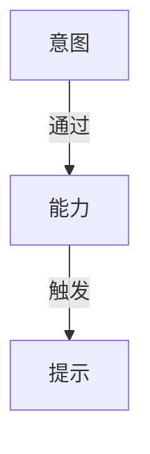
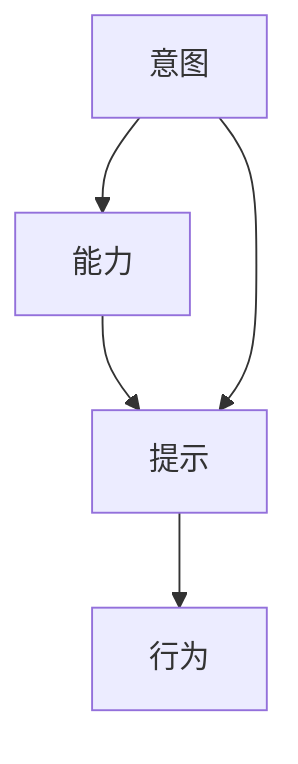

                 

# 运用福格模型培养团队良习惯

> 关键词：团队管理, 行为改变, 心理学, 效率提升, 行为设计, 行为科学

## 1. 背景介绍

### 1.1 问题由来
在快速变化、竞争激烈的技术领域，团队合作与个人效率显得尤为重要。传统的团队管理方法，如绩效评估、奖惩机制等，虽然能在一定程度上激励员工，但往往难以持久，甚至可能引发团队内部的紧张与对立。而心理学领域的“行为科学”研究，为提升团队凝聚力和绩效，提供了新的理论指导。

行为科学指出，人的行为由意图、能力、提示（Trigger）三方面共同驱动。利用这一发现，可以设计出能引导团队成员形成良习惯的行为模型，从而提升团队的凝聚力和工作效率。

本文将介绍福格模型（Fogg Behavior Model），这是一种基于行为科学的团队管理工具，用于系统性地培养团队成员形成良好的工作习惯，并提升团队整体绩效。

### 1.2 问题核心关键点
福格模型通过明确提出“行为 = 意图 + 能力 + 提示（Trigger）”这一核心公式，帮助管理者识别和塑造影响团队成员行为的关键因素，从而提升团队的整体效率和凝聚力。

- **意图（Intent）**：团队成员为什么做某件事？
- **能力（Ability）**：团队成员是否有做某件事的能力？
- **提示（Trigger）**：如何设计团队环境，使成员在特定情境下产生做某件事的冲动？

本文将深入探讨福格模型的原理，以及如何在团队管理中应用这一模型，帮助管理者更有效地培养团队成员的良习惯。

## 2. 核心概念与联系

### 2.1 核心概念概述

福格模型是一个简洁而强大的行为设计框架，主要包含三个关键变量：

- **意图（Intent）**：指团队成员希望达到的目标，驱动其行为的内部动机。
- **能力（Ability）**：指团队成员实现目标所需的资源（时间、技能、工具等），衡量其执行任务的可能性。
- **提示（Trigger）**：指能够激发行为的环境线索，通常包括时间、地点、情感等外部触发因素。

这些变量相互作用，共同决定了团队成员的行为倾向。以下是一个福格模型的示意图，展示了意图、能力、提示三者之间的关系：



通过调节意图、能力和提示，可以设计出有效的行为模型，引导团队成员形成良好的工作习惯。

### 2.2 核心概念原理和架构的 Mermaid 流程图



以上流程图示意，意图通过能力和提示的调节，最终引发团队成员采取特定的行为。以下是对每个变量的详细解释：

- **意图（Intent）**：明确团队成员的长期目标和短期任务，使其对工作的意义有深刻认识。
- **能力（Ability）**：评估团队成员的技能水平和资源配置，确保其具备完成任务的必要条件。
- **提示（Trigger）**：设计团队的工作流程和环境，确保在合适的时机激发团队成员完成任务的冲动。

## 3. 核心算法原理 & 具体操作步骤

### 3.1 算法原理概述

福格模型的核心原理是“行为 = 意图 + 能力 + 提示”。在团队管理中，通过优化这三个变量的相互作用，可以系统性地设计行为模型，引导团队成员形成良好习惯，提升团队整体绩效。

### 3.2 算法步骤详解

#### 3.2.1 确定团队意图

管理者应首先与团队成员讨论他们的长期目标和短期任务，明确团队的核心使命和工作重点。

**步骤**：
1. 召开全体会议，探讨团队的愿景和使命。
2. 将团队愿景转化为具体的、可操作的短期任务。

**示例**：
假设某技术团队的目标是“开发一款高效的新产品”，可以进一步细化为“完成需求分析报告”、“设计产品原型”、“进行用户测试”等短期任务。

#### 3.2.2 评估团队能力

评估团队成员的技能水平和资源配置，确保他们具备完成任务的必要能力。

**步骤**：
1. 进行技能盘点，列出团队成员的主要技能和专长。
2. 识别资源需求，包括时间、预算、工具等。
3. 进行资源分配，确保每个成员都能在各自擅长的领域发挥作用。

**示例**：
如果发现某团队成员擅长数据分析，但不熟悉用户体验设计，可以安排其专注于数据分析工作，而将用户体验设计的任务分配给擅长该领域的成员。

#### 3.2.3 设计团队提示

设计团队的工作流程和环境，确保在合适的时机激发团队成员完成任务的冲动。

**步骤**：
1. 确定关键事件和节点，如项目里程碑、周期性会议等。
2. 设计提示线索，使团队成员在特定情境下自动执行任务。
3. 实施并监测提示效果，不断调整优化。

**示例**：
可以设置每日站立会议，以回顾当天的工作进展和计划，同时进行问题解决和任务分配。这种每日的例会可以成为团队成员进行任务执行的提示。

### 3.3 算法优缺点

福格模型通过明确意图、能力和提示的互动关系，为团队管理提供了系统的行为设计方案。

**优点**：
1. **系统性**：将复杂的行为问题分解为可操作的步骤，易于理解和实施。
2. **灵活性**：可以根据实际情况，灵活调整意图、能力和提示，适应不同的团队和任务。
3. **可操作性**：通过具体的步骤和方法，管理者可以指导团队成员形成良好的工作习惯。

**缺点**：
1. **复杂性**：模型涉及多个变量，管理和实施可能需要较高的时间和精力投入。
2. **依赖性**：模型效果依赖于团队成员的主动性和环境支持，管理者的指导和监督至关重要。

### 3.4 算法应用领域

福格模型不仅适用于技术团队的管理，也可以应用到其他各种组织和团队，特别是在需要提升团队协作和效率的场合。

- **研发团队**：通过优化意图、能力和提示，提升项目开发进度和产品质量。
- **市场营销团队**：通过明确市场目标和提升资源配置，提高市场活动的效率和效果。
- **客户服务团队**：通过改善客户反馈流程和设计服务提示，提升客户满意度和忠诚度。
- **教育机构**：通过明确学生学习目标和设计教学提示，提高教育质量和学生参与度。

## 4. 数学模型和公式 & 详细讲解 & 举例说明

### 4.1 数学模型构建

福格模型中的意图、能力和提示，可以分别表示为数学变量：

- 意图：$I$，表示团队成员的目标和动机。
- 能力：$A$，表示团队成员实现目标所需的能力和资源。
- 提示：$T$，表示能够激发行为的外部线索和环境。

行为模型可以表示为：

$$
B = I \times A \times T
$$

其中 $B$ 表示行为，$I$、$A$、$T$ 分别代表意图、能力和提示。

### 4.2 公式推导过程

对于任意行为 $B$，可以通过公式推导出其意图、能力和提示的影响因子。

- 如果 $I=0$，则无论能力和提示如何，行为都不会发生。
- 如果 $A=0$，则意图和提示无法改变行为。
- 如果 $T=0$，则意图和能力无法激发行为。

通过公式，可以明确意图、能力和提示在行为形成中的关键作用，进而设计出有效的行为模型。

### 4.3 案例分析与讲解

假设某技术团队的目标是提高代码审查效率，通过福格模型进行分析和优化：

- **意图（Intent）**：提高代码审查效率，提升产品交付速度。
- **能力（Ability）**：团队成员具备代码审查技能，但缺乏自动化工具支持。
- **提示（Trigger）**：缺少定期的代码审查会议和流程化规范。

根据上述分析，可以设计以下行为模型：

- **意图（Intent）**：明确团队目标，制定提高代码审查效率的具体措施。
- **能力（Ability）**：引入自动化工具，如代码审查平台，提高审查效率。
- **提示（Trigger）**：每周进行一次代码审查会议，并制定审查规范和流程。

通过调整意图、能力和提示，团队成员可以更容易地实现目标，提升工作效率。

## 5. 项目实践：代码实例和详细解释说明

### 5.1 开发环境搭建

为了实现福格模型的应用，需要搭建一个团队协作平台，方便意图、能力和提示的设计和监测。以下是搭建环境的详细步骤：

1. **选择合适的协作平台**：
   - 可以选择像Trello、Jira、Asana等项目管理和团队协作工具。
   - 支持团队成员创建任务、分配资源和跟踪进度。

2. **设置项目管理工具**：
   - 创建项目、任务和子任务，明确团队目标和工作内容。
   - 设置里程碑和关键节点，规划团队工作流程。

3. **配置提示触发机制**：
   - 在协作平台中，设定每日、每周的提醒和通知，如站会提醒、进度更新等。

### 5.2 源代码详细实现

以下是一个简单的Python脚本示例，用于设置团队提示（站会提醒）：

```python
import time

def team_meeting_reminder():
    while True:
        # 检查当前时间是否为站会时间
        current_hour = time.localtime().tm_hour
        meeting_time = 10  # 站会时间假设为每日10点
        if current_hour == meeting_time:
            # 发送站会提醒
            print("It's time for our daily stand-up meeting!")
            # 这里可以调用邮件、短信、即时通讯等工具发送提醒
        time.sleep(60)  # 每隔1分钟检查一次时间

# 启动站会提醒程序
if __name__ == '__main__':
    team_meeting_reminder()
```

此脚本通过循环检查当前时间，如果当前时间为站会时间，则输出站会提醒。

### 5.3 代码解读与分析

**代码解释**：
- `team_meeting_reminder` 函数：用于循环检查当前时间，并在站会时间点输出提醒。
- `time.localtime()`：获取当前时间。
- `time.sleep(60)`：每隔1分钟检查一次时间。

**运行结果展示**：
在站会时间点，输出如下提醒信息：

```
It's time for our daily stand-up meeting!
```

此脚本通过简单的逻辑实现了站会提醒的功能，适用于团队管理中的福格模型应用。

## 6. 实际应用场景

### 6.1 项目开发

福格模型在项目开发中的应用场景包括：

- **需求管理**：明确项目需求和目标，并通过定期回顾和更新，确保团队成员始终关注核心任务。
- **任务分配**：根据团队成员的技能和能力，合理分配任务，提升工作效率。
- **进度跟踪**：通过定期的站会和工作汇报，跟踪项目进展，及时调整工作计划。

### 6.2 客户服务

福格模型在客户服务中的应用场景包括：

- **客户反馈管理**：设置定期客户反馈机制，确保客户声音能够及时传达，并形成改进措施。
- **服务流程优化**：通过明确服务流程和规范，提升服务质量和客户满意度。
- **员工培训**：定期开展员工培训和技能提升，确保团队成员具备持续提供优质服务的能力。

### 6.3 市场营销

福格模型在市场营销中的应用场景包括：

- **市场目标设定**：明确市场目标和策略，确保团队成员能够围绕核心任务展开工作。
- **资源配置**：合理分配营销资源，确保每个团队成员都能充分发挥其专长。
- **活动执行**：通过定期的市场活动策划和复盘，提升市场活动的执行效果和效率。

### 6.4 未来应用展望

未来，福格模型将在更多领域得到应用，成为提升团队绩效和协作的重要工具。

- **远程办公**：通过优化远程工作的意图、能力和提示，提升远程团队的工作效率和协作效果。
- **跨部门协作**：通过跨部门协作平台的建设，明确各部门的共同目标和协作方式，提升整体绩效。
- **创新驱动**：通过激发团队成员的创新意图，优化创新环境和资源配置，提升团队的创新能力和竞争力。

## 7. 工具和资源推荐

### 7.1 学习资源推荐

- **书籍**：《行为设计学：如何塑造目标导向的组织文化》（James M. Champernowne）
- **在线课程**：Coursera上的《行为设计基础》课程
- **博客**：《行为科学》系列博客文章

### 7.2 开发工具推荐

- **项目管理工具**：Trello、Jira、Asana
- **协作工具**：Slack、Microsoft Teams、Discord

### 7.3 相关论文推荐

- James M. Champernowne, "Mindset as a Mediator of Behavior"
- Martin Seligman, "Mindfulness and Well-Being"
- BJ Fogg, "The Behavior Model of Technology Adoption"

## 8. 总结：未来发展趋势与挑战

### 8.1 研究成果总结

本文介绍了福格模型在团队管理中的应用，通过明确意图、能力和提示的关系，设计出有效的行为模型，引导团队成员形成良好的工作习惯。福格模型不仅适用于技术团队，还可以应用于各种组织和团队，提升整体绩效和协作效果。

### 8.2 未来发展趋势

未来，福格模型将在更多领域得到应用和推广。

- **人工智能和自动化**：通过行为设计，提升人工智能系统的可解释性和用户友好度。
- **教育培训**：通过设计教育行为模型，提升学生的学习效果和教育质量。
- **健康管理**：通过行为设计，提升人们的健康意识和健康行为，促进健康管理。

### 8.3 面临的挑战

尽管福格模型在团队管理中具有显著优势，但也面临一些挑战。

- **复杂性**：模型涉及多个变量，管理和实施可能需要较高的时间和精力投入。
- **依赖性**：模型效果依赖于团队成员的主动性和环境支持，管理者的指导和监督至关重要。

### 8.4 研究展望

未来的研究需要在以下几个方面寻求新的突破：

- **更智能的提示设计**：利用人工智能和大数据分析，设计更精准和个性化的提示机制。
- **动态调整意图**：通过实时反馈和调整，动态优化团队意图和目标，适应变化的环境和需求。
- **跨领域应用推广**：将福格模型应用于更多领域和场景，提升各行业的协作和效率。

福格模型作为一种行为设计工具，为团队管理提供了新的思路和方法。通过不断优化意图、能力和提示的互动关系，可以系统性地提升团队绩效和协作效果，为组织的持续发展提供动力。

## 9. 附录：常见问题与解答

**Q1: 如何识别团队的意图？**

A: 可以通过召开全体会议、设定共同目标、制定项目计划等方式，明确团队的长期目标和短期任务。

**Q2: 如何评估团队能力？**

A: 可以进行技能盘点，识别团队成员的主要技能和专长；评估资源需求，确保团队具备完成任务的必要条件。

**Q3: 如何设计团队提示？**

A: 可以通过设置定期会议、制定任务提醒、设计工作流程等方式，确保在合适的时机激发团队成员完成任务的冲动。

**Q4: 如何优化福格模型？**

A: 可以定期评估模型的效果，根据实际情况调整意图、能力和提示的设计，不断优化模型的应用效果。

---

作者：禅与计算机程序设计艺术 / Zen and the Art of Computer Programming

