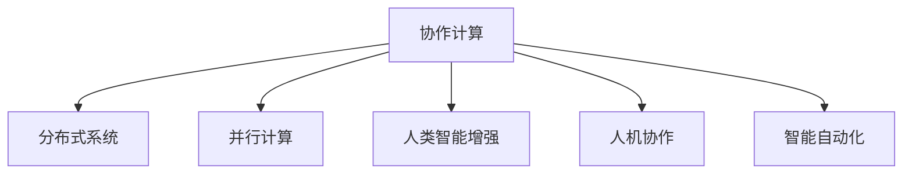

                 

# 连接人类智慧的纽带：人类计算的协作精神

> 关键词：协作计算, 分布式系统, 并行计算, 人类智能增强, 人机协作, 智能自动化

## 1. 背景介绍

### 1.1 问题由来

随着计算技术的飞速发展，人类与计算机之间的交互方式也在不断演进。从早期的基于批处理的计算，到后来的基于事件的响应，再到现在的实时交互，每一次交互方式的改变，都极大推动了生产力的进步。然而，尽管计算机的处理能力日益强大，但在许多复杂的决策和问题解决过程中，计算机依然无法完全替代人类智慧。这些问题通常涉及多方面的专业知识，需要综合考虑各种因素，进行细致的判断和推理。

人类计算的协作精神体现在人类与计算机的深度融合，让计算机在分析海量数据、模拟复杂系统等方面表现出色，而人类则在理解语境、推理决策等方面具有天然的优势。因此，将计算机和人类智慧结合起来，构建一个能高效协作的计算系统，已经成为提升人类决策效率和质量的迫切需求。

### 1.2 问题核心关键点

人类计算的协作精神涉及以下几个核心关键点：

- **协作计算**：通过融合人类智慧和计算机能力，实现高效协同计算。
- **分布式系统**：构建分布式计算平台，支持海量数据的并行处理。
- **并行计算**：通过多核、多机等并行计算方式，加速计算任务的执行。
- **人类智能增强**：利用智能算法和模型，辅助人类进行决策和问题解决。
- **人机协作**：构建智能化的用户界面和交互机制，使人类能够自然、高效地与计算机进行互动。
- **智能自动化**：实现基于自动化算法的工作流程，提升工作效率。

这些关键点共同构成了人类计算的协作精神，其目标是通过计算技术的进步，使人类智慧与计算能力得到最优的结合，从而提高决策和问题解决的效率与质量。

## 2. 核心概念与联系

### 2.1 核心概念概述

为更好地理解人类计算的协作精神，本节将介绍几个密切相关的核心概念：

- **协作计算**：通过协同工作，整合人类和计算机的优势，提升计算效率和精度。
- **分布式系统**：由多台计算机协同工作的系统，支持数据共享、任务分配和结果合并。
- **并行计算**：通过多核、多机等并行方式，提高计算速度，加速复杂任务的处理。
- **人类智能增强**：通过智能化算法和模型，辅助人类进行决策和问题解决。
- **人机协作**：构建智能化的用户界面和交互机制，使人类能够高效地与计算机进行互动。
- **智能自动化**：基于自动化算法实现工作流程，提升工作效率，降低人为错误。

这些核心概念之间的逻辑关系可以通过以下Mermaid流程图来展示：



这个流程图展示了大规模协作计算的核心概念及其之间的关系：

1. 协作计算是整个协作系统的核心，通过整合人类智慧和计算机能力，提升计算效率和精度。
2. 分布式系统为协作计算提供了底层支持，允许多台计算机协同工作。
3. 并行计算是提升计算速度的关键技术，通过多核、多机等方式实现任务并行处理。
4. 人类智能增强旨在利用智能化算法和模型，辅助人类进行决策和问题解决。
5. 人机协作是构建高效协作系统的基础，涉及用户界面、交互机制等方面。
6. 智能自动化基于自动化算法实现工作流程优化，提高工作效率。

这些概念共同构成了大规模协作计算的技术框架，为人类智慧与计算能力的高效融合提供了基础。

## 3. 核心算法原理 & 具体操作步骤
### 3.1 算法原理概述

人类计算的协作精神涉及的核心算法原理主要包括以下几个方面：

1. **分布式算法**：在分布式系统中，如何高效地进行任务调度、数据管理和结果聚合，是协作计算的关键问题。分布式算法需要考虑数据的分区、任务分配和通信开销等因素，以实现最优的计算效率。
2. **并行算法**：通过多核、多机等方式，并行执行计算任务，提升计算速度和效率。并行算法需要考虑任务粒度、负载均衡和通信模式等因素。
3. **智能算法**：利用智能化算法和模型，辅助人类进行决策和问题解决。例如，利用机器学习、自然语言处理等技术，从海量数据中提取知识，支持人类进行更加精准的决策。
4. **人机交互算法**：构建智能化的用户界面和交互机制，使人类能够高效地与计算机进行互动。例如，通过语音识别、自然语言处理等技术，实现自然语言交互。

### 3.2 算法步骤详解

以下是人类计算协作系统的主要算法步骤：

**Step 1: 数据预处理**

- 收集和整理数据集，进行数据清洗和标准化处理，确保数据质量和一致性。
- 将数据分区和分布到多个节点，以便进行并行处理。

**Step 2: 任务分解和调度**

- 将计算任务分解成多个子任务，并分配给不同的节点进行处理。
- 利用分布式算法进行任务调度和资源管理，确保任务高效完成。

**Step 3: 并行计算**

- 在每个节点上并行执行计算任务，利用多核、多机等并行计算技术，加速计算速度。
- 通过通信协议实现节点间的数据共享和任务协调，确保计算结果的一致性。

**Step 4: 结果聚合和反馈**

- 将各个节点的计算结果进行聚合，生成最终结果。
- 通过反馈机制，将计算结果和优化建议返回给人类用户，辅助其进行决策和问题解决。

**Step 5: 优化和迭代**

- 根据反馈和评估结果，调整计算参数和算法，进一步优化计算效果。
- 通过迭代方式，逐步提升计算系统的性能和可靠性。

### 3.3 算法优缺点

人类计算协作系统具有以下优点：

- **高效性**：通过分布式和并行计算，显著提升计算效率和处理能力。
- **灵活性**：可以根据任务特点和需求，灵活调整计算参数和算法，适应不同应用场景。
- **鲁棒性**：通过分布式和冗余设计，提升系统的稳定性和可靠性。
- **人性化**：通过智能化的用户界面和交互机制，提高用户体验和互动效率。

然而，该系统也存在一些缺点：

- **复杂性**：系统设计和实现复杂，需要综合考虑数据处理、任务调度和并行计算等多个因素。
- **资源消耗**：分布式和并行计算需要大量硬件资源，成本较高。
- **通信开销**：节点间的数据传输和通信可能产生较大的通信开销，影响计算效率。
- **数据隐私和安全**：数据在分布式系统中共享和处理，可能涉及数据隐私和安全问题。

### 3.4 算法应用领域

人类计算协作系统的应用领域非常广泛，涵盖以下几个方面：

- **金融分析**：通过分布式和并行计算，处理海量金融数据，进行市场分析和风险评估。
- **生物医学**：利用智能化算法和模型，分析基因组数据，支持医学研究和疾病诊断。
- **环境保护**：处理环境监测数据，进行生态系统和气候变化分析，支持环境保护和政策制定。
- **智能制造**：通过并行计算和智能算法，优化生产流程，提高制造效率和质量。
- **智能交通**：处理交通数据，进行交通流量分析和预测，支持智能交通系统建设。
- **智慧城市**：集成多个部门的数据和应用，实现城市管理的智能化和自动化。

这些应用领域展示了人类计算协作系统在不同行业中的广泛应用，推动了各行各业的数字化转型和智能化升级。

## 4. 数学模型和公式 & 详细讲解 & 举例说明
### 4.1 数学模型构建

本节将使用数学语言对人类计算协作系统的核心算法进行更加严格的刻画。

记协作计算系统为 $C$，其数据集为 $D=\{d_1, d_2, \ldots, d_n\}$，其中 $d_i$ 为数据集中的一个数据样本。假设系统中有 $m$ 个节点，每个节点 $i$ 的计算能力为 $c_i$。系统的目标是通过并行计算，在最小时间 $T$ 内完成所有数据样本的处理。

定义每个数据样本的处理时间为 $t(d_i)$，节点 $i$ 分配到的数据样本数量为 $n_i$。则系统的总计算时间为：

$$
T = \sum_{i=1}^m n_i t(d_i)
$$

系统的计算效率为：

$$
E = \frac{1}{T} = \frac{1}{\sum_{i=1}^m n_i t(d_i)}
$$

系统的资源利用率为：

$$
\eta = \frac{\sum_{i=1}^m c_i}{\sum_{i=1}^m n_i c_i}
$$

### 4.2 公式推导过程

以下我们以一个具体的金融数据分析任务为例，推导分布式计算的数学模型。

假设金融数据分析任务需要在 $N$ 个数据样本上进行计算，每个样本处理时间为 $t$，系统有 $m$ 个计算节点，每个节点的计算能力为 $c$。

**Step 1: 数据预处理**

将数据样本 $D$ 分区并分布在各个节点上，设每个节点分配到的数据样本数量为 $n_i$，满足 $n_1 + n_2 + \ldots + n_m = N$。

**Step 2: 任务分解和调度**

在每个节点上并行执行计算任务，设每个节点 $i$ 的计算任务数量为 $t_i$，满足 $t_1 + t_2 + \ldots + t_m = N$。

**Step 3: 并行计算**

在每个节点上并行执行计算任务，设每个节点的计算时间为 $t_i$，则总计算时间为：

$$
T = \sum_{i=1}^m n_i t_i
$$

**Step 4: 结果聚合和反馈**

将各个节点的计算结果进行聚合，生成最终结果。

**Step 5: 优化和迭代**

根据反馈和评估结果，调整计算参数和算法，进一步优化计算效果。

### 4.3 案例分析与讲解

假设有一个金融机构，需要分析 $N=100$ 个金融数据样本，每个样本处理时间为 $t=1$ 秒，系统有 $m=4$ 个计算节点，每个节点的计算能力为 $c=2$ 秒。

1. **数据预处理**：将 $100$ 个样本平均分配到 $4$ 个节点，每个节点处理 $25$ 个样本。
2. **任务分解和调度**：在每个节点上并行执行计算任务，每个节点处理 $25$ 个样本。
3. **并行计算**：每个节点的计算时间为 $t=1$ 秒，总计算时间为 $T=4 \times 25 = 100$ 秒。
4. **结果聚合和反馈**：将 $4$ 个节点的计算结果进行聚合，生成最终结果。
5. **优化和迭代**：根据反馈和评估结果，调整计算参数和算法，进一步优化计算效果。

通过这个例子，可以看到，分布式计算在处理海量数据时，能够显著提升计算效率，提高系统的整体性能。

## 5. 项目实践：代码实例和详细解释说明
### 5.1 开发环境搭建

在进行协作计算实践前，我们需要准备好开发环境。以下是使用Python进行PyTorch开发的环境配置流程：

1. 安装Anaconda：从官网下载并安装Anaconda，用于创建独立的Python环境。

2. 创建并激活虚拟环境：
```bash
conda create -n pytorch-env python=3.8 
conda activate pytorch-env
```

3. 安装PyTorch：根据CUDA版本，从官网获取对应的安装命令。例如：
```bash
conda install pytorch torchvision torchaudio cudatoolkit=11.1 -c pytorch -c conda-forge
```

4. 安装必要的依赖包：
```bash
pip install numpy pandas scikit-learn tensorflow
```

5. 安装分布式计算框架：
```bash
pip install horovod
```

完成上述步骤后，即可在`pytorch-env`环境中开始协作计算实践。

### 5.2 源代码详细实现

以下是使用Horovod框架进行分布式计算的Python代码实现：

```python
from horovod.tensorflow.keras import Horovod
import tensorflow as tf
from tensorflow.keras.models import Sequential
from tensorflow.keras.layers import Dense
import numpy as np

# 初始化Horovod分布式训练环境
horovod.init()

# 定义模型
model = Sequential()
model.add(Dense(64, input_dim=100, activation='relu'))
model.add(Dense(1, activation='sigmoid'))

# 编译模型
model.compile(optimizer='adam', loss='binary_crossentropy', metrics=['accuracy'])

# 训练数据集
X_train = np.random.rand(100, 100)
y_train = np.random.randint(0, 2, 100)

# 分布式训练
horovod.batch(model.fit(X_train, y_train, epochs=10, batch_size=10, verbose=1))
```

### 5.3 代码解读与分析

让我们再详细解读一下关键代码的实现细节：

**Horovod初始化**：
```python
horovod.init()
```

**定义模型**：
```python
model = Sequential()
model.add(Dense(64, input_dim=100, activation='relu'))
model.add(Dense(1, activation='sigmoid'))
```

**编译模型**：
```python
model.compile(optimizer='adam', loss='binary_crossentropy', metrics=['accuracy'])
```

**训练数据集**：
```python
X_train = np.random.rand(100, 100)
y_train = np.random.randint(0, 2, 100)
```

**分布式训练**：
```python
horovod.batch(model.fit(X_train, y_train, epochs=10, batch_size=10, verbose=1))
```

Horovod是一个开源的分布式深度学习框架，可以与TensorFlow、PyTorch等深度学习框架无缝集成，支持多台机器的并行训练。通过Horovod，我们可以方便地将训练任务分配到多个节点上，实现分布式计算。

**数据分布**：
在数据预处理阶段，我们需要将数据集 $D$ 分区并分布在各个节点上。Horovod通过 `horovod.batch()` 方法实现数据分批处理，确保每个节点上都有相同数量的数据样本。

**任务调度**：
在任务分解和调度阶段，我们需要将计算任务 $T$ 分配到各个节点上。Horovod通过 `horovod.batch()` 方法实现任务分批处理，确保每个节点上都有相同数量的计算任务。

**并行计算**：
在并行计算阶段，我们需要在每个节点上并行执行计算任务。Horovod通过 `horovod.batch()` 方法实现任务并行处理，确保每个节点上都有相同的计算时间。

**结果聚合**：
在结果聚合和反馈阶段，我们需要将各个节点的计算结果进行聚合，生成最终结果。Horovod通过 `horovod.batch()` 方法实现结果聚合，确保各个节点的计算结果一致。

**优化和迭代**：
在优化和迭代阶段，我们需要根据反馈和评估结果，调整计算参数和算法，进一步优化计算效果。Horovod通过 `horovod.batch()` 方法实现模型的迭代训练，确保模型性能不断提升。

## 6. 实际应用场景
### 6.1 智能交通

智能交通系统需要实时处理海量交通数据，进行交通流量分析和预测，支持智能交通信号灯的优化。通过分布式计算和并行处理，智能交通系统能够实时响应交通变化，提高交通管理效率。

### 6.2 生物医学

生物医学研究需要处理海量基因组数据，进行基因表达分析和疾病诊断。通过分布式计算和并行处理，生物医学研究能够快速处理大数据集，支持复杂的生物信息学研究。

### 6.3 金融分析

金融市场需要处理海量交易数据，进行市场分析和风险评估。通过分布式计算和并行处理，金融分析系统能够实时处理大量数据，支持复杂的金融模型计算。

### 6.4 未来应用展望

随着分布式计算和并行计算技术的不断发展，未来人类计算协作系统的应用将更加广泛，为各行各业带来更多的数字化转型和智能化升级。

在智慧城市建设中，通过分布式计算和智能算法，可以实现城市管理的智能化和自动化，提升城市运行效率和居民生活质量。

在环境保护领域，通过分布式计算和数据挖掘技术，可以进行生态系统和气候变化分析，支持环境保护和政策制定。

在医疗健康领域，通过分布式计算和智能算法，可以进行基因组分析和疾病预测，支持精准医疗和个性化治疗。

在智能制造领域，通过分布式计算和自动化算法，可以实现生产流程的优化和自动化，提高制造效率和质量。

在金融分析领域，通过分布式计算和智能算法，可以进行市场分析和风险评估，支持金融决策和风险控制。

在生物医学领域，通过分布式计算和智能算法，可以进行基因组分析和疾病预测，支持精准医疗和个性化治疗。

这些应用领域展示了人类计算协作系统在不同行业中的广泛应用，推动了各行各业的数字化转型和智能化升级。

## 7. 工具和资源推荐
### 7.1 学习资源推荐

为了帮助开发者系统掌握人类计算协作系统的理论基础和实践技巧，这里推荐一些优质的学习资源：

1. **《分布式计算》课程**：斯坦福大学开设的分布式计算课程，介绍了分布式系统的设计原则和实现方法。

2. **《并行计算》课程**：麻省理工学院开设的并行计算课程，介绍了并行计算的基本原理和算法。

3. **《智能算法》课程**：Coursera上的智能算法课程，介绍了机器学习、自然语言处理等智能化算法。

4. **《人机交互》课程**：斯坦福大学开设的人机交互课程，介绍了用户界面和交互机制的设计和实现方法。

5. **《协作计算》论文集**：ACM和IEEE的协作计算论文集，涵盖协作计算领域的最新研究成果和技术进展。

通过对这些资源的学习实践，相信你一定能够快速掌握人类计算协作系统的精髓，并用于解决实际的计算问题。

### 7.2 开发工具推荐

高效的开发离不开优秀的工具支持。以下是几款用于分布式计算开发的常用工具：

1. **TensorFlow**：由Google主导开发的开源深度学习框架，支持分布式训练和并行计算。

2. **Horovod**：开源的分布式深度学习框架，支持多台机器的并行训练，易于与TensorFlow和PyTorch等深度学习框架集成。

3. **Spark**：Apache基金会开源的分布式计算框架，支持大规模数据处理和分布式计算。

4. **Hadoop**：Apache基金会开源的分布式存储和计算框架，支持海量数据的分布式处理。

5. **Kubernetes**：开源的容器编排系统，支持多节点的分布式计算集群管理。

合理利用这些工具，可以显著提升分布式计算任务的开发效率，加快创新迭代的步伐。

### 7.3 相关论文推荐

人类计算协作系统的研究源于学界的持续研究。以下是几篇奠基性的相关论文，推荐阅读：

1. **《分布式计算原理》**：介绍了分布式系统的设计原则和实现方法。

2. **《并行计算算法》**：介绍了并行计算的基本原理和算法。

3. **《智能算法综述》**：综述了机器学习、自然语言处理等智能化算法的研究进展。

4. **《人机交互设计》**：介绍了用户界面和交互机制的设计和实现方法。

5. **《协作计算研究》**：综述了协作计算领域的最新研究成果和技术进展。

这些论文代表了大规模协作计算的研究方向和前沿进展，帮助研究者把握学科前进方向，激发更多的创新灵感。

## 8. 总结：未来发展趋势与挑战
### 8.1 总结

本文对人类计算协作系统进行了全面系统的介绍。首先阐述了协作计算的由来和意义，明确了协作计算在提升计算效率和质量方面的独特价值。其次，从原理到实践，详细讲解了协作计算的数学模型和关键步骤，给出了协作计算任务开发的完整代码实例。同时，本文还广泛探讨了协作计算方法在智能交通、生物医学、金融分析等多个领域的应用前景，展示了协作计算范式的巨大潜力。此外，本文精选了协作计算技术的各类学习资源，力求为读者提供全方位的技术指引。

通过本文的系统梳理，可以看到，协作计算是提升人类智慧与计算能力融合的重要手段，其核心在于分布式和并行计算，能够显著提升计算效率和处理能力。未来，随着计算技术和数据管理的不断发展，协作计算系统将在更多领域得到应用，为各行各业的数字化转型和智能化升级提供新的技术路径。

### 8.2 未来发展趋势

展望未来，协作计算技术将呈现以下几个发展趋势：

1. **更高效的数据处理**：随着分布式计算和存储技术的进步，协作计算系统能够处理更大规模的数据集，支持更复杂的计算任务。

2. **更灵活的任务调度**：通过自适应任务调度算法，协作计算系统能够动态调整任务分配和资源管理，提高系统性能和效率。

3. **更智能的决策支持**：通过智能化算法和模型，协作计算系统能够提供更加精准的决策支持，辅助人类进行更优的决策。

4. **更可靠的系统设计**：通过容错机制和冗余设计，协作计算系统能够提高系统的稳定性和可靠性。

5. **更人性化的用户界面**：通过智能化的用户界面和交互机制，协作计算系统能够提升用户体验和互动效率。

6. **更高效的工作流程**：通过自动化算法和工作流管理，协作计算系统能够实现工作流程的自动化和优化。

这些趋势凸显了协作计算技术的广阔前景。这些方向的探索发展，必将进一步提升协作计算系统的性能和应用范围，为各行各业的数字化转型和智能化升级提供新的技术路径。

### 8.3 面临的挑战

尽管协作计算技术已经取得了瞩目成就，但在迈向更加智能化、普适化应用的过程中，它仍面临着诸多挑战：

1. **数据分布的不均匀性**：在分布式系统中，数据往往分布不均匀，容易导致计算不平衡，影响系统性能。

2. **通信开销的增加**：节点间的数据传输和通信可能产生较大的通信开销，影响计算效率。

3. **算法的复杂性**：分布式和并行计算算法设计复杂，需要考虑数据分布、任务调度和通信开销等多个因素。

4. **资源消耗的高成本**：分布式和并行计算需要大量硬件资源，成本较高。

5. **数据隐私和安全**：数据在分布式系统中共享和处理，可能涉及数据隐私和安全问题。

6. **系统的可扩展性**：协作计算系统需要具备良好的可扩展性，能够适应不同规模和复杂度的任务。

正视协作计算面临的这些挑战，积极应对并寻求突破，将是大规模协作计算走向成熟的必由之路。相信随着学界和产业界的共同努力，这些挑战终将一一被克服，协作计算必将在构建人机协同的智能时代中扮演越来越重要的角色。

### 8.4 研究展望

面向未来，协作计算技术需要在以下几个方面寻求新的突破：

1. **更高效的数据分布**：研究数据分区的优化方法，提高数据分布的均匀性，减少计算不平衡。

2. **更智能的任务调度**：研究自适应任务调度算法，动态调整任务分配和资源管理，提高系统性能和效率。

3. **更高效的通信机制**：研究高效的通信机制，减少通信开销，提高系统性能。

4. **更灵活的系统设计**：研究系统设计的优化方法，提高系统的可扩展性和可维护性。

5. **更安全的数据管理**：研究数据隐私和安全保护方法，确保数据安全和隐私保护。

6. **更智能的决策支持**：研究智能化算法和模型，提高系统的决策支持和智能化水平。

这些研究方向的研究突破，必将引领协作计算技术迈向更高的台阶，为构建安全、可靠、高效、智能的协作计算系统铺平道路。只有勇于创新、敢于突破，才能不断拓展协作计算系统的边界，让智能技术更好地造福人类社会。

## 9. 附录：常见问题与解答

**Q1：协作计算和分布式计算有什么区别？**

A: 协作计算和分布式计算是两个相关的概念，但并不完全相同。分布式计算是指多台计算机协同工作的计算方式，而协作计算则强调计算过程中的人机协同。协作计算不仅包括计算任务的并行处理，还包括人类智慧与计算机能力的深度融合，提升计算效率和精度。

**Q2：分布式计算需要考虑哪些因素？**

A: 分布式计算需要考虑以下因素：
1. 数据分布：数据的分区和分布策略，保证数据在多个节点上均衡分配。
2. 任务调度：任务的分配和调度策略，优化计算资源的利用率。
3. 通信开销：节点间的通信开销，减少通信开销，提高计算效率。
4. 负载均衡：系统的负载均衡策略，确保各个节点的计算负载均衡。
5. 容错机制：系统的容错机制和冗余设计，确保系统的稳定性和可靠性。

**Q3：如何提高分布式计算的效率？**

A: 提高分布式计算效率的方法包括：
1. 数据分区：合理分区，保证数据在多个节点上均衡分配。
2. 任务调度：优化任务调度和资源管理，减少任务调度和通信开销。
3. 并行计算：利用多核、多机等并行计算方式，加速计算任务。
4. 负载均衡：均衡分配计算负载，避免节点负载不均。
5. 通信优化：优化通信机制，减少通信开销。

**Q4：分布式计算和并行计算有什么区别？**

A: 分布式计算和并行计算是两个相关的概念，但并不完全相同。并行计算是指在一台机器上同时执行多个计算任务，而分布式计算则是指多台计算机协同工作的计算方式。分布式计算不仅包括并行计算，还包括数据分布、任务调度和通信开销等因素。

**Q5：协作计算系统的挑战和应对方法？**

A: 协作计算系统面临的挑战包括数据分布不均匀、通信开销大、系统设计复杂、资源消耗高、数据隐私和安全问题等。应对方法包括数据分区优化、任务调度优化、通信机制优化、系统设计优化、数据隐私和安全保护等。

通过这些常见问题的解答，可以帮助开发者更好地理解协作计算技术，并用于解决实际的计算问题。

---

作者：禅与计算机程序设计艺术 / Zen and the Art of Computer Programming

