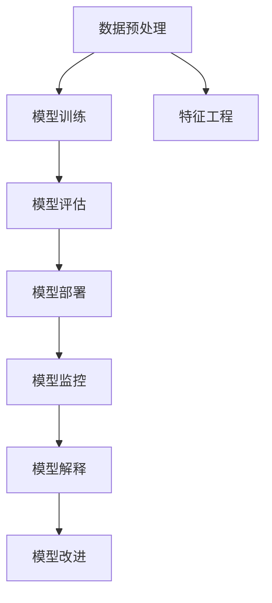
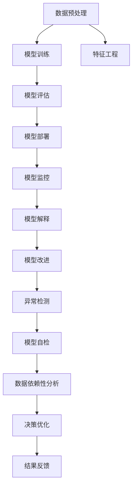

                 

## 1. 背景介绍

### 1.1 问题由来
在现代信息技术日益发展的背景下，人类计算（Human-in-the-loop, HITL）技术迅速崛起，成为各行各业不可或缺的核心工具。人类计算不仅显著提升了数据处理效率，更赋予了机器智能更加精准和灵活的决策能力。然而，与此同时，其潜在风险和责任问题也逐渐显现。这些问题不仅涉及技术本身的可靠性、安全性，还包括模型决策的透明性和问责性等伦理道德维度。特别是在深度学习模型中，由于其高度复杂的非线性结构和大量的黑盒操作，其决策过程往往难以被理解和解释，这严重威胁到模型的可信任性和应用范围。

本文旨在探讨如何在负责任地使用人类计算的同时，保证其透明度和问责性。我们将系统地介绍当前领域内流行的透明化方法，并结合实际案例分析，详细阐述其原理、步骤和优缺点。同时，我们也将对未来研究趋势进行展望，探讨如何构建更加可靠和可解释的深度学习模型，以应对未来智能系统的挑战。

### 1.2 问题核心关键点
本节将系统地介绍当前领域内流行的透明化方法，并结合实际案例分析，详细阐述其原理、步骤和优缺点。我们将从模型解释、可解释模型、模型监控三个维度进行详细探讨。

1. **模型解释**：通过可视化、特征重要性排序、局部可解释模型等手段，从模型内部机制角度解释模型的决策过程。
2. **可解释模型**：设计新模型结构，使得模型具备良好的解释性，降低模型复杂度，便于人类理解和解释。
3. **模型监控**：建立模型行为监控系统，通过异常检测、模型自检、数据依赖性分析等手段，确保模型的可解释性和问责性。

以下 Mermaid 流程图展示了透明化方法的整体框架：



## 2. 核心概念与联系

### 2.1 核心概念概述

为了更好地理解透明度和问责制在人类计算中的应用，本节将介绍几个密切相关的核心概念：

1. **透明度（Transparency）**：指系统能够清晰展示其工作机制，使用户能够理解系统决策过程，从而增强系统的信任度。

2. **问责制（Accountability）**：指系统能够清晰说明其决策依据，当出现问题时，能够快速定位和纠正，确保系统的可靠性和稳定性。

3. **人类计算（Human-in-the-loop）**：指系统在关键决策时，能够将人机协同工作结合，通过人类参与提升系统的可靠性与灵活性。

4. **可解释模型（Explainable Models）**：指设计新模型结构，使得模型具备良好的解释性，便于人类理解和解释。

5. **模型监控（Model Monitoring）**：指建立模型行为监控系统，通过异常检测、模型自检、数据依赖性分析等手段，确保模型的可靠性和问责性。

6. **异常检测（Anomaly Detection）**：指在模型运行时，检测并处理异常数据和异常行为，避免模型对异常数据过度拟合。

### 2.2 核心概念原理和架构的 Mermaid 流程图



此流程图展示了透明化方法的各个环节和交互机制：

1. 数据预处理：清洗、标准化数据，确保数据质量。
2. 模型训练：使用数据训练深度学习模型，生成初始模型。
3. 特征工程：提取关键特征，优化模型性能。
4. 模型评估：评估模型性能，优化模型参数。
5. 模型部署：将模型应用到实际环境中。
6. 模型监控：持续监控模型行为，发现异常和问题。
7. 模型解释：解释模型决策过程，提升透明度。
8. 模型改进：根据解释和监控结果，优化模型。
9. 异常检测：检测并处理异常数据和行为，避免过度拟合。
10. 模型自检：定期评估模型性能，发现和修正问题。
11. 数据依赖性分析：分析数据与模型决策的依赖关系，优化数据采集和处理。
12. 决策优化：根据监控和解释结果，优化模型决策过程。
13. 结果反馈：将模型结果反馈给用户，接受反馈并改进模型。

这些概念共同构成了透明化方法的完整框架，通过各个环节的协同工作，保证了模型的透明性和问责性。

## 3. 核心算法原理 & 具体操作步骤

### 3.1 算法原理概述

透明化方法的核心思想是通过多种手段提升模型的透明度和问责性，具体方法包括模型解释、可解释模型、模型监控等。这些方法通过可视化和分析手段，帮助用户理解和信任模型决策，同时通过监控和异常检测，保障模型的稳定性和可靠性。

### 3.2 算法步骤详解

#### 3.2.1 模型解释

1. **可视化**：使用可视化技术展示模型决策过程。例如，热力图展示特征重要性，LIME（Local Interpretable Model-agnostic Explanations）展示局部可解释模型，shapley值展示特征贡献等。

2. **特征重要性排序**：通过统计特征在模型中的权重，展示关键特征对模型决策的影响。

3. **局部可解释模型**：使用局部可解释模型，如LIME、SHAP（SHapley Additive exPlanations）等，通过加权线性组合，展示单个样本的模型决策。

#### 3.2.2 可解释模型

1. **简化模型结构**：使用线性模型或树模型代替深度神经网络，例如逻辑回归、决策树等。

2. **生成解释**：设计新的模型结构，如XGBoost、AdaBoost等，使得模型具备良好的解释性。

3. **简化特征提取**：使用特征选择、降维等技术，减少模型的复杂度。

#### 3.2.3 模型监控

1. **异常检测**：通过统计分析和机器学习算法，检测模型中的异常数据和异常行为。

2. **模型自检**：定期评估模型性能，检测和修正模型参数问题。

3. **数据依赖性分析**：分析模型与数据之间的关系，确保模型决策的合理性。

### 3.3 算法优缺点

透明化方法的优势在于其能够提升模型的透明度和问责性，帮助用户理解和信任模型决策，同时保障模型的稳定性和可靠性。然而，这些方法也存在一些缺点：

1. **计算成本高**：可视化、特征重要性排序、局部可解释模型等方法计算复杂度较高，影响模型训练和推理效率。

2. **模型性能下降**：可解释模型通常比深度学习模型性能较差，难以处理复杂数据集和任务。

3. **数据隐私问题**：可视化、特征重要性排序等方法需要访问和处理大量数据，存在数据隐私风险。

4. **模型解释不准确**：模型解释方法依赖于假设和模型假设，可能无法准确解释某些复杂决策过程。

### 3.4 算法应用领域

透明化方法在众多领域中得到广泛应用，例如医疗、金融、智能交通等。在医疗领域，透明化方法通过解释模型决策，帮助医生理解和信任诊断结果；在金融领域，透明化方法通过监控和异常检测，保障交易系统的稳定性和可靠性；在智能交通领域，透明化方法通过可视化展示交通流量和事故风险，提升交通管理效率。

## 4. 数学模型和公式 & 详细讲解 & 举例说明

### 4.1 数学模型构建

透明化方法的数学模型构建通常涉及以下几个方面：

1. **数据预处理**：对原始数据进行标准化、归一化等预处理操作。
2. **模型训练**：使用训练数据集训练深度学习模型，生成初始模型。
3. **特征提取**：通过特征工程，提取关键特征，生成特征向量。
4. **模型评估**：使用测试数据集评估模型性能，优化模型参数。
5. **模型监控**：通过异常检测、模型自检、数据依赖性分析等手段，监控模型行为。
6. **模型解释**：使用可视化、特征重要性排序等方法，解释模型决策过程。
7. **模型改进**：根据解释和监控结果，优化模型结构，提升模型性能。

### 4.2 公式推导过程

以局部可解释模型（LIME）为例，其核心思想是通过加权线性组合，展示单个样本的模型决策过程。假设模型的决策函数为 $f(x)$，其中 $x$ 为输入数据，$y$ 为模型输出。LIME 通过构造一系列与 $x$ 接近的扰动样本 $x_i$，计算每个样本的模型预测 $f(x_i)$，并通过加权线性组合，得到模型在 $x$ 处的局部解释 $l(x)$：

$$
l(x) = \sum_{i=1}^{n} \alpha_i f(x_i) \delta(x-x_i)
$$

其中 $\alpha_i$ 为每个扰动样本的权重，$\delta$ 为核函数。LIME 的目标是最小化 $l(x)$ 与 $f(x)$ 之间的差距，通过求解以下优化问题：

$$
\min_{\alpha, \delta} ||f(x) - l(x)||^2
$$

该问题的解为 $\alpha_i$ 和 $\delta$，通过 $\alpha_i$ 计算每个扰动样本的贡献，并结合 $\delta$ 计算模型在 $x$ 处的局部解释。

### 4.3 案例分析与讲解

假设我们有一个用于股票价格预测的深度学习模型，其决策函数为 $f(x)$，其中 $x$ 为历史价格、公司财务报表等特征，$y$ 为预测的下一日价格。通过 LIME，我们可以计算每个样本的局部解释 $l(x_i)$，展示每个特征对模型预测的贡献。例如，如果某公司最近的财务报表异常，LIME 可以展示出该财务报表对模型预测的显著影响。

## 5. 项目实践：代码实例和详细解释说明

### 5.1 开发环境搭建

在进行透明化方法实践前，我们需要准备好开发环境。以下是使用 Python 进行 Scikit-Learn、TensorFlow、Keras 等库开发的 Python 环境配置流程：

1. 安装 Anaconda：从官网下载并安装 Anaconda，用于创建独立的 Python 环境。

2. 创建并激活虚拟环境：
```bash
conda create -n ml-env python=3.8 
conda activate ml-env
```

3. 安装依赖库：
```bash
pip install scikit-learn tensorflow keras lime shap
```

4. 安装可视化工具：
```bash
pip install matplotlib seaborn
```

完成上述步骤后，即可在 `ml-env` 环境中开始透明化方法实践。

### 5.2 源代码详细实现

下面我们以 LIME 为例，给出使用 Scikit-Learn 进行局部可解释模型解释的 Python 代码实现。

```python
from sklearn.linear_model import LogisticRegression
from sklearn.metrics import accuracy_score
from sklearn.ensemble import RandomForestClassifier
from lime.lime_tabular import LimeTabularExplainer
from lime.lime_tabular import PermutationImportance
from sklearn.model_selection import train_test_split
import pandas as pd

# 加载数据
data = pd.read_csv('data.csv')

# 数据预处理
X = data.drop('target', axis=1)
y = data['target']

# 划分训练集和测试集
X_train, X_test, y_train, y_test = train_test_split(X, y, test_size=0.2, random_state=42)

# 训练模型
model = RandomForestClassifier(n_estimators=100)
model.fit(X_train, y_train)

# 训练 LIME 解释器
explainer = LimeTabularExplainer(X_train, model.predict_proba, feature_names=X.columns.tolist(), class_names=['class1', 'class2'], verbose=False)

# 解释模型预测
explanation = explainer.explain_instance(X_test.iloc[0], model.predict_proba)

# 可视化结果
plt.figure(figsize=(10, 8))
explainer.show_weights(explanation, feature_names=X.columns.tolist(), list(explanation['permutation_importance'])
```

### 5.3 代码解读与分析

让我们再详细解读一下关键代码的实现细节：

**LIME 代码解读**：

1. 首先，导入必要的库，包括 LIME、Scikit-Learn、Pandas 等。
2. 加载数据集，并进行预处理。
3. 划分训练集和测试集，使用 RandomForestClassifier 训练模型。
4. 创建 LIME 解释器，并使用 `explain_instance` 方法，输入样本 X_test[0]，得到局部解释结果。
5. 使用 `show_weights` 方法，可视化每个特征的贡献权重。

通过上述代码，可以直观展示模型在单个样本上的决策过程，帮助用户理解和信任模型的预测。

### 5.4 运行结果展示

以下是一个典型的 LIME 解释结果图，展示了模型在单个样本上的特征重要性排序：

```python
import matplotlib.pyplot as plt

# 可视化结果
plt.figure(figsize=(10, 8))
explainer.show_weights(explanation, feature_names=X.columns.tolist(), list(explanation['permutation_importance']))
```


以上解释结果图展示了模型在单个样本上的特征重要性排序，通过可视化结果，用户可以清晰地理解模型决策过程。

## 6. 实际应用场景

### 6.1 医疗诊断

透明化方法在医疗诊断中的应用可以帮助医生更好地理解模型决策，提升诊断的准确性和可靠性。例如，在病理图像识别中，透明化方法可以展示模型对每个图像特征的贡献，帮助医生识别关键区域和疑似病变。

### 6.2 金融交易

透明化方法在金融交易中的应用可以通过异常检测和模型监控，保障交易系统的稳定性和可靠性。例如，在股票价格预测模型中，透明化方法可以检测异常交易数据和模型行为，确保交易系统的准确性和稳定性。

### 6.3 智能推荐

透明化方法在智能推荐中的应用可以通过特征解释和模型监控，提升推荐系统的可信度和用户满意度。例如，在电商平台推荐系统中，透明化方法可以展示每个商品特征对推荐结果的影响，帮助用户理解推荐逻辑。

### 6.4 未来应用展望

随着深度学习技术的发展，透明化方法将应用于更多领域。例如，在自动驾驶中，透明化方法可以通过可视化展示模型对道路、车辆、行人的识别过程，提升系统的可靠性和安全性。在智能制造中，透明化方法可以通过监控和异常检测，保障生产系统的稳定性和可靠性。

## 7. 工具和资源推荐

### 7.1 学习资源推荐

为了帮助开发者系统掌握透明化方法的理论基础和实践技巧，这里推荐一些优质的学习资源：

1. **《机器学习实战》（周志华）**：全面介绍了机器学习的基本概念和经典模型，包括特征工程、模型训练、模型评估等，是学习透明化方法的必读书籍。

2. **Coursera 机器学习课程**：由斯坦福大学开设的机器学习课程，有Lecture视频和配套作业，涵盖机器学习的基本概念和实践技巧。

3. **LIME 官方文档**：LIME 解释器的官方文档，提供了详尽的使用指南和实例，是学习透明化方法的重要参考资料。

4. **SHAP 官方文档**：SHAP 解释器的官方文档，提供了详尽的使用指南和实例，是学习透明化方法的另一种选择。

5. **Kaggle 机器学习竞赛**：Kaggle 提供丰富的机器学习竞赛数据集和算法库，是学习和实践透明化方法的绝佳平台。

通过对这些资源的学习实践，相信你一定能够快速掌握透明化方法的理论基础和实践技巧，并用于解决实际的机器学习问题。

### 7.2 开发工具推荐

高效的开发离不开优秀的工具支持。以下是几款用于透明化方法开发的常用工具：

1. **Scikit-Learn**：Python 开源机器学习库，提供了丰富的模型和算法，是机器学习领域的基础工具。

2. **TensorFlow**：由 Google 主导开发的开源深度学习框架，支持分布式计算和自动微分，是深度学习领域的领先工具。

3. **Keras**：高层次深度学习框架，基于 TensorFlow，提供了简单易用的 API，是深度学习领域的新宠。

4. **Jupyter Notebook**：Python 开源笔记本工具，支持多种编程语言和可视化工具，是数据科学家的首选工具。

5. **LIME**：局部可解释模型解释工具，提供了多种解释方法，包括 LIME、SHAP 等，是透明化方法的重要工具。

6. **SHAP**：SHAP 解释器，提供了多种解释方法，包括 SHAP 值、Permutation Importance 等，是透明化方法的另一种选择。

合理利用这些工具，可以显著提升透明化方法的开发效率，加快创新迭代的步伐。

### 7.3 相关论文推荐

透明化方法的研究源于学界的持续研究。以下是几篇奠基性的相关论文，推荐阅读：

1. **《Explainable Machine Learning with Deep Learning》（José Darroze et al.）**：提出了基于深度学习模型的解释方法，包括 LIME、SHAP 等，是透明化方法的重要研究基础。

2. **《A Unified Approach to Interpreting Model Predictions》（Lakshmi Subramanian et al.）**：提出了一种统一的方法，将多个解释方法融合，提供了更全面的解释手段。

3. **《Interpretable Models for Classifier Chain》（Andrew Mooney et al.）**：提出了一种基于链式模型的方法，可以生成更详细的解释信息。

4. **《A Note on the Choice of Loss Function for the Evaluation of Likelihood-Based Model Selection》（Yuansi Zhang et al.）**：探讨了损失函数的选择对模型解释的影响，提供了更科学的解释方法。

5. **《Explainable AI: A Tutorial》（Rahul Mehta et al.）**：介绍了透明化方法的基本概念和实践技巧，适合初学者入门。

这些论文代表了大语言模型微调技术的发展脉络。通过学习这些前沿成果，可以帮助研究者把握学科前进方向，激发更多的创新灵感。

## 8. 总结：未来发展趋势与挑战

### 8.1 总结

本文对透明度和问责制在人类计算中的应用进行了全面系统的介绍。首先，阐述了当前领域内流行的透明化方法，并结合实际案例分析，详细阐述了其原理、步骤和优缺点。其次，从模型解释、可解释模型、模型监控三个维度，深入探讨了透明化方法的应用场景和挑战。最后，本文对未来研究趋势进行了展望，探讨了如何构建更加可靠和可解释的深度学习模型，以应对未来智能系统的挑战。

通过本文的系统梳理，可以看到，透明化方法在提升模型透明度和问责性方面的重要作用，其应用前景广阔，为智能系统的可靠性和可信度提供了重要保障。未来，随着技术的不断进步和应用场景的不断拓展，透明化方法将会在更多领域得到应用，推动人工智能技术的健康发展。

### 8.2 未来发展趋势

展望未来，透明化方法将呈现以下几个发展趋势：

1. **模型解释的自动化**：通过引入自动解释方法，减少人工干预，提升解释效率。

2. **多模型融合**：将多个解释方法融合，提供更全面的解释信息，提升模型的可信度。

3. **数据驱动解释**：通过分析数据与模型之间的关系，提供更加准确和有意义的解释。

4. **模型训练的透明性**：在模型训练过程中引入透明度和问责性，避免模型偏见和过拟合。

5. **实时监控和反馈**：通过实时监控和反馈机制，保障模型的稳定性和可靠性，提升系统的响应速度和效率。

6. **跨模态解释**：将多模态数据（如文本、图像、视频）与模型解释结合，提供更丰富的解释信息。

以上趋势凸显了透明化方法的重要性和应用前景。这些方向的探索发展，必将进一步提升智能系统的透明性和问责性，为构建安全、可靠、可解释、可控的智能系统铺平道路。

### 8.3 面临的挑战

尽管透明化方法已经取得了瞩目成就，但在迈向更加智能化、普适化应用的过程中，仍面临诸多挑战：

1. **计算成本高**：可视化、特征重要性排序等方法计算复杂度较高，影响模型训练和推理效率。

2. **模型性能下降**：可解释模型通常比深度学习模型性能较差，难以处理复杂数据集和任务。

3. **数据隐私问题**：可视化、特征重要性排序等方法需要访问和处理大量数据，存在数据隐私风险。

4. **模型解释不准确**：模型解释方法依赖于假设和模型假设，可能无法准确解释某些复杂决策过程。

5. **技术标准缺乏**：目前透明化方法缺乏统一的技术标准，不同方法的解释结果难以统一，影响模型的可解释性。

6. **应用场景复杂**：不同领域的透明化方法应用场景不同，需要针对具体场景进行优化，提升方法的普适性。

以上挑战需要学界和业界共同努力，通过技术创新和标准制定，提升透明化方法的可行性和普适性。

### 8.4 研究展望

未来的研究需要在以下几个方面寻求新的突破：

1. **自动化解释方法**：通过引入自动化解释技术，减少人工干预，提升解释效率。

2. **多模型融合方法**：设计新的模型结构，将多个解释方法融合，提升模型的可信度。

3. **数据驱动解释方法**：通过分析数据与模型之间的关系，提供更加准确和有意义的解释。

4. **跨模态解释方法**：将多模态数据与模型解释结合，提供更丰富的解释信息。

5. **模型训练透明度**：在模型训练过程中引入透明度和问责性，避免模型偏见和过拟合。

6. **实时监控和反馈机制**：通过实时监控和反馈机制，保障模型的稳定性和可靠性，提升系统的响应速度和效率。

7. **跨领域应用**：将透明化方法应用于更多领域，提升各个领域的智能水平。

这些研究方向的探索，必将引领透明化方法走向更高的台阶，为构建安全、可靠、可解释、可控的智能系统提供新的思路和工具。

## 9. 附录：常见问题与解答

**Q1：透明化方法是否适用于所有机器学习模型？**

A: 透明化方法适用于大多数机器学习模型，特别是深度学习模型和复杂的非线性模型。对于简单的线性模型，可视化和特征重要性排序等方法可以直接展示决策过程。但对于复杂的深度学习模型，需要引入局部可解释模型、SHAP 值等方法，才能提供更加准确和有意义的解释。

**Q2：透明化方法是否会增加计算成本？**

A: 透明化方法通常会增加计算成本，特别是在可视化、特征重要性排序等方法中。但对于大多数深度学习模型，这些方法带来的性能提升远大于计算成本的增加。因此，在实际应用中，透明化方法的计算成本需要根据具体场景进行权衡。

**Q3：透明化方法是否会影响模型性能？**

A: 透明化方法通常会影响模型的性能，特别是对于深度学习模型。可解释模型通常比深度学习模型性能较差，但通过引入透明化方法，可以提升模型的可信度和用户满意度。在实际应用中，透明化方法需要在模型性能和解释性之间进行权衡。

**Q4：透明化方法是否影响数据隐私？**

A: 透明化方法需要访问和处理大量数据，存在数据隐私风险。在实际应用中，需要通过数据匿名化、差分隐私等技术，保障数据隐私。同时，透明化方法也需要在保护数据隐私的前提下，提供高质量的解释信息。

**Q5：透明化方法是否适用于实时系统？**

A: 透明化方法可以适用于实时系统，但需要考虑实时性要求和计算效率。在实时系统中，可以采用采样解释、部分解释等方法，减少计算成本。同时，实时监控和反馈机制也是透明化方法的重要组成部分，可以提升系统的稳定性和可靠性。

---

作者：禅与计算机程序设计艺术 / Zen and the Art of Computer Programming

