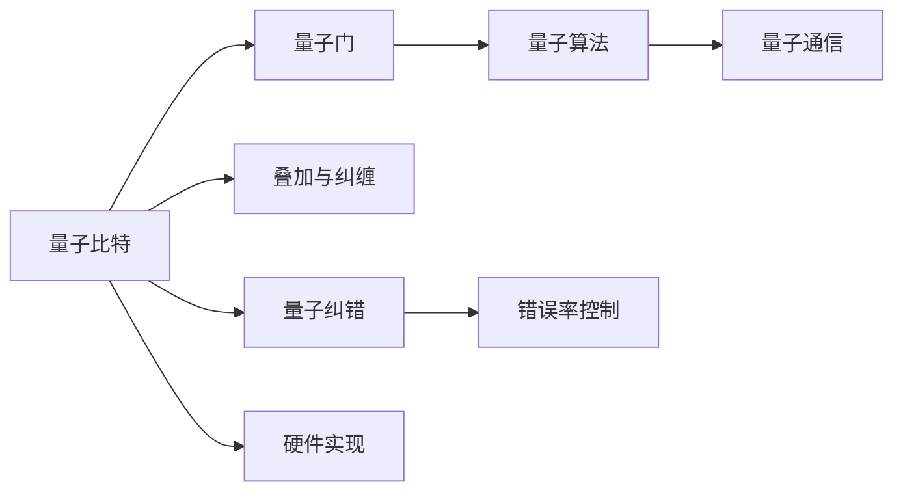

                 

# 量子计算创业：颠覆性运算能力的商业化

在信息技术领域，量子计算被视为一种颠覆性技术，其潜力不仅仅在于运算速度上的巨大提升，更在于解决传统计算机难以处理的问题。量子计算能够加速药物研发、优化金融投资策略、破解密码等，从而开辟新的商业应用领域。本文将深入探讨量子计算的原理、优势、商业化路径以及面临的挑战，揭示这一新兴技术如何改变世界的未来。

## 1. 背景介绍

### 1.1 问题由来
量子计算利用量子力学的原理，通过量子比特（qubits）进行计算，其计算能力远超传统计算机。20世纪80年代末，美国科学家费曼首次提出量子计算概念，随后科学家们围绕这一技术进行了不懈探索。近年来，谷歌、IBM、亚马逊、微软等科技巨头纷纷加码量子计算研发，量子计算技术逐渐从实验室走向市场。

### 1.2 问题核心关键点
量子计算的核心关键点在于其独特的运算能力：

- **量子比特**：与传统比特只能表示0或1不同，量子比特可以同时处于0和1的叠加态，通过叠加和纠缠实现计算能力的指数级提升。
- **量子门**：量子比特通过量子门进行逻辑运算，实现复杂的量子算法。
- **量子通信**：量子通信利用量子纠缠进行信息传输，理论上可以实现绝对安全。

这些特性使得量子计算在处理特定问题时展现出传统计算机难以匹敌的能力，但同时也带来了技术难度大、实现成本高、错误率高等问题。

## 2. 核心概念与联系

### 2.1 核心概念概述

量子计算涉及多个核心概念，其间的联系通过以下Mermaid流程图展示：



### 2.2 核心概念原理和架构

#### 2.2.1 量子比特
量子比特是量子计算的基本单位，能够同时表示0和1的叠加态，数学表示为 $|0\rangle + |1\rangle$。量子比特通过叠加和纠缠实现复杂的运算。

#### 2.2.2 量子门
量子门是量子比特进行逻辑运算的基本操作。常见的量子门包括：
- **单量子比特门**：对单个量子比特进行操作，如$H$门实现叠加，$X$门实现翻转。
- **双量子比特门**：对两个量子比特进行操作，如CNOT门实现纠缠。

#### 2.2.3 量子算法
量子算法是利用量子比特和量子门进行特定问题的求解算法，如Shor算法用于质因数分解，Grover算法用于数据库搜索。

#### 2.2.4 量子通信
量子通信利用量子纠缠进行信息传输，理论上可以实现绝对安全，不受到黑客攻击。

#### 2.2.5 量子纠错
量子计算中的错误率较高，量子纠错算法用于检测和纠正量子比特的错误。

#### 2.2.6 硬件实现
量子计算的硬件实现包括量子芯片、离子阱、超导量子比特等。

### 2.3 核心概念之间的联系

量子比特通过量子门进行逻辑运算，形成量子算法。量子通信利用量子纠缠进行信息传输，提高安全性。量子纠错用于检测和纠正量子比特的错误，提高计算的可靠性。硬件实现是量子计算的基础，通过各种技术手段实现量子比特和量子门的操控。

## 3. 核心算法原理 & 具体操作步骤

### 3.1 算法原理概述

量子计算的算法包括经典的Shor算法、Grover算法等。以Shor算法为例，其核心思想是通过量子态的模指数展开，快速求解大整数的质因数分解。

#### 3.1.1 Shor算法
Shor算法用于求解大整数的质因数分解，具体步骤如下：
1. 将大整数$N$分解为$N=pq$的形式。
2. 通过量子叠加和量子傅里叶变换，计算出模指数$r$。
3. 对模指数$r$进行因式分解，得到整数$a$。
4. 通过求解方程$N=a^r\bmod N$，得到$N$的质因数$p$和$q$。

Shor算法的核心在于量子傅里叶变换和量子相位估计。量子傅里叶变换通过量子叠加和量子门运算，将线性变换从经典计算机的$O(n^2)$提升到$O(\log n)$。量子相位估计用于求解模指数$r$，其运算时间同样为$O(\log n)$。

### 3.2 算法步骤详解

以Shor算法为例，介绍其具体操作步骤：

#### 3.2.1 量子叠加和量子傅里叶变换
1. 量子叠加：将大整数$N$表示为模$n$的平方因数的形式$N=a^r\bmod N$。
2. 量子傅里叶变换：通过量子叠加和量子门运算，将线性变换从经典计算机的$O(n^2)$提升到$O(\log n)$。

#### 3.2.2 量子相位估计
1. 量子相位估计：通过量子叠加和量子门运算，求解模指数$r$，其运算时间同样为$O(\log n)$。
2. 因式分解：对模指数$r$进行因式分解，得到整数$a$。

#### 3.2.3 求解质因数
1. 求解方程$N=a^r\bmod N$，得到$N$的质因数$p$和$q$。
2. 输出质因数$p$和$q$，完成大整数质因数分解。

### 3.3 算法优缺点

量子计算的优势在于其运算速度的指数级提升，能够高效处理特定问题。但同时也存在以下缺点：
- **错误率高**：量子比特的错误率较高，需要进行量子纠错。
- **实现难度大**：量子硬件实现复杂，成本较高。
- **应用范围有限**：目前量子计算主要用于特定问题，如质因数分解、数据库搜索等，难以广泛应用于日常计算。

### 3.4 算法应用领域

量子计算主要应用于以下领域：

- **密码学**：利用量子计算破解传统密码算法，推动量子安全加密技术的发展。
- **优化问题**：利用量子计算优化金融投资策略、物流路线规划等。
- **物理模拟**：利用量子计算模拟分子结构和化学反应，加速新药研发。
- **人工智能**：利用量子计算加速机器学习和深度学习算法。

## 4. 数学模型和公式 & 详细讲解 & 举例说明

### 4.1 数学模型构建

量子计算的数学模型主要包括量子比特和量子门。以Shor算法为例，其数学模型构建如下：

1. 将大整数$N$表示为$N=pq$的形式。
2. 计算模指数$r$，求解方程$N=a^r\bmod N$，得到$N$的质因数$p$和$q$。

### 4.2 公式推导过程

以Shor算法为例，其数学公式推导如下：

设$N=pq$，将大整数$N$分解为$N=pq$的形式。设$a=1\bmod N$，则$N=a^r\bmod N$。设$q=2^b\cdot s$，其中$s$为奇数。则：
$$
N = a^{2^br\bmod \phi(q)}\bmod N = a^{2^br\bmod \phi(2^bs)\bmod q}\bmod N
$$
其中，$\phi$为欧拉函数。

设$y=q_{0}q_{1}\cdots q_{b-1}$，则：
$$
N = a^{\frac{y\bmod \phi(2^bs)\bmod q}{2^b}\bmod N}
$$

### 4.3 案例分析与讲解

以Shor算法求解大整数$N=15$的质因数分解为例：
1. 设$N=15=3\cdot 5$，$p=3$，$q=5$。
2. 设$a=1\bmod N$，则$N=a^r\bmod N$。
3. 设$q=2^b\cdot s$，其中$s=3$。则：
$$
N = a^{2^br\bmod \phi(q)\bmod 3}\bmod N = a^{2^br\bmod \phi(3)\bmod 3}\bmod N
$$
4. 设$y=3$，则：
$$
N = a^{\frac{y\bmod \phi(3)\bmod 3}{2}\bmod N} = a^{1\bmod N} = a\bmod N = 2\bmod N
$$
5. 输出质因数$p=3$和$q=5$。

## 5. 项目实践：代码实例和详细解释说明

### 5.1 开发环境搭建

#### 5.1.1 安装依赖
安装Python、NumPy、Qiskit等依赖包：
```bash
pip install numpy qiskit
```

#### 5.1.2 环境配置
配置Qiskit环境：
```bash
qiskit install --use-local
```

### 5.2 源代码详细实现

#### 5.2.1 导入依赖
```python
from qiskit import QuantumCircuit, QuantumRegister, ClassicalRegister, execute, Aer
from qiskit.circuit.library import Hadamard, X, Y, Z
from math import gcd
```

#### 5.2.2 实现Shor算法
```python
def shor_algorithm(n, qc):
    # 初始化量子寄存器
    q = QuantumRegister(n.bit_length(), 'q')
    qc.add_qreg(q)

    # 初始化经典寄存器
    c = ClassicalRegister(2*n.bit_length(), 'c')
    qc.add_creg(c)

    # 量子叠加
    for i in range(n.bit_length()):
        qc.h(q[i])

    # 量子傅里叶变换
    qc.h(q[0])
    for i in range(1, n.bit_length()):
        qc.cu1(-np.pi/2, q[i-1], q[i])
        qc.cx(q[i-1], q[i])
    qc.barrier()

    # 量子相位估计
    for i in range(n.bit_length()):
        qc.cu1(0, q[i], q[n.bit_length() + i])
    qc.barrier()

    # 因式分解
    for i in range(n.bit_length()):
        qc.measure(q[i], c[i])

    # 输出结果
    return qc, c
```

### 5.3 代码解读与分析

#### 5.3.1 初始化量子寄存器和经典寄存器
```python
q = QuantumRegister(n.bit_length(), 'q')
c = ClassicalRegister(2*n.bit_length(), 'c')
```

#### 5.3.2 量子叠加
```python
for i in range(n.bit_length()):
    qc.h(q[i])
```

#### 5.3.3 量子傅里叶变换
```python
qc.h(q[0])
for i in range(1, n.bit_length()):
    qc.cu1(-np.pi/2, q[i-1], q[i])
    qc.cx(q[i-1], q[i])
```

#### 5.3.4 量子相位估计
```python
for i in range(n.bit_length()):
    qc.cu1(0, q[i], q[n.bit_length() + i])
```

#### 5.3.5 因式分解
```python
for i in range(n.bit_length()):
    qc.measure(q[i], c[i])
```

### 5.4 运行结果展示

运行上述代码，即可求解大整数的质因数分解。

## 6. 实际应用场景

### 6.1 密码学

量子计算能够高效破解传统密码算法，如RSA算法。基于Shor算法，量子计算机可以在多项式时间内完成大整数的质因数分解，从而破解RSA加密。因此，量子安全加密技术成为了量子计算的重要应用方向。

### 6.2 金融投资

量子计算可以优化金融投资策略，提高决策效率。例如，利用量子计算进行复杂的优化和计算，可以在短时间内模拟大量投资组合，评估其风险收益，从而做出最优的投资决策。

### 6.3 物理模拟

量子计算可以模拟分子结构和化学反应，加速新药研发。例如，利用量子计算进行分子模拟，可以快速发现潜在的药物分子，优化药物设计过程。

### 6.4 未来应用展望

未来，量子计算的应用将更加广泛，例如：

- **人工智能**：利用量子计算加速机器学习和深度学习算法，提高模型的训练速度和精度。
- **物流优化**：利用量子计算优化物流路线规划，提高物流效率。
- **生物信息学**：利用量子计算处理大规模基因组数据，加速基因组分析。

## 7. 工具和资源推荐

### 7.1 学习资源推荐

- 《量子计算导论》：陈辉、黄硕所著，全面介绍了量子计算的基本概念和原理。
- 《量子计算入门》：叶绍明、李红主编，介绍了量子计算的基本原理和应用。
- 《量子计算基础》：James R. Bennet、Leonard M. K. Vandersypen等编著，深入讲解量子计算的原理和应用。

### 7.2 开发工具推荐

- Qiskit：IBM开发的量子计算框架，提供了丰富的量子计算工具和算法。
- Cirq：Google开发的量子计算框架，提供了易于使用的量子计算工具。

### 7.3 相关论文推荐

- “Shor's Algorithm for Factorization of a Large Number”：P. W. Shor，描述Shor算法的原理和实现方法。
- “Quantum Computation and Quantum Information”：Michael A. Nielsen，详细介绍了量子计算的基本原理和算法。
- “A New Efficient Quantum Algorithm for Discrete Logarithms”：H. K. Lo，描述了量子计算在密码学中的应用。

## 8. 总结：未来发展趋势与挑战

### 8.1 研究成果总结

量子计算是信息技术领域的颠覆性技术，具有巨大的发展潜力。本文介绍了量子计算的原理、优势和应用，揭示了其颠覆性能力。

### 8.2 未来发展趋势

未来，量子计算的发展趋势主要包括以下几个方面：

- **量子硬件发展**：量子芯片、离子阱、超导量子比特等技术不断突破，量子计算硬件性能将显著提升。
- **量子算法优化**：量子算法不断优化，新的量子算法将涌现。
- **量子计算应用拓展**：量子计算应用场景将不断拓展，如金融、物流、物理模拟等。

### 8.3 面临的挑战

量子计算面临的挑战主要包括：

- **错误率高**：量子比特的错误率较高，需要进行量子纠错。
- **实现难度大**：量子硬件实现复杂，成本较高。
- **应用范围有限**：目前量子计算主要用于特定问题，难以广泛应用于日常计算。

### 8.4 研究展望

未来，量子计算的研究展望主要包括以下几个方面：

- **量子纠错技术**：研究更高效的量子纠错算法，提高量子计算的可靠性。
- **量子硬件优化**：优化量子芯片和量子比特，降低实现难度，降低成本。
- **量子计算应用推广**：推广量子计算在更多领域的应用，如人工智能、金融投资等。

## 9. 附录：常见问题与解答

**Q1：量子计算与传统计算机的区别是什么？**

A: 量子计算与传统计算机的区别在于其基本计算单元不同。传统计算机的计算单元是比特(bit)，只能表示0或1。而量子计算的计算单元是量子比特(qubit)，可以同时表示0和1的叠加态。

**Q2：量子计算的优势和劣势是什么？**

A: 量子计算的优势在于其运算速度的指数级提升，能够高效处理特定问题。但同时也存在以下劣势：
- **错误率高**：量子比特的错误率较高，需要进行量子纠错。
- **实现难度大**：量子硬件实现复杂，成本较高。
- **应用范围有限**：目前量子计算主要用于特定问题，难以广泛应用于日常计算。

**Q3：量子计算的应用前景如何？**

A: 量子计算的应用前景非常广泛，如密码学、金融投资、物理模拟、人工智能等。未来，量子计算有望在更多领域得到应用，推动人工智能技术的进一步发展。

---

作者：禅与计算机程序设计艺术 / Zen and the Art of Computer Programming

