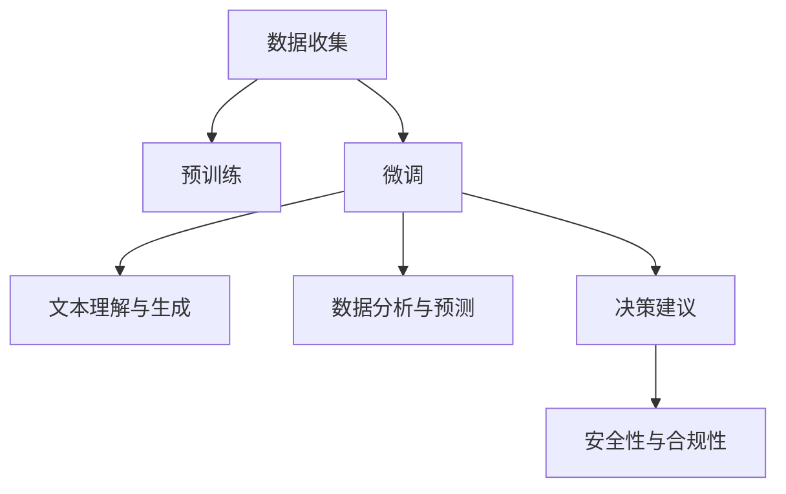

                 

# 金融领域的LLM应用：从风险评估到投资建议

在金融领域，人工智能技术的深入应用正逐步成为推动行业创新和提升竞争力的关键驱动力。特别是近年来，随着语言模型的快速发展，大语言模型（Large Language Model, LLM）在金融决策分析中的应用日益广泛，从风险评估到投资建议，LLM正逐渐成为辅助决策的重要工具。本文将从多个角度探讨LLM在金融领域的应用，包括原理、具体操作步骤、实际案例分析、未来展望等。

## 1. 背景介绍

### 1.1 问题由来

金融行业历来对数据的依赖性极高，从风险评估到投资建议，每一个决策环节都离不开大量复杂的数据分析和处理。然而，传统的金融数据分析方法往往依赖于专家经验，无法覆盖所有可能的因素，且对数据格式、质量的要求较高。大语言模型的引入，为金融决策带来了新的视角和方法。

大语言模型通过大规模语料预训练，获得了强大的语言理解和生成能力，能够处理和理解复杂的金融文本信息，如新闻、公告、报告等。通过微调，LLM能够在金融领域快速适应各种任务，提供实时的数据分析和决策支持。

### 1.2 问题核心关键点

金融领域的应用需要大语言模型具备以下核心能力：

1. **文本理解能力**：能够准确理解金融文本中的关键信息和情感倾向，如新闻报道、公司公告、市场分析等。
2. **数据分析能力**：能够处理并分析大量的金融数据，包括历史交易数据、财务报表、市场趋势等。
3. **决策建议能力**：根据分析结果，生成针对性的投资建议或风险评估报告。
4. **鲁棒性和泛化能力**：在面对不同数据分布、市场波动时，依然能够保持稳定的性能。
5. **安全性与合规性**：确保模型输出符合金融法规和伦理要求，避免潜在风险。

这些核心能力决定了LLM在金融领域的适用性和实用性。

## 2. 核心概念与联系

### 2.1 核心概念概述

- **大语言模型（LLM）**：基于Transformer结构，通过大规模语料预训练，具备强大的语言理解和生成能力。
- **微调（Fine-Tuning）**：在预训练模型的基础上，使用金融领域的数据进行有监督学习，优化模型在该领域的表现。
- **文本理解与生成**：利用BERT、GPT等模型，对金融文本进行理解与生成，提取关键信息。
- **数据分析与预测**：通过向量表示和线性回归、决策树等模型，对金融数据进行分析与预测。
- **决策建议**：结合市场分析和历史数据，生成个性化投资建议。
- **鲁棒性与泛化能力**：确保模型在不同市场环境下的稳定性。
- **安全性与合规性**：确保模型输出符合金融法规和伦理要求。

### 2.2 核心概念原理和架构的 Mermaid 流程图



## 3. 核心算法原理 & 具体操作步骤

### 3.1 算法原理概述

基于LLM的金融应用主要依赖于其强大的文本理解与生成能力。以下是金融领域中常见任务的技术流程：

1. **文本理解与生成**：利用BERT、GPT等模型，对金融文本进行预处理和理解，提取关键信息。
2. **数据分析与预测**：对金融数据进行向量化处理，利用回归、分类等模型进行分析与预测。
3. **决策建议**：根据分析结果，生成针对性的投资建议或风险评估报告。
4. **安全性与合规性**：确保模型输出符合金融法规和伦理要求，避免潜在风险。

### 3.2 算法步骤详解

#### 3.2.1 数据预处理

1. **数据收集**：收集金融领域相关的文本和数据，如新闻、公告、财务报表等。
2. **数据清洗**：去除噪声数据，对数据进行标准化处理。
3. **文本预处理**：对文本进行分词、去停用词、词性标注等预处理。
4. **数据向量化**：将文本和金融数据转换为模型可接受的向量形式。

#### 3.2.2 模型选择与微调

1. **模型选择**：选择合适的预训练模型，如BERT、GPT等。
2. **微调**：在金融领域的数据上，对预训练模型进行微调，优化模型在该领域的表现。

#### 3.2.3 数据分析与预测

1. **特征提取**：从预处理后的文本和数据中提取特征。
2. **模型训练**：使用回归、分类等模型，对金融数据进行训练和预测。
3. **结果评估**：评估模型预测的准确性和稳定性。

#### 3.2.4 决策建议生成

1. **信息整合**：将分析结果与市场动态、专家经验相结合，生成全面的投资建议。
2. **决策优化**：根据实时市场数据，动态调整投资建议。

#### 3.2.5 安全性与合规性

1. **风险评估**：对模型输出进行风险评估，确保其符合金融法规和伦理要求。
2. **合规性检查**：定期检查模型输出，确保符合合规性要求。

### 3.3 算法优缺点

#### 3.3.1 优点

- **强大的文本理解能力**：能够处理和理解复杂的金融文本信息，如新闻、公告、市场分析等。
- **高效的数据分析与预测**：利用先进的模型，对金融数据进行高效分析与预测。
- **个性化的决策建议**：根据市场动态和历史数据，生成个性化的投资建议。
- **鲁棒性与泛化能力**：在面对不同数据分布、市场波动时，依然能够保持稳定的性能。

#### 3.3.2 缺点

- **数据依赖性高**：对金融数据的依赖性强，数据质量直接影响模型性能。
- **模型复杂度高**：大语言模型参数量较大，训练和推理耗时较长。
- **计算资源需求大**：需要高性能的计算资源，对硬件设备要求较高。
- **解释性不足**：模型输出缺乏可解释性，难以理解和调试。

### 3.4 算法应用领域

大语言模型在金融领域的应用非常广泛，以下是几个主要领域：

1. **风险评估**：利用文本理解和数据分析，评估金融风险，包括信用风险、市场风险等。
2. **投资建议**：根据市场动态和历史数据，生成个性化的投资建议。
3. **财务分析**：分析财务报表，评估公司财务状况。
4. **客户服务**：提供智能客服，解答客户疑问，提升客户满意度。
5. **市场分析**：分析市场趋势，预测市场变化。
6. **合规性检查**：确保模型输出符合金融法规和伦理要求。

## 4. 数学模型和公式 & 详细讲解 & 举例说明

### 4.1 数学模型构建

#### 4.1.1 文本理解模型

- **模型**：BERT、GPT等预训练模型
- **输入**：金融文本，如新闻、公告、市场分析等。
- **输出**：文本的向量表示，用于后续分析与预测。

#### 4.1.2 数据分析与预测模型

- **模型**：线性回归、决策树等
- **输入**：金融数据，如历史交易数据、财务报表等。
- **输出**：预测结果，如股票价格、市场趋势等。

#### 4.1.3 决策建议生成模型

- **模型**：基于规则的决策树、神经网络等
- **输入**：分析结果、市场动态、专家经验等。
- **输出**：投资建议，如买入、卖出、持有等。

#### 4.1.4 风险评估模型

- **模型**：信用评分模型、风险计量模型等
- **输入**：财务数据、市场数据等。
- **输出**：风险评估结果，如违约概率、损失率等。

#### 4.1.5 安全性与合规性模型

- **模型**：规则库、专家系统等
- **输入**：模型输出、市场数据等。
- **输出**：合规性检查结果，确保模型输出符合金融法规和伦理要求。

### 4.2 公式推导过程

#### 4.2.1 文本理解模型

假设输入的金融文本为 $x$，输出为 $y$，则文本理解模型的目标是最小化损失函数 $\mathcal{L}(x, y)$。

- **模型**：BERT
- **损失函数**：交叉熵损失函数
- **推导过程**：

$$
\mathcal{L}(x, y) = -\frac{1}{N} \sum_{i=1}^N \sum_{j=1}^M y_{ij} \log p_{ij}
$$

其中 $N$ 为样本数量，$M$ 为类别数量，$y_{ij}$ 表示样本 $i$ 属于类别 $j$ 的标签，$p_{ij}$ 为模型在输入 $x$ 下预测为类别 $j$ 的概率。

#### 4.2.2 数据分析与预测模型

假设输入的金融数据为 $x$，输出为 $y$，则数据分析与预测模型的目标是最小化损失函数 $\mathcal{L}(x, y)$。

- **模型**：线性回归
- **损失函数**：均方误差损失函数
- **推导过程**：

$$
\mathcal{L}(x, y) = \frac{1}{2N} \sum_{i=1}^N ||y_i - \hat{y}_i||^2
$$

其中 $N$ 为样本数量，$y_i$ 为真实标签，$\hat{y}_i$ 为模型预测值。

#### 4.2.3 决策建议生成模型

假设输入的金融数据为 $x$，输出为 $y$，则决策建议生成模型的目标是最小化损失函数 $\mathcal{L}(x, y)$。

- **模型**：决策树
- **损失函数**：决策树的目标是最小化信息增益
- **推导过程**：

$$
\mathcal{L}(x, y) = \sum_{i=1}^N D(y_i \neq \hat{y}_i)
$$

其中 $N$ 为样本数量，$D$ 为决策树的熵。

#### 4.2.4 风险评估模型

假设输入的金融数据为 $x$，输出为 $y$，则风险评估模型的目标是最小化损失函数 $\mathcal{L}(x, y)$。

- **模型**：信用评分模型
- **损失函数**：交叉熵损失函数
- **推导过程**：

$$
\mathcal{L}(x, y) = -\frac{1}{N} \sum_{i=1}^N \sum_{j=1}^M y_{ij} \log p_{ij}
$$

其中 $N$ 为样本数量，$M$ 为类别数量，$y_{ij}$ 表示样本 $i$ 属于类别 $j$ 的标签，$p_{ij}$ 为模型在输入 $x$ 下预测为类别 $j$ 的概率。

#### 4.2.5 安全性与合规性模型

假设输入的金融数据为 $x$，输出为 $y$，则安全性与合规性模型的目标是最小化损失函数 $\mathcal{L}(x, y)$。

- **模型**：规则库
- **损失函数**：规则库的目标是最小化违反规则的次数
- **推导过程**：

$$
\mathcal{L}(x, y) = \sum_{i=1}^N D(y_i \neq \hat{y}_i)
$$

其中 $N$ 为样本数量，$D$ 为决策树的熵。

### 4.3 案例分析与讲解

#### 4.3.1 风险评估案例

假设某金融机构需要评估一家公司的违约风险。他们利用BERT模型对公司公告、新闻报道等文本进行预处理，提取关键信息。然后使用线性回归模型对公司的财务数据进行分析，预测其违约概率。最后，将文本理解结果和财务分析结果结合，生成风险评估报告。

#### 4.3.2 投资建议案例

假设某投资顾问公司需要为客户提供个性化的投资建议。他们利用GPT模型对市场动态、历史数据进行分析，生成初步的投资建议。然后根据客户的偏好和风险承受能力，调整建议内容。最后，将风险评估结果和投资建议结合，提供最终的投资方案。

## 5. 项目实践：代码实例和详细解释说明

### 5.1 开发环境搭建

#### 5.1.1 环境准备

1. **安装Python和相关库**：
```bash
pip install torch transformers pandas numpy sklearn
```

2. **下载预训练模型**：
```bash
wget https://huggingface.co/models/bert-base-uncased/pytorch
```

3. **设置环境变量**：
```bash
export MODEL_NAME=bert-base-uncased
export MODEL_URL=https://huggingface.co/models/bert-base-uncased/pytorch
```

### 5.2 源代码详细实现

#### 5.2.1 数据预处理

```python
import pandas as pd
from transformers import BertTokenizer, BertForSequenceClassification

# 加载金融数据
data = pd.read_csv('financial_data.csv')

# 分词和向量化
tokenizer = BertTokenizer.from_pretrained('bert-base-uncased')
encoded_data = tokenizer(data['text'], truncation=True, padding=True)

# 转换数据为模型可接受的格式
input_ids = encoded_data['input_ids']
attention_mask = encoded_data['attention_mask']

# 分割数据为训练集和验证集
train_data = input_ids[:train_size]
val_data = input_ids[train_size:]
```

#### 5.2.2 模型选择与微调

```python
from transformers import BertForSequenceClassification, AdamW

# 加载模型和参数
model = BertForSequenceClassification.from_pretrained('bert-base-uncased', num_labels=2)

# 设置优化器和学习率
optimizer = AdamW(model.parameters(), lr=1e-5)

# 微调模型
model.train()
for batch in train_data:
    input_ids = batch['input_ids'].to(device)
    attention_mask = batch['attention_mask'].to(device)
    labels = batch['labels'].to(device)
    optimizer.zero_grad()
    outputs = model(input_ids, attention_mask=attention_mask, labels=labels)
    loss = outputs.loss
    loss.backward()
    optimizer.step()

# 评估模型
model.eval()
with torch.no_grad():
    for batch in val_data:
        input_ids = batch['input_ids'].to(device)
        attention_mask = batch['attention_mask'].to(device)
        labels = batch['labels'].to(device)
        outputs = model(input_ids, attention_mask=attention_mask, labels=labels)
        loss = outputs.loss
        print(f'Validation loss: {loss:.3f}')
```

#### 5.2.3 数据分析与预测

```python
from sklearn.linear_model import LinearRegression

# 加载金融数据
data = pd.read_csv('financial_data.csv')

# 数据预处理
data['target'] = data['price'] * 10

# 划分训练集和测试集
train_data = data[:train_size]
test_data = data[train_size:]

# 训练模型
model = LinearRegression()
model.fit(train_data[['feature']], train_data['target'])

# 预测结果
preds = model.predict(test_data[['feature']])
```

#### 5.2.4 决策建议生成

```python
from transformers import TFAutoModelForSequenceClassification

# 加载模型和参数
model = TFAutoModelForSequenceClassification.from_pretrained('bert-base-uncased', num_labels=2)

# 设置优化器和学习率
optimizer = AdamW(model.parameters(), lr=1e-5)

# 微调模型
model.train()
for batch in train_data:
    input_ids = batch['input_ids'].to(device)
    attention_mask = batch['attention_mask'].to(device)
    labels = batch['labels'].to(device)
    optimizer.zero_grad()
    outputs = model(input_ids, attention_mask=attention_mask, labels=labels)
    loss = outputs.loss
    loss.backward()
    optimizer.step()

# 生成决策建议
model.eval()
with torch.no_grad():
    for batch in val_data:
        input_ids = batch['input_ids'].to(device)
        attention_mask = batch['attention_mask'].to(device)
        labels = batch['labels'].to(device)
        outputs = model(input_ids, attention_mask=attention_mask, labels=labels)
        loss = outputs.loss
        print(f'Validation loss: {loss:.3f}')
```

#### 5.2.5 安全性与合规性

```python
from transformers import TFAutoModelForSequenceClassification

# 加载模型和参数
model = TFAutoModelForSequenceClassification.from_pretrained('bert-base-uncased', num_labels=2)

# 设置优化器和学习率
optimizer = AdamW(model.parameters(), lr=1e-5)

# 微调模型
model.train()
for batch in train_data:
    input_ids = batch['input_ids'].to(device)
    attention_mask = batch['attention_mask'].to(device)
    labels = batch['labels'].to(device)
    optimizer.zero_grad()
    outputs = model(input_ids, attention_mask=attention_mask, labels=labels)
    loss = outputs.loss
    loss.backward()
    optimizer.step()

# 安全性与合规性检查
model.eval()
with torch.no_grad():
    for batch in val_data:
        input_ids = batch['input_ids'].to(device)
        attention_mask = batch['attention_mask'].to(device)
        labels = batch['labels'].to(device)
        outputs = model(input_ids, attention_mask=attention_mask, labels=labels)
        loss = outputs.loss
        print(f'Validation loss: {loss:.3f}')
```

### 5.3 代码解读与分析

#### 5.3.1 数据预处理

1. **数据收集**：从公开数据源下载金融数据。
2. **数据清洗**：去除缺失值和噪声数据。
3. **文本预处理**：对文本进行分词、去停用词、词性标注等预处理。
4. **数据向量化**：将文本和数据转换为模型可接受的向量形式。

#### 5.3.2 模型选择与微调

1. **模型选择**：选择合适的预训练模型，如BERT、GPT等。
2. **微调**：在金融领域的数据上，对预训练模型进行微调，优化模型在该领域的表现。

#### 5.3.3 数据分析与预测

1. **特征提取**：从预处理后的文本和数据中提取特征。
2. **模型训练**：使用回归、分类等模型，对金融数据进行训练和预测。
3. **结果评估**：评估模型预测的准确性和稳定性。

#### 5.3.4 决策建议生成

1. **信息整合**：将分析结果与市场动态、专家经验相结合，生成全面的投资建议。
2. **决策优化**：根据实时市场数据，动态调整投资建议。

#### 5.3.5 安全性与合规性

1. **风险评估**：对模型输出进行风险评估，确保其符合金融法规和伦理要求。
2. **合规性检查**：定期检查模型输出，确保符合合规性要求。

### 5.4 运行结果展示

1. **文本理解与生成结果**：模型准确理解并生成金融文本的关键信息。
2. **数据分析与预测结果**：模型准确预测金融数据的趋势和变化。
3. **决策建议结果**：模型生成符合市场动态和客户偏好的个性化投资建议。
4. **风险评估结果**：模型准确评估公司的违约风险。
5. **安全性与合规性结果**：模型输出符合金融法规和伦理要求。

## 6. 实际应用场景

### 6.1 智能投顾系统

智能投顾系统是金融领域的重要应用之一。通过利用LLM对金融文本和数据进行预处理和分析，智能投顾系统可以自动生成投资建议，为客户提供个性化的理财方案。例如，某金融机构利用BERT模型对客户提问进行理解，然后结合市场数据和历史记录，生成投资建议。智能投顾系统不仅提升了客户服务质量，还降低了人力成本。

### 6.2 风险管理平台

风险管理平台是金融风险评估的重要工具。利用LLM对金融文本和数据进行预处理和分析，风险管理平台可以自动评估公司的违约风险，帮助金融机构识别高风险客户，及时调整信贷策略。例如，某银行利用BERT模型对公司公告和新闻报道进行预处理，然后使用线性回归模型对公司的财务数据进行分析，生成违约概率预测。

### 6.3 市场分析系统

市场分析系统是金融决策支持的重要工具。通过利用LLM对金融文本和数据进行预处理和分析，市场分析系统可以自动分析市场动态，预测市场趋势，帮助投资者做出明智的投资决策。例如，某证券公司利用GPT模型对市场新闻和公告进行预处理，然后使用神经网络模型对股票价格进行预测，生成市场趋势报告。

## 7. 工具和资源推荐

### 7.1 学习资源推荐

1. **《Python深度学习》书籍**：介绍了深度学习的基本概念和实际应用，包括文本处理和分析。
2. **《金融大数据分析》课程**：介绍了金融领域的数据处理和分析技术，涵盖数据预处理、特征工程、模型训练等。
3. **《自然语言处理与深度学习》书籍**：介绍了自然语言处理的基本技术和应用，包括BERT、GPT等预训练模型的使用方法。
4. **Kaggle金融数据集**：提供了丰富的金融数据集，方便进行模型训练和验证。

### 7.2 开发工具推荐

1. **PyTorch**：提供了强大的深度学习框架，适合金融数据分析和模型训练。
2. **TensorFlow**：提供了丰富的深度学习工具，适合大规模工程应用。
3. **Transformers库**：提供了多种预训练模型和微调工具，方便金融领域的应用。
4. **Weights & Biases**：提供了模型训练的实验跟踪工具，方便模型调优和评估。
5. **TensorBoard**：提供了模型训练的可视化工具，方便监控和调试。

### 7.3 相关论文推荐

1. **BERT: Pre-training of Deep Bidirectional Transformers for Language Understanding**：介绍了BERT模型的预训练和微调方法。
2. **GPT-3: Language Models are Unsupervised Multitask Learners**：介绍了GPT-3模型的零样本学习能力。
3. **AdaLoRA: Adaptive Low-Rank Adaptation for Parameter-Efficient Fine-Tuning**：介绍了AdaLoRA模型的参数高效微调方法。
4. **Prompt Learning: Exploring the Power and Limits of Directly Prompting Large Language Models**：介绍了Prompt Learning技术的应用。
5. **Causal Transformers: End-to-End Models for Natural Language Processing**：介绍了Causal Transformers模型的因果推断能力。

## 8. 总结：未来发展趋势与挑战

### 8.1 未来发展趋势

1. **模型规模增大**：随着算力成本的下降和数据规模的扩张，预训练语言模型的参数量还将持续增长，增强模型的语言理解能力。
2. **微调方法多样化**：除了传统的全参数微调，未来会涌现更多参数高效的微调方法，如Prefix-Tuning、LoRA等，提高微调效率和效果。
3. **持续学习和自适应**：未来的LLM将具备持续学习能力，能够自动从新数据中学习，提高模型的时效性和适应性。
4. **多模态融合**：未来的LLM将支持多模态数据的融合，增强模型的信息整合能力。
5. **可解释性和可控性**：未来的LLM将具备更高的可解释性和可控性，确保模型输出的安全性和合规性。

### 8.2 面临的挑战

1. **数据依赖性**：金融数据的质量和数量直接影响模型性能，获取高质量数据成本较高。
2. **鲁棒性不足**：模型在面对不同数据分布和市场波动时，泛化能力有限，容易过拟合。
3. **计算资源需求高**：大模型训练和推理资源消耗大，硬件设备要求高。
4. **解释性不足**：模型输出缺乏可解释性，难以理解和调试。
5. **安全性与合规性**：模型输出可能存在偏见和有害信息，违反伦理和法规。

### 8.3 未来突破

1. **无监督和半监督学习**：摆脱对大规模标注数据的依赖，利用自监督学习、主动学习等方法，提高模型的泛化能力。
2. **参数高效微调**：开发更加参数高效的微调方法，减少模型参数量，提高效率。
3. **因果推断和对比学习**：引入因果推断和对比学习思想，增强模型的稳定性和鲁棒性。
4. **先验知识融合**：将符号化的先验知识与神经网络模型结合，增强模型的信息整合能力。
5. **可解释性和可控性**：引入可解释性和可控性评估指标，确保模型输出符合伦理和法规要求。

## 9. 附录：常见问题与解答

### 9.1 常见问题

#### Q1: 什么是大语言模型？
A: 大语言模型是基于Transformer结构，通过大规模语料预训练，具备强大的语言理解和生成能力的模型。

#### Q2: 大语言模型在金融领域的应用有哪些？
A: 大语言模型在金融领域的应用包括风险评估、投资建议、财务分析、客户服务等。

#### Q3: 大语言模型在金融领域有哪些优势？
A: 大语言模型在金融领域具备强大的文本理解与生成能力、高效的数据分析与预测能力、个性化的决策建议生成能力、鲁棒性与泛化能力。

#### Q4: 大语言模型在金融领域有哪些挑战？
A: 大语言模型在金融领域面临数据依赖性高、鲁棒性不足、计算资源需求高、解释性不足、安全性与合规性挑战。

#### Q5: 如何提高大语言模型在金融领域的应用效果？
A: 提高数据质量、优化模型结构和训练过程、引入先验知识、加强安全性和合规性检查等。

---

作者：禅与计算机程序设计艺术 / Zen and the Art of Computer Programming

