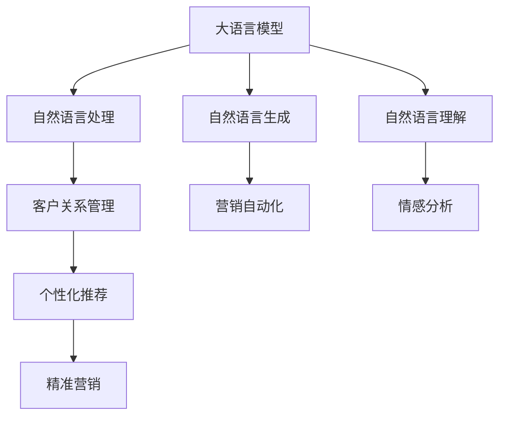

                 

# 销售和营销：LLM 增强的策略

> 关键词：
- 自然语言处理
- 自然语言生成
- 自然语言理解
- 客户关系管理
- 智能客服

## 1. 背景介绍

在当前的商业环境中，销售和营销活动的重要性不言而喻。然而，这些活动面临着严峻的挑战，包括信息过载、用户注意力分散、精准营销的难度增加等。为了克服这些挑战，许多企业已经开始探索利用人工智能(AI)技术，特别是大语言模型(LLM)，来提升其销售和营销策略的效果。

### 1.1 问题由来

随着互联网和数字技术的飞速发展，消费者获取信息和进行决策的方式发生了显著变化。用户不再只是被动地接收信息，而是更加主动地通过社交媒体、搜索引擎、在线论坛等渠道获取相关资讯，形成了更加复杂的决策环境和更高的期望值。

传统销售和营销方法难以满足这些新的需求。传统的客户关系管理系统(CRM)和营销自动化平台，虽然能够在一定程度上提高销售和营销效率，但往往缺乏对用户行为和偏好的深入理解，导致营销策略不够精准，用户体验不佳。

此外，人工客服的响应时间和质量也成为瓶颈。人工客服无法24/7服务，且存在疲劳和情绪波动等问题，无法满足用户实时需求，影响用户体验和忠诚度。

### 1.2 问题核心关键点

因此，销售和营销领域的挑战可以归结为以下几点：

1. **用户体验优化**：如何在提高用户参与度的同时，提供个性化和精准的推荐和服务。
2. **内容生成自动化**：如何高效生成高质量的内容，包括营销文案、广告语、客户服务响应等。
3. **情感识别与响应**：如何准确识别用户的情感和需求，及时响应和引导用户，提升用户满意度和转化率。
4. **多渠道整合**：如何在多个线上和线下渠道中，实现信息的一致性和连贯性，提高品牌一致性。

### 1.3 问题研究意义

应用大语言模型(LLM)进行销售和营销策略的增强，对于提升企业的销售和营销效果具有重要意义：

1. **提升用户体验**：通过LLE增强的用户互动和个性化推荐，提高用户满意度和忠诚度。
2. **优化内容生成**：利用LLE生成高质量的内容，降低人工成本，提升内容生产的效率和质量。
3. **提高情感识别与响应**：通过LLE对用户情感的深入理解，实现更好的客户服务和互动。
4. **促进多渠道整合**：LLE能够帮助企业在不同的渠道和平台上，保持信息的一致性和连贯性，提升品牌形象和用户信任。

## 2. 核心概念与联系

### 2.1 核心概念概述

为了更好地理解如何利用LLE增强销售和营销策略，我们首先介绍几个核心概念：

- **大语言模型(LLM)**：通过预训练在大量文本数据上学习语言规律和知识，并能够生成和理解自然语言的模型，如GPT-3、BERT等。

- **自然语言处理(NLP)**：使用计算机处理、理解、生成自然语言的技术，包括文本分类、情感分析、实体识别等。

- **自然语言生成(NLG)**：使用计算机生成自然语言文本的技术，如自动生成营销文案、生成聊天机器人回复等。

- **自然语言理解(NLU)**：使用计算机理解自然语言输入的技术，如意图识别、命名实体识别、情感分析等。

- **客户关系管理(CRM)**：管理企业与客户之间关系的系统，包括客户信息的收集、交互记录、销售活动等。

这些核心概念之间通过自然语言处理和生成技术，构建了企业销售和营销策略的智能化应用框架。下面，我们将通过一个简单的Mermaid流程图展示这些概念之间的联系：



这个流程图展示了大语言模型在销售和营销中的应用路径：通过NLP技术获取客户信息，利用NLG生成营销内容，通过NLU技术理解用户需求，最终通过CRM和营销自动化系统，实现个性化推荐和精准营销。

## 3. 核心算法原理 & 具体操作步骤

### 3.1 算法原理概述

基于LLE的销售和营销策略增强，其核心思想是利用LLE进行自然语言处理和生成，从而实现个性化推荐、自动化内容生成和情感识别与响应等功能。

具体来说，算法原理如下：

1. **预训练**：使用大量无标注文本数据对LLE进行预训练，学习语言的通用表示和知识。
2. **微调**：根据特定销售和营销任务的需求，对预训练模型进行微调，使其能够处理特定的自然语言处理和生成任务。
3. **应用**：在实际销售和营销场景中，使用微调后的LLE模型进行文本处理和生成，提升营销效果和用户体验。

### 3.2 算法步骤详解

以下是使用大语言模型增强销售和营销策略的主要操作步骤：

**Step 1: 数据准备与预训练模型选择**
- 收集企业的历史销售数据、客户交互数据、市场趋势数据等，构建训练数据集。
- 选择适合的预训练LLE模型，如GPT-3、BERT等。

**Step 2: 模型微调**
- 对预训练模型进行微调，使其能够处理特定领域的自然语言处理任务。例如，微调BERT模型进行情感分析，或微调GPT-3模型进行文本生成。
- 根据销售和营销任务的具体需求，设计合适的损失函数和优化器，进行模型训练。

**Step 3: 内容生成与个性化推荐**
- 使用微调后的模型生成高质量的营销内容，如产品描述、广告文案等。
- 利用NLU技术对用户输入进行情感分析和意图识别，提供个性化推荐。

**Step 4: 多渠道整合与全渠道营销**
- 将LLE模型应用于企业的各个营销渠道，如社交媒体、网站、电子邮件等。
- 通过多渠道整合技术，确保信息的一致性和连贯性。

**Step 5: 情感识别与实时响应**
- 实时监测用户情感和反馈，利用情感识别技术进行情感分析。
- 根据分析结果，及时调整营销策略和客户服务方式。

**Step 6: 性能评估与优化**
- 定期对LLE模型的性能进行评估，收集用户反馈。
- 根据评估结果，优化模型参数和训练数据，提升模型效果。

### 3.3 算法优缺点

使用大语言模型进行销售和营销策略增强，具有以下优点：

1. **提升营销效果**：通过自动生成和理解自然语言，提高营销内容的吸引力和精准性。
2. **降低人工成本**：减少人工内容生成和处理的工作量，提高营销活动的效率。
3. **提升用户体验**：通过个性化推荐和情感识别，提升用户满意度和忠诚度。
4. **多渠道整合**：确保不同渠道的信息一致性和连贯性，提升品牌形象和用户信任。

然而，也存在一些缺点：

1. **数据质量依赖**：模型的性能高度依赖于训练数据的质量和多样性。如果数据存在偏差，模型的泛化能力会受到影响。
2. **资源消耗大**：大语言模型需要大量的计算资源进行训练和推理，成本较高。
3. **可解释性不足**：模型的内部机制和决策过程难以解释，用户难以理解和信任。
4. **伦理与安全问题**：模型可能学习到有害信息和偏见，造成误导性输出，带来伦理和安全风险。

### 3.4 算法应用领域

大语言模型在销售和营销中的应用领域非常广泛，主要包括以下几个方面：

1. **客户服务与支持**：通过聊天机器人和虚拟助手，提供24/7的客户服务。
2. **个性化推荐系统**：根据用户行为和偏好，提供个性化的产品推荐和内容推荐。
3. **营销自动化**：自动生成营销内容，进行广告投放和客户邮件营销。
4. **情感分析与舆情监控**：监测用户情感和社交媒体舆情，及时调整营销策略。
5. **多渠道整合**：在多个渠道中保持品牌一致性和信息一致性。

## 4. 数学模型和公式 & 详细讲解 & 举例说明

### 4.1 数学模型构建

假设我们有历史销售数据集 $D=\{(x_i, y_i)\}_{i=1}^N$，其中 $x_i$ 表示客户历史交互记录，$y_i$ 表示销售结果。我们希望构建一个LLE模型 $M_{\theta}$，用于预测新的销售结果。

我们的目标是最小化损失函数 $\mathcal{L}(\theta)$，使得 $M_{\theta}(x)$ 的输出尽可能接近 $y$。常用的损失函数包括均方误差损失（MSE）和交叉熵损失（CE）。

以均方误差损失为例，我们的目标函数为：

$$
\mathcal{L}(\theta) = \frac{1}{N} \sum_{i=1}^N (y_i - M_{\theta}(x_i))^2
$$

### 4.2 公式推导过程

根据均方误差损失的定义，我们可以得到模型参数的更新公式：

$$
\theta \leftarrow \theta - \eta \nabla_{\theta}\mathcal{L}(\theta)
$$

其中，$\eta$ 为学习率，$\nabla_{\theta}\mathcal{L}(\theta)$ 为损失函数对模型参数的梯度，可以通过反向传播算法计算。

以一个简单的文本分类任务为例，假设我们有一个分类器 $M_{\theta}$，其输入为 $x$，输出为 $\hat{y}=M_{\theta}(x)$，真实标签为 $y$。我们的损失函数为交叉熵损失：

$$
\ell(M_{\theta}(x),y) = -y\log \hat{y} - (1-y)\log(1-\hat{y})
$$

将损失函数代入经验风险公式，得：

$$
\mathcal{L}(\theta) = -\frac{1}{N}\sum_{i=1}^N \ell(M_{\theta}(x_i),y_i)
$$

根据链式法则，损失函数对模型参数的梯度为：

$$
\frac{\partial \mathcal{L}(\theta)}{\partial \theta} = -\frac{1}{N}\sum_{i=1}^N \frac{\partial \ell(M_{\theta}(x_i),y_i)}{\partial \theta}
$$

在得到损失函数的梯度后，即可带入模型参数的更新公式，完成模型的迭代优化。

### 4.3 案例分析与讲解

以一个情感分析任务为例，假设我们的目标是对客户评论进行情感分析，将评论分为正面、负面和中性三类。我们收集了1000条客户评论，每条评论对应一个标签。

我们选择一个预训练的BERT模型进行微调，将文本作为输入，输出为情感分类概率。我们使用交叉熵损失函数，进行模型训练。

具体步骤如下：

1. 将评论数据分为训练集和测试集。
2. 使用BERT模型作为初始化参数，设计情感分类器。
3. 设定合适的优化器（如Adam）和学习率，进行模型微调。
4. 在测试集上评估模型性能，根据评估结果进行模型优化。

最终，我们得到了一个能够在新的客户评论上准确分类情感的LLE模型。

## 5. 项目实践：代码实例和详细解释说明

### 5.1 开发环境搭建

在进行销售和营销策略增强的LLE项目实践时，我们需要准备好开发环境。以下是使用Python进行PyTorch开发的环境配置流程：

1. 安装Anaconda：从官网下载并安装Anaconda，用于创建独立的Python环境。

2. 创建并激活虚拟环境：
```bash
conda create -n pytorch-env python=3.8 
conda activate pytorch-env
```

3. 安装PyTorch：根据CUDA版本，从官网获取对应的安装命令。例如：
```bash
conda install pytorch torchvision torchaudio cudatoolkit=11.1 -c pytorch -c conda-forge
```

4. 安装Transformers库：
```bash
pip install transformers
```

5. 安装各类工具包：
```bash
pip install numpy pandas scikit-learn matplotlib tqdm jupyter notebook ipython
```

完成上述步骤后，即可在`pytorch-env`环境中开始项目实践。

### 5.2 源代码详细实现

下面我们以情感分析任务为例，给出使用Transformers库对BERT模型进行微调的PyTorch代码实现。

首先，定义情感分析任务的数据处理函数：

```python
from transformers import BertTokenizer
from torch.utils.data import Dataset
import torch

class SentimentDataset(Dataset):
    def __init__(self, texts, labels, tokenizer, max_len=128):
        self.texts = texts
        self.labels = labels
        self.tokenizer = tokenizer
        self.max_len = max_len
        
    def __len__(self):
        return len(self.texts)
    
    def __getitem__(self, item):
        text = self.texts[item]
        label = self.labels[item]
        
        encoding = self.tokenizer(text, return_tensors='pt', max_length=self.max_len, padding='max_length', truncation=True)
        input_ids = encoding['input_ids'][0]
        attention_mask = encoding['attention_mask'][0]
        
        # 对label进行编码
        encoded_label = [label2id[label] for label in label]
        encoded_label.extend([label2id['O']] * (self.max_len - len(encoded_label)))
        labels = torch.tensor(encoded_label, dtype=torch.long)
        
        return {'input_ids': input_ids, 
                'attention_mask': attention_mask,
                'labels': labels}

# 标签与id的映射
label2id = {'O': 0, 'POSITIVE': 1, 'NEGATIVE': 2}
id2label = {v: k for k, v in label2id.items()}

# 创建dataset
tokenizer = BertTokenizer.from_pretrained('bert-base-cased')

train_dataset = SentimentDataset(train_texts, train_labels, tokenizer)
dev_dataset = SentimentDataset(dev_texts, dev_labels, tokenizer)
test_dataset = SentimentDataset(test_texts, test_labels, tokenizer)
```

然后，定义模型和优化器：

```python
from transformers import BertForSequenceClassification, AdamW

model = BertForSequenceClassification.from_pretrained('bert-base-cased', num_labels=len(label2id))

optimizer = AdamW(model.parameters(), lr=2e-5)
```

接着，定义训练和评估函数：

```python
from torch.utils.data import DataLoader
from tqdm import tqdm
from sklearn.metrics import classification_report

device = torch.device('cuda') if torch.cuda.is_available() else torch.device('cpu')
model.to(device)

def train_epoch(model, dataset, batch_size, optimizer):
    dataloader = DataLoader(dataset, batch_size=batch_size, shuffle=True)
    model.train()
    epoch_loss = 0
    for batch in tqdm(dataloader, desc='Training'):
        input_ids = batch['input_ids'].to(device)
        attention_mask = batch['attention_mask'].to(device)
        labels = batch['labels'].to(device)
        model.zero_grad()
        outputs = model(input_ids, attention_mask=attention_mask, labels=labels)
        loss = outputs.loss
        epoch_loss += loss.item()
        loss.backward()
        optimizer.step()
    return epoch_loss / len(dataloader)

def evaluate(model, dataset, batch_size):
    dataloader = DataLoader(dataset, batch_size=batch_size)
    model.eval()
    preds, labels = [], []
    with torch.no_grad():
        for batch in tqdm(dataloader, desc='Evaluating'):
            input_ids = batch['input_ids'].to(device)
            attention_mask = batch['attention_mask'].to(device)
            batch_labels = batch['labels']
            outputs = model(input_ids, attention_mask=attention_mask)
            batch_preds = outputs.logits.argmax(dim=2).to('cpu').tolist()
            batch_labels = batch_labels.to('cpu').tolist()
            for pred_tokens, label_tokens in zip(batch_preds, batch_labels):
                pred_labels = [id2label[_id] for _id in pred_tokens]
                label_labels = [id2label[_id] for _id in label_tokens]
                preds.append(pred_labels[:len(label_labels)])
                labels.append(label_labels)
                
    print(classification_report(labels, preds))
```

最后，启动训练流程并在测试集上评估：

```python
epochs = 5
batch_size = 16

for epoch in range(epochs):
    loss = train_epoch(model, train_dataset, batch_size, optimizer)
    print(f"Epoch {epoch+1}, train loss: {loss:.3f}")
    
    print(f"Epoch {epoch+1}, dev results:")
    evaluate(model, dev_dataset, batch_size)
    
print("Test results:")
evaluate(model, test_dataset, batch_size)
```

以上就是使用PyTorch对BERT进行情感分析任务微调的完整代码实现。可以看到，得益于Transformers库的强大封装，我们可以用相对简洁的代码完成BERT模型的加载和微调。

### 5.3 代码解读与分析

让我们再详细解读一下关键代码的实现细节：

**SentimentDataset类**：
- `__init__`方法：初始化文本、标签、分词器等关键组件。
- `__len__`方法：返回数据集的样本数量。
- `__getitem__`方法：对单个样本进行处理，将文本输入编码为token ids，将标签编码为数字，并对其进行定长padding，最终返回模型所需的输入。

**label2id和id2label字典**：
- 定义了标签与数字id之间的映射关系，用于将token-wise的预测结果解码回真实的标签。

**训练和评估函数**：
- 使用PyTorch的DataLoader对数据集进行批次化加载，供模型训练和推理使用。
- 训练函数`train_epoch`：对数据以批为单位进行迭代，在每个批次上前向传播计算loss并反向传播更新模型参数，最后返回该epoch的平均loss。
- 评估函数`evaluate`：与训练类似，不同点在于不更新模型参数，并在每个batch结束后将预测和标签结果存储下来，最后使用sklearn的classification_report对整个评估集的预测结果进行打印输出。

**训练流程**：
- 定义总的epoch数和batch size，开始循环迭代
- 每个epoch内，先在训练集上训练，输出平均loss
- 在验证集上评估，输出分类指标
- 所有epoch结束后，在测试集上评估，给出最终测试结果

可以看到，PyTorch配合Transformers库使得BERT微调的代码实现变得简洁高效。开发者可以将更多精力放在数据处理、模型改进等高层逻辑上，而不必过多关注底层的实现细节。

当然，工业级的系统实现还需考虑更多因素，如模型的保存和部署、超参数的自动搜索、更灵活的任务适配层等。但核心的微调范式基本与此类似。

## 6. 实际应用场景

### 6.1 智能客服系统

基于LLE增强的智能客服系统，可以显著提升客户服务的效率和质量。传统的客服系统依赖人工客服，存在响应时间长、工作疲劳等问题。通过LLE增强的智能客服，可以提供24/7的服务，快速响应客户需求。

具体应用如下：

1. **自然语言理解**：使用LLE模型理解客户输入的自然语言，进行意图识别和情感分析。
2. **多轮对话管理**：利用LLE模型进行多轮对话管理，保持对话上下文的连贯性。
3. **个性化推荐**：根据客户的历史行为和偏好，利用LLE模型进行个性化推荐。

### 6.2 个性化推荐系统

在推荐系统中，利用LLE进行个性化推荐，可以大大提高推荐的精准度和用户的满意度。传统的推荐系统依赖于用户的历史行为数据，而LLE可以更好地理解和生成用户的行为描述，从而提供更加精准的推荐。

具体应用如下：

1. **用户行为理解**：利用LLE模型理解用户的历史行为和偏好，生成行为描述。
2. **推荐生成**：根据行为描述，利用LLE模型生成个性化的推荐列表。
3. **实时更新**：根据用户的实时反馈，利用LLE模型实时更新推荐内容。

### 6.3 营销自动化

在营销自动化中，利用LLE生成高质量的营销内容，可以大大提高营销活动的效率和效果。传统的营销内容生成依赖人工，耗时长、成本高。通过LLE生成营销内容，可以大幅降低人工成本，提高内容的生成速度和质量。

具体应用如下：

1. **内容生成**：利用LLE模型生成广告文案、邮件内容等营销内容。
2. **多渠道分发**：在多个渠道（如社交媒体、电子邮件、网站等）分发生成的营销内容。
3. **效果评估**：根据营销效果，利用LLE模型进行数据分析和优化。

### 6.4 未来应用展望

随着LLE技术的发展，未来在销售和营销领域的应用将更加广泛，带来更多的创新和突破：

1. **智能决策支持**：利用LLE进行数据挖掘和分析，提供智能化的决策支持。
2. **情感分析与舆情监控**：实时监测用户情感和社交媒体舆情，提供舆情分析服务。
3. **多渠道整合**：在多个渠道中保持品牌一致性和信息一致性，提升品牌形象和用户信任。
4. **智能广告投放**：利用LLE进行广告内容的生成和优化，提高广告投放的精准性和效果。

## 7. 工具和资源推荐

### 7.1 学习资源推荐

为了帮助开发者系统掌握LLE在销售和营销中的应用，这里推荐一些优质的学习资源：

1. 《Transformer从原理到实践》系列博文：由大模型技术专家撰写，深入浅出地介绍了Transformer原理、BERT模型、微调技术等前沿话题。

2. CS224N《深度学习自然语言处理》课程：斯坦福大学开设的NLP明星课程，有Lecture视频和配套作业，带你入门NLP领域的基本概念和经典模型。

3. 《Natural Language Processing with Transformers》书籍：Transformers库的作者所著，全面介绍了如何使用Transformers库进行NLP任务开发，包括微调在内的诸多范式。

4. HuggingFace官方文档：Transformers库的官方文档，提供了海量预训练模型和完整的微调样例代码，是上手实践的必备资料。

5. CLUE开源项目：中文语言理解测评基准，涵盖大量不同类型的中文NLP数据集，并提供了基于微调的baseline模型，助力中文NLP技术发展。

通过对这些资源的学习实践，相信你一定能够快速掌握LLE在销售和营销中的应用，并用于解决实际的NLP问题。

### 7.2 开发工具推荐

高效的开发离不开优秀的工具支持。以下是几款用于LLE在销售和营销中应用的常用工具：

1. PyTorch：基于Python的开源深度学习框架，灵活动态的计算图，适合快速迭代研究。大部分预训练语言模型都有PyTorch版本的实现。

2. TensorFlow：由Google主导开发的开源深度学习框架，生产部署方便，适合大规模工程应用。同样有丰富的预训练语言模型资源。

3. Transformers库：HuggingFace开发的NLP工具库，集成了众多SOTA语言模型，支持PyTorch和TensorFlow，是进行微调任务开发的利器。

4. Weights & Biases：模型训练的实验跟踪工具，可以记录和可视化模型训练过程中的各项指标，方便对比和调优。与主流深度学习框架无缝集成。

5. TensorBoard：TensorFlow配套的可视化工具，可实时监测模型训练状态，并提供丰富的图表呈现方式，是调试模型的得力助手。

6. Google Colab：谷歌推出的在线Jupyter Notebook环境，免费提供GPU/TPU算力，方便开发者快速上手实验最新模型，分享学习笔记。

合理利用这些工具，可以显著提升LLE在销售和营销中的开发效率，加快创新迭代的步伐。

### 7.3 相关论文推荐

LLE在销售和营销中的应用源于学界的持续研究。以下是几篇奠基性的相关论文，推荐阅读：

1. Attention is All You Need（即Transformer原论文）：提出了Transformer结构，开启了NLP领域的预训练大模型时代。

2. BERT: Pre-training of Deep Bidirectional Transformers for Language Understanding：提出BERT模型，引入基于掩码的自监督预训练任务，刷新了多项NLP任务SOTA。

3. Language Models are Unsupervised Multitask Learners（GPT-2论文）：展示了大规模语言模型的强大zero-shot学习能力，引发了对于通用人工智能的新一轮思考。

4. Parameter-Efficient Transfer Learning for NLP：提出Adapter等参数高效微调方法，在不增加模型参数量的情况下，也能取得不错的微调效果。

5. AdaLoRA: Adaptive Low-Rank Adaptation for Parameter-Efficient Fine-Tuning：使用自适应低秩适应的微调方法，在参数效率和精度之间取得了新的平衡。

6. Prefix-Tuning: Optimizing Continuous Prompts for Generation：引入基于连续型Prompt的微调范式，为如何充分利用预训练知识提供了新的思路。

这些论文代表了大语言模型微调技术的发展脉络。通过学习这些前沿成果，可以帮助研究者把握学科前进方向，激发更多的创新灵感。

## 8. 总结：未来发展趋势与挑战

### 8.1 研究成果总结

本文对基于LLE的销售和营销策略增强方法进行了全面系统的介绍。首先阐述了LLE在销售和营销领域的应用背景和意义，明确了LLE在提升营销效果和用户体验方面的独特价值。其次，从原理到实践，详细讲解了LLE的数学模型和操作步骤，给出了LLE在情感分析、智能客服、个性化推荐等任务中的代码实现。同时，本文还探讨了LLE在多个实际应用场景中的具体应用，展示了LLE的巨大潜力。最后，本文精选了LLE的相关学习资源和工具，力求为读者提供全方位的技术指引。

通过本文的系统梳理，可以看到，LLE在销售和营销中的应用，已经成为推动企业数字化转型和智能化的重要手段。LLE能够通过自动生成和理解自然语言，提高营销活动的效率和效果，增强用户体验，实现个性化推荐和情感识别，为企业提供智能化的决策支持。未来，LLE的应用还将进一步深化，成为企业数字化转型的核心引擎。

### 8.2 未来发展趋势

展望未来，LLE在销售和营销中的应用将呈现以下几个发展趋势：

1. **多模态融合**：LLE将不再局限于文本数据，还将与其他模态数据（如图像、语音等）进行融合，提升多模态信息处理的精度和效率。
2. **跨领域迁移**：LLE在多个领域（如金融、医疗、教育等）的应用将更加广泛，通过跨领域迁移学习，提升模型的通用性和适应性。
3. **实时动态优化**：LLE将结合实时数据，进行动态优化，提升模型的实时性和响应速度。
4. **深度强化学习**：LLE将结合强化学习技术，提升决策过程的智能性，实现更精准的个性化推荐和智能决策。
5. **知识图谱整合**：LLE将结合知识图谱技术，提升对复杂场景和关系的理解，实现更加智能的决策和推荐。

### 8.3 面临的挑战

尽管LLE在销售和营销中的应用取得了显著成效，但在实际落地中，仍面临以下挑战：

1. **数据质量与多样性**：LLE的性能高度依赖于训练数据的质量和多样性。如何获取高质量、多样化、无偏见的训练数据，是LLE应用的重要挑战。
2. **资源消耗**：大语言模型需要大量的计算资源进行训练和推理，如何降低资源消耗，提高算力效率，是一个关键问题。
3. **可解释性**：LLE模型的内部机制和决策过程难以解释，用户难以理解和信任。如何提高模型的可解释性，是一个亟待解决的问题。
4. **伦理与安全**：LLE模型可能学习到有害信息和偏见，造成误导性输出，带来伦理和安全风险。如何避免模型偏见，确保输出安全，是一个重要的研究方向。

### 8.4 研究展望

未来，LLE在销售和营销中的应用研究需要在以下几个方面寻求新的突破：

1. **数据增强与合成**：利用数据增强和生成技术，扩大训练数据的多样性和质量。
2. **模型压缩与优化**：研究模型压缩和优化技术，降低资源消耗，提升模型的实时性和可扩展性。
3. **知识注入与融合**：将符号化的先验知识与神经网络模型进行融合，提升模型的通用性和智能性。
4. **对抗训练与鲁棒性**：引入对抗训练技术，提升模型的鲁棒性和泛化能力。
5. **多领域跨模态学习**：研究多领域跨模态学习技术，提升模型的跨领域迁移能力和多模态信息处理能力。

这些研究方向的探索，将进一步拓展LLE在销售和营销中的应用边界，提升模型的性能和灵活性，为构建智能化、高效化的销售和营销系统提供坚实的技术基础。

## 9. 附录：常见问题与解答

**Q1：LLE在销售和营销中的应用，是否适用于所有场景？**

A: LLE在销售和营销中的应用具有广泛性，但对于特定领域和场景，可能存在局限性。例如，在需要高精度和高安全性的场景，如医疗、金融等领域，LLE的应用需要特别考虑。因此，企业在应用LLE时，需要根据具体场景和需求进行评估和调整。

**Q2：如何选择合适的LLE模型进行微调？**

A: 选择合适的LLE模型进行微调，需要考虑多个因素，如模型的通用性、模型的可解释性、模型的性能等。一般来说，尽量选择基于大量语料预训练的模型，如GPT、BERT等。同时，可以根据具体任务的需求，选择适合的模型结构和超参数。

**Q3：LLE在销售和营销中的应用，是否需要大量标注数据？**

A: LLE的性能在一定程度上依赖于标注数据，但通过LLE的少样本学习和迁移学习能力，可以缓解对标注数据的依赖。例如，通过微调GPT-3等大模型，可以在较少标注数据的情况下，取得较好的性能。

**Q4：LLE在销售和营销中的应用，是否容易受到偏见和有害信息的影响？**

A: LLE模型可能会学习到数据中的偏见和有害信息，导致输出出现偏差。为了避免这种情况，需要在数据预处理和模型训练过程中，进行数据清洗和筛选，确保训练数据的多样性和公正性。同时，需要在模型输出中加入去偏和纠正机制，避免模型输出对特定群体造成不公或伤害。

**Q5：LLE在销售和营销中的应用，是否存在可解释性问题？**

A: LLE模型通常被视为"黑盒"模型，难以解释其内部决策过程。为了提高模型的可解释性，可以采用多种方法，如模型压缩、模型可视化、模型干预等，帮助用户理解模型的决策依据。同时，需要引入人类的专业知识，进行人工审核和监督。

通过这些常见问题的解答，可以看出，LLE在销售和营销中的应用，虽然面临一些挑战，但通过精心设计和优化，可以充分发挥其优势，提升企业的数字化转型和智能化水平。

