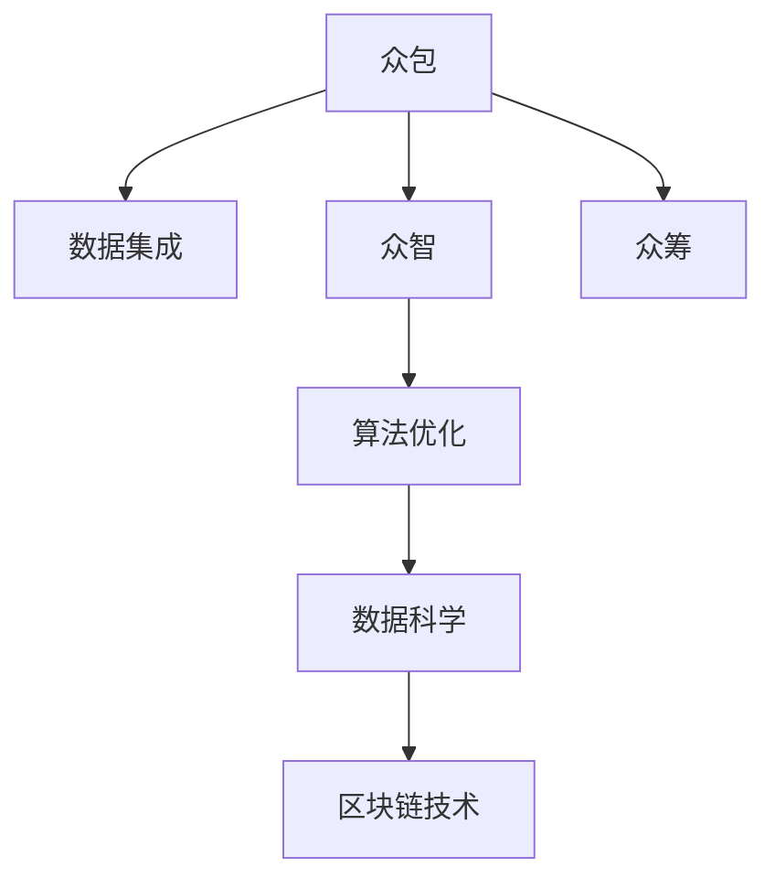

                 

# 集体智慧：探索解决复杂问题的创新路径

在数字化时代，复杂问题层出不穷，如何通过技术手段驱动集体智慧的涌现，实现创新路径的探索，成为各行各业亟待解决的课题。本文将深入探讨集体智慧的核心理念、实现方式及实际应用场景，并通过技术手段揭示如何利用集体智慧解决复杂问题。

## 1. 背景介绍

### 1.1 问题由来
在全球化、数字化的大背景下，信息量的爆炸性增长使得传统的人工智能解决方案在处理复杂问题时显得捉襟见肘。跨领域、多模态、动态演化等问题特征日益凸显，单一模型难以应对。与此同时，数据驱动、算法优化、社会协作的融合成为新的趋势，对集体智慧的探索与应用提出了更高的要求。

### 1.2 问题核心关键点
集体智慧（Collective Wisdom），是指在开放、协作的集体中，通过众包、众智、众筹等手段，整合多源数据、多模态信息，形成更为全面、深入、系统的知识和解决方案。其核心关键点包括：
1. **数据集成**：跨领域数据源的整合，融合多元视角，拓展信息获取渠道。
2. **算法优化**：通过机器学习、深度学习等技术，优化算法模型，提升问题解决的准确性和效率。
3. **社会协作**：利用社交网络和协作平台，促进群体智慧的汇聚与交流。
4. **系统设计**：构建分布式、自适应、可扩展的系统架构，支持集体智慧的长期积累和迭代。

## 2. 核心概念与联系

### 2.1 核心概念概述
为更好地理解集体智慧的实现机制，本文将介绍几个关键概念：

- **众包（Crowdsourcing）**：利用互联网平台，将复杂任务分解为简单的小任务，通过群体协作完成。
- **众智（Crowdintelligence）**：集合并利用群体成员的知识、经验和技能，进行创新性问题的解决。
- **众筹（Crowdfunding）**：通过群体筹集资金、资源，支持集体智慧的持续发展和应用。
- **数据科学（Data Science）**：运用统计学、机器学习等技术，从海量数据中提取知识，为集体智慧提供数据支撑。
- **区块链技术（Blockchain）**：提供分布式、透明、安全的记录和存储机制，确保集体智慧的可信度。

这些概念之间的联系可以通过以下Mermaid流程图来展示：



这个流程图展示了从众包到众智再到算法优化、数据科学和区块链技术的整合路径。

## 3. 核心算法原理 & 具体操作步骤

### 3.1 算法原理概述
集体智慧的实现过程中，算法是核心手段。通过机器学习和深度学习等技术，算法能够从海量的数据中提取有价值的信息，形成智能决策的基础。在集体智慧框架下，算法通常分为数据预处理、特征工程、模型训练和结果评估等步骤。

### 3.2 算法步骤详解
1. **数据预处理**：清洗、标准化、归一化处理数据，确保数据质量，减少噪声。
2. **特征工程**：通过数据降维、特征选择、生成等技术，提取最具代表性和区分度的特征。
3. **模型训练**：选择合适的算法模型（如线性回归、决策树、神经网络等），利用标注数据训练模型，调整模型参数。
4. **结果评估**：通过交叉验证、均方误差、准确率等指标，评估模型性能，调整模型参数，进行迭代优化。

### 3.3 算法优缺点
集体智慧算法具有以下优点：
- 数据驱动：利用数据而非经验，提高决策的客观性和准确性。
- 高效协作：结合群体智慧，缩短问题解决时间。
- 动态更新：算法模型和数据不断更新，保持知识的时效性。

然而，集体智慧算法也存在一些挑战：
- 数据噪音：大数据背景下的数据噪音问题，影响模型准确性。
- 算法偏见：模型可能会受到训练数据中存在的偏见影响。
- 过度拟合：在数据量较小的情况下，模型容易过度拟合，泛化性能下降。

### 3.4 算法应用领域
集体智慧算法在多个领域有广泛应用，例如：
- 医疗健康：通过分析患者数据和专家意见，辅助诊断和药物研发。
- 金融风控：利用集体智慧模型，进行风险评估和投资决策。
- 环境监测：结合遥感数据和公众报告，进行环境污染和气候变化的预测。
- 应急响应：利用社交媒体和传感器数据，快速响应自然灾害和公共事件。
- 社交媒体：分析用户评论和行为数据，提升用户体验和产品设计。

## 4. 数学模型和公式 & 详细讲解 & 举例说明

### 4.1 数学模型构建
集体智慧算法通常基于监督学习和无监督学习的框架，构建数学模型。以监督学习为例，假设训练数据集为 $D=\{(x_i,y_i)\}_{i=1}^N$，其中 $x_i$ 为输入，$y_i$ 为标签。通过优化损失函数 $\mathcal{L}$，最小化模型误差，得到最优模型参数 $\theta$。

### 4.2 公式推导过程
以线性回归为例，假设模型为 $y=f(x;\theta)=\theta^T\phi(x)+b$，其中 $\phi(x)$ 为特征映射函数，$\theta$ 为模型参数，$b$ 为截距。最小化均方误差损失函数：

$$
\mathcal{L}(\theta)=\frac{1}{2N}\sum_{i=1}^N(y_i-f(x_i;\theta))^2
$$

求导后得：

$$
\frac{\partial \mathcal{L}(\theta)}{\partial \theta_j}=\frac{1}{N}\sum_{i=1}^N(\phi(x_i))_j(y_i-f(x_i;\theta))
$$

利用梯度下降算法更新参数：

$$
\theta \leftarrow \theta - \eta \frac{\partial \mathcal{L}(\theta)}{\partial \theta}
$$

### 4.3 案例分析与讲解
以医疗健康领域为例，通过分析患者的病历、基因数据和专家意见，构建集体智慧模型进行疾病诊断和治疗方案推荐。模型基于监督学习，通过标注数据集训练，学习患者特征与疾病之间的映射关系。具体步骤如下：

1. **数据收集**：收集患者病历、基因数据、症状描述等数据。
2. **数据预处理**：清洗、标准化数据，移除缺失值和异常值。
3. **特征工程**：提取患者年龄、性别、基因突变、症状严重度等特征。
4. **模型训练**：选择合适的机器学习算法（如随机森林、支持向量机等），训练模型，调整参数。
5. **结果评估**：利用交叉验证、准确率、召回率等指标，评估模型性能。
6. **应用部署**：将训练好的模型部署到实际应用中，提供疾病诊断和治疗建议。

## 5. 项目实践：代码实例和详细解释说明

### 5.1 开发环境搭建

在进行集体智慧项目实践前，我们需要准备好开发环境。以下是使用Python进行TensorFlow开发的环境配置流程：

1. 安装Anaconda：从官网下载并安装Anaconda，用于创建独立的Python环境。

2. 创建并激活虚拟环境：
```bash
conda create -n tf-env python=3.8 
conda activate tf-env
```

3. 安装TensorFlow：根据CUDA版本，从官网获取对应的安装命令。例如：
```bash
conda install tensorflow -c conda-forge
```

4. 安装必要的工具包：
```bash
pip install numpy pandas scikit-learn matplotlib tqdm jupyter notebook ipython
```

完成上述步骤后，即可在`tf-env`环境中开始项目实践。

### 5.2 源代码详细实现

下面我们以医疗健康领域的疾病诊断为例，给出使用TensorFlow进行集体智慧模型开发的PyTorch代码实现。

```python
import tensorflow as tf
from sklearn.model_selection import train_test_split
from sklearn.preprocessing import StandardScaler
from sklearn.linear_model import LogisticRegression

# 假设数据集为 D，其中每行包含患者特征和标签
X, y = load_data()

# 数据预处理
scaler = StandardScaler()
X = scaler.fit_transform(X)

# 划分训练集和测试集
X_train, X_test, y_train, y_test = train_test_split(X, y, test_size=0.2)

# 构建模型
model = LogisticRegression()

# 训练模型
model.fit(X_train, y_train)

# 评估模型
score = model.score(X_test, y_test)
print("模型精度为：", score)

# 应用部署
# 将模型保存为 SavedModel
tf.saved_model.save(model, "saved_model")
```

以上代码展示了从数据预处理到模型训练和评估的完整流程，利用TensorFlow的 SavedModel 功能，模型可以轻松地部署到不同的应用场景中。

### 5.3 代码解读与分析

让我们再详细解读一下关键代码的实现细节：

**数据预处理**：
- 使用 `StandardScaler` 对数据进行标准化处理，确保数据分布一致，减少模型误差。

**模型训练**：
- 使用 `LogisticRegression` 构建线性回归模型，通过 `fit` 方法训练模型。
- 利用 `score` 方法评估模型精度。

**应用部署**：
- 使用 TensorFlow 的 `SavedModel` 功能，将模型保存为 SavedModel 格式，方便模型部署和调用。

可以看到，TensorFlow 提供了从数据预处理到模型训练和评估的全面支持，大大简化了集体智慧项目的开发流程。

## 6. 实际应用场景

### 6.1 医疗健康

集体智慧在医疗健康领域有广泛应用，特别是在疾病诊断、治疗方案推荐等方面。通过分析患者的病历、基因数据和专家意见，构建集体智慧模型进行疾病诊断和治疗方案推荐。模型基于监督学习，通过标注数据集训练，学习患者特征与疾病之间的映射关系。具体步骤如下：

1. **数据收集**：收集患者病历、基因数据、症状描述等数据。
2. **数据预处理**：清洗、标准化数据，移除缺失值和异常值。
3. **特征工程**：提取患者年龄、性别、基因突变、症状严重度等特征。
4. **模型训练**：选择合适的机器学习算法（如随机森林、支持向量机等），训练模型，调整参数。
5. **结果评估**：利用交叉验证、准确率、召回率等指标，评估模型性能。
6. **应用部署**：将训练好的模型部署到实际应用中，提供疾病诊断和治疗建议。

### 6.2 金融风控

集体智慧在金融风控领域同样有重要应用。通过分析用户的消费行为、交易记录和信用历史，构建集体智慧模型进行风险评估和信用评分。模型基于监督学习，通过标注数据集训练，学习用户特征与风险之间的映射关系。具体步骤如下：

1. **数据收集**：收集用户的交易记录、信用历史、消费行为等数据。
2. **数据预处理**：清洗、标准化数据，移除缺失值和异常值。
3. **特征工程**：提取用户的消费金额、频率、类别等特征。
4. **模型训练**：选择合适的机器学习算法（如随机森林、梯度提升树等），训练模型，调整参数。
5. **结果评估**：利用交叉验证、准确率、召回率等指标，评估模型性能。
6. **应用部署**：将训练好的模型部署到实际应用中，进行风险评估和信用评分。

### 6.3 环境监测

集体智慧在环境监测领域也有广泛应用。通过分析遥感数据、传感器数据和公众报告，构建集体智慧模型进行环境污染和气候变化的预测。模型基于无监督学习，通过自学习算法（如聚类、降维等），发现数据中的规律和模式。具体步骤如下：

1. **数据收集**：收集遥感数据、传感器数据、公众报告等数据。
2. **数据预处理**：清洗、标准化数据，移除缺失值和异常值。
3. **特征工程**：提取数据的时空特征、频谱特征等。
4. **模型训练**：使用自学习算法（如K-means、PCA等），训练模型，发现数据中的模式和规律。
5. **结果评估**：利用均方误差、平均绝对误差等指标，评估模型性能。
6. **应用部署**：将训练好的模型部署到实际应用中，进行环境监测和预测。

### 6.4 未来应用展望

随着集体智慧技术的发展，其应用场景将不断扩展，涵盖更多领域。未来，集体智慧技术将进一步应用于以下领域：

1. **智慧城市**：通过分析交通数据、环境数据、公共服务数据，构建智慧城市管理平台，提升城市管理效率。
2. **教育领域**：通过分析学生的学习行为、教师的教学效果，构建个性化学习推荐系统，提升教育质量。
3. **农业生产**：通过分析气候数据、土壤数据、作物生长数据，构建农业生产管理平台，提高农业生产效率和质量。
4. **能源管理**：通过分析能源消耗数据、环境数据、用户行为数据，构建能源管理平台，提升能源利用效率。
5. **智能制造**：通过分析生产数据、设备数据、供应链数据，构建智能制造系统，提升制造效率和产品质量。

## 7. 工具和资源推荐

### 7.1 学习资源推荐

为了帮助开发者系统掌握集体智慧的理论基础和实践技巧，这里推荐一些优质的学习资源：

1. **《TensorFlow官方文档》**：详细介绍了TensorFlow的使用方法、算法原理和应用案例。
2. **《Python数据分析基础》**：讲解了Python在数据处理、特征工程、模型训练等方面的应用。
3. **《机器学习实战》**：提供了大量实例代码，帮助读者快速上手机器学习算法。
4. **Kaggle竞赛**：提供了丰富的数据集和挑战题，是练习集体智慧算法的好地方。
5. **Coursera课程**：提供多门与集体智慧相关的课程，涵盖数据科学、机器学习、深度学习等领域。

通过对这些资源的学习实践，相信你一定能够快速掌握集体智慧的精髓，并用于解决实际的复杂问题。

### 7.2 开发工具推荐

高效的开发离不开优秀的工具支持。以下是几款用于集体智慧开发常用的工具：

1. **Jupyter Notebook**：提供交互式编程环境，支持Python、R等语言，方便进行数据分析和模型训练。
2. **TensorFlow**：基于深度学习的开源框架，支持分布式计算和模型部署，适合大规模应用。
3. **Scikit-learn**：提供机器学习算法库，支持数据预处理、模型训练和结果评估。
4. **NLTK**：自然语言处理工具包，提供文本处理、特征提取、模型训练等功能。
5. **PyTorch**：基于深度学习的开源框架，支持动态计算图和GPU加速，适合研究和实验。

合理利用这些工具，可以显著提升集体智慧项目的开发效率，加快创新迭代的步伐。

### 7.3 相关论文推荐

集体智慧技术的发展源于学界的持续研究。以下是几篇奠基性的相关论文，推荐阅读：

1. **《众包经济学》**：对众包模式进行了深入分析，提出了多任务激励机制和市场设计理论。
2. **《智慧城市：概念、设计和实现》**：介绍了智慧城市的定义、组成和实现方法，探讨了集体智慧在智慧城市中的应用。
3. **《深度学习在金融风控中的应用》**：分析了深度学习在金融风控领域的应用，包括信用评分、风险评估等。
4. **《大数据驱动的环境监测和预测》**：讨论了大数据技术在环境监测和预测中的应用，提出了基于集体智慧的解决方案。
5. **《基于集体智慧的智能制造系统》**：研究了基于集体智慧的智能制造系统，探讨了多模态数据融合和智能决策方法。

这些论文代表了大数据驱动技术的发展脉络。通过学习这些前沿成果，可以帮助研究者把握学科前进方向，激发更多的创新灵感。

## 8. 总结：未来发展趋势与挑战

### 8.1 总结

本文对集体智慧的概念、实现方式及应用场景进行了全面系统的介绍。通过详细的算法原理、操作步骤和案例分析，展示了如何利用集体智慧技术解决复杂问题。通过学习资源、开发工具和相关论文推荐，为读者提供了系统化的学习和实践路径。

通过本文的系统梳理，可以看到，集体智慧技术正在成为解决复杂问题的有力工具，其应用前景广阔。未来，伴随技术的不断发展和优化，集体智慧必将在更多领域发挥重要作用。

### 8.2 未来发展趋势

展望未来，集体智慧技术将呈现以下几个发展趋势：

1. **多模态融合**：随着物联网技术的发展，数据的多模态特性将更加明显。如何融合视觉、语音、文本等多模态信息，形成更为全面、深入的集体智慧解决方案，将是未来的重要研究方向。
2. **分布式协作**：通过区块链、云计算等技术，实现分布式协作和资源共享，提升集体智慧系统的可扩展性和可靠性。
3. **智能推荐**：利用深度学习、自然语言处理等技术，提供个性化推荐服务，提升用户体验和满意度。
4. **实时响应**：通过流计算、实时数据处理等技术，实现集体智慧系统的实时响应和动态更新，提升应用效率。
5. **跨领域应用**：集体智慧技术在多个领域的应用将不断扩展，涵盖智能制造、智慧城市、智能医疗等领域，形成跨领域的协同效应。

以上趋势凸显了集体智慧技术的应用前景。这些方向的探索发展，必将进一步拓展集体智慧的边界，为解决复杂问题提供更多创新路径。

### 8.3 面临的挑战

尽管集体智慧技术已经取得了一定进展，但在实际应用过程中，仍面临诸多挑战：

1. **数据隐私和安全**：在数据共享和协作过程中，如何保护数据隐私和安全，避免数据泄露和滥用，将是重要的研究方向。
2. **算法偏见和公平性**：算法可能受到训练数据中存在的偏见影响，导致不公平的结果。如何消除算法偏见，确保公平性，是亟待解决的问题。
3. **数据异构性**：不同来源的数据格式、单位、质量等差异较大，如何整合异构数据，形成统一的知识表示，是集体智慧系统的一个关键难题。
4. **系统复杂性**：集体智慧系统通常涉及多领域、多模态的数据和算法，如何设计高效的架构和机制，支持系统的稳定运行和动态更新，是重要的挑战。
5. **用户参与度**：如何激励用户参与数据共享和协作，提升系统数据质量，是集体智慧系统的一个关键问题。

这些挑战需要多学科的协作和技术的不断进步，才能逐步解决。

### 8.4 研究展望

面向未来，集体智慧技术需要在以下几个方面进行深入研究：

1. **跨领域知识整合**：将不同领域的专业知识进行整合，形成更加全面、系统的集体智慧解决方案。
2. **高效协作机制**：设计高效的协作机制和激励机制，提升用户参与度和数据质量。
3. **分布式计算和存储**：利用云计算和区块链技术，实现数据的分布式计算和存储，提升系统可扩展性和可靠性。
4. **智能决策支持**：利用深度学习、自然语言处理等技术，提升集体智慧系统的智能决策能力。
5. **实时监控和预警**：设计实时监控和预警机制，及时发现和应对系统异常，提升系统鲁棒性和稳定性。

这些研究方向将推动集体智慧技术的不断进步，为解决复杂问题提供更多创新路径。相信随着技术的不断发展和优化，集体智慧技术必将在更多领域发挥重要作用，为人类社会带来深远影响。

## 9. 附录：常见问题与解答

**Q1：集体智慧和人工智能有什么区别？**

A: 集体智慧强调的是多源数据的整合和集体协作，通过数据共享和合作提升问题解决能力。而人工智能则更多关注算法和模型的设计和优化，通过自动化的方式进行任务执行和决策。两者相结合，可以形成更加全面、智能的解决方案。

**Q2：如何避免集体智慧系统中的数据隐私问题？**

A: 数据隐私保护是集体智慧系统的一个重要挑战。以下是几种常见的保护措施：
1. 数据匿名化：对数据进行去标识化处理，去除个人敏感信息。
2. 数据加密：对数据进行加密处理，确保数据在传输和存储过程中的安全性。
3. 差分隐私：通过引入噪声，保护个体数据的隐私性，同时确保数据整体统计特性。
4. 权限控制：对数据访问进行严格的权限控制，确保只有授权用户才能访问敏感数据。

**Q3：如何设计高效的集体智慧系统架构？**

A: 高效的集体智慧系统架构设计需要考虑以下几点：
1. 分布式计算：通过分布式计算技术，提升系统处理能力和可扩展性。
2. 数据存储：采用分布式存储技术，确保数据的可靠性和可用性。
3. 消息传递：设计高效的通信协议和消息传递机制，确保数据的高效传输和处理。
4. 智能决策：通过机器学习、深度学习等技术，提升系统的智能决策能力。
5. 实时监控：设计实时监控和预警机制，及时发现和应对系统异常，提升系统鲁棒性和稳定性。

通过以上设计，可以有效提升集体智慧系统的效率和可靠性。

**Q4：如何提高集体智慧系统的智能决策能力？**

A: 提高集体智慧系统的智能决策能力，可以从以下几个方面入手：
1. 多模态数据融合：将视觉、语音、文本等多模态数据进行融合，形成更为全面、深入的集体智慧解决方案。
2. 深度学习：利用深度学习技术，提升系统的学习能力和决策能力。
3. 自然语言处理：通过自然语言处理技术，提升系统的理解和分析能力。
4. 数据驱动决策：通过数据分析和挖掘，形成决策依据，提升决策的科学性和准确性。
5. 协同决策：设计协同决策机制，通过多方的协作和沟通，形成更为全面和合理的决策结果。

通过以上措施，可以有效提升集体智慧系统的智能决策能力，实现更加智能和高效的问题解决。

**Q5：集体智慧技术在实际应用中需要注意哪些问题？**

A: 集体智慧技术在实际应用中需要注意以下问题：
1. 数据质量：数据的质量直接影响系统的性能和可靠性，需要确保数据的准确性和完整性。
2. 算法偏见：算法可能受到训练数据中存在的偏见影响，需要定期进行模型评估和优化，消除偏见。
3. 系统复杂性：集体智慧系统通常涉及多领域、多模态的数据和算法，需要设计高效的架构和机制，支持系统的稳定运行和动态更新。
4. 用户参与度：如何激励用户参与数据共享和协作，提升系统数据质量，是集体智慧系统的一个关键问题。
5. 系统鲁棒性：设计实时监控和预警机制，及时发现和应对系统异常，提升系统鲁棒性和稳定性。

通过以上措施，可以有效提升集体智慧系统的应用效果，实现更好的问题解决能力。

---

作者：禅与计算机程序设计艺术 / Zen and the Art of Computer Programming

