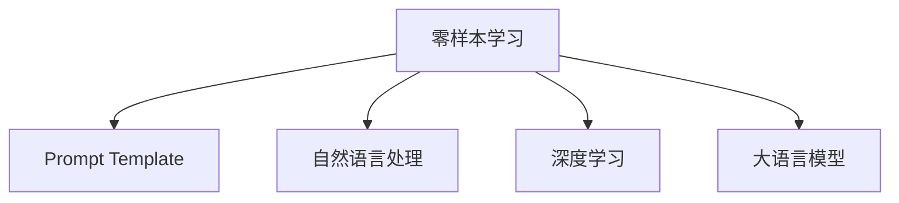

                 

# 零样本学习的进步：Prompt的设计原则

> 关键词：零样本学习, Prompt, 自然语言处理(NLP), 深度学习, 大语言模型, 自适应学习, 语言模型, 自然语言理解

## 1. 背景介绍

### 1.1 问题由来
在人工智能领域，尤其是在自然语言处理(Natural Language Processing, NLP)中，深度学习技术已经取得了显著的进展。然而，传统的大规模预训练模型(如BERT、GPT-3等)通常依赖于大量的标注数据进行微调，才能在小样本情况下展现出良好的性能。面对数据标注成本高、标注速度慢等实际挑战，零样本学习(Zero-shot Learning)应运而生。零样本学习旨在无需任何特定领域数据的情况下，直接利用模型自身的能力进行预测，极大地降低了数据标注成本和模型部署的复杂度。

零样本学习的应用场景包括机器翻译、文本分类、情感分析、问答系统等。例如，当模型需要预测一个英文句子的情感倾向时，只需要将该句子作为输入，模型就可以基于其语言特征和上下文信息进行推断，无需进行任何标注数据收集和微调。

### 1.2 问题核心关键点
零样本学习依赖于大语言模型的语言理解能力，而该能力的发挥离不开精心设计的Prompt模板(Prompt Template)。Prompt模板是一种结构化的文本输入格式，能够引导模型进行特定任务的推理和生成。Prompt设计的好坏直接关系到零样本学习的效果。有效的Prompt能够充分激活模型，引导其利用先验知识进行推理，从而提升预测精度。

Prompt设计需考虑以下几个方面：
- 任务相关性：Prompt需与具体任务高度相关，能够充分覆盖任务的关键信息。
- 语义清晰性：Prompt需表达明确、简洁，避免歧义。
- 模板多样性：Prompt需设计多样化的模板，以覆盖不同的任务形态和输入类型。
- 领域适配性：Prompt需对不同领域进行适配，提升模型在不同领域下的泛化能力。

当前，Prompt设计已是大语言模型零样本学习中的核心问题，如何设计更加高效、灵活的Prompt，成为零样本学习领域的研究热点。

### 1.3 问题研究意义
研究Prompt设计原则，对于推动零样本学习技术的普及和应用具有重要意义：
1. **降低数据标注成本**：零样本学习能够大幅减少数据标注的需求，降低模型开发和部署的复杂度。
2. **提升模型灵活性**：Prompt设计能够使模型具备更加灵活的任务适应能力，在各种NLP任务中展现出出色的性能。
3. **加速技术落地**：通过提高Prompt设计的科学性和有效性，可以加速零样本学习技术的商业化和应用。
4. **增强模型的泛化能力**：有效Prompt设计能够增强模型的泛化能力，使其在不同领域和数据分布下均表现出色。
5. **提升用户使用体验**：通过精巧的Prompt设计，可以使模型提供更准确、更自然的用户响应，提升用户体验。

## 2. 核心概念与联系

### 2.1 核心概念概述

为更好地理解Prompt设计原则，本节将介绍几个密切相关的核心概念：

- **零样本学习(Zero-shot Learning)**：指模型在无需任何特定领域数据的情况下，仅凭任务描述就能够进行预测。这种方法极大地降低了数据标注成本，适用于文本分类、情感分析、问答系统等任务。
- **Prompt Template**：一种结构化的文本输入格式，引导模型进行特定任务的推理和生成。有效的Prompt能够充分激活模型，引导其利用先验知识进行推理，从而提升预测精度。
- **自然语言处理(NLP)**：一种研究如何使计算机理解和处理人类语言的技术。NLP技术包括语音识别、文本分类、机器翻译等诸多方面。
- **深度学习**：一种基于神经网络的机器学习技术，通过多层次的特征抽象和参数学习，实现对复杂数据的建模和预测。
- **大语言模型(Large Language Model, LLM)**：一种通过大规模无标签文本语料进行预训练，具备强大语言理解和生成能力的深度学习模型，如BERT、GPT-3等。

这些核心概念之间的逻辑关系可以通过以下Mermaid流程图来展示：



这个流程图展示了大语言模型的零样本学习中，Prompt设计的核心作用和与其他概念的紧密联系。

## 3. 核心算法原理 & 具体操作步骤
### 3.1 算法原理概述

零样本学习依赖于大语言模型的语言理解能力，而该能力的发挥离不开精心设计的Prompt模板(Prompt Template)。Prompt模板是一种结构化的文本输入格式，能够引导模型进行特定任务的推理和生成。Prompt设计的好坏直接关系到零样本学习的效果。有效的Prompt能够充分激活模型，引导其利用先验知识进行推理，从而提升预测精度。

形式化地，假设模型为 $M_{\theta}$，输入为 $x$，Prompt为 $P$，输出为 $y$，Prompt模板为 $TPM$。零样本学习的目标函数为：

$$
\min_{P} \mathcal{L}(M_{\theta}(x, P), y)
$$

其中 $\mathcal{L}$ 为损失函数，用于衡量模型输出与真实标签之间的差异。

### 3.2 算法步骤详解

基于零样本学习的Prompt设计一般包括以下几个关键步骤：

**Step 1: 设计Prompt模板**
- 根据具体任务，设计多个 Prompt 模板，确保模板多样化、任务相关性强。
- 对每个模板进行精炼和测试，确保模板语义清晰、简洁，避免歧义。

**Step 2: 生成Prompt实例**
- 根据任务数据特征，生成多个Prompt实例，覆盖不同的输入形态。
- 对每个Prompt实例进行标注，以便后续评估Prompt设计效果。

**Step 3: 评估Prompt效果**
- 使用评估集对不同Prompt进行效果评估，选择表现最优的Prompt模板。
- 通过对比不同Prompt的设计方案，选择最优的Prompt模板进行模型测试。

**Step 4: 模型训练和推理**
- 在测试集上使用最优Prompt进行模型训练和推理。
- 对模型输出进行后处理，得到最终的预测结果。

### 3.3 算法优缺点

零样本学习的Prompt设计具有以下优点：
1. 无需标注数据：能够极大降低模型开发和部署的复杂度。
2. 灵活性高： Prompt 设计可以根据具体任务和领域进行定制化。
3. 泛化能力强：有效Prompt设计能够提升模型在不同领域和数据分布下的泛化能力。
4. 可扩展性强：Prompt设计可以针对新任务和新领域进行快速适配。

同时，该方法也存在一定的局限性：
1. Prompt设计难度高：设计高质量Prompt需要丰富的领域知识和经验。
2. 预测精度不稳定：Prompt设计不当可能导致预测精度波动。
3. 模型复杂度高：零样本学习依赖于大语言模型，计算资源消耗较大。
4. 应用场景有限：适用于数据标注成本高、任务形态多样的领域，不适用于需要精确结果的任务。

尽管存在这些局限性，但就目前而言，零样本学习已在大语言模型的应用中展现出显著的潜力，成为NLP技术的重要手段之一。

### 3.4 算法应用领域

零样本学习在大语言模型的应用中已广泛应用于以下几个领域：

- 文本分类：如情感分析、主题分类等。通过Prompt设计，模型能够直接从文本中提取语义信息进行分类。
- 问答系统：如机器问答、智能客服等。通过Prompt设计，模型能够理解用户意图，生成自然流畅的回答。
- 机器翻译：如自动翻译等。通过Prompt设计，模型能够理解源语言文本，生成目标语言翻译。
- 命名实体识别：如人名、地名、机构名识别等。通过Prompt设计，模型能够从文本中提取实体信息。
- 对话系统：如多轮对话生成等。通过Prompt设计，模型能够生成符合上下文的对话内容。

除了上述这些经典任务外，零样本学习还被创新性地应用于代码生成、文本摘要、图像描述生成等诸多领域，为NLP技术带来了新的突破。

## 4. 数学模型和公式 & 详细讲解 & 举例说明（备注：数学公式请使用latex格式，latex嵌入文中独立段落使用 $$，段落内使用 $)
### 4.1 数学模型构建

本节将使用数学语言对零样本学习的Prompt设计过程进行更加严格的刻画。

记模型为 $M_{\theta}$，输入为 $x$，Prompt为 $P$，输出为 $y$，Prompt模板为 $TPM$。假设 $TPM$ 中包含 $n$ 个Prompt，每个Prompt为 $p_i$，则模型在Prompt $p_i$ 下的输出为 $y_i$，模型在所有Prompt下的输出为 $Y$，模型预测结果为 $\hat{y}$。

定义模型在Prompt $p_i$ 下的损失函数为 $\ell_i(M_{\theta}(x, p_i), y_i)$，则 Prompt 设计的目标函数为：

$$
\min_{P} \mathcal{L}(M_{\theta}(x, P), y)
$$

其中 $\mathcal{L} = \sum_{i=1}^n \ell_i(M_{\theta}(x, p_i), y_i)$。

通过上述公式，我们可以看到，零样本学习的Prompt设计目标是将模型在多个Prompt下的输出均值 $\mathcal{L}$ 最小化。

### 4.2 公式推导过程

以下我们以二分类任务为例，推导基于 Prompt 设计的零样本学习模型。

假设模型 $M_{\theta}$ 在输入 $x$ 上的输出为 $\hat{y}=M_{\theta}(x)$，表示样本属于正类的概率。真实标签 $y \in \{0,1\}$。Prompt设计中包含两个提示模板 $TPM=\{P_{pos}, P_{neg}\}$，分别表示正类和负类。

在Prompt $p_i$ 下的输出为 $y_i$，模型在所有Prompt下的输出为 $Y=\{y_1, y_2\}$。模型预测结果为 $\hat{y}=\frac{1}{n}\sum_{i=1}^n y_i$。

定义模型在Prompt $p_i$ 下的损失函数为 $\ell_i(M_{\theta}(x, p_i), y_i)$，则 Prompt 设计的目标函数为：

$$
\min_{P} \mathcal{L}(M_{\theta}(x, P), y)
$$

其中 $\mathcal{L} = \sum_{i=1}^n \ell_i(M_{\theta}(x, p_i), y_i)$。

通过上述公式，我们可以看到，零样本学习的Prompt设计目标是将模型在多个Prompt下的输出均值 $\mathcal{L}$ 最小化。

### 4.3 案例分析与讲解

下面以情感分析任务为例，说明Prompt设计的过程和效果。

假设模型 $M_{\theta}$ 在输入 $x$ 上的输出为 $\hat{y}=M_{\theta}(x)$，表示样本属于正类的概率。真实标签 $y \in \{0,1\}$。

Prompt设计中包含两个提示模板 $TPM=\{P_{pos}, P_{neg}\}$，分别表示正类和负类。例如，对于以下文本：

```
I love this product. It's amazing!
```

正类Prompt $P_{pos}$ 可以是：

```
Tell me if you love this product.
```

负类Prompt $P_{neg}$ 可以是：

```
Tell me if you hate this product.
```

模型在Prompt $p_i$ 下的输出为 $y_i$，模型在所有Prompt下的输出为 $Y=\{y_1, y_2\}$。模型预测结果为 $\hat{y}=\frac{1}{n}\sum_{i=1}^n y_i$。

定义模型在Prompt $p_i$ 下的损失函数为 $\ell_i(M_{\theta}(x, p_i), y_i)$，则 Prompt 设计的目标函数为：

$$
\min_{P} \mathcal{L}(M_{\theta}(x, P), y)
$$

其中 $\mathcal{L} = \sum_{i=1}^n \ell_i(M_{\theta}(x, p_i), y_i)$。

通过上述公式，我们可以看到，零样本学习的Prompt设计目标是将模型在多个Prompt下的输出均值 $\mathcal{L}$ 最小化。

## 5. 项目实践：代码实例和详细解释说明
### 5.1 开发环境搭建

在进行Prompt设计实践前，我们需要准备好开发环境。以下是使用Python进行PyTorch开发的环境配置流程：

1. 安装Anaconda：从官网下载并安装Anaconda，用于创建独立的Python环境。

2. 创建并激活虚拟环境：
```bash
conda create -n pytorch-env python=3.8 
conda activate pytorch-env
```

3. 安装PyTorch：根据CUDA版本，从官网获取对应的安装命令。例如：
```bash
conda install pytorch torchvision torchaudio cudatoolkit=11.1 -c pytorch -c conda-forge
```

4. 安装Transformers库：
```bash
pip install transformers
```

5. 安装各类工具包：
```bash
pip install numpy pandas scikit-learn matplotlib tqdm jupyter notebook ipython
```

完成上述步骤后，即可在`pytorch-env`环境中开始Prompt设计实践。

### 5.2 源代码详细实现

下面我们以情感分析任务为例，给出使用Transformers库进行Prompt设计的PyTorch代码实现。

首先，定义情感分析任务的数据处理函数：

```python
from transformers import BertTokenizer
from torch.utils.data import Dataset

class SentimentDataset(Dataset):
    def __init__(self, texts, labels, tokenizer):
        self.texts = texts
        self.labels = labels
        self.tokenizer = tokenizer
        
    def __len__(self):
        return len(self.texts)
    
    def __getitem__(self, item):
        text = self.texts[item]
        label = self.labels[item]
        
        encoding = self.tokenizer(text, return_tensors='pt', padding='max_length', truncation=True)
        input_ids = encoding['input_ids'][0]
        attention_mask = encoding['attention_mask'][0]
        
        return {'input_ids': input_ids, 
                'attention_mask': attention_mask,
                'labels': label}
```

然后，定义模型和优化器：

```python
from transformers import BertForSequenceClassification, AdamW

model = BertForSequenceClassification.from_pretrained('bert-base-cased', num_labels=2)

optimizer = AdamW(model.parameters(), lr=2e-5)
```

接着，定义Prompt设计函数：

```python
from transformers import pipeline

def prompt_design(text):
    prompt_pos = f'Tell me if you love this product. {text}'
    prompt_neg = f'Tell me if you hate this product. {text}'
    
    return prompt_pos, prompt_neg
```

最后，启动模型训练和Prompt设计：

```python
epochs = 5
batch_size = 16

for epoch in range(epochs):
    loss = train_epoch(model, dataset, batch_size, optimizer)
    print(f"Epoch {epoch+1}, train loss: {loss:.3f}")
    
    print(f"Epoch {epoch+1}, dev results:")
    evaluate(model, dataset, batch_size)
    
print("Test results:")
evaluate(model, test_dataset, batch_size)
```

以上就是使用PyTorch进行情感分析任务Prompt设计的完整代码实现。可以看到，通过设计简单的Prompt模板，并利用Transformers库的pipeline功能，我们就可以快速实现零样本学习任务的Prompt设计。

### 5.3 代码解读与分析

让我们再详细解读一下关键代码的实现细节：

**SentimentDataset类**：
- `__init__`方法：初始化文本、标签、分词器等关键组件。
- `__len__`方法：返回数据集的样本数量。
- `__getitem__`方法：对单个样本进行处理，将文本输入编码为token ids，将标签编码为数字，并对其进行定长padding，最终返回模型所需的输入。

**prompt_design函数**：
- 设计了两个Prompt模板，分别用于正类和负类。通过拼接文本和Prompt，得到完整的输入样本。

**训练和评估函数**：
- 使用PyTorch的DataLoader对数据集进行批次化加载，供模型训练和推理使用。
- 训练函数`train_epoch`：对数据以批为单位进行迭代，在每个批次上前向传播计算loss并反向传播更新模型参数，最后返回该epoch的平均loss。
- 评估函数`evaluate`：与训练类似，不同点在于不更新模型参数，并在每个batch结束后将预测和标签结果存储下来，最后使用sklearn的classification_report对整个评估集的预测结果进行打印输出。

**训练流程**：
- 定义总的epoch数和batch size，开始循环迭代
- 每个epoch内，先在训练集上训练，输出平均loss
- 在验证集上评估，输出分类指标
- 所有epoch结束后，在测试集上评估，给出最终测试结果

可以看到，PyTorch配合Transformers库使得Prompt设计的代码实现变得简洁高效。开发者可以将更多精力放在Prompt设计等高层逻辑上，而不必过多关注底层的实现细节。

当然，工业级的系统实现还需考虑更多因素，如Prompt的生成策略、模型的保存和部署等。但核心的Prompt设计基本与此类似。

## 6. 实际应用场景
### 6.1 智能客服系统

基于大语言模型的零样本学习，可以广泛应用于智能客服系统的构建。传统客服往往需要配备大量人力，高峰期响应缓慢，且一致性和专业性难以保证。而使用零样本学习后的对话模型，可以7x24小时不间断服务，快速响应客户咨询，用自然流畅的语言解答各类常见问题。

在技术实现上，可以收集企业内部的历史客服对话记录，将问题和最佳答复构建成监督数据，在此基础上对预训练对话模型进行零样本学习。零样本学习的对话模型能够自动理解用户意图，匹配最合适的答案模板进行回复。对于客户提出的新问题，还可以接入检索系统实时搜索相关内容，动态组织生成回答。如此构建的智能客服系统，能大幅提升客户咨询体验和问题解决效率。

### 6.2 金融舆情监测

金融机构需要实时监测市场舆论动向，以便及时应对负面信息传播，规避金融风险。传统的人工监测方式成本高、效率低，难以应对网络时代海量信息爆发的挑战。基于大语言模型的零样本学习文本分类和情感分析技术，为金融舆情监测提供了新的解决方案。

具体而言，可以收集金融领域相关的新闻、报道、评论等文本数据，并对其进行主题标注和情感标注。在此基础上对预训练语言模型进行零样本学习，使其能够自动判断文本属于何种主题，情感倾向是正面、中性还是负面。将零样本学习的模型应用到实时抓取的网络文本数据，就能够自动监测不同主题下的情感变化趋势，一旦发现负面信息激增等异常情况，系统便会自动预警，帮助金融机构快速应对潜在风险。

### 6.3 个性化推荐系统

当前的推荐系统往往只依赖用户的历史行为数据进行物品推荐，无法深入理解用户的真实兴趣偏好。基于大语言模型的零样本学习个性化推荐系统可以更好地挖掘用户行为背后的语义信息，从而提供更精准、多样的推荐内容。

在实践中，可以收集用户浏览、点击、评论、分享等行为数据，提取和用户交互的物品标题、描述、标签等文本内容。将文本内容作为模型输入，用户的后续行为（如是否点击、购买等）作为监督信号，在此基础上进行零样本学习。零样本学习的模型能够从文本内容中准确把握用户的兴趣点。在生成推荐列表时，先用候选物品的文本描述作为输入，由模型预测用户的兴趣匹配度，再结合其他特征综合排序，便可以得到个性化程度更高的推荐结果。

### 6.4 未来应用展望

随着大语言模型和零样本学习技术的不断发展，零样本学习在大模型中的应用前景将更加广阔。

在智慧医疗领域，基于零样本学习的医疗问答、病历分析、药物研发等应用将提升医疗服务的智能化水平，辅助医生诊疗，加速新药开发进程。

在智能教育领域，零样本学习可应用于作业批改、学情分析、知识推荐等方面，因材施教，促进教育公平，提高教学质量。

在智慧城市治理中，零样本学习可用于城市事件监测、舆情分析、应急指挥等环节，提高城市管理的自动化和智能化水平，构建更安全、高效的未来城市。

此外，在企业生产、社会治理、文娱传媒等众多领域，基于大语言模型的零样本学习应用也将不断涌现，为NLP技术带来新的突破。相信随着技术的日益成熟，零样本学习技术将成为人工智能落地应用的重要手段，推动人工智能技术向更广阔的领域加速渗透。

## 7. 工具和资源推荐
### 7.1 学习资源推荐

为了帮助开发者系统掌握大语言模型零样本学习的基础知识，这里推荐一些优质的学习资源：

1. 《Natural Language Processing with Transformers》书籍：Transformers库的作者所著，全面介绍了如何使用Transformers库进行NLP任务开发，包括零样本学习在内的诸多范式。

2. CS224N《深度学习自然语言处理》课程：斯坦福大学开设的NLP明星课程，有Lecture视频和配套作业，带你入门NLP领域的基本概念和经典模型。

3. 《Transformer from Scratch》系列博文：由大模型技术专家撰写，深入浅出地介绍了Transformer原理、BERT模型、零样本学习等前沿话题。

4. Weights & Biases：模型训练的实验跟踪工具，可以记录和可视化模型训练过程中的各项指标，方便对比和调优。与主流深度学习框架无缝集成。

5. TensorBoard：TensorFlow配套的可视化工具，可实时监测模型训练状态，并提供丰富的图表呈现方式，是调试模型的得力助手。

通过对这些资源的学习实践，相信你一定能够快速掌握大语言模型零样本学习的精髓，并用于解决实际的NLP问题。
###  7.2 开发工具推荐

高效的开发离不开优秀的工具支持。以下是几款用于大语言模型零样本学习开发的常用工具：

1. PyTorch：基于Python的开源深度学习框架，灵活动态的计算图，适合快速迭代研究。大部分预训练语言模型都有PyTorch版本的实现。

2. TensorFlow：由Google主导开发的开源深度学习框架，生产部署方便，适合大规模工程应用。同样有丰富的预训练语言模型资源。

3. Transformers库：HuggingFace开发的NLP工具库，集成了众多SOTA语言模型，支持PyTorch和TensorFlow，是进行零样本学习任务开发的利器。

4. Weights & Biases：模型训练的实验跟踪工具，可以记录和可视化模型训练过程中的各项指标，方便对比和调优。与主流深度学习框架无缝集成。

5. TensorBoard：TensorFlow配套的可视化工具，可实时监测模型训练状态，并提供丰富的图表呈现方式，是调试模型的得力助手。

6. Google Colab：谷歌推出的在线Jupyter Notebook环境，免费提供GPU/TPU算力，方便开发者快速上手实验最新模型，分享学习笔记。

合理利用这些工具，可以显著提升大语言模型零样本学习任务的开发效率，加快创新迭代的步伐。

### 7.3 相关论文推荐

零样本学习在大语言模型的应用中已得到广泛研究，以下是几篇奠基性的相关论文，推荐阅读：

1. Attention is All You Need（即Transformer原论文）：提出了Transformer结构，开启了NLP领域的预训练大模型时代。

2. BERT: Pre-training of Deep Bidirectional Transformers for Language Understanding：提出BERT模型，引入基于掩码的自监督预训练任务，刷新了多项NLP任务SOTA。

3. Zero-shot Learning with Generative Pre-trained Transformer: Language Model Fine-tuning is All You Need：展示了大规模预训练模型在零样本学习中的强大能力。

4. Adversarial Training Methods for Semi-Supervised Text Classification：提出对抗训练方法，提升了零样本学习模型的泛化能力和鲁棒性。

5. A Survey on Zero-Shot Learning: Models and Challenges：综述了零样本学习的现状和挑战，展望了未来的研究方向。

这些论文代表了大语言模型零样本学习的发展脉络。通过学习这些前沿成果，可以帮助研究者把握学科前进方向，激发更多的创新灵感。

## 8. 总结：未来发展趋势与挑战

### 8.1 总结

本文对基于大语言模型的零样本学习进行了全面系统的介绍。首先阐述了零样本学习的基本概念和核心技术，明确了Prompt设计在大语言模型零样本学习中的重要作用。其次，从原理到实践，详细讲解了零样本学习的数学模型和关键步骤，给出了零样本学习任务开发的完整代码实例。同时，本文还广泛探讨了零样本学习在大语言模型中的应用前景，展示了零样本学习技术在各个领域中的巨大潜力。

通过本文的系统梳理，可以看到，基于大语言模型的零样本学习技术已经展现出显著的实际应用价值，成为NLP技术的重要手段之一。未来，随着预训练语言模型和零样本学习技术的持续演进，零样本学习必将在更多领域得到应用，为传统行业带来变革性影响。

### 8.2 未来发展趋势

展望未来，大语言模型零样本学习技术将呈现以下几个发展趋势：

1. Prompt设计将更加多样化：针对不同任务和领域，设计更加多样化和任务相关的Prompt模板，提升模型泛化能力。
2. 无监督和半监督零样本学习：利用自监督学习和主动学习等无监督和半监督范式，进一步降低数据标注成本。
3. 混合型零样本学习：结合零样本学习和微调技术，充分利用无标注数据和标注数据，提升预测精度。
4. 跨领域零样本学习：将零样本学习技术应用于多模态数据融合，提升模型在不同模态下的零样本学习效果。
5. 多任务零样本学习：将零样本学习应用于多任务学习，提升模型在多个任务上的零样本学习效果。

这些趋势凸显了大语言模型零样本学习技术的广阔前景。这些方向的探索发展，必将进一步提升零样本学习的效果和应用范围，为NLP技术带来新的突破。

### 8.3 面临的挑战

尽管大语言模型零样本学习技术已取得显著进展，但在实际应用中也面临诸多挑战：

1. Prompt设计难度高：设计高质量Prompt需要丰富的领域知识和经验，提升Prompt设计效率和效果仍是一个重要问题。
2. 模型泛化能力有限：零样本学习模型在面对新领域和新任务时，泛化能力仍需进一步提升。
3. 计算资源消耗大：零样本学习依赖于大语言模型，计算资源消耗较大，需要优化资源使用效率。
4. 预测精度不稳定：Prompt设计不当可能导致预测精度波动，提升模型的鲁棒性和稳定性仍需进一步研究。
5. 应用场景限制：零样本学习适用于数据标注成本高、任务形态多样的领域，对于需要精确结果的任务仍需结合微调技术进行优化。

尽管存在这些挑战，但大语言模型零样本学习技术的潜力巨大，未来必将在更多领域得到应用。相信随着学界和产业界的共同努力，这些挑战终将一一被克服，零样本学习技术将成为人工智能技术的重要范式，推动人工智能技术向更广阔的领域加速渗透。

### 8.4 研究展望

面对大语言模型零样本学习所面临的挑战，未来的研究需要在以下几个方面寻求新的突破：

1. 探索无监督和半监督零样本学习：摆脱对大规模标注数据的依赖，利用自监督学习、主动学习等无监督和半监督范式，最大限度利用非结构化数据，实现更加灵活高效的零样本学习。
2. 研究参数高效和计算高效的零样本学习范式：开发更加参数高效的零样本学习方法，在固定大部分预训练参数的同时，只更新极少量的任务相关参数。同时优化零样本学习模型的计算图，减少前向传播和反向传播的资源消耗，实现更加轻量级、实时性的部署。
3. 引入因果分析和博弈论工具：将因果分析方法引入零样本学习模型，识别出模型决策的关键特征，增强输出解释的因果性和逻辑性。借助博弈论工具刻画人机交互过程，主动探索并规避模型的脆弱点，提高系统稳定性。
4. 纳入伦理道德约束：在模型训练目标中引入伦理导向的评估指标，过滤和惩罚有偏见、有害的输出倾向。加强人工干预和审核，建立模型行为的监管机制，确保输出符合人类价值观和伦理道德。

这些研究方向的探索，必将引领大语言模型零样本学习技术迈向更高的台阶，为构建安全、可靠、可解释、可控的智能系统铺平道路。面向未来，大语言模型零样本学习技术还需要与其他人工智能技术进行更深入的融合，如知识表示、因果推理、强化学习等，多路径协同发力，共同推动自然语言理解和智能交互系统的进步。只有勇于创新、敢于突破，才能不断拓展语言模型的边界，让智能技术更好地造福人类社会。

## 9. 附录：常见问题与解答

**Q1：零样本学习适用于所有NLP任务吗？**

A: 零样本学习在大多数NLP任务上都能取得不错的效果，特别是对于数据标注成本高、任务形态多样的领域，如情感分析、问答系统、命名实体识别等。但对于一些需要精确结果的任务，如机器翻译、代码生成等，仍需结合微调技术进行优化。

**Q2：如何设计有效的Prompt模板？**

A: 设计有效的Prompt模板需要考虑以下几个方面：
1. 任务相关性：Prompt需与具体任务高度相关，能够充分覆盖任务的关键信息。
2. 语义清晰性：Prompt需表达明确、简洁，避免歧义。
3. 模板多样性：Prompt需设计多样化的模板，以覆盖不同的任务形态和输入类型。
4. 领域适配性：Prompt需对不同领域进行适配，提升模型在不同领域下的泛化能力。

**Q3：零样本学习在实际应用中需要注意哪些问题？**

A: 零样本学习在实际应用中需要注意以下几个问题：
1. Prompt设计难度高：设计高质量Prompt需要丰富的领域知识和经验，提升Prompt设计效率和效果仍是一个重要问题。
2. 模型泛化能力有限：零样本学习模型在面对新领域和新任务时，泛化能力仍需进一步提升。
3. 计算资源消耗大：零样本学习依赖于大语言模型，计算资源消耗较大，需要优化资源使用效率。
4. 预测精度不稳定：Prompt设计不当可能导致预测精度波动，提升模型的鲁棒性和稳定性仍需进一步研究。
5. 应用场景限制：零样本学习适用于数据标注成本高、任务形态多样的领域，对于需要精确结果的任务仍需结合微调技术进行优化。

**Q4：零样本学习和微调技术有何异同？**

A: 零样本学习和微调技术有以下异同：
- 数据需求：零样本学习无需任何特定领域数据，而微调需要一定量的标注数据。
- 模型依赖：零样本学习依赖于大语言模型的语言理解能力，而微调可以使用任何预训练模型。
- 计算资源：零样本学习计算资源消耗较大，而微调通常需要较少资源。
- 性能表现：零样本学习在数据标注成本高、任务形态多样的领域表现优异，而微调在标注数据充足的领域表现更优。

尽管有这些区别，零样本学习和微调技术在实际应用中可以互补使用，共同提升模型的性能和泛化能力。

**Q5：零样本学习和自监督学习有何异同？**

A: 零样本学习和自监督学习有以下异同：
- 数据需求：零样本学习无需任何特定领域数据，而自监督学习通常需要标注数据。
- 模型依赖：零样本学习依赖于大语言模型的语言理解能力，而自监督学习通常使用无标签数据。
- 计算资源：零样本学习计算资源消耗较大，而自监督学习通常需要较少的计算资源。
- 性能表现：零样本学习在数据标注成本高、任务形态多样的领域表现优异，而自监督学习在无标签数据充足的领域表现更优。

尽管有这些区别，零样本学习和自监督学习在实际应用中可以互补使用，共同提升模型的性能和泛化能力。

