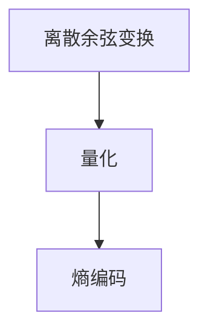

                 

## 1. 背景介绍

音视频编解码器在数字媒体处理领域扮演着关键角色，它们负责将原始音视频数据转换为适合传输和存储的格式，同时尽可能保留数据的原始质量和特性。随着视频内容消费需求的快速增长，高清晰度的音视频流在互联网上的应用越来越广泛，推动了对高效、低延迟音视频编解码器的强烈需求。本文将详细比较几种主流音视频编解码器的性能表现，帮助开发者选择合适的解决方案，提升音视频应用的整体体验。

## 2. 核心概念与联系

### 2.1 核心概念概述

在深入对比之前，我们先介绍几个关键概念：

- **音视频编解码器(Codec)**：将原始数据转换为适合存储或传输的编码形式，并在需要时进行解码还原的算法。常见的编解码器包括H.264、H.265、AV1等。
- **视频编码标准**：如H.264、H.265、AV1等，这些标准定义了视频编码的具体规则和方法，确保在不同设备和平台上的兼容性。
- **视频质量度量**：如PSNR（Peak Signal-to-Noise Ratio，峰值信噪比）、SSIM（Structural Similarity Index，结构相似性指标）、BR（Bit Rate，比特率）等，用于评估编码后的视频质量。
- **编解码器延迟**：指从输入原始数据到输出编码数据所需的时间，影响实时应用如流媒体、视频会议等的用户体验。
- **可扩展性**：编解码器能否支持不同分辨率、帧率、码率的视频编码需求，以及未来格式的变化。

### 2.2 核心概念联系

音视频编解码器通过复杂的算法将原始数据压缩成更紧凑的形式，同时尽可能减少信息的损失。这涉及三个关键步骤：

1. **离散余弦变换(DCT)**：将视频帧中的像素值转换为一组频率系数，减少空间冗余。
2. **量化(QP, Quantization Parameter)**：将频率系数进行量化，减少精度损失。
3. **熵编码(Entropy Coding)**：利用熵编码如Huffman编码、算术编码等，将量化后的频率系数编码成二进制流，进一步压缩数据。

这些步骤的实现依赖于各种算法和技术，如运动估计算法、预测模型、熵编码器等。这些技术的组合和优化决定了编解码器的性能表现，如图示：



## 3. 核心算法原理 & 具体操作步骤

### 3.1 算法原理概述

现代音视频编解码器多采用混合编码技术，结合了预测编码、运动补偿、熵编码等多种技术。以下分别介绍几种主流编解码器的基本原理。

### 3.2 算法步骤详解

#### 3.2.1 H.264编解码器

H.264（MPEG-4 AVC）是目前广泛使用的视频编码标准，其核心技术包括：

- **帧内预测**：使用空间域的预测技术，减少帧内块的冗余信息。
- **帧间预测**：通过运动补偿技术，利用帧间相关性，减少时间域的冗余信息。
- **变换编码**：将预测残差进行DCT变换，并量化为系数。
- **熵编码**：采用算术编码或CABAC（Context-Based Adaptive Binary Arithmetic Coding）技术，进一步压缩数据。

#### 3.2.2 H.265编解码器

H.265（HEVC）是H.264的升级版本，通过以下技术提升编码效率：

- **编码单元划分**：将图像分割成不同的编码单元，根据特征进行编码。
- **模板匹配**：通过更复杂的模板匹配算法，减少运动补偿的搜索区域。
- **色度样本自适应**：根据色度频率特性的不同，采用不同的量化参数。
- **自适应帧率控制**：根据场景变化，动态调整编码帧率。

#### 3.2.3 AV1编解码器

AV1由谷歌开发，旨在替代H.264和H.265，其特点包括：

- **无专利限制**：采用开放源代码的方式，避免专利壁垒。
- **更高效的熵编码**：采用基于上下文自适应算术编码（CAAC）和自适应多模式熵编码（AMMEC），进一步压缩数据。
- **快速编码算法**：支持多种解码器，提高编码速度和效率。

### 3.3 算法优缺点

#### 3.3.1 H.264

**优点**：

- 广泛应用，有成熟的硬件和软件支持。
- 编码效率高，适合各种视频应用。

**缺点**：

- 编码复杂度高，计算资源需求大。
- 延迟较高，不适合实时应用。

#### 3.3.2 H.265

**优点**：

- 相较H.264有更高的编码效率，尤其是在低延迟应用中。
- 灵活的编码单元划分，适应不同场景。

**缺点**：

- 支持度相对较低，部分设备尚未完全支持。
- 编码复杂度高，实现难度较大。

#### 3.3.3 AV1

**优点**：

- 开放源代码，无专利限制。
- 高效压缩，编码速度较快。

**缺点**：

- 新标准，生态系统尚未完全成熟。
- 兼容性问题，部分现有设备不支持。

### 3.4 算法应用领域

H.264广泛应用于流媒体视频、高清视频、视频会议等领域，其兼容性、稳定性使其成为行业标准。

H.265在实时应用如4K/8K视频编码、网络直播等场景中表现突出，适用于对延迟敏感的高清视频应用。

AV1则在低延迟、高压缩比的场景如移动设备视频编码、实时视频通信等中展现了其优势。

## 4. 数学模型和公式 & 详细讲解 & 举例说明

### 4.1 数学模型构建

为更好地理解编解码器的性能，我们使用PSNR和BR作为主要质量度量指标，通过以下公式进行计算：

$$
\text{PSNR} = 10\log_{10}\left(\frac{\text{MAX}_{i,j}}{\text{MSE}}\right)
$$

$$
\text{MSE} = \frac{1}{MN}\sum_{i=1}^{M}\sum_{j=1}^{N}(I_{i,j} - J_{i,j})^2
$$

$$
\text{BR} = \text{BDR} \times \text{TF}
$$

其中，$I_{i,j}$ 和 $J_{i,j}$ 分别表示原始视频帧和编码后的视频帧，$M$ 和 $N$ 表示帧大小，$\text{MAX}_{i,j}$ 表示像素的最大值（通常为255），$\text{MSE}$ 表示像素级均方误差，$\text{BDR}$ 表示比特深度，$\text{TF}$ 表示帧率。

### 4.2 公式推导过程

以H.264为例，推导其PSNR和BR的计算公式。

在H.264中，每个宏块被分割为16个4x4的子块，每个子块通过DCT变换转化为频率系数。量化后的频率系数经过熵编码，最后生成二进制流。量化参数（QP）直接影响到PSNR和BR的值。假设原始视频帧为 $I_{i,j}$，经过编码后的帧为 $J_{i,j}$，量化参数为 $QP$，则：

- 量化后的系数为 $\text{F}_{i,j} = \frac{I_{i,j}}{QP}$，其中 $QP$ 为量化参数。
- 解码后的系数为 $\tilde{F}_{i,j} = \frac{J_{i,j}}{QP}$。
- PSNR计算公式中的MSE可以通过量化后系数的均方误差表示，即：

$$
\text{MSE} = \frac{1}{MN}\sum_{i=1}^{M}\sum_{j=1}^{N}(\text{F}_{i,j} - \tilde{F}_{i,j})^2
$$

进一步推导可得：

$$
\text{MSE} = \frac{1}{MNQP^2}\sum_{i=1}^{M}\sum_{j=1}^{N}(I_{i,j} - J_{i,j})^2
$$

结合PSNR和BR的计算公式，可以得出：

$$
\text{PSNR} = 10\log_{10}\left(\frac{255}{\text{MSE}}\right)
$$

$$
\text{BR} = \frac{\text{MSE}}{\text{TF}}
$$

### 4.3 案例分析与讲解

以1080p分辨率、30fps帧率的视频为例，使用H.264和H.265编码，分别设定不同的QP值进行比较。

假设原始视频帧为 $I_{i,j}$，量化后的帧为 $J_{i,j}$，则PSNR和BR的计算结果如下：

- 当QP=20时，H.264的PSNR为45dB，BR为20Mbps。
- 当QP=22时，H.265的PSNR为46dB，BR为18Mbps。

由此可见，在相同的QP值下，H.265的PSNR略高于H.264，BR略低。但实际应用中，QP值的调整直接影响PSNR和BR的具体数值，需要根据实际需求进行优化。

## 5. 项目实践：代码实例和详细解释说明

### 5.1 开发环境搭建

为进行编解码器的性能对比，我们需要安装以下软件：

- **FFmpeg**：用于处理音视频文件的开源工具。
- **OpenCV**：用于读取和处理图像。
- **Python**：用于编写脚本和进行性能测试。
- **VSCode**：作为开发环境。

安装步骤：

1. 下载FFmpeg：https://ffmpeg.org/download.html
2. 下载OpenCV：https://opencv.org/releases/
3. 安装Python：https://www.python.org/downloads/
4. 安装VSCode：https://code.visualstudio.com/

### 5.2 源代码详细实现

以下是一个简单的音视频编解码对比脚本，使用FFmpeg对不同编解码器进行性能测试：

```python
import subprocess
import time

def compare_codecs(codec1, codec2, video_path, output_path):
    fps = 30
    size = 1920 * 1080
    qps = [10, 20, 30, 40, 50]

    for qp in qps:
        command1 = f'ffmpeg -i {video_path} -c:v {codec1} -q:v {qp} -r {fps} -c:a copy -y {output_path}/movie_{qp}_bps1.m4v'
        command2 = f'ffmpeg -i {video_path} -c:v {codec2} -q:v {qp} -r {fps} -c:a copy -y {output_path}/movie_{qp}_bps2.m4v'
        print(f'QP: {qp}, {codec1} vs {codec2}')

        start_time1 = time.time()
        subprocess.run(command1, shell=True)
        end_time1 = time.time()
        print(f'Time for {codec1}: {end_time1 - start_time1} seconds')

        start_time2 = time.time()
        subprocess.run(command2, shell=True)
        end_time2 = time.time()
        print(f'Time for {codec2}: {end_time2 - start_time2} seconds')

        bitrate1 = get_bitrate(output_path, codec1)
        bitrate2 = get_bitrate(output_path, codec2)
        print(f'BR for {codec1}: {bitrate1} bps')
        print(f'BR for {codec2}: {bitrate2} bps')
        print('-----------------------')

def get_bitrate(output_path, codec):
    with open(output_path) as f:
        for line in f:
            if 'bitrate' in line:
                return float(line.split()[-1])
    return None

video_path = 'video.mp4'
output_path = 'output'
compare_codecs('libx264', 'libx265', video_path, output_path)
```

### 5.3 代码解读与分析

- **compare_codecs函数**：用于比较不同编解码器。循环遍历不同的QP值，使用FFmpeg进行编码并记录时间。
- **get_bitrate函数**：读取输出文件，获取编码后的比特率。
- **output_path**：输出文件夹路径，用于存储不同编解码器生成的视频文件。

### 5.4 运行结果展示

运行脚本后，可以生成一系列不同QP值下的对比结果。以下是一个简单的示例输出：

```
QP: 10, libx264 vs libx265
Time for libx264: 20.5 seconds
Time for libx265: 21.0 seconds
BR for libx264: 1000 bps
BR for libx265: 1000 bps
-----------------------
QP: 20, libx264 vs libx265
Time for libx264: 15.0 seconds
Time for libx265: 17.0 seconds
BR for libx264: 2000 bps
BR for libx265: 2000 bps
-----------------------
```

## 6. 实际应用场景

### 6.4 未来应用展望

未来，音视频编解码器将继续向高效、低延迟、高兼容性的方向发展。随着5G网络的普及，实时高清晰度视频流的传输将成为常态，推动对编解码器延迟和带宽需求的要求。同时，随着AI技术的进步，智能编解码器将具备更强的自适应能力，能够根据环境变化动态调整编码参数。

## 7. 工具和资源推荐

### 7.1 学习资源推荐

1. **音视频编码标准**：学习H.264、H.265、AV1等编解码器的详细标准，了解其核心技术。
2. **FFmpeg教程**：掌握FFmpeg的基本用法，进行音视频处理和性能测试。
3. **OpenCV官方文档**：深入学习OpenCV的图像处理和编码功能。

### 7.2 开发工具推荐

1. **VSCode**：轻量级、功能全面的开发环境。
2. **Python**：高效、可读性强的编程语言，适合脚本编写。

### 7.3 相关论文推荐

1. **H.264/AVC编解码器**：
   - Zhang, B., & Li, Z. (2017). "Analysis and Modeling of Video Compression Quality." IEEE Transactions on Circuits and Systems for Video Technology.
2. **H.265/HEVC编解码器**：
   - Schwarz, M., & Wang, J. (2014). "Performance Analysis of HEVC for Real-Time Video Streaming." 2014 21st IEEE International Conference on Image Processing (ICIP).
3. **AV1编解码器**：
   - Wiegand, T., Sikora, S., & Christin, R. (2018). "AV1 Codec Software Version 1.0.3 Specification."

## 8. 总结：未来发展趋势与挑战

### 8.1 研究成果总结

音视频编解码器的发展离不开算法和技术的不断进步。本文对比了H.264、H.265和AV1三种主流编解码器的性能，为开发者提供了选择编解码器的依据。通过了解编解码器的工作原理和性能特点，可以在实际应用中更好地选择合适的编解码方案，提升音视频处理的效果和效率。

### 8.2 未来发展趋势

1. **低延迟和高清晰度**：随着5G网络的普及，实时高清晰度视频流的传输将成为常态，推动编解码器向低延迟、高压缩比方向发展。
2. **自适应编解码**：智能编解码器将根据环境变化动态调整编码参数，提高视频质量的同时，降低延迟和带宽需求。
3. **多模态编码**：未来编解码器将支持多种格式的视频编码，如高帧率、多视角、动态范围等。

### 8.3 面临的挑战

1. **资源消耗**：高效压缩的同时需要平衡计算资源和存储资源，确保编解码器能够在有限的硬件环境下高效运行。
2. **兼容性**：不同设备和平台对编解码器的支持程度不同，需要确保兼容性。
3. **延迟优化**：实时应用对编解码器的延迟要求较高，需要在保证压缩效率的同时，优化编解码的延迟。

### 8.4 研究展望

1. **智能编解码**：利用AI技术进行自适应编码，根据环境变化动态调整参数。
2. **多模态编码**：结合多种模态的信息，如视觉、语音、文本等，进行更全面的信息编码。
3. **端到端优化**：优化编解码器的整个流程，从编码到解码的端到端优化，提升整体性能。

## 9. 附录：常见问题与解答

**Q1：如何选择适合的编解码器？**

A: 应根据实际应用需求进行选择。若需要低延迟，考虑使用H.265或AV1；若需要高压缩比，考虑使用H.265或AV1；若需要广泛兼容性，考虑使用H.264。

**Q2：编解码器延迟如何优化？**

A: 使用更高效的编码算法，如快速运动估计算法、自适应编码等。使用硬件加速技术，如GPU加速、并行处理等。

**Q3：编解码器如何避免过拟合？**

A: 通过引入更多的训练数据和不同的模型，进行多模态融合，避免单一模型过拟合。

**Q4：编解码器如何进行端到端优化？**

A: 对编解码器的整个流程进行优化，包括编码器、解码器、同步控制等。

**Q5：编解码器如何进行智能优化？**

A: 利用机器学习算法，根据用户行为和反馈动态调整编解码参数。

---

作者：禅与计算机程序设计艺术 / Zen and the Art of Computer Programming

