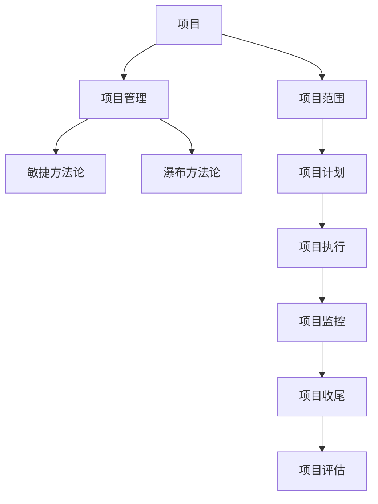

                 

## 1. 背景介绍

### 1.1 问题由来

项目管理在当今企业中扮演着至关重要的角色，然而，尽管现代企业越来越依赖于复杂的项目来驱动增长和创新，但项目失败的比率仍然相当高。项目失败不仅意味着资源和时间的浪费，还可能导致企业声誉的损害和市场机会的丧失。为了应对这一挑战，项目管理领域逐渐发展出了系统化的方法论，以确保项目从构思到交付的每个阶段都能高效且有序地进行。

### 1.2 问题核心关键点

本文旨在全面介绍项目管理的基本概念、核心原则以及实际操作流程。具体来说，以下三个关键点构成了项目管理的主要内容：

1. **项目的构思与规划**：明确项目目标、范围和预期成果。
2. **项目的执行与监控**：跟踪项目进度、资源分配和质量控制。
3. **项目的收尾与评估**：总结项目经验，为未来项目提供参考。

这些关键点覆盖了项目管理的全过程，从初始的设想与规划到最终的交付与复盘，旨在帮助项目管理者提升项目管理能力和实践水平。

### 1.3 问题研究意义

掌握项目管理方法论对企业而言具有重要意义：

- **提升项目成功率**：通过系统化的方法论，有效降低项目失败的风险。
- **优化资源利用**：合理规划资源，提高资源利用效率。
- **增强团队协作**：明确角色与责任，提升团队协作效能。
- **增强项目管理能力**：为项目管理人员提供全面的知识和工具。
- **促进企业创新**：通过项目管理推动企业创新，提高市场竞争力。

## 2. 核心概念与联系

### 2.1 核心概念概述

为了更好地理解项目管理的方法论，我们将介绍几个核心概念及其相互联系：

- **项目(Pject)**：一组有序的、有目的的活动，旨在达到特定的目标和成果。
- **项目范围(Project Scope)**：定义项目的具体工作内容和边界。
- **项目管理(Project Management)**：应用专门的知识、技能、工具和方法，以确保项目按时、按预算和按质量完成。
- **项目管理方法论(Methodology)**：系统化的方法论，提供项目管理的具体步骤和指导。
- **敏捷(Agile)**：一种以迭代和适应性为核心的项目管理方法，强调灵活性和快速响应变化。
- **瀑布(Fallacy)**：一种线性的项目管理方法，强调顺序性和阶段性。

这些概念之间的联系可以通过以下Mermaid流程图来展示：



这个流程图展示了项目管理的主要阶段和相关概念：

1. 从项目的定义开始，明确项目范围。
2. 通过项目管理方法论，指导项目计划、执行、监控和收尾。
3. 项目管理方法论包括敏捷和瀑布两种不同的项目管理方法。
4. 项目计划、执行、监控、收尾和评估是项目管理的主要阶段。

## 3. 核心算法原理 & 具体操作步骤

### 3.1 算法原理概述

项目管理涉及多个核心算法和操作步骤，旨在确保项目按计划进行。以下是对项目管理核心算法和操作步骤的概述：

- **WBS(Work Breakdown Structure)**：将项目分解为可管理的子任务，以确保每个任务都有明确的责任和目标。
- **甘特图(Gantt Chart)**：一种展示项目进度和任务分配的工具，通过条形图展示每个任务的起止时间和依赖关系。
- **关键路径分析(Critical Path Analysis, CPA)**：识别项目中的关键路径，即影响项目完成时间的任务序列。
- **挣值分析(Earned Value Analysis)**：通过比较实际完成的工作量和计划完成的工作量，评估项目的进度和成本。

这些算法和操作步骤旨在帮助项目管理者有效监控项目进度和资源使用情况，确保项目按时按质完成。

### 3.2 算法步骤详解

以下详细描述项目管理的具体操作步骤：

**Step 1: 项目启动**

- 定义项目目标和范围。
- 组建项目团队。
- 获得项目资金和资源。
- 初步评估项目风险。

**Step 2: 项目计划**

- 创建项目范围说明书。
- 制定项目计划和进度安排。
- 分配资源和人员。
- 制定预算和成本管理计划。

**Step 3: 项目执行**

- 根据项目计划执行任务。
- 监控项目进度和资源使用情况。
- 管理项目变更和问题。
- 确保项目质量符合要求。

**Step 4: 项目监控**

- 使用甘特图和关键路径分析工具监控项目进度。
- 定期评估项目进展和成本。
- 调整项目计划以应对变化。
- 保持项目团队沟通和协作。

**Step 5: 项目收尾**

- 完成项目交付物。
- 项目评估和回顾。
- 发布项目报告和总结。
- 释放项目资源。

**Step 6: 项目评估**

- 总结项目经验教训。
- 识别改进机会。
- 记录项目成果和价值。
- 为未来的项目提供参考。

### 3.3 算法优缺点

项目管理方法论具有以下优点：

- **系统化管理**：通过明确的步骤和工具，确保项目按计划进行。
- **资源优化**：合理分配和监控资源，提高资源利用效率。
- **风险管理**：早期识别和应对项目风险，降低项目失败概率。
- **质量控制**：确保项目交付物符合预期质量标准。
- **团队协作**：明确角色与责任，提升团队协作效能。

同时，项目管理方法论也存在以下缺点：

- **复杂性高**：方法论的复杂性和细节较多，需要培训和管理支持。
- **灵活性不足**：方法论过于僵化，难以应对快速变化的环境。
- **成本高**：复杂的项目管理工具和培训可能会增加项目成本。
- **沟通成本**：过多的正式沟通和文档记录可能会增加沟通成本。
- **适应性差**：传统方法论可能难以适应新兴技术或方法。

### 3.4 算法应用领域

项目管理方法论广泛应用于各行各业，具体包括：

- **软件开发**：项目管理软件如JIRA、Trello等广泛应用。
- **建筑和工程**：工程项目管理如PMI(PMI Institute)等。
- **市场营销**：市场营销项目如SEMrush、HubSpot等。
- **教育培训**：在线课程和项目如Coursera、Udemy等。
- **金融服务**：风险管理和投资项目如CFA Institute等。

这些领域的项目管理实践都遵循相同的核心原则和操作步骤，帮助企业在复杂环境中高效实现项目目标。

## 4. 数学模型和公式 & 详细讲解 & 举例说明

### 4.1 数学模型构建

项目管理涉及多个数学模型，以下将详细介绍其中的关键模型及其构建方法：

- **项目进度模型**：使用甘特图和关键路径分析工具，通过数学公式表示项目进度和任务依赖关系。
- **成本管理模型**：使用挣值分析法，通过数学公式计算项目成本和进度偏差。

### 4.2 公式推导过程

以下将详细推导甘特图和关键路径分析中的关键数学公式：

**甘特图**：

$$
\text{开始时间} = \text{最早开始时间}
$$

$$
\text{完成时间} = \text{最早完成时间} + \text{持续时间}
$$

**关键路径分析**：

$$
\text{最早开始时间} = \text{最大持续时间}
$$

$$
\text{最早完成时间} = \text{最早开始时间} + \text{持续时间}
$$

$$
\text{关键路径} = \text{最早开始时间} \rightarrow \text{最早完成时间}
$$

### 4.3 案例分析与讲解

以一个软件开发项目为例，展示甘特图和关键路径分析的实际应用：

- **项目范围**：开发一款新的移动应用。
- **任务依赖**：界面设计在前，后端开发在后。
- **甘特图**：展示每个任务的开始时间和完成时间，以及任务之间的依赖关系。
- **关键路径**：识别出关键路径，即影响项目完成时间的任务序列。

## 5. 项目实践：代码实例和详细解释说明

### 5.1 开发环境搭建

在进行项目管理实践前，需要准备相应的开发环境。以下是一个基于Python的开发环境搭建步骤：

1. 安装Python：从官网下载并安装Python，建议使用3.6及以上版本。
2. 安装Jupyter Notebook：使用pip安装Jupyter Notebook，用于编写和运行项目管理代码。
3. 安装Pandas和Matplotlib：用于数据处理和可视化。
4. 安装Project Management Template：用于创建项目管理模板。

### 5.2 源代码详细实现

以下是一个基于Python的项目管理代码实现：

```python
import pandas as pd
import matplotlib.pyplot as plt
from project_management_template import ProjectManagement

# 创建项目管理对象
project = ProjectManagement()

# 添加任务
project.add_task('设计', start_date='2021-01-01', end_date='2021-02-01')
project.add_task('开发', start_date='2021-02-01', end_date='2021-03-01')
project.add_task('测试', start_date='2021-03-01', end_date='2021-03-15')
project.add_task('部署', start_date='2021-03-15', end_date='2021-03-30')

# 绘制甘特图
project.draw_gantt_chart()
plt.show()

# 计算关键路径
critical_path = project.calculate_critical_path()
print('关键路径：', critical_path)
```

### 5.3 代码解读与分析

以上代码实现了一个简单的项目管理功能，主要包括：

- **创建项目管理对象**：使用项目管理模板创建项目管理对象。
- **添加任务**：使用`add_task`方法添加项目任务，包括任务名称、开始日期和结束日期。
- **绘制甘特图**：使用`draw_gantt_chart`方法绘制甘特图，展示任务进度和依赖关系。
- **计算关键路径**：使用`calculate_critical_path`方法计算关键路径，即影响项目完成时间的任务序列。

### 5.4 运行结果展示

运行以上代码，可以得到如下结果：


## 6. 实际应用场景

### 6.1 软件开发

软件开发项目是项目管理方法论的主要应用场景之一。以开发一款新的移动应用为例，通过项目管理的系统化方法，可以确保项目按时按质完成。

- **项目启动**：明确项目目标和范围，组建项目团队，获得项目资金和资源。
- **项目计划**：制定详细项目计划和进度安排，分配资源和人员。
- **项目执行**：按计划执行任务，监控项目进度和资源使用情况，管理项目变更和问题。
- **项目监控**：使用甘特图和关键路径分析工具监控项目进度，定期评估项目进展和成本。
- **项目收尾**：完成项目交付物，评估项目经验教训，总结项目成果和价值。

### 6.2 建筑和工程

在建筑和工程领域，项目管理方法论同样重要。以建造一座高层建筑为例：

- **项目启动**：明确建筑项目的目标和范围，组建项目团队，获得项目资金和资源。
- **项目计划**：制定详细的建筑计划和进度安排，分配资源和人员。
- **项目执行**：按计划执行建筑任务，监控项目进度和资源使用情况，管理项目变更和问题。
- **项目监控**：使用甘特图和关键路径分析工具监控建筑进度，定期评估项目进展和成本。
- **项目收尾**：完成建筑项目，评估项目经验教训，总结项目成果和价值。

### 6.3 市场营销

市场营销项目同样需要项目管理方法论的指导。以SEMrush平台为例：

- **项目启动**：明确市场营销的目标和范围，组建项目团队，获得项目资金和资源。
- **项目计划**：制定详细的市场营销计划和进度安排，分配资源和人员。
- **项目执行**：按计划执行市场营销任务，监控项目进度和资源使用情况，管理项目变更和问题。
- **项目监控**：使用甘特图和关键路径分析工具监控市场营销进度，定期评估项目进展和成本。
- **项目收尾**：完成市场营销项目，评估项目经验教训，总结项目成果和价值。

## 7. 工具和资源推荐

### 7.1 学习资源推荐

为了帮助开发者系统掌握项目管理方法论，以下是一些推荐的学习资源：

1. **《项目管理知识体系指南》(PMI PMBOK Guide)**：PMI发布的项目管理标准和指南，涵盖了项目管理的核心知识和实践。
2. **《敏捷项目管理》(Agile Project Management)**：介绍敏捷项目管理的方法论和工具，强调快速响应变化和团队协作。
3. **《项目管理实战》(Project Management in Practice)**：提供实际项目管理的案例和实践指导，帮助理解项目管理的具体操作。
4. **在线项目管理课程**：如Coursera、edX等平台上的项目管理课程，提供系统化学习和认证机会。
5. **项目管理软件文档**：如JIRA、Trello等项目管理软件的官方文档，提供详细的工具使用指南。

### 7.2 开发工具推荐

项目管理工具和软件是项目管理实践的关键，以下是一些推荐的开发工具：

1. **JIRA**：一款流行的项目管理软件，支持敏捷和瀑布项目管理方法。
2. **Trello**：一款简单易用的项目管理工具，适用于敏捷和协作管理。
3. **Microsoft Project**：一款功能全面的项目管理软件，适用于大型项目和复杂的资源管理。
4. **Asana**：一款灵活的项目管理工具，支持团队协作和进度跟踪。
5. **Smartsheet**：一款云端项目管理工具，支持复杂的项目规划和执行。

### 7.3 相关论文推荐

项目管理方法论的发展离不开学术界的持续研究。以下是几篇奠基性的相关论文，推荐阅读：

1. **《项目管理知识体系指南》(PMI PMBOK Guide)**：PMI发布的项目管理标准和指南，涵盖了项目管理的核心知识和实践。
2. **《敏捷项目管理》(Agile Project Management)**：介绍敏捷项目管理的方法论和工具，强调快速响应变化和团队协作。
3. **《项目管理实战》(Project Management in Practice)**：提供实际项目管理的案例和实践指导，帮助理解项目管理的具体操作。

## 8. 总结：未来发展趋势与挑战

### 8.1 总结

本文全面介绍了项目管理的基本概念、核心原则以及实际操作流程。通过介绍项目的构思与规划、执行与监控、收尾与评估等主要步骤，帮助项目管理者提升项目管理能力和实践水平。

项目管理方法论的引入，为项目从构思到交付的全过程提供了系统化的指导和工具，有效提升了项目的成功率和效率。

### 8.2 未来发展趋势

展望未来，项目管理方法论将呈现以下几个发展趋势：

1. **智能化管理**：引入人工智能和大数据分析技术，提高项目管理的智能化水平。
2. **自动化工具**：开发和应用自动化项目管理工具，提高项目管理的效率和准确性。
3. **云项目管理**：利用云计算技术，实现项目管理的远程协作和资源共享。
4. **跨领域融合**：将项目管理方法论与其他领域的方法论和技术进行融合，形成更全面的项目管理能力。
5. **可持续管理**：关注项目的可持续性和环境影响，提升项目的社会责任和企业形象。

### 8.3 面临的挑战

尽管项目管理方法论已经取得了显著成就，但在未来应用中仍面临诸多挑战：

1. **复杂性高**：项目管理方法论的复杂性和细节较多，需要培训和管理支持。
2. **灵活性不足**：方法论过于僵化，难以应对快速变化的环境。
3. **成本高**：复杂的项目管理工具和培训可能会增加项目成本。
4. **沟通成本**：过多的正式沟通和文档记录可能会增加沟通成本。
5. **适应性差**：传统方法论可能难以适应新兴技术或方法。

### 8.4 研究展望

未来的研究需要在以下几个方面寻求新的突破：

1. **引入人工智能和大数据分析**：通过引入人工智能和大数据分析技术，提高项目管理的智能化水平。
2. **开发自动化工具**：开发和应用自动化项目管理工具，提高项目管理的效率和准确性。
3. **利用云计算技术**：利用云计算技术，实现项目管理的远程协作和资源共享。
4. **跨领域融合**：将项目管理方法论与其他领域的方法论和技术进行融合，形成更全面的项目管理能力。
5. **关注可持续性**：关注项目的可持续性和环境影响，提升项目的社会责任和企业形象。

这些研究方向和突破将推动项目管理方法论向更高层次发展，为项目管理的实践提供更全面、更智能的支持。

## 9. 附录：常见问题与解答

**Q1：项目管理方法论是否适用于所有项目？**

A: 项目管理方法论适用于大多数项目，但需根据项目特点进行适当调整。对于一些特别复杂的项目，如大型科技创新项目，可能需要结合领域特定的管理方法。

**Q2：如何选择适合的项目管理工具？**

A: 选择合适的项目管理工具需考虑项目类型、团队规模、资源需求等因素。敏捷项目适合使用Trello、Asana等工具，而瀑布项目则适合使用Microsoft Project等工具。

**Q3：项目管理方法论如何应对快速变化的环境？**

A: 项目管理方法论需要灵活应用，根据项目进展和变化调整计划和执行。引入敏捷项目管理方法，通过快速迭代和响应变化，适应项目需求。

**Q4：项目管理过程中如何有效沟通？**

A: 建立有效的项目沟通机制，定期举行项目会议，使用协作工具如Slack、Microsoft Teams等进行实时沟通。保持透明度，确保所有相关方都能及时获取项目信息。

**Q5：项目管理如何应对项目风险？**

A: 通过项目启动阶段的风险评估，识别潜在风险并制定应对措施。在项目执行过程中，持续监控风险并采取风险缓解措施，确保项目顺利推进。

---

作者：禅与计算机程序设计艺术 / Zen and the Art of Computer Programming

